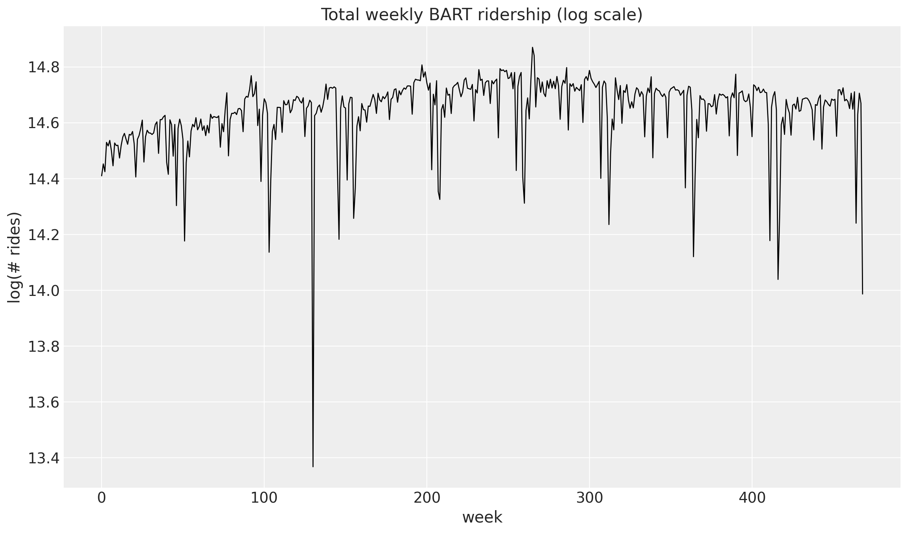
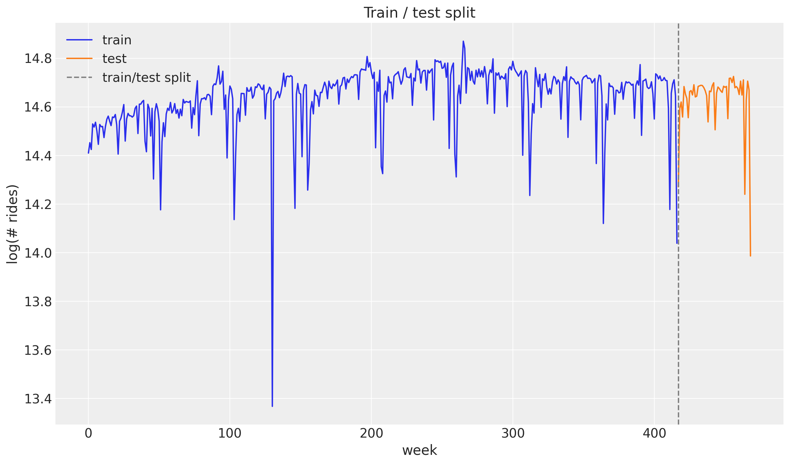
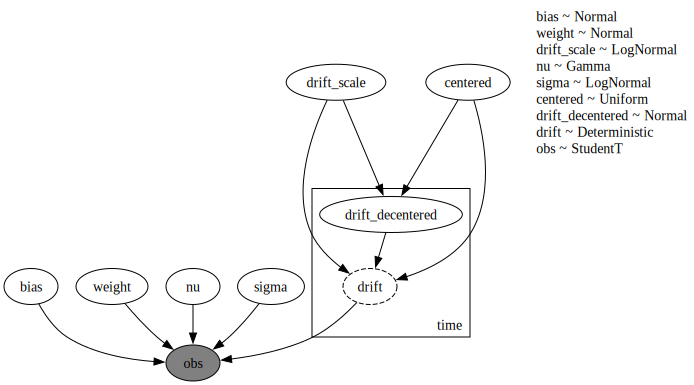
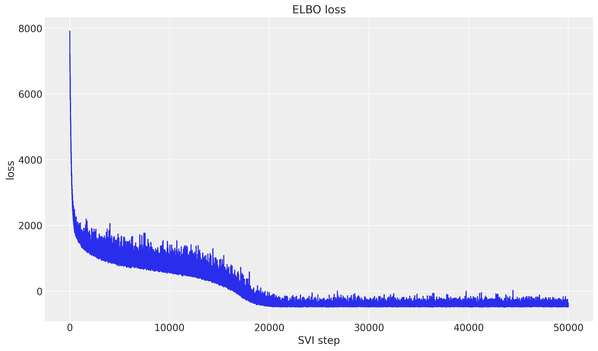
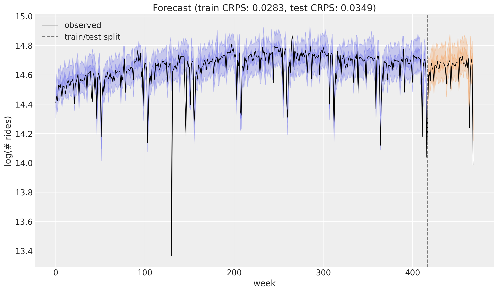
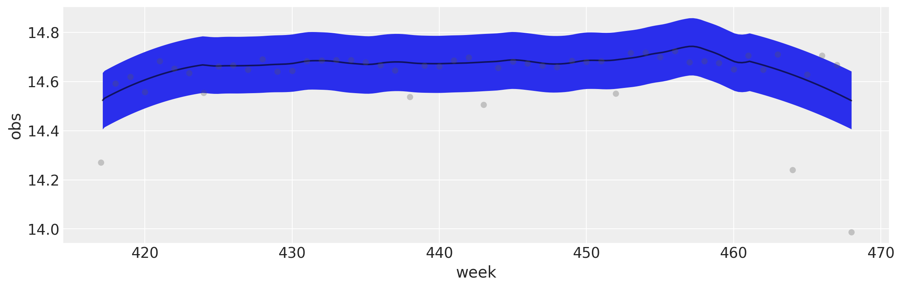

# Univariate forecasting with `numpyro_forecast`


This notebook ports the blog post [**Univariate time series forecasting with NumPyro**](https://juanitorduz.github.io/numpyro_forecasting-univariate/) (itself a port of Pyro's [forecasting tutorial](https://pyro.ai/examples/forecasting_i.html)) to the [`numpyro_forecast`](https://github.com/juanitorduz/numpyro_forecast) package. We forecast **weekly BART ridership** with a random-walk local level, Fourier seasonality and a Student-T likelihood, fit by SVI, and evaluate with CRPS.

Instead of hand-writing the NumPyro model and a bespoke prediction loop, we subclass [numpyro_forecast.forecaster.ForecastingModel](../../../reference/forecaster.ForecastingModel.md#numpyro_forecast.forecaster.ForecastingModel) and let [Forecaster](../../../reference/forecaster.Forecaster.md#numpyro_forecast.forecaster.Forecaster) handle the *fit-once / forecast-any-horizon* mechanics (the forecast horizon is drawn from separate `_future` latent sites, so the variational guide is never resized).

Visualizations use **ArviZ \>= 1.0** (`az.hdi` + `fill_between` for the multi-band predictive checks, `az.plot_lm` for the forecast-vs-observed panel).

> **Note on reproducibility.** We match the blog's data, seed, optimizer and step counts. Results reproduce the blog's behavior and CRPS magnitude but are not bit-for-bit identical: the forecast horizon uses the package's separate-`_future`-site mechanism (rather than re-running the guide over the full covariates), and the seasonal design uses [fourier_features](../../../reference/util.fourier_features.md#numpyro_forecast.util.fourier_features), an equivalent Fourier basis.


# Prepare notebook


    In [1]:


``` python
%load_ext autoreload
%autoreload 2
%load_ext jaxtyping
%jaxtyping.typechecker beartype.beartype
%config InlineBackend.figure_format = "retina"

import arviz as az
import jax.numpy as jnp
import matplotlib.pyplot as plt
import numpy as np
import numpyro
import numpyro.distributions as dist
import xarray as xr
from jax import random
from numpyro.infer import Predictive
from numpyro.infer.reparam import LocScaleReparam
from numpyro.optim import Adam

from numpyro_forecast import Forecaster, ForecastingModel, eval_crps
from numpyro_forecast.datasets import load_bart_weekly
from numpyro_forecast.typing import Array
from numpyro_forecast.util import fourier_features

az.style.use("arviz-darkgrid")
plt.rcParams["figure.figsize"] = [12, 7]
plt.rcParams["figure.dpi"] = 100
plt.rcParams["figure.facecolor"] = "white"

numpyro.set_host_device_count(n=4)

rng_key = random.PRNGKey(seed=42)
```


    /Users/juanitorduz/Documents/numpyro_forecast/.venv/lib/python3.14/site-packages/tqdm/auto.py:21: TqdmWarning: IProgress not found. Please update jupyter and ipywidgets. See https://ipywidgets.readthedocs.io/en/stable/user_install.html
      from .autonotebook import tqdm as notebook_tqdm


# Read data

We work with total **weekly** BART ridership: hourly counts summed over all origin-destination pairs and aggregated into non-overlapping weeks. The series grows roughly multiplicatively, so we model it on the log scale, where the trend and the seasonal swings are closer to additive. Throughout the package, time lives at axis `-2` and the observation dimension at axis `-1`, so a single series has shape `(weeks, 1)`.


    In [2]:


``` python
data = load_bart_weekly()  # (weeks, 1), log scale
duration = data.shape[0]
print("data shape:", data.shape)

fig, ax = plt.subplots()
ax.plot(np.asarray(data[:, 0]), color="black", lw=1)
ax.set(
    title="Total weekly BART ridership (log scale)",
    xlabel="week",
    ylabel="log(# rides)",
);
```


    data shape: (469, 1)


<figure class="figure">
<p></p>
</figure>


# Train-test split

We hold out the last `52` weeks (one full year) as the test set and train on the preceding `417` weeks. Keeping a whole year out means the test window covers a complete seasonal cycle, which is exactly where a seasonal model can over- or under-fit.


    In [3]:


``` python
T0 = 0
T2 = duration  # 469
T1 = T2 - 52  # 417: train / test split

y_train = data[T0:T1]
y_test = data[T1:T2]

time = np.arange(T2)
time_train = time[T0:T1]
time_test = time[T1:T2]
print("train:", y_train.shape, "test:", y_test.shape)

fig, ax = plt.subplots()
ax.plot(time_train, np.asarray(y_train[:, 0]), color="C0", label="train")
ax.plot(time_test, np.asarray(y_test[:, 0]), color="C1", label="test")
ax.axvline(T1, color="gray", ls="--", label="train/test split")
ax.legend()
ax.set(title="Train / test split", xlabel="week", ylabel="log(# rides)");
```


    train: (417, 1) test: (52, 1)


<figure class="figure">
<p></p>
</figure>


# Seasonal features

To capture the annual cycle we use a **Fourier** design matrix: `26` harmonics (so `52` sine and cosine columns) at a period of `365.25 / 7` weeks. Each harmonic is a sine/cosine pair at a multiple of the base frequency, and a weighted sum of them can approximate any smooth periodic shape. This spans the same subspace as the blog's `periodic_features`, so paired with the `Normal(0, 0.1)` weight prior the regression is equivalent. The plot below shows the first few low-frequency modes.


    In [4]:


``` python
num_terms = 26
covariates = fourier_features(duration, period=365.25 / 7, num_terms=num_terms)
covariates_train = covariates[T0:T1]
print("covariates shape:", covariates.shape)

fig, ax = plt.subplots()
for k in range(3):
    ax.plot(np.asarray(covariates[:, k]), label=f"sin mode {k + 1}")
ax.legend()
ax.set(title="First Fourier modes", xlabel="week");
```


    covariates shape: (469, 52)


<figure class="figure">
<p></p>
</figure>


# Model specification

The idea is a *local level model with seasonality*. The mean has three parts: a global `bias`, a random-walk level \\\ell_t\\ that lets the baseline drift slowly over time, and a Fourier regression for the annual cycle. The level moves by small Gaussian increments (the `drift`), so it can follow long-term changes without being told their shape in advance. For the likelihood we use a Student-T instead of a Normal: its heavy tails make the model robust to the occasional outlier week.

\\ \mu_t = \text{bias} + \ell_t + w^\top x_t, \qquad \ell_t = \ell\_{t-1} + \delta_t, \qquad \delta_t \sim \mathcal{N}(0, \sigma\_\text{drift}), \\ \\ y_t \sim \text{StudentT}(\nu, \mu_t, \sigma). \\

We subclass [ForecastingModel](../../../reference/forecaster.ForecastingModel.md#numpyro_forecast.forecaster.ForecastingModel) and write the generative story in [model](../../../reference/forecaster.ForecastingModel.md#numpyro_forecast.forecaster.ForecastingModel.model). The level is the cumulative sum of `drift`, which we sample with `self.time_series(...)` (the package's equivalent of the blog's `scan` over time). The single call to `self.predict(...)` registers the zero-centered Student-T noise around the predicted mean, and it is also what wires up the train-vs-forecast machinery: in-sample steps are observed, while the forecast horizon is drawn from separate `_future` latent sites so the variational guide never changes shape. Finally, a `LocScaleReparam` on the drift switches between centered and non-centered parameterizations, which helps the SVI geometry quite a lot.


    In [5]:


``` python
class UnivariateForecaster(ForecastingModel):
    """Local level + Fourier regression with Student-T observations."""

    def model(self, zero_data: Array | None, covariates: Array) -> None:
        """Define the univariate forecasting model."""
        num_features = covariates.shape[-1]

        bias = numpyro.sample("bias", dist.Normal(0.0, 10.0))
        weight = numpyro.sample("weight", dist.Normal(0.0, 0.1).expand([num_features]).to_event(1))
        drift_scale = numpyro.sample("drift_scale", dist.LogNormal(-20.0, 5.0))
        nu = numpyro.sample("nu", dist.Gamma(10.0, 2.0))
        sigma = numpyro.sample("sigma", dist.LogNormal(-5.0, 5.0))
        centered = numpyro.sample("centered", dist.Uniform(0.0, 1.0))

        drift = self.time_series(
            "drift",
            lambda: dist.Normal(0.0, drift_scale),
            reparam=LocScaleReparam(centered=centered),
        )
        level = jnp.cumsum(drift, axis=-2)
        regression = (weight * covariates).sum(axis=-1, keepdims=True)
        prediction = level + bias + regression

        self.predict(dist.StudentT(df=nu, loc=0.0, scale=sigma), prediction)
```


    In [6]:


``` python
numpyro.render_model(
    UnivariateForecaster(),
    model_args=(covariates_train, y_train),
    render_distributions=True,
)
```


<figure class="figure">
<p></p>
</figure>


# Prior predictive checks

As usual (highly recommended!), we look at the prior predictive before fitting anything. We draw from the prior over the training window (`data=None`, so the horizon is zero and the `obs` site spans the train period) and overlay the 50% and 94% HDI bands on the observed series. The priors are not very informative, but the implied ranges sit comfortably around the data, which is what we want.


    In [7]:


``` python
def hdi_bounds(samples: Array, prob: float) -> tuple[np.ndarray, np.ndarray]:
    arr = np.asarray(samples)
    da = xr.DataArray(arr[None], dims=["chain", "draw", "time"])
    band = az.hdi(da, prob=prob)
    return band.sel(ci_bound="lower").values, band.sel(ci_bound="upper").values


prior_predictive = Predictive(UnivariateForecaster(), num_samples=2_000, return_sites=["obs"])
rng_key, rng_subkey = random.split(rng_key)
prior_obs = prior_predictive(rng_subkey, covariates_train)["obs"][..., 0]

fig, ax = plt.subplots()
for prob in [0.94, 0.5]:
    lower, upper = hdi_bounds(prior_obs, prob)
    ax.fill_between(
        time_train,
        lower,
        upper,
        color="C0",
        alpha=0.2,
        label=f"{prob * 100:.0f}% HDI",
    )
ax.plot(time_train, np.asarray(y_train[:, 0]), color="black", lw=1, label="train")
ax.legend()
ax.set(title="Prior predictive check", xlabel="week", ylabel="log(# rides)");
```


<figure class="figure">
<p></p>
</figure>


# Inference with SVI

We fit the model with stochastic variational inference. Passing the model and data to [Forecaster](../../../reference/forecaster.Forecaster.md#numpyro_forecast.forecaster.Forecaster) runs SVI under the hood (an `AutoNormal` guide with `Adam`) and stores the fitted `guide`, `params` and the ELBO `losses`. The loss curve should decrease and flatten out, a quick sanity check that the optimization converged.


    In [8]:


``` python
rng_key, rng_subkey = random.split(rng_key)
model = UnivariateForecaster()
forecaster = Forecaster(
    rng_subkey,
    model,
    y_train,
    covariates_train,
    optim=Adam(step_size=0.005),
    num_steps=50_000,
)

fig, ax = plt.subplots()
ax.plot(forecaster.losses)
ax.set(title="ELBO loss", xlabel="SVI step", ylabel="loss");
```


<figure class="figure">
<p></p>
</figure>


# Posterior predictive check

We now look at two things. First the **in-sample** posterior predictive over the training window: here the horizon is zero, so the guide is not resized and we just sample the `obs` site. Then the **forecast** over the test horizon with `forecaster(...)`, which continues the level from its inferred endpoint and draws the future random-walk increments from the prior.

To score both we use the **continuous ranked probability score** (CRPS), a proper scoring rule that compares a single ground-truth value to the whole forecast distribution rather than just a point estimate. It rewards forecasts that are both sharp and calibrated, and lower is better.


    In [9]:


``` python
rng_key, key_post, key_pp, key_fc = random.split(rng_key, 4)

# In-sample posterior predictive over the training window.
posterior_samples = forecaster.guide.sample_posterior(
    key_post, forecaster.params, sample_shape=(5_000,)
)
train_pp = Predictive(model, posterior_samples=posterior_samples, return_sites=["obs"])(
    key_pp, covariates_train
)["obs"]

# Forecast over the test horizon.
forecast = forecaster(key_fc, y_train, covariates, num_samples=5_000)

crps_train = eval_crps(train_pp, y_train)
crps_test = eval_crps(forecast, y_test)
print(f"Train CRPS: {crps_train:.4f}")
print(f"Test CRPS:  {crps_test:.4f}")
```


    Train CRPS: 0.0283
    Test CRPS:  0.0349


# Forecast visualization

The combined view puts everything together: the in-sample posterior predictive (blue) and the forecast over the held-out year (orange), each with 50% and 94% HDI bands, against the observed series. The forecast tracks the seasonal pattern and the uncertainty widens into the future, as it should.


    In [10]:


``` python
train_obs = train_pp[..., 0]
forecast_obs = forecast[..., 0]

fig, ax = plt.subplots()
for prob in [0.94, 0.5]:
    lower, upper = hdi_bounds(train_obs, prob)
    ax.fill_between(time_train, lower, upper, color="C0", alpha=0.2)
    lower, upper = hdi_bounds(forecast_obs, prob)
    ax.fill_between(time_test, lower, upper, color="C1", alpha=0.2)
ax.plot(time, np.asarray(data[:, 0]), color="black", lw=1, label="observed")
ax.axvline(T1, color="gray", ls="--", label="train/test split")
ax.legend()
ax.set(
    title=f"Forecast (train CRPS: {crps_train:.4f}, test CRPS: {crps_test:.4f})",
    xlabel="week",
    ylabel="log(# rides)",
);
```


<figure class="figure">
<p></p>
</figure>


For a closer look at the test horizon, an ArviZ `plot_lm` panel shows the 94% forecast band against the held-out observations.


    In [11]:


``` python
idata = az.from_dict(
    {
        "posterior_predictive": {"obs": np.asarray(forecast_obs)[None]},
        "observed_data": {"obs": np.asarray(y_test[:, 0])},
        "constant_data": {"week": time_test.astype(float)},
    },
    coords={"time": time_test.astype(float)},
    dims={"obs": ["time"], "week": ["time"]},
)
az.plot_lm(idata, y="obs", x="week", ci_kind="hdi", ci_prob=0.94);
```


<figure class="figure">
<p></p>
</figure>


# Next steps

This local level model with seasonality is a solid baseline. From here a few directions are natural: add holiday or special-event effects (dummy variables or Gaussian bump functions) for days the smooth seasonal basis cannot capture, run a rolling-origin evaluation with `numpyro_forecast.backtest` to get a more honest picture of generalization, or move to many related series at once. The last of these is the subject of the two companion notebooks, [hierarchical forecasting I](hierarchical_forecasting_1.md) and [II](hierarchical_forecasting_2.md), which generalize this same model to a panel of BART stations. See also Pyro's original [forecasting tutorial](https://pyro.ai/examples/forecasting_i.html).
