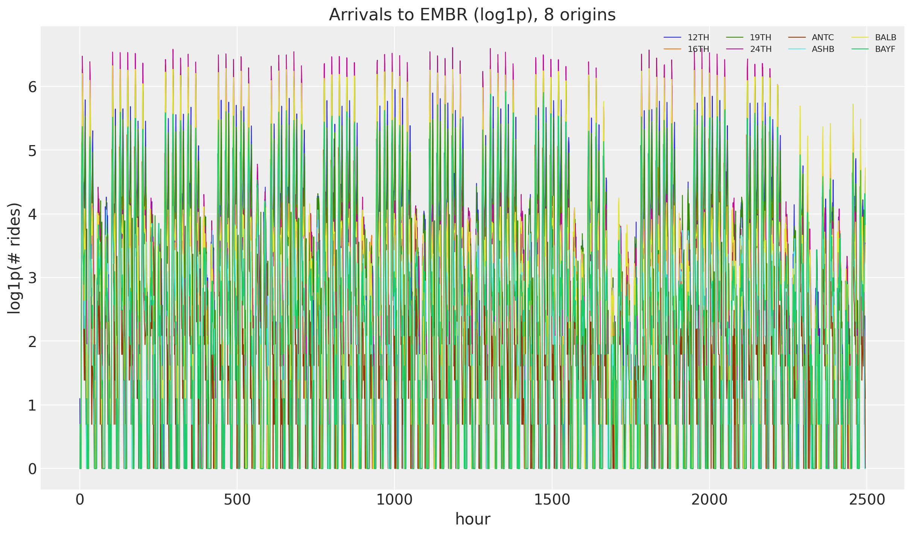
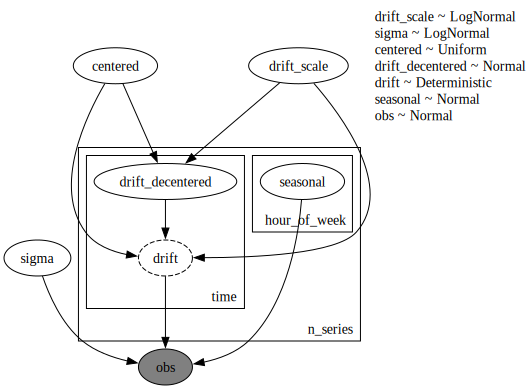
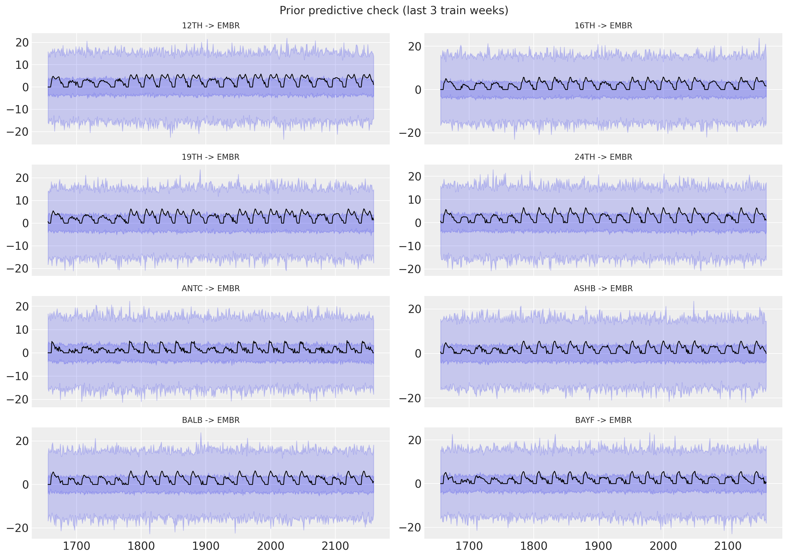
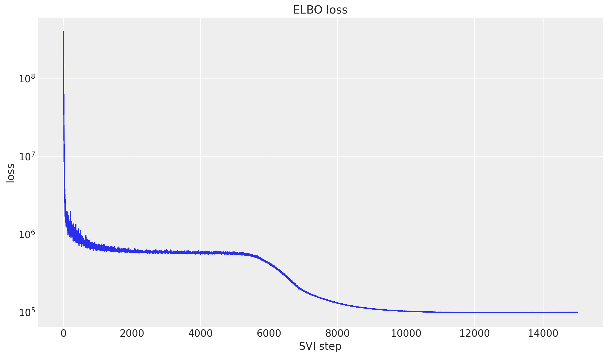
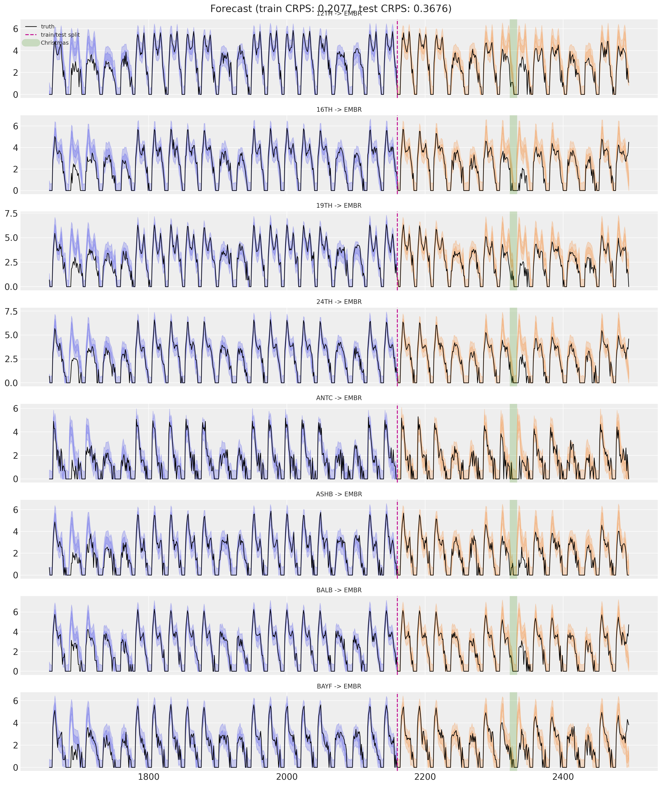

# Hierarchical forecasting I


Hierarchical forecasting I with `numpyro_forecast`

This notebook ports the blog post [**Hierarchical forecasting with NumPyro (part I)**](https://juanitorduz.github.io/numpyro_hierarchical_forecasting_1/) to the [`numpyro_forecast`](https://github.com/juanitorduz/numpyro_forecast) package. It generalizes the [univariate notebook](forecasting_univariate.md) from a single series to many: we forecast hourly **BART arrivals to one destination** (`EMBR`, Embarcadero) from all `50` origin stations at once. Each origin keeps its own random-walk level and weekly seasonality, but they share global hyperparameters and a single observation scale, which lets information pool across the series.

We subclass `numpyro_forecast.ForecastingModel` and let [Forecaster](../../reference/forecaster.Forecaster.md#numpyro_forecast.forecaster.Forecaster) handle the *fit-once / forecast-any-horizon* mechanics. Visualizations use **ArviZ \>= 1.0** (`az.hdi` + `fill_between`).

> **Note on reproducibility.** We match the blog's data, seed, optimizer and step counts. Results reproduce the blog's behavior and CRPS magnitude but are not bit-for-bit identical: the forecast horizon uses the package's separate-`_future`-site mechanism rather than re-running the guide over the full covariates.


# Prepare notebook


``` python
%load_ext autoreload
%autoreload 2
%load_ext jaxtyping
%jaxtyping.typechecker beartype.beartype
%config InlineBackend.figure_format = "retina"

from typing import cast

import arviz as az
import jax.numpy as jnp
import matplotlib.pyplot as plt
import numpy as np
import numpyro
import numpyro.distributions as dist
import pandas as pd
import xarray as xr
from jax import random
from numpyro.infer import Predictive
from numpyro.infer.reparam import LocScaleReparam
from numpyro.optim import Adam

from numpyro_forecast import Forecaster, ForecastingModel, eval_crps
from numpyro_forecast.datasets import load_bart_hierarchical
from numpyro_forecast.typing import Array
from numpyro_forecast.util import periodic_repeat

az.style.use("arviz-darkgrid")
plt.rcParams["figure.figsize"] = [12, 7]
plt.rcParams["figure.dpi"] = 100
plt.rcParams["figure.facecolor"] = "white"

numpyro.set_host_device_count(n=4)

rng_key = random.PRNGKey(seed=42)
period = 24 * 7  # weekly seasonality (hours)
```


# Read data

We load the windowed origin-destination panel (`log1p` counts, `90` training days plus `2` test weeks) and select arrivals to `EMBR` from every origin. The `log1p` transform tames the multiplicative growth while staying defined at zero rides, which matters for hourly counts. The result is a `(time, n_series)` array where each of the `50` origins is one series, time is at axis `-2`, and the series dimension is at axis `-1`.


``` python
y_full, split, stations = load_bart_hierarchical()
embr = stations.index("EMBR")
data = jnp.swapaxes(y_full[:, :, embr], 0, 1)  # (time, n_series)
n_series = data.shape[-1]
print("data shape:", data.shape, "| split:", split)

fig, ax = plt.subplots()
for i in range(8):
    ax.plot(np.asarray(data[:, i]), lw=0.8, label=stations[i])
ax.legend(ncol=4, fontsize=8)
ax.set(title="Arrivals to EMBR (log1p), 8 origins", xlabel="hour", ylabel="log1p(# rides)");
```


    data shape: (2496, 50) | split: 2160


<figure class="figure">
<p></p>
</figure>


# Train-test split

We hold out the last two weeks (`336` hours) for testing. The model learns seasonality internally from the time index, so the covariates here are just dummy zeros: only their shape (the duration) is read, to tell training from forecasting.


``` python
T0 = 0
T1 = split  # 2_160
T2 = data.shape[0]  # 2_496

y_train = data[T0:T1]
y_test = data[T1:T2]
covariates = jnp.zeros((T2, n_series))
covariates_train = covariates[T0:T1]

time = np.arange(T2)
time_train = time[T0:T1]
time_test = time[T1:T2]
print("train:", y_train.shape, "test:", y_test.shape)

# Christmas anomaly index (BART series starts 2011-01-01, hourly).
dates = pd.date_range("2011-01-01", periods=78_888, freq="h")[-T2:]
christmas = np.flatnonzero((dates.month == 12) & (dates.day == 25))
christmas_index = int(christmas[0]) if len(christmas) else None
print("christmas index:", christmas_index)
```


    train: (2160, 50) test: (336, 50)
    christmas index: 2328


# Model specification

This is the univariate model lifted to a panel. Each series \\s\\ gets its own random-walk level \\\ell\_{t,s}\\ and its own weekly seasonal profile (one value per hour-of-week, `168` in total), and all series share the same global drift scale and observation scale \\\sigma\\:

\\ \mu\_{t,s} = \ell\_{t,s} + \text{seasonal}\_{(t \bmod \text{period}),\\s},\qquad \ell\_{t,s} = \ell\_{t-1,s} + \delta\_{t,s}, \\ \\ y\_{t,s} \sim \mathcal{N}(\mu\_{t,s}, \sigma). \\

The hierarchy is expressed with `numpyro.plate`. We wrap `self.time_series(...)` in an `n_series` plate so the drift (and its forecast `_future` companion) is sampled per series. The weekly seasonal lives under the `n_series` and `hour_of_week` plates, so it is estimated once per hour-of-week per series, then tiled across the full horizon with [periodic_repeat](../../reference/util.periodic_repeat.md#numpyro_forecast.util.periodic_repeat). Sharing the global hyperparameters across the plate is what couples the series together.


``` python
class MultiSeriesForecaster(ForecastingModel):
    """Per-series local level + weekly seasonality with a shared Normal scale."""

    def __init__(self, period: int = 24 * 7) -> None:
        super().__init__()
        self.period = period

    def model(self, zero_data: Array | None, covariates: Array) -> None:
        """Define the multi-series forecasting model."""
        n_series = covariates.shape[-1]
        duration = covariates.shape[-2]

        drift_scale = numpyro.sample("drift_scale", dist.LogNormal(-20.0, 5.0))
        sigma = numpyro.sample("sigma", dist.LogNormal(-5.0, 5.0))
        centered = numpyro.sample("centered", dist.Uniform(0.0, 1.0))

        with numpyro.plate("n_series", n_series, dim=-1):
            drift = self.time_series(
                "drift",
                lambda: dist.Normal(0.0, drift_scale),
                reparam=LocScaleReparam(centered=centered),
            )
            with numpyro.plate("hour_of_week", self.period, dim=-2):
                seasonal = cast("Array", numpyro.sample("seasonal", dist.Normal(0.0, 5.0)))

        level = jnp.cumsum(drift, axis=-2)
        prediction = level + periodic_repeat(seasonal, duration, axis=-2)

        self.predict(dist.Normal(0.0, sigma), prediction)
```


``` python
numpyro.render_model(
    MultiSeriesForecaster(period=period),
    model_args=(covariates_train, y_train),
    render_distributions=True,
)
```


<figure class="figure">
<p></p>
</figure>


# Prior predictive checks

As usual (highly recommended!), we run prior predictive checks before fitting. We draw from the prior over the training window and overlay the 50% and 94% HDI bands on the last three weeks of training data for eight origins. The ranges look reasonable: wide enough to admit the data without being absurd.


``` python
def hdi_bounds(samples: Array | np.ndarray, prob: float) -> tuple[np.ndarray, np.ndarray]:
    arr = np.asarray(samples)
    da = xr.DataArray(arr[None], dims=["chain", "draw", "time"])
    band = az.hdi(da, prob=prob)
    return band.sel(ci_bound="lower").values, band.sel(ci_bound="upper").values


prior_predictive = Predictive(
    MultiSeriesForecaster(period=period), num_samples=2_000, return_sites=["obs"]
)
rng_key, rng_subkey = random.split(rng_key)
prior_obs = prior_predictive(rng_subkey, covariates_train)["obs"]

lo = T1 - 3 * period  # last three weeks of train
fig, axes = plt.subplots(nrows=4, ncols=2, figsize=(14, 10), sharex=True)
for i, ax in enumerate(axes.ravel()):
    for prob in [0.94, 0.5]:
        lower, upper = hdi_bounds(prior_obs[:, lo:T1, i], prob)
        ax.fill_between(time_train[lo:T1], lower, upper, color="C0", alpha=0.2)
    ax.plot(time_train[lo:T1], np.asarray(y_train[lo:T1, i]), color="black", lw=1)
    ax.set_title(f"{stations[i]} -> EMBR", fontsize=10)
fig.suptitle("Prior predictive check (last 3 train weeks)", fontsize=14)
fig.tight_layout();
```


<figure class="figure">
<p></p>
</figure>


# Inference with SVI

We fit the model with SVI through [Forecaster](../../reference/forecaster.Forecaster.md#numpyro_forecast.forecaster.Forecaster) (an `AutoNormal` guide with `Adam`). Plotting the ELBO on a log scale makes the convergence easy to read.


``` python
rng_key, rng_subkey = random.split(rng_key)
model = MultiSeriesForecaster(period=period)
forecaster = Forecaster(
    rng_subkey,
    model,
    y_train,
    covariates_train,
    optim=Adam(step_size=0.05),
    num_steps=15_000,
)

fig, ax = plt.subplots()
ax.plot(forecaster.losses)
ax.set_yscale("log")
ax.set(title="ELBO loss", xlabel="SVI step", ylabel="loss");
```


<figure class="figure">
<p></p>
</figure>


# Posterior predictive check

We draw the in-sample posterior predictive over the train window and the forecast over the test horizon, then score both with CRPS. Since the data live on the `log1p` scale, which is non-negative, we clip the predictions at zero before scoring.


``` python
rng_key, key_post, key_pp, key_fc = random.split(rng_key, 4)

posterior_samples = forecaster.guide.sample_posterior(
    key_post, forecaster.params, sample_shape=(1_500,)
)
train_pp = Predictive(model, posterior_samples=posterior_samples, return_sites=["obs"])(
    key_pp, covariates_train
)["obs"]

forecast = forecaster(key_fc, y_train, covariates, num_samples=1_500)

train_pp = jnp.clip(train_pp, min=0.0)
forecast = jnp.clip(forecast, min=0.0)

crps_train = eval_crps(train_pp, y_train)
crps_test = eval_crps(forecast, y_test)
print(f"Train CRPS: {crps_train:.4f}")
print(f"Test CRPS:  {crps_test:.4f}")
```


    Train CRPS: 0.2077
    Test CRPS:  0.3676


# Forecast visualization

Eight origins arriving at `EMBR`: the in-sample posterior predictive (blue, last three train weeks) and the forecast (orange) with 50% and 94% HDI bands, the train/test split, and the observed series in black. The shaded band marks Christmas day.

The model does quite well on most of the test window, but it clearly struggles around Christmas: ridership collapses on the holiday and the forecast, which only knows about the weekly cycle, does not see it coming. This is the expected failure mode of a model without holiday information. The fixes are to feed it more history (so it has seen past Christmases) or to add explicit holiday features, for example dummy variables or Gaussian bump functions around special dates.


``` python
fig, axes = plt.subplots(nrows=8, ncols=1, figsize=(15, 18), sharex=True)
for i, ax in enumerate(axes):
    for prob in [0.94, 0.5]:
        lower, upper = hdi_bounds(train_pp[:, lo:T1, i], prob)
        ax.fill_between(time_train[lo:T1], lower, upper, color="C0", alpha=0.2)
        lower, upper = hdi_bounds(forecast[:, :, i], prob)
        ax.fill_between(time_test, lower, upper, color="C1", alpha=0.2)
    ax.plot(time[lo:T2], np.asarray(data[lo:T2, i]), color="black", lw=1, label="truth")
    ax.axvline(T1, color="C3", ls="--", label="train/test split")
    if christmas_index is not None:
        ax.axvline(christmas_index, color="C2", lw=12, alpha=0.2, label="Christmas")
    ax.set_title(f"{stations[i]} -> EMBR", fontsize=10)
axes[0].legend(loc="upper left", fontsize=9)
fig.suptitle(
    f"Forecast (train CRPS: {crps_train:.4f}, test CRPS: {crps_test:.4f})",
    fontsize=16,
)
fig.tight_layout();
```


<figure class="figure">
<p></p>
</figure>


# Next steps

Here we pooled `50` origins into a single destination. In [part II](hierarchical_forecasting_2.md) we model the full `50x50` origin-destination panel at once, adding a static pairwise station affinity and separate origin and destination noise scales.

[Source: Hierarchical forecasting I with `numpyro_forecast`](_src/hierarchical_forecasting_1-preview.html#895f1dbe)
