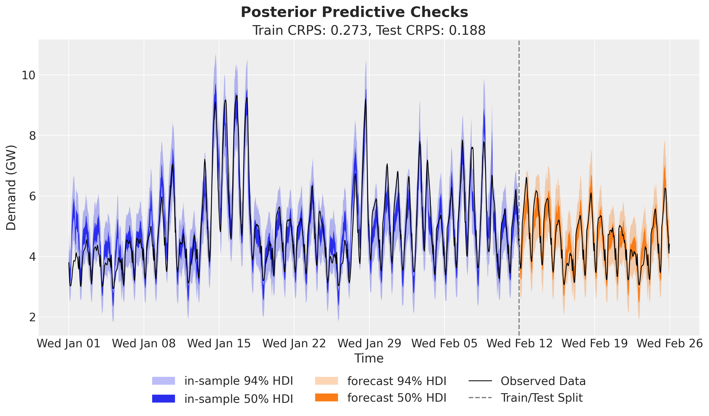
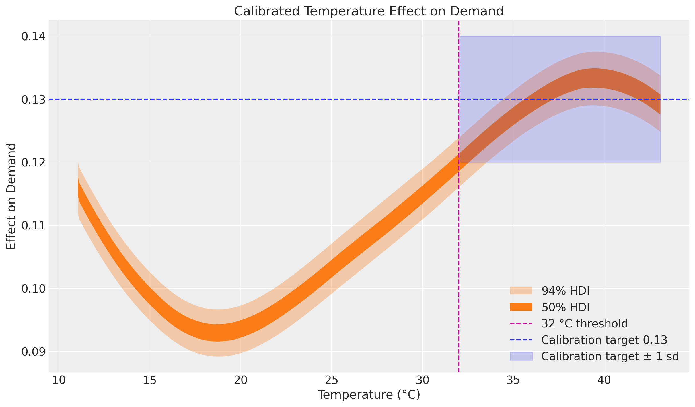
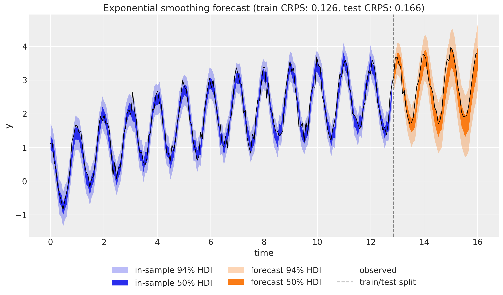
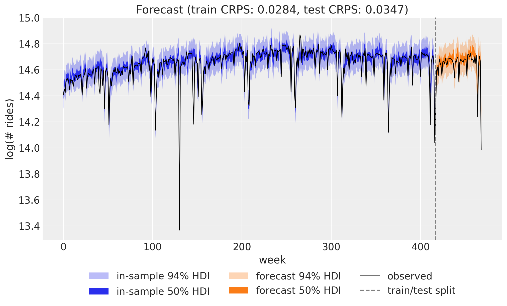
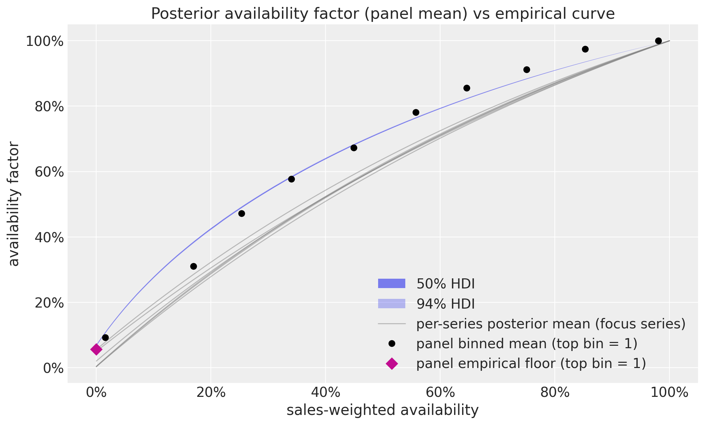
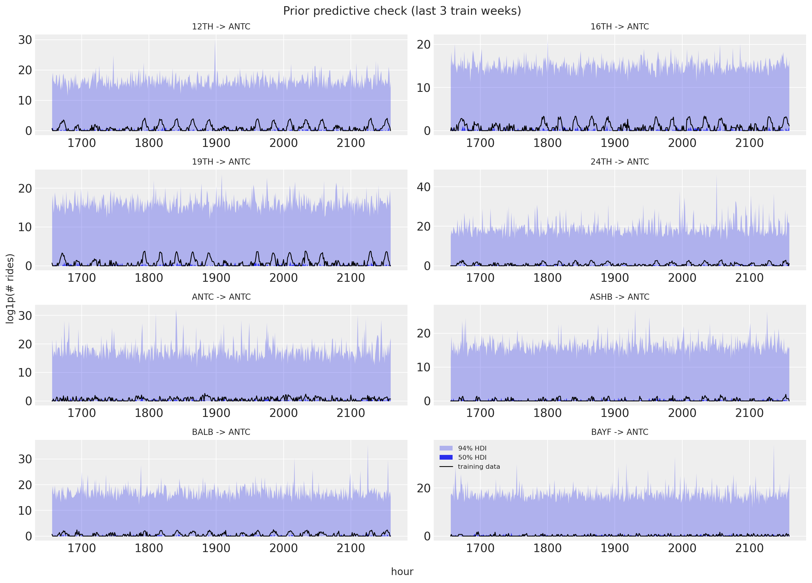
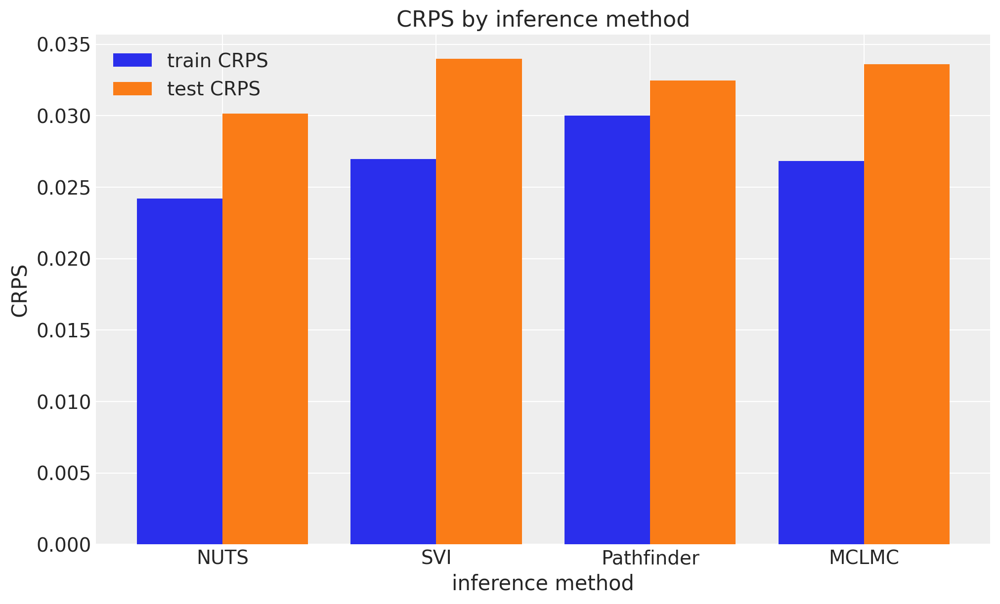

# Examples

Electricity demand forecasting

Forecast hourly electricity demand in Victoria, Australia with a varying-coefficient temperature effect built from a Hilbert space Gaussian process, hour-of-day and day-of-week seasonality, and a Student-t likelihood fit with SVI.

Electricity demand forecasting: prior calibration

Calibrate the priors of the electricity demand model against domain knowledge about the temperature effect, iterating with prior predictive checks before refitting.

Exponential Smoothing in State Space Form

Write seasonal damped-trend exponential smoothing in innovations state space form so forecast uncertainty is propagated correctly, and fit it with Hamiltonian Monte Carlo.

Univariate forecasting

Forecast weekly BART ridership with a random-walk local level, Fourier seasonality, and a Student-t likelihood fit with SVI, then evaluate the model with rolling-origin backtesting.

Forecasting retail demand under stockouts

Forecast 1,000 daily store-product demand series from FreshRetailNet-50K with a damped-trend panel model, store-pooled promotion effects, a launch indicator, and a floored saturating availability factor that handles noisy stockout labels, fit with SVI and a custom optax optimizer, ending with a full-availability counterfactual forecast of uncensored demand for planning.

Hierarchical forecasting I

Forecast hourly BART arrivals from eight origin stations to a fixed destination with a hierarchical model that pools information across series, fit with SVI.

Hierarchical forecasting II

Scale the hierarchical model to the full 50 by 50 origin-destination panel of hourly BART ridership, forecasting all 2,500 series jointly with SVI.

Comparing inference methods: NUTS, SVI, Pathfinder, and MCLMC

Fit the same weekly BART ridership model with NUTS, SVI, Pathfinder, and MCLMC without touching the model code, and compare their forecasts with CRPS.
