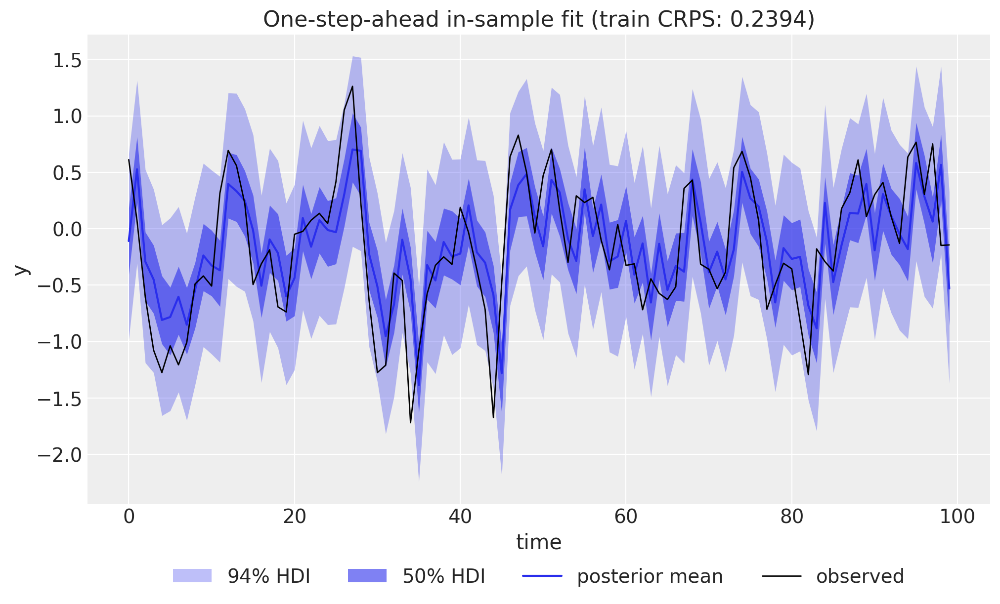
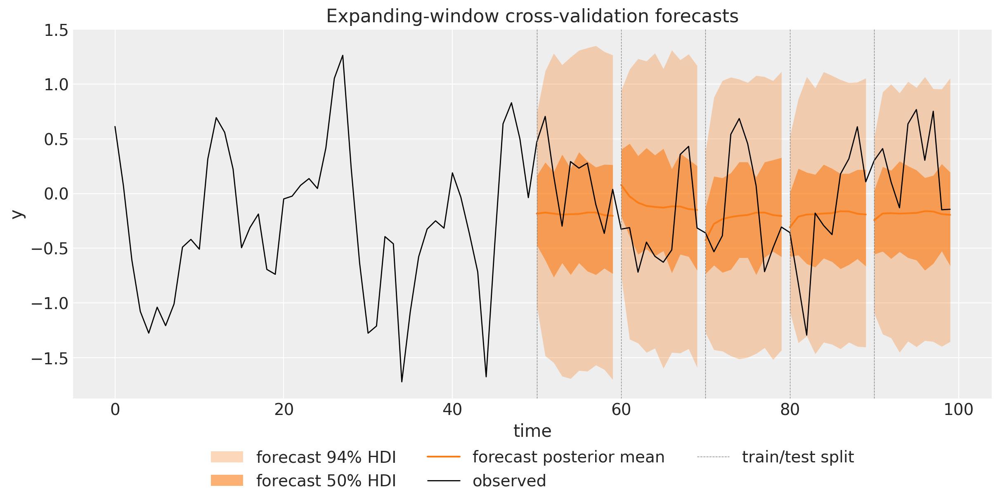
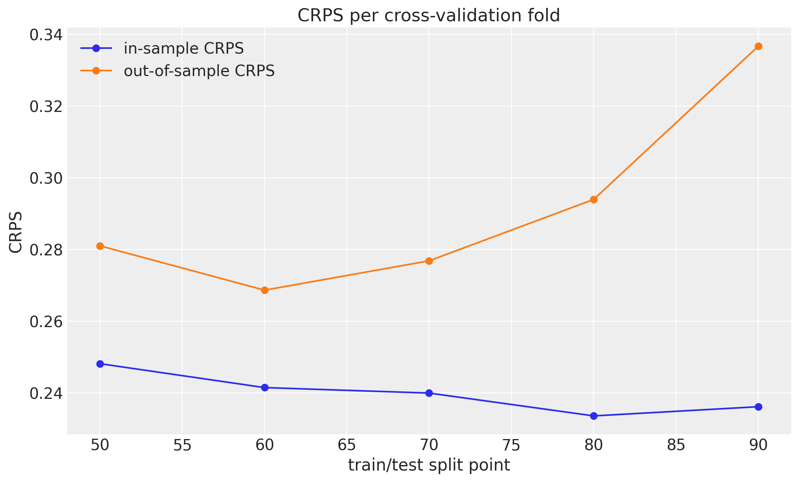
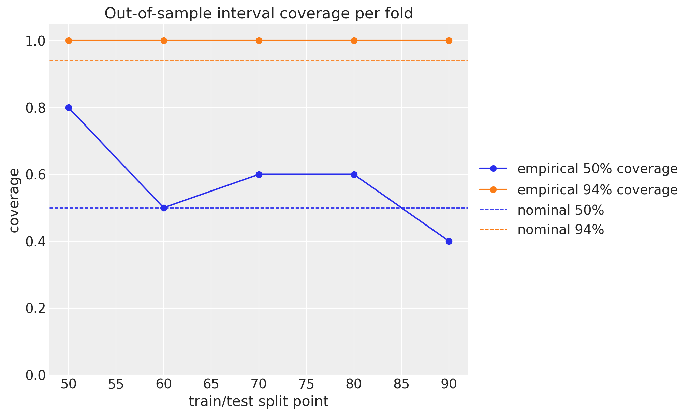

# ARMA(1,1) Model


ARMA(1,1) Model with `numpyro_forecast`

This notebook ports the blog post [**Notes on an ARMA(1,1) Model with NumPyro**](https://juanitorduz.github.io/arma_numpyro/) to the [`numpyro_forecast`](https://github.com/juanitorduz/numpyro_forecast) package. Autoregressive moving average (ARMA) models are the workhorse of classical time series analysis, and the (1,1) member is the smallest one that combines both mechanisms: an autoregressive term that feeds the previous *observation* back into the mean, and a moving average term that feeds the previous *forecast error* back. We simulate data from an ARMA(1,1) process, so we own the data generating process and can verify that the model recovers the true parameters, and we fit it with MCMC (the NUTS sampler) through plain NumPyro.

Two deliberate changes from the blog post are worth calling out:

- Instead of a single train-test split, we evaluate with **expanding-window time-slice cross-validation** via `numpyro_forecast.backtest`, scoring every fold with the continuous ranked probability score (CRPS) and the empirical coverage of the central 50\\ and 94\\ intervals, both in-sample and out-of-sample, exactly as in the [univariate forecasting example](https://juanitorduz.github.io/numpyro_forecast/examples/forecasting_univariate.html).
- The forecast path is fully **generative**: over the horizon we sample future innovations and feed them back into the ARMA recursion, so the forecast uncertainty compounds correctly step by step. The blog post instead zeroed the future errors inside its prediction loop, which understates the multi-step uncertainty.

A practical note on the design, in the same spirit as the [exponential smoothing example](https://juanitorduz.github.io/numpyro_forecast/examples/exponential_smoothing_state_space.html): the [`innovations`](https://juanitorduz.github.io/numpyro_forecast/reference/models.innovations.html) and [`predict`](https://juanitorduz.github.io/numpyro_forecast/reference/models.predict.html) building blocks assume a deterministic mean plus independent per-step noise, which cannot express ARMA's recursive dependence on past observations and errors. The package's [`ssoe`](https://juanitorduz.github.io/numpyro_forecast/reference/models.ssoe.html) building block (single source of error) is made for exactly this shape of model: it runs the in-sample error-feedback filter and the generative forecast recursion, and we register the `"obs"` and `"forecast"` sites ourselves while reusing everything downstream: [to_datatree](../../reference/convert.to_datatree.md#numpyro_forecast.convert.to_datatree), [forecast](../../reference/predictive.forecast.md#numpyro_forecast.predictive.forecast), [predict_in_sample](../../reference/predictive.predict_in_sample.md#numpyro_forecast.predictive.predict_in_sample), and [backtest](../../reference/evaluate.backtest.md#numpyro_forecast.evaluate.backtest). And since an ARMA model is, at heart, a regression on the *lagged series itself*, the observed series plays the role of the covariates: [ssoe](../../reference/models.ssoe.md#numpyro_forecast.models.ssoe) takes the driving series as an argument, and the package's [predict_in_sample](../../reference/predictive.predict_in_sample.md#numpyro_forecast.predictive.predict_in_sample) and [to_datatree](../../reference/convert.to_datatree.md#numpyro_forecast.convert.to_datatree) call the model with `data=None`, so the history has to travel through `covariates`, which spans the full horizon and is available at prediction time. The model only ever reads the first `t_obs` rows (the block checks this), so no future information leaks into a forecast.


# Prepare notebook


``` python
from functools import partial

import arviz as az
import jax
import jax.numpy as jnp
import matplotlib.pyplot as plt
import numpy as np
import numpyro
import numpyro.distributions as dist
import pandas as pd
from jax import random
from jaxtyping import Float
from numpyro.infer import MCMC, NUTS

from numpyro_forecast import (
    Horizon,
    backtest,
    eval_coverage,
    eval_crps,
    forecast,
    predict_in_sample,
    predictions_to_datatree,
    ssoe,
    to_datatree,
)
from numpyro_forecast.acf import acf, pacf
from numpyro_forecast.typing import Array, ForecastModel

az.style.use("arviz-darkgrid")
plt.rcParams["figure.figsize"] = [10, 6]
plt.rcParams["figure.dpi"] = 100
plt.rcParams["figure.facecolor"] = "white"

numpyro.set_host_device_count(n=4)

rng_key = random.PRNGKey(seed=42)


%load_ext autoreload
%autoreload 2
%load_ext jaxtyping
%jaxtyping.typechecker beartype.beartype
%config InlineBackend.figure_format = "retina"
```


# Generate data

The ARMA(1,1) process is defined by the recursion

y_t = \phi \\ y\_{t-1} + \theta \\ \varepsilon\_{t-1} + \varepsilon_t, \qquad \varepsilon_t \sim \text{Normal}(0, \sigma),

where \phi is the autoregressive coefficient, \theta the moving average coefficient, and \sigma the innovation scale. We simulate T = 100 observations with \phi = 0.4, \theta = 0.7, and \sigma = 0.5 (one extra step initializes the recursion and is dropped). As in the blog post, we write the simulation twice: first as a transparent Python loop, then with [`jax.lax.scan`](https://docs.jax.dev/en/latest/_autosummary/jax.lax.scan.html), which compiles the recursion into a single efficient operation and is the idiom the [ssoe](../../reference/models.ssoe.md#numpyro_forecast.models.ssoe) block uses inside the model. Compared to the blog we tighten the type hints: the key takes the package-wide `Array` type and the return shape is spelled out with a [jaxtyping](https://docs.kidger.site/jaxtyping/) annotation.


``` python
phi_true = 0.4
theta_true = 0.7
noise_scale = 0.5
n_samples = 100 + 1  # one extra step to initialize the recursion


def generate_arma_1_1_data_for_loop(
    rng_key: Array, n_samples: int, phi: float, theta: float, noise_scale: float
) -> Float[Array, " t"]:
    """Simulate an ARMA(1,1) series with an explicit Python loop.

    Parameters
    ----------
    rng_key
        PRNG key for the innovations.
    n_samples
        Number of steps to simulate; the initial step is dropped, so the
        returned series has ``n_samples - 1`` entries.
    phi
        Autoregressive coefficient.
    theta
        Moving average coefficient.
    noise_scale
        Scale of the Gaussian innovations.

    Returns
    -------
    Float[Array, " t"]
        The simulated series of length ``n_samples - 1``.
    """
    error = noise_scale * random.normal(rng_key, (n_samples,))
    y = jnp.zeros(n_samples)
    for t in range(1, n_samples):
        y = y.at[t].set(phi * y[t - 1] + theta * error[t - 1] + error[t])
    return y[1:]


rng_key, rng_subkey = random.split(rng_key)
y_for_loop = generate_arma_1_1_data_for_loop(
    rng_subkey, n_samples, phi_true, theta_true, noise_scale
)
print(f"series shape: {y_for_loop.shape}")
```


    series shape: (100,)


The scan version threads a carry `(y_prev, error_prev)` through the innovations and produces the same series. Because JAX keys are pure, reusing `rng_subkey` reproduces the innovations bit for bit, so we can also print their realized standard deviation: with only T = 100 draws it lands visibly below the population value \sigma = 0.5, a fact we will need when judging the parameter recovery below.


``` python
def generate_arma_1_1_data_scan(
    rng_key: Array, n_samples: int, phi: float, theta: float, noise_scale: float
) -> Float[Array, " t"]:
    """Simulate an ARMA(1,1) series with `jax.lax.scan()`.

    Parameters
    ----------
    rng_key
        PRNG key for the innovations.
    n_samples
        Number of steps to simulate; the initial step is dropped, so the
        returned series has ``n_samples - 1`` entries.
    phi
        Autoregressive coefficient.
    theta
        Moving average coefficient.
    noise_scale
        Scale of the Gaussian innovations.

    Returns
    -------
    Float[Array, " t"]
        The simulated series of length ``n_samples - 1``.
    """
    error = noise_scale * random.normal(rng_key, (n_samples,))

    def arma_step(carry, noise):
        y_prev, error_prev = carry
        y_t = phi * y_prev + theta * error_prev + noise
        return (y_t, noise), y_t

    _, y = jax.lax.scan(arma_step, (jnp.zeros(()), error[0]), error[1:])
    return y


y = generate_arma_1_1_data_scan(rng_subkey, n_samples, phi_true, theta_true, noise_scale)
print(f"for-loop and scan agree: {jnp.allclose(y_for_loop, y, atol=1e-6)}")

eps_realized = noise_scale * random.normal(rng_subkey, (n_samples,))
print(f"realized innovation sd: {eps_realized.std():.2f} (population value: {noise_scale})")
```


    for-loop and scan agree: True
    realized innovation sd: 0.43 (population value: 0.5)


Throughout the package, time lives at axis `-2` and the observation dimension at axis `-1`, so the single series has shape `(100, 1)`. Following the design note above, the same array also serves as the covariates.


``` python
data = y[:, None]
covariates = data  # the lagged series is the "covariate" of an ARMA model
duration = data.shape[-2]
time = np.arange(duration)
print(f"data shape: {data.shape}")

fig, ax = plt.subplots()
ax.plot(time, y, color="black", lw=1)
ax.set(title="Simulated ARMA(1,1) series", xlabel="time", ylabel="y");
```


    data shape: (100, 1)


<figure class="figure">
<p></p>
</figure>


# ACF and PACF

Before modeling, we look at the empirical autocorrelation function (ACF) and partial autocorrelation function (PACF), the classical tools for identifying ARMA orders. The blog post used the statsmodels plotting helpers; here we use the package's own [`acf`](https://juanitorduz.github.io/numpyro_forecast/reference/acf.acf.html) and [`pacf`](https://juanitorduz.github.io/numpyro_forecast/reference/acf.pacf.html) functions from `numpyro_forecast.acf`. Both are jitted, compute the ACF for all lags at once via the FFT, derive the PACF through the Durbin-Levinson recursion, and broadcast over leading batch axes, so the same call works on a panel of series (with time on the last axis).


``` python
max_lag = 20
lags = np.arange(max_lag + 1)
significance_bound = 1.96 / np.sqrt(duration)

fig, (ax_acf, ax_pacf) = plt.subplots(
    nrows=2, ncols=1, figsize=(10, 8), sharex=True, sharey=True, layout="constrained"
)
ax_acf.stem(lags, np.asarray(acf(y, max_lag)))
ax_acf.axhspan(-significance_bound, significance_bound, color="C0", alpha=0.15)
ax_acf.set(title="Autocorrelation function (ACF)", ylabel="autocorrelation")
ax_pacf.stem(lags, np.asarray(pacf(y, max_lag)))
ax_pacf.axhspan(-significance_bound, significance_bound, color="C0", alpha=0.15)
ax_pacf.set(
    title="Partial autocorrelation function (PACF)",
    xlabel="lag",
    ylabel="partial autocorrelation",
);
```


<figure class="figure">
<p></p>
</figure>


The shaded band is the approximate 95\\ significance region \pm 1.96 / \sqrt{T} for white noise. The ACF starts high and decays geometrically over the first few lags, while the PACF is large and positive at lag 1 and then flips to a significant negative value at lag 2 before dying out: a sign-alternating decay rather than a clean cutoff. Neither function cuts sharply, which is the classical signature of a mixed ARMA process: a pure AR(p) model would cut the PACF after lag p, and a pure MA(q) model would cut the ACF after lag q.


# Model specification

The generative model adds a global mean \mu to the recursion and uses the same priors as the blog post:

y_t = \mu + \phi \\ y\_{t-1} + \theta \\ \varepsilon\_{t-1} + \varepsilon_t, \qquad \varepsilon_t \sim \text{Normal}(0, \sigma),

\begin{align\*} \mu & \sim \text{Normal}(0, 1), \\ \phi & \sim \text{Uniform}(-1, 1), \\ \theta & \sim \text{Uniform}(-1, 1), \\ \sigma & \sim \text{HalfNormal}(1). \end{align\*}

The key insight (from the blog post, and the same one behind the innovations state space form of exponential smoothing) is that *in sample the errors are deterministic* given the parameters and the observed data: running the recursion forward, the one-step-ahead prediction at time t is \hat{y}\_t = \mu + \phi \\ y\_{t-1} + \theta \\ \varepsilon\_{t-1} and the error is simply \varepsilon_t = y_t - \hat{y}\_t, initialized with y\_{-1} = \mu and \varepsilon\_{-1} = 0. The whole in-sample likelihood is then a single Gaussian observation site: conditioning y_t \sim \text{Normal}(\hat{y}\_t, \sigma) is exactly the blog post's "condition on the errors" trick, \varepsilon_t \sim \text{Normal}(0, \sigma), since the two differ only by a location shift.

The model is a plain NumPyro function `(covariates, data=None)`: its first line derives the train/forecast split from the shapes with [`Horizon.from_data`](https://juanitorduz.github.io/numpyro_forecast/reference/models.Horizon.html), and the recursion is one [ssoe](../../reference/models.ssoe.md#numpyro_forecast.models.ssoe) call. The block takes the driving series `y`, the initial carry (y\_{-1}, \varepsilon\_{-1}), a `step` function, and the innovation distribution; `step(carry, x_t)` returns the one-step-ahead mean and a `carry_fn(y_t, eps_t)` that builds the next carry, here simply the day's value and error. Rows carry the observation axis, so the carry is `(mu[None], zeros((1,)))` and the mean has shape `(1,)`; the block checks these shapes. It then owns the two scans:

1.  **In sample.** A deterministic `jax.lax.scan` filters the observed series into one-step-ahead means \hat{y}\_t, returned as `r.mu` (exposed as the deterministic site `"mu_t"`), and the `"obs"` site conditions the data on them.
2.  **Out of sample.** When `h.future > 0` the block draws the horizon innovations from the prior at a separate `"eps_future"` site (under its own `time_future` plate), then rolls the recursion forward feeding the *sampled* observation and innovation back into the carry, and returns the trajectory as `r.y_future`, which we register as the deterministic `"forecast"` site the package's [forecast](../../reference/predictive.forecast.md#numpyro_forecast.predictive.forecast) driver reads. Because `"eps_future"` does not exist while training, `Predictive` draws it from the prior at forecast time, so the forecast uncertainty compounds over the horizon exactly as the generative process says it should.

Neither scan body contains a sample site, which is why the block can run plain `jax.lax.scan`.


``` python
def arma_1_1(covariates: Array, data: Array | None = None) -> None:
    """ARMA(1,1) model with a deterministic in-sample error-feedback filter.

    Parameters
    ----------
    covariates
        The observed series itself, with time at axis ``-2``; only the first
        ``h.t_obs`` rows are read.
    data
        Observed data with time at axis ``-2``, or ``None`` when the drivers
        sample the observation site.
    """
    h = Horizon.from_data(covariates, data)
    y = covariates[..., : h.t_obs, :]  # observed history only; never reads beyond t_obs

    # jnp.asarray only narrows numpyro's union return type for the type checker.
    mu = jnp.asarray(numpyro.sample("mu", dist.Normal(loc=0, scale=1)))
    phi = numpyro.sample("phi", dist.Uniform(low=-1, high=1))
    theta = numpyro.sample("theta", dist.Uniform(low=-1, high=1))
    sigma = numpyro.sample("sigma", dist.HalfNormal(scale=1))

    def step(carry, _):
        y_prev, error_prev = carry
        pred = mu + phi * y_prev + theta * error_prev
        return pred, lambda y_t, eps_t: (y_t, eps_t)

    init_carry = (mu[None], jnp.zeros((1,)))  # y_{-1} = mu and eps_{-1} = 0 seed the recursion
    r = ssoe(h, "eps", y, init_carry, step, dist.Normal(loc=0, scale=sigma))

    numpyro.deterministic("mu_t", r.mu)
    numpyro.sample("obs", dist.Normal(loc=r.mu, scale=sigma), obs=h.data)
    if h.future > 0:
        numpyro.deterministic("forecast", r.y_future)
```


# Inference with NUTS

We fit the model on the **full series** (no train-test split; the held-out evaluation comes from the cross-validation below) with plain NumPyro: the No-U-Turn Sampler through `MCMC`, running 4 chains of 1{,}000 warmup and 1{,}000 sampling steps each. The posterior is tiny: because the in-sample errors are deterministic, the only latent parameters are \mu, \phi, \theta, and \sigma. We wrap the call in a small `fit_nuts` helper, because the cross-validation below refits the sampler on every fold with the same settings; `mcmc.get_samples()` returns the draws as a plain dictionary with the chains flattened together, the format every package driver consumes.

We then export the whole fit into an ArviZ-schema `xarray.DataTree` with [`to_datatree`](https://juanitorduz.github.io/numpyro_forecast/reference/convert.to_datatree.html): a single call restores the `(chain, draw)` structure of the posterior draws (we pass `num_chains=4`), samples the in-sample one-step-ahead posterior predictive from the same draws, and stores the observed data and covariates alongside, so everything downstream (diagnostics, trace plots, the in-sample fit) reads from one object. Since `covariates` has the same duration as `data`, there is no forecast horizon and hence no forecast groups here; the out-of-sample story comes from the cross-validation below.


``` python
def fit_nuts(
    rng_key: Array, model: ForecastModel, data: Array, covariates: Array
) -> dict[str, Array]:
    """Fit ``model`` with NUTS (4 chains, 1,000 warmup and 1,000 draws each) and return the draws."""
    mcmc = MCMC(
        NUTS(model),
        num_warmup=1_000,
        num_samples=1_000,
        num_chains=4,
        chain_method="sequential",
        progress_bar=False,
    )
    mcmc.run(rng_key, covariates, data)
    return mcmc.get_samples()


rng_key, rng_subkey = random.split(rng_key)
posterior = fit_nuts(rng_subkey, arma_1_1, data, covariates)

rng_key, rng_subkey = random.split(rng_key)
tree = to_datatree(
    rng_subkey,
    arma_1_1,
    posterior,
    data,
    covariates,
    num_chains=4,
    posterior_dims={"mu_t": ["time", "obs_dim"]},
)
tree
```


![](data:image/svg+xml;base64,PHN2ZyBzdHlsZT0icG9zaXRpb246IGFic29sdXRlOyB3aWR0aDogMDsgaGVpZ2h0OiAwOyBvdmVyZmxvdzogaGlkZGVuIj4KPGRlZnM+CjxzeW1ib2wgaWQ9Imljb24tZGF0YWJhc2UiIHZpZXdib3g9IjAgMCAzMiAzMiI+CjxwYXRoIGQ9Ik0xNiAwYy04LjgzNyAwLTE2IDIuMjM5LTE2IDV2NGMwIDIuNzYxIDcuMTYzIDUgMTYgNXMxNi0yLjIzOSAxNi01di00YzAtMi43NjEtNy4xNjMtNS0xNi01eiIgLz4KPHBhdGggZD0iTTE2IDE3Yy04LjgzNyAwLTE2LTIuMjM5LTE2LTV2NmMwIDIuNzYxIDcuMTYzIDUgMTYgNXMxNi0yLjIzOSAxNi01di02YzAgMi43NjEtNy4xNjMgNS0xNiA1eiIgLz4KPHBhdGggZD0iTTE2IDI2Yy04LjgzNyAwLTE2LTIuMjM5LTE2LTV2NmMwIDIuNzYxIDcuMTYzIDUgMTYgNXMxNi0yLjIzOSAxNi01di02YzAgMi43NjEtNy4xNjMgNS0xNiA1eiIgLz4KPC9zeW1ib2w+CjxzeW1ib2wgaWQ9Imljb24tZmlsZS10ZXh0MiIgdmlld2JveD0iMCAwIDMyIDMyIj4KPHBhdGggZD0iTTI4LjY4MSA3LjE1OWMtMC42OTQtMC45NDctMS42NjItMi4wNTMtMi43MjQtMy4xMTZzLTIuMTY5LTIuMDMwLTMuMTE2LTIuNzI0Yy0xLjYxMi0xLjE4Mi0yLjM5My0xLjMxOS0yLjg0MS0xLjMxOWgtMTUuNWMtMS4zNzggMC0yLjUgMS4xMjEtMi41IDIuNXYyN2MwIDEuMzc4IDEuMTIyIDIuNSAyLjUgMi41aDIzYzEuMzc4IDAgMi41LTEuMTIyIDIuNS0yLjV2LTE5LjVjMC0wLjQ0OC0wLjEzNy0xLjIzLTEuMzE5LTIuODQxek0yNC41NDMgNS40NTdjMC45NTkgMC45NTkgMS43MTIgMS44MjUgMi4yNjggMi41NDNoLTQuODExdi00LjgxMWMwLjcxOCAwLjU1NiAxLjU4NCAxLjMwOSAyLjU0MyAyLjI2OHpNMjggMjkuNWMwIDAuMjcxLTAuMjI5IDAuNS0wLjUgMC41aC0yM2MtMC4yNzEgMC0wLjUtMC4yMjktMC41LTAuNXYtMjdjMC0wLjI3MSAwLjIyOS0wLjUgMC41LTAuNSAwIDAgMTUuNDk5LTAgMTUuNSAwdjdjMCAwLjU1MiAwLjQ0OCAxIDEgMWg3djE5LjV6IiAvPgo8cGF0aCBkPSJNMjMgMjZoLTE0Yy0wLjU1MiAwLTEtMC40NDgtMS0xczAuNDQ4LTEgMS0xaDE0YzAuNTUyIDAgMSAwLjQ0OCAxIDFzLTAuNDQ4IDEtMSAxeiIgLz4KPHBhdGggZD0iTTIzIDIyaC0xNGMtMC41NTIgMC0xLTAuNDQ4LTEtMXMwLjQ0OC0xIDEtMWgxNGMwLjU1MiAwIDEgMC40NDggMSAxcy0wLjQ0OCAxLTEgMXoiIC8+CjxwYXRoIGQ9Ik0yMyAxOGgtMTRjLTAuNTUyIDAtMS0wLjQ0OC0xLTFzMC40NDgtMSAxLTFoMTRjMC41NTIgMCAxIDAuNDQ4IDEgMXMtMC40NDggMS0xIDF6IiAvPgo8L3N5bWJvbD4KPC9kZWZzPgo8L3N2Zz4=) <style>/* CSS stylesheet for displaying xarray objects in notebooks */

:root {
  --xr-font-color0: var(
    --jp-content-font-color0,
    var(--pst-color-text-base rgba(0, 0, 0, 1))
  );
  --xr-font-color2: var(
    --jp-content-font-color2,
    var(--pst-color-text-base, rgba(0, 0, 0, 0.54))
  );
  --xr-font-color3: var(
    --jp-content-font-color3,
    var(--pst-color-text-base, rgba(0, 0, 0, 0.38))
  );
  --xr-border-color: var(
    --jp-border-color2,
    hsl(from var(--pst-color-on-background, white) h s calc(l - 10))
  );
  --xr-disabled-color: var(
    --jp-layout-color3,
    hsl(from var(--pst-color-on-background, white) h s calc(l - 40))
  );
  --xr-background-color: var(
    --jp-layout-color0,
    var(--pst-color-on-background, white)
  );
  --xr-background-color-row-even: var(
    --jp-layout-color1,
    hsl(from var(--pst-color-on-background, white) h s calc(l - 5))
  );
  --xr-background-color-row-odd: var(
    --jp-layout-color2,
    hsl(from var(--pst-color-on-background, white) h s calc(l - 15))
  );
}

html[theme="dark"],
html[data-theme="dark"],
body[data-theme="dark"],
body.vscode-dark {
  --xr-font-color0: var(
    --jp-content-font-color0,
    var(--pst-color-text-base, rgba(255, 255, 255, 1))
  );
  --xr-font-color2: var(
    --jp-content-font-color2,
    var(--pst-color-text-base, rgba(255, 255, 255, 0.54))
  );
  --xr-font-color3: var(
    --jp-content-font-color3,
    var(--pst-color-text-base, rgba(255, 255, 255, 0.38))
  );
  --xr-border-color: var(
    --jp-border-color2,
    hsl(from var(--pst-color-on-background, #111111) h s calc(l + 10))
  );
  --xr-disabled-color: var(
    --jp-layout-color3,
    hsl(from var(--pst-color-on-background, #111111) h s calc(l + 40))
  );
  --xr-background-color: var(
    --jp-layout-color0,
    var(--pst-color-on-background, #111111)
  );
  --xr-background-color-row-even: var(
    --jp-layout-color1,
    hsl(from var(--pst-color-on-background, #111111) h s calc(l + 5))
  );
  --xr-background-color-row-odd: var(
    --jp-layout-color2,
    hsl(from var(--pst-color-on-background, #111111) h s calc(l + 15))
  );
}

.xr-wrap {
  display: block !important;
  min-width: 300px;
  max-width: 700px;
  line-height: 1.6;
  padding-bottom: 4px;
}

.xr-text-repr-fallback {
  /* fallback to plain text repr when CSS is not injected (untrusted notebook) */
  display: none;
}

.xr-header {
  padding-top: 6px;
  padding-bottom: 6px;
}

.xr-header {
  border-bottom: solid 1px var(--xr-border-color);
  margin-bottom: 4px;
}

.xr-header > div,
.xr-header > ul {
  display: inline;
  margin-top: 0;
  margin-bottom: 0;
}

.xr-obj-type,
.xr-obj-name {
  margin-left: 2px;
  margin-right: 10px;
}

.xr-obj-type,
.xr-group-box-contents > label {
  color: var(--xr-font-color2);
  display: block;
}

.xr-sections {
  padding-left: 0 !important;
  display: grid;
  grid-template-columns: 150px auto auto 1fr 0 20px 0 20px;
  margin-block-start: 0;
  margin-block-end: 0;
}

.xr-section-item {
  display: contents;
}

.xr-section-item > input,
.xr-group-box-contents > input,
.xr-array-wrap > input {
  display: block;
  opacity: 0;
  height: 0;
  margin: 0;
}

.xr-section-item > input + label,
.xr-var-item > input + label {
  color: var(--xr-disabled-color);
}

.xr-section-item > input:enabled + label,
.xr-var-item > input:enabled + label,
.xr-array-wrap > input:enabled + label,
.xr-group-box-contents > input:enabled + label {
  cursor: pointer;
  color: var(--xr-font-color2);
}

.xr-section-item > input:focus-visible + label,
.xr-var-item > input:focus-visible + label,
.xr-array-wrap > input:focus-visible + label,
.xr-group-box-contents > input:focus-visible + label {
  outline: auto;
}

.xr-section-item > input:enabled + label:hover,
.xr-var-item > input:enabled + label:hover,
.xr-array-wrap > input:enabled + label:hover,
.xr-group-box-contents > input:enabled + label:hover {
  color: var(--xr-font-color0);
}

.xr-section-summary {
  grid-column: 1;
  color: var(--xr-font-color2);
  font-weight: 500;
  white-space: nowrap;
}

.xr-section-summary > em {
  font-weight: normal;
}

.xr-span-grid {
  grid-column-end: -1;
}

.xr-section-summary > span {
  display: inline-block;
  padding-left: 0.3em;
}

.xr-group-box-contents > input:checked + label > span {
  display: inline-block;
  padding-left: 0.6em;
}

.xr-section-summary-in:disabled + label {
  color: var(--xr-font-color2);
}

.xr-section-summary-in + label:before {
  display: inline-block;
  content: "►";
  font-size: 11px;
  width: 15px;
  text-align: center;
}

.xr-section-summary-in:disabled + label:before {
  color: var(--xr-disabled-color);
}

.xr-section-summary-in:checked + label:before {
  content: "▼";
}

.xr-section-summary-in:checked + label > span {
  display: none;
}

.xr-section-summary,
.xr-section-inline-details,
.xr-group-box-contents > label {
  padding-top: 4px;
}

.xr-section-inline-details {
  grid-column: 2 / -1;
}

.xr-section-details {
  grid-column: 1 / -1;
  margin-top: 4px;
  margin-bottom: 5px;
}

.xr-section-summary-in ~ .xr-section-details {
  display: none;
}

.xr-section-summary-in:checked ~ .xr-section-details {
  display: contents;
}

.xr-children {
  display: inline-grid;
  grid-template-columns: 100%;
  grid-column: 1 / -1;
  padding-top: 4px;
}

.xr-group-box {
  display: inline-grid;
  grid-template-columns: 0px 30px auto;
}

.xr-group-box-vline {
  grid-column-start: 1;
  border-right: 0.2em solid;
  border-color: var(--xr-border-color);
  width: 0px;
}

.xr-group-box-hline {
  grid-column-start: 2;
  grid-row-start: 1;
  height: 1em;
  width: 26px;
  border-bottom: 0.2em solid;
  border-color: var(--xr-border-color);
}

.xr-group-box-contents {
  grid-column-start: 3;
  padding-bottom: 4px;
}

.xr-group-box-contents > label::before {
  content: "📂";
  padding-right: 0.3em;
}

.xr-group-box-contents > input:checked + label::before {
  content: "📁";
}

.xr-group-box-contents > input:checked + label {
  padding-bottom: 0px;
}

.xr-group-box-contents > input:checked ~ .xr-sections {
  display: none;
}

.xr-group-box-contents > input + label > span {
  display: none;
}

.xr-group-box-ellipsis {
  font-size: 1.4em;
  font-weight: 900;
  color: var(--xr-font-color2);
  letter-spacing: 0.15em;
  cursor: default;
}

.xr-array-wrap {
  grid-column: 1 / -1;
  display: grid;
  grid-template-columns: 20px auto;
}

.xr-array-wrap > label {
  grid-column: 1;
  vertical-align: top;
}

.xr-preview {
  color: var(--xr-font-color3);
}

.xr-array-preview,
.xr-array-data {
  padding: 0 5px !important;
  grid-column: 2;
}

.xr-array-data,
.xr-array-in:checked ~ .xr-array-preview {
  display: none;
}

.xr-array-in:checked ~ .xr-array-data,
.xr-array-preview {
  display: inline-block;
}

.xr-dim-list {
  display: inline-block !important;
  list-style: none;
  padding: 0 !important;
  margin: 0;
}

.xr-dim-list li {
  display: inline-block;
  padding: 0;
  margin: 0;
}

.xr-dim-list:before {
  content: "(";
}

.xr-dim-list:after {
  content: ")";
}

.xr-dim-list li:not(:last-child):after {
  content: ",";
  padding-right: 5px;
}

.xr-has-index {
  font-weight: bold;
}

.xr-var-list,
.xr-var-item {
  display: contents;
}

.xr-var-item > div,
.xr-var-item label,
.xr-var-item > .xr-var-name span {
  background-color: var(--xr-background-color-row-even);
  border-color: var(--xr-background-color-row-odd);
  margin-bottom: 0;
  padding-top: 2px;
}

.xr-var-item > .xr-var-name:hover span {
  padding-right: 5px;
}

.xr-var-list > li:nth-child(odd) > div,
.xr-var-list > li:nth-child(odd) > label,
.xr-var-list > li:nth-child(odd) > .xr-var-name span {
  background-color: var(--xr-background-color-row-odd);
  border-color: var(--xr-background-color-row-even);
}

.xr-var-name {
  grid-column: 1;
}

.xr-var-dims {
  grid-column: 2;
}

.xr-var-dtype {
  grid-column: 3;
  text-align: right;
  color: var(--xr-font-color2);
}

.xr-var-preview {
  grid-column: 4;
}

.xr-index-preview {
  grid-column: 2 / 5;
  color: var(--xr-font-color2);
}

.xr-var-name,
.xr-var-dims,
.xr-var-dtype,
.xr-preview,
.xr-attrs dt {
  white-space: nowrap;
  overflow: hidden;
  text-overflow: ellipsis;
  padding-right: 10px;
}

.xr-var-name:hover,
.xr-var-dims:hover,
.xr-var-dtype:hover,
.xr-attrs dt:hover {
  overflow: visible;
  width: auto;
  z-index: 1;
}

.xr-var-attrs,
.xr-var-data,
.xr-index-data {
  display: none;
  border-top: 2px dotted var(--xr-background-color);
  padding-bottom: 20px !important;
  padding-top: 10px !important;
}

.xr-var-attrs-in + label,
.xr-var-data-in + label,
.xr-index-data-in + label {
  padding: 0 1px;
}

.xr-var-attrs-in:checked ~ .xr-var-attrs,
.xr-var-data-in:checked ~ .xr-var-data,
.xr-index-data-in:checked ~ .xr-index-data {
  display: block;
}

.xr-var-data > table {
  float: right;
}

.xr-var-data > pre,
.xr-index-data > pre,
.xr-var-data > table > tbody > tr {
  background-color: transparent !important;
}

.xr-var-name span,
.xr-var-data,
.xr-index-name div,
.xr-index-data,
.xr-attrs {
  padding-left: 25px !important;
}

.xr-attrs,
.xr-var-attrs,
.xr-var-data,
.xr-index-data {
  grid-column: 1 / -1;
}

dl.xr-attrs {
  padding: 0;
  margin: 0;
  display: grid;
  grid-template-columns: 125px auto;
}

.xr-attrs dt,
.xr-attrs dd {
  padding: 0;
  margin: 0;
  float: left;
  padding-right: 10px;
  width: auto;
}

.xr-attrs dt {
  font-weight: normal;
  grid-column: 1;
}

.xr-attrs dt:hover span {
  display: inline-block;
  background: var(--xr-background-color);
  padding-right: 10px;
}

.xr-attrs dd {
  grid-column: 2;
  white-space: pre-wrap;
  word-break: break-all;
}

.xr-icon-database,
.xr-icon-file-text2,
.xr-no-icon {
  display: inline-block;
  vertical-align: middle;
  width: 1em;
  height: 1.5em !important;
  stroke-width: 0;
  stroke: currentColor;
  fill: currentColor;
}

.xr-var-attrs-in:checked + label > .xr-icon-file-text2,
.xr-var-data-in:checked + label > .xr-icon-database,
.xr-index-data-in:checked + label > .xr-icon-database {
  color: var(--xr-font-color0);
  filter: drop-shadow(1px 1px 5px var(--xr-font-color2));
  stroke-width: 0.8px;
}
</style>

``` xr-text-repr-fallback
<xarray.DataTree>
Group: /
│   Attributes:
│       inference_library:  numpyro
│       creation_library:   numpyro_forecast
│       sample_dims:        ['chain', 'draw']
├── Group: /posterior
│       Dimensions:  (chain: 4, draw: 1000, time: 100, obs_dim: 1)
│       Coordinates:
│         * chain    (chain) int64 32B 0 1 2 3
│         * draw     (draw) int64 8kB 0 1 2 3 4 5 6 7 ... 993 994 995 996 997 998 999
│         * time     (time) int64 800B 0 1 2 3 4 5 6 7 8 ... 91 92 93 94 95 96 97 98 99
│         * obs_dim  (obs_dim) int64 8B 0
│       Data variables:
│           mu       (chain, draw) float32 16kB -0.09647 -0.02102 ... 0.0329 0.04597
│           mu_t     (chain, draw, time, obs_dim) float32 2MB -0.1546 0.5496 ... -0.4146
│           phi      (chain, draw) float32 16kB 0.6022 0.408 0.4649 ... 0.3659 0.1668
│           sigma    (chain, draw) float32 16kB 0.4242 0.4562 0.3988 ... 0.501 0.408
│           theta    (chain, draw) float32 16kB 0.3627 0.5471 0.3764 ... 0.5953 0.6119
│       Attributes:
│           created_at:                 2026-08-26T16:35:03.482125+00:00
│           creation_library:           ArviZ
│           creation_library_version:   1.3.0
│           creation_library_language:  Python
│           sample_dims:                ['chain', 'draw']
├── Group: /posterior_predictive
│       Dimensions:  (chain: 4, draw: 1000, time: 100, obs_dim: 1)
│       Coordinates:
│         * chain    (chain) int64 32B 0 1 2 3
│         * draw     (draw) int64 8kB 0 1 2 3 4 5 6 7 ... 993 994 995 996 997 998 999
│         * time     (time) int64 800B 0 1 2 3 4 5 6 7 8 ... 91 92 93 94 95 96 97 98 99
│         * obs_dim  (obs_dim) int64 8B 0
│       Data variables:
│           obs      (chain, draw, time, obs_dim) float32 2MB -1.017 0.3373 ... -0.6977
│       Attributes:
│           created_at:                 2026-08-26T16:35:03.605742+00:00
│           creation_library:           ArviZ
│           creation_library_version:   1.3.0
│           creation_library_language:  Python
│           sample_dims:                ['chain', 'draw']
├── Group: /observed_data
│       Dimensions:  (time: 100, obs_dim: 1)
│       Coordinates:
│         * time     (time) int64 800B 0 1 2 3 4 5 6 7 8 ... 91 92 93 94 95 96 97 98 99
│         * obs_dim  (obs_dim) int64 8B 0
│       Data variables:
│           obs      (time, obs_dim) float32 400B 0.6115 0.06982 ... -0.1484 -0.1441
│       Attributes:
│           created_at:                 2026-08-26T16:35:03.605964+00:00
│           creation_library:           ArviZ
│           creation_library_version:   1.3.0
│           creation_library_language:  Python
│           sample_dims:                []
└── Group: /constant_data
        Dimensions:        (time: 100, covariate_dim: 1)
        Coordinates:
          * time           (time) int64 800B 0 1 2 3 4 5 6 7 ... 92 93 94 95 96 97 98 99
          * covariate_dim  (covariate_dim) int64 8B 0
        Data variables:
            covariates     (time, covariate_dim) float32 400B 0.6115 0.06982 ... -0.1441
        Attributes:
            created_at:                 2026-08-26T16:35:03.606133+00:00
            creation_library:           ArviZ
            creation_library_version:   1.3.0
            creation_library_language:  Python
            sample_dims:                []
```


xarray.DataTree


/posterior(14)

Dimensions:


- chain: 4
- draw: 1000
- time: 100
- obs_dim: 1


Coordinates: (4)


chain


(chain)


int64


0 1 2 3


    array([0, 1, 2, 3])


draw


(draw)


int64


0 1 2 3 4 5 ... 995 996 997 998 999


    array([  0,   1,   2, ..., 997, 998, 999], shape=(1000,))


time


(time)


int64


0 1 2 3 4 5 6 ... 94 95 96 97 98 99


    array([ 0,  1,  2,  3,  4,  5,  6,  7,  8,  9, 10, 11, 12, 13, 14, 15, 16, 17,18, 19, 20, 21, 22, 23, 24, 25, 26, 27, 28, 29, 30, 31, 32, 33, 34, 35,36, 37, 38, 39, 40, 41, 42, 43, 44, 45, 46, 47, 48, 49, 50, 51, 52, 53,54, 55, 56, 57, 58, 59, 60, 61, 62, 63, 64, 65, 66, 67, 68, 69, 70, 71,72, 73, 74, 75, 76, 77, 78, 79, 80, 81, 82, 83, 84, 85, 86, 87, 88, 89,90, 91, 92, 93, 94, 95, 96, 97, 98, 99])


obs_dim


(obs_dim)


int64


0


    array([0])


Data variables: (5)


mu


(chain, draw)


float32


-0.09647 -0.02102 ... 0.04597


    array([[-0.09646773, -0.02101522, -0.07238156, ...,  0.11212269,-0.00052988, -0.00798731],[-0.07251706, -0.07538717, -0.02875393, ..., -0.12315954,-0.07018185, -0.07903112],[ 0.02153392, -0.07431991, -0.04518985, ..., -0.10758153,-0.10836137, -0.07513384],[-0.06687693, -0.03768033, -0.08406789, ..., -0.0970888 ,0.03289504,  0.04597342]], shape=(4, 1000), dtype=float32)


mu_t


(chain, draw, time, obs_dim)


float32


-0.1546 0.5496 ... 0.5639 -0.4146


    array([[[[-0.15455699],[ 0.5496475 ],[-0.22846411],...,[ 0.04035873],[ 0.6136581 ],[-0.4622672 ]],[[-0.02958961],[ 0.5792373 ],[-0.27121457],...,[ 0.07765268],[ 0.65390897],[-0.5205126 ]],[[-0.10603137],[ 0.48198977],[-0.19505152],...,......,[ 0.04807812],[ 0.6310429 ],[-0.64130867]],[[ 0.04493116],[ 0.5939707 ],[-0.2536009 ],...,[ 0.11755434],[ 0.68493474],[-0.51754355]],[[ 0.05364065],[ 0.48932704],[-0.19906978],...,[ 0.10942935],[ 0.5639006 ],[-0.41464213]]]], shape=(4, 1000, 100, 1), dtype=float32)


phi


(chain, draw)


float32


0.6022 0.408 ... 0.3659 0.1668


    array([[0.6021626 , 0.40800858, 0.4648949 , ..., 0.5031756 , 0.5679749 ,0.26459742],[0.576758  , 0.2835461 , 0.3803724 , ..., 0.37069368, 0.24272537,0.5902207 ],[0.4283185 , 0.67807937, 0.50356376, ..., 0.52087355, 0.23761964,0.11487448],[0.1969738 , 0.29357028, 0.2519021 , ..., 0.38436627, 0.3658948 ,0.16677523]], shape=(4, 1000), dtype=float32)


sigma


(chain, draw)


float32


0.4242 0.4562 ... 0.501 0.408


    array([[0.42417994, 0.4562234 , 0.39884937, ..., 0.4779843 , 0.44065925,0.40929258],[0.4311424 , 0.4428815 , 0.47394285, ..., 0.45420346, 0.42864746,0.42506742],[0.43986347, 0.41962373, 0.4243214 , ..., 0.46540776, 0.45097387,0.44440666],[0.42705545, 0.41944715, 0.41231525, ..., 0.4772875 , 0.500982  ,0.40796116]], shape=(4, 1000), dtype=float32)


theta


(chain, draw)


float32


0.3627 0.5471 ... 0.5953 0.6119


    array([[0.36270773, 0.5470649 , 0.37636673, ..., 0.44055176, 0.4442067 ,0.49163032],[0.29103065, 0.61470795, 0.5654199 , ..., 0.46207082, 0.6839458 ,0.2747228 ],[0.3634448 , 0.34727144, 0.35864997, ..., 0.43632984, 0.5381683 ,0.7571629 ],[0.5067898 , 0.5136883 , 0.70493054, ..., 0.6249902 , 0.59532595,0.61187446]], shape=(4, 1000), dtype=float32)


Attributes: (5)


created_at :  
2026-08-26T16:35:03.482125+00:00

creation_library :  
ArviZ

creation_library_version :  
1.3.0

creation_library_language :  
Python

sample_dims :  
\['chain', 'draw'\]


/posterior_predictive(10)

Dimensions:


- chain: 4
- draw: 1000
- time: 100
- obs_dim: 1


Coordinates: (4)


chain


(chain)


int64


0 1 2 3


    array([0, 1, 2, 3])


draw


(draw)


int64


0 1 2 3 4 5 ... 995 996 997 998 999


    array([  0,   1,   2, ..., 997, 998, 999], shape=(1000,))


time


(time)


int64


0 1 2 3 4 5 6 ... 94 95 96 97 98 99


    array([ 0,  1,  2,  3,  4,  5,  6,  7,  8,  9, 10, 11, 12, 13, 14, 15, 16, 17,18, 19, 20, 21, 22, 23, 24, 25, 26, 27, 28, 29, 30, 31, 32, 33, 34, 35,36, 37, 38, 39, 40, 41, 42, 43, 44, 45, 46, 47, 48, 49, 50, 51, 52, 53,54, 55, 56, 57, 58, 59, 60, 61, 62, 63, 64, 65, 66, 67, 68, 69, 70, 71,72, 73, 74, 75, 76, 77, 78, 79, 80, 81, 82, 83, 84, 85, 86, 87, 88, 89,90, 91, 92, 93, 94, 95, 96, 97, 98, 99])


obs_dim


(obs_dim)


int64


0


    array([0])


Data variables: (1)


obs


(chain, draw, time, obs_dim)


float32


-1.017 0.3373 ... 0.3093 -0.6977


    array([[[[-1.0169957 ],[ 0.33730668],[-1.0464648 ],...,[-0.64169127],[ 0.50451714],[-0.92574334]],[[ 0.02451567],[ 0.31905827],[-0.15904397],...,[-1.1264307 ],[ 0.06864069],[-0.00616606]],[[-0.46010378],[ 0.7067954 ],[-1.003775  ],...,......,[-0.4517897 ],[ 0.7969543 ],[-0.6166142 ]],[[ 0.2246039 ],[ 0.82003504],[ 0.05850028],...,[ 0.87950796],[ 0.82522213],[-0.35609692]],[[ 0.07195892],[ 0.78940415],[ 0.03490523],...,[-0.33626258],[ 0.30929595],[-0.6976971 ]]]], shape=(4, 1000, 100, 1), dtype=float32)


Attributes: (5)


created_at :  
2026-08-26T16:35:03.605742+00:00

creation_library :  
ArviZ

creation_library_version :  
1.3.0

creation_library_language :  
Python

sample_dims :  
\['chain', 'draw'\]


/observed_data(8)

Dimensions:


- time: 100
- obs_dim: 1


Coordinates: (2)


time


(time)


int64


0 1 2 3 4 5 6 ... 94 95 96 97 98 99


    array([ 0,  1,  2,  3,  4,  5,  6,  7,  8,  9, 10, 11, 12, 13, 14, 15, 16, 17,18, 19, 20, 21, 22, 23, 24, 25, 26, 27, 28, 29, 30, 31, 32, 33, 34, 35,36, 37, 38, 39, 40, 41, 42, 43, 44, 45, 46, 47, 48, 49, 50, 51, 52, 53,54, 55, 56, 57, 58, 59, 60, 61, 62, 63, 64, 65, 66, 67, 68, 69, 70, 71,72, 73, 74, 75, 76, 77, 78, 79, 80, 81, 82, 83, 84, 85, 86, 87, 88, 89,90, 91, 92, 93, 94, 95, 96, 97, 98, 99])


obs_dim


(obs_dim)


int64


0


    array([0])


Data variables: (1)


obs


(time, obs_dim)


float32


0.6115 0.06982 ... -0.1484 -0.1441


    array([[ 0.6115394 ],[ 0.06981769],[-0.6078261 ],[-1.0767999 ],[-1.274781  ],[-1.0382899 ],[-1.2064939 ],[-1.008641  ],[-0.48991784],[-0.4190661 ],[-0.5085629 ],[ 0.3146204 ],[ 0.6926972 ],[ 0.55834603],[ 0.22263917],[-0.49487147],[-0.31112087],[-0.18741646],[-0.69310373],[-0.7378681 ],...[-0.35613638],[-0.8201766 ],[-1.2930527 ],[-0.17921585],[-0.2918862 ],[-0.3752794 ],[ 0.17729832],[ 0.31766778],[ 0.60940003],[ 0.10695466],[ 0.3012006 ],[ 0.40986454],[ 0.10548047],[-0.13039589],[ 0.6353712 ],[ 0.7664531 ],[ 0.30337706],[ 0.7511519 ],[-0.14843541],[-0.14405262]], dtype=float32)


Attributes: (5)


created_at :  
2026-08-26T16:35:03.605964+00:00

creation_library :  
ArviZ

creation_library_version :  
1.3.0

creation_library_language :  
Python

sample_dims :  
\[\]


/constant_data(8)

Dimensions:


- time: 100
- covariate_dim: 1


Coordinates: (2)


time


(time)


int64


0 1 2 3 4 5 6 ... 94 95 96 97 98 99


    array([ 0,  1,  2,  3,  4,  5,  6,  7,  8,  9, 10, 11, 12, 13, 14, 15, 16, 17,18, 19, 20, 21, 22, 23, 24, 25, 26, 27, 28, 29, 30, 31, 32, 33, 34, 35,36, 37, 38, 39, 40, 41, 42, 43, 44, 45, 46, 47, 48, 49, 50, 51, 52, 53,54, 55, 56, 57, 58, 59, 60, 61, 62, 63, 64, 65, 66, 67, 68, 69, 70, 71,72, 73, 74, 75, 76, 77, 78, 79, 80, 81, 82, 83, 84, 85, 86, 87, 88, 89,90, 91, 92, 93, 94, 95, 96, 97, 98, 99])


covariate_dim


(covariate_dim)


int64


0


    array([0])


Data variables: (1)


covariates


(time, covariate_dim)


float32


0.6115 0.06982 ... -0.1484 -0.1441


    array([[ 0.6115394 ],[ 0.06981769],[-0.6078261 ],[-1.0767999 ],[-1.274781  ],[-1.0382899 ],[-1.2064939 ],[-1.008641  ],[-0.48991784],[-0.4190661 ],[-0.5085629 ],[ 0.3146204 ],[ 0.6926972 ],[ 0.55834603],[ 0.22263917],[-0.49487147],[-0.31112087],[-0.18741646],[-0.69310373],[-0.7378681 ],...[-0.35613638],[-0.8201766 ],[-1.2930527 ],[-0.17921585],[-0.2918862 ],[-0.3752794 ],[ 0.17729832],[ 0.31766778],[ 0.60940003],[ 0.10695466],[ 0.3012006 ],[ 0.40986454],[ 0.10548047],[-0.13039589],[ 0.6353712 ],[ 0.7664531 ],[ 0.30337706],[ 0.7511519 ],[-0.14843541],[-0.14405262]], dtype=float32)


Attributes: (5)


created_at :  
2026-08-26T16:35:03.606133+00:00

creation_library :  
ArviZ

creation_library_version :  
1.3.0

creation_library_language :  
Python

sample_dims :  
\[\]


Attributes: (3)


inference_library :  
numpyro

creation_library :  
numpyro_forecast

sample_dims :  
\['chain', 'draw'\]


# Diagnostics and parameter recovery

The tree's `posterior` group carries the draws with their `(chain, draw)` structure (deterministic sites such as `"mu_t"` ride along; we summarize just the four parameters), so `az.summary` gives us the whole convergence and recovery picture in one call: posterior means and standard deviations, the 94\\ HDIs, bulk and tail effective sample sizes, \hat{R}, and the Monte Carlo standard errors. Since we simulated the data ourselves, we prepend the true parameter values as the first column.


``` python
scalar_vars = ["mu", "phi", "theta", "sigma"]
true_values = {"mu": 0.0, "phi": phi_true, "theta": theta_true, "sigma": noise_scale}

recovery = az.summary(tree, var_names=scalar_vars, ci_kind="hdi", ci_prob=0.94)
recovery.insert(0, "true_value", pd.Series(true_values))
recovery
```


|  | true_value | mean | sd | hdi94_lb | hdi94_ub | ess_bulk | ess_tail | r_hat | mcse_mean | mcse_sd |
|----|----|----|----|----|----|----|----|----|----|----|
| mu | 0.0 | -0.081 | 0.07 | -0.22 | 0.046 | 2796 | 2133 | 1.00 | 0.0013 | 0.00095 |
| phi | 0.4 | 0.369 | 0.144 | 0.083 | 0.62 | 2016 | 2108 | 1.00 | 0.0033 | 0.0023 |
| theta | 0.7 | 0.532 | 0.15 | 0.25 | 0.8 | 1994 | 1819 | 1.00 | 0.0033 | 0.0021 |
| sigma | 0.5 | 0.436 | 0.0314 | 0.38 | 0.5 | 3077 | 2811 | 1.00 | 0.00057 | 0.00041 |


The sampler recovers the parameters well: every true value lies within about two posterior standard deviations of its posterior mean, the \hat{R} values are essentially 1, and the effective sample sizes are healthy. The point estimates for \theta and \sigma come in somewhat low, and this is a feature of the particular realization rather than of the model: the innovations drawn for this seed happen to have a sample standard deviation of 0.43 (against the population value 0.5; we printed the realized value right after generating the data), and the posterior mean of \sigma matches that realized scale almost exactly. The moving average coefficient is in turn the hardest parameter to pin down with T = 100 observations, because \phi and \theta can partially substitute for each other in an ARMA likelihood (a well-known feature), so its posterior is wide. The trace plots make the recovery visual: the dashed black lines mark the true values, and the chains mix well around them.


``` python
pc_trace = az.plot_trace_dist(
    tree,
    var_names=scalar_vars,
    compact=True,
    figure_kwargs={"figsize": (12, 7)},
)
for var_name in scalar_vars:
    ax_dist = pc_trace.viz["plot"][var_name].sel(column="dist").item()
    ax_dist.axvline(true_values[var_name], color="black", ls="--", lw=1.5, label="true value")
pc_trace.viz["plot"]["mu"].sel(column="dist").item().legend(loc="upper right")
pc_trace.viz["figure"].item().suptitle(
    "Trace plots and parameter recovery",
    fontsize=18,
    fontweight="bold",
    y=1.03,
);
```


<figure class="figure">
<p></p>
</figure>


# In-sample fit

Next we look at the one-step-ahead posterior predictive over the training window, which [to_datatree](../../reference/convert.to_datatree.md#numpyro_forecast.convert.to_datatree) already sampled into the tree's `posterior_predictive` group: at each time step the predicted mean uses the observed history up to the previous step, and the `"obs"` site adds the observation noise. We only need to stack the chains back into a single sample dimension to get the draws-first layout the plotting and scoring helpers expect. We plot the posterior mean prediction together with the 50\\ and 94\\ HDI bands (inner band darker, outer band lighter) against the observed series with ArviZ `plot_lm`, packing the draws with the package's [predictions_to_datatree](../../reference/convert.predictions_to_datatree.md#numpyro_forecast.convert.predictions_to_datatree), and score the fit with the CRPS, a proper scoring rule that compares each observation to the whole predictive distribution (lower is better).


``` python
def hdi_label(prob: float, prefix: str = "") -> str:
    r"""Legend label for an HDI band, e.g. ``$94\%$ HDI``."""
    percent = f"{prob:.0%}".replace("%", r"\%")
    return f"{prefix}${percent}$ HDI"


hdi_probs = (0.5, 0.94)
hdi_alphas = [0.6, 0.3]  # 50% band darker, 94% band lighter

train_pp = (
    tree["posterior_predictive"]
    .dataset["obs"]
    .stack(sample=("chain", "draw"))
    .transpose("sample", "time", "obs_dim")
    .to_numpy()
)
crps_train = eval_crps(train_pp, data)

idata_in_sample = predictions_to_datatree(train_pp, time.astype(float), ["y"], observed=data)
pc = az.plot_lm(
    idata_in_sample,
    y="obs",
    x="t",
    plot_dim="time",
    ci_kind="hdi",
    ci_prob=hdi_probs,
    smooth=False,
    point_estimate="mean",
    visuals={
        "ci_band": {"color": "C0"},
        "observed_scatter": False,
        "pe_line": {"color": "C0", "alpha": 1.0, "width": 1.5},
    },
    aes={"alpha": ["prob"]},
    alpha=hdi_alphas,
    figure_kwargs={"figsize": (10, 6)},
)
bands = pc.viz["ci_band"]["t"]
band_94, band_50 = bands.sel(prob=0.94).item(), bands.sel(prob=0.5).item()
band_94.set_label(hdi_label(0.94))
band_50.set_label(hdi_label(0.5))
pe_line = pc.viz["pe_line"]["t"].item()
pe_line.set_label("posterior mean")
ax = pc.viz["figure"].item().axes[0]
(obs_line,) = ax.plot(time, np.asarray(y), color="black", lw=1, label="observed")
ax.legend(
    handles=[band_94, band_50, pe_line, obs_line],
    loc="upper center",
    bbox_to_anchor=(0.5, -0.1),
    ncol=4,
)
ax.set(
    title=f"One-step-ahead in-sample fit (train CRPS: {crps_train:.4f})",
    xlabel="time",
    ylabel="y",
);
```


<figure class="figure">
<p></p>
</figure>


# Expanding-window cross-validation

A single split tells us how the model does on one held-out window. A more honest picture comes from *expanding-window* time-slice cross-validation: we repeatedly move the train/test boundary forward, refit from scratch, and forecast the next window, so every later part of the series is scored out-of-sample exactly once. `numpyro_forecast.backtest` runs this loop for us; the fitting and forecasting inside each fold are delegated to two closures we write, `forecast_fn` and `in_sample_fn`, so [backtest](../../reference/evaluate.backtest.md#numpyro_forecast.evaluate.backtest) itself has no opinion about the inference engine. Both closures call `fit_nuts` on the fold's training window and then hand the draws to the package's [`forecast`](https://juanitorduz.github.io/numpyro_forecast/reference/predictive.forecast.html) and [`predict_in_sample`](https://juanitorduz.github.io/numpyro_forecast/reference/predictive.predict_in_sample.html) drivers. Because `eval_train=True` scores the in-sample fit too, each fold fits the sampler twice (once per closure).

We size the folds at roughly 10\\ of the series: each fold forecasts the next `10` steps (`test_window=10`), stepping forward `10` steps at a time (`stride=10`) so the folds do not overlap, and the first `50` observations (half the series) seed the initial training window (`min_train_window=50`). That yields five folds with split points at t = 50, 60, 70, 80, 90. With `eval_train=True` each fold also scores its in-sample one-step-ahead posterior predictive with the same metrics (this is what the series-as-covariates design buys us), and `keep_predictions=True` retains the out-of-sample forecast samples so we can plot them. `num_samples` records the ensemble size the closures return: 4 chains of 1{,}000 draws, so `4_000` forecast paths per fold. Alongside the CRPS we track the empirical **coverage** of the central 50\\ and 94\\ intervals: a well-calibrated forecast covers close to its nominal level.


``` python
def forecast_fn(
    rng_key: Array,
    model: ForecastModel,
    train_data: Array,
    train_covariates: Array,
    full_covariates: Array,
    num_samples: int,
    *,
    batch_size: int | None = None,
) -> Array | np.ndarray:
    """Fit ``model`` on the training window with NUTS and forecast the test horizon."""
    key_fit, key_fc = random.split(rng_key)
    fold_posterior = fit_nuts(key_fit, model, train_data, train_covariates)
    return forecast(
        key_fc, model, fold_posterior, train_data, full_covariates, batch_size=batch_size
    )


def in_sample_fn(
    rng_key: Array,
    model: ForecastModel,
    train_data: Array,
    train_covariates: Array,
    num_samples: int,
    *,
    batch_size: int | None = None,
) -> Array | np.ndarray:
    """Fit ``model`` on the training window with NUTS and score its in-sample fit."""
    key_fit, key_pred = random.split(rng_key)
    fold_posterior = fit_nuts(key_fit, model, train_data, train_covariates)
    return predict_in_sample(
        key_pred, model, fold_posterior, train_covariates, batch_size=batch_size
    )


metrics = {
    "crps": eval_crps,
    "coverage_50": partial(eval_coverage, alpha=0.5),
    "coverage_94": partial(eval_coverage, alpha=0.94),
}

rng_key, rng_subkey = random.split(rng_key)
results = backtest(
    rng_subkey,
    data,  # full dataset, no train/test split
    covariates,  # the series itself, sliced per fold by backtest
    lambda: arma_1_1,
    forecast_fn=forecast_fn,
    in_sample_fn=in_sample_fn,
    metrics=metrics,
    test_window=10,  # ~10% of the series per fold
    stride=10,  # non-overlapping folds
    min_train_window=50,  # half the series seeds the first fold
    num_samples=4_000,  # 4 chains x 1,000 draws, what fit_nuts returns
    eval_train=True,
    keep_predictions=True,
)

split_points = [r.t1 for r in results]
train_crps = [r.train_metrics["crps"] for r in results]
test_crps = [r.metrics["crps"] for r in results]
test_cov_50 = [r.metrics["coverage_50"] for r in results]
test_cov_94 = [r.metrics["coverage_94"] for r in results]

print(f"folds: {len(results)} (split points: {split_points})")
print(f"mean in-sample CRPS:     {np.mean(train_crps):.4f}")
print(f"mean out-of-sample CRPS: {np.mean(test_crps):.4f}")
print(f"mean out-of-sample 50% coverage: {np.mean(test_cov_50):.2f}  (nominal 0.50)")
print(f"mean out-of-sample 94% coverage: {np.mean(test_cov_94):.2f}  (nominal 0.94)")
```


    folds: 5 (split points: [50, 60, 70, 80, 90])
    mean in-sample CRPS:     0.2399
    mean out-of-sample CRPS: 0.2914
    mean out-of-sample 50% coverage: 0.58  (nominal 0.50)
    mean out-of-sample 94% coverage: 1.00  (nominal 0.94)


## Forecasts per fold

Overlaying every fold's out-of-sample forecast (orange posterior mean line plus 50\\ and 94\\ HDI bands, again inner darker and outer lighter) on the observed series gives the rolling-origin view: each band picks up where the previous fold's training window ended, and the dashed lines mark the successive train/test splits.


``` python
pc = None
for r in results:
    prediction = r.prediction
    if prediction is None:  # keep_predictions=True guarantees this never triggers
        continue
    fold_time = time[r.t1 : r.t2].astype(float)
    idata_fold = predictions_to_datatree(prediction, fold_time, ["y"], observed=data[r.t1 : r.t2])
    if pc is None:
        pc = az.plot_lm(
            idata_fold,
            y="obs",
            x="t",
            plot_dim="time",
            ci_kind="hdi",
            ci_prob=hdi_probs,
            smooth=False,
            point_estimate="mean",
            visuals={
                "ci_band": {"color": "C1"},
                "observed_scatter": False,
                "pe_line": {"color": "C1", "alpha": 1.0, "width": 1.5},
            },
            aes={"alpha": ["prob"]},
            alpha=hdi_alphas,
            figure_kwargs={"figsize": (12, 6)},
        )
        bands = pc.viz["ci_band"]["t"]
        band_94, band_50 = bands.sel(prob=0.94).item(), bands.sel(prob=0.5).item()
        pe_line = pc.viz["pe_line"]["t"].item()
    else:
        az.plot_lm(
            idata_fold,
            y="obs",
            x="t",
            plot_dim="time",
            plot_collection=pc,
            ci_kind="hdi",
            ci_prob=hdi_probs,
            smooth=False,
            point_estimate="mean",
            visuals={
                "ci_band": {"color": "C1"},
                "observed_scatter": False,
                "pe_line": {"color": "C1", "alpha": 1.0, "width": 1.5},
            },
        )

if pc is None:
    msg = "no folds were plotted"
    raise ValueError(msg)
ax = pc.viz["figure"].item().axes[0]
band_94.set_label(hdi_label(0.94, prefix="forecast "))
band_50.set_label(hdi_label(0.5, prefix="forecast "))
pe_line.set_label("forecast posterior mean")
(obs_line,) = ax.plot(time, np.asarray(y), color="black", lw=1, label="observed")
split_lines = [
    ax.axvline(r.t1, color="gray", ls="--", lw=0.5, label="train/test split") for r in results
]
ax.legend(
    handles=[band_94, band_50, pe_line, obs_line, split_lines[0]],
    loc="upper center",
    bbox_to_anchor=(0.5, -0.1),
    ncol=3,
)
ax.set(title="Expanding-window cross-validation forecasts", xlabel="time", ylabel="y");
```


<figure class="figure">
<p></p>
</figure>


The bands show textbook ARMA behavior. Within each fold the forecast mean decays toward the unconditional level at the geometric rate \phi^h, so with \phi = 0.4 the memory of the last observation is essentially gone after two or three steps and the band settles at the *marginal* width of the process. This is not a defect: for a short-memory process, reverting quickly to the stationary distribution is exactly the right forecast, and what cross-validation checks here is that the bands are the right width, in other words that the forecast is calibrated.


## CRPS per fold

The per-fold CRPS quantifies the picture. The in-sample score is flat across folds, while the out-of-sample score wanders within a narrow band around it, the sampling noise you expect from just 10 observations per fold, with no widening gap between the two lines as the training window grows. That is the signature of a model that is neither over- nor under-fitting: with only four parameters and a correctly specified model class, even the first fold's 50 observations pin the predictive distribution down well.


``` python
fig, ax = plt.subplots()
ax.plot(split_points, train_crps, "o-", color="C0", label="in-sample CRPS")
ax.plot(split_points, test_crps, "o-", color="C1", label="out-of-sample CRPS")
ax.legend()
ax.set(xlabel="train/test split point", ylabel="CRPS", title="CRPS per cross-validation fold");
```


<figure class="figure">
<p></p>
</figure>


## Forecast calibration

Finally we check the coverage: the fraction of held-out observations that fall inside the central 50\\ and 94\\ prediction intervals of their fold's forecast. Well-calibrated forecasts should track the dashed nominal levels; points above mean the bands are too wide (under-confident), points below that they are too narrow (over-confident). With only 10 observations per fold the empirical coverage is grainy (each observation moves it by 0.1), so some wobble around the nominal levels is expected.

A small caveat: [eval_coverage](../../reference/evaluate.eval_coverage.md#numpyro_forecast.evaluate.eval_coverage) measures coverage of the central quantile interval, while the plotted bands are ArviZ HDIs. For the near-symmetric Gaussian predictive here the two nearly coincide, so this is a faithful check of the bands shown above.


``` python
fig, ax = plt.subplots()
ax.plot(split_points, test_cov_50, "o-", color="C0", label=r"empirical $50\%$ coverage")
ax.plot(split_points, test_cov_94, "o-", color="C1", label=r"empirical $94\%$ coverage")
ax.axhline(0.5, color="C0", ls="--", lw=1, label=r"nominal $50\%$")
ax.axhline(0.94, color="C1", ls="--", lw=1, label=r"nominal $94\%$")
ax.legend(loc="center left", bbox_to_anchor=(1, 0.5))
ax.set(
    xlabel="train/test split point",
    ylabel="coverage",
    title="Out-of-sample interval coverage per fold",
    ylim=(0, 1.05),
);
```


<figure class="figure">
<p></p>
</figure>


# References

- Orduz, J. [*Notes on an ARMA(1,1) Model with NumPyro*](https://juanitorduz.github.io/arma_numpyro/). The blog post this notebook ports.
- Hyndman, R. J., & Athanasopoulos, G. (2021). [*Forecasting: Principles and Practice*](https://otexts.com/fpp3/), 3rd edition. Chapter 9: ARIMA models.
- NumPyro documentation: [Example: AR(2) process](https://num.pyro.ai/en/stable/examples/ar2.html).
- Pyro forum: [Lax.scan to implement ARMA(1,1)](https://forum.pyro.ai/t/lax-scan-to-implement-arma-1-1/2518).
- The [exponential smoothing example](https://juanitorduz.github.io/numpyro_forecast/examples/exponential_smoothing_state_space.html) in this documentation, which uses the same [ssoe](../../reference/models.ssoe.md#numpyro_forecast.models.ssoe) building block for an error-feedback model.
- The [univariate forecasting example](https://juanitorduz.github.io/numpyro_forecast/examples/forecasting_univariate.html) in this documentation, which introduces [backtest](../../reference/evaluate.backtest.md#numpyro_forecast.evaluate.backtest) and the per-fold evaluation workflow.

[Source: ARMA(1,1) Model with `numpyro_forecast`](_src/arma-preview.html#3ed59a64)
