# Promotion pricing decisions with `numpyro_forecast`


A category manager at a grocery retailer plans the Thanksgiving promotion of Honey Nut Cheerios. The manufacturer offers to fund part of the price cut through a trade allowance. The retailer must decide which promotion to run, whether the deal pays, and how much stock to send to each store. This notebook fits a Bayesian demand model to the retailer's scanner data and uses its posterior to take these three decisions.

The data are the dunnhumby [*Breakfast at the Frat*](https://www.dunnhumby.com/source-files/) scanner panel: weekly unit sales, shelf and base prices, and the promotion mechanics (a feature in the store circular, an in-store display, a shelf-tag price cut) for 55 products in 77 stores over 156 weeks, read from the [figshare copy](https://doi.org/10.6084/m9.figshare.30121060) of the workbook. We model six cereals of one substitution group in 18 stores, with Honey Nut Cheerios as the focal product.


## The three business questions

1.  **Which promotion?** A price cut alone, a feature, a display, or a feature with a display, and how deep the cut should be.
2.  **Who pays for the discount?** The manufacturer funds a share of the cut on every unit sold. Below which share does the promotion stop paying for the retailer? And is the promotion worth its feature and display slots?
3.  **How much to order?** Once the promotion is committed, each store orders stock for the two event weeks. Too little loses sales; too much is carried at a holding cost.

The first two questions belong to the category manager, the third to the replenishment planner.


## What we estimate

Every question depends on how demand responds to a price cut and to each mechanics, for the promoted product and for its siblings, which lose sales to it. The response we need is a promotional elasticity: the response to a temporary cut below the base price, not the response to a change in the base price itself. Three things make it hard to estimate. Cuts and mechanics arrive together, so a regression of units on price alone credits the mechanics uplift to the price. Prices were never randomized, so every elasticity rests on an assumption about how the promotions were scheduled. And eighteen stores give eighteen noisy store-level elasticities, too noisy to decide on one by one and too different to pool into one number. One hierarchical Bayesian model handles the three: the mechanics enter as their own terms, the identifying assumption is stated as a causal graph, and partial pooling across stores gives every store an elasticity with a posterior that carries its uncertainty into each decision.


## What we do

1.  **Data.** Select six cereals of one substitution group and 18 stores with complete series, and build a weekly panel of units, prices and promotion flags.
2.  **Model.** Fit a hierarchical negative binomial demand model with a random-walk level per series, annual seasonality, own and cross price elasticities, and feature and display effects, with NUTS. Validate it on the last quarter of the panel.
3.  **Counterfactual promotions.** For every candidate promotion (a mechanics and a depth), forecast the event weeks by changing the horizon inputs and reusing the posterior. Nothing is refit.
4.  **Economics.** Turn the forecast units of every posterior draw into an event profit with the retailer's margin, the manufacturer's funding share and the cost of a feature or display slot.
5.  **Decisions.** Answer each question with a rule that uses the whole posterior, and compare with what a point estimate would decide.


# Prepare notebook


    In [1]:


``` python
import warnings
from dataclasses import dataclass
from time import perf_counter

# preliz warns at import time that PyMC is absent; the example does not need it.
warnings.filterwarnings("ignore", message="PyMC not installed", category=UserWarning)

import arviz as az
import graphviz as gr
import jax
import jax.numpy as jnp
import matplotlib.dates as mdates
import matplotlib.pyplot as plt
import numpy as np
import numpyro
import numpyro.distributions as dist
import pandas as pd
import polars as pl
import preliz as pz
import pyfixest as pf
import seaborn as sns
import xarray as xr
from jax import random
from jaxtyping import Float, Int, Num
from matplotlib import ticker as mtick
from matplotlib.patches import Rectangle
from numpyro import handlers
from numpyro.infer import MCMC, NUTS, SVI, Predictive, Trace_ELBO, init_to_median
from numpyro.infer.autoguide import AutoNormal
from numpyro.infer.reparam import LocScaleReparam
from numpyro.optim import Adam

from numpyro_forecast import (
    Horizon,
    eval_coverage,
    eval_crps,
    eval_mae,
    forecast,
    innovations,
    predict,
    predict_in_sample,
    time_reparam,
    to_datatree,
)
from numpyro_forecast.datasets import load_breakfast_at_the_frat
from numpyro_forecast.features import fourier_features
from numpyro_forecast.metrics import crps_empirical, make_mase
from numpyro_forecast.typing import Array, ForecastModel

az.style.use("arviz-darkgrid")
plt.rcParams["figure.figsize"] = [12, 7]
plt.rcParams["figure.dpi"] = 100
plt.rcParams["figure.facecolor"] = "white"
plt.rcParams["legend.fontsize"] = 12
plt.rcParams["axes.labelsize"] = 12
plt.rcParams["axes.titlesize"] = 13
plt.rcParams["xtick.labelsize"] = 11
plt.rcParams["ytick.labelsize"] = 11
# seaborn grids call tight_layout on figures that the ArviZ style sets to constrained layout.
warnings.filterwarnings(
    "ignore", message="The figure layout has changed to tight", category=UserWarning
)
# polars' calamine reader warns about its own deprecated ``from_arrow`` call; nothing to act on.
warnings.filterwarnings("ignore", message="from_arrow", category=FutureWarning)

N_CHAINS = 4
N_MODES = 2  # annual Fourier harmonics
numpyro.set_host_device_count(n=N_CHAINS)

rng_key = random.PRNGKey(seed=42)

%load_ext autoreload
%autoreload 2
%load_ext jaxtyping
%jaxtyping.typechecker beartype.beartype
%config InlineBackend.figure_format = "retina"
```


# Read data

dunnhumby publishes the workbook on its source-files page behind a form. The package loader [`load_breakfast_at_the_frat`](https://juanitorduz.github.io/numpyro_forecast/reference/datasets.load_breakfast_at_the_frat.html) downloads the copy that [Ghaedrahmati (2025)](https://doi.org/10.6084/m9.figshare.30121060) deposited on figshare under a CC BY 4.0 license (dunnhumby's own terms govern the data) and returns its three sheets as polars frames with lowercase names and values.


    In [2]:


``` python
frat = load_breakfast_at_the_frat()
transactions_raw = frat.transactions
products_df = frat.products
stores_raw = frat.stores

print(
    f"transactions: {transactions_raw.shape}, {transactions_raw['store_num'].n_unique()} stores, "
    f"{transactions_raw['upc'].n_unique()} UPCs, {transactions_raw['week_end_date'].n_unique()} "
    f"weeks from {transactions_raw['week_end_date'].min()} to "
    f"{transactions_raw['week_end_date'].max()}; products: {products_df.shape}, "
    f"stores: {stores_raw.shape}"
)

transactions_raw.head()
```


    transactions: (524950, 12), 77 stores, 55 UPCs, 156 weeks from 2009-01-14 to 2012-01-04; products: (58, 6), stores: (79, 9)


shape: (5, 12)

| week_end_date | store_num | upc | units | visits | hhs | spend | price | base_price | feature | display | tpr_only |
|----|----|----|----|----|----|----|----|----|----|----|----|
| date | i64 | i64 | i64 | i64 | i64 | f64 | f64 | f64 | i64 | i64 | i64 |
| 2009-01-14 | 367 | 1111009477 | 13 | 13 | 13 | 18.07 | 1.39 | 1.57 | 0 | 0 | 1 |
| 2009-01-14 | 367 | 1111009497 | 20 | 18 | 18 | 27.8 | 1.39 | 1.39 | 0 | 0 | 0 |
| 2009-01-14 | 367 | 1111009507 | 14 | 14 | 14 | 19.32 | 1.38 | 1.38 | 0 | 0 | 0 |
| 2009-01-14 | 367 | 1111035398 | 4 | 3 | 3 | 14.0 | 3.5 | 4.49 | 0 | 0 | 1 |
| 2009-01-14 | 367 | 1111038078 | 3 | 3 | 3 | 7.5 | 2.5 | 2.5 | 0 | 0 | 0 |


The transactions sheet has 524{,}950 rows, one per store (`store_num`), product (`upc`) and week (`week_end_date`), for 77 stores, 55 UPCs and 156 weeks from January 2009 to January 2012. We use the unit sales `units`, the shelf price `price`, the regular price `base_price`, and three promotion flags: `feature` (the product appeared in the store circular that week), `display` (an in-store display) and `tpr_only` (a temporary price reduction with a shelf tag and no feature or display). From the `products` sheet we use the category and sub-category to pick the products; from the `stores` sheet the price segment `seg_value_name` (`mainstream`, `upscale` or `value`) and the average number of weekly baskets to pick the stores.


# Data cleaning


## Price and unit quirks

A discount is the shelf price relative to the base price, so rows without one of the two prices, rows with non-positive units and rows whose shelf price is above the base price need a rule. The helper of the next cell defines the price ratio, and the cell after it counts the four cases.


    In [3]:


``` python
def price_ratio() -> pl.Expr:
    """Divide the shelf price by the base price."""
    return pl.col("price").truediv(pl.col("base_price"))
```


    In [4]:


``` python
quirks = (
    transactions_raw.select(
        pl.col("base_price").null_count().alias("missing base_price"),
        pl.col("price").null_count().alias("missing price"),
        pl.col("units").le(pl.lit(0)).sum().alias("units <= 0"),
        price_ratio().gt(pl.lit(1.0)).sum().alias("price > base_price"),
    )
    .unpivot(variable_name="quirk", value_name="rows")
    .with_columns(share=pl.col("rows").truediv(pl.lit(transactions_raw.height)).round(4))
)
quirks
```


shape: (4, 3)

| quirk                 | rows | share  |
|-----------------------|------|--------|
| str                   | u32  | f64    |
| "missing base_price"  | 185  | 0.0004 |
| "missing price"       | 23   | 0.0    |
| "units \<= 0"         | 5    | 0.0    |
| "price \> base_price" | 6047 | 0.0115 |


The counts are small: 185 rows without a base price, 23 without a shelf price, five with non-positive units, and 1.2\\ of the rows with a shelf price above the base price. We drop the first three groups. The fourth is a lagged base-price update in the data, not a mark-up, so a price ratio above one reads as no discount. This rule is asymmetric: a ratio below one always reads as a temporary cut, so a permanent price drop recorded before its base-price update would look like a promotion.


## Duplicated store rows

The store lookup has more rows than stores: two store ids appear twice, with a different price segment on each row. A join on the store id would match every transaction of these two stores twice. The next cell lists them and keeps the first row of each.


    In [5]:


``` python
duplicated_stores = stores_raw.filter(pl.col("store_id").is_duplicated())
stores_df = stores_raw.unique(subset="store_id", keep="first", maintain_order=True)

print(f"{stores_raw.height} lookup rows for {stores_df.height} stores")

duplicated_stores.select("store_id", "store_name", "seg_value_name")
```


    79 lookup rows for 77 stores


shape: (4, 3)

| store_id | store_name     | seg_value_name |
|----------|----------------|----------------|
| i64      | str            | str            |
| 4503     | "rockwall"     | "mainstream"   |
| 17627    | "flower mound" | "mainstream"   |
| 17627    | "flower mound" | "upscale"      |
| 4503     | "rockwall"     | "upscale"      |


The lookup has 79 rows for 77 stores. Both duplicated stores are listed as `mainstream` first and `upscale` second, so they count as `mainstream`.


## Which products we keep

Cross-price effects only make sense inside one substitution group, so we work with cold cereal, the category of Honey Nut Cheerios. The workbook records a row only when the product sold, so a missing store-product-week is an absent row, and the model below carries a random-walk level per series, which needs every week observed. The helper of the next cell counts the weeks of a series; the cell after it counts, for each cold cereal, the stores that carry it at all and the stores that carry it in every one of the 156 weeks.


    In [6]:


``` python
def weeks_per_series(transactions: pl.DataFrame, keys: list[str]) -> pl.DataFrame:
    """Count the distinct weeks of every series keyed by ``keys``."""
    return transactions.group_by(keys).agg(weeks=pl.col("week_end_date").n_unique())
```


    In [7]:


``` python
N_WEEKS = transactions_raw["week_end_date"].n_unique()
cereal_all = transactions_raw.join(products_df, on="upc").filter(
    pl.col("category").eq(pl.lit("cold cereal"))
)
completeness = (
    cereal_all.pipe(weeks_per_series, ["upc", "store_num"])
    .group_by("upc")
    .agg(
        stores_carrying=pl.len(),
        stores_complete=pl.col("weeks").eq(pl.lit(N_WEEKS)).sum(),
    )
    .join(
        products_df.select("upc", "description", "manufacturer", "sub_category", "product_size"),
        on="upc",
    )
    .sort("stores_complete", "upc", descending=[True, False])
)

print(
    f"cold cereal: {completeness.height} products in "
    f"{completeness['sub_category'].n_unique()} sub-categories, "
    f"{cereal_all.filter(pl.col('units').le(pl.lit(0))).height} row with zero units"
)
```


    cold cereal: 15 products in 3 sub-categories, 1 row with zero units


The category has 15 products in three sub-categories and a single row with zero units. In the following plot we show both counts per product, with the six products we keep in a different color.


    In [8]:


``` python
PRODUCT_LABELS = {
    1600027527: "hnc",
    1600027564: "cheerios 12oz",
    1600027528: "cheerios 18oz",
    3800031829: "mini wheats",
    1111085319: "pl honey nut oats",
    1111085350: "pl frosted wheat",
}
product_order: list[str] = list(PRODUCT_LABELS.values())
n_products = len(product_order)
FOCAL = "hnc"
FOCAL_INDEX = product_order.index(FOCAL)

completeness_plot = completeness.with_columns(
    label=pl.concat_str(
        [pl.col("description"), pl.lit(" ("), pl.col("product_size"), pl.lit(")")]
    ),
    kept=pl.when(pl.col("upc").is_in(list(PRODUCT_LABELS)))
    .then(pl.lit("kept"))
    .otherwise(pl.lit("dropped")),
)
product_rows = completeness_plot["label"].to_list()

fig, ax = plt.subplots(figsize=(12, 6), layout="constrained")
sns.barplot(
    data=completeness_plot.to_dict(as_series=False),
    x="stores_carrying",
    y="label",
    order=product_rows,
    color="lightgray",
    label="stores carrying the product",
    ax=ax,
)

for status, color in (("dropped", "C7"), ("kept", "C0")):
    sns.barplot(
        data=completeness_plot.filter(pl.col("kept").eq(pl.lit(status))).to_dict(as_series=False),
        x="stores_complete",
        y="label",
        order=product_rows,
        color=color,
        label=f"complete in all 156 weeks, {status}",
        ax=ax,
    )

ax.axvline(77, color="black", linestyle=":", linewidth=1, label="all 77 stores")
ax.legend(loc="upper left", bbox_to_anchor=(1.01, 1.0))
ax.set(
    xlabel="stores",
    ylabel="",
    title="Cold cereal: stores carrying each product and stores with every week",
);
```


<figure class="figure">
<p>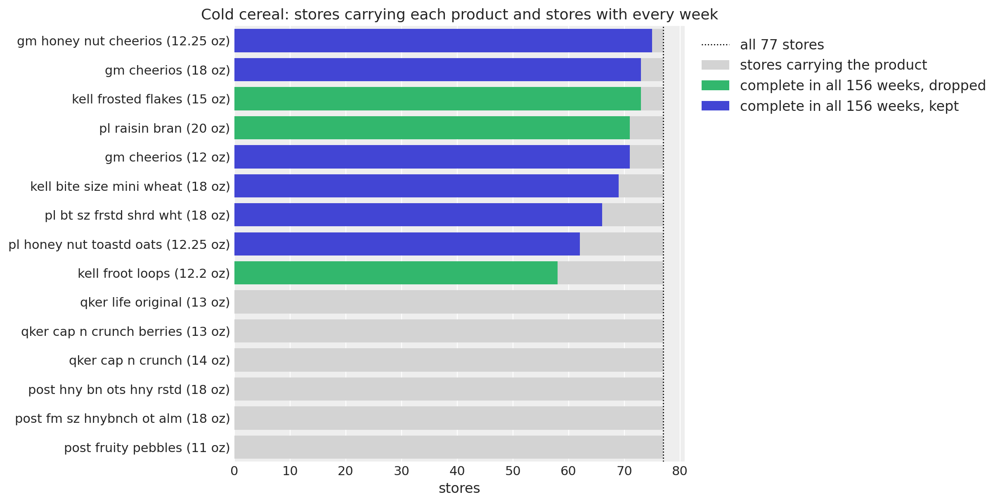</p>
</figure>


The Post and Quaker products are complete in no store: they were delisted and relisted, and a delisted product has no demand to model. The six products of the `all family cereal` sub-category from General Mills, Kellogg and the private label are carried in all 77 stores and complete in 62 to 75 of them. We keep these six: Honey Nut Cheerios (`hnc`, the focal product), two sizes of Cheerios, Kellogg's Mini Wheats, and two private-label products, one of which is the private-label twin of the focal product.

The next cell defines the steps that build the cereal frame every later section uses: keep the six products and give them short labels, join the product and store lookups, compute the price ratio and the discount depth, and label the mechanics of every store-week as `none`, `tpr-only`, `display`, `feature` or `feature + display`.


    In [9]:


``` python
def keep_panel_products(transactions: pl.DataFrame, labels: dict[int, str]) -> pl.DataFrame:
    """Keep the labeled UPCs and add their short product label."""
    return transactions.filter(pl.col("upc").is_in(list(labels))).with_columns(
        product=pl.col("upc").replace_strict(labels, return_dtype=pl.String)
    )


def join_lookups(
    transactions: pl.DataFrame, products: pl.DataFrame, stores: pl.DataFrame
) -> pl.DataFrame:
    """Join the product lookup on the UPC and the deduplicated store lookup on the store id."""
    return transactions.join(products, on="upc").join(
        stores, left_on="store_num", right_on="store_id"
    )


def log_price_ratio() -> pl.Expr:
    """Take the log of shelf over base price, capped at one so a lagged base price is no cut."""
    return price_ratio().clip(upper_bound=1.0).log()


def add_price_columns(cereal: pl.DataFrame) -> pl.DataFrame:
    """Add the discount, the log price ratio ``x`` and the log depth ``lam``."""
    return cereal.with_columns(
        discount=pl.lit(1.0).sub(price_ratio()), x=log_price_ratio()
    ).with_columns(lam=pl.col("x").neg())


def mechanics_label() -> pl.Expr:
    """Label a store-week by its mechanics from the feature, display and shelf-tag flags."""
    feature = pl.col("feature").eq(pl.lit(1))
    display = pl.col("display").eq(pl.lit(1))
    return (
        pl.when(feature.and_(display))
        .then(pl.lit("feature + display"))
        .when(feature)
        .then(pl.lit("feature"))
        .when(display)
        .then(pl.lit("display"))
        .when(pl.col("tpr_only").eq(pl.lit(1)))
        .then(pl.lit("tpr-only"))
        .otherwise(pl.lit("none"))
    )


def add_promotion_columns(cereal: pl.DataFrame) -> pl.DataFrame:
    """Add the series id, cut flag, mechanics label, feature-display interaction and log units."""
    return cereal.with_columns(
        series=pl.concat_str([pl.col("store_num"), pl.col("product")], separator="::"),
        cut=pl.col("discount").gt(pl.lit(0.02)).cast(pl.Int64),
        mechanics=mechanics_label(),
        feature_display=pl.col("feature").mul(pl.col("display")),
        log_units=pl.col("units").cast(pl.Float64).log(),
    )
```


The next cell builds the frame, drops the rows with a missing price or non-positive units, and checks two facts: that the drop removes no row of the six products, and that the workbook's `tpr_only` flag agrees exactly with our own definition (a cut of more than 2\\ without a feature or a display).


    In [10]:


``` python
cereal_df = (
    transactions_raw.pipe(keep_panel_products, PRODUCT_LABELS)
    .pipe(join_lookups, products_df, stores_df)
    .drop_nulls(["price", "base_price"])
    .filter(pl.col("units").gt(pl.lit(0)))
    .pipe(add_price_columns)
    .pipe(add_promotion_columns)
    .sort("store_num", "product", "week_end_date")
)
n_before = transactions_raw.pipe(keep_panel_products, PRODUCT_LABELS).height
assert cereal_df.height == n_before, "every six-product row has a price and positive units"
shelf_tag_only = (
    pl.col("cut")
    .eq(pl.lit(1))
    .and_(pl.col("feature").eq(pl.lit(0)))
    .and_(pl.col("display").eq(pl.lit(0)))
)
tpr_matches = cereal_df.select(pl.col("tpr_only").eq(pl.lit(1)).eq(shelf_tag_only).all()).item()
assert tpr_matches, "tpr_only must flag exactly the shelf-tag-only cuts"

print(f"cereal frame: {cereal_df.height:,} rows, one per store, product and week")

cereal_df.select(
    "store_num",
    "product",
    "week_end_date",
    "units",
    "price",
    "base_price",
    "discount",
    "mechanics",
).head()
```


    cereal frame: 71,774 rows, one per store, product and week


shape: (5, 8)

| store_num | product | week_end_date | units | price | base_price | discount | mechanics |
|----|----|----|----|----|----|----|----|
| i64 | str | date | i64 | f64 | f64 | f64 | str |
| 367 | "cheerios 12oz" | 2009-01-14 | 56 | 2.72 | 3.07 | 0.114007 | "feature" |
| 367 | "cheerios 12oz" | 2009-01-21 | 36 | 2.68 | 3.07 | 0.127036 | "tpr-only" |
| 367 | "cheerios 12oz" | 2009-01-28 | 20 | 3.19 | 3.19 | 0.0 | "none" |
| 367 | "cheerios 12oz" | 2009-02-04 | 16 | 3.19 | 3.19 | 0.0 | "none" |
| 367 | "cheerios 12oz" | 2009-02-11 | 13 | 1.72 | 3.19 | 0.460815 | "tpr-only" |


The frame keeps all 71{,}774 six-product rows, one per store, product and week, with the discount and the mechanics label the rest of the notebook works with.


## Missing store-product-weeks

The model section keeps only stores in which all six series are observed in every week. Before we apply that filter we should know what the missing weeks are, because two treatments are possible: fill the missing weeks with zero units and no price, or drop the store. Filling with zero is right only if a missing week is a week without sales. The next cell defines the helpers that measure the length of every run of missing weeks.


    In [11]:


``` python
def sort_by_order(frame: pl.DataFrame, column: str, order: list[str]) -> pl.DataFrame:
    """Sort the rows by the position of ``column`` in ``order``."""
    position = {value: i for i, value in enumerate(order)}
    return (
        frame.with_columns(order=pl.col(column).replace_strict(position))
        .sort("order")
        .drop("order")
    )


def missing_spells(cereal: pl.DataFrame) -> pl.DataFrame:
    """Return one row per run of missing weeks of every store-product series."""
    weeks = cereal["week_end_date"].unique().sort()
    observed = cereal.select("store_num", "product", "week_end_date").with_columns(
        present=pl.lit(True)
    )
    grid = (
        cereal.select("store_num", "product")
        .unique()
        .join(pl.DataFrame({"week_end_date": weeks}), how="cross")
        .join(observed, on=["store_num", "product", "week_end_date"], how="left")
        .with_columns(present=pl.col("present").fill_null(pl.lit(False)))
        .sort(["store_num", "product", "week_end_date"])
        .with_columns(
            spell=pl.col("present")
            .ne(pl.col("present").shift(1))
            .fill_null(pl.lit(True))
            .cum_sum()
            .over(["store_num", "product"])
        )
    )
    return (
        grid.filter(pl.col("present").not_())
        .group_by(["store_num", "product", "spell"])
        .agg(weeks_missing=pl.len(), first_week=pl.col("week_end_date").min())
        .drop("spell")
    )


def run_length_bucket(column: str) -> pl.Expr:
    """Bucket a run length as ``1``, ``2`` or ``3+`` weeks."""
    return (
        pl.when(pl.col(column).ge(pl.lit(3)))
        .then(pl.lit("3+"))
        .otherwise(pl.col(column).cast(pl.String))
    )
```


In the following plot we count the runs of missing weeks by their length and the stores by their longest run, over the six products and all 77 stores.


    In [12]:


``` python
spells = cereal_df.pipe(missing_spells)
gap_buckets = ["1", "2", "3+"]
runs_by_length = (
    spells.with_columns(bucket=run_length_bucket("weeks_missing"))
    .group_by("bucket")
    .agg(runs=pl.len())
    .pipe(sort_by_order, "bucket", gap_buckets)
)
stores_by_longest_gap = (
    spells.group_by("store_num")
    .agg(longest=pl.col("weeks_missing").max())
    .with_columns(bucket=run_length_bucket("longest"))
    .group_by("bucket")
    .agg(stores=pl.len())
    .pipe(sort_by_order, "bucket", gap_buckets)
)

fig, axes = plt.subplots(ncols=2, figsize=(12, 4.5), layout="constrained")
sns.barplot(
    data=runs_by_length.to_dict(as_series=False), x="bucket", y="runs", color="C0", ax=axes[0]
)
axes[0].bar_label(axes[0].containers[0])
axes[0].set(xlabel="weeks in the run", ylabel="runs", title="Runs of missing weeks by length")
sns.barplot(
    data=stores_by_longest_gap.to_dict(as_series=False),
    x="bucket",
    y="stores",
    color="C1",
    ax=axes[1],
)
axes[1].bar_label(axes[1].containers[0])
axes[1].set(
    xlabel="longest run in the store",
    ylabel="stores",
    title=f"Stores with a missing week ({spells['store_num'].n_unique()} of 77)",
)
fig.suptitle("Missing store-product-weeks of the six products", fontsize=16, fontweight="bold");
```


<figure class="figure">
<p>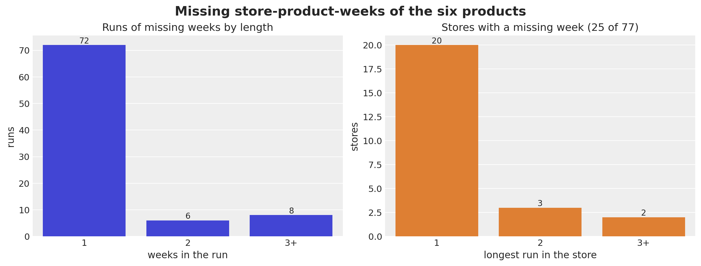</p>
</figure>


Nearly every run is one week long, and in most of the affected stores the longest run is one or two weeks. The next cell lists the runs longer than two weeks and the calendar week that the one-week runs share most often.


    In [13]:


``` python
long_runs = spells.filter(pl.col("weeks_missing").gt(pl.lit(2))).sort("store_num", "first_week")
shared_week = (
    spells.filter(pl.col("weeks_missing").eq(pl.lit(1)))
    .group_by("first_week")
    .agg(stores=pl.col("store_num").n_unique())
    .sort(["stores", "first_week"], descending=[True, False])
    .row(0, named=True)
)

long_runs_by_store = long_runs.group_by("store_num", maintain_order=True).agg(
    products=pl.col("product").n_unique(),
    runs=pl.col("weeks_missing").unique().sort(descending=True),
    first_week=pl.col("first_week").min(),
)
long_run_facts = "; ".join(
    f"store {row['store_num']}: {row['products']} product(s), runs of "
    f"{' and '.join(str(weeks) for weeks in row['runs'])} weeks from {row['first_week']}"
    for row in long_runs_by_store.iter_rows(named=True)
)

print(
    f"runs longer than two weeks: {long_run_facts}. "
    f"The most shared one-week gap is {shared_week['first_week']} "
    f"({shared_week['stores']} stores)"
)
```


    runs longer than two weeks: store 387: 6 product(s), runs of 25 weeks from 2009-02-11; store 8035: 1 product(s), runs of 57 and 7 weeks from 2009-01-14. The most shared one-week gap is 2011-12-28 (10 stores)


Only two stores have real gaps: store 387 is absent for 25 weeks for all six products, and store 8035 does not carry Mini Wheats for the first 57 weeks and for 7 more weeks in 2010. Ten stores share the same missing week, December 28, 2011, so a one-week gap is a week missing from the extract, not a week without sales: a product that sells dozens of units a week does not sell zero in one week and dozens again the next. Filling such a week with zero units would put a false zero into the level of the series and a false "no cut" into the price.

We keep only the stores in which all six series are complete. This costs information but not bias: the selection is a property of the extract, every elasticity is identified within a store, and the model section takes only six stores per segment out of the 52 complete ones anyway. A deployment that must model the whole panel would instead complete the store-product-week grid, mask the missing units out of the likelihood so the level continues through the gap, and impute the missing price with the base price. [predict](../../../reference/models.predict.md#numpyro_forecast.models.predict) has no mask argument yet; this is listed in the next steps.


# Exploratory data analysis

Two facts about the promotions decide what the model must carry and where the counterfactual event goes: whether cuts and mechanics arrive together, and what ran in the holdout quarter.


## Do price cuts and mechanics arrive together?

If a deep cut almost always comes with a feature or a display, a regression of units on price alone credits the mechanics uplift to the price, and the model needs the mechanics as their own terms. The helper of the next cell reads the cut depth with a lagged base price as no cut; the cell after it computes, per mechanics and over all 77 stores, the number of store-weeks, the share of those weeks with a cut, the mean cut depth and the mean units, and the following plot shows the four as bars.


    In [14]:


``` python
def cut_depth() -> pl.Expr:
    """Clip the discount at zero, so a shelf price above the base price reads as no cut."""
    return pl.col("discount").clip(lower_bound=0.0)
```


    In [15]:


``` python
mechanics_order = ["none", "tpr-only", "display", "feature", "feature + display"]
mechanics_table = (
    cereal_df.group_by("mechanics")
    .agg(
        store_weeks=pl.len().cast(pl.Float64),
        share_with_cut=pl.col("cut").mean(),
        mean_depth=cut_depth().mean(),
        mean_units=pl.col("units").mean(),
    )
    .pipe(sort_by_order, "mechanics", mechanics_order)
)
```


    In [16]:


``` python
mechanics_quantities = ["store_weeks", "share_with_cut", "mean_depth", "mean_units"]
mechanics_formats = {
    "store_weeks": "{:,.0f}",
    "share_with_cut": "{:.2f}",
    "mean_depth": "{:.0%}",
    "mean_units": "{:.0f}",
}
mechanics_long = mechanics_table.unpivot(
    index="mechanics", variable_name="quantity", value_name="value"
)
grid = sns.catplot(
    data=mechanics_long.to_dict(as_series=False),
    x="mechanics",
    y="value",
    col="quantity",
    col_order=mechanics_quantities,
    col_wrap=2,
    kind="bar",
    order=mechanics_order,
    color="C0",
    sharey=False,
    height=3.6,
    aspect=1.5,
)
grid.set_titles("{col_name}")
grid.set_axis_labels("", "")

for ax, quantity in zip(grid.axes.flat, mechanics_quantities, strict=True):
    ax.bar_label(ax.containers[0], fmt=mechanics_formats[quantity])
    ax.tick_params(axis="x", rotation=15)
    ax.margins(y=0.15)
    if quantity == "mean_depth":
        ax.yaxis.set_major_formatter(mtick.PercentFormatter(xmax=1, decimals=0))

grid.figure.suptitle(
    "Store-weeks, cuts, depth and units by mechanics (77 stores)",
    fontsize=16,
    fontweight="bold",
    y=1.03,
);
```


<figure class="figure">
<p>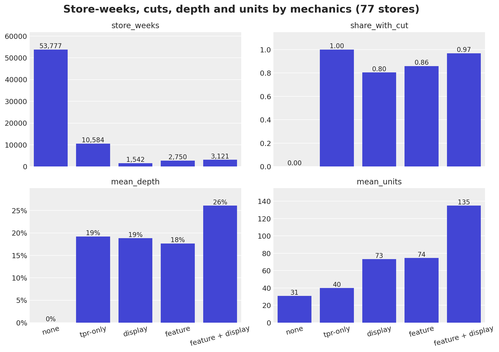</p>
</figure>


Store-weeks without any promotion average 31 units; a shelf-tag cut alone brings the average to 40, a display to 73, a feature to 74 and a feature with display to 135, at mean cut depths of 18\\ to 26\\. So the mechanics move units far more than the cut does, which matches the first two empirical generalizations of [Blattberg, Briesch and Fox (1995)](https://doi.org/10.1287/mksc.14.3.G122). And 97\\ of the feature-with-display weeks carry a cut, so cuts and mechanics arrive together. The model must carry the mechanics as their own terms, next to the price.


## What ran in the holdout quarter

The last 13 weeks of the panel, from October 2011 to the first week of January 2012, are the holdout of the forecast evaluation and the horizon on which we place the counterfactual promotions. The holdout evaluation uses the realized promotions as inputs, and the counterfactual event takes the slot of the realized Thanksgiving event, so we need to know what ran. In the following plot we show, for the focal product and every horizon week, the share of stores with a feature, a display or a shelf-tag cut, and the mean cut depth.


    In [17]:


``` python
all_weeks = cereal_df["week_end_date"].unique().sort()
HORIZON = 13
t_train = N_WEEKS - HORIZON
holdout_weeks = all_weeks[t_train:]
realized_calendar = (
    cereal_df.filter(
        pl.col("product")
        .eq(pl.lit(FOCAL))
        .and_(pl.col("week_end_date").is_in(holdout_weeks.to_list()))
    )
    .group_by("week_end_date")
    .agg(
        feature=pl.col("feature").mean(),
        display=pl.col("display").mean(),
        tpr_only=pl.col("tpr_only").mean(),
        depth=cut_depth().mean(),
    )
    .sort("week_end_date")
    .with_row_index("horizon_week", offset=1)
)
horizon_weeks = realized_calendar["horizon_week"].to_numpy()
EVENT_OFFSETS = [6, 7]  # horizon weeks 7 and 8 (zero-based offsets), the Thanksgiving weeks

fig, axes = plt.subplots(nrows=2, figsize=(11, 7), sharex=True, layout="constrained")

for column, marker in [("feature", "o"), ("display", "s"), ("tpr_only", "^")]:
    axes[0].plot(horizon_weeks, realized_calendar[column].to_numpy(), marker=marker, label=column)

axes[0].yaxis.set_major_formatter(mtick.PercentFormatter(xmax=1, decimals=0))
axes[0].set(ylabel="share of stores", title="Share of stores running each mechanics")
depth_bars = axes[1].bar(horizon_weeks, realized_calendar["depth"].to_numpy(), color="C1")
axes[1].bar_label(depth_bars, labels=[f"{d:.0%}" for d in realized_calendar["depth"]])
axes[1].yaxis.set_major_formatter(mtick.PercentFormatter(xmax=1, decimals=0))
axes[1].set(xlabel="horizon week", ylabel="mean cut depth", title="Mean cut depth")
axes[1].set_xticks(horizon_weeks)

for ax in axes:
    ax.axvspan(
        EVENT_OFFSETS[0] + 0.5,
        EVENT_OFFSETS[-1] + 1.5,
        color="gray",
        alpha=0.15,
        label="Thanksgiving weeks",
    )

axes[0].legend(loc="upper left", bbox_to_anchor=(1.01, 1.0))
fig.suptitle(
    f"Realized promotions of {FOCAL} in the holdout quarter (77 stores)",
    fontsize=16,
    fontweight="bold",
);
```


<figure class="figure">
<p>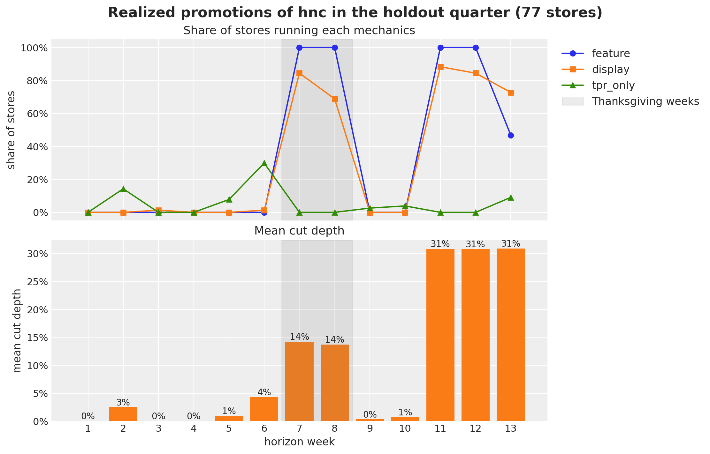</p>
</figure>


The retailer ran a feature with display at about a 15\\ cut in the two Thanksgiving weeks: in horizon weeks 7 and 8 every store featured the product, 84\\ and 69\\ of the stores displayed it, and the mean depth was 14\\. Around Christmas, weeks 11 and 12 carried a 31\\ cut with a feature in every store. Weeks 7 and 8 become the event weeks of the counterfactual promotions, and "feature with display at a 15\\ cut" becomes the committed policy of the order section.


# Feature engineering: the modeling panel

This section builds the arrays the model reads: the stores, the long frame with one row per store-product-week, and the dense tensors.


## Store selection

The model needs a block of complete series, and the fit should stay at a few minutes on a laptop. So we keep the stores in which all six series are complete over the 156 weeks and take `N_STORES_PER_SEGMENT = 6` stores per price segment (`mainstream`, `upscale` and `value`), the largest by average weekly baskets, which keeps the three segments represented. Six products in 18 stores give 108 series, each identified as `store::product`. The cost of the fit grows about linearly with the number of series, so all 52 complete stores (312 series) would take about three times as long. The next cell defines the completeness rule.


    In [18]:


``` python
def series_is_complete(n_weeks: int) -> pl.Expr:
    """Flag a series whose distinct weeks span the whole panel."""
    return pl.col("weeks").eq(pl.lit(n_weeks))


def store_is_complete(n_weeks: int, n_products: int) -> pl.Expr:
    """Flag a store in which every product is present and every series is complete."""
    return series_is_complete(n_weeks).all().and_(pl.len().eq(pl.lit(n_products)))


def complete_stores_by_segment(
    cereal: pl.DataFrame, stores: pl.DataFrame, n_weeks: int, n_products: int
) -> pl.DataFrame:
    """Keep the stores whose series all span every week, sorted by segment and basket size."""
    return (
        cereal.pipe(weeks_per_series, ["store_num", "product"])
        .group_by("store_num")
        .agg(all_complete=store_is_complete(n_weeks, n_products))
        .filter(pl.col("all_complete"))
        .join(
            stores.select("store_id", "seg_value_name", "avg_weekly_baskets"),
            left_on="store_num",
            right_on="store_id",
        )
        .sort(
            ["seg_value_name", "avg_weekly_baskets", "store_num"], descending=[False, True, False]
        )
    )
```


The next cell applies the rule, selects the six largest stores of each segment, and plots the average weekly baskets of the selected stores.


    In [19]:


``` python
N_STORES_PER_SEGMENT = 6
complete_stores = cereal_df.pipe(complete_stores_by_segment, stores_df, N_WEEKS, n_products)
selected = complete_stores.group_by("seg_value_name", maintain_order=True).head(
    N_STORES_PER_SEGMENT
)
selected_stores: list[int] = selected["store_num"].to_list()
n_stores = len(selected_stores)
store_segment: dict[int, str] = dict(
    zip(selected["store_num"].to_list(), selected["seg_value_name"].to_list(), strict=True)
)
segments = ["mainstream", "upscale", "value"]
complete_per_segment = dict(
    complete_stores.group_by("seg_value_name").len().sort("seg_value_name").iter_rows()
)

print(f"stores with all six series complete, per segment: {complete_per_segment}")
```


    stores with all six series complete, per segment: {'mainstream': 32, 'upscale': 11, 'value': 9}


All six series are complete in 52 stores: 32 mainstream, 11 upscale and 9 value. In the following plot we show the average weekly baskets of the 18 selected stores by segment.


    In [20]:


``` python
fig, ax = plt.subplots(figsize=(12, 5), layout="constrained")
sns.barplot(
    data=selected.with_columns(pl.col("store_num").cast(pl.String)).to_dict(as_series=False),
    x="store_num",
    y="avg_weekly_baskets",
    hue="seg_value_name",
    hue_order=segments,
    ax=ax,
)
sns.move_legend(ax, "upper left", bbox_to_anchor=(1.01, 1.0), title="segment")
ax.tick_params(axis="x", rotation=45)
ax.set(
    xlabel="store",
    ylabel="average weekly baskets",
    title=f"The {n_stores} selected stores: the six largest complete stores of each segment",
);
```


<figure class="figure">
<p>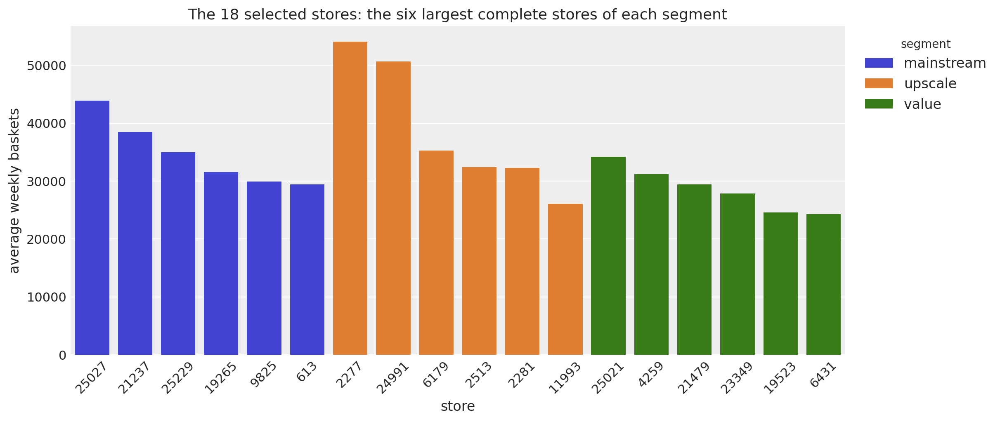</p>
</figure>


The 18 selected stores are the six largest of each segment by weekly baskets, so the zone-level numbers below describe high-volume stores.


## The long frame and the model inputs

The model reads an inputs tensor with one channel per input. The inputs of a series are its own log price ratio x, its feature and display flags, two sibling flags (any other product of the panel featured or displayed at the same store-week), and the log price ratios of all six products at its store. The sibling flags and the six prices are there because a promotion of the focal product reaches its siblings through their inputs: their cross-price channel and their sibling flags change. The seasonal controls of the exploratory regressions below are an annual Fourier basis with `N_MODES = 2` harmonics and a linear trend. The next cell defines one small expression per input.


    In [21]:


``` python
def annual_fourier(week: str, n_modes: int = N_MODES, period: float = 52.18) -> list[pl.Expr]:
    """Build the annual Fourier terms ``sin1, cos1, ..., sin{n_modes}, cos{n_modes}`` of a week."""
    terms = []

    for harmonic in range(1, n_modes + 1):
        angle = pl.col(week).mul(pl.lit(2.0 * harmonic * np.pi)).truediv(pl.lit(period))
        terms += [angle.sin().alias(f"sin{harmonic}"), angle.cos().alias(f"cos{harmonic}")]

    return terms


def sibling_flag(flag: str) -> pl.Expr:
    """Flag a store-week in which any other product of the panel carries ``flag``."""
    total = pl.col(flag).sum().over(["store_num", "week_end_date"])
    return total.sub(pl.col(flag)).gt(pl.lit(0)).cast(pl.Float64)


def store_prices(panel: pl.DataFrame, products: list[str]) -> pl.DataFrame:
    """Add one column ``price <product>`` with the log price ratio of every product at a store."""
    wide = panel.pivot(on="product", index=["store_num", "week_end_date"], values="x").rename(
        {product: f"price {product}" for product in products}
    )
    return panel.join(wide, on=["store_num", "week_end_date"])


def add_depth_slopes() -> list[pl.Expr]:
    """Build the depth-slope regressors: the log depth under a feature and under a display."""
    return [
        pl.col("feature").mul(pl.col("lam")).alias("feature_lam"),
        pl.col("display").mul(pl.col("lam")).alias("display_lam"),
    ]
```


The next cell builds the long frame of the 18 stores, one row per store-product-week, sorted by week and series. The last 13 weeks are the holdout.


    In [22]:


``` python
panel_df = cereal_df.filter(pl.col("store_num").is_in(selected_stores))
series_ids: list[str] = [
    f"{store}::{product}" for store in selected_stores for product in product_order
]
n_series = len(series_ids)
series_position = {series: i for i, series in enumerate(series_ids)}
fourier_terms = [f"{name}{k}" for k in range(1, N_MODES + 1) for name in ("sin", "cos")]
seasonal_terms = [*fourier_terms, "trend"]

long_df = (
    panel_df.with_columns(
        time=pl.col("week_end_date").rank("dense").cast(pl.Int64).sub(pl.lit(1)),
        feature=pl.col("feature").cast(pl.Float64),
        display=pl.col("display").cast(pl.Float64),
    )
    .with_columns(sib_feature=sibling_flag("feature"), sib_display=sibling_flag("display"))
    .pipe(store_prices, product_order)
    .with_columns(
        *add_depth_slopes(),
        *annual_fourier("time"),
        trend=pl.col("time").truediv(pl.lit(N_WEEKS)),
        series_position=pl.col("series").replace_strict(series_position),
    )
    .sort("time", "series_position")
    .drop("series_position")
)
train_long = long_df.filter(pl.col("time").lt(pl.lit(t_train)))
input_names: list[str] = [
    "x",
    "feature",
    "display",
    "sib_feature",
    "sib_display",
    *[f"price {product}" for product in product_order],
]
long_df.select(
    "series", "time", "units", "x", "feature", "display", "sib_feature", "sib_display", "price hnc"
).head()
```


shape: (5, 9)

| series | time | units | x | feature | display | sib_feature | sib_display | price hnc |
|----|----|----|----|----|----|----|----|----|
| str | i64 | i64 | f64 | f64 | f64 | f64 | f64 | f64 |
| "25027::hnc" | 0 | 70 | 0.0 | 0.0 | 0.0 | 1.0 | 0.0 | 0.0 |
| "25027::cheerios 12oz" | 0 | 181 | -0.22394 | 1.0 | 0.0 | 0.0 | 0.0 | 0.0 |
| "25027::cheerios 18oz" | 0 | 69 | 0.0 | 0.0 | 0.0 | 1.0 | 0.0 | 0.0 |
| "25027::mini wheats" | 0 | 46 | 0.0 | 0.0 | 0.0 | 1.0 | 0.0 | 0.0 |
| "25027::pl honey nut oats" | 0 | 50 | 0.0 | 0.0 | 0.0 | 1.0 | 0.0 | 0.0 |


Every row carries its own inputs and the price of every product at its store (`price hnc` is the focal product's log price ratio, equal to `x` on the focal rows). The helper of the next cell pivots one column of the long frame into a dense `(week, series)` matrix with one column per series; the cell after it pivots every input, the units and the base price, stacks the eleven inputs into the tensor and splits the training window from the holdout. The base price of the last training week is the reference price of every currency number below.


    In [23]:


``` python
def make_pivot(value: str) -> Float[np.ndarray, " duration n_series"]:
    """Build the dense (week x series) matrix of one long-frame column.

    Columns follow ``series_ids`` order (store-major, then the product order) so every
    pivot shares the same series axis; a missing cell is an error, not a zero.
    """
    pivot_df = long_df.pivot(on="series", index="week_end_date", values=value).sort(
        "week_end_date"
    )
    matrix = pivot_df.select(series_ids).to_numpy().astype(np.float64)
    if matrix.shape != (len(dates), n_series) or np.isnan(matrix).any():
        msg = f"Unexpected pivot for {value!r}: shape {matrix.shape}"
        raise ValueError(msg)
    return matrix
```


    In [24]:


``` python
dates_series = panel_df["week_end_date"].unique().sort()
dates = dates_series.to_numpy()
dates_num = np.asarray(mdates.date2num(dates))
split_x = float(dates_num[t_train])
panel_ds = xr.Dataset(
    {
        column: (("time", "series"), make_pivot(column))
        for column in ["units", "discount", "base_price", *input_names]
    },
    coords={"time": dates, "series": series_ids},
)
series_to_product = jnp.asarray(
    [product_order.index(s.split("::")[1]) for s in series_ids], dtype=jnp.int32
)
series_to_store = jnp.asarray(
    [selected_stores.index(int(s.split("::")[0])) for s in series_ids], dtype=jnp.int32
)
series_to_product_np = np.asarray(series_to_product)
series_to_store_np = np.asarray(series_to_store)
# Channels of the inputs tensor (inputs, weeks, series): 0 own log price ratio x, 1 feature,
# 2 display, 3 sibling feature, 4 sibling display, 5 to 10 the log price ratio of every
# product at the store in product_order (the cross-price block).
PRICE_BLOCK = 5
covariates = jnp.asarray(
    np.stack([panel_ds[name].to_numpy() for name in input_names]), dtype=jnp.float32
)
covariates_train = covariates[:, :t_train, :]
y = jnp.asarray(panel_ds["units"].to_numpy(), dtype=jnp.int32)
y_train = y[:t_train]
y_test = y[t_train:]
y_train_f = np.asarray(y_train, dtype=np.float32)
y_test_f = np.asarray(y_test, dtype=np.float32)
base_price = panel_ds["base_price"].isel(time=t_train - 1).to_numpy()
focal_base_price = base_price[series_to_product_np == FOCAL_INDEX]

print(
    f"inputs: {covariates.shape} (inputs, weeks, series), training units: {y_train.shape}, "
    f"holdout units: {y_test.shape}; {FOCAL} base price at the last training week "
    f"{focal_base_price.min():.2f} to {focal_base_price.max():.2f} across the {n_stores} stores"
)
```


    inputs: (11, 156, 108) (inputs, weeks, series), training units: (143, 108), holdout units: (13, 108); hnc base price at the last training week 2.61 to 3.07 across the 18 stores


The tensor has shape (11, 156, 108): eleven input channels, 156 weeks and 108 series. Base prices differ across stores (the focal product's base price ranges from 2.61 to 3.07), so every currency number below uses the store's own price.


## Nine focus stores

In the following plot we look at the focal product's weekly units in nine of the selected stores, three per segment (one column per segment), with the discount depth on a second axis and the feature and display weeks shaded, to see the pattern the model must reproduce.


    In [25]:


``` python
focus_by_segment: dict[str, list[int]] = {
    segment: selected.filter(pl.col("seg_value_name").eq(pl.lit(segment)))["store_num"]
    .head(3)
    .to_list()
    for segment in segments
}
focus_stores = [store for segment in segments for store in focus_by_segment[segment]]
focus_labels = [f"{store}::{FOCAL}" for store in focus_stores]

fig, axes = plt.subplots(nrows=3, ncols=3, figsize=(18, 9), sharex=True, layout="constrained")

for k, segment in enumerate(segments):
    for j, store in enumerate(focus_by_segment[segment]):
        ax = axes[j, k]
        label = f"{store}::{FOCAL}"
        ax.plot(
            dates, panel_ds["units"].sel(series=label), color="black", linewidth=1.2, label="units"
        )
        ax.axvline(split_x, color="C3", linestyle="--", linewidth=1, label="train-test split")
        ax.fill_between(
            dates,
            0,
            1,
            where=(panel_ds["feature"].sel(series=label) > 0.5).to_numpy().tolist(),
            transform=ax.get_xaxis_transform(),
            color="C0",
            alpha=0.3,
            linewidth=0,
            step="mid",
            label="feature week",
        )
        ax.fill_between(
            dates,
            0,
            1,
            where=(panel_ds["display"].sel(series=label) > 0.5).to_numpy().tolist(),
            transform=ax.get_xaxis_transform(),
            color="C4",
            alpha=0.25,
            linewidth=0,
            step="mid",
            label="display week",
        )
        ax.set(title=f"store {store} ({segment})")
        ax_twin = ax.twinx()
        ax_twin.plot(
            dates,
            panel_ds["discount"].sel(series=label).clip(0.0, 1.0),
            color="C1",
            alpha=0.9,
            linewidth=1,
            label="discount depth",
        )
        ax_twin.grid(False)
        ax_twin.yaxis.set_major_formatter(mtick.PercentFormatter(xmax=1, decimals=0))
        ax_twin.set(ylim=(0, 0.6))
        if k == 0:
            ax.set_ylabel("units")
        if k == 2:
            ax_twin.set_ylabel("discount")

for ax in axes[-1]:
    ax.xaxis.set_major_locator(mdates.YearLocator())
    ax.xaxis.set_major_formatter(mdates.DateFormatter("%Y"))

# The labels are the same in every panel, so the last panel and its twin axis give the legend.
handles, labels = ax.get_legend_handles_labels()
twin_handles, twin_labels = ax_twin.get_legend_handles_labels()
fig.legend(handles + twin_handles, labels + twin_labels, loc="outside lower center", ncols=5)
fig.suptitle(
    "Honey Nut Cheerios units, discounts and mechanics in nine focus stores",
    fontsize=16,
    fontweight="bold",
);
```


<figure class="figure">
<p>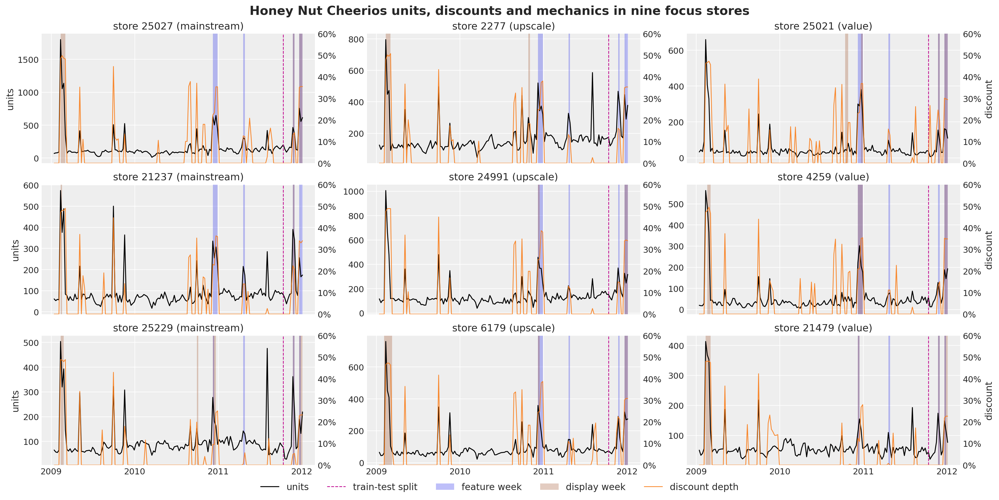</p>
</figure>


The promotion weeks stand out in every store: units jump to several times their usual level in the feature and display weeks (up to 18 times in store 25027), and the shelf-tag cuts between them move the units far less. The largest spikes come with the deepest cuts, but a cut without a feature or a display rarely produces a spike. This is the pattern the model has to reproduce: a multiplicative uplift for the mechanics, a price response on top of it, and a level that does not absorb the spikes.


# Model specification

This section states what we estimate and under which assumption, runs the least-squares checks that justify each term of the model, and writes the model.


## Estimand and identifying assumption

The quantity we want is the expected weekly units of the focal product under a discount d and a mechanics m, with the other inputs at their factual values. This is a promotional elasticity: the response to a temporary cut below the base price, not the response to a change in the base price itself, which the level of each series absorbs. A regular-price elasticity would need a different design, and this notebook cannot answer regular-price questions. [Bijmolt, van Heerde and Pieters (2005)](https://doi.org/10.1509/jmkr.42.2.141.62296) document that promotional elasticities exceed regular-price ones.

Prices were not randomized. The retailer and the manufacturers set the promotion calendar through trade deals, and the same deal sets the cut, the feature and the display together. The causal graph in the next cell draws the identifying assumption: conditional on the mechanics flags, the sibling flags, the competitor prices and the seasonal and level terms, the depth of the cut is as good as random with respect to the unobserved demand shocks. The second cluster shows what would break it: a demand shock (a coupon drop, a competitor's promotion in another retailer) that moves both the deal calendar and the units. We cannot test the assumption with these data; the holdout below validates the forecasting engine under the realized calendar, not the counterfactual ones.


    In [26]:


``` python
dag = gr.Digraph()
dag.attr(rankdir="LR")
with dag.subgraph(name="cluster_assumption") as cluster:
    cluster.attr(label="Identifying assumption", color="gray")
    cluster.node("U", label="trade-deal calendar\n(unobserved)", color="lightgray", style="filled")
    cluster.node("d", label="discount depth\n(lever)", color="#2a2eec80", style="filled")
    cluster.node("F", label="feature\n(lever)", color="#2a2eec80", style="filled")
    cluster.node("D", label="display\n(lever)", color="#2a2eec80", style="filled")
    cluster.node(
        "Z",
        label="season, level, competitor prices,\nsibling flags\n(conditioned)",
        shape="box",
        color="#fa7c1780",
        style="filled",
    )
    cluster.node("Y", label="units\n(outcome)", color="#328c0680", style="filled")

    for lever in ("d", "F", "D"):
        cluster.edge("U", lever)
        cluster.edge(lever, "Y")

    cluster.edge("Z", "Y")
    cluster.edge("Z", "U")
with dag.subgraph(name="cluster_violation") as cluster:
    cluster.attr(label="What would break it", color="gray")
    cluster.node(
        "V", label="demand shock or coupons\n(unobserved)", color="lightgray", style="filled"
    )
    cluster.node(
        "U2", label="trade-deal calendar\n(unobserved)", color="lightgray", style="filled"
    )
    cluster.node("d2", label="discount depth\n(lever)", color="#2a2eec80", style="filled")
    cluster.node("Y2", label="units\n(outcome)", color="#328c0680", style="filled")
    cluster.edge("V", "U2")
    cluster.edge("U2", "d2")
    cluster.edge("d2", "Y2")
    cluster.edge("V", "Y2", color="red")
dag
```


<figure class="figure">
<p>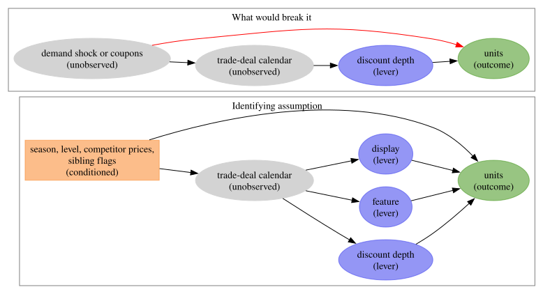</p>
</figure>


The upper graph is the assumption: the trade-deal calendar sets the three levers, and once we condition on the boxed variables, the levers are the only open path into the units. The lower graph is the violation: an unobserved demand shock that moves both the calendar and the units opens the red path, and the elasticity would absorb it.


## Notation and the exploratory regressions

Before the Bayesian model we run a few least-squares regressions. They have two jobs: to show the identification problem in numbers (what happens to a price coefficient when the mechanics are left out), and to give the point estimates that the decision section compares with the posterior. No decision uses them directly. All of them, and the Bayesian model after them, share one notation:

- A series i is one store-product pair, with store s(i) and product p(i); \text{H} is the focal product. Weeks are t = 1, \dots, T, with T = 143 training weeks.
- y\_{t,i} is the unit sales of series i in week t.
- x\_{t,i} = \log(\text{price}\_{t,i} / \text{base price}\_{t,i}) \le 0 is the log price ratio; d\_{t,i} = 1 - e^{x\_{t,i}} is the discount and \lambda\_{t,i} = -x\_{t,i} the log depth.
- F\_{t,i} and D\_{t,i} are the feature and display flags; F^{\text{sib}}\_{t,i} and D^{\text{sib}}\_{t,i} flag any other product of the panel featured or displayed at the same store-week.
- x\_{k,t,s} is the log price ratio of product k at store s in week t.
- z\_{t,i} = (F, D, FD, F\lambda, D\lambda, F^{\text{sib}}, D^{\text{sib}})\_{t,i} collects the seven mechanics regressors, and b their coefficients: the uplifts b^{\text{feat}} and b^{\text{disp}}, the interaction b^{\text{fd}}, the depth slopes b^{\text{feat},\lambda} and b^{\text{disp},\lambda}, and the sibling effects b^{\text{sib,feat}} and b^{\text{sib,disp}}.
- c(t) = f(t)^\top \beta + \beta\_\tau\\ t / T are the seasonal and trend controls, with f(t) the annual Fourier basis of K = 2 harmonics.

The generic exploratory regression is

 \log y\_{t,i} = a_i + \varepsilon\\ x\_{t,i} + b^\top z\_{t,i} + c(t) + e\_{t,i}, 

with a_i a fixed effect per series, so every coefficient uses only the variation within a series, and e\_{t,i} the residual. Each check below drops or adds terms and states which. The helper `within_ols` fits this regression with [pyfixest](https://pyfixest.org/) and returns the coefficients and their standard errors.


    In [27]:


``` python
def within_ols(
    frame: pl.DataFrame, columns: list[str], target: str = "log_units", by: str = "series"
) -> pl.DataFrame:
    """Fit least squares with a fixed effect per group, through ``pyfixest``.

    Parameters
    ----------
    frame
        Long table with one row per store-product-week.
    columns
        Regressor columns.
    target
        Response column.
    by
        Grouping column absorbed as a fixed effect.

    Returns
    -------
    pl.DataFrame
        One row per regressor with its coefficient and classical standard error (the
        ``iid`` covariance with the fixed effects counted in the degrees of freedom). A
        regressor that is collinear within the frame is dropped by the fit and reported as
        ``NaN``.
    """
    # Column names such as ``price cheerios 12oz`` are not formula-safe, so the fit runs on
    # positional names and the result maps them back.
    safe = {column: f"x_{i}" for i, column in enumerate(columns)}
    selected = frame.select(target, by, *columns).rename(safe)
    data = pd.DataFrame({name: selected[name].to_numpy() for name in selected.columns})
    formula = f"{target} ~ {' + '.join(safe.values())} | {by}"
    with warnings.catch_warnings():
        # In a single store the feature-display interaction can coincide with the feature flag;
        # the dropped regressor shows up as NaN below, so the warning adds nothing.
        warnings.filterwarnings("ignore", message=r"(?s).*multicollinearity", category=UserWarning)
        fit = pf.feols(formula, data=data, vcov="iid")
    coef = fit.coef().reindex(list(safe.values())).to_numpy()
    se = fit.se().reindex(list(safe.values())).to_numpy()
    return pl.DataFrame({"term": columns, "coef": coef, "se": se})
```


## What identifies the price effect: the naive elasticity and the flags

The mechanics figure showed that cuts and mechanics arrive together. Here we measure what that does to a price coefficient with three regressions of log units on the log price ratio, per product and pooled over the six:

\begin{align\*} \text{naive:} \quad & \log y\_{t,i} = a_i + \varepsilon\\ x\_{t,i} + c(t) + e\_{t,i} \\ \text{with flags:} \quad & \log y\_{t,i} = a_i + \varepsilon\\ x\_{t,i} + b^\top z^{\text{flags}}\_{t,i} + c(t) + e\_{t,i} \\ \text{with depth slopes:} \quad & \log y\_{t,i} = a_i + \varepsilon\\ x\_{t,i} + b^\top z\_{t,i} + c(t) + e\_{t,i} \end{align\*}

with z^{\text{flags}} = (F, D, FD, F^{\text{sib}}, D^{\text{sib}}) and z the full mechanics vector with the depth slopes. The naive \varepsilon is the elasticity a price-only regression reports; the third is the one the Bayesian model carries. The next cell fits the three specifications on the training weeks, and the following plot shows the price coefficient of each.


    In [28]:


``` python
FLAG_TERMS = ["feature", "display", "feature_display", "sib_feature", "sib_display"]
DEPTH_TERMS = ["feature_lam", "display_lam"]
MECHANICS_TERMS = [*FLAG_TERMS, *DEPTH_TERMS]
SPECIFICATIONS = {
    "naive": ["x", *seasonal_terms],
    "with flags": ["x", *FLAG_TERMS, *seasonal_terms],
    "with depth slopes": ["x", *MECHANICS_TERMS, *seasonal_terms],
}


def own_elasticity_rows(frame: pl.DataFrame, label: str) -> list[dict[str, float | str]]:
    """Fit the own price coefficient under the three specifications for one product or the pool."""
    return [
        {
            "product": label,
            "specification": name,
            "elasticity": float(within_ols(frame, columns)["coef"][0]),
        }
        for name, columns in SPECIFICATIONS.items()
    ]
```


    In [29]:


``` python
own_elasticity_ols = pl.DataFrame(
    [
        row
        for product in product_order
        for row in own_elasticity_rows(
            train_long.filter(pl.col("product").eq(pl.lit(product))), product
        )
    ]
    + own_elasticity_rows(train_long, "pooled")
)
```


    In [30]:


``` python
fig, ax = plt.subplots(figsize=(13, 5.5), layout="constrained")
sns.barplot(
    data=own_elasticity_ols.to_dict(as_series=False),
    x="product",
    y="elasticity",
    hue="specification",
    order=[*product_order, "pooled"],
    ax=ax,
)

for container in ax.containers:
    ax.bar_label(container, fmt="{:.2f}")

sns.move_legend(ax, "upper left", bbox_to_anchor=(1.01, 1.0))
ax.tick_params(axis="x", rotation=15)
ax.set(
    xlabel="",
    ylabel="least-squares own elasticity",
    title="Own elasticity under three specifications (training weeks, 18 stores)",
);
```


<figure class="figure">
<p>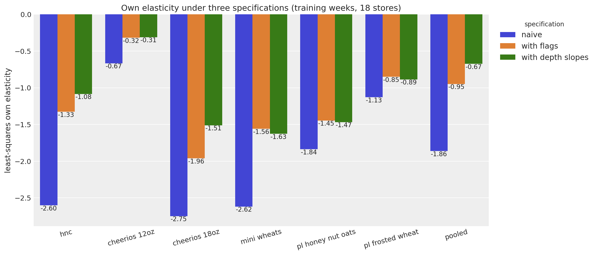</p>
</figure>


For the focal product the naive elasticity is -2.60; with the flags it is -1.33, and with the depth slopes -1.08. Pooled over the six products the gap is -1.86 against -0.95: the flags absorb about half of the naive price effect, because the largest cuts come with a feature or a display and the naive regression credits their uplift to the price.

The helper of the next cell lists the price columns of the other five products; the cell after it fits the focal product's full regression, the depth-slope specification plus the five other prices, \sum\_{k \ne \text{H}} \gamma_k\\ x\_{k,t,s}. Its coefficients are the reference markers of the forest plots in the results section and the point-estimate planner of the decision section.


    In [31]:


``` python
def cross_terms_of(product: str) -> list[str]:
    """List the price columns of the other five products."""
    return [f"price {other}" for other in product_order if other != product]
```


    In [32]:


``` python
hnc_long = train_long.filter(pl.col("product").eq(pl.lit(FOCAL)))
CROSS_TERMS = cross_terms_of(FOCAL)
hnc_full_ols = within_ols(hnc_long, ["x", *MECHANICS_TERMS, *CROSS_TERMS, *seasonal_terms])
hnc_ols_terms = dict(
    zip(hnc_full_ols["term"].to_list(), hnc_full_ols["coef"].to_list(), strict=True)
)
```


## Cross-price terms

Cross-price terms need one regression per product, each with the other five prices. In the following heatmap we show them as a matrix: rows are the product whose units respond, columns the product whose price moves, and a positive cell means the two products are substitutes (a cut on the column product takes units from the row product). The diagonal holds the own elasticity of each product.


    In [33]:


``` python
cross_rows = []

for product in product_order:
    fit = within_ols(
        train_long.filter(pl.col("product").eq(pl.lit(product))),
        ["x", *FLAG_TERMS, *cross_terms_of(product), *seasonal_terms],
    )
    coefs = dict(zip(fit["term"].to_list(), fit["coef"].to_list(), strict=True))
    row: dict[str, float | str] = {"units of": product}

    for other in product_order:
        row[f"price of {other}"] = coefs["x"] if other == product else coefs[f"price {other}"]

    cross_rows.append(row)

cross_ols = pl.DataFrame(cross_rows)
cross_values = cross_ols.drop("units of").to_numpy()

fig, ax = plt.subplots(figsize=(9, 7), layout="constrained")
sns.heatmap(
    cross_values,
    annot=True,
    fmt="+.2f",
    cmap="RdBu_r",
    vmin=-1.0,
    vmax=1.0,
    xticklabels=product_order,
    yticklabels=product_order,
    cbar_kws={"label": "least-squares coefficient"},
    ax=ax,
)
ax.tick_params(axis="x", rotation=30)
ax.set(
    xlabel="price of",
    ylabel="units of",
    title="Least-squares cross-price terms (diagonal: own elasticity)",
);
```


<figure class="figure">
<p>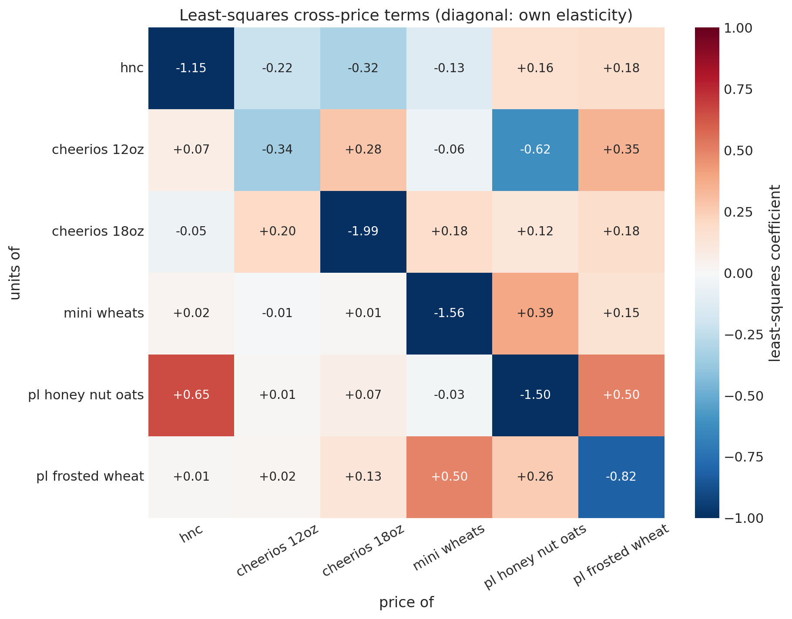</p>
</figure>


The two national-brand-to-twin cells are the largest positive ones: the focal product's price on the private-label honey nut oats, +0.65, and Mini Wheats' price on the private-label frosted wheat, +0.50. When Honey Nut Cheerios is cheaper, its twin sells less. Several cells are negative, which the results section examines with the posterior. The model needs a cross-price matrix, not a single cross term.


## Is the price response log-linear?

The model below uses a log-linear price term, \varepsilon\\ x\_{t,i}. The next cell replaces it by one indicator per discount bin,

 \log y\_{t,i} = a_i + \sum\_{b=1}^{4} \beta_b\\ \mathbb{1}\\d\_{t,i} \in B_b\\ + b^\top z^{\text{flags}}\_{t,i} + c(t) + e\_{t,i}, 

with the bins B_b at (2\\, 10\\\], (10\\, 20\\\], (20\\, 30\\\] and above 30\\, so \beta_b is the log uplift of a cut in bin b against no cut. In the following plot we compare the binned estimates with the log-linear curve \varepsilon \log(1 - d) of the with-flags specification.


    In [34]:


``` python
def depth_bins(labels: list[str], edges: list[float]) -> list[pl.Expr]:
    """Build one 0/1 column per discount bin (lo, hi], in the order of ``labels``."""
    return [
        pl.col("discount")
        .gt(pl.lit(lo))
        .and_(pl.col("discount").le(pl.lit(hi)))
        .cast(pl.Float64)
        .alias(label)
        for label, lo, hi in zip(labels, edges[:-1], edges[1:], strict=True)
    ]
```


    In [35]:


``` python
bin_edges = [0.02, 0.10, 0.20, 0.30, 1.0]
bin_labels = ["cut (2%, 10%]", "cut (10%, 20%]", "cut (20%, 30%]", "cut > 30%"]
bin_mids = np.array([0.06, 0.15, 0.25, 0.38])
binned = hnc_long.with_columns(depth_bins(bin_labels, bin_edges))
binned_ols = within_ols(binned, [*bin_labels, *FLAG_TERMS, *seasonal_terms]).filter(
    pl.col("term").is_in(bin_labels)
)
hnc_slope = float(
    own_elasticity_ols.filter(
        pl.col("product").eq(pl.lit(FOCAL)).and_(pl.col("specification").eq(pl.lit("with flags")))
    )["elasticity"][0]
)
depth_line = np.linspace(0.0, 0.45, 100)

fig, ax = plt.subplots(figsize=(10, 5), layout="constrained")
ax.plot(
    depth_line,
    hnc_slope * np.log1p(-depth_line),
    color="C1",
    label=f"log-linear, elasticity {hnc_slope:.2f} (with flags)",
)
ax.errorbar(
    bin_mids,
    binned_ols["coef"].to_numpy(),
    yerr=binned_ols["se"].to_numpy(),
    fmt="o",
    color="C0",
    capsize=4,
    label="binned estimate (one standard error)",
)

for depth, coef in zip(bin_mids, binned_ols["coef"].to_numpy(), strict=True):
    ax.annotate(f"{coef:+.2f}", (depth, coef), textcoords="offset points", xytext=(8, -12))

ax.xaxis.set_major_formatter(mtick.PercentFormatter(xmax=1, decimals=0))
ax.legend(loc="upper left", bbox_to_anchor=(1.01, 1.0))
ax.set(
    xlabel="discount depth (bin center)",
    ylabel="log uplift against no cut",
    title=f"Binned against log-linear price response of {FOCAL}",
);
```


<figure class="figure">
<p>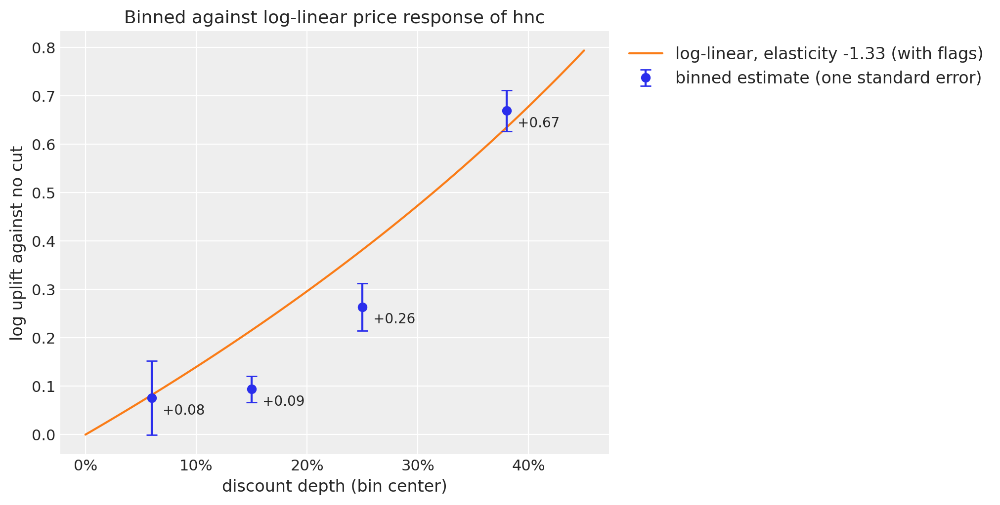</p>
</figure>


The binned estimates rise with depth, from +0.08 for cuts up to 10\\ to +0.67 above 30\\, while the log-linear line predicts 0.08, 0.22, 0.38 and 0.63 at the bin centers. On its own, a log-linear term overstates the response to moderate cuts. The model keeps the log-linear form, and its depth slopes under mechanics let the response of a featured cut differ from that of a shelf-tag cut, which is where the moderate cuts sit.


## Is there a post-promotion dip?

When a product is on promotion, some households buy more than they need that week and store it at home, and buy less in the following weeks. This is the post-promotion dip of [van Heerde, Leeflang and Wittink (2000)](https://doi.org/10.1509/jmkr.37.3.383.18782). If the dip were large, the weeks after the event would lose sales, the timing of the event would matter, and the decision space would have to include the calendar. The next cell measures the dip over all 77 stores with the regression

 \log y\_{t,i} = a_i + \varepsilon\\ x\_{t,i} + b^\top z^{\text{flags}}\_{t,i} + \psi_1 P\_{t-1,i} + \psi_2 P\_{t-2,i} + c(t) + e\_{t,i}, 

where z^{\text{flags}} = (F, D, FD) and P\_{t,i} flags any promotion (a feature, a display or a cut) in week t, so \psi_1 and \psi_2 are the dips in the first and the second week after a promotion.


    In [36]:


``` python
def any_promotion() -> pl.Expr:
    """Flag a store-week with a feature, a display or a cut, as a float."""
    promoted = (
        pl.col("feature")
        .eq(pl.lit(1))
        .or_(pl.col("display").eq(pl.lit(1)))
        .or_(pl.col("cut").eq(pl.lit(1)))
    )
    return promoted.cast(pl.Float64)
```


    In [37]:


``` python
first_week = cereal_df["week_end_date"].min()
dip_df = (
    cereal_df.with_columns(
        week_index=pl.col("week_end_date")
        .sub(pl.lit(first_week))
        .dt.total_days()
        .truediv(pl.lit(7.0))
    )
    .with_columns(
        *annual_fourier("week_index"),
        trend=pl.col("week_index").truediv(pl.lit(N_WEEKS)),
        promo=any_promotion(),
    )
    .with_columns(
        post1=pl.col("promo").shift(1).over("series").fill_null(0.0),
        post2=pl.col("promo").shift(2).over("series").fill_null(0.0),
    )
)
dip_terms = ["x", "feature", "display", "feature_display", "post1", "post2"]
dip_ols = within_ols(dip_df, [*dip_terms, *seasonal_terms]).filter(pl.col("term").is_in(dip_terms))

fig, ax = plt.subplots(figsize=(10, 4.5), layout="constrained")
dip_bars = ax.barh(
    dip_ols["term"].to_list(),
    dip_ols["coef"].to_numpy(),
    xerr=dip_ols["se"].to_numpy(),
    color="C0",
    capsize=4,
)
ax.bar_label(dip_bars, fmt="{:+.3f}", padding=6)
ax.axvline(0.0, color="black", linewidth=1)
ax.invert_yaxis()
ax.margins(x=0.15)
ax.set(
    xlabel="coefficient (log units, one standard error)",
    title="Post-promotion dips next to the price and mechanics effects (77 stores)",
);
```


<figure class="figure">
<p>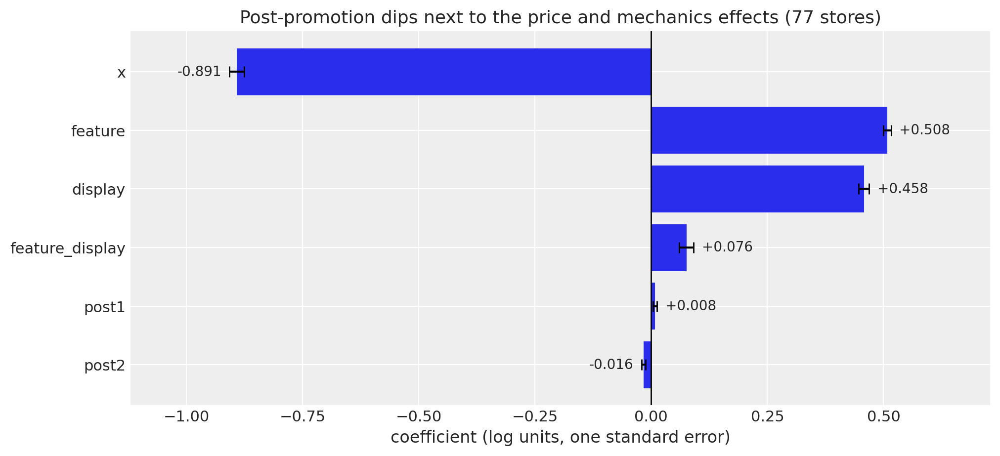</p>
</figure>


The first week after a promotion carries +0.008 (a small rise, not a dip) and the second -0.016, against feature and display effects of +0.51 and +0.46 on the log scale. The dip is statistically visible and economically negligible, so the calendar is not a lever in this notebook and the event weeks are fixed.


## Which weeks identify the elasticity

The own elasticity of a product is identified by the weeks in which its price moved without a feature or a display, the `tpr_only` weeks, plus the variation of the cut inside feature and display weeks. A product with few such weeks gets its elasticity mostly from the prior and from the partial pooling across stores. The counterfactual promotions below also vary the depth of the cut from 0 to 40\\ under each mechanics, and a depth the retailer never ran under a mechanics is an extrapolation that the figures should flag. In the following plot we count, per product over the training panel, the store-weeks with a shelf-tag cut, a feature and a display, and, for the focal product over all 77 stores, the store-weeks within \pm 2.5 points of every grid depth under each mechanics; cells with fewer than 20 store-weeks are framed in red and shaded as thin support in the later figures.


    In [38]:


``` python
identification = (
    train_long.group_by("product", maintain_order=True)
    .agg(
        tpr_only=pl.col("tpr_only").sum(),
        feature=pl.col("feature").sum(),
        display=pl.col("display").sum(),
    )
    .pipe(sort_by_order, "product", product_order)
)
identifying_weeks = dict(
    zip(identification["product"].to_list(), identification["tpr_only"].to_list(), strict=True)
)
DEPTH_GRID = np.round(np.arange(0.0, 0.401, 0.05), 2)
MECHANICS: dict[str, tuple[float, float]] = {
    "tpr-only": (0.0, 0.0),
    "display": (0.0, 1.0),
    "feature": (1.0, 0.0),
    "feature + display": (1.0, 1.0),
}
THIN_SUPPORT = 20
hnc_all_stores = cereal_df.filter(pl.col("product").eq(pl.lit(FOCAL))).with_columns(
    depth=cut_depth()
)
support_counts: dict[str, np.ndarray] = {}

for mechanics_name in MECHANICS:
    depth = hnc_all_stores.filter(pl.col("mechanics").eq(pl.lit(mechanics_name)))[
        "depth"
    ].to_numpy()
    support_counts[mechanics_name] = np.array(
        [int(np.sum(np.abs(depth - d) <= 0.025)) for d in DEPTH_GRID]
    )

count_matrix = np.stack([support_counts[mechanics_name] for mechanics_name in MECHANICS])

fig, axes = plt.subplots(ncols=2, figsize=(16, 5.5), width_ratios=[1.0, 1.3], layout="constrained")
sns.barplot(
    data=identification.unpivot(
        index="product", variable_name="mechanics", value_name="store_weeks"
    ).to_dict(as_series=False),
    x="product",
    y="store_weeks",
    hue="mechanics",
    order=product_order,
    ax=axes[0],
)

# Only the shelf-tag bars carry a label (the count the prose reads); three labels per bar collide.
axes[0].bar_label(axes[0].containers[0])

handles, labels = axes[0].get_legend_handles_labels()
axes[0].get_legend().remove()
fig.legend(handles, labels, loc="outside lower center", ncols=3)
axes[0].tick_params(axis="x", rotation=15)
axes[0].set(
    xlabel="", ylabel="store-weeks", title="Identifying store-weeks by product (18 stores)"
)
sns.heatmap(
    count_matrix,
    annot=True,
    fmt="d",
    cmap="Blues",
    xticklabels=[f"{d:.0%}" for d in DEPTH_GRID],
    yticklabels=list(MECHANICS),
    cbar_kws={"label": "store-weeks"},
    ax=axes[1],
)

for i, mechanics_name in enumerate(MECHANICS):
    for j, count in enumerate(support_counts[mechanics_name]):
        if count < THIN_SUPPORT:
            axes[1].add_patch(Rectangle((j, i), 1, 1, fill=False, edgecolor="C3", linewidth=2))

axes[1].set(
    xlabel="grid depth",
    ylabel="",
    title=f"{FOCAL} store-weeks near each grid depth, 77 stores (red: fewer than {THIN_SUPPORT})",
)
fig.suptitle("What identifies the own elasticity", fontsize=16, fontweight="bold");
```


<figure class="figure">
<p>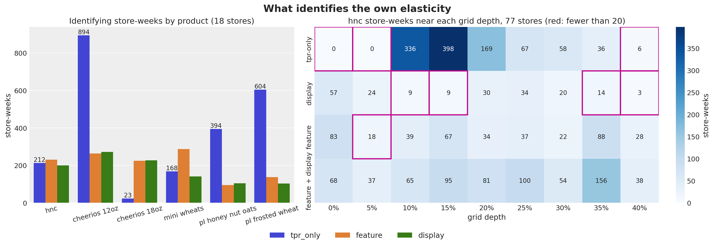</p>
</figure>


The focal product has 212 shelf-tag-only store-weeks in the training panel. Cheerios 18 oz has 23, so its own elasticity will come from the depth variation inside its feature and display weeks and from the prior. The thin cells of the depth grid are a display at 10\\, 15\\, 35\\ and 40\\, a feature at 5\\, and a shelf-tag cut at 5\\ or 40\\.

The cross-price terms are identified only if the six prices do not move in lockstep within a store, and the sibling-mechanics effects only if a sibling is not always featured when the focal product is. The next cell checks both.


    In [39]:


``` python
# (weeks, series) -> (weeks, stores, products) -> (store-weeks, products): the series axis is
# store-major, so the reshape separates the stores from the products.
x_store_week = (
    panel_ds["x"]
    .to_numpy()[:t_train]
    .reshape(t_train, n_stores, n_products)
    .reshape(-1, n_products)
)
price_correlation = np.corrcoef(x_store_week.T)
max_price_correlation = float(np.abs(price_correlation - np.eye(n_products)).max())
feature_store_week = (
    panel_ds["feature"].to_numpy()[:t_train].reshape(t_train, n_stores, n_products)
)
hnc_featured = feature_store_week[:, :, FOCAL_INDEX] == 1
sibling_featured = np.delete(feature_store_week, FOCAL_INDEX, axis=2).max(axis=2) == 1

print(
    f"largest within-store correlation between two log price ratios: "
    f"{max_price_correlation:.2f}; a sibling is featured in "
    f"{sibling_featured[hnc_featured].mean():.0%} of the {FOCAL} feature weeks and in "
    f"{sibling_featured[~hnc_featured].mean():.0%} of the other weeks"
)
```


    largest within-store correlation between two log price ratios: 0.30; a sibling is featured in 27% of the hnc feature weeks and in 37% of the other weeks


The largest price correlation is 0.30, so the six prices do not move together, and a sibling is featured in 27\\ of the store-weeks in which the focal product is featured against 37\\ otherwise. Both the cross terms and the sibling effects are identified.


## The demand equation

The checks gave the list of effects the model must carry: a level per series that does not absorb the promotion spikes, annual seasonality, an own price elasticity per series, a cross-price matrix, mechanics uplifts with depth slopes, sibling-mechanics effects, and overdispersed counts. The model keeps the notation of the exploratory regressions and replaces the fixed effect and the trend by a random-walk level per series, the single elasticity by one per series, partially pooled around a product mean, and the single cross vector by a matrix \gamma\_{k,p}, the response of product p's units to product k's price, zero on the diagonal. For series i with product p = p(i) and store s = s(i), the log of the conditional mean is the sum of five terms:

\begin{align\*} \log \mu\_{t,i} &= \ell\_{t,i} && \text{level} \\ &\quad + f(t)^\top \beta_p && \text{seasonality} \\ &\quad + \varepsilon_i\\ x\_{t,i} && \text{own price} \\ &\quad + \sum\_{k \ne p} \gamma\_{k,p}\\ x\_{k,t,s} && \text{cross prices} \\ &\quad + b_p^\top z\_{t,i} && \text{mechanics} \end{align\*}

The level is a random walk on the log scale, with an initial level \ell\_{0,i} and weekly innovations \delta\_{u,i}, and the units are negative binomial with a concentration \phi_p per product (the mean and concentration parameterization):

 \ell\_{t,i} = \ell\_{0,i} + \sum\_{u \le t} \delta\_{u,i}, \qquad y\_{t,i} \sim \text{NegativeBinomial}(\mu\_{t,i}, \phi_p). 

The priors, whose reasons the next section gives, are

\begin{align\*} \ell\_{0,i} &\sim \text{Normal}(3, 2), & \delta\_{u,i} &\sim \text{Normal}(0, \sigma_i), \\ \sigma_i &\sim \text{LogNormal}(-3.3, 0.49), & \beta_p &\sim \text{Normal}(0, 0.2), \\ \varepsilon_i &\sim \text{Normal}(\varepsilon\_{p(i)}, \sigma\_\varepsilon), & \varepsilon_p &\sim \text{Normal}(-1.5, 1), \\ \sigma\_\varepsilon &\sim \text{HalfNormal}(0.5), & \sigma\_\gamma &\sim \text{HalfNormal}(0.5), \\ \gamma\_{k,p} &\sim \text{Normal}(0, \sigma\_\gamma), & \phi_p &\sim \text{LogNormal}(2, 1), \\ b^{\text{feat}}\_p, b^{\text{disp}}\_p &\sim \text{Normal}(0.5, 0.5), & \text{other } b_p &\sim \text{Normal}(0, 0.5). \end{align\*}

Two quantities of this equation drive the decisions. Under a mechanics m = (F_m, D_m), a cut of depth d multiplies the units by (1 - d)^{\varepsilon_m}, with the mechanics-specific elasticity

 \varepsilon_m = \varepsilon - b^{\text{feat},\lambda} F_m - b^{\text{disp},\lambda} D_m, 

(a positive slope makes the response steeper), and the mechanics themselves multiply the units by e^{b_m} with

 b_m = b^{\text{feat}} F_m + b^{\text{disp}} D_m + b^{\text{fd}} F_m D_m. 

Every decision threshold below uses \varepsilon_m, never the bare \varepsilon. The sibling-mechanics effects are averages over "any sibling featured or displayed", so under a policy in which only the focal product is featured the mechanics part of the cannibalization is attenuated toward the average sibling. Remark: with a Poisson likelihood the same code runs with `dist.Poisson`; with continuous sales the link would be a Normal on the log scale.


## Model components in code

Each of the five terms of \log \mu is a function that samples its own sites and returns its contribution, the pattern of the NumPyro [Hilbert space Gaussian process example](https://num.pyro.ai/en/stable/examples/hsgp.html). The level innovations, the store-level elasticities and the cross terms are hierarchical, and NumPyro's [`LocScaleReparam`](https://num.pyro.ai/en/stable/reparam.html) lets us choose between their centered (1) and non-centered (0) parameterization with a value in \[0, 1\], the idiom of the [hierarchical forecasting example](hierarchical_forecasting_1.md). We sample that value as a site. A reparameterization does not change the posterior, so NUTS cannot learn it: its posterior would be its prior. Variational inference can, because the ELBO depends on the parameterization, so the model fit section learns the three values with a short SVI pass and hands them to NUTS as constants, the recipe of [Gorinova, Moore and Hoffman (2020)](https://arxiv.org/abs/1906.03028). The next cell defines the prior hyperparameters and the five components.


    In [40]:


``` python
@dataclass(frozen=True)
class CerealPriors:
    """Prior hyperparameters of the cereal demand model (all on the log scale)."""

    eps_loc: float
    eps_sd: float
    eps_store_sd: float
    drift_mu: float
    drift_sigma: float
    conc_mu: float
    conc_sigma: float
    mech_loc: float
    mech_sd: float
    aux_sd: float
    cross_sd: float
    seasonal_sd: float
    level_loc: float
    level_sd: float


CENTERING_SITES = ["centered_drift", "centered_eps", "centered_gamma"]


def local_level(
    h: Horizon,
    series_plate: numpyro.plate,
    centered_drift: Float[Array, ""],
    priors: CerealPriors,
) -> Float[Array, " duration n_series"]:
    """Build the random-walk level per series: the initial level plus the summed innovations."""
    with series_plate:
        level0 = numpyro.sample("level0", dist.Normal(priors.level_loc, priors.level_sd))
        drift_scale = numpyro.sample(
            "drift_scale", dist.LogNormal(priors.drift_mu, priors.drift_sigma)
        )
        # innovations opens its own time plate at dim=-2 and registers the horizon
        # innovations as a separate site, so the forecast continues the walk. The
        # centering value is a sampled site that SVI learns and NUTS receives as a constant.
        drift = innovations(
            h,
            "drift",
            dist.Normal(0.0, drift_scale),
            reparam=LocScaleReparam(centered=centered_drift),
        )
    return level0 + jnp.cumsum(drift, axis=-2)


def annual_seasonality(
    fourier: Float[Array, " duration n_fourier"],
    product_plate: numpyro.plate,
    fourier_plate: numpyro.plate,
    series_to_product: Int[Array, " n_series"],
    priors: CerealPriors,
) -> Float[Array, " duration n_series"]:
    """Sample the annual Fourier seasonality with one coefficient vector per product."""
    with fourier_plate, product_plate:
        beta_s = numpyro.sample("beta_s", dist.Normal(0.0, priors.seasonal_sd))
    # (duration, n_fourier) @ (n_fourier, n_products) -> (duration, n_products), then the
    # product axis is gathered to the series axis: (duration, n_series).
    return (fourier @ beta_s)[:, series_to_product]


def own_price_effect(
    x: Float[Array, " duration n_series"],
    product_plate: numpyro.plate,
    series_plate: numpyro.plate,
    series_to_product: Int[Array, " n_series"],
    centered_eps: Float[Array, ""],
    priors: CerealPriors,
) -> Float[Array, " duration n_series"]:
    """Sample the own promotional elasticity per series, partially pooled around its product."""
    with product_plate:
        eps_prod = numpyro.sample("eps_prod", dist.Normal(priors.eps_loc, priors.eps_sd))
    eps_scale = numpyro.sample("eps_scale", dist.HalfNormal(priors.eps_store_sd))
    with series_plate, handlers.reparam(config={"eps": LocScaleReparam(centered=centered_eps)}):
        eps = numpyro.sample("eps", dist.Normal(eps_prod[series_to_product], eps_scale))
    return eps * x


def cross_price_effect(
    prices: Float[Array, " n_products duration n_series"],
    pair_plate: numpyro.plate,
    series_to_product: Int[Array, " n_series"],
    pair_rows: Int[Array, " n_pairs"],
    pair_cols: Int[Array, " n_pairs"],
    centered_gamma: Float[Array, ""],
    priors: CerealPriors,
    n_products: int,
) -> Float[Array, " duration n_series"]:
    """Sample the 30 off-diagonal cross elasticities, shrunk toward zero, and apply them."""
    cross_scale = numpyro.sample("cross_scale", dist.HalfNormal(priors.cross_sd))
    with (
        pair_plate,
        handlers.reparam(config={"gamma_offdiag": LocScaleReparam(centered=centered_gamma)}),
    ):
        gamma_offdiag = numpyro.sample("gamma_offdiag", dist.Normal(0.0, cross_scale))
    gamma = numpyro.deterministic(
        "gamma", jnp.zeros((n_products, n_products)).at[pair_rows, pair_cols].set(gamma_offdiag)
    )
    # cross[t, n] = sum_k gamma[k, p(n)] * prices[k, t, n]: for series n (product p(n) sold at
    # store s(n)), take the log price ratio of every product k at the same store and weight it
    # by the cross elasticity of p(n) with respect to k; the own cell k == p(n) is zero in
    # gamma and is handled by own_price_effect.
    return jnp.einsum("ktn,kn->tn", prices, gamma[:, series_to_product])


def mechanics_effect(
    feature: Float[Array, " duration n_series"],
    display: Float[Array, " duration n_series"],
    lam: Float[Array, " duration n_series"],
    sib_feature: Float[Array, " duration n_series"],
    sib_display: Float[Array, " duration n_series"],
    product_plate: numpyro.plate,
    series_to_product: Int[Array, " n_series"],
    priors: CerealPriors,
) -> Float[Array, " duration n_series"]:
    """Sample the mechanics uplifts, their interaction, the depth slopes and the sibling terms."""
    with product_plate:
        b_feat = numpyro.sample("b_feat", dist.Normal(priors.mech_loc, priors.mech_sd))
        b_disp = numpyro.sample("b_disp", dist.Normal(priors.mech_loc, priors.mech_sd))
        b_fd = numpyro.sample("b_fd", dist.Normal(0.0, priors.aux_sd))
        b_feat_depth = numpyro.sample("b_feat_depth", dist.Normal(0.0, priors.aux_sd))
        b_disp_depth = numpyro.sample("b_disp_depth", dist.Normal(0.0, priors.aux_sd))
        b_sib_feat = numpyro.sample("b_sib_feat", dist.Normal(0.0, priors.aux_sd))
        b_sib_disp = numpyro.sample("b_sib_disp", dist.Normal(0.0, priors.aux_sd))
    p = series_to_product
    uplift = b_feat[p] * feature + b_disp[p] * display
    interaction = b_fd[p] * feature * display
    depth_slopes = b_feat_depth[p] * feature * lam + b_disp_depth[p] * display * lam
    sibling = b_sib_feat[p] * sib_feature + b_sib_disp[p] * sib_display
    return uplift + interaction + depth_slopes + sibling


def dispersion(
    product_plate: numpyro.plate, series_to_product: Int[Array, " n_series"], priors: CerealPriors
) -> Float[Array, " n_series"]:
    """Sample the negative binomial concentration per product and gather it to the series axis."""
    with product_plate:
        conc = numpyro.sample("conc", dist.LogNormal(priors.conc_mu, priors.conc_sigma))
    return conc[series_to_product]
```


The factory `make_cereal_model` adds the five terms and returns the plain `(covariates, data=None)` callable that the package drivers expect. On the forecast horizon the model also registers the conditional mean \mu, which the decision layer needs.


    In [41]:


``` python
def offdiagonal_pairs(
    n_products: int,
) -> tuple[Int[np.ndarray, " n_pairs"], Int[np.ndarray, " n_pairs"]]:
    """Return the row and column indices of the off-diagonal cells of the cross-price matrix."""
    rows, cols = np.where(~np.eye(n_products, dtype=bool))
    return rows, cols


def make_cereal_model(
    series_to_product: Int[Array, " n_series"],
    fourier_full: Float[Array, " duration_full n_fourier"],
    priors: CerealPriors,
    n_products: int,
    n_series: int,
) -> ForecastModel:
    """Build the cereal demand model as the plain ``(covariates, data=None)`` callable.

    Parameters
    ----------
    series_to_product
        Product index of every series, shape ``(n_series,)``.
    fourier_full
        Annual Fourier basis over the full duration, computed outside any trace.
    priors
        Prior hyperparameters.
    n_products
        Number of products (the cross matrix is ``n_products`` square).
    n_series
        Number of store-product series (the trailing observation axis).

    Returns
    -------
    ForecastModel
        The model function, callable as ``model(covariates)`` for prior sampling and
        ``model(covariates, data)`` for training and forecasting.
    """
    rows_np, cols_np = offdiagonal_pairs(n_products)
    pair_rows = jnp.asarray(rows_np, dtype=jnp.int32)
    pair_cols = jnp.asarray(cols_np, dtype=jnp.int32)
    n_pairs = int(rows_np.size)
    n_fourier = int(fourier_full.shape[-1])

    def cereal_model(
        covariates: Float[Array, " inputs duration n_series"],
        data: Int[Array, " t_obs n_series"] | None = None,
    ) -> None:
        """Sample the joint model (the drivers call this for training and forecasting)."""
        h = Horizon.from_data(covariates, data)
        duration = covariates.shape[-2]
        x = covariates[0]
        feature = covariates[1]
        display = covariates[2]
        sib_feature = covariates[3]
        sib_display = covariates[4]
        prices = covariates[PRICE_BLOCK:]
        lam = -x

        product_plate = numpyro.plate("product", n_products, dim=-1)
        fourier_plate = numpyro.plate("fourier", n_fourier, dim=-2)
        pair_plate = numpyro.plate("pair", n_pairs, dim=-1)
        series_plate = numpyro.plate("series", n_series, dim=-1)
        # One centering value per reparameterized site, in [0, 1]: 0 is non-centered, 1 centered.
        centered_drift = numpyro.sample("centered_drift", dist.Uniform(0.0, 1.0))
        centered_eps = numpyro.sample("centered_eps", dist.Uniform(0.0, 1.0))
        centered_gamma = numpyro.sample("centered_gamma", dist.Uniform(0.0, 1.0))

        level = local_level(h, series_plate, centered_drift, priors)
        seasonality = annual_seasonality(
            fourier_full[:duration], product_plate, fourier_plate, series_to_product, priors
        )
        own_price = own_price_effect(
            x, product_plate, series_plate, series_to_product, centered_eps, priors
        )
        cross_price = cross_price_effect(
            prices,
            pair_plate,
            series_to_product,
            pair_rows,
            pair_cols,
            centered_gamma,
            priors,
            n_products,
        )
        mechanics = mechanics_effect(
            feature,
            display,
            lam,
            sib_feature,
            sib_display,
            product_plate,
            series_to_product,
            priors,
        )
        eta = level + seasonality + own_price + cross_price + mechanics
        conc_series = dispersion(product_plate, series_to_product, priors)
        if h.future > 0:
            # The conditional mean over the horizon, for the decision layer; registered
            # only in forecast mode so the training posterior carries no extra array.
            numpyro.deterministic("mu_future", jnp.exp(eta)[h.t_obs :])
        predict(h, lambda e: dist.NegativeBinomial2(jnp.exp(e), conc_series), eta)

    return cereal_model
```


The next cell builds the Fourier basis over the full duration and the labels of the cross-price pairs and of the Fourier coefficients, which the ArviZ coordinates below use.


    In [42]:


``` python
fourier_full = jnp.asarray(fourier_features(N_WEEKS, 52.18, N_MODES))
pair_rows_np, pair_cols_np = offdiagonal_pairs(n_products)
pair_labels = [
    f"{product_order[k]} -> {product_order[p]}"
    for k, p in zip(pair_rows_np, pair_cols_np, strict=True)
]
fourier_names = [f"sin{k}" for k in range(1, N_MODES + 1)] + [
    f"cos{k}" for k in range(1, N_MODES + 1)
]
```


# Priors and prior predictive checks

Each prior of the block above has a reason:

- The product elasticity prior \text{Normal}(-1.5, 1) sits between zero and the average price elasticity of about -2.6 that the meta-analysis of [Bijmolt, van Heerde and Pieters (2005)](https://doi.org/10.1509/jmkr.42.2.141.62296) reports (with promotional elasticities above regular-price ones in magnitude), covers that average within about one standard deviation, and leaves the positive tail open so the data can reject the sign. The store deviations around the product mean have a \text{HalfNormal}(0.5) scale, deviations of up to about one unit.
- The weekly innovation scale of the level comes from `preliz.maxent`: we ask for a log-normal with 94\\ of its mass between weekly innovations of 1\\ and 8\\, because a wider prior lets the level absorb one-week promotion spikes (the results section checks the mechanics effects against the least-squares ones for this reason).
- The concentration prior \text{LogNormal}(2, 1) implies, at 80 units a week, a coefficient of variation near the within-store spread of the focal product's weeks.
- The feature and display effects have a \text{Normal}(0.5, 0.5) prior, a median multiplier of 1.65, with negative values allowed. The interaction, the depth slopes and the sibling effects are centered at zero.
- The cross terms share a \text{HalfNormal}(0.5) scale that shrinks the 30 cells toward zero. The seasonal coefficients have a \text{Normal}(0, 0.2) prior and the initial level a \text{Normal}(3, 2) prior on the log scale.
- The three centering values have a \text{Uniform}(0, 1) prior, which the SVI pass of the model fit section turns into a choice of parameterization.

The next cell builds the prior object and prints the two implied quantities the bullets quote.


    In [43]:


``` python
with warnings.catch_warnings():
    warnings.simplefilter("ignore", RuntimeWarning)
    drift_scale_prior = pz.maxent(pz.LogNormal(), lower=0.01, upper=0.08, mass=0.94, plot=False)

priors = CerealPriors(
    eps_loc=-1.5,
    eps_sd=1.0,
    eps_store_sd=0.5,
    drift_mu=float(drift_scale_prior.mu),
    drift_sigma=float(drift_scale_prior.sigma),
    conc_mu=2.0,
    conc_sigma=1.0,
    mech_loc=0.5,
    mech_sd=0.5,
    aux_sd=0.5,
    cross_sd=0.5,
    seasonal_sd=0.2,
    level_loc=3.0,
    level_sd=2.0,
)
prior_distributions = {
    "eps_prod": pz.Normal(priors.eps_loc, priors.eps_sd),
    "eps_scale": pz.HalfNormal(priors.eps_store_sd),
    "drift_scale": pz.LogNormal(priors.drift_mu, priors.drift_sigma),
    "conc": pz.LogNormal(priors.conc_mu, priors.conc_sigma),
    "b_feat, b_disp": pz.Normal(priors.mech_loc, priors.mech_sd),
    "level0": pz.Normal(priors.level_loc, priors.level_sd),
}
mech_lower, mech_upper = prior_distributions["b_feat, b_disp"].hdi(mass=0.94, fmt=".6f")

print(
    f"drift_scale prior: {prior_distributions['drift_scale']}, median weekly innovation "
    f"{float(prior_distributions['drift_scale'].median()):.1%}; feature and display "
    f"multiplier prior: median {np.exp(priors.mech_loc):.2f}, 94% HDI "
    f"{np.exp(mech_lower):.2f} to {np.exp(mech_upper):.2f}"
)
```


    drift_scale prior: LogNormal(mu=-3.3, sigma=0.488), median weekly innovation 3.7%; feature and display multiplier prior: median 1.65, 94% HDI 0.64 to 4.22


`preliz.maxent` returns \text{LogNormal}(-3.3, 0.49) for the innovation scale, a median weekly innovation of 3.7\\, and the mechanics prior allows multipliers from 0.6 to 4.2. In the following plot we show the density of the six main priors.


    In [44]:


``` python
fig, axes = plt.subplots(nrows=2, ncols=3, figsize=(15, 8), layout="constrained")

for ax, (site, distribution) in zip(axes.ravel(), prior_distributions.items(), strict=True):
    distribution.plot_pdf(ax=ax, legend=None, color="C0")
    ax.set(title=f"{site}: {distribution}", xlabel="value", ylabel="density")

fig.suptitle("Prior distributions", fontsize=16, fontweight="bold");
```


<figure class="figure">
<p>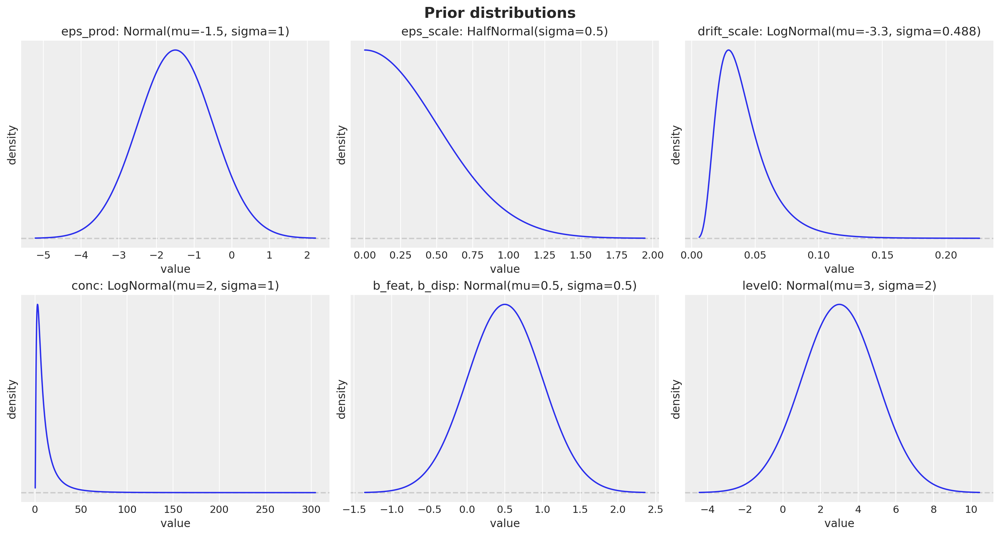</p>
</figure>


The elasticity prior covers -3.5 to 0.5, the innovation scale sits below 0.1, and the level prior spans several orders of magnitude of units: wide where the data are rich, tight only where the level must not absorb the spikes. The next cell builds the model with these priors and renders its graph.


    In [45]:


``` python
model = make_cereal_model(series_to_product, fourier_full, priors, n_products, n_series)
numpyro.render_model(model, model_args=(covariates_train, y_train), render_distributions=True)
```


<figure class="figure">
<p>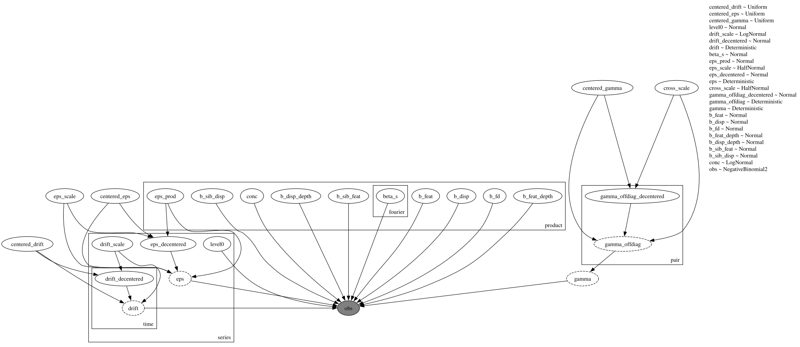</p>
</figure>


The graph shows the four plates (product, fourier, pair, series with its time plate) and the sites the components sample; the three centering sites sit outside every plate. In the following plot we draw 500 datasets from the prior predictive and show their 50\\ and 94\\ HDI bands on the nine focus series, against the observed units, to check that the priors put the units in a plausible range without pinning them. The two helpers of the next cell draw HDI bands with a legend label and are reused by every band plot below.


    In [46]:


``` python
def hdi_label(prob: float, prefix: str = "") -> str:
    r"""Build the legend label of an HDI band, e.g. ``$94\%$ HDI``."""
    percent = f"{prob:.0%}".replace("%", r"\%")
    return f"{prefix}${percent}$ HDI"


HDI_PROBS = (0.94, 0.5)
HDI_ALPHAS = {0.94: 0.3, 0.5: 0.6}


def plot_hdi_bands(
    ax: plt.Axes,
    x: Num[np.ndarray, " time"],
    draws: Float[np.ndarray, " sample time"],
    color: str,
    prefix: str = "",
) -> None:
    r"""Fill the $94\%$ and $50\%$ HDI bands of ``draws`` over ``x`` with labeled artists."""
    da = xr.DataArray(draws, dims=["sample", "time"])

    for prob in HDI_PROBS:
        hdi = az.hdi(da, prob=prob, dim="sample")
        ax.fill_between(
            x,
            hdi.sel(ci_bound="lower").to_numpy(),
            hdi.sel(ci_bound="upper").to_numpy(),
            color=color,
            alpha=HDI_ALPHAS[prob],
            linewidth=0,
            label=hdi_label(prob, prefix),
        )
```


    In [47]:


``` python
rng_key, key_prior = random.split(rng_key)
prior_sites = ["obs", "eps_prod", "b_feat", "b_disp", "b_fd", "b_feat_depth", "b_disp_depth"]
prior_draws = Predictive(model, num_samples=500, return_sites=prior_sites)(
    key_prior, covariates_train
)
prior_obs = np.asarray(prior_draws["obs"], dtype=np.float32)

fig, axes = plt.subplots(nrows=3, ncols=3, figsize=(18, 9), sharex=True, layout="constrained")

for ax, label, store in zip(axes.T.ravel(), focus_labels, focus_stores, strict=True):
    plot_hdi_bands(
        ax, dates_num[:t_train], prior_obs[:, :, series_ids.index(label)], "C0", prefix="prior "
    )
    ax.plot(
        dates_num[:t_train],
        panel_ds["units"].sel(series=label).to_numpy()[:t_train],
        color="black",
        linewidth=1,
        label="observed units",
    )
    ax.set(title=f"store {store} ({store_segment[store]})", yscale="log")
    locator = mdates.AutoDateLocator()
    ax.xaxis.set_major_locator(locator)
    ax.xaxis.set_major_formatter(mdates.ConciseDateFormatter(locator))

fig.legend(*ax.get_legend_handles_labels(), loc="outside lower center", ncols=3)
fig.supylabel("units (log scale)")
fig.suptitle("Prior predictive check on the training window", fontsize=16, fontweight="bold");
```


<figure class="figure">
<p>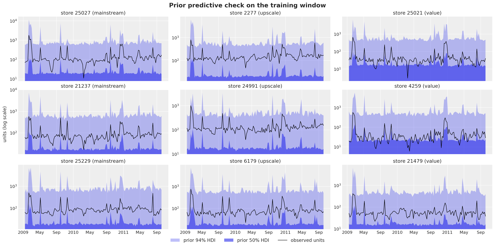</p>
</figure>


The prior predictive bands cover the observed units of every focus series with room to spare, from a few units to about ten thousand. One more prior check concerns the quantity the decisions turn on. In the following plot we draw, from the prior, the multiplier of the focal product's units at a 35\\ cut under feature with display, e^{b_m} (1 - d)^{\varepsilon_m}, and show its distribution on a log scale with its median and 94\\ HDI.


    In [48]:


``` python
depth_check = 0.35
eps_prior = np.asarray(prior_draws["eps_prod"])[:, FOCAL_INDEX]
uplift_prior = np.exp(
    np.asarray(prior_draws["b_feat"])[:, FOCAL_INDEX]
    + np.asarray(prior_draws["b_disp"])[:, FOCAL_INDEX]
    + np.asarray(prior_draws["b_fd"])[:, FOCAL_INDEX]
)
eps_m_prior = (
    eps_prior
    - np.asarray(prior_draws["b_feat_depth"])[:, FOCAL_INDEX]
    - np.asarray(prior_draws["b_disp_depth"])[:, FOCAL_INDEX]
)
multiplier_prior = uplift_prior * (1.0 - depth_check) ** eps_m_prior
lower_m, upper_m = np.asarray(az.hdi(multiplier_prior, prob=0.94))

fig, ax = plt.subplots(figsize=(10, 4.5), layout="constrained")
sns.histplot(multiplier_prior, bins=np.logspace(-1.5, 2.5, 60).tolist(), color="C0", ax=ax)
ax.axvline(
    float(np.median(multiplier_prior)),
    color="C3",
    linewidth=2,
    label=f"median {np.median(multiplier_prior):.1f}x",
)
ax.axvline(
    lower_m,
    color="C3",
    linestyle="--",
    label=hdi_label(0.94) + f" {lower_m:.1f}x to {upper_m:.1f}x",
)
ax.axvline(upper_m, color="C3", linestyle="--")
ax.set_xscale("log")
ax.legend(loc="upper left", bbox_to_anchor=(1.01, 1.0))
ax.set(
    xlabel="prior multiplier of the units (log scale)",
    ylabel="prior draws",
    title=f"Prior multiplier of {FOCAL} at a {depth_check:.0%} cut with feature + display",
);
```


<figure class="figure">
<p>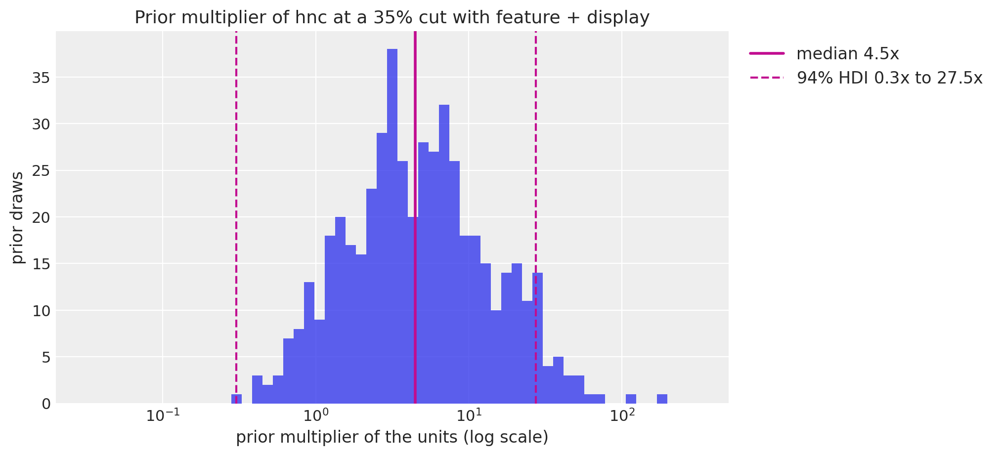</p>
</figure>


The prior implied multiplier has a median of 4.5 with a 94\\ HDI from 0.3 to 27.5: wide, as a prior should be, and centered on a plausible value.


# Model fit

The inference has two steps: a short SVI pass that chooses the parameterization, then NUTS.


## Choosing the parameterization with SVI

The three centering values decide how the sampler sees the hierarchy, and NUTS cannot learn them. A mean-field variational approximation can: the ELBO of an `AutoNormal` guide depends on the parameterization, because a diagonal Gaussian fits one geometry better than the other. So we run a short SVI pass first, read the fitted centering values from the guide, and hand them to NUTS through `handlers.condition`, which fixes the three sites at those values. The guide's draws are used for nothing else.

The level is a random walk, so the posterior of its innovations is a long thin ellipse along the time axis, which a diagonal guide represents badly and a diagonal mass matrix explores slowly. [`time_reparam`](https://juanitorduz.github.io/numpyro_forecast/reference/reparam.time_reparam.html) (the port of Pyro's [time_reparam](../../../reference/reparam.time_reparam.md#numpyro_forecast.reparam.time_reparam) option) rotates the in-sample innovations into a discrete cosine basis, where that posterior is closer to diagonal; the model's density does not change, only the coordinates inference sees. The next cell runs the same SVI pass on the plain model and on the rotated one, with the same key, so the loss plot shows what the rotation buys.


    In [49]:


``` python
model_dct = time_reparam(model, "dct")
svi_models = {"plain": model, "dct": model_dct}
N_SVI_STEPS = 5_000
guides: dict[str, AutoNormal] = {}
svi_results = {}
svi_losses: dict[str, np.ndarray] = {}
svi_seconds: dict[str, float] = {}
rng_key, key_svi = random.split(rng_key)

for name, svi_model in svi_models.items():
    guides[name] = AutoNormal(svi_model, init_loc_fn=init_to_median)
    svi = SVI(svi_model, guides[name], Adam(step_size=0.01), Trace_ELBO())
    start = perf_counter()
    svi_results[name] = svi.run(
        key_svi, N_SVI_STEPS, covariates_train, y_train, progress_bar=False
    )
    svi_losses[name] = np.asarray(jax.block_until_ready(svi_results[name].losses))
    svi_seconds[name] = perf_counter() - start
```


In the following plot we show the loss of both passes, the negative ELBO, with the mean of the last 500 steps of each as the flatness check.


    In [50]:


``` python
fig, ax = plt.subplots(figsize=(11, 4.5), layout="constrained")

for (name, losses), color in zip(svi_losses.items(), ("C0", "C1"), strict=True):
    tail_mean = losses[-500:].mean()
    ax.plot(losses, color=color, label=f"{name}: last 500 steps {tail_mean:,.0f}")
    ax.axhline(tail_mean, color=color, linestyle="--", linewidth=1)

ax.set_yscale("log")
ax.legend(loc="upper left", bbox_to_anchor=(1.01, 1.0))
ax.set(
    xlabel="step",
    ylabel="negative ELBO",
    title=(
        f"SVI pass that learns the centering values: {N_SVI_STEPS:,} Adam steps, "
        f"{svi_seconds['plain']:.0f} s plain and {svi_seconds['dct']:.0f} s with time_reparam"
    ),
);
```


<figure class="figure">
<p>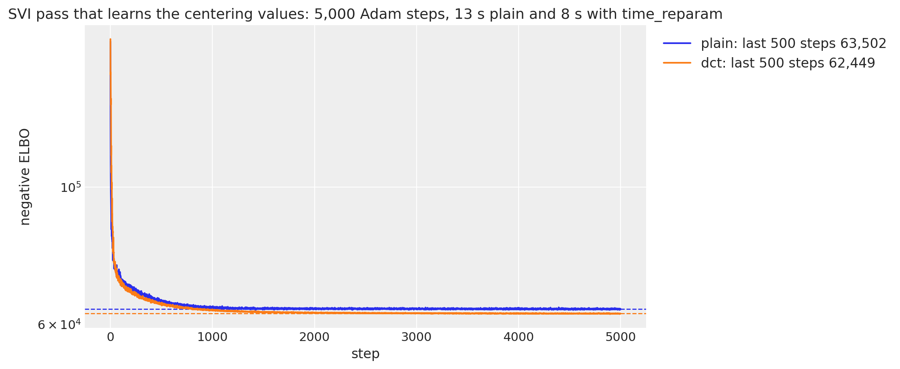</p>
</figure>


Both losses are flat over the second half of the run, and the rotated model reaches a better optimum: a negative ELBO of 62{,}449 against 63{,}502 over the last 500 steps, about 1{,}050 nats lower, in less wall time. The next cell reads the learned centering values and their 90\\ intervals from both guides.


    In [51]:


``` python
for name, guide in guides.items():
    median = guide.median(svi_results[name].params)
    quantiles = guide.quantiles(svi_results[name].params, [0.05, 0.95])
    learned = ", ".join(
        f"{site} {float(median[site]):.2f} "
        f"({float(quantiles[site][0]):.2f} to {float(quantiles[site][1]):.2f})"
        for site in CENTERING_SITES
    )

    print(f"{name}: {learned}")
```


    plain: centered_drift 0.34 (0.33 to 0.34), centered_eps 0.68 (0.65 to 0.70), centered_gamma 0.40 (0.36 to 0.45)
    dct: centered_drift 0.34 (0.33 to 0.34), centered_eps 0.67 (0.65 to 0.69), centered_gamma 0.42 (0.38 to 0.45)


The learned values are nearly the same under both parameterizations: 0.34 for the level innovations and 0.40 to 0.42 for the cross terms (the non-centered form fits a mean-field Gaussian best), and 0.67 to 0.68 for the store elasticities (the centered form), with 90\\ intervals a few hundredths wide. We keep the rotated model: its ELBO is better, and the package documents cheaper NUTS trajectories on the rotated coordinates. The next cell conditions it on its learned centering values; this wrapped and conditioned model is the single object every later driver receives.


    In [52]:


``` python
centering_median = guides["dct"].median(svi_results["dct"].params)
learned_centering: dict[str, Array] = {
    name: jnp.asarray(centering_median[name], dtype=jnp.float32) for name in CENTERING_SITES
}
nuts_model = handlers.condition(model_dct, data=learned_centering)
```


## Sampling with NUTS

We sample the posterior with NUTS: four chains of 1{,}000 warmup and 1{,}000 draws each, in parallel on four host devices. Two settings matter. The initialization is `init_to_median`, because NumPyro's default uniform initialization in the unconstrained space can put the cumulative level of a series far outside the range where the negative binomial mean is finite. And we ask NUTS for the number of leapfrog steps of every iteration, which gives the tree depth: a sampler stuck at the depth cap of 10 is the sign of a badly conditioned posterior. The next cell fits the model and prints the sampler checks.


    In [53]:


``` python
rng_key, key_fit = random.split(rng_key)
mcmc = MCMC(
    NUTS(nuts_model, target_accept_prob=0.9, init_strategy=init_to_median()),
    num_warmup=1_000,
    num_samples=1_000,
    num_chains=N_CHAINS,
    progress_bar=False,
)
start = perf_counter()
mcmc.run(key_fit, covariates_train, y_train, extra_fields=("diverging", "num_steps"))
# The chains run asynchronously on the host devices; block on the draws so the wall time is real.
posterior = jax.block_until_ready(mcmc.get_samples())
nuts_seconds = perf_counter() - start
assert not any(name in posterior for name in CENTERING_SITES), "the centering sites must be fixed"
n_draws = int(posterior["eps_prod"].shape[0])
num_steps = np.asarray(mcmc.get_extra_fields()["num_steps"])
tree_depth = np.ceil(np.log2(num_steps + 1)).astype(int)
n_divergences = int(np.asarray(mcmc.get_extra_fields()["diverging"]).sum())

print(
    f"{n_draws} draws in {nuts_seconds / 60:.1f} min, {n_divergences} divergences, tree depth "
    f"{tree_depth.min()} to {tree_depth.max()} (share at the depth-10 cap "
    f"{np.mean(num_steps == 1_023):.3f})"
)
```


    4000 draws in 4.4 min, 0 divergences, tree depth 7 to 7 (share at the depth-10 cap 0.000)


The fit takes about 5 minutes of wall time, with no divergences and every iteration at tree depth 7 (127 leapfrog steps), so the depth cap is never reached. The previous revision of this notebook sampled the plain model, without [time_reparam](../../../reference/reparam.time_reparam.md#numpyro_forecast.reparam.time_reparam), at tree depth 8 in about 9 minutes; that run is not repeated here.


## Convergence diagnostics

The next cell exports the posterior, the in-sample predictive and the holdout forecast into one ArviZ tree with named coordinates, so that the ArviZ diagnostics and plots below work with product and series labels. The rotated innovations appear as the site `drift_decentered_dct`, with `drift_decentered` and `drift` deterministic. The centering values are constants of the NUTS run, so they do not appear.


    In [54]:


``` python
coords = {
    "series": series_ids,
    "obs_dim": series_ids,
    "product": product_order,
    "competitor": product_order,
    "pair": pair_labels,
    "fourier": fourier_names,
    "input": input_names,
}
product_sites = [
    "eps_prod",
    "conc",
    "b_feat",
    "b_disp",
    "b_fd",
    "b_feat_depth",
    "b_disp_depth",
    "b_sib_feat",
    "b_sib_disp",
]
posterior_dims = {
    "level0": ["series"],
    "drift_scale": ["series"],
    "eps": ["series"],
    "eps_decentered": ["series"],
    "drift": ["time", "series"],
    "drift_decentered": ["time", "series"],
    "drift_decentered_dct": ["time", "series"],
    **{site: ["product"] for site in product_sites},
    "beta_s": ["fourier", "product"],
    "gamma": ["competitor", "product"],
    "gamma_offdiag": ["pair"],
    "gamma_offdiag_decentered": ["pair"],
}
rng_key, key_tree = random.split(rng_key)
tree = to_datatree(
    key_tree,
    nuts_model,
    posterior,
    y_train,
    covariates,
    num_chains=N_CHAINS,
    time_coord=list(dates),
    covariate_dims=["input", "time", "series"],
    coords=coords,
    posterior_dims=posterior_dims,
)
```


We check convergence with \hat R and the bulk effective sample size reduced to their worst values over every sampled site (the rotated level innovations, the 30 cross terms, the 108 store-level elasticities and the level parameters included), and with the trace plots of the six hyperparameters.


    In [55]:


``` python
hyper_vars = [*product_sites, "eps_scale", "cross_scale"]
all_sites = [
    *hyper_vars,
    "gamma_offdiag",
    "eps",
    "level0",
    "drift_scale",
    "beta_s",
    "drift_decentered_dct",
]
diagnostics = az.summary(tree, var_names=all_sites, kind="diagnostics")
r_hat = diagnostics["r_hat"].astype(float)
ess_bulk = diagnostics["ess_bulk"].astype(float)

print(
    f"{diagnostics.shape[0]} sampled sites: max r_hat {r_hat.max():.3f} ({r_hat.idxmax()}), "
    f"min ess_bulk {ess_bulk.min():.0f} ({ess_bulk.idxmin()})"
)
```


    15878 sampled sites: max r_hat 1.018 (drift_scale[4259::pl honey nut oats]), min ess_bulk 328 (drift_scale[4259::pl honey nut oats])


Over all 15{,}878 sampled sites, the 15{,}444 rotated innovations included, the worst values are \hat R = 1.02 and a bulk effective sample size of 328, both on the level innovation scale of a single series, the parameter with the least information per site. In the following plot we show the trace plots of the six hyperparameters.


    In [56]:


``` python
pc_trace = az.plot_trace_dist(
    tree,
    var_names=["eps_prod", "eps_scale", "b_feat", "b_disp", "conc", "cross_scale"],
    compact=True,
    figure_kwargs={"figsize": (12, 14)},
)
pc_trace.viz["figure"].item().suptitle("Trace plots", fontsize=18, fontweight="bold", y=1.02);
```


<figure class="figure">
<p>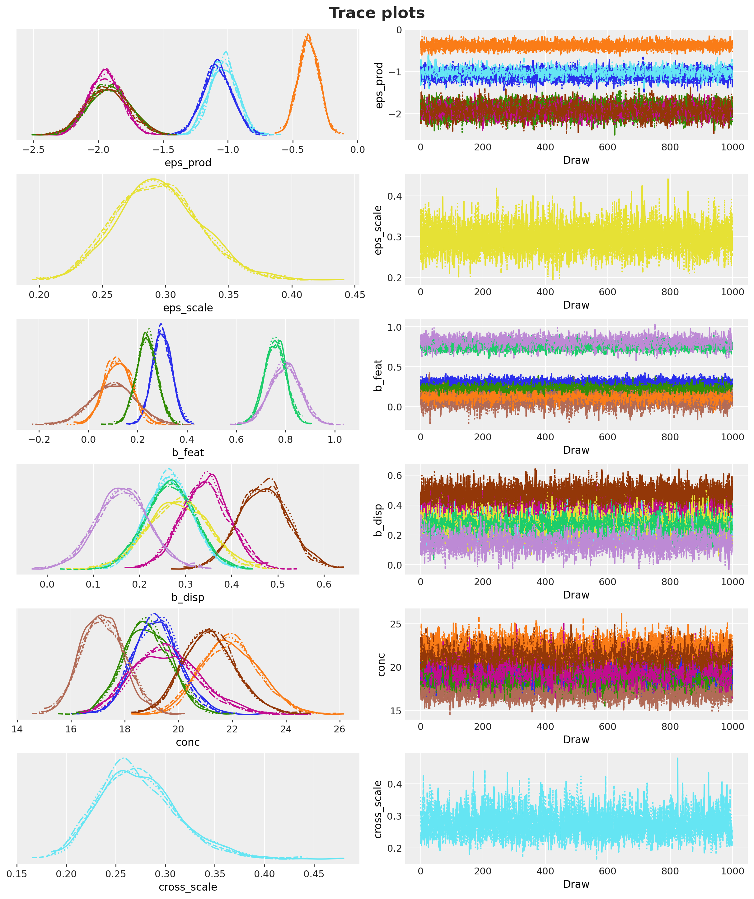</p>
</figure>


The trace plots show the six hyperparameters with overlapping chains and no drift. The sampler is fine, and we can read the posterior.


# Results

This section reads the posterior that the decisions use and checks that the model forecasts on the holdout.


## Elasticities and promotion effects

We read the effects that drive the decisions and check them against the least-squares estimates. The check matters for one specific failure: a model whose random-walk level absorbs the promotion spikes would show feature and display effects far below the least-squares ones. Every posterior interval below is a forest plot: the dot is the posterior median, the thick line the 50\\ HDI and the thin line the 94\\ HDI; a red marker is a least-squares estimate. The three helpers of the next cell wrap `az.plot_forest` for flat draws, add the reference markers, and format a median with its 94\\ HDI for the row labels.


    In [57]:


``` python
def draws_dataset(
    name: str, draws: Float[np.ndarray, " sample k"], dim: str, labels: list[str]
) -> xr.Dataset:
    """Wrap flat chain-major posterior draws as a ``(chain, draw, dim)`` dataset for ArviZ."""
    chains = np.asarray(draws).reshape(N_CHAINS, -1, len(labels))
    return xr.Dataset({name: (("chain", "draw", dim), chains)}, coords={dim: labels})


def forest_plot(
    data: xr.Dataset,
    var_names: list[str],
    labels: list[str],
    reference: dict[str, dict[str, Float[np.ndarray, " k"]]] | None = None,
    figsize: tuple[float, float] = (10.0, 5.0),
    reference_line: float | None = 0.0,
) -> plt.Axes:
    r"""Draw posterior medians with $50\%$ and $94\%$ HDIs and optional reference markers.

    Parameters
    ----------
    data
        Dataset with ``chain`` and ``draw`` dimensions.
    var_names
        Variables to plot, one block of rows each.
    labels
        Dimensions that label the rows (``"__variable__"`` for the variable name).
    reference
        Legend label to ``{variable: values}`` markers, one value per row of the variable.
    figsize
        Figure size.
    reference_line
        Position of a dotted vertical line, or ``None`` for no line.

    Returns
    -------
    plt.Axes
        The forest axes, so the caller can add lines, labels and the legend.
    """
    pc = az.plot_forest(
        xr.DataTree.from_dict({"posterior": data}),
        var_names=var_names,
        combined=True,
        ci_probs=[0.5, 0.94],
        point_estimate="median",
        labels=labels,
        figure_kwargs={"figsize": figsize},
    )
    ax = pc.viz["plot"].sel(column="forest").item()

    for marker, (label, values) in zip(("x", "+"), (reference or {}).items(), strict=False):
        for k, (name, points) in enumerate(values.items()):
            ax.plot(
                points,
                pc.aes["y"][name].values,
                marker,
                color="C3",
                markersize=9,
                markeredgewidth=1.5,
                label=label if k == 0 else None,
            )

    if reference_line is not None:
        ax.axvline(reference_line, color="gray", linestyle=":", linewidth=1)
    return ax


def hdi_text(draws: Float[np.ndarray, " sample"], digits: int = 2) -> str:
    r"""Format one-dimensional draws as ``median [lower, upper]`` with the $94\%$ HDI."""
    lower, upper = np.asarray(az.hdi(np.asarray(draws), prob=0.94))
    return f"{np.median(draws):.{digits}f} [{lower:.{digits}f}, {upper:.{digits}f}]"
```


In the following forest plot we show the posterior of each product's own elasticity next to the two least-squares estimates that control for the mechanics. The row labels carry the number of identifying shelf-tag weeks, the posterior median and the 94\\ HDI.


    In [58]:


``` python
eps_prod_draws = np.asarray(posterior["eps_prod"])
own_ols = {
    name: own_elasticity_ols.filter(
        pl.col("specification").eq(pl.lit(name)).and_(pl.col("product").ne(pl.lit("pooled")))
    )["elasticity"].to_numpy()
    for name in ("with flags", "with depth slopes")
}
product_labels = [
    f"{p} ({identifying_weeks[p]} tpr-only store-weeks): {hdi_text(eps_prod_draws[:, k])}"
    for k, p in enumerate(product_order)
]
ax = forest_plot(
    draws_dataset("elasticity", eps_prod_draws, "product", product_labels),
    ["elasticity"],
    ["product"],
    reference={
        f"least squares, {name}": {"elasticity": values} for name, values in own_ols.items()
    },
    figsize=(13.0, 5.0),
)
ax.legend(loc="upper left", bbox_to_anchor=(1.01, 1.0))
ax.set(xlabel="elasticity (log units per log price ratio)")
ax.figure.suptitle("Own promotional elasticity by product", fontsize=16, fontweight="bold");
```


<figure class="figure">
<p>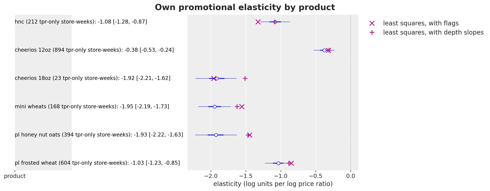</p>
</figure>


The focal product's elasticity has a posterior median of -1.08 (94\\ HDI -1.28 to -0.87), on top of the least-squares estimate with depth slopes. Cheerios 18 oz, with 23 identifying store-weeks, still gets a median of -1.92 (HDI -2.21 to -1.62), because its cut depth varies inside its feature and display weeks.

The next cell fits the pooled least-squares regression with flags, whose feature and display multipliers are the reference markers of the following forest plot: the feature and display multipliers e^{b^{\text{feat}}\_p} and e^{b^{\text{disp}}\_p} of every product next to the pooled values (the same value for every product, since the pooled regression has one coefficient).


    In [59]:


``` python
pooled_flags = within_ols(train_long, ["x", *FLAG_TERMS, *seasonal_terms])
ols_multipliers = dict(
    zip(pooled_flags["term"].to_list(), np.exp(pooled_flags["coef"].to_numpy()), strict=True)
)
```


    In [60]:


``` python
multiplier_draws = {
    "feature": np.exp(np.asarray(posterior["b_feat"])),
    "display": np.exp(np.asarray(posterior["b_disp"])),
}
multiplier_labels = [
    f"{effect} | {p}: {hdi_text(draws[:, k])}"
    for effect, draws in multiplier_draws.items()
    for k, p in enumerate(product_order)
]
pooled_label = (
    f"pooled least squares: feature {ols_multipliers['feature']:.2f}, "
    f"display {ols_multipliers['display']:.2f}"
)
ax = forest_plot(
    draws_dataset(
        "multiplier",
        np.concatenate(list(multiplier_draws.values()), axis=1),
        "row",
        multiplier_labels,
    ),
    ["multiplier"],
    ["row"],
    reference={
        pooled_label: {
            "multiplier": np.repeat(
                [ols_multipliers["feature"], ols_multipliers["display"]], n_products
            )
        }
    },
    figsize=(13.0, 7.0),
    reference_line=1.0,
)
ax.legend(loc="upper left", bbox_to_anchor=(1.01, 1.0))
ax.set(xlabel="multiplier of the units")
ax.figure.suptitle("Feature and display multipliers by product", fontsize=16, fontweight="bold");
```


<figure class="figure">
<p>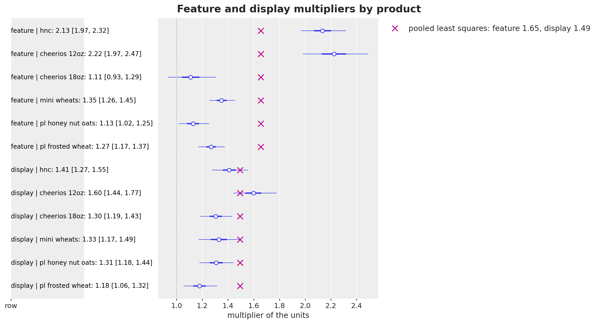</p>
</figure>


The feature multiplier of the focal product is 2.13 (HDI 1.97 to 2.32) and the display multiplier 1.41 (HDI 1.27 to 1.55), above and near the pooled least-squares multipliers of 1.65 and 1.49. The level is not absorbing the promotion spikes. In the following forest plot we show all seven mechanics coefficients of the focal product against its own full least-squares regression.


    In [61]:


``` python
mechanics_sites = [
    "b_feat",
    "b_disp",
    "b_fd",
    "b_feat_depth",
    "b_disp_depth",
    "b_sib_feat",
    "b_sib_disp",
]
mechanics_ols_terms = [
    "feature",
    "display",
    "feature_display",
    "feature_lam",
    "display_lam",
    "sib_feature",
    "sib_display",
]
hnc_mechanics_draws = np.stack(
    [np.asarray(posterior[site])[:, FOCAL_INDEX] for site in mechanics_sites], axis=1
)
ax = forest_plot(
    draws_dataset("effect", hnc_mechanics_draws, "term", mechanics_sites),
    ["effect"],
    ["term"],
    reference={
        "least squares (full regression)": {
            "effect": np.array([hnc_ols_terms[t] for t in mechanics_ols_terms])
        }
    },
    figsize=(11.0, 5.0),
)
ax.legend(loc="upper left", bbox_to_anchor=(1.01, 1.0))
ax.set(xlabel="effect on log units")
ax.figure.suptitle(
    f"Mechanics effects of the focal product ({FOCAL})", fontsize=16, fontweight="bold"
);
```


<figure class="figure">
<p>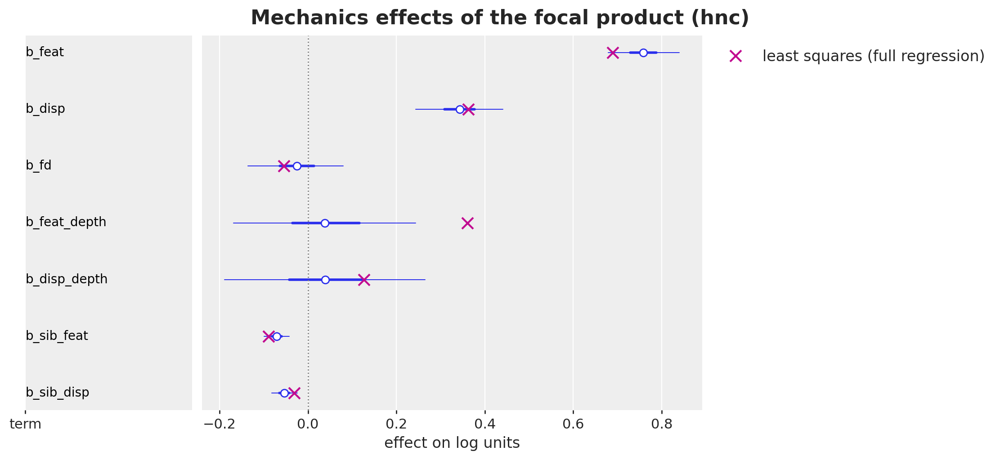</p>
</figure>


The depth slopes under feature and display of the focal product are centered near zero, so its mechanics-specific elasticities differ little from the plain one, and the sibling effects are small and negative: a featured or displayed sibling takes a few percent of the focal product's units.


## Do the cross elasticities make sense?

In the following heatmap we show the posterior mean of every cross elasticity \gamma\_{k,p} (rows: the product whose units respond; columns: the product whose price moves), annotated with the posterior probability that it is positive. Three things should hold if the estimates make sense. Products of one substitution group are substitutes, so the cells should be positive. Switching is asymmetric, another generalization of [Blattberg, Briesch and Fox (1995)](https://doi.org/10.1287/mksc.14.3.G122): a national brand's promotion draws more from its private-label twin than the reverse. And cross elasticities should be smaller in magnitude than the own elasticities.


    In [62]:


``` python
gamma_draws = np.asarray(posterior["gamma"])  # (sample, competitor, product)
gamma_mean = gamma_draws.mean(axis=0)
gamma_positive = (gamma_draws > 0).mean(axis=0)
annotations = np.array(
    [
        [
            "own" if k == p else f"{gamma_mean[k, p]:+.2f}\nP>0 {gamma_positive[k, p]:.2f}"
            for k in range(n_products)
        ]
        for p in range(n_products)
    ]
)

fig, ax = plt.subplots(figsize=(10, 8), layout="constrained")
sns.heatmap(
    gamma_mean.T,
    annot=annotations,
    fmt="",
    cmap="RdBu_r",
    vmin=-1.0,
    vmax=1.0,
    xticklabels=product_order,
    yticklabels=product_order,
    cbar_kws={"label": "cross elasticity (posterior mean)"},
    ax=ax,
)
ax.tick_params(axis="x", rotation=30)
ax.set(xlabel="price of", ylabel="units of", title="Posterior mean cross-price elasticities");
```


<figure class="figure">
<p>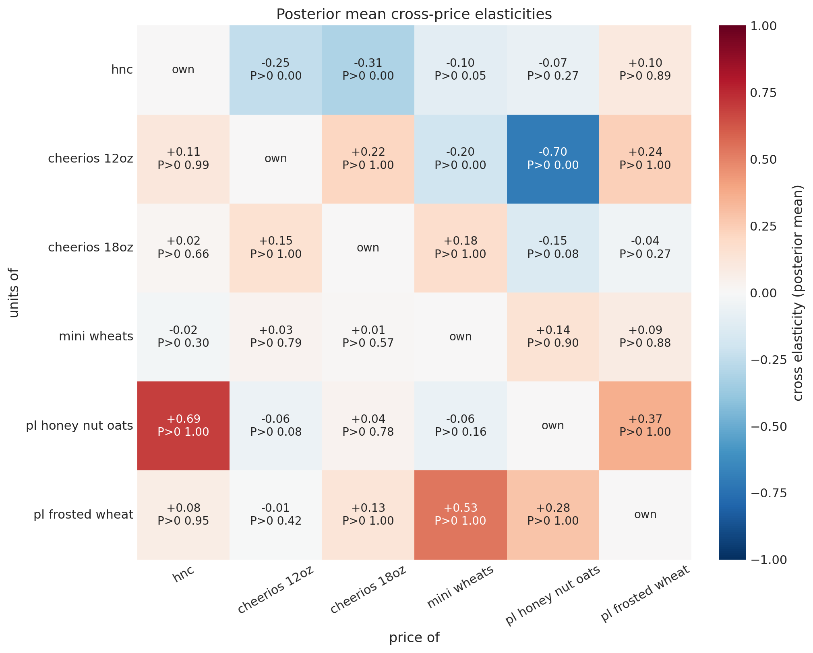</p>
</figure>


The next cell counts the cells whose sign is credibly negative (posterior probability of a positive value below 0.10) and checks, per product, whether the own elasticity dominates every cross term of its row.


    In [63]:


``` python
own_medians = np.median(eps_prod_draws, axis=0)
largest_cross = np.abs(gamma_mean).max(axis=0)
negative_cells = [
    f"{product_order[k]} -> {product_order[p]} ({gamma_mean[k, p]:+.2f})"
    for k, p in zip(pair_rows_np, pair_cols_np, strict=True)
    if gamma_positive[k, p] < 0.10
]
own_dominated = [
    product for k, product in enumerate(product_order) if abs(own_medians[k]) <= largest_cross[k]
]

print(
    f"{len(negative_cells)} credibly negative cells: {negative_cells}; rows where a cross "
    f"term exceeds the own elasticity: {own_dominated}"
)
```


    7 credibly negative cells: ['cheerios 12oz -> hnc (-0.25)', 'cheerios 12oz -> pl honey nut oats (-0.06)', 'cheerios 18oz -> hnc (-0.31)', 'mini wheats -> hnc (-0.10)', 'mini wheats -> cheerios 12oz (-0.20)', 'pl honey nut oats -> cheerios 12oz (-0.70)', 'pl honey nut oats -> cheerios 18oz (-0.15)']; rows where a cross term exceeds the own elasticity: ['cheerios 12oz']


The two national-brand-to-twin cells are the largest and are certain: the focal product's price on the private-label honey nut oats, +0.69, and Mini Wheats' price on the private-label frosted wheat, +0.53, both with a posterior probability of 1.00 of being positive, while the reverse cells are -0.07 and +0.09. The asymmetry holds: a promotion of Honey Nut Cheerios takes units from its private-label twin, not the other way round. The two private-label products substitute for each other in both directions (+0.37 and +0.28), and so do the two Cheerios pack sizes (+0.22 and +0.15).

Seven cells have a posterior probability of a negative value above 0.90. The four large ones concentrate in the General Mills family (a cut on either Cheerios pack raises Honey Nut Cheerios units, -0.25 and -0.31) and in the Cheerios 12 oz row (-0.70 for the private-label twin's price and -0.20 for Mini Wheats); the other three are within 0.15 of zero. A negative cell would mean complements, which two cereals are not. The likely mechanism is co-promotion inside a brand family: a family feature recorded on one UPC lifts the others beyond their own flags, which the average sibling-flag terms only partly absorb. In every row but Cheerios 12 oz the own elasticity dominates every cross term. The decisions below use only the focal product's column, which has the expected sign; the no-promotion baseline of the siblings carries the negative cells, which the limitations state.

The next cell fits the within-store least-squares elasticity of the focal product in each of the 18 stores and counts each store's identifying weeks; the following forest plot shows the store-level posterior elasticities against those estimates, ordered by the number of identifying weeks of the store.


    In [64]:


``` python
hnc_series_index = [n for n in range(n_series) if series_ids[n].endswith(f"::{FOCAL}")]
hnc_store_ids = [int(series_ids[n].split("::")[0]) for n in hnc_series_index]
eps_store_draws = np.asarray(posterior["eps"])[:, hnc_series_index]
store_ols = np.array(
    [
        float(
            within_ols(
                hnc_long.filter(pl.col("series").eq(pl.lit(f"{store}::{FOCAL}"))),
                ["x", *FLAG_TERMS, *seasonal_terms],
            )["coef"][0]
        )
        for store in hnc_store_ids
    ]
)
store_tpr_weeks = np.array(
    [
        int(train_long.filter(pl.col("series").eq(pl.lit(f"{store}::{FOCAL}")))["tpr_only"].sum())
        for store in hnc_store_ids
    ]
)
```


    In [65]:


``` python
store_order = np.argsort(-store_tpr_weeks)
store_labels_ordered = [
    f"store {hnc_store_ids[j]} ({store_segment[hnc_store_ids[j]]}, "
    f"{store_tpr_weeks[j]} tpr-only weeks)"
    for j in store_order
]
ax = forest_plot(
    draws_dataset("elasticity", eps_store_draws[:, store_order], "store", store_labels_ordered),
    ["elasticity"],
    ["store"],
    reference={"within-store least squares": {"elasticity": store_ols[store_order]}},
    figsize=(12.0, 8.0),
)
ax.axvline(
    float(np.median(eps_prod_draws[:, FOCAL_INDEX])),
    color="C0",
    linestyle="--",
    linewidth=1,
    label="product-level median",
)
ax.legend(loc="upper left", bbox_to_anchor=(1.01, 1.0))
ax.set(xlabel="elasticity")
ax.figure.suptitle(
    f"Store-level elasticity of {FOCAL}: least-squares sd {store_ols.std():.2f}, "
    f"posterior-median sd {np.median(eps_store_draws, axis=0).std():.2f}",
    fontsize=16,
    fontweight="bold",
);
```


<figure class="figure">
<p>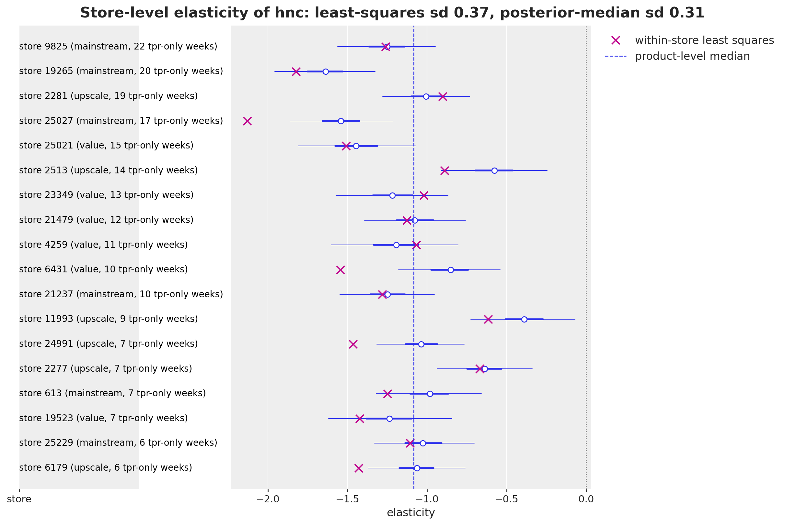</p>
</figure>


The store-level elasticities of the focal product have a least-squares spread of 0.37 across stores and a posterior-median spread of 0.31: the posterior medians shrink toward the product mean where the within-store estimates are noisy. This shrinkage is what the planner comparison of the decision section is about.

In the following plot we show the posterior-mean seasonal component of every product over the horizon quarter, because the timing question of the promotion reduces, under a multiplicative model, to the week in which the seasonal profile peaks.


    In [66]:


``` python
beta_mean = np.asarray(posterior["beta_s"]).mean(axis=0)
seasonal_mean = np.asarray(fourier_full) @ beta_mean
hnc_seasonal_horizon = seasonal_mean[t_train:, FOCAL_INDEX]
peak_week = int(np.argmax(hnc_seasonal_horizon)) + 1

fig, ax = plt.subplots(figsize=(11, 5), layout="constrained")

for k, product in enumerate(product_order):
    ax.plot(
        horizon_weeks,
        np.exp(seasonal_mean[t_train:, k]),
        marker="o",
        linewidth=2.5 if product == FOCAL else 1.2,
        label=product,
    )

ax.axvline(
    peak_week,
    color="gray",
    linestyle="--",
    label=f"{FOCAL} peak: week {peak_week} ({holdout_weeks[peak_week - 1]})",
)
ax.axvspan(
    EVENT_OFFSETS[0] + 0.5, EVENT_OFFSETS[-1] + 1.5, color="gray", alpha=0.15, label="event weeks"
)
ax.set_xticks(horizon_weeks)
ax.legend(loc="upper left", bbox_to_anchor=(1.01, 1.0))
ax.set(
    xlabel="horizon week",
    ylabel="seasonal multiplier (posterior mean)",
    title="Annual seasonality over the horizon quarter",
);
```


<figure class="figure">
<p>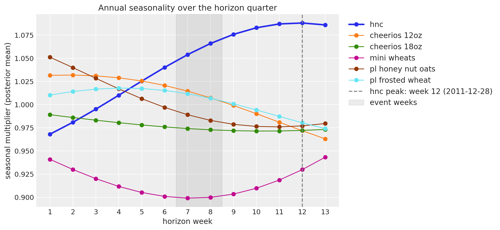</p>
</figure>


The posterior-mean seasonal component of the focal product peaks in horizon week 12, the week of December 28, four weeks after the Thanksgiving event, and moves its units by about 12\\ between the first horizon week and the peak: the calendar matters little for this product next to a mechanics multiplier of two.


## In-sample fit and holdout forecast

Before we use the model for decisions, we check that it forecasts. We draw the in-sample posterior predictive and the holdout forecast with the realized inputs and score them with the continuous ranked probability score (CRPS), the mean absolute error, and the coverage of the central 94\\ interval (the only central interval of this notebook; the figures draw HDI bands). The comparator is a seasonal naive forecast, the two-member ensemble of the units 52 and 104 weeks earlier. The next cell draws the predictives.


    In [67]:


``` python
rng_key, key_in, key_fc = random.split(rng_key, 3)
pred_train = np.asarray(
    predict_in_sample(key_in, nuts_model, posterior, covariates_train, device="host"),
    dtype=np.float32,
)
pred_test = np.asarray(
    forecast(key_fc, nuts_model, posterior, y_train, covariates, device="host"), dtype=np.float32
)
y_np = np.asarray(y, dtype=np.float32)
naive_test = np.stack(
    [y_np[t_train - 52 : t_train - 52 + HORIZON], y_np[t_train - 104 : t_train - 104 + HORIZON]]
)
```


The helper of the next cell scores an ensemble against the truth.


    In [68]:


``` python
def score(
    pred: Float[np.ndarray, " sample time n_series"], truth: Float[np.ndarray, " time n_series"]
) -> dict[str, float]:
    """Score an ensemble against the truth with CRPS, MAE and the central 94% coverage."""
    return {
        "crps": float(eval_crps(pred, truth)),
        "mae": float(eval_mae(pred, truth)),
        "coverage_94": float(eval_coverage(pred, truth, alpha=0.94)),
    }
```


In the following plot we compare the model with the seasonal naive per product on CRPS and on MASE (whose scale is computed per product on its training block, because a pooled scale would be dominated by the high-volume products), and show the 94\\ coverage per product; the title carries the scores over all products.


    In [69]:


``` python
metrics_table = pl.DataFrame(
    [
        {"forecast": "model (train)", **score(pred_train, y_train_f)},
        {"forecast": "model (test)", **score(pred_test, y_test_f)},
        {"forecast": "seasonal naive (test)", **score(naive_test, y_test_f)},
    ]
)
train_scores, test_scores, naive_scores = metrics_table.iter_rows(named=True)
score_rows = []

for k, product in enumerate(product_order):
    idx = np.where(series_to_product_np == k)[0]
    mase = make_mase(y_train_f[:, idx], seasonality=52)

    for name, pred in [("model", pred_test), ("seasonal naive", naive_test)]:
        score_rows.append(
            {
                "product": product,
                "forecast": name,
                "crps": float(eval_crps(pred[:, :, idx], y_test_f[:, idx])),
                "mase": float(mase(jnp.asarray(pred[:, :, idx]), jnp.asarray(y_test_f[:, idx]))),
                "coverage_94": float(eval_coverage(pred[:, :, idx], y_test_f[:, idx], alpha=0.94)),
            }
        )

per_product_table = pl.DataFrame(score_rows)

fig, axes = plt.subplots(ncols=3, figsize=(18, 5), layout="constrained")

for ax, metric in zip(axes, ["crps", "mase", "coverage_94"], strict=True):
    frame = (
        per_product_table
        if metric != "coverage_94"
        else per_product_table.filter(pl.col("forecast").eq(pl.lit("model")))
    )
    sns.barplot(
        data=frame.select("product", "forecast", metric).to_dict(as_series=False),
        x="product",
        y=metric,
        hue="forecast",
        order=product_order,
        ax=ax,
    )

    for container in ax.containers:
        ax.bar_label(container, fmt="{:.2f}")

    ax.tick_params(axis="x", rotation=15)
    ax.margins(y=0.15)
    ax.set(xlabel="", title=metric)

axes[2].axhline(0.94, color="gray", linestyle="--", label="nominal coverage")
handles, labels = axes[0].get_legend_handles_labels()
line_handles, line_labels = axes[2].get_legend_handles_labels()

for ax in axes:
    ax.get_legend().remove()

fig.legend(
    [*handles, line_handles[-1]], [*labels, line_labels[-1]], loc="outside lower center", ncols=3
)
fig.suptitle(
    "Holdout scores per product (all products, model vs seasonal naive: "
    f"CRPS {test_scores['crps']:.2f} vs {naive_scores['crps']:.2f}, "
    f"MAE {test_scores['mae']:.2f} vs {naive_scores['mae']:.2f}, "
    f"94% coverage {test_scores['coverage_94']:.2f} vs {naive_scores['coverage_94']:.2f}; "
    f"in sample {train_scores['coverage_94']:.2f})",
    fontsize=14,
    fontweight="bold",
);
```


<figure class="figure">
<p>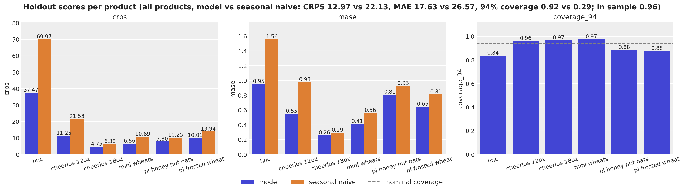</p>
</figure>


Over all products the holdout CRPS is 12.97 against 22.13 for the seasonal naive ensemble and the mean absolute error 17.63 against 26.57; the central 94\\ interval covers 92\\ of the 1{,}404 holdout cells (96\\ in sample). Per product the model's MASE is below the naive one and below one everywhere, with the focal product the hardest at 0.95 against 1.56 and a 94\\ coverage of 0.84 in its promotion-heavy quarter.

We read calibration the way [Gneiting and Katzfuss (2014)](https://doi.org/10.1146/annurev-statistics-062713-085831) frame it: sharpness subject to calibration. The check is the randomized probability integral transform (PIT) for counts of [Czado, Gneiting and Held (2009)](https://doi.org/10.1111/j.1541-0420.2009.01191.x). For a count y with predictive CDF G, u = G(y - 1) + v\\(G(y) - G(y - 1)) with v \sim \text{Uniform}(0, 1) is uniform for a calibrated forecast, U-shaped for an under-dispersed one and hump-shaped for an over-dispersed one. Two cautions: the holdout is the holiday quarter, with only two earlier Decembers in the training window; and the holdout cells of one series share a level path, so the effective sample size behind the histogram is below the cell count. In the following plot we show the CRPS by horizon week and the PIT histogram.


    In [70]:


``` python
crps_week_model = np.array(
    [float(crps_empirical(pred_test[:, t, :], y_test_f[t, :]).mean()) for t in range(HORIZON)]
)
crps_week_naive = np.array(
    [float(crps_empirical(naive_test[:, t, :], y_test_f[t, :]).mean()) for t in range(HORIZON)]
)
cdf_at = (pred_test <= y_test_f[None]).mean(axis=0)
cdf_below = (pred_test <= y_test_f[None] - 1.0).mean(axis=0)
pit_rng = np.random.default_rng(seed=42)
pit = cdf_below + pit_rng.uniform(size=y_test_f.shape) * (cdf_at - cdf_below)
pit_counts, _ = np.histogram(pit, bins=10, range=(0.0, 1.0))

fig, axes = plt.subplots(ncols=2, figsize=(15, 5), layout="constrained")
axes[0].plot(range(1, HORIZON + 1), crps_week_model, "o-", color="C0", label="model")
axes[0].plot(range(1, HORIZON + 1), crps_week_naive, "s-", color="C1", label="seasonal naive")
axes[0].set(
    xlabel="horizon week",
    ylabel="CRPS (units)",
    title="Holdout CRPS by horizon week",
    xticks=range(1, HORIZON + 1),
)
pit_bars = axes[1].bar(
    np.arange(0.05, 1.0, 0.1),
    pit_counts / pit_counts.sum(),
    width=0.1,
    color="C0",
    edgecolor="white",
    label="randomized PIT",
)
axes[1].bar_label(pit_bars, fmt="{:.2f}")
axes[1].axhline(0.1, color="gray", linestyle=":", label="uniform")
axes[1].set(
    xlabel="PIT value", ylabel="share of holdout cells", title="Randomized PIT histogram (holdout)"
)
handles, labels = axes[0].get_legend_handles_labels()
pit_handles, pit_labels = axes[1].get_legend_handles_labels()
fig.legend(handles + pit_handles, labels + pit_labels, loc="outside lower center", ncols=4)
fig.suptitle("Holdout accuracy and calibration", fontsize=16, fontweight="bold");
```


<figure class="figure">
<p>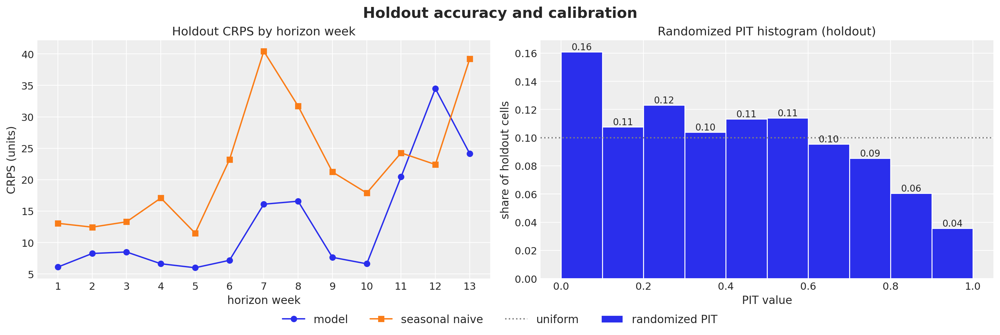</p>
</figure>


The model beats the naive forecast in every horizon week except week 12, the middle one of the three Christmas weeks with a feature at a 31\\ cut. The PIT histogram slopes downward, with 16\\ of the cells in the lowest decile and 4\\ in the highest: the holdout forecasts run high on average, so the calibration is good but not perfect. The helper of the next cell facets the in-sample fit and the holdout forecast of a list of series, and the following plot shows the focal product and its private-label twin in four stores.


    In [71]:


``` python
def plot_forecast_panel(
    pred_test_draws: Float[np.ndarray, " sample horizon n_series"],
    labels: list[str],
    forecast_prefix: str,
    suptitle: str,
) -> None:
    """Facet the in-sample predictive and the holdout forecast for the series in ``labels``."""
    n_rows = int(np.ceil(len(labels) / 2))
    fig, axes = plt.subplots(
        nrows=n_rows, ncols=2, figsize=(16, 2.8 * n_rows), layout="constrained", squeeze=False
    )

    for ax, label in zip(axes.ravel(), labels, strict=True):
        n = series_ids.index(label)
        store, product = label.split("::")
        plot_hdi_bands(ax, dates_num[:t_train], pred_train[:, :, n], "C0", prefix="in-sample ")
        plot_hdi_bands(
            ax, dates_num[t_train:], pred_test_draws[:, :, n], "C1", prefix=forecast_prefix
        )
        ax.plot(
            dates_num,
            panel_ds["units"].sel(series=label),
            color="black",
            lw=1.2,
            label="observed units",
        )
        ax.axvline(split_x, color="C3", linestyle="--", linewidth=1, label="train-test split")
        ax.fill_between(
            dates_num,
            0,
            1,
            where=(
                (panel_ds["feature"].sel(series=label) + panel_ds["display"].sel(series=label))
                > 0.5
            )
            .to_numpy()
            .tolist(),
            transform=ax.get_xaxis_transform(),
            color="C4",
            alpha=0.2,
            linewidth=0,
            step="mid",
            label="feature or display week",
        )
        ax.set_title(f"store {store} ({store_segment[int(store)]}): {product}")
        locator = mdates.AutoDateLocator()
        ax.xaxis.set_major_locator(locator)
        ax.xaxis.set_major_formatter(mdates.ConciseDateFormatter(locator))

    fig.legend(*ax.get_legend_handles_labels(), loc="outside lower center", ncols=4)
    fig.supylabel("units")
    fig.suptitle(suptitle, fontsize=16, fontweight="bold")
```


    In [72]:


``` python
TWIN = "pl honey nut oats"
forecast_stores = [
    focus_by_segment["mainstream"][0],
    focus_by_segment["upscale"][0],
    focus_by_segment["value"][0],
    focus_by_segment["mainstream"][1],
]
plot_labels = [f"{store}::{product}" for store in forecast_stores for product in (FOCAL, TWIN)]
plot_forecast_panel(
    pred_test,
    plot_labels,
    forecast_prefix="holdout forecast ",
    suptitle=(
        f"In-sample fit and holdout forecast (test CRPS {metrics_table['crps'][1]:.2f} "
        f"vs naive {metrics_table['crps'][2]:.2f})"
    ),
)
```


<figure class="figure">
<p>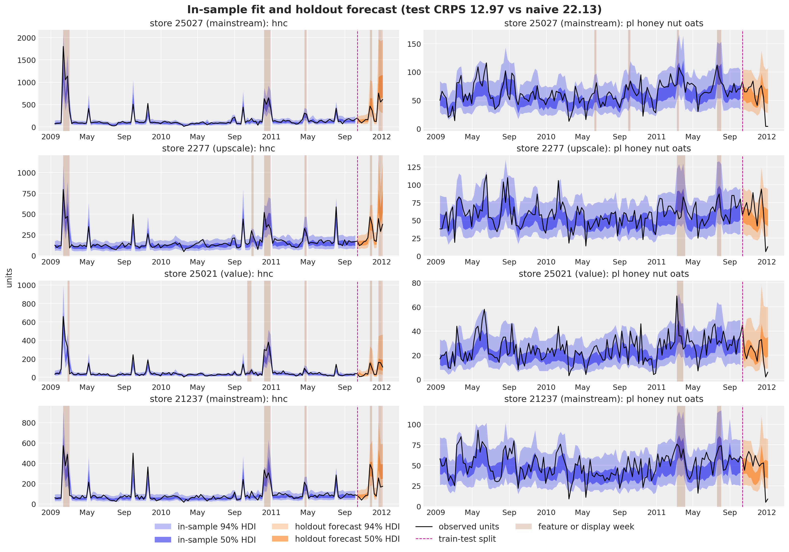</p>
</figure>


The forecast bands follow the promotion spikes of the holdout quarter in every store, and the twin's units drop in the weeks in which the focal product is promoted. The band fails in the last two holdout weeks of the twin, where its observed units fall to near zero in all four stores, below the 94\\ band; this is where its 0.88 coverage comes from. The model forecasts well enough to be used for counterfactual promotions.


# Counterfactual promotions

A counterfactual promotion is a change of the horizon inputs, nothing else: the posterior draws stay fixed, the same PRNG key is reused, and the model is run again through NumPyro's `Predictive`. Nothing is refit. This is the covariate-swap pattern of the [fresh retail stockout example](fresh_retail_stockout.md) and the scenario covariates of the [availability TSB example](availability_tsb.md). The decision layer needs three things from every run: the sampled units, the conditional mean \mu over the horizon, and the future level innovations. The helper of the next cell wraps `Predictive` to return the three; the cell after it asserts that it reproduces the [forecast](../../../reference/predictive.forecast.md#numpyro_forecast.predictive.forecast) draws of the previous section under the same key.


    In [73]:


``` python
def _scenario_draws(
    rng_key: Array,
    model: ForecastModel,
    posterior: dict[str, Array],
    data: Array,
    covariates: Array,
) -> dict[str, Array]:
    """Return the sampled horizon units, conditional means and future innovations of one tensor."""
    predictive = Predictive(
        model,
        posterior_samples=posterior,
        return_sites=["forecast", "mu_future", "drift_future"],
        parallel=True,
    )
    return predictive(rng_key, covariates, data)
```


    In [74]:


``` python
scenario_draws = jax.jit(_scenario_draws, static_argnums=(1,))

engine = scenario_draws(key_fc, nuts_model, posterior, y_train, covariates)
engine_gap = float(np.abs(np.asarray(engine["forecast"], dtype=np.float32) - pred_test).max())
assert engine_gap == 0.0, "the scenario wrapper must reproduce the forecast() draws"
```


A policy is a discount depth d and a mechanics m for the focal product in every panel store during one contiguous two-week event, horizon weeks 7 and 8, the realized Thanksgiving slot. Every other product stays at its base price with no promotion over the whole horizon. The calendar is not a lever here for two reasons shown earlier: the post-promotion dip is economically negligible, and under a multiplicative model the timing question reduces to the seasonal peak. The helper of the next cell builds the horizon inputs of a policy. In the event rows it sets the focal product's own price and flags, writes the focal product's price into the `price hnc` channel of every series at the store, and sets the sibling flags of the other five series; the training rows are left untouched.


    In [75]:


``` python
event_rows = [t_train + offset for offset in EVENT_OFFSETS]
BASELINE = ("tpr-only", 0.0)


def policy_covariates(depth: float, feature_flag: float, display_flag: float) -> Array:
    """Build the horizon covariates of one policy: base prices and no promotion off the event."""
    tensor = np.asarray(covariates).copy()
    tensor[:, t_train:, :] = 0.0
    x_policy = float(np.log1p(-depth))

    for n in range(n_series):
        if int(series_to_product_np[n]) == FOCAL_INDEX:
            tensor[0, event_rows, n] = x_policy
            tensor[1, event_rows, n] = feature_flag
            tensor[2, event_rows, n] = display_flag
        else:
            tensor[3, event_rows, n] = feature_flag
            tensor[4, event_rows, n] = display_flag
        tensor[PRICE_BLOCK + FOCAL_INDEX, event_rows, n] = x_policy

    return jnp.asarray(tensor, dtype=jnp.float32)
```


Two policies forecast under one key share the future level innovations and differ only where the inputs differ; the sampled units are coupled but not identical, which is what common random numbers mean here. The next cell checks this on two policies: the training rows are untouched, the future innovations are identical, the conditional means outside the event weeks are identical, and the focal product's event draws are strongly correlated across the two policies.


    In [76]:


``` python
policy_a = policy_covariates(0.15, *MECHANICS["feature + display"])
policy_b = policy_covariates(0.30, *MECHANICS["tpr-only"])
assert np.array_equal(np.asarray(policy_a)[:, :t_train], np.asarray(covariates)[:, :t_train])
rng_key, key_policy = random.split(rng_key)
out_a = scenario_draws(key_policy, nuts_model, posterior, y_train, policy_a)
out_b = scenario_draws(key_policy, nuts_model, posterior, y_train, policy_b)
non_event = [offset for offset in range(HORIZON) if offset not in EVENT_OFFSETS]
assert np.array_equal(out_a["drift_future"], out_b["drift_future"]), "shared level innovations"
assert np.array_equal(out_a["mu_future"][:, non_event], out_b["mu_future"][:, non_event]), (
    "identical conditional means outside the event"
)
event_a = np.asarray(out_a["forecast"])[:, EVENT_OFFSETS][:, :, hnc_series_index].ravel()
event_b = np.asarray(out_b["forecast"])[:, EVENT_OFFSETS][:, :, hnc_series_index].ravel()

print(
    f"correlation of the focal product's event draws across the two policies: "
    f"{np.corrcoef(event_a, event_b)[0, 1]:.2f}"
)
```


    correlation of the focal product's event draws across the two policies: 0.99


The checks pass and the focal product's event draws have a correlation of 0.99 across the two policies.

The grid of policies runs from no cut to a 40\\ cut in steps of five points for each of the four mechanics; for the shelf-tag-only mechanics the zero-depth cell is the no-promotion baseline itself. The grid is a response surface for the break-even and risk analyses, not a search space. The next cell forecasts every policy and stores, per policy, the event units of every series, their conditional means, and the zone-level paths of the focal product and its twin.


    In [77]:


``` python
policies: list[tuple[str, float]] = [
    (mechanics_name, float(depth)) for mechanics_name in MECHANICS for depth in DEPTH_GRID
]
event_units_mu: dict[tuple[str, float], np.ndarray] = {}
event_units_paths: dict[tuple[str, float], np.ndarray] = {}
hnc_event_paths: dict[tuple[str, float], np.ndarray] = {}
hnc_event_mu: dict[tuple[str, float], np.ndarray] = {}
zone_paths: dict[tuple[str, float], np.ndarray] = {}
start = perf_counter()

for policy in policies:
    mechanics_name, depth = policy
    out = scenario_draws(
        key_policy,
        nuts_model,
        posterior,
        y_train,
        policy_covariates(depth, *MECHANICS[mechanics_name]),
    )
    mu_horizon = np.asarray(out["mu_future"], dtype=np.float32)
    y_horizon = np.asarray(out["forecast"], dtype=np.float32)
    event_units_mu[policy] = mu_horizon[:, EVENT_OFFSETS, :].sum(axis=1)
    event_units_paths[policy] = y_horizon[:, EVENT_OFFSETS, :].sum(axis=1)
    hnc_event_paths[policy] = y_horizon[:, EVENT_OFFSETS][:, :, hnc_series_index]
    hnc_event_mu[policy] = mu_horizon[:, EVENT_OFFSETS][:, :, hnc_series_index]
    zone_paths[policy] = np.stack(
        [y_horizon[:, :, series_to_product_np == k].sum(axis=2) for k in range(n_products)],
        axis=-1,
    )

print(f"{len(policies)} policies forecast on {n_draws} draws in {perf_counter() - start:.0f} s")
```


    36 policies forecast on 4000 draws in 34 s


The 36 policies take under a minute. The helper of the next cell plots zone-level weekly units (the sum over the 18 stores) of a policy against no promotion, with the median path and the 94\\ HDI band of each and the event weeks shaded, one panel per product and policy.


    In [78]:


``` python
PRODUCT_NAMES = {FOCAL: "Honey Nut Cheerios", TWIN: "private-label twin"}


def plot_zone_policies(
    policy_list: list[tuple[str, float]],
    products: list[str],
    figsize: tuple[float, float],
    legend_ncols: int = 5,
) -> None:
    """Plot zone-level weekly units, no promotion vs policy, one panel per product and policy."""
    horizon_axis = np.arange(1, HORIZON + 1)
    fig, axes = plt.subplots(
        nrows=len(products),
        ncols=len(policy_list),
        figsize=figsize,
        sharex=True,
        layout="constrained",
        squeeze=False,
    )

    for row, product in zip(axes, products, strict=True):
        k = product_order.index(product)

        for ax, policy in zip(row, policy_list, strict=True):
            baseline_draws = zone_paths[BASELINE][:, :, k]
            policy_draws = zone_paths[policy][:, :, k]
            plot_hdi_bands(ax, horizon_axis, baseline_draws, "C0", prefix="no promotion ")
            ax.plot(
                horizon_axis,
                np.median(baseline_draws, axis=0),
                color="C0",
                linewidth=2,
                label="no promotion median",
            )
            plot_hdi_bands(ax, horizon_axis, policy_draws, "C1", prefix="policy ")
            ax.plot(
                horizon_axis,
                np.median(policy_draws, axis=0),
                color="C1",
                linewidth=2,
                label="policy median",
            )
            ax.axvspan(
                EVENT_OFFSETS[0] + 0.5,
                EVENT_OFFSETS[-1] + 1.5,
                color="gray",
                alpha=0.15,
                label="event weeks",
            )
            ax.set_xticks(range(1, HORIZON + 1, 2))
            ax.set(title=f"{PRODUCT_NAMES[product]}: {policy[0]} at {policy[1]:.0%}")

        row[0].set_ylabel(f"units per week, {n_stores} stores")

    for ax in axes[-1]:
        ax.set_xlabel("horizon week")

    fig.legend(*ax.get_legend_handles_labels(), loc="outside lower center", ncols=legend_ncols)
    fig.suptitle(
        "Counterfactual promotion vs no promotion (posterior predictive)",
        fontsize=16,
        fontweight="bold",
    )
```


In the following plot we show what the committed policy, feature with display at a 15\\ cut, does to the focal product at the zone level.


    In [79]:


``` python
plot_zone_policies([("feature + display", 0.15)], [FOCAL], figsize=(12.0, 6.0), legend_ncols=3)
```


<figure class="figure">
<p>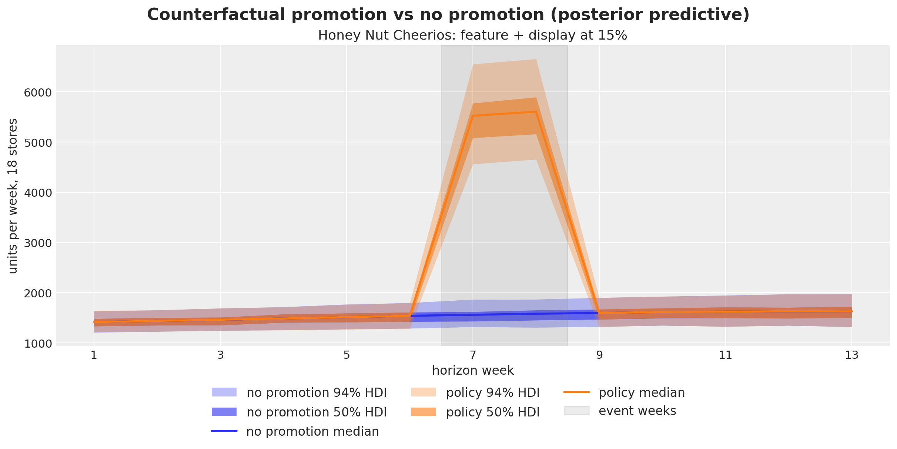</p>
</figure>


The feature-with-display event lifts the focal product's zone-level units to more than three times the no-promotion level in the event weeks, and the two bands separate completely. In the following plot we compare three mechanics at the same 15\\ depth, one column per mechanics and one row per product, with the private-label twin in the second row.


    In [80]:


``` python
plot_zone_policies(
    [("tpr-only", 0.15), ("feature", 0.15), ("feature + display", 0.15)],
    [FOCAL, TWIN],
    figsize=(16.0, 8.0),
)
```


<figure class="figure">
<p>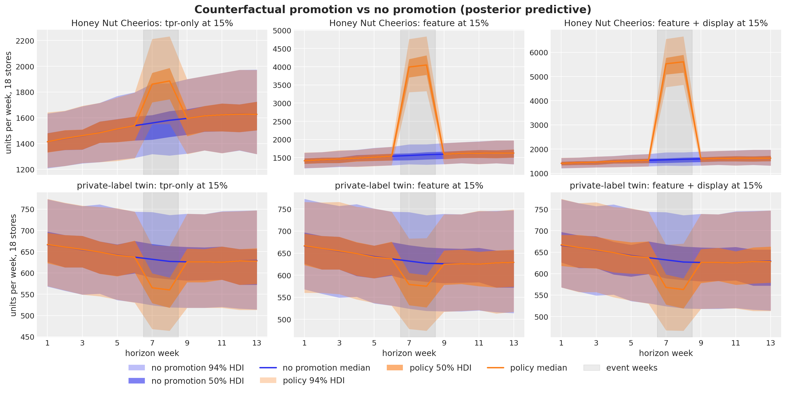</p>
</figure>


A shelf-tag cut of the same depth moves the focal product far less than a feature, and the feature with display moves it most; the twin loses units under every mechanics. The decision section turns these units into money.


# Decision making and optimization

The model forecasts units, and the decisions need money. This section states the economics once and turns the forecast units of every draw into an event profit; the break-even, slot, store, risk, planner and order subsections then work on that profit. The economics are simple and explicit: a gross margin per product, a per-unit allowance from the manufacturer, and a slot cost per mechanics that we solve for rather than assume.


## The margin of a promoted unit

Take product j at store s. Let p\_{j,s} be its base price at the last training week. Base prices differ across stores, so every currency number below uses the store's own price. Let g_j be the gross margin on the base price: 0.28 for the national brands and 0.38 for the private label. The unit cost is the part of the base price that is not margin:

 c\_{j,s} = (1 - g_j)\\ p\_{j,s}. 

Now cut the price of the focal product \text{H} by a fraction d of its base price. The manufacturer refunds a share \alpha of the discount on every unit sold in a promotion week. We call this refund the allowance. Three flows set the margin of one promoted unit. The retailer sells the unit at the cut price. The retailer pays the unit cost. The retailer receives the allowance. The sum of the three flows is the promo-week unit margin:

\begin{align\*} m\_{\text{H},s}(d) &= p\_{\text{H},s}\\(1 - d) - c\_{\text{H},s} + \alpha\\ d\\ p\_{\text{H},s} \\ &= p\_{\text{H},s}\\ \big( g\_{\text{H}} - (1 - \alpha)\\ d \big). \end{align\*}

Each point of depth costs the retailer (1 - \alpha) points of margin rate, and the manufacturer pays the rest. The siblings k \ne \text{H} stay at their base price during the event, so their margin is the base-price margin:

 m\_{k,s} = g_k\\ p\_{k,s}. 

A feature or a display also uses a slot. Its cost S_m per store-week is one number per mechanics, and under feature with display it covers both slots. We never assume a value for S_m; a later subsection solves for it. The next cell builds the per-series margins and prints the economics of the focal product.


    In [81]:


``` python
is_private_label = np.array(
    [series_ids[n].split("::")[1].startswith("pl") for n in range(n_series)]
)
gross_margin = np.where(is_private_label, 0.38, 0.28)
unit_cost = (1.0 - gross_margin) * base_price
is_focal = series_to_product_np == FOCAL_INDEX
store_onehot = np.eye(n_stores)[series_to_store_np]  # (n_series, n_stores)
N_EVENT_WEEKS = len(EVENT_OFFSETS)
G_FOCAL = float(gross_margin[is_focal][0])
p_focal_median = float(np.median(base_price[is_focal]))

print(
    f"{FOCAL}: gross margin {G_FOCAL:.2f}, base price {base_price[is_focal].min():.2f} to "
    f"{base_price[is_focal].max():.2f} (median {p_focal_median:.2f}), unit cost at the median "
    f"{(1.0 - G_FOCAL) * p_focal_median:.2f}; private label gross margin 0.38"
)
```


    hnc: gross margin 0.28, base price 2.61 to 3.07 (median 3.02), unit cost at the median 2.17; private label gross margin 0.38


The unit margin of a promoted unit is a straight line in the depth whose slope is -(1 - \alpha)\\ p\_{\text{H},s}. In the following plot we draw it at the median focal base price for three funding shares, with the margin at 0\\, 15\\ and 30\\ marked for the nominal share \alpha = 0.5.


    In [82]:


``` python
depth_axis = np.linspace(0.0, 0.40, 81)

fig, ax = plt.subplots(figsize=(10, 5), layout="constrained")

for alpha_value, color in zip((0.0, 0.5, 1.0), ("C3", "C0", "C2"), strict=True):
    ax.plot(
        depth_axis,
        p_focal_median * (G_FOCAL - (1.0 - alpha_value) * depth_axis),
        color=color,
        linewidth=2,
        label=f"funding share {alpha_value:.1f}",
    )

for depth in (0.0, 0.15, 0.30):
    margin = p_focal_median * (G_FOCAL - 0.5 * depth)
    ax.plot(depth, margin, "o", color="C0")
    ax.annotate(f"{margin:.2f}", (depth, margin), textcoords="offset points", xytext=(8, 6))

ax.axhline(0.0, color="black", linewidth=1)
ax.xaxis.set_major_formatter(mtick.PercentFormatter(xmax=1, decimals=0))
ax.legend(loc="upper left", bbox_to_anchor=(1.01, 1.0))
ax.set(
    xlabel="discount depth",
    ylabel="promo-week unit margin (currency units)",
    title=f"Unit margin of {FOCAL} at the median base price {p_focal_median:.2f}",
);
```


<figure class="figure">
<p>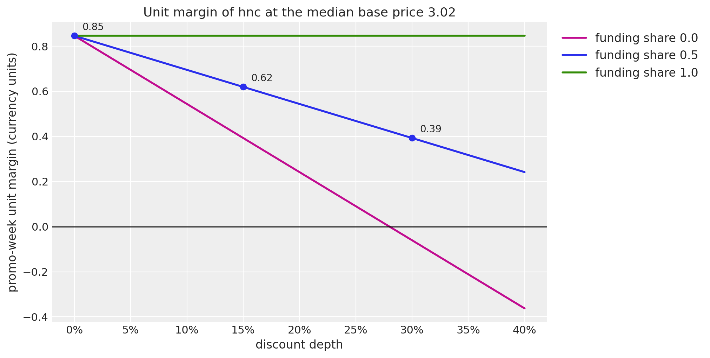</p>
</figure>


At the median focal base price of 3.02 the margin is 0.85 per unit at full price. A 15\\ cut at the nominal share \alpha = 0.5 brings it to 0.62. An unfunded 30\\ cut brings it below zero: the cut is deeper than the margin rate, so every unit sells below cost.


## The event profit and the funding share

A policy a = (d, m) fixes a depth d and a mechanics m for the two event weeks. The quantity we want is the expected event profit of a policy under the posterior predictive, \text{E}\[\Pi(a)\]. This is the estimand of the decision layer. The rules of the next sections compare policies on it, on its lower tail, and on the order quantity.

We estimate it from posterior draws. Let r = 1, \dots, R index one draw of the parameters and of the future level path; we write \theta_r for both together. Let E = \\7, 8\\ be the set of event weeks. Let y\_{r,t,i}(a) be the sampled unit count of series i in week t under policy a in draw r; it includes the demand noise. Write i \in \text{H} for the 18 focal series, one per store, and i \notin \text{H} for the sibling series. Let \text{margin}\_{i,t}(a) be the unit margin of series i under the policy: m\_{\text{H},s(i)}(d) for a focal series and m\_{p(i),s(i)} for a sibling series. The event profit of draw r adds the margin dollars of every series over the event weeks and subtracts the slot cost, paid in each of the two event weeks in each of the 18 stores:

\begin{align\*} \Pi_r(a) &= \sum\_{t \in E} \sum\_{i} \text{margin}\_{i,t}(a)\\ y\_{r,t,i}(a) - S(a), \\ S(a) &= 2 \times 18 \times S_m. \end{align\*}

We set S = 0 in every break-even and risk computation. Let a_0 be the no-promotion baseline and \Delta\Pi_r(a) = \Pi_r(a) - \Pi_r(a_0) the incremental profit of a policy. An assumed slot cost shifts every histogram of \Delta\Pi by a constant, so \text{P}(\Delta\Pi \< S) can be read off the same figures.

The units do not depend on \alpha, because the model has no funding term. Only the margin does, and it is linear in \alpha. So the event profit of a draw is a straight line in the funding share:

 \Pi_r(a) = A_r(a) + \alpha\\ B_r(a), 

with

\begin{align\*} A_r(a) &= \sum\_{t \in E} \sum\_{i \in \text{H}} p\_{\text{H},s(i)}\\(g\_{\text{H}} - d)\\ y\_{r,t,i}(a) \\ &\quad + \sum\_{t \in E} \sum\_{i \notin \text{H}} m\_{p(i),s(i)}\\ y\_{r,t,i}(a) - S(a), \\ B_r(a) &= d \sum\_{t \in E} \sum\_{i \in \text{H}} p\_{\text{H},s(i)}\\ y\_{r,t,i}(a). \end{align\*}

A_r(a) is the event profit when the retailer funds the whole cut. B_r(a) is the discount dollars given away on the focal units sold: depth times base price times units. The allowance refunds the share \alpha of these dollars. B_r(a) is positive whenever d \> 0, so a higher funding share always raises profit. One set of draws therefore serves every funding share, and `profit_parts` in the next cell returns exactly these two parts.

Profit is linear in units. So, given the parameters and the level path of draw r, the expected profit \text{E}\[\Pi(a) \mid \theta_r\] is the same sum with the conditional means \mu\_{r,t,i}(a) in place of the sampled counts:

 \Pi^\mu_r(a) = \sum\_{t \in E} \sum\_{i} \text{margin}\_{i,t}(a)\\ \mu\_{r,t,i}(a) - S(a). 

The average of \Pi^\mu_r(a) over the draws estimates the estimand without any observation-noise error:

 \text{E}\[\Pi(a)\] = \text{E}\big\[\text{E}\[\Pi(a) \mid \theta\]\big\] \approx \frac{1}{R} \sum\_{r=1}^{R} \Pi^\mu_r(a). 

The bands of \Pi^\mu in the break-even subsection still carry the sampled level path. The sampled counts return in the risk and order subsections, where the demand noise matters. The next cell defines the two parts, at the zone level and per store.


    In [83]:


``` python
def profit_parts(
    units: Float[np.ndarray, " sample n_series"], depth: float, brand_only: bool = False
) -> tuple[Float[np.ndarray, " sample"], Float[np.ndarray, " sample"]]:
    """Split the event profit into ``A + alpha * B`` per draw (``brand_only`` drops siblings)."""
    margin_at_zero = np.where(
        is_focal,
        base_price * (gross_margin - depth),
        0.0 if brand_only else gross_margin * base_price,
    )
    part_a = units @ margin_at_zero
    part_b = depth * (units[:, is_focal] @ base_price[is_focal])
    return part_a, part_b


def profit_parts_by_store(
    units: Float[np.ndarray, " sample n_series"], depth: float, brand_only: bool = False
) -> tuple[Float[np.ndarray, " sample n_stores"], Float[np.ndarray, " sample n_stores"]]:
    """Split the event profit into ``A + alpha * B`` per store (``brand_only`` drops siblings)."""
    margin_at_zero = np.where(
        is_focal,
        base_price * (gross_margin - depth),
        0.0 if brand_only else gross_margin * base_price,
    )
    part_a = (units * margin_at_zero) @ store_onehot
    part_b = depth * ((units * (is_focal * base_price)) @ store_onehot)
    return part_a, part_b


def event_profit(
    units: Float[np.ndarray, " sample n_series"],
    depth: float,
    alpha: float,
    brand_only: bool = False,
) -> Float[np.ndarray, " sample"]:
    """Compute the event profit per draw at a funding share ``alpha`` and zero slot cost."""
    part_a, part_b = profit_parts(units, depth, brand_only=brand_only)
    return part_a + alpha * part_b
```


The next cell summarizes the no-promotion event profit over the 18 stores, with and without the demand noise.


    In [84]:


``` python
baseline_mu = event_profit(event_units_mu[BASELINE], 0.0, 0.5)
baseline_paths = event_profit(event_units_paths[BASELINE], 0.0, 0.5)

print(
    f"no-promotion event profit: mean {baseline_mu.mean():,.0f}, sd {baseline_mu.std():,.0f} "
    f"from the parameters and the level path, {baseline_paths.std():,.0f} with the demand noise"
)
```


    no-promotion event profit: mean 10,270, sd 221 from the parameters and the level path, 310 with the demand noise


Over the 18 stores the no-promotion event profit has a mean of 10{,}270 currency units. The parameters and the level path give it a standard deviation of 221; with the demand noise it is 310.


## A single-product rule of thumb

The numerical shares below come from the full model. A one-product version explains the shape of the answer before we compute it. Let N_0 be the expected event units of the focal product in one store at base price and without mechanics. From the model section, a mechanics m multiplies the units by the uplift e^{b_m} and a cut of depth d by (1 - d)^{\varepsilon_m}, with \varepsilon_m \< 0 the mechanics-specific elasticity. Write m\_{\text{H}}(d) for the promo-week unit margin of the store. The profit of the focal product alone is margin per unit times units, minus the slot:

 \pi_m(d) = m\_{\text{H}}(d)\\ N_0\\ (1 - d)^{\varepsilon_m}\\ e^{b_m} - S_m. 

Its derivative in d has the sign of

 \big(-g\_{\text{H}}\\ \varepsilon_m - (1 - \alpha)\big) + (1 - \alpha)(1 + \varepsilon_m)\\ d. 

The first bracket is the trade-off at the first point of depth: the point raises units by -\varepsilon_m percent, each worth g\_{\text{H}} of margin rate, and it costs (1 - \alpha) points of margin rate. So a first point of depth pays if and only if \varepsilon_m \< -\varepsilon^\star(\alpha), with the threshold elasticity

 \varepsilon^\star(\alpha) = \frac{1 - \alpha}{g\_{\text{H}}}. 

The threshold plot below marks it at three shares: 3.57 when the retailer funds the whole cut, 1.79 at the nominal share, 0 when the manufacturer funds everything. Solve the same condition for \alpha instead, and you get the brand-only break-even share of a mechanics:

 \alpha^\star_m = 1 + g\_{\text{H}}\\ \varepsilon_m. 

At or below 0 the cut pays even if the retailer funds it alone. At or above 1 no funding share makes it pay. The figures report its intervals unclipped with this rule. Cannibalization raises the share, because the cut moves sibling units through the cross elasticities \gamma\_{\text{H},k}. Let \tilde N\_{j,s,m} be the expected event units of product j at store s at zero depth under mechanics m. The category break-even share adds a ratio to the brand-only one,

 \alpha^\star\_{\text{cat},m} = \alpha^\star_m + \frac{L_m}{R_m}, 

with

\begin{align\*} L_m &= \sum_s \sum\_{k \ne \text{H}} m\_{k,s}\\ \tilde N\_{k,s,m}\\ \gamma\_{\text{H},k}, \\ R_m &= \sum_s p\_{\text{H},s}\\ \tilde N\_{\text{H},s,m}. \end{align\*}

L_m is the sibling margin lost per unit of log price change and R_m the focal product's promo-week gross revenue at zero depth; the ratio is the extra share the manufacturer must fund to cover what the siblings lose. With \|\varepsilon_m\| \le 1 the second bracket of the derivative grows with d, so the best cell of a depth grid is a corner: below the event-level share of the deepest cell the shallowest cell is best, above the tangent share \alpha^\star_m the deepest cell is best, and in the narrow band between them the two corners must be compared directly. With \|\varepsilon_m\| \> 1 an interior depth exists for a narrow band of funding shares. The notebook computes two numerical shares per draw from the stored conditional means, so that the cross terms and the sibling flags enter through the model. The secant share sets the profits of the two shallowest cells of a mechanics equal, a\_{\text{lo}} and a\_{\text{hi}} (zero and five points for a flagged mechanics, no promotion and ten points for a shelf tag alone):

 \alpha^{\text{sec}}\_{r,m} = \frac{A_r(a\_{\text{lo}}) - A_r(a\_{\text{hi}})}{B_r(a\_{\text{hi}}) - B_r(a\_{\text{lo}})}. 

Its brand-only version drops the sibling terms from A_r. The event-level share of a grid cell a is the funding share at which the cell breaks even against no promotion:

 \alpha^{\text{ev}}\_r(a) = -\frac{A_r(a) - A_r(a_0)}{B_r(a)}. 

A negative value means the event beats no promotion even if the retailer funds the whole cut; a value above one means no funding share makes it pay. Remark: a lump-sum allowance L instead of a per-unit one adds L to A_r and removes \alpha B_r, so the break-even question becomes a question about L; the \Pi^\mu argument only uses linearity in units, so it holds under a Poisson likelihood or any likelihood whose conditional mean the model registers.


## Who funds the discount: the break-even funding share

This is the second business question. The manufacturer's funding share is negotiated, so the useful output is not a profit at one share but the share at which the promotion stops paying, with its uncertainty. The next cell defines the mechanics-specific elasticity draws and the secant share.


    In [85]:


``` python
feature_depth_draws = np.asarray(posterior["b_feat_depth"])[:, FOCAL_INDEX]
display_depth_draws = np.asarray(posterior["b_disp_depth"])[:, FOCAL_INDEX]
eps_focal_draws = eps_prod_draws[:, FOCAL_INDEX]


def eps_m_draws(mechanics_name: str) -> Float[np.ndarray, " sample"]:
    """Return the zone-level mechanics-specific elasticity draws of the focal product."""
    feature_flag, display_flag = MECHANICS[mechanics_name]
    return (
        eps_focal_draws - feature_depth_draws * feature_flag - display_depth_draws * display_flag
    )


def marginal_secant(mechanics_name: str, brand_only: bool) -> Float[np.ndarray, " sample"]:
    """Solve, per draw, for the funding share at which the two shallowest cells tie."""
    if mechanics_name == "tpr-only":
        shallow, deeper = BASELINE, ("tpr-only", 0.10)
    else:
        shallow, deeper = (mechanics_name, 0.0), (mechanics_name, 0.05)
    a_shallow, b_shallow = profit_parts(event_units_mu[shallow], shallow[1], brand_only=brand_only)
    a_deeper, b_deeper = profit_parts(event_units_mu[deeper], deeper[1], brand_only=brand_only)
    return (a_shallow - a_deeper) / (b_deeper - b_shallow)
```


In the following forest plot we show, per mechanics, the posterior of the three break-even shares of the rule of thumb (the brand-only secant, the category secant with the cannibalization included, and the brand-only tangent \alpha^\star_m) and of the cannibalization itself, the difference between the category and the brand-only secant. The posterior median of the category share of feature with display becomes \tilde\alpha, the reference share of every later figure, drawn as the dashed line.


    In [86]:


``` python
share_kinds = ["brand-only secant", "category secant", "brand-only tangent", "cannibalization"]
break_even_draws: dict[tuple[str, str], np.ndarray] = {}
alpha_star_cat: dict[str, np.ndarray] = {}

for mechanics_name in MECHANICS:
    brand = marginal_secant(mechanics_name, brand_only=True)
    category = marginal_secant(mechanics_name, brand_only=False)
    alpha_star_cat[mechanics_name] = category
    break_even_draws[(mechanics_name, "brand-only secant")] = brand
    break_even_draws[(mechanics_name, "category secant")] = category
    break_even_draws[(mechanics_name, "brand-only tangent")] = 1.0 + G_FOCAL * eps_m_draws(
        mechanics_name
    )
    break_even_draws[(mechanics_name, "cannibalization")] = category - brand

alpha_tilde = float(np.clip(np.median(alpha_star_cat["feature + display"]), 0.0, 1.0))
break_even_labels = [
    f"{m} | {kind}: {hdi_text(break_even_draws[(m, kind)])}"
    for m in MECHANICS
    for kind in share_kinds
]
break_even_stack = np.stack(
    [break_even_draws[(m, kind)] for m in MECHANICS for kind in share_kinds], axis=1
)
ax = forest_plot(
    draws_dataset("share", break_even_stack, "row", break_even_labels),
    ["share"],
    ["row"],
    figsize=(13.0, 8.0),
)
ax.axvline(1.0, color="gray", linestyle=":", linewidth=1)
ax.axvline(
    alpha_tilde,
    color="C3",
    linestyle="--",
    linewidth=1.5,
    label=f"alpha tilde = {alpha_tilde:.2f}",
)
ax.legend(loc="upper left", bbox_to_anchor=(1.01, 1.0))
ax.set(xlabel="funding share")
ax.figure.suptitle("Break-even funding share by mechanics", fontsize=16, fontweight="bold");
```


<figure class="figure">
<p>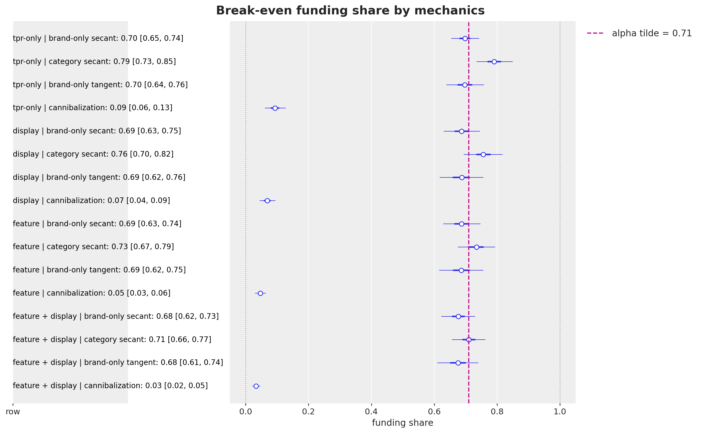</p>
</figure>


The brand-only shares are between 0.68 and 0.70 for the four mechanics with 94\\ HDIs about 0.1 wide, and the cannibalization rows add 0.03 under feature with display and 0.09 under a shelf-tag cut. The posterior median of the category break-even share of feature with display is 0.71, which becomes \tilde\alpha.

In the following plot we turn the same posterior into decision probabilities as a function of the funding share: on the left, the probability that the mechanics-specific elasticity is below the threshold \varepsilon^\star(\alpha) (the brand-only tangent), with the threshold marked at three shares; on the right, the probability that the category break-even share is below \alpha (the category secant). The vertical lines are the nominal share and \tilde\alpha.


    In [87]:


``` python
alpha_axis = np.linspace(0.0, 1.0, 101)
probability_rows = [
    {
        "funding share": float(a),
        "mechanics": mechanics_name,
        "P(the cut pays)": float(np.mean(eps_m_draws(mechanics_name) < -(1.0 - a) / G_FOCAL)),
        "P(category break-even share below)": float(np.mean(alpha_star_cat[mechanics_name] < a)),
    }
    for mechanics_name in MECHANICS
    for a in alpha_axis
]
probability_table = pl.DataFrame(probability_rows)

fig, axes = plt.subplots(ncols=2, figsize=(15, 5.5), sharey=True, layout="constrained")

for ax, column in zip(
    axes, ["P(the cut pays)", "P(category break-even share below)"], strict=True
):
    sns.lineplot(
        data=probability_table.to_dict(as_series=False),
        x="funding share",
        y=column,
        hue="mechanics",
        hue_order=list(MECHANICS),
        linewidth=2,
        ax=ax,
    )
    ax.axvline(0.5, color="gray", linestyle=":", linewidth=1.5, label="nominal share 0.5")
    ax.axvline(alpha_tilde, color="black", linestyle="--", linewidth=1.5, label="alpha tilde")
    ax.set(xlabel="funding share", ylabel="posterior probability", ylim=(0, 1.1))

for alpha_value in (0.0, 0.5, 1.0):
    axes[0].annotate(
        f"$\\varepsilon^\\star$ = {(1.0 - alpha_value) / G_FOCAL:.2f}",
        (alpha_value, 1.04),
        ha="left" if alpha_value < 1.0 else "right",
        xytext=(6, 0),
        textcoords="offset points",
    )

handles, labels = axes[0].get_legend_handles_labels()

for ax in axes:
    ax.get_legend().remove()

fig.legend(handles, labels, loc="outside lower center", ncols=6)
axes[0].set(title="P(the cut pays): elasticity below the threshold")
axes[1].set(title="P(category break-even share below the funding share)")
fig.suptitle(
    "Does a deeper cut pay? Probability by funding share", fontsize=16, fontweight="bold"
);
```


<figure class="figure">
<p>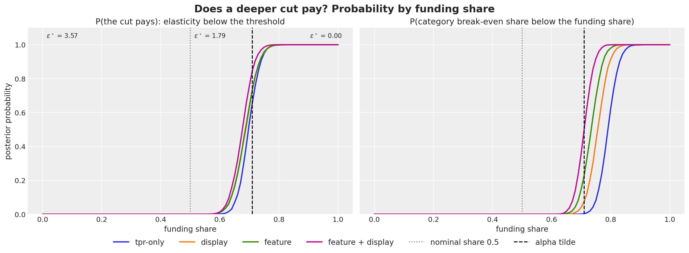</p>
</figure>


At the nominal share the threshold elasticity is 1.79 and the probability that a cut pays is zero under every mechanics. Both probabilities cross one half near \tilde\alpha (the category one exactly at \tilde\alpha for feature with display, by construction, since \tilde\alpha is the median of that distribution) and reach one by a share of 0.9.

In the following plot we show the expected event profit of the category against the depth of the focal product's cut, one row per mechanics and one column per funding share: the nominal 0.5, \tilde\alpha, and \tilde\alpha + 0.15. The bands are the 50\\ and 94\\ HDIs across draws of \Pi^\mu, so they carry the parameter and level-path uncertainty and not the demand noise; shaded depths have thin support.


    In [88]:


``` python
def profit_curve(
    mechanics_name: str, alpha_value: float, kind: str = "mu"
) -> Float[np.ndarray, " sample n_depth"]:
    """Stack the event profit draws of one mechanics across the depth grid at a funding share."""
    source = event_units_mu if kind == "mu" else event_units_paths
    return np.stack(
        [
            event_profit(source[(mechanics_name, float(d))], float(d), alpha_value)
            for d in DEPTH_GRID
        ],
        axis=1,
    )
```


    In [89]:


``` python
alpha_columns = [0.5, alpha_tilde, float(min(1.0, alpha_tilde + 0.15))]

fig, axes = plt.subplots(
    nrows=len(MECHANICS),
    ncols=len(alpha_columns),
    figsize=(15, 13),
    sharex=True,
    layout="constrained",
)

for row, mechanics_name in zip(axes, MECHANICS, strict=True):
    for ax, alpha_value in zip(row, alpha_columns, strict=True):
        curve = profit_curve(mechanics_name, alpha_value) / 1_000.0
        plot_hdi_bands(ax, DEPTH_GRID, curve, "C0")
        ax.plot(DEPTH_GRID, curve.mean(axis=0), color="C0", linewidth=1.5, label="expected profit")
        ax.axhline(
            float(baseline_mu.mean()) / 1_000.0,
            color="C3",
            linestyle="--",
            linewidth=1,
            label="no promotion",
        )

        for d, count in zip(DEPTH_GRID, support_counts[mechanics_name], strict=True):
            if count < THIN_SUPPORT:
                ax.axvspan(
                    float(d) - 0.025,
                    float(d) + 0.025,
                    color="gray",
                    alpha=0.15,
                    linewidth=0,
                    label=f"thin support (fewer than {THIN_SUPPORT} store-weeks)",
                )

        ax.xaxis.set_major_formatter(mtick.PercentFormatter(xmax=1, decimals=0))
        ax.set(title=f"{mechanics_name} | alpha = {alpha_value:.2f}")

for ax in axes[-1]:
    ax.set_xlabel("discount depth of the focal product")

# Every panel carries the same labels (a thin-support span repeats its label), so one panel's
# first occurrence of each label gives the legend.
handles, labels = axes[0, 0].get_legend_handles_labels()
unique = dict(zip(labels, handles, strict=True))
fig.legend(unique.values(), unique.keys(), loc="outside lower center", ncols=5)
fig.supylabel("expected category event profit (thousand currency units)")
fig.suptitle(
    "Expected event profit vs depth by mechanics and funding share",
    fontsize=16,
    fontweight="bold",
);
```


<figure class="figure">
<p>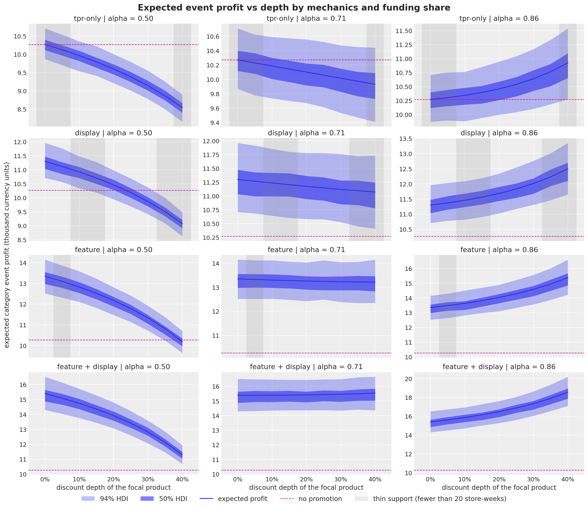</p>
</figure>


At the nominal share every curve falls with depth. At \tilde\alpha the feature and feature-with-display curves are flat, while the shelf-tag and display curves still fall a little (by about 0.3 and 0.2 thousand between no cut and a 40\\ cut). At \tilde\alpha + 0.15 every curve rises. In the following plot we quantify the first two columns: per mechanics and share, the posterior probability that no promotion or the shallowest cell is the best choice, and the probability that the deepest cell is.


    In [90]:


``` python
optimal_rows = []

for mechanics_name in MECHANICS:
    for alpha_value, alpha_name in ((0.5, "nominal share 0.5"), (alpha_tilde, "alpha tilde")):
        curve = profit_curve(mechanics_name, alpha_value)
        choice_set = np.concatenate([baseline_mu[:, None], curve], axis=1)
        best = choice_set.argmax(axis=1)
        optimal_rows.append(
            {
                "mechanics": mechanics_name,
                "funding share": alpha_name,
                "best cell": "no promotion or shallowest",
                "probability": float(np.isin(best, [0, 1]).mean()),
            }
        )
        optimal_rows.append(
            {
                "mechanics": mechanics_name,
                "funding share": alpha_name,
                "best cell": "deepest",
                "probability": float(np.mean(best == choice_set.shape[1] - 1)),
            }
        )

optimal_table = pl.DataFrame(optimal_rows)
grid = sns.catplot(
    data=optimal_table.to_dict(as_series=False),
    x="mechanics",
    y="probability",
    hue="best cell",
    col="funding share",
    kind="bar",
    order=list(MECHANICS),
    height=4.5,
    aspect=1.5,
)
grid.set_titles("{col_name}")
grid.set_axis_labels("", "posterior probability")

for ax in grid.axes.flat:
    ax.tick_params(axis="x", rotation=15)
    ax.margins(y=0.15)

    for container in ax.containers:
        ax.bar_label(container, fmt="{:.2f}")

grid.figure.suptitle(
    "Which depth is best? Probability of the two corners", fontsize=16, fontweight="bold", y=1.03
);
```


<figure class="figure">
<p>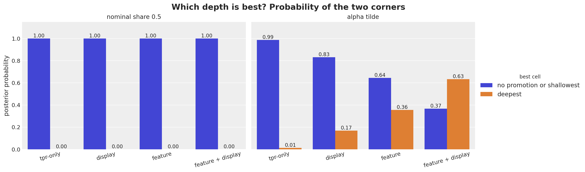</p>
</figure>


At the nominal share the probability that no promotion or the shallowest cell is optimal is 1.00 for all four mechanics. At \tilde\alpha the deepest cell is optimal in 63\\ of the draws for feature with display, so the depth decision is a corner at the nominal share and a toss-up near the break-even share.

The last figure of this subsection answers a different question: not whether a deeper cut pays against a shallower one, but whether an event pays against no promotion at all. In the following forest plot we show the event-level share \alpha^{\text{ev}} of a 5\\, a 15\\ and a 30\\ cut under each mechanics, with the posterior probability that the cell beats no promotion when the retailer funds the whole cut in the row label.


    In [91]:


``` python
a_baseline, _ = profit_parts(event_units_mu[BASELINE], 0.0)
event_share_draws: dict[tuple[str, float], np.ndarray] = {}
event_share_labels = []
event_depths = (0.05, 0.15, 0.30)

for mechanics_name in MECHANICS:
    for d in event_depths:
        a_policy, b_policy = profit_parts(event_units_mu[(mechanics_name, d)], d)
        incremental_at_zero = a_policy - a_baseline
        event_share_draws[(mechanics_name, d)] = -incremental_at_zero / b_policy
        event_share_labels.append(
            f"{mechanics_name} at {d:.0%}: {hdi_text(event_share_draws[(mechanics_name, d)])} "
            f"| P(beats no promotion unfunded) {np.mean(incremental_at_zero > 0):.2f}"
        )

event_share_stack = np.stack(
    [event_share_draws[(m, d)] for m in MECHANICS for d in event_depths], axis=1
)
ax = forest_plot(
    draws_dataset("share", event_share_stack, "row", event_share_labels),
    ["share"],
    ["row"],
    figsize=(14.0, 6.5),
)
ax.axvline(1.0, color="gray", linestyle=":", linewidth=1)
ax.set(xlabel="event-level funding share (below 0: pays unfunded; above 1: never pays)")
ax.figure.suptitle(
    "Funding share at which an event breaks even against no promotion",
    fontsize=16,
    fontweight="bold",
);
```


<figure class="figure">
<p>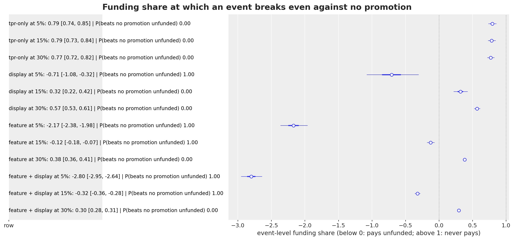</p>
</figure>


A feature-with-display event at a 15\\ cut beats no promotion even if the retailer funds the whole cut (event-level share -0.32), and so does a feature alone (-0.12). The mechanics uplift carries both, not the cut: against the same mechanics at base price the cut itself needs the category secant of the break-even figure (0.71 at zone level), and the store-by-store subsection below returns to this decision. The same cut under a shelf tag needs a share of 0.79, and a 30\\ cut under feature with display needs 0.30.


## The break-even cost of a feature or display slot

A feature or a display uses a slot in the circular or on the floor, and the data contain no price for it. So we solve for the price: the break-even slot cost of a mechanics at a depth is the incremental gross event profit it adds over a shelf-tag-only cut of the same depth, divided by the number of store-weeks it occupies. At zero depth the comparison is against no promotion at all, a pure mechanics uplift. In the following forest plot we show these break-even slot costs at three depths and at the nominal and the break-even funding share, with the median and the 94\\ HDI in the row labels.


    In [92]:


``` python
slot_mechanics = ["display", "feature", "feature + display"]
slot_depths = (0.0, 0.15, 0.30)
slot_shares = (0.5, alpha_tilde)
share_names = {alpha_value: f"funding share {alpha_value:.2f}" for alpha_value in slot_shares}
slot_draws: dict[tuple[str, float, float], np.ndarray] = {}

for mechanics_name in slot_mechanics:
    for d in slot_depths:
        for alpha_value in slot_shares:
            with_mechanics = event_profit(event_units_mu[(mechanics_name, d)], d, alpha_value)
            reference = (
                baseline_mu
                if d == 0.0
                else event_profit(event_units_mu[("tpr-only", d)], d, alpha_value)
            )
            slot_draws[(mechanics_name, d, alpha_value)] = (with_mechanics - reference) / (
                N_EVENT_WEEKS * n_stores
            )

slot_labels = [
    f"{m} at {d:.0%} | alpha {a:.2f}: {hdi_text(slot_draws[(m, d, a)], digits=0)}"
    for m in slot_mechanics
    for d in slot_depths
    for a in slot_shares
]
slot_stack = np.stack(
    [slot_draws[(m, d, a)] for m in slot_mechanics for d in slot_depths for a in slot_shares],
    axis=1,
)
ax = forest_plot(
    draws_dataset("slot", slot_stack, "row", slot_labels), ["slot"], ["row"], figsize=(13.0, 8.0)
)
ax.set(xlabel="currency units per store-week")
ax.figure.suptitle(
    "Break-even slot cost (incremental gross profit over a shelf-tag cut of the same depth)",
    fontsize=16,
    fontweight="bold",
);
```


<figure class="figure">
<p>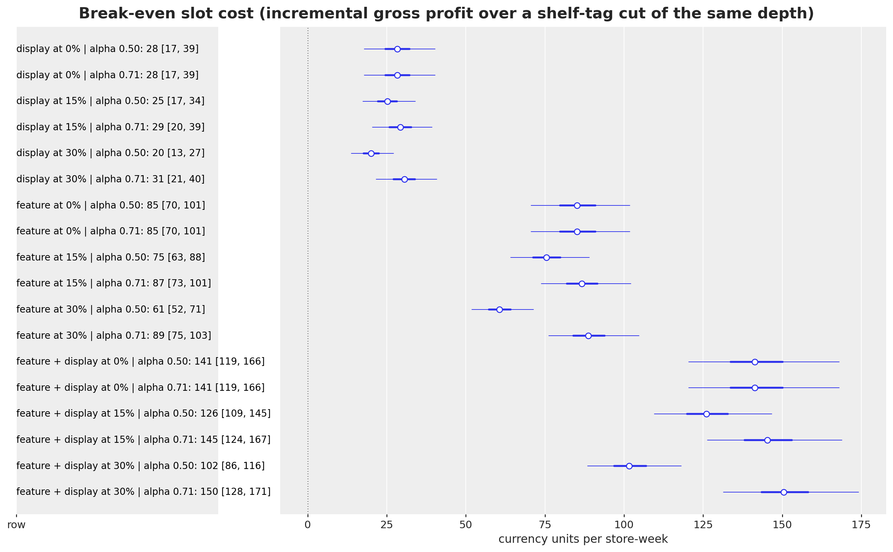</p>
</figure>


At a 15\\ cut and the break-even share, a display is worth 29 currency units per store-week over the same cut with a shelf tag alone (94\\ HDI 20 to 39), a feature 87 (73 to 101) and the pair 145 (124 to 167). At the nominal share the same values are lower, because the margin lost on the extra units counts against the slot.

In the following plot we assume a cost per slot and store-week, the same for a feature and for a display (the pair costs twice as much), and show the posterior probability that each option is the best choice over the whole grid as that cost rises, at both funding shares.


    In [93]:


``` python
SLOT_LADDER = [0.0, 25.0, 50.0, 75.0, 100.0, 150.0]
slots_used = {"tpr-only": 0.0, "display": 1.0, "feature": 1.0, "feature + display": 2.0}
choice_options = ["no promotion", *MECHANICS]
choice_rows = []

for alpha_value in slot_shares:
    for slot_cost in SLOT_LADDER:
        stacks, names = [baseline_mu], ["no promotion"]

        for mechanics_name in MECHANICS:
            curve = (
                profit_curve(mechanics_name, alpha_value)
                - N_EVENT_WEEKS * n_stores * slots_used[mechanics_name] * slot_cost
            )
            stacks.append(curve)
            names.extend([mechanics_name] * len(DEPTH_GRID))

        choice_set = np.concatenate([stacks[0][:, None], *stacks[1:]], axis=1)
        best_names = np.asarray(names)[choice_set.argmax(axis=1)]

        for name in choice_options:
            choice_rows.append(
                {
                    "funding share": share_names[alpha_value],
                    "cost per slot": slot_cost,
                    "option": name,
                    "probability": float(np.mean(best_names == name)),
                }
            )

choice_table = pl.DataFrame(choice_rows)

fig, axes = plt.subplots(ncols=2, figsize=(15, 5.5), sharey=True, layout="constrained")

for ax, alpha_value in zip(axes, slot_shares, strict=True):
    subset = choice_table.filter(pl.col("funding share").eq(pl.lit(share_names[alpha_value])))
    sns.lineplot(
        data=subset.to_dict(as_series=False),
        x="cost per slot",
        y="probability",
        hue="option",
        hue_order=choice_options,
        marker="o",
        linewidth=2,
        ax=ax,
    )

    for slot_cost in SLOT_LADDER:
        best = (
            subset.filter(pl.col("cost per slot").eq(pl.lit(slot_cost)))
            .sort("probability", descending=True)
            .row(0, named=True)
        )
        ax.annotate(
            f"{best['probability']:.2f}",
            (slot_cost, best["probability"]),
            textcoords="offset points",
            xytext=(0, 8),
            ha="center",
        )

    ax.set(xlabel="cost per slot and store-week", title=share_names[alpha_value])

handles, labels = axes[0].get_legend_handles_labels()

for ax in axes:
    ax.get_legend().remove()

fig.legend(handles, labels, loc="outside lower center", ncols=5)
axes[0].set(ylabel="P(option is the best choice)")
fig.suptitle("Which mechanics is best as the slot cost rises", fontsize=16, fontweight="bold");
```


<figure class="figure">
<p>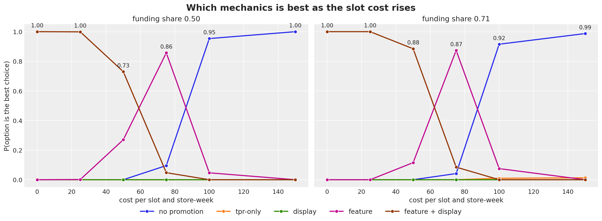</p>
</figure>


With slots at 25 per store-week, feature with display is the best choice with probability 1.00 at both shares. At 50 it keeps a probability of 0.73 at the nominal share and 0.88 at the break-even share, against a feature alone. At 75 the feature alone wins with probability 0.86 and 0.87; at 100 no promotion wins with probability 0.95 and 0.92. The mechanics decision therefore depends on a number the data do not contain, and the figure tells the category manager at which slot cost the answer changes.


## Store-by-store decisions

The zone-level shares above pool the 18 stores. The model has no cross-store terms, so the same break-even shares can be computed per store, and the per-store decisions are separable. This matters because the funding share is negotiated once, but the decision to add the cut can be taken store by store. In the following forest plot we show the per-store category break-even share under feature with display against the nominal share and the zone-level \tilde\alpha, with the stores ordered by their number of identifying weeks and the brand-only and category medians in the row labels.


    In [94]:


``` python
policy_shallow, policy_deeper = ("feature + display", 0.0), ("feature + display", 0.05)
a_shallow_s, b_shallow_s = profit_parts_by_store(event_units_mu[policy_shallow], 0.0)
a_deeper_s, b_deeper_s = profit_parts_by_store(event_units_mu[policy_deeper], 0.05)
store_share_cat = (a_shallow_s - a_deeper_s) / (b_deeper_s - b_shallow_s)
a_shallow_b, b_shallow_b = profit_parts_by_store(
    event_units_mu[policy_shallow], 0.0, brand_only=True
)
a_deeper_b, b_deeper_b = profit_parts_by_store(
    event_units_mu[policy_deeper], 0.05, brand_only=True
)
store_share_brand = (a_shallow_b - a_deeper_b) / (b_deeper_b - b_shallow_b)
eps_store_fd = eps_store_draws - feature_depth_draws[:, None] - display_depth_draws[:, None]
store_share_labels = [
    f"{label}: brand-only {np.median(store_share_brand[:, j]):.2f}, "
    f"category {np.median(store_share_cat[:, j]):.2f}"
    for j, label in zip(store_order, store_labels_ordered, strict=True)
]
ax = forest_plot(
    draws_dataset("share", store_share_cat[:, store_order], "store", store_share_labels),
    ["share"],
    ["store"],
    figsize=(13.0, 8.0),
    reference_line=1.0,
)
ax.axvline(0.5, color="gray", linestyle=":", linewidth=1.5, label="nominal share 0.5")
ax.axvline(alpha_tilde, color="C3", linestyle="--", linewidth=1.5, label="zone-level alpha tilde")
ax.legend(loc="upper left", bbox_to_anchor=(1.01, 1.0))
ax.set(xlabel="category break-even funding share", xlim=(0.0, 1.2))
ax.figure.suptitle(
    "Break-even funding share per store (feature + display)", fontsize=16, fontweight="bold"
);
```


<figure class="figure">
<p>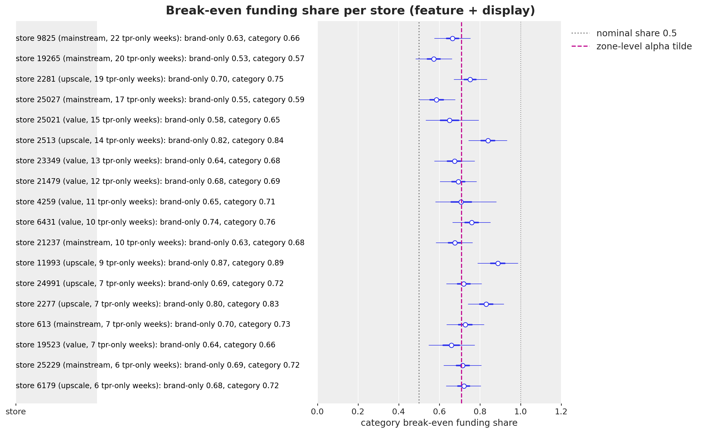</p>
</figure>


The next cell counts, at both shares, the stores in which the cut pays with posterior probability above one half (the mechanics-specific elasticity below the threshold).


    In [95]:


``` python
cut_pays = {
    alpha_value: np.mean(eps_store_fd < -(1.0 - alpha_value) / G_FOCAL, axis=0)
    for alpha_value in slot_shares
}

for alpha_value, probabilities in cut_pays.items():
    print(
        f"{share_names[alpha_value]}: P(the cut pays) above 0.5 in {np.sum(probabilities > 0.5)} "
        f"of {n_stores} stores (range {probabilities.min():.2f} to {probabilities.max():.2f})"
    )
```


    funding share 0.50: P(the cut pays) above 0.5 in 0 of 18 stores (range 0.00 to 0.35)
    funding share 0.71: P(the cut pays) above 0.5 in 14 of 18 stores (range 0.00 to 1.00)


The store-level break-even shares (brand-only medians from 0.53 to 0.87, category medians from 0.57 to 0.89) line up by segment more than by the number of identifying weeks, and their 94\\ HDIs are about twice as wide as the zone-level one. At the nominal share the cut pays with probability above one half in no store; at the break-even share in 14 of the 18, with the per-store probabilities ranging from 0.00 to 1.00. Where the intervals are wide, the store's decision is uncertain, and it is the partial pooling of the store-level elasticities that keeps them from being prior-dominated.


## Go or no-go: the downside risk

Expected profit is not the whole decision: a category manager also wants to know how bad the promotion can turn out. The incremental profit of a policy against no promotion, \Delta\Pi_r(a) = \Pi_r(a) - \Pi_r(a_0), is computed here on the sampled event paths, so it carries the demand noise as well as the parameter and level-path uncertainty, draw by draw under common random numbers (the same posterior draw, the same level path, coupled demand draws). That coupling is an assumption the data cannot identify: the potential outcomes of the same week under two policies are never observed together. We summarize the downside with the conditional value at risk at the 10\\ level, \text{CVaR}\_{0.10}, the mean of the worst tenth of the draws ([Rockafellar and Uryasev, 2000](https://doi.org/10.21314/JOR.2000.038)), and report two standard errors of it: an iid bootstrap over the draws, and the spread of the per-chain values, which also reflects the autocorrelation of the chains. The next cell defines the four helpers.


    In [96]:


``` python
def incremental_paths(
    policy: tuple[str, float], alpha_value: float
) -> Float[np.ndarray, " sample"]:
    """Compute the incremental event profit of a policy over no promotion on the sampled paths."""
    return event_profit(event_units_paths[policy], policy[1], alpha_value) - event_profit(
        event_units_paths[BASELINE], 0.0, alpha_value
    )


def cvar(draws: Float[np.ndarray, " sample"], level: float = 0.10) -> float:
    """Average the lowest ``level`` share of the draws."""
    ordered = np.sort(draws)
    return float(ordered[: max(1, int(np.floor(level * ordered.size)))].mean())


def cvar_bootstrap_se(
    draws: Float[np.ndarray, " sample"], level: float = 0.10, n_boot: int = 2_000
) -> float:
    """Estimate the standard error of the CVaR with an iid bootstrap over the draws."""
    boot_rng = np.random.default_rng(seed=0)
    resampled = boot_rng.choice(draws, size=(n_boot, draws.size), replace=True)
    lowest = np.sort(resampled, axis=1)[:, : max(1, int(np.floor(level * draws.size)))]
    return float(lowest.mean(axis=1).std(ddof=1))


def cvar_chain_se(draws: Float[np.ndarray, " sample"], level: float = 0.10) -> float:
    """Estimate the standard error of the CVaR from the spread of the per-chain values."""
    # ``mcmc.get_samples()`` flattens the chains chain-major and ``Predictive`` keeps the
    # order, so consecutive blocks of the flat draws are the chains.
    per_chain = np.array([cvar(chain, level) for chain in draws.reshape(N_CHAINS, -1)])
    return float(per_chain.std(ddof=1) / np.sqrt(N_CHAINS))
```


The next cell computes the expected increment, the probability of a loss and the CVaR of every policy of the grid at \tilde\alpha, and prints the three policies with the highest expected increment with both standard errors of their CVaR.


    In [97]:


``` python
risk_rows = []

for policy in policies:
    if policy == BASELINE:
        continue
    delta = incremental_paths(policy, alpha_tilde)
    risk_rows.append(
        {
            "mechanics": policy[0],
            "depth": policy[1],
            "expected_increment": float(delta.mean()),
            "P(loss)": float(np.mean(delta < 0)),
            "cvar_10": cvar(delta),
        }
    )

risk_table = pl.DataFrame(risk_rows).sort("expected_increment", descending=True)
top_policies = [
    (row["mechanics"], row["depth"]) for row in risk_table.head(3).iter_rows(named=True)
]

for policy in top_policies:
    delta = incremental_paths(policy, alpha_tilde)

    print(
        f"{policy[0]} at {policy[1]:.0%}: expected increment {delta.mean():,.0f}, CVaR10 "
        f"{cvar(delta):,.0f} (bootstrap se {cvar_bootstrap_se(delta):.0f}, between-chain se "
        f"{cvar_chain_se(delta):.0f})"
    )
```


    feature + display at 40%: expected increment 5,260, CVaR10 4,366 (bootstrap se 14, between-chain se 10)
    feature + display at 35%: expected increment 5,215, CVaR10 4,378 (bootstrap se 13, between-chain se 8)
    feature + display at 30%: expected increment 5,180, CVaR10 4,375 (bootstrap se 12, between-chain se 8)


The three deepest feature-with-display cells have the highest expected increments, 5{,}260 for the deepest, and \text{CVaR}\_{0.10} values of 4{,}366 to 4{,}378 with standard errors of 8 to 14, so the risk measure does not separate them either; the earlier figure gave the deepest cell a 63\\ chance of being the best cell.

The common random numbers are an assumption, so the next cell computes a sensitivity: the CVaR of the committed policy against a baseline whose level path and demand noise are redrawn under a different key while the parameters are shared.


    In [98]:


``` python
committed = ("feature + display", 0.15)
rng_key, key_alt = random.split(rng_key)
out_alt = scenario_draws(
    key_alt, nuts_model, posterior, y_train, policy_covariates(0.0, *MECHANICS["tpr-only"])
)
baseline_alt_units = np.asarray(out_alt["forecast"], dtype=np.float32)[:, EVENT_OFFSETS, :].sum(
    axis=1
)
delta_common = incremental_paths(committed, alpha_tilde)
delta_alt = event_profit(event_units_paths[committed], committed[1], alpha_tilde) - event_profit(
    baseline_alt_units, 0.0, alpha_tilde
)

print(
    f"{committed[0]} at {committed[1]:.0%}: CVaR10 {cvar(delta_common):,.0f} under common random "
    f"numbers (P(loss) {np.mean(delta_common < 0):.2f}), {cvar(delta_alt):,.0f} with a redrawn "
    f"baseline (P(loss) {np.mean(delta_alt < 0):.2f})"
)
```


    feature + display at 15%: CVaR10 4,343 under common random numbers (P(loss) 0.00), 3,953 with a redrawn baseline (P(loss) 0.00)


The coupling matters for the downside number: the committed policy has a \text{CVaR}\_{0.10} of 4{,}343 under common random numbers and 3{,}953 with a redrawn baseline, a difference the data cannot arbitrate. In the following plot we add the slot cost to the committed policy and show the probability of loss and the CVaR along the slot-cost ladder, at both funding shares.


    In [99]:


``` python
go_rows = []

for slot_cost in SLOT_LADDER:
    total_slot_cost = N_EVENT_WEEKS * n_stores * slots_used[committed[0]] * slot_cost

    for alpha_value in slot_shares:
        delta = incremental_paths(committed, alpha_value) - total_slot_cost
        go_rows.append(
            {
                "cost per slot": slot_cost,
                "funding share": share_names[alpha_value],
                "P(loss)": float(np.mean(delta < 0)),
                "CVaR10 (thousand)": cvar(delta) / 1_000.0,
            }
        )

go_table = pl.DataFrame(go_rows)

fig, axes = plt.subplots(ncols=2, figsize=(15, 5.5), layout="constrained")

for ax, column in zip(axes, ["P(loss)", "CVaR10 (thousand)"], strict=True):
    sns.lineplot(
        data=go_table.to_dict(as_series=False),
        x="cost per slot",
        y=column,
        hue="funding share",
        marker="o",
        linewidth=2,
        ax=ax,
    )
    ax.set(xlabel="cost per slot and store-week")

for point in go_table.iter_rows(named=True):
    axes[0].annotate(
        f"{point['P(loss)']:.2f}",
        (point["cost per slot"], point["P(loss)"]),
        textcoords="offset points",
        xytext=(0, 8),
        ha="center",
    )

axes[1].axhline(0.0, color="black", linewidth=1)
axes[0].set(ylim=(-0.05, 1.1))
handles, labels = axes[0].get_legend_handles_labels()

for ax in axes:
    ax.get_legend().remove()

fig.legend(handles, labels, loc="outside lower center", ncols=2)
fig.suptitle(
    f"Go or no-go for {committed[0]} at {committed[1]:.0%} as the slot cost rises",
    fontsize=16,
    fontweight="bold",
);
```


<figure class="figure">
<p>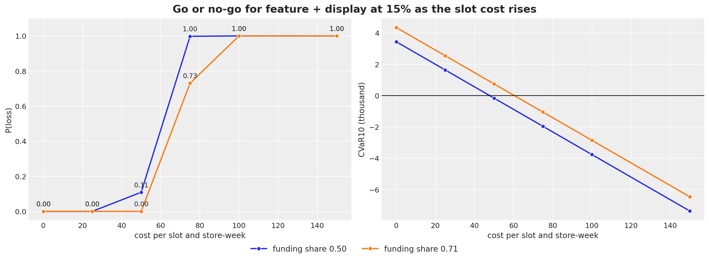</p>
</figure>


With slots at 25 per store-week the committed event still has a probability of loss of 0.00 at both shares; at 50 the probability is 0.11 at the nominal share and 0.00 at the break-even share; at 75 it is 1.00 and 0.73. The go turns into a no-go between 50 and 75 per slot and store-week. In the following plot we show the histograms of the incremental profit of the top three policies, and the expected increment against the CVaR of every policy of the grid.


    In [100]:


``` python
fig, axes = plt.subplots(ncols=2, figsize=(16, 6), layout="constrained")

for policy, color in zip(top_policies, ("C0", "C1", "C2"), strict=True):
    delta = incremental_paths(policy, alpha_tilde) / 1_000.0
    sns.histplot(
        delta, bins=60, color=color, alpha=0.5, label=f"{policy[0]} at {policy[1]:.0%}", ax=axes[0]
    )
    axes[0].axvline(cvar(delta), color=color, linestyle="--", linewidth=1)

axes[0].axvline(0.0, color="black", linewidth=1, label="no promotion")
axes[0].margins(y=0.3)
axes[0].set(
    xlabel="incremental event profit (thousand currency units)",
    ylabel="draws",
    title="Incremental profit of the top three policies (dashed: CVaR10)",
)

for mechanics_name in MECHANICS:
    subset = risk_table.filter(pl.col("mechanics").eq(pl.lit(mechanics_name)))
    axes[1].scatter(
        subset["expected_increment"].to_numpy() / 1_000.0,
        subset["cvar_10"].to_numpy() / 1_000.0,
        s=30 + 200 * subset["depth"].to_numpy(),
        alpha=0.8,
        label=mechanics_name,
    )

feasible = risk_table.filter(pl.col("cvar_10").ge(pl.lit(0)))
best_unconstrained = risk_table.row(0, named=True)
best_feasible = feasible.sort("expected_increment", descending=True).row(0, named=True)
axes[1].axhline(0.0, color="black", linewidth=1)
axes[1].axhspan(
    0.0,
    max(0.1, float(risk_table["cvar_10"].to_numpy().max()) / 1_000.0 * 1.2),
    color="C2",
    alpha=0.08,
    label="CVaR10 >= 0",
)
axes[1].scatter(
    best_unconstrained["expected_increment"] / 1_000.0,
    best_unconstrained["cvar_10"] / 1_000.0,
    marker="*",
    s=300,
    color="black",
    label=(
        f"highest expected increment: {best_unconstrained['mechanics']} "
        f"at {best_unconstrained['depth']:.0%}"
    ),
)
axes[1].scatter(
    best_feasible["expected_increment"] / 1_000.0,
    best_feasible["cvar_10"] / 1_000.0,
    marker="D",
    s=120,
    facecolor="none",
    edgecolor="black",
    linewidth=2,
    label=f"best with CVaR10 >= 0: {best_feasible['mechanics']} at {best_feasible['depth']:.0%}",
)
axes[1].set(
    xlabel="expected incremental profit (thousand)",
    ylabel="CVaR10 of the increment (thousand)",
    title="Expected increment vs downside per policy (dot size: depth)",
)
hist_handles, hist_labels = axes[0].get_legend_handles_labels()
risk_handles, risk_labels = axes[1].get_legend_handles_labels()
fig.legend(
    hist_handles + risk_handles, hist_labels + risk_labels, loc="outside lower center", ncols=3
)
fig.suptitle(
    f"Risk of the promotion at a funding share of {alpha_tilde:.2f}",
    fontsize=16,
    fontweight="bold",
);
```


<figure class="figure">
<p>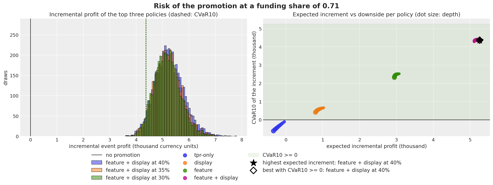</p>
</figure>


The histograms of the three deepest feature-with-display cells overlap almost completely, and the scatter shows the shelf-tag cuts as the only policies with a negative downside: every policy with a feature or a display has a positive \text{CVaR}\_{0.10}, so at a zero slot cost the go/no-go is a go for all of them at the break-even share.


## Point-estimate planners against the posterior

For the depth decision, a comparison with a point forecast is trivial: profit is linear in units, so a planner that replaces the random units by their expectation ranks every policy exactly as the posterior does, and the value of the stochastic solution for the pricing lever alone is zero, by construction. The comparison that matters is with planners that use point estimates of the parameters:

| planner | inputs | what it ignores | comparison shown |
|----|----|----|----|
| expected value | posterior expected units | the spread of the units | nothing to show: identical ranking |
| posterior-mean plug-in | parameters at their posterior means | Jensen's gap between \text{E}\[(1-d)^{\varepsilon}\] and (1-d)^{\text{E}\[\varepsilon\]} | the ratio of the two, per depth |
| store least-squares plug-in | within-store least-squares elasticity, pooled least-squares mechanics multipliers | shrinkage across stores, the selection effect of choosing on noisy estimates | store-by-store decisions and the postdecision disappointment |
| posterior | the partially pooled posterior | nothing the model does not | store-by-store decisions |

The next cell computes the Jensen gap, which is small whenever the elasticity posterior is tight.


    In [101]:


``` python
eps_fd_zone = eps_m_draws("feature + display")
jensen_ratio = np.array(
    [
        float(np.mean((1.0 - d) ** eps_fd_zone)) / float((1.0 - d) ** np.mean(eps_fd_zone))
        for d in DEPTH_GRID[1:]
    ]
)

print(
    "Jensen ratio E[(1-d)^eps] / (1-d)^E[eps] across the depth grid: "
    f"at most {jensen_ratio.max():.3f}"
)
```


    Jensen ratio E[(1-d)^eps] / (1-d)^E[eps] across the depth grid: at most 1.002


The Jensen ratio is at most 1.002 across the grid, so the posterior-mean plug-in and the posterior planner agree.

The store least-squares planner is the one that differs from the posterior. It faces two store-level decisions about the committed event, feature with display at 15\\: whether to run the event at all against no promotion, and whether to add the cut against the same mechanics at base price. It decides each with the store's own within-store elasticity (the specification with flags, plus the focal product's least-squares depth slopes), the focal product's least-squares mechanics multipliers and the least-squares cross terms, applied to the same reference units and margins as the posterior planner. Both plans are evaluated under the posterior, which is the evaluation measure: the posterior planner is optimal under it by construction, so the gap measures what the unpooled point estimates cost. The disappointment of the least-squares plan is the gain it predicts for its chosen stores minus the gain the posterior expects for them, the postdecision surprise of [Smith and Winkler (2006)](https://doi.org/10.1287/mnsc.1050.0451). The helper of the next cell predicts the event units of the committed policy with the least-squares planner.


    In [102]:


``` python
cross_on_focal = {
    row["units of"]: float(row[f"price of {FOCAL}"]) for row in cross_ols.iter_rows(named=True)
}
ls_eps_store = {
    store: float(store_ols[j] - hnc_ols_terms["feature_lam"] - hnc_ols_terms["display_lam"])
    for j, store in enumerate(hnc_store_ids)
}
committed_depth = committed[1]


def least_squares_units(
    reference_units: Float[np.ndarray, " n_series"], add_mechanics: bool
) -> Float[np.ndarray, " n_series"]:
    """Predict the event units of the committed policy with the store least-squares planner."""
    units = np.empty(n_series)

    for n in range(n_series):
        store, product = series_ids[n].split("::")
        if product == FOCAL:
            uplift = (
                np.exp(
                    hnc_ols_terms["feature"]
                    + hnc_ols_terms["display"]
                    + hnc_ols_terms["feature_display"]
                )
                if add_mechanics
                else 1.0
            )
            units[n] = (
                reference_units[n] * (1.0 - committed_depth) ** ls_eps_store[int(store)] * uplift
            )
        else:
            uplift = (
                np.exp(hnc_ols_terms["sib_feature"] + hnc_ols_terms["sib_display"])
                if add_mechanics
                else 1.0
            )
            units[n] = (
                reference_units[n] * (1.0 - committed_depth) ** cross_on_focal[product] * uplift
            )

    return units
```


The next cell takes both decisions with both planners at both funding shares, plots the number of stores each planner chooses, and prints the value of each plan under the posterior and the disappointment of the least-squares plan.


    In [103]:


``` python
a_committed_s, b_committed_s = profit_parts_by_store(event_units_mu[committed], committed_depth)
planner_rows = []
planner_scatter = []

for decision_label, reference_policy, add_mechanics in [
    ("run the event vs no promotion", BASELINE, True),
    ("add the cut vs the mechanics at base price", (committed[0], 0.0), False),
]:
    reference_units_mean = event_units_mu[reference_policy].mean(axis=0)
    ls_units = least_squares_units(reference_units_mean, add_mechanics)
    a_reference_s, _ = profit_parts_by_store(event_units_mu[reference_policy], 0.0)
    a_ls, b_ls = profit_parts_by_store(ls_units[None, :], committed_depth)
    a_ls_reference, _ = profit_parts_by_store(reference_units_mean[None, :], 0.0)

    for alpha_value in slot_shares:
        posterior_gain = (a_committed_s + alpha_value * b_committed_s - a_reference_s).mean(
            axis=0
        )  # (n_stores,)
        predicted_gain = (a_ls + alpha_value * b_ls - a_ls_reference)[0]
        choose_ls, choose_bayes = predicted_gain > 0, posterior_gain > 0

        for planner, chosen in (("least squares", choose_ls), ("posterior", choose_bayes)):
            planner_rows.append(
                {
                    "decision": decision_label,
                    "funding share": share_names[alpha_value],
                    "planner": planner,
                    "stores chosen": int(chosen.sum()),
                    "value under the posterior": float((chosen * posterior_gain).sum()),
                }
            )

        print(
            f"{decision_label} at {share_names[alpha_value]}: least squares chooses "
            f"{choose_ls.sum()} stores (plan value {(choose_ls * posterior_gain).sum():,.0f}, "
            f"disappointment {(choose_ls * (predicted_gain - posterior_gain)).sum():,.0f}), "
            f"the posterior {choose_bayes.sum()} (plan value "
            f"{(choose_bayes * posterior_gain).sum():,.0f})"
        )

        if not add_mechanics:
            planner_scatter += [
                {
                    "funding share": share_names[alpha_value],
                    "predicted gain": float(predicted),
                    "posterior gain": float(expected),
                }
                for predicted, expected in zip(predicted_gain, posterior_gain, strict=True)
            ]

planner_table = pl.DataFrame(planner_rows)
grid = sns.catplot(
    data=planner_table.to_dict(as_series=False),
    x="decision",
    y="stores chosen",
    hue="planner",
    col="funding share",
    kind="bar",
    height=4.5,
    aspect=1.4,
)
grid.set_titles("{col_name}")
grid.set_axis_labels("", "stores chosen (of 18)")

for ax in grid.axes.flat:
    ax.tick_params(axis="x", rotation=10)
    ax.margins(y=0.15)

    for container in ax.containers:
        ax.bar_label(container)

grid.figure.suptitle(
    "Stores chosen by the store least-squares planner and by the posterior",
    fontsize=16,
    fontweight="bold",
    y=1.03,
);
```


    run the event vs no promotion at funding share 0.50: least squares chooses 18 stores (plan value 4,083, disappointment -724), the posterior 18 (plan value 4,083)
    run the event vs no promotion at funding share 0.71: least squares chooses 18 stores (plan value 5,130, disappointment -703), the posterior 18 (plan value 5,130)
    add the cut vs the mechanics at base price at funding share 0.50: least squares chooses 3 stores (plan value -109, disappointment 222), the posterior 0 (plan value 0)
    add the cut vs the mechanics at base price at funding share 0.71: least squares chooses 18 stores (plan value 10, disappointment 862), the posterior 9 (plan value 162)


<figure class="figure">
<p>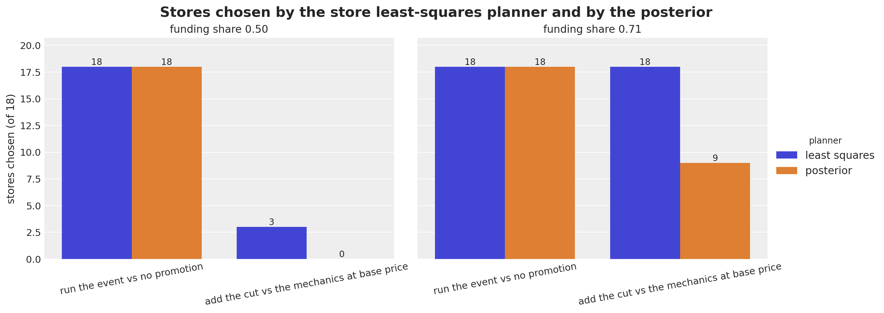</p>
</figure>


For the decision to run the event, both planners choose all 18 stores at both shares; the least-squares planner's disappointment is negative (-724 and -703), because its own mechanics multipliers under-predict the uplift the posterior expects. For the decision to add the cut at the nominal share, the posterior planner adds it in no store and the least-squares planner in 3; that plan is worth -109 under the posterior, a disappointment of 222. At the break-even share the least-squares planner adds the cut in all 18 stores and the posterior planner in 9; the least-squares plan is worth 10 under the posterior against 162 for the posterior plan, and the disappointment is 862. In the following plot we show, per store, the gain of the cut predicted by the least-squares planner against the gain the posterior expects.


    In [104]:


``` python
planner_frame = pl.DataFrame(planner_scatter)

fig, axes = plt.subplots(ncols=2, figsize=(15, 6.5), layout="constrained")

for ax, alpha_value in zip(axes, slot_shares, strict=True):
    subset = planner_frame.filter(pl.col("funding share").eq(pl.lit(share_names[alpha_value])))
    sns.scatterplot(
        data=subset.to_dict(as_series=False),
        x="predicted gain",
        y="posterior gain",
        color="C0",
        s=60,
        label="store",
        ax=ax,
    )
    limit = float(max(subset["predicted gain"].abs().max(), subset["posterior gain"].abs().max()))
    limit *= 1.1
    ax.plot([-limit, limit], [-limit, limit], color="gray", linestyle=":", label="identity")
    ax.axhline(0.0, color="black", linewidth=1)
    ax.axvline(0.0, color="black", linewidth=1)
    ax.get_legend().remove()
    ax.set(
        xlabel="gain of the cut predicted by the store least-squares planner",
        ylabel="gain of the cut evaluated under the posterior",
        title=share_names[alpha_value],
    )

fig.legend(*ax.get_legend_handles_labels(), loc="outside lower center", ncols=2)
fig.suptitle(
    f"Store least-squares planner vs posterior: add the {committed[1]:.0%} cut to {committed[0]}",
    fontsize=16,
    fontweight="bold",
);
```


<figure class="figure">
<p>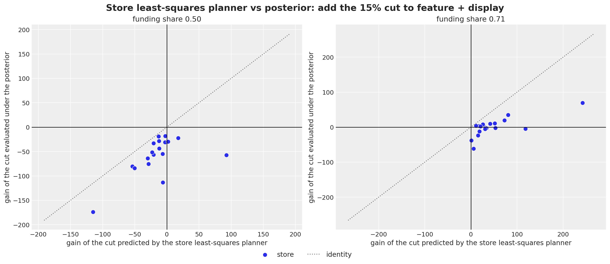</p>
</figure>


At the break-even share nearly every store is on or below the identity line, and the store with the largest predicted gain keeps a small part of it. The stores with the most extreme least-squares elasticities are the ones the planner picks, and they are the ones whose estimates the posterior shrinks the most.


## How much to order: the newsvendor problem

This is the third business question. The order belongs to the replenishment planner, who takes the promotion as committed: feature with display at a 15\\ cut, the grid cell nearest the realized Thanksgiving event, under the nominal funding share of 0.5. The question is a newsvendor problem: one order per store for the two event weeks, an underage cost for every unit short and an overage cost for every unit left over. What the posterior adds is the joint distribution of the two event weeks, which a per-week forecast does not have.


### Event demand, costs and the critical fractile

Every quantity here is per store; the totals sum the 18 stores. Let y\_{r,t,\text{H}} be the sampled units of the focal product in one store in event week t under the committed policy, in draw r. One order covers both event weeks with no mid-event replenishment, so the demand the order faces is the two-week sum of the same sampled path, which keeps the correlation between the weeks:

 W_r = \sum\_{t \in E} y\_{r,t,\text{H}}. 

A unit short loses the margin it would have earned. The underage cost is the promo-week unit margin at the committed depth and the nominal share, because the allowance is earned only on units sold:

 c_u = m\_{\text{H},s}(0.15) = p\_{\text{H},s}\\ \big(g\_{\text{H}} - 0.5 \times 0.15\big). 

The true underage cost is a little lower, since part of the stockout demand is recovered at the private-label margin, so the fractile below is an upper bound and the order leans high. A unit left over is carried and sold later at the regular margin, because cereal is shelf-stable, so only the holding cost is lost. The overage cost is a holding share \eta of the unit cost, and a realistic \eta is small:

 c_o = \eta\\ c\_{\text{H},s}. 

The critical fractile is the service level that balances the two costs. Both costs scale with the base price, so it is the same in every store:

 \kappa = \frac{c_u}{c_u + c_o}. 

The newsvendor profit of an order Q against a demand W earns c_u on every unit sold and pays c_o on every unit left over, with (x)^+ = \max(x, 0):

 \text{prof}(Q; W) = c_u\\ \min(W, Q) - c_o\\ (Q - W)^+. 


### Three order rules

- The paths rule takes the \kappa-quantile of the joint event demand, the newsvendor optimum: Q^\star = \min\\Q : \text{P}(W \le Q) \ge \kappa\\.
- The marginal rule adds up per-week safety stocks, with q\_\kappa the per-week \kappa-quantile, and ignores the correlation between the weeks: Q\_{\text{marg}} = \sum\_{t \in E} q\_\kappa(y\_{t,\text{H}}).
- The mean rule orders the expected demand, which is what a point forecast delivers: Q\_{\text{mean}} = \text{E}\[W\].


### What the joint predictive is worth

The vocabulary follows [Birge and Louveaux (2011)](https://doi.org/10.1007/978-1-4614-0237-4), whose news vendor example of chapter 1 fixes it. Here \theta stands for the parameters and the level path of one draw, and every expectation is over the posterior predictive of W:

\begin{align\*} \text{RP} &= \max_Q \text{E}\[\text{prof}(Q; W)\], \\ \text{EEV} &= \text{E}\[\text{prof}(Q\_{\text{mean}}; W)\], \\ \text{VSS} &= \text{RP} - \text{EEV} \ge 0, \\ \text{WS} &= \text{E}\[c_u\\ W\], \\ \text{EVPI}\_W &= \text{WS} - \text{RP}, \\ \text{EVPI}\_\theta &= \text{E}\_\theta\big\[\max_Q \text{E}\[\text{prof}(Q; W) \mid \theta\]\big\] - \text{RP}. \end{align\*}

- \text{RP} is the recourse value, the expected profit of the optimal order Q^\star.
- \text{EEV} is the expected result of the mean order, and \text{VSS}, the value of the stochastic solution, is what the joint predictive earns over it.
- \text{WS} is the wait-and-see value, the profit of ordering after seeing the demand, so \text{EVPI}\_W is the value of perfect information about the demand: a loose ceiling, because it includes the irreducible demand noise, which no model removes.
- \text{EVPI}\_\theta is the tighter ceiling, the value of knowing the parameters and the level path, computed with inner negative binomial draws per posterior draw.

Two caveats. The inner order q\_\theta is chosen and evaluated on the same inner draws, so the value is optimistic in sample; a held-out version keeps the same q\_\theta but evaluates it, with RP, on fresh inner draws, and the gap between the two is the optimism. And RP, VSS and both ceilings are maxima on the evaluation draws, so we also compute a split-half VSS: the rule is chosen on one half of the draws and evaluated on the other. The next cell computes the event demand and the costs and defines the newsvendor profit and the three order rules.


    In [105]:


``` python
ALPHA_ORDER = 0.5
paths_committed = hnc_event_paths[committed]  # (draws, event weeks, stores)
event_demand = paths_committed.sum(axis=1)  # (draws, stores)
base_focal = base_price[hnc_series_index]
cost_focal = unit_cost[hnc_series_index]
c_u = base_focal * (G_FOCAL - (1.0 - ALPHA_ORDER) * committed_depth)
between_week_corr = np.array(
    [
        np.corrcoef(paths_committed[:, 0, j], paths_committed[:, 1, j])[0, 1]
        for j in range(n_stores)
    ]
)


def integer_quantile(
    draws: Float[np.ndarray, " sample k"], kappa: float
) -> Float[np.ndarray, " k"]:
    """Return the smallest integer order with ``P(W <= Q) >= kappa`` under the empirical draws."""
    return np.quantile(draws, kappa, axis=0, method="inverted_cdf")


def newsvendor_profit(
    order: Float[np.ndarray, " ... k"],
    demand: Float[np.ndarray, " ... k"],
    underage: Float[np.ndarray, " k"],
    overage: Float[np.ndarray, " k"],
) -> Float[np.ndarray, " ... k"]:
    """Compute the newsvendor profit of an order against demand draws (broadcast over axes)."""
    return underage * np.minimum(demand, order) - overage * np.maximum(order - demand, 0.0)


def order_rules(eta: float) -> dict[str, float | np.ndarray]:
    """Evaluate the three order rules at a holding share ``eta``.

    Returns the orders, RP, EEV, VSS (full and split-half), the marginal-rule loss,
    the wait-and-see ceiling, the fill rate and the expected leftover.
    """
    c_o = eta * cost_focal
    kappa = float((c_u / (c_u + c_o))[0])
    q_paths = integer_quantile(event_demand, kappa)
    q_marginal = integer_quantile(paths_committed[:, 0, :], kappa) + integer_quantile(
        paths_committed[:, 1, :], kappa
    )
    q_mean = np.rint(event_demand.mean(axis=0))
    rp = float(newsvendor_profit(q_paths, event_demand, c_u, c_o).mean(axis=0).sum())
    eev = float(newsvendor_profit(q_mean, event_demand, c_u, c_o).mean(axis=0).sum())
    marginal_value = float(
        newsvendor_profit(q_marginal, event_demand, c_u, c_o).mean(axis=0).sum()
    )
    ws = float((c_u * event_demand).mean(axis=0).sum())
    half = event_demand.shape[0] // 2
    q_half = integer_quantile(event_demand[:half], kappa)
    q_mean_half = np.rint(event_demand[:half].mean(axis=0))
    vss_split = float(
        newsvendor_profit(q_half, event_demand[half:], c_u, c_o).mean(axis=0).sum()
        - newsvendor_profit(q_mean_half, event_demand[half:], c_u, c_o).mean(axis=0).sum()
    )
    return {
        "eta": eta,
        "kappa": kappa,
        "q_paths": q_paths,
        "q_marginal": q_marginal,
        "q_mean": q_mean,
        "RP": rp,
        "EEV": eev,
        "VSS": rp - eev,
        "VSS_split_half": vss_split,
        "marginal_rule_loss": rp - marginal_value,
        "EVPI_W": ws - rp,
        "fill_rate": float(
            np.minimum(event_demand, q_paths).mean(axis=0).sum() / event_demand.mean(axis=0).sum()
        ),
        "expected_leftover": float(np.maximum(q_paths - event_demand, 0.0).mean(axis=0).sum()),
    }
```


The next cell evaluates the three rules at a holding share of 0.1 and prints the values the prose quotes.


    In [106]:


``` python
nominal_eta = 0.1
nominal = order_rules(nominal_eta)
rp = float(nominal["RP"])

print(
    f"holding share {nominal_eta}: underage cost {c_u.min():.2f} to {c_u.max():.2f} per unit, "
    f"between-week correlation of event demand {np.median(between_week_corr):.2f} (median "
    f"store), critical fractile {nominal['kappa']:.2f}\n"
    f"RP {rp:,.0f}, EEV {float(nominal['EEV']):,.0f}, VSS {float(nominal['VSS']):,.0f} "
    f"({float(nominal['VSS']) / rp:.1%} of RP; split-half "
    f"{float(nominal['VSS_split_half']):,.0f}), "
    f"marginal-rule loss {float(nominal['marginal_rule_loss']):,.0f}, "
    f"EVPI_W {float(nominal['EVPI_W']) / rp:.1%} of RP\n"
    f"paths order: fill rate {float(nominal['fill_rate']):.2f}, expected leftover "
    f"{float(nominal['expected_leftover']):,.0f} units over {n_stores} stores"
)
```


    holding share 0.1: underage cost 0.54 to 0.63 per unit, between-week correlation of event demand 0.26 (median store), critical fractile 0.74
    RP 5,936, EEV 5,824, VSS 112 (1.9% of RP; split-half 109), marginal-rule loss 4, EVPI_W 14.5% of RP
    paths order: fill rate 0.94, expected leftover 2,211 units over 18 stores


With a holding share of 0.1 the critical fractile is 0.74, the underage cost is 0.54 to 0.63 per unit across stores, and the two event weeks of a store have a correlation of 0.26 across draws in the median store. The recourse value is 5{,}936; the mean order loses 112 against it, a value of the stochastic solution of 1.9\\ of RP (109 on the split-half check); the marginal rule loses only 4. The paths rule has a fill rate of 0.94 and an expected leftover of 2{,}211 units over the 18 stores. In the following plot we show the three orders of every store against its expected event demand.


    In [107]:


``` python
expected_demand = event_demand.mean(axis=0)
demand_order = np.argsort(expected_demand)

fig, ax = plt.subplots(figsize=(12, 5.5), layout="constrained")
ax.axhline(0.0, color="gray", linewidth=1.5, label="expected event demand")

for name, marker, color in [
    ("q_paths", "o", "C0"),
    ("q_marginal", "s", "C1"),
    ("q_mean", "^", "C3"),
]:
    ax.plot(
        np.arange(n_stores),
        (np.asarray(nominal[name]) - expected_demand)[demand_order],
        marker,
        markersize=9,
        color=color,
        label=name.replace("q_", "Q "),
    )

ax.set_xticks(
    np.arange(n_stores),
    [f"{hnc_store_ids[j]} ({expected_demand[j]:.0f})" for j in demand_order],
    rotation=45,
    ha="right",
)
ax.legend(loc="upper left", bbox_to_anchor=(1.01, 1.0))
ax.set(
    xlabel="store (expected event demand in units in parentheses)",
    ylabel="order minus expected demand (units)",
    title=(
        f"Safety stock per store at a holding share of {nominal_eta} "
        f"(kappa {nominal['kappa']:.2f})"
    ),
);
```


<figure class="figure">
<p>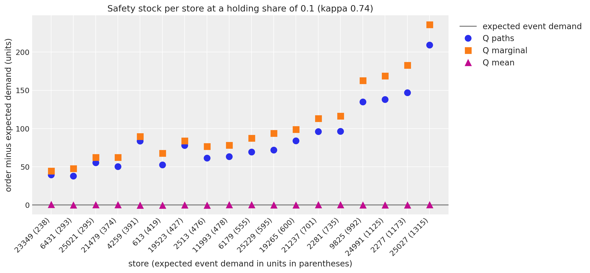</p>
</figure>


The marginal rule's per-week quantiles add up to an order above the joint quantile in every store, and over-ordering is cheap at a fractile of 0.74, which is why it loses little; the mean order sits below both. The next cell computes \text{EVPI}\_\theta with inner negative binomial draws per posterior draw, in sample and held out, with the draws broadcast through xarray so each dimension is named.


    In [108]:


``` python
def negative_binomial_draws(
    rng: np.random.Generator, mu: xr.DataArray, conc: xr.DataArray, n_inner: int
) -> xr.DataArray:
    """Draw ``n_inner`` negative binomial counts per cell of ``mu`` (mean, concentration)."""
    success = (conc / (conc + mu)).broadcast_like(mu).expand_dims(inner=n_inner, axis=1)
    counts = rng.negative_binomial(
        conc.broadcast_like(success).values, success.values, size=success.shape
    )
    return xr.DataArray(counts.astype(np.float32), dims=success.dims, coords=success.coords)


def theta_information_value(eta: float, held_out: bool = False) -> float:
    """Estimate the value of perfect information about the parameters and level, over RP.

    The inner order is chosen on the inner draws. With ``held_out`` it and RP are evaluated
    on the held-out draws instead, so the two values bracket the in-sample optimism of the
    inner argmax at a fixed choose-sample size.
    """
    c_o = eta * cost_focal
    kappa = float((c_u / (c_u + c_o))[0])
    evaluated_on = held_out_demand if held_out else inner_demand
    q_theta = np.quantile(inner_demand, kappa, axis=1, method="inverted_cdf")  # (draws, stores)
    profit_theta = newsvendor_profit(q_theta[:, None, :], evaluated_on, c_u, c_o).mean(
        axis=1
    )  # (draws, stores)
    q_paths = integer_quantile(event_demand, kappa)
    rp_inner = (
        newsvendor_profit(q_paths[None, :], evaluated_on.reshape(-1, n_stores), c_u, c_o)
        .mean(axis=0)
        .sum()
    )
    return float((profit_theta.mean(axis=0).sum() - rp_inner) / rp_inner)
```


    In [109]:


``` python
conc_focal = np.asarray(posterior["conc"])[:, FOCAL_INDEX]
mu_committed = xr.DataArray(
    hnc_event_mu[committed], dims=("sample", "week", "store"), coords={"store": hnc_store_ids}
)
conc_committed = xr.DataArray(conc_focal, dims=("sample",))
inner_rng = np.random.default_rng(seed=7)
inner_demand = xr.concat(
    [
        negative_binomial_draws(inner_rng, mu_committed, conc_committed, 100).sum("week")
        for _ in range(3)
    ],
    dim="inner",
).values  # (draws, inner, stores)
held_out_demand = (
    negative_binomial_draws(inner_rng, mu_committed, conc_committed, 100).sum("week").values
)  # (draws, held out, stores)
evpi_theta_in_sample = theta_information_value(nominal_eta)
evpi_theta_held_out = theta_information_value(nominal_eta, held_out=True)

print(
    f"EVPI_theta / RP: {evpi_theta_in_sample:.1%} in sample ({inner_demand.shape[1]} inner "
    f"draws), {evpi_theta_held_out:.1%} held out ({held_out_demand.shape[1]} draws); in-sample "
    f"optimism {evpi_theta_in_sample - evpi_theta_held_out:.2%} of RP"
)
```


    EVPI_theta / RP: 5.6% in sample (300 inner draws), 5.5% held out (100 draws); in-sample optimism 0.06% of RP


Perfect information about the demand itself would be worth 14.5\\ of RP; about the parameters and the level path 5.6\\ from 300 inner draws, and 5.5\\ on 100 held-out draws, so the in-sample optimism of the inner argmax is 0.06\\ of RP.

Finally, the holding share \eta is an assumption, so the next cell sweeps it and plots the value of the stochastic solution, the marginal-rule loss and the two information ceilings against the holding share, with the critical fractile \kappa that each holding share implies under its tick, and the holding share at which \kappa equals the probability that demand falls below its mean (the fractile at which the mean order is optimal) as the dashed line.


    In [110]:


``` python
sweep_rows = []

for eta in (0.02, 0.05, 0.1, 0.2, 0.4, 0.8):
    rules = order_rules(eta)
    sweep_rows.append(
        {
            "eta": eta,
            "kappa": rules["kappa"],
            "value of the stochastic solution (VSS)": rules["VSS"] / rules["RP"],
            "VSS, split-half": rules["VSS_split_half"] / rules["RP"],
            "loss of the marginal-quantile rule": rules["marginal_rule_loss"] / rules["RP"],
            "perfect information about parameters and level": theta_information_value(eta),
            "perfect information about demand": rules["EVPI_W"] / rules["RP"],
        }
    )

sweep_table = pl.DataFrame(sweep_rows)
kappa_zero = float(np.median((event_demand <= event_demand.mean(axis=0)).mean(axis=0)))
# The holding share at which the critical fractile equals kappa_zero: kappa = c_u / (c_u + eta c),
# and c_u / c is the same in every store because both scale with the base price.
eta_zero = float((c_u / cost_focal)[0]) * (1.0 - kappa_zero) / kappa_zero
eta_axis = sweep_table["eta"].to_numpy()
sweep_styles = {
    "value of the stochastic solution (VSS)": ("o-", "C0", 1.0),
    "VSS, split-half": ("o--", "C0", 0.6),
    "loss of the marginal-quantile rule": ("s-", "C1", 1.0),
    "perfect information about parameters and level": ("^-", "C2", 1.0),
    "perfect information about demand": ("v-", "C3", 1.0),
}

fig, ax = plt.subplots(figsize=(11, 6), layout="constrained")

for column, (style, color, alpha) in sweep_styles.items():
    ax.plot(
        eta_axis, sweep_table[column].to_numpy(), style, color=color, alpha=alpha, label=column
    )

ax.axvline(
    eta_zero,
    color="gray",
    linestyle="--",
    label=f"kappa = P(W <= E[W]) = {kappa_zero:.2f}, median store",
)

for eta, vss in zip(
    eta_axis, sweep_table["value of the stochastic solution (VSS)"].to_numpy(), strict=True
):
    ax.annotate(f"{vss:.1%}", (eta, vss), textcoords="offset points", xytext=(0, 9), ha="center")

ax.set_xscale("log")
ax.set_xticks(
    eta_axis,
    [
        f"{eta}\n$\\kappa$ = {kappa:.2f}"
        for eta, kappa in zip(eta_axis, sweep_table["kappa"].to_numpy(), strict=True)
    ],
)
ax.xaxis.set_minor_locator(mtick.NullLocator())
ax.yaxis.set_major_formatter(mtick.PercentFormatter(xmax=1, decimals=0))
ax.legend(loc="upper left", bbox_to_anchor=(1.01, 1.0))
ax.set(
    xlabel="holding share eta (log scale; critical fractile kappa under each value)",
    ylabel="share of the recourse value RP",
    title="What the joint predictive is worth for the promotion order",
);
```


<figure class="figure">
<p>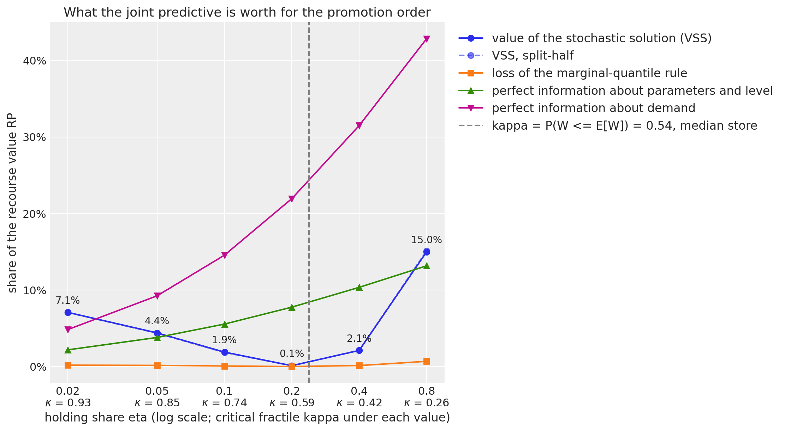</p>
</figure>


The value of the stochastic solution is smallest, 0.1\\ of RP, at a holding share of 0.2, where the critical fractile of 0.59 is nearest the probability that demand falls below its mean, 0.54 in the median store. It grows to 7.1\\ at a fractile of 0.93 and to 15.0\\ at 0.26. The marginal-rule loss stays below 1\\ of RP everywhere.


# Conclusions

We set out to answer three questions for the Thanksgiving promotion of Honey Nut Cheerios. The answers, from the figures above:

1.  **Which promotion?** Feature with display, at the shallowest cut the manufacturer will fund. At the nominal funding share of 0.5 the posterior puts probability 1.00 on a falling profit curve for every mechanics, so the depth decision is a corner; near the break-even share the profit curves are flat and the three deepest cells have downside values within their standard errors of each other. Feature with display is the best mechanics with probability 1.00 while a slot costs 25 per store-week, and no promotion wins at 100.
2.  **Who pays?** The category break-even funding share of feature with display is 0.71, with a 94\\ HDI about 0.1 wide at zone level and about twice that per store. A feature-with-display event at a 15\\ cut beats no promotion even if the retailer funds the whole cut, because the mechanics uplift pays for it; the go turns into a no-go between 50 and 75 per slot and store-week.
3.  **How much to order?** The newsvendor order from the joint demand paths. Its value over the mean order is 1.9\\ of the recourse value at the nominal holding share, smallest (0.1\\) where the critical fractile meets the probability that demand falls below its mean, and up to 15\\ at low fractiles. The marginal-quantile rule over-orders in every store but loses below 1\\ everywhere, because the two event weeks are only weakly correlated (0.26).

Where the posterior changed the answer relative to a point estimate: the store least-squares planner, which is not pooled, adds the cut in 3 stores at the nominal share where the posterior adds it in none, and in all 18 at the break-even share where the posterior adds it in 9, with a postdecision disappointment of 222 and 862; the break-even share comes with an interval instead of a single number; the go/no-go has a downside; and the order uses the joint distribution of the event weeks.


# Limitations

- No experiment. Every elasticity rests on the selection-on-observables assumption drawn in the causal graph; the holdout validates the forecasting engine under the realized calendar, not the counterfactual ones.
- Seven cross elasticities are credibly negative; the four large ones sit inside the General Mills family or in the Cheerios 12 oz row, whose own elasticity is smaller than the effect of the price of Honey Nut Cheerios' private-label twin. We read them as co-promotion recorded on one UPC, not as complementarity; the decisions use only the focal product's column, which has the expected sign, but the no-promotion baseline of the siblings carries them.
- The panel keeps six products and only stores with complete series: Post, Quaker, the products of other sub-categories and other retailers are omitted competitors, and a masked likelihood would use the 23 near-complete stores as well.
- The joint no-promotion baseline over a holiday quarter is never observed; its units rest on the log-additivity of the model. Common random numbers are a coupling assumption; the different-key baseline is a sensitivity, not a bound.
- Shelf capacity censors the sales in the strongest promotion weeks, which biases the feature-with-display uplift and the order quantities downward; the [censored demand example](censored_demand.md) shows the likelihood that would address it.
- The holdout is the holiday quarter with two earlier Decembers to learn from, and the holdout forecasts run high on average: the PIT histogram slopes downward.
- The economics are assumptions: gross margins, a per-unit allowance, base prices frozen at the last training week (the brand-only break-even share is price-free; the category version depends on price ratios only), a holding-cost overage. The manufacturer's side of the deal is outside the model, and General Mills also owns two of the siblings, so part of the cannibalization is internal to it.
- The centering values are chosen by a mean-field guide, a heuristic for the sampler's geometry, not part of the posterior; another guide could pick other values without changing any posterior quantity.


# Next steps

- Make the calendar a lever: add a post-promotion term and let the seasonal profile choose the event weeks.
- Replace the average sibling-mechanics effects by per-pair terms, so a family feature on one Cheerios UPC can lift the others explicitly, and give the mechanics effects a store level.
- Add the censored likelihood of the [censored demand example](censored_demand.md) for the weeks at shelf capacity.
- Run a rolling backtest with [backtest](../../../reference/evaluate.backtest.md#numpyro_forecast.evaluate.backtest) over several promotion quarters.
- Mask the isolated missing weeks in the likelihood instead of dropping the store, with the price imputed at the base price, which would make the 23 near-complete stores usable.


# References

- dunnhumby. [*Source files: Breakfast at the Frat*](https://www.dunnhumby.com/source-files/).
- Ghaedrahmati, E. (2025). [*Breakfast at the Frat: A Time Series Analysis*](https://doi.org/10.6084/m9.figshare.30121060). figshare copy of the dunnhumby workbook.
- Blattberg, R. C., Briesch, R., Fox, E. J. (1995). [*How Promotions Work*](https://doi.org/10.1287/mksc.14.3.G122). Marketing Science, 14(3 supplement), G122-G132.
- van Heerde, H. J., Leeflang, P. S. H., Wittink, D. R. (2000). [*The Estimation of Pre- and Postpromotion Dips with Store-Level Scanner Data*](https://doi.org/10.1509/jmkr.37.3.383.18782). Journal of Marketing Research, 37(3), 383-395.
- Bijmolt, T. H. A., van Heerde, H. J., Pieters, R. G. M. (2005). [*New Empirical Generalizations on the Determinants of Price Elasticity*](https://doi.org/10.1509/jmkr.42.2.141.62296). Journal of Marketing Research, 42(2), 141-156.
- NumPyro documentation. [*Example: Hilbert space approximation for Gaussian processes*](https://num.pyro.ai/en/stable/examples/hsgp.html) and [*Reparameterization*](https://num.pyro.ai/en/stable/reparam.html).
- Gorinova, M. I., Moore, D., Hoffman, M. D. (2020). [*Automatic Reparameterisation of Probabilistic Programs*](https://arxiv.org/abs/1906.03028). Proceedings of the 37th International Conference on Machine Learning.
- Gneiting, T., Katzfuss, M. (2014). [*Probabilistic Forecasting*](https://doi.org/10.1146/annurev-statistics-062713-085831). Annual Review of Statistics and Its Application, 1, 125-151.
- Czado, C., Gneiting, T., Held, L. (2009). [*Predictive Model Assessment for Count Data*](https://doi.org/10.1111/j.1541-0420.2009.01191.x). Biometrics, 65(4), 1254-1261.
- Rockafellar, R. T., Uryasev, S. (2000). [*Optimization of conditional value-at-risk*](https://doi.org/10.21314/JOR.2000.038). Journal of Risk, 2(3), 21-41.
- Smith, J. E., Winkler, R. L. (2006). [*The Optimizer's Curse: Skepticism and Postdecision Surprise in Decision Analysis*](https://doi.org/10.1287/mnsc.1050.0451). Management Science, 52(3), 311-322.
- Birge, J. R., Louveaux, F. (2011). [*Introduction to Stochastic Programming*](https://doi.org/10.1007/978-1-4614-0237-4). Springer.
- Related examples: [hierarchical forecasting 1](hierarchical_forecasting_1.md) (the sampled centering idiom), [fresh retail stockout](fresh_retail_stockout.md) (the model factory and the covariate-swap counterfactual), [availability TSB](availability_tsb.md) (scenario covariates), [censored demand](censored_demand.md) (the NUTS template and the censored likelihood), [univariate forecasting](forecasting_univariate.md) ([time_reparam](../../../reference/reparam.time_reparam.md#numpyro_forecast.reparam.time_reparam)).
