# From forecasts to promotion decisions


From forecasts to promotion decisions

A category manager at a grocery retailer plans the Thanksgiving promotion of Honey Nut Cheerios. The manufacturer offers to fund part of the price cut through a trade allowance. The retailer must decide which promotion to run, whether the deal pays, and how much stock to send to each store. This notebook takes a Bayesian demand model all the way to these decisions.

The data are the dunnhumby [*Breakfast at the Frat*](https://www.dunnhumby.com/source-files/) scanner panel: weekly unit sales, shelf and base prices, and the promotion mechanics (a feature in the store circular, an in-store display, a shelf-tag price cut) for 55 products in 77 stores over 156 weeks, read from the [figshare copy](https://doi.org/10.6084/m9.figshare.30121060) of the workbook. We model six cereals of one substitution group in 18 stores, with Honey Nut Cheerios as the focal product.


## The three business questions

1.  **Which promotion?** A price cut alone, a feature, a display, or a feature with a display, and how deep the cut should be.
2.  **Who pays for the discount?** The manufacturer funds a share of the cut on every unit sold. Below which share does the promotion stop paying for the retailer? And is the promotion worth its feature and display slots?
3.  **How much to order?** Once the promotion is committed, each store orders stock for the two event weeks. Too little loses sales; too much is carried at a holding cost.

The first two questions belong to the category manager, the third to the replenishment planner.


## What we estimate and why it is hard

Every question depends on how demand responds to a price cut and to each mechanics, for the promoted product and for its siblings, which lose sales to it. The response we need is a promotional elasticity: the response to a temporary cut below the base price, not the response to a change in the base price itself, which the level of each series absorbs. Three things make it hard to estimate:

- Cuts and mechanics arrive together. A deep cut almost always comes with a feature or a display, so a regression of units on price alone credits the mechanics uplift to the price.
- Prices were never randomized. Every elasticity rests on an assumption about how the promotions were scheduled, which we state as a causal graph and cannot test.
- Eighteen stores give eighteen noisy store-level elasticities. A store-by-store estimate is too noisy to decide on, and a pooled estimate hides real differences between stores.

The answer to all three is one hierarchical Bayesian model: the mechanics enter as their own terms, the identifying assumption is explicit, and partial pooling across stores gives every store an elasticity that borrows strength from the others, with a posterior that carries the uncertainty into each decision.


## Strategy

1.  **Data.** Select six cereals of one substitution group and 18 stores with complete series, and build a weekly panel of units, prices and promotion flags.
2.  **Model.** Fit a hierarchical negative binomial demand model with a random-walk level per series, annual seasonality, own and cross price elasticities, and feature and display effects, with NUTS. Validate it on the last quarter of the panel.
3.  **Counterfactual promotions.** For every candidate promotion (a mechanics and a depth), forecast the event weeks by changing the horizon inputs and reusing the posterior. Nothing is refit.
4.  **Economics.** Turn the forecast units of every posterior draw into an event profit with the retailer's margin, the manufacturer's funding share and the cost of a feature or display slot.
5.  **Decisions.** Answer each question with a rule that uses the whole posterior: expected profit against depth for the promotion; the break-even funding share, with a credible interval, for the deal; the break-even slot cost for the slots; the downside risk for the go/no-go; and a newsvendor order from joint demand paths for the stock. Where a point estimate would decide differently, we show the difference.


## Main results

- **Which promotion.** Feature with display. At the nominal funding share a deeper cut costs the retailer more margin than the extra units earn, so the cut should be as shallow as the manufacturer allows; the choice between mechanics depends on the slot cost, and we report the slot cost at which it changes.
- **Who pays.** A break-even funding share with a credible interval, at the zone level and per store, and a go/no-go with a downside measure that turns into a no-go as the slot cost rises.
- **How much to order.** A newsvendor order from the joint paths of the two event weeks, and the value of that order over the order a point forecast would place.


## Two caveats

- Prices were never randomized, so every elasticity rests on the identifying assumption of the model section.
- The holdout validates the forecasting engine under the promotions that actually ran, not under the counterfactual ones.


## Roadmap

The sections follow the strategy: read and clean the data, explore the promotion patterns and the identification problem, build the modeling panel, specify and fit the model, check its results and its holdout forecast, forecast the counterfactual promotions, and take the decisions.


# Prepare notebook


``` python
import warnings
from dataclasses import dataclass
from typing import cast

# preliz warns at import time that PyMC is absent; the example does not need it.
warnings.filterwarnings("ignore", message="PyMC not installed", category=UserWarning)

import arviz as az
import graphviz as gr
import jax
import jax.numpy as jnp
import matplotlib.dates as mdates
import matplotlib.lines as mlines
import matplotlib.pyplot as plt
import numpy as np
import numpyro
import numpyro.distributions as dist
import pandas as pd
import polars as pl
import preliz as pz
import pyfixest as pf
import seaborn as sns
import xarray as xr
from jax import random
from jax.typing import ArrayLike
from jaxtyping import Float, Int
from matplotlib import ticker as mtick
from matplotlib.patches import Rectangle
from numpyro import handlers
from numpyro.infer import MCMC, NUTS, SVI, Predictive, Trace_ELBO, init_to_median
from numpyro.infer.autoguide import AutoNormal
from numpyro.infer.reparam import LocScaleReparam
from numpyro.optim import Adam

from numpyro_forecast import (
    Horizon,
    eval_coverage,
    eval_crps,
    eval_mae,
    forecast,
    innovations,
    predict,
    predict_in_sample,
    predictions_to_datatree,
    to_datatree,
)
from numpyro_forecast.datasets import load_breakfast_at_the_frat
from numpyro_forecast.features import fourier_features
from numpyro_forecast.metrics import crps_empirical, make_mase
from numpyro_forecast.typing import Array, ForecastModel

az.style.use("arviz-darkgrid")
plt.rcParams["figure.figsize"] = [12, 7]
plt.rcParams["figure.dpi"] = 100
plt.rcParams["figure.facecolor"] = "white"
plt.rcParams["legend.fontsize"] = 12
plt.rcParams["axes.labelsize"] = 12
plt.rcParams["axes.titlesize"] = 13
plt.rcParams["xtick.labelsize"] = 11
plt.rcParams["ytick.labelsize"] = 11
warnings.filterwarnings(
    "ignore", message="When multiple credible intervals are plotted", category=UserWarning
)
# seaborn grids call tight_layout on figures that the ArviZ style sets to constrained layout.
warnings.filterwarnings(
    "ignore", message="The figure layout has changed to tight", category=UserWarning
)

# Render polars tables without truncating string cells, and drop the shape and
# dtype headers, which are noise in a rendered document.
pl.Config.set_fmt_str_lengths(100)
pl.Config.set_tbl_hide_dataframe_shape(True)
pl.Config.set_tbl_hide_column_data_types(True)
pl.Config.set_tbl_rows(40)
pl.Config.set_tbl_cols(20)

N_CHAINS = 4
N_MODES = 2  # annual Fourier harmonics
numpyro.set_host_device_count(n=N_CHAINS)

rng_key = random.PRNGKey(seed=42)

%load_ext autoreload
%autoreload 2
%load_ext jaxtyping
%jaxtyping.typechecker beartype.beartype
%config InlineBackend.figure_format = "retina"
```


# Read data

Step 1 of the strategy starts with the workbook. dunnhumby publishes it on its source-files page behind a form. The package loader [`load_breakfast_at_the_frat`](https://juanitorduz.github.io/numpyro_forecast/reference/datasets.load_breakfast_at_the_frat.html) downloads the copy that [Ghaedrahmati (2025)](https://doi.org/10.6084/m9.figshare.30121060) deposited on figshare under a CC BY 4.0 license (dunnhumby's own terms govern the data) and returns its three sheets as polars frames. The next cell loads them and shows the first rows of the transactions.


``` python
frat = load_breakfast_at_the_frat()
transactions_raw = frat.transactions
products_df = frat.products
stores_raw = frat.stores
transactions_raw.head()
```


| week_end_date | store_num | upc | units | visits | hhs | spend | price | base_price | feature | display | tpr_only |
|----|----|----|----|----|----|----|----|----|----|----|----|
| 2009-01-14 | 367 | 1111009477 | 13 | 13 | 13 | 18.07 | 1.39 | 1.57 | 0 | 0 | 1 |
| 2009-01-14 | 367 | 1111009497 | 20 | 18 | 18 | 27.8 | 1.39 | 1.39 | 0 | 0 | 0 |
| 2009-01-14 | 367 | 1111009507 | 14 | 14 | 14 | 19.32 | 1.38 | 1.38 | 0 | 0 | 0 |
| 2009-01-14 | 367 | 1111035398 | 4 | 3 | 3 | 14.0 | 3.5 | 4.49 | 0 | 0 | 1 |
| 2009-01-14 | 367 | 1111038078 | 3 | 3 | 3 | 7.5 | 2.5 | 2.5 | 0 | 0 | 0 |


The transactions sheet has 524{,}950 rows, one per store, product and week, for 77 stores, 55 UPCs and 156 weeks from January 2009 to January 2012. The three sheets are:

- `transactions`: one row per store (`store_num`), product (`upc`) and week (`week_end_date`), with the unit sales `units`, the number of baskets `visits` and households `hhs` that bought the product, the revenue `spend`, the shelf price `price`, the regular price `base_price`, and three promotion flags: `feature` (the product appeared in the store circular that week), `display` (an in-store display) and `tpr_only` (a temporary price reduction with a shelf tag and no feature or display).
- `products`: the `description`, `manufacturer`, `category`, `sub_category` and `product_size` of every `upc`.
- `stores`: the `store_name`, city and state, the price segment `seg_value_name` (`mainstream`, `upscale` or `value`), the sales area and the average number of weekly baskets `avg_weekly_baskets` of every `store_id`.

We use `units`, `price`, `base_price` and the three flags from the transactions, the category and sub-category to pick the products, and the segment and basket count to pick the stores.


# Data cleaning

Still step 1: the rows and stores we keep decide what the model can identify.


## Price and unit quirks

The transactions have a few rows we must handle before computing a discount. The next cell counts them: rows without a price or a base price, rows with zero or negative units, and rows whose shelf price is above the base price. The last case is a lagged base-price update in the data, not a mark-up, so we read a price ratio above one as no discount. This rule is asymmetric: a ratio below one always reads as a temporary cut, so a permanent price drop recorded before its base-price update would look like a promotion. The cell also defines the price ratio, the expression the discount depth builds on.


``` python
def price_ratio() -> pl.Expr:
    """Divide the shelf price by the base price."""
    return pl.col("price").truediv(pl.col("base_price"))


quirks = (
    transactions_raw.select(
        pl.col("base_price").null_count().alias("missing base_price"),
        pl.col("price").null_count().alias("missing price"),
        pl.col("units").le(pl.lit(0)).sum().alias("units <= 0"),
        price_ratio().gt(pl.lit(1.0)).sum().alias("price > base_price"),
    )
    .unpivot(variable_name="quirk", value_name="rows")
    .with_columns(share=pl.col("rows").truediv(pl.lit(transactions_raw.height)).round(4))
)
quirks
```


| quirk                 | rows | share  |
|-----------------------|------|--------|
| "missing base_price"  | 185  | 0.0004 |
| "missing price"       | 23   | 0.0    |
| "units \<= 0"         | 5    | 0.0    |
| "price \> base_price" | 6047 | 0.0115 |


The counts are small: 185 rows without a base price and 23 without a shelf price, five rows with non-positive units, and 1.2\\ of the rows with a shelf price above the base price, out of 524{,}950 rows. We drop the first three groups when we build the cereal frame and clip the discount at zero for the fourth.


## Duplicated store rows

The store lookup has 79 rows for 77 stores: two store ids appear twice, with a different price segment on each row. A join of the transactions on the store id would match every transaction of these two stores twice, once per lookup row, which doubles their units in every aggregate and creates two series with the same store id. The next cell lists the two stores and keeps the first row of each.


``` python
duplicated_stores = stores_raw.filter(pl.col("store_id").is_duplicated())
stores_df = stores_raw.unique(subset="store_id", keep="first", maintain_order=True)
duplicated_stores.select("store_id", "store_name", "seg_value_name")
```


| store_id | store_name     | seg_value_name |
|----------|----------------|----------------|
| 4503     | "rockwall"     | "mainstream"   |
| 17627    | "flower mound" | "mainstream"   |
| 17627    | "flower mound" | "upscale"      |
| 4503     | "rockwall"     | "upscale"      |


Both stores are listed as `mainstream` first and `upscale` second, so they count as `mainstream`. The next cell counts the stores per segment after the dedupe.


``` python
stores_df.group_by("seg_value_name").len().sort("seg_value_name")
```


| seg_value_name | len |
|----------------|-----|
| "mainstream"   | 43  |
| "upscale"      | 15  |
| "value"        | 19  |


The 77 stores split into 43 mainstream, 15 upscale and 19 value stores.


## Which products we keep

The workbook has 55 products in four categories. Cross-price effects only make sense inside one substitution group, so we work with cold cereal, the category of Honey Nut Cheerios, which has 15 products in three sub-categories. Two facts decide the selection. First, a missing store-product-week is an absent row: the workbook records a row only when the product sold, and the whole cereal category contains a single row with zero units. Second, the model below carries a random-walk level per series, which needs every week observed. The next cell counts, for each cold cereal, the stores that carry it at all and the stores that carry it in every one of the 156 weeks.


``` python
N_WEEKS = transactions_raw["week_end_date"].n_unique()
cereal_all = transactions_raw.join(products_df, on="upc").filter(
    pl.col("category").eq(pl.lit("cold cereal"))
)


def weeks_per_series(transactions: pl.DataFrame, keys: list[str]) -> pl.DataFrame:
    """Count the distinct weeks of every series keyed by ``keys``."""
    return transactions.group_by(keys).agg(weeks=pl.col("week_end_date").n_unique())


completeness = (
    cereal_all.pipe(weeks_per_series, ["upc", "store_num"])
    .group_by("upc")
    .agg(
        stores_carrying=pl.len(),
        stores_complete=pl.col("weeks").eq(pl.lit(N_WEEKS)).sum(),
        min_weeks=pl.col("weeks").min(),
    )
    .join(products_df.select("upc", "description", "manufacturer", "sub_category"), on="upc")
    .sort("stores_complete", "upc", descending=[True, False])
    .select(
        "upc",
        "description",
        "manufacturer",
        "sub_category",
        "stores_carrying",
        "stores_complete",
        "min_weeks",
    )
)
completeness
```


| upc | description | manufacturer | sub_category | stores_carrying | stores_complete | min_weeks |
|----|----|----|----|----|----|----|
| 1600027527 | "gm honey nut cheerios" | "general mi" | "all family cereal" | 77 | 75 | 131 |
| 1600027528 | "gm cheerios" | "general mi" | "all family cereal" | 77 | 73 | 131 |
| 3800031838 | "kell frosted flakes" | "kellogg" | "kids cereal" | 77 | 73 | 131 |
| 1111085345 | "pl raisin bran" | "private label" | "adult cereal" | 77 | 71 | 131 |
| 1600027564 | "gm cheerios" | "general mi" | "all family cereal" | 77 | 71 | 131 |
| 3800031829 | "kell bite size mini wheat" | "kellogg" | "all family cereal" | 77 | 69 | 83 |
| 1111085350 | "pl bt sz frstd shrd wht" | "private label" | "all family cereal" | 77 | 66 | 131 |
| 1111085319 | "pl honey nut toastd oats" | "private label" | "all family cereal" | 77 | 62 | 131 |
| 3800039118 | "kell froot loops" | "kellogg" | "kids cereal" | 77 | 58 | 120 |
| 3000006340 | "qker life original" | "quaker" | "all family cereal" | 77 | 0 | 41 |
| 3000006560 | "qker cap n crunch berries" | "quaker" | "kids cereal" | 77 | 0 | 102 |
| 3000006610 | "qker cap n crunch" | "quaker" | "kids cereal" | 77 | 0 | 107 |
| 88491201426 | "post hny bn ots hny rstd" | "post foods" | "adult cereal" | 77 | 0 | 94 |
| 88491201427 | "post fm sz hnybnch ot alm" | "post foods" | "adult cereal" | 77 | 0 | 63 |
| 88491212971 | "post fruity pebbles" | "post foods" | "kids cereal" | 77 | 0 | 126 |


The Post and Quaker products are missing for long stretches in many stores: they were delisted and relisted. A product missing for a stretch of weeks in a store was delisted there, and a delisted product has no demand to model, so for those products dropping is right and imputation is not. The six products of the `all family cereal` sub-category from General Mills, Kellogg and the private label are carried in all 77 stores and complete in 62 to 75 of them. We keep these six: Honey Nut Cheerios (`hnc`, the focal product), two sizes of Cheerios, Kellogg's Mini Wheats, and two private-label products, one of which is the private-label twin of the focal product. Isolated missing weeks of these six are a different case, and the next subsection measures them before we decide what to do with them.

The next cell builds the cereal frame that every later step uses. It keeps the six products and gives them short labels, joins the product and store lookups, drops the rows with a missing price or non-positive units, computes the price ratio and the discount depth, and labels the mechanics of every store-week as `none`, `tpr-only`, `display`, `feature` or `feature + display`. The cell ends with the row counts before and after the drop.


``` python
PRODUCT_LABELS = {
    1600027527: "hnc",
    1600027564: "cheerios 12oz",
    1600027528: "cheerios 18oz",
    3800031829: "mini wheats",
    1111085319: "pl honey nut oats",
    1111085350: "pl frosted wheat",
}
product_order: list[str] = list(PRODUCT_LABELS.values())
n_products = len(product_order)
FOCAL = "hnc"
FOCAL_INDEX = product_order.index(FOCAL)


def keep_panel_products(transactions: pl.DataFrame, labels: dict[int, str]) -> pl.DataFrame:
    """Keep the labeled UPCs and add their short product label."""
    return transactions.filter(pl.col("upc").is_in(list(labels))).with_columns(
        product=pl.col("upc").replace_strict(labels, return_dtype=pl.String)
    )


def join_lookups(
    transactions: pl.DataFrame, products: pl.DataFrame, stores: pl.DataFrame
) -> pl.DataFrame:
    """Join the product lookup on the UPC and the deduplicated store lookup on the store id."""
    return transactions.join(products, on="upc").join(
        stores, left_on="store_num", right_on="store_id"
    )


def log_price_ratio() -> pl.Expr:
    """Take the log of shelf over base price, capped at one so a lagged base price is no cut."""
    return price_ratio().clip(upper_bound=1.0).log()


def add_price_columns(cereal: pl.DataFrame) -> pl.DataFrame:
    """Add the discount, the log price ratio ``x`` and the log depth ``lam``."""
    return cereal.with_columns(
        discount=pl.lit(1.0).sub(price_ratio()), x=log_price_ratio()
    ).with_columns(lam=pl.col("x").neg())


def mechanics_label() -> pl.Expr:
    """Label a store-week by its mechanics from the feature, display and shelf-tag flags."""
    feature = pl.col("feature").eq(pl.lit(1))
    display = pl.col("display").eq(pl.lit(1))
    return (
        pl.when(feature.and_(display))
        .then(pl.lit("feature + display"))
        .when(feature)
        .then(pl.lit("feature"))
        .when(display)
        .then(pl.lit("display"))
        .when(pl.col("tpr_only").eq(pl.lit(1)))
        .then(pl.lit("tpr-only"))
        .otherwise(pl.lit("none"))
    )


def add_promotion_columns(cereal: pl.DataFrame) -> pl.DataFrame:
    """Add the series id, cut flag, mechanics label, feature-display interaction and log units."""
    return cereal.with_columns(
        series=pl.concat_str([pl.col("store_num"), pl.col("product")], separator="::"),
        cut=pl.col("discount").gt(pl.lit(0.02)).cast(pl.Int64),
        mechanics=mechanics_label(),
        feature_display=pl.col("feature").mul(pl.col("display")),
        log_units=pl.col("units").cast(pl.Float64).log(),
    )


cereal_df = (
    transactions_raw.pipe(keep_panel_products, PRODUCT_LABELS)
    .pipe(join_lookups, products_df, stores_df)
    .drop_nulls(["price", "base_price"])
    .filter(pl.col("units").gt(pl.lit(0)))
    .pipe(add_price_columns)
    .pipe(add_promotion_columns)
    .sort("store_num", "product", "week_end_date")
)
n_before = transactions_raw.pipe(keep_panel_products, PRODUCT_LABELS).height
shelf_tag_only = (
    pl.col("cut")
    .eq(pl.lit(1))
    .and_(pl.col("feature").eq(pl.lit(0)))
    .and_(pl.col("display").eq(pl.lit(0)))
)
tpr_matches = cereal_df.select(pl.col("tpr_only").eq(pl.lit(1)).eq(shelf_tag_only).all()).item()
assert tpr_matches, "tpr_only must flag exactly the shelf-tag-only cuts"
pl.DataFrame(
    {
        "six-product rows": [n_before],
        "rows kept": [cereal_df.height],
        "rows dropped": [n_before - cereal_df.height],
    }
)
```


| six-product rows | rows kept | rows dropped |
|------------------|-----------|--------------|
| 71774            | 71774     | 0            |


The frame keeps all 71{,}774 six-product rows: every row has a price and positive units, so the drop removes nothing here. The cell also asserts that the workbook's `tpr_only` flag agrees exactly with our own definition (a cut of more than 2\\ without a feature or a display). The next cell shows the columns the rest of the notebook works with.


``` python
cereal_df.select(
    "store_num",
    "product",
    "week_end_date",
    "units",
    "price",
    "base_price",
    "discount",
    "mechanics",
).head()
```


| store_num | product | week_end_date | units | price | base_price | discount | mechanics |
|----|----|----|----|----|----|----|----|
| 367 | "cheerios 12oz" | 2009-01-14 | 56 | 2.72 | 3.07 | 0.114007 | "feature" |
| 367 | "cheerios 12oz" | 2009-01-21 | 36 | 2.68 | 3.07 | 0.127036 | "tpr-only" |
| 367 | "cheerios 12oz" | 2009-01-28 | 20 | 3.19 | 3.19 | 0.0 | "none" |
| 367 | "cheerios 12oz" | 2009-02-04 | 16 | 3.19 | 3.19 | 0.0 | "none" |
| 367 | "cheerios 12oz" | 2009-02-11 | 13 | 1.72 | 3.19 | 0.460815 | "tpr-only" |


## Missing store-product-weeks

The next section keeps only stores in which all six series are observed in every week. Before we apply that filter we should know what the missing weeks are, because two treatments are possible: fill the missing weeks with zero units and no price, or drop the store. Filling with zero is right only if a missing week is a week without sales. The next cell measures the length of every run of missing weeks for the six products and plots two counts: the runs by their length, and the stores by their longest run.


``` python
def sort_by_order(frame: pl.DataFrame, column: str, order: list[str]) -> pl.DataFrame:
    """Sort the rows by the position of ``column`` in ``order``."""
    position = {value: i for i, value in enumerate(order)}
    return (
        frame.with_columns(order=pl.col(column).replace_strict(position))
        .sort("order")
        .drop("order")
    )


def missing_spells(cereal: pl.DataFrame) -> pl.DataFrame:
    """Return one row per run of missing weeks of every store-product series."""
    weeks = cereal["week_end_date"].unique().sort()
    observed = cereal.select("store_num", "product", "week_end_date").with_columns(
        present=pl.lit(True)
    )
    grid = (
        cereal.select("store_num", "product")
        .unique()
        .join(pl.DataFrame({"week_end_date": weeks}), how="cross")
        .join(observed, on=["store_num", "product", "week_end_date"], how="left")
        .with_columns(present=pl.col("present").fill_null(pl.lit(False)))
        .sort(["store_num", "product", "week_end_date"])
        .with_columns(
            spell=pl.col("present")
            .ne(pl.col("present").shift(1))
            .fill_null(pl.lit(True))
            .cum_sum()
            .over(["store_num", "product"])
        )
    )
    return (
        grid.filter(pl.col("present").not_())
        .group_by(["store_num", "product", "spell"])
        .agg(weeks_missing=pl.len(), first_week=pl.col("week_end_date").min())
        .drop("spell")
    )


def run_length_bucket(column: str) -> pl.Expr:
    """Bucket a run length as ``1``, ``2`` or ``3+`` weeks."""
    return (
        pl.when(pl.col(column).ge(pl.lit(3)))
        .then(pl.lit("3+"))
        .otherwise(pl.col(column).cast(pl.String))
    )


spells = cereal_df.pipe(missing_spells)
gap_buckets = ["1", "2", "3+"]
runs_by_length = (
    spells.with_columns(bucket=run_length_bucket("weeks_missing"))
    .group_by("bucket")
    .agg(runs=pl.len())
    .pipe(sort_by_order, "bucket", gap_buckets)
)
stores_by_longest_gap = (
    spells.group_by("store_num")
    .agg(longest=pl.col("weeks_missing").max())
    .with_columns(bucket=run_length_bucket("longest"))
    .group_by("bucket")
    .agg(stores=pl.len())
    .pipe(sort_by_order, "bucket", gap_buckets)
)

fig, axes = plt.subplots(ncols=2, figsize=(12, 4), layout="constrained")
axes[0].bar(runs_by_length["bucket"], runs_by_length["runs"], color="C0")
axes[0].bar_label(axes[0].containers[0])
axes[0].set(xlabel="weeks in the run", ylabel="runs", title="Runs of missing weeks by length")
axes[1].bar(stores_by_longest_gap["bucket"], stores_by_longest_gap["stores"], color="C1")
axes[1].bar_label(axes[1].containers[0])
axes[1].set(
    xlabel="longest run in the store",
    ylabel="stores",
    title=f"Stores with a missing week ({spells['store_num'].n_unique()} of 77)",
)
fig.suptitle("Missing store-product-weeks of the six products", fontsize=16, fontweight="bold");
```


<figure class="figure">
<p>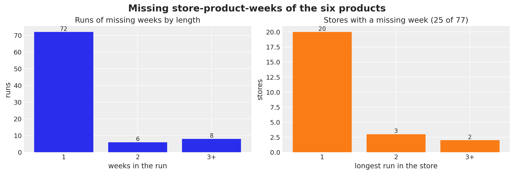</p>
</figure>


Nearly every run is one week long, and in most of the affected stores the longest run is one or two weeks. The next cell lists the runs longer than two weeks.


``` python
spells.filter(pl.col("weeks_missing").gt(pl.lit(2))).sort("store_num", "product", "first_week")
```


| store_num | product             | weeks_missing | first_week |
|-----------|---------------------|---------------|------------|
| 387       | "cheerios 12oz"     | 25            | 2009-02-11 |
| 387       | "cheerios 18oz"     | 25            | 2009-02-11 |
| 387       | "hnc"               | 25            | 2009-02-11 |
| 387       | "mini wheats"       | 25            | 2009-02-11 |
| 387       | "pl frosted wheat"  | 25            | 2009-02-11 |
| 387       | "pl honey nut oats" | 25            | 2009-02-11 |
| 8035      | "mini wheats"       | 57            | 2009-01-14 |
| 8035      | "mini wheats"       | 7             | 2010-02-24 |


Only two stores have real gaps: store 387 is absent for 25 weeks for all six products (a store-level gap, not a delisting), and store 8035 does not carry Mini Wheats for the first 57 weeks. The next cell counts, for the one-week runs, the calendar weeks in which they concentrate.


``` python
(
    spells.filter(pl.col("weeks_missing").eq(pl.lit(1)))
    .group_by("first_week")
    .agg(stores=pl.col("store_num").n_unique())
    .sort(["stores", "first_week"], descending=[True, False])
    .head(3)
)
```


| first_week | stores |
|------------|--------|
| 2011-12-28 | 10     |
| 2009-01-21 | 3      |
| 2010-03-17 | 3      |


Ten stores share the same missing week, December 28, 2011. So a one-week gap is a week missing from the extract, not a week without sales: a product that sells dozens of units a week does not sell zero in one week and dozens again the next. Filling such a week with zero units would put a false zero into the level of the series and a false "no cut" into the price, which the elasticity would read.

This notebook makes the pragmatic choice: it keeps only the stores in which all six series are complete. This is simple, and it costs information but not bias: the selection is a property of the extract, every elasticity is identified within a store, and the next section takes 6 of the 52 complete stores per segment anyway, so the near-complete stores would only matter if we scaled the panel up. In a real deployment that must model the whole panel, the recipe is different: complete the store-product-week grid, fill the missing units with a placeholder and mask them out of the likelihood so the level continues through the gap, and impute the missing price with the base price (or the historical average price of that product in that store) so the price channel carries no false cut. The package's [predict](../../reference/models.predict.md#numpyro_forecast.models.predict) block has no mask argument yet, so the mask is listed in the next steps. What the selection does change is the scope of the zone-level numbers: they describe complete, high-volume stores.


# Exploratory data analysis

Before the model we need to know how promotions look in these data, because that decides which terms the model must carry.


## Promotion mechanics and price cuts arrive together

The transactions carry three promotion flags: `feature` (the product appeared in the store circular that week), `display` (an in-store display) and `tpr_only` (a shelf-tag price cut with no feature or display). We combined them into one mechanics label per store-week: `none`, `tpr-only`, `display`, `feature`, or `feature + display`. Two questions decide how we model promotions. Does a price cut alone move units as much as a feature or a display does? And how often does a cut arrive together with a feature or a display? The next cell tabulates, per mechanics and over all 77 stores, the number of store-weeks, the share of those weeks with a cut, the mean cut depth and the mean units.


``` python
def cut_depth() -> pl.Expr:
    """Clip the discount at zero, so a shelf price above the base price reads as no cut."""
    return pl.col("discount").clip(lower_bound=0.0)


mechanics_order = ["none", "tpr-only", "display", "feature", "feature + display"]
mechanics_table = (
    cereal_df.group_by("mechanics")
    .agg(
        store_weeks=pl.len(),
        share_with_cut=pl.col("cut").mean(),
        mean_depth=cut_depth().mean(),
        mean_units=pl.col("units").mean(),
    )
    .pipe(sort_by_order, "mechanics", mechanics_order)
)
mechanics_table.with_columns(pl.col(pl.Float64).round(2))
```


| mechanics           | store_weeks | share_with_cut | mean_depth | mean_units |
|---------------------|-------------|----------------|------------|------------|
| "none"              | 53777       | 0.0            | 0.0        | 30.78      |
| "tpr-only"          | 10584       | 1.0            | 0.19       | 39.89      |
| "display"           | 1542        | 0.8            | 0.19       | 73.23      |
| "feature"           | 2750        | 0.86           | 0.18       | 74.5       |
| "feature + display" | 3121        | 0.97           | 0.26       | 134.88     |


In the following plot we show the same four columns as bars, one panel per column, to make the two answers visible.


``` python
mechanics_quantities = ["store_weeks", "share_with_cut", "mean_depth", "mean_units"]
mechanics_formats = {
    "store_weeks": "{:,.0f}",
    "share_with_cut": "{:.2f}",
    "mean_depth": "{:.0%}",
    "mean_units": "{:.0f}",
}


def as_pandas(frame: pl.DataFrame) -> pd.DataFrame:
    """Convert a polars frame to pandas column by column (seaborn reads pandas)."""
    return pd.DataFrame({column: frame[column].to_numpy() for column in frame.columns})


mechanics_long = mechanics_table.with_columns(pl.col("store_weeks").cast(pl.Float64)).unpivot(
    index="mechanics", variable_name="quantity", value_name="value"
)
grid = sns.catplot(
    data=as_pandas(mechanics_long),
    x="mechanics",
    y="value",
    col="quantity",
    col_order=mechanics_quantities,
    col_wrap=2,
    kind="bar",
    order=mechanics_order,
    color="C0",
    sharey=False,
    height=3.6,
    aspect=1.5,
)
grid.set_titles("{col_name}")
grid.set_axis_labels("", "")

for ax, quantity in zip(grid.axes.flat, mechanics_quantities, strict=True):
    ax.bar_label(ax.containers[0], fmt=mechanics_formats[quantity])
    ax.tick_params(axis="x", rotation=15)
    ax.margins(y=0.15)
grid.figure.suptitle(
    "Store-weeks, cuts, depth and units by mechanics", fontsize=16, fontweight="bold", y=1.03
);
```


<figure class="figure">
<p>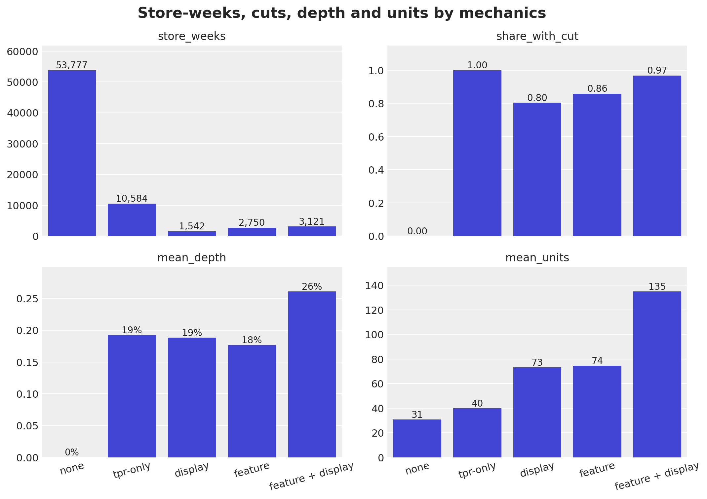</p>
</figure>


The table and the bars give two answers. Store-weeks without any promotion average 31 units; a shelf-tag cut alone brings the average to 40, a display to 73, a feature to 74 and a feature with display to 135, at mean cut depths of 18\\ to 26\\. So the mechanics move units far more than the cut does. This matches the first two empirical generalizations of [Blattberg, Briesch and Fox (1995)](https://doi.org/10.1287/mksc.14.3.G122): a temporary price cut raises sales, and a feature or a display raises them far more than the same cut alone. And 97\\ of the feature-with-display weeks carry a cut, so cuts and mechanics arrive together. This is the identification problem of this notebook: a regression of units on price alone would credit the mechanics uplift to the price, and the elasticity would come out far too large. The model must include the mechanics, and the next subsections measure the problem in numbers.


## Notation and the exploratory regression

Before the Bayesian model we run a few least-squares regressions. They have two jobs: to show the identification problem in numbers (what happens to a price coefficient when the mechanics are left out), and to give the point estimates that the decision section later compares with the posterior. They are exploratory; no decision uses them directly. All of them, and the Bayesian model after them, share one notation:

- A series i is one store-product pair, with store s(i) and product p(i); \text{H} is the focal product. Weeks are t = 1, \dots, T, with T = 143 training weeks.
- y\_{t,i} is the unit sales of series i in week t.
- x\_{t,i} = \log(\text{price}\_{t,i} / \text{base price}\_{t,i}) \le 0 is the log price ratio; d\_{t,i} = 1 - e^{x\_{t,i}} is the discount and \lambda\_{t,i} = -x\_{t,i} the log depth.
- F\_{t,i} and D\_{t,i} are the feature and display flags; F^{\text{sib}}\_{t,i} and D^{\text{sib}}\_{t,i} flag any other product of the panel featured or displayed at the same store-week.
- x\_{k,t,s} is the log price ratio of product k at store s in week t.
- z\_{t,i} = (F, D, FD, F\lambda, D\lambda, F^{\text{sib}}, D^{\text{sib}})\_{t,i} collects the seven mechanics regressors, and b their coefficients: the uplifts b^{\text{feat}} and b^{\text{disp}}, the interaction b^{\text{fd}}, the depth slopes b^{\text{feat},\lambda} and b^{\text{disp},\lambda}, and the sibling effects b^{\text{sib,feat}} and b^{\text{sib,disp}}.
- c(t) = f(t)^\top \beta + \beta\_\tau\\ t / T are the seasonal and trend controls, with f(t) an annual Fourier basis of K = 2 harmonics.

The generic exploratory regression is

 \log y\_{t,i} = a_i + \varepsilon\\ x\_{t,i} + b^\top z\_{t,i} + c(t) + e\_{t,i}, 

with a_i a fixed effect per series, so every coefficient uses only the variation within a series, and e\_{t,i} the residual. Each check below drops or adds terms and states which. The helper `within_ols` fits this regression with [pyfixest](https://pyfixest.org/) and returns the coefficients and their standard errors; `annual_fourier` builds f(t) with `n_modes` harmonics. The same cell adds the Fourier terms, the trend and an "any promotion" flag to the cereal frame.


``` python
def within_ols(
    frame: pl.DataFrame, columns: list[str], target: str = "log_units", by: str = "series"
) -> pl.DataFrame:
    """Fit least squares with a fixed effect per group, through ``pyfixest``.

    Parameters
    ----------
    frame
        Long table with one row per store-product-week.
    columns
        Regressor columns.
    target
        Response column.
    by
        Grouping column absorbed as a fixed effect.

    Returns
    -------
    pl.DataFrame
        One row per regressor with its coefficient and classical standard error (the
        ``iid`` covariance with the fixed effects counted in the degrees of freedom). A
        regressor that is collinear within the frame is dropped by the fit and reported as
        ``NaN``.
    """
    # Column names such as ``price cheerios 12oz`` are not formula-safe, so the fit runs on
    # positional names and the result maps them back.
    safe = {column: f"x_{i}" for i, column in enumerate(columns)}
    selected = frame.select(target, by, *columns).rename(safe)
    data = pd.DataFrame({name: selected[name].to_numpy() for name in selected.columns})
    formula = f"{target} ~ {' + '.join(safe.values())} | {by}"
    with warnings.catch_warnings():
        # In a single store the feature-display interaction can coincide with the feature flag;
        # the dropped regressor shows up as NaN below, so the warning adds nothing.
        warnings.filterwarnings("ignore", message=r"(?s).*multicollinearity", category=UserWarning)
        fit = pf.feols(formula, data=data, vcov="iid")
    coef = fit.coef().reindex(list(safe.values())).to_numpy()
    se = fit.se().reindex(list(safe.values())).to_numpy()
    return pl.DataFrame({"term": columns, "coef": coef, "se": se})


def annual_fourier(week: str, n_modes: int = N_MODES, period: float = 52.18) -> list[pl.Expr]:
    """Build the annual Fourier terms ``sin1, cos1, ..., sin{n_modes}, cos{n_modes}`` of a week column."""
    terms = []

    for harmonic in range(1, n_modes + 1):
        angle = pl.col(week).mul(pl.lit(2.0 * harmonic * np.pi)).truediv(pl.lit(period))
        terms += [angle.sin().alias(f"sin{harmonic}"), angle.cos().alias(f"cos{harmonic}")]
    return terms


def any_promotion() -> pl.Expr:
    """Flag a store-week with a feature, a display or a cut, as a float."""
    promoted = (
        pl.col("feature")
        .eq(pl.lit(1))
        .or_(pl.col("display").eq(pl.lit(1)))
        .or_(pl.col("cut").eq(pl.lit(1)))
    )
    return promoted.cast(pl.Float64)


first_week = cereal_df["week_end_date"].min()
cereal_df = cereal_df.with_columns(
    week_index=pl.col("week_end_date").sub(pl.lit(first_week)).dt.total_days().truediv(pl.lit(7.0))
).with_columns(
    *annual_fourier("week_index"),
    trend=pl.col("week_index").truediv(pl.lit(N_WEEKS)),
    promo=any_promotion(),
)
fourier_terms = [f"{name}{k}" for k in range(1, N_MODES + 1) for name in ("sin", "cos")]
seasonal_terms = [*fourier_terms, "trend"]
```


## Is there a post-promotion dip?

When a product is on promotion, some households buy more than they need that week and store it at home. They then buy less in the following weeks. This is the post-promotion dip documented by [van Heerde, Leeflang and Wittink (2000)](https://doi.org/10.1509/jmkr.37.3.383.18782). If the dip were large, the weeks after the event would lose sales, the timing of the event would matter, and the decision space would have to include the calendar. The next cell measures the dip with the regression

 \log y\_{t,i} = a_i + \varepsilon\\ x\_{t,i} + b^\top z^{\text{flags}}\_{t,i} + \psi_1 P\_{t-1,i} + \psi_2 P\_{t-2,i} + c(t) + e\_{t,i}, 

where z^{\text{flags}} = (F, D, FD) and P\_{t,i} flags any promotion (a feature, a display or a cut) in week t, so \psi_1 and \psi_2 are the dips in the first and the second week after a promotion.


``` python
dip_df = cereal_df.with_columns(
    post1=pl.col("promo").shift(1).over("series").fill_null(0.0),
    post2=pl.col("promo").shift(2).over("series").fill_null(0.0),
)
dip_ols = within_ols(
    dip_df, ["x", "feature", "display", "feature_display", "post1", "post2", *seasonal_terms]
)
dip_ols.filter(
    pl.col("term").is_in(["x", "feature", "display", "feature_display", "post1", "post2"])
).with_columns(pl.col(pl.Float64).round(3))
```


| term              | coef   | se    |
|-------------------|--------|-------|
| "x"               | -0.891 | 0.016 |
| "feature"         | 0.508  | 0.009 |
| "display"         | 0.458  | 0.011 |
| "feature_display" | 0.076  | 0.016 |
| "post1"           | 0.008  | 0.005 |
| "post2"           | -0.016 | 0.004 |


The dip is +0.8\\ (standard error 0.5\\) in the first week after a promotion and -1.6\\ (standard error 0.4\\) in the second, against feature and display effects of +0.51 and +0.46 on the log scale. It is statistically visible and economically negligible, so the calendar is not a lever in this notebook and the event weeks are fixed.


## The realized promotion calendar of the holdout quarter

The last 13 weeks of the panel, from October 2011 to the first week of January 2012, are the holdout of the forecast evaluation and, later, the horizon on which we place the counterfactual promotions. We need to know what actually ran in those weeks for two reasons: the holdout evaluation uses the realized promotions as inputs, and the counterfactual event takes the slot of the realized Thanksgiving event. In the following plot we show, for the focal product and every horizon week, the share of stores with a feature, a display or a shelf-tag cut, and the mean cut depth.


``` python
all_weeks = cereal_df["week_end_date"].unique().sort()
HORIZON = 13
t_train = N_WEEKS - HORIZON
holdout_weeks = all_weeks[t_train:]
realized_calendar = (
    cereal_df.filter(
        pl.col("product")
        .eq(pl.lit(FOCAL))
        .and_(pl.col("week_end_date").is_in(holdout_weeks.to_list()))
    )
    .group_by("week_end_date")
    .agg(
        feature=pl.col("feature").mean(),
        display=pl.col("display").mean(),
        tpr_only=pl.col("tpr_only").mean(),
        depth=cut_depth().mean(),
    )
    .sort("week_end_date")
    .with_row_index("horizon_week", offset=1)
)
horizon_weeks = realized_calendar["horizon_week"].to_numpy()

fig, axes = plt.subplots(nrows=2, figsize=(11, 7), sharex=True, layout="constrained")

for column, marker in [("feature", "o"), ("display", "s"), ("tpr_only", "^")]:
    axes[0].plot(horizon_weeks, realized_calendar[column].to_numpy(), marker=marker, label=column)
axes[0].yaxis.set_major_formatter(mtick.PercentFormatter(xmax=1, decimals=0))
axes[0].set(ylabel="share of stores", title="Share of stores running each mechanics")
depth_bars = axes[1].bar(horizon_weeks, realized_calendar["depth"].to_numpy(), color="C1")
axes[1].bar_label(depth_bars, labels=[f"{d:.0%}" for d in realized_calendar["depth"]])
axes[1].yaxis.set_major_formatter(mtick.PercentFormatter(xmax=1, decimals=0))
axes[1].set(xlabel="horizon week", ylabel="mean cut depth", title="Mean cut depth")
axes[1].set_xticks(horizon_weeks)

for ax in axes:
    ax.axvspan(6.5, 8.5, color="gray", alpha=0.15, label="Thanksgiving weeks")
axes[0].legend(loc="upper left")
fig.suptitle(
    f"Realized promotions of {FOCAL} in the holdout quarter (77 stores)",
    fontsize=16,
    fontweight="bold",
);
```


<figure class="figure">
<p>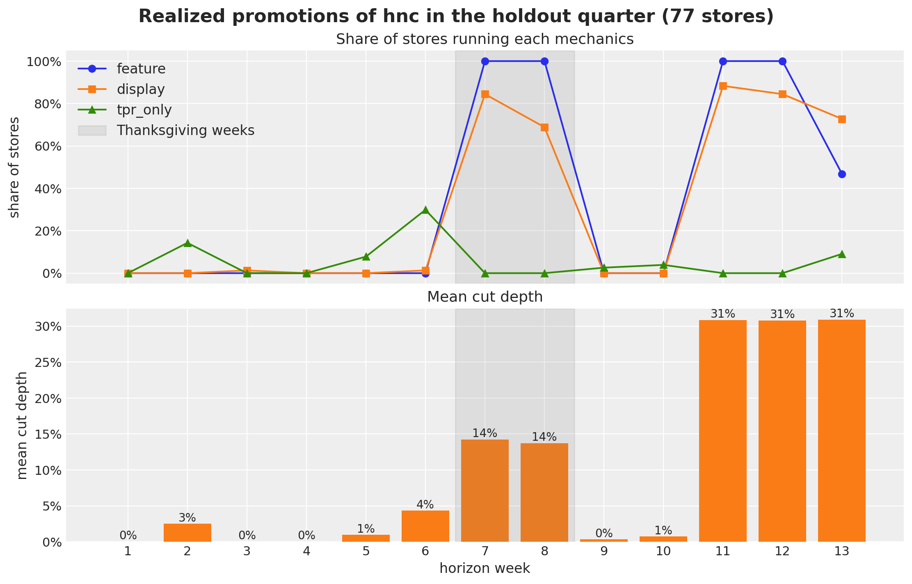</p>
</figure>


The retailer ran a feature with display at about a 15\\ cut in the two Thanksgiving weeks: in horizon weeks 7 and 8 every store featured the product, 84\\ and 69\\ of the stores displayed it, and the mean depth was 14\\. Around Christmas, weeks 11 and 12 carried a 31\\ cut with a feature in every store, and week 13 kept the cut with a feature in 47\\ of the stores. Weeks 7 and 8 become the event weeks of the counterfactual promotions, and "feature with display at a 15\\ cut" becomes the committed policy of the order section.


# Feature engineering: the modeling panel

Step 1 of the strategy ends with the arrays the model reads.


## Store selection

The model needs a block of complete series, and the fit should stay at about ten minutes on a laptop. So we keep the stores in which all six series are complete over the 156 weeks and take `N_STORES_PER_SEGMENT = 6` stores per price segment (`mainstream`, `upscale` and `value`), the largest by average weekly baskets, which keeps the three segments represented. Six products in 18 stores give 108 series, each identified as `store::product`. The cost of the fit grows about linearly with the number of series, so all 52 complete stores (312 series) would take about half an hour, and the whole panel would also need the missing-week mask of the previous section. The next cell counts the complete stores per segment.


``` python
def series_is_complete(n_weeks: int) -> pl.Expr:
    """Flag a series whose distinct weeks span the whole panel."""
    return pl.col("weeks").eq(pl.lit(n_weeks))


def store_is_complete(n_weeks: int, n_products: int) -> pl.Expr:
    """Flag a store in which every product is present and every series is complete."""
    return series_is_complete(n_weeks).all().and_(pl.len().eq(pl.lit(n_products)))


def complete_stores_by_segment(
    cereal: pl.DataFrame, stores: pl.DataFrame, n_weeks: int, n_products: int
) -> pl.DataFrame:
    """Keep the stores whose series all span every week, sorted by segment and basket size."""
    return (
        cereal.pipe(weeks_per_series, ["store_num", "product"])
        .group_by("store_num")
        .agg(all_complete=store_is_complete(n_weeks, n_products))
        .filter(pl.col("all_complete"))
        .join(
            stores.select("store_id", "seg_value_name", "avg_weekly_baskets"),
            left_on="store_num",
            right_on="store_id",
        )
        .sort(
            ["seg_value_name", "avg_weekly_baskets", "store_num"], descending=[False, True, False]
        )
    )


complete_stores = cereal_df.pipe(complete_stores_by_segment, stores_df, N_WEEKS, n_products)
complete_stores.group_by("seg_value_name").len().sort("seg_value_name")
```


| seg_value_name | len |
|----------------|-----|
| "mainstream"   | 32  |
| "upscale"      | 11  |
| "value"        | 9   |


All six series are complete in 52 stores: 32 mainstream, 11 upscale and 9 value. The next cell selects the six largest of each segment and lists them with their segment and basket count.


``` python
N_STORES_PER_SEGMENT = 6
selected = complete_stores.group_by("seg_value_name", maintain_order=True).head(
    N_STORES_PER_SEGMENT
)
selected_stores: list[int] = selected["store_num"].to_list()
n_stores = len(selected_stores)
store_segment: dict[int, str] = dict(
    zip(selected["store_num"].to_list(), selected["seg_value_name"].to_list(), strict=True)
)
selected.select("store_num", "seg_value_name", "avg_weekly_baskets")
```


| store_num | seg_value_name | avg_weekly_baskets |
|-----------|----------------|--------------------|
| 25027     | "mainstream"   | 43892.923077       |
| 21237     | "mainstream"   | 38465.128205       |
| 25229     | "mainstream"   | 34977.435897       |
| 19265     | "mainstream"   | 31578.134615       |
| 9825      | "mainstream"   | 29915.903846       |
| 613       | "mainstream"   | 29386.416667       |
| 2277      | "upscale"      | 54052.519231       |
| 24991     | "upscale"      | 50618.99359        |
| 6179      | "upscale"      | 35287.974359       |
| 2513      | "upscale"      | 32422.99359        |
| 2281      | "upscale"      | 32297.288462       |
| 11993     | "upscale"      | 26100.711538       |
| 25021     | "value"        | 34191.00641        |
| 4259      | "value"        | 31177.333333       |
| 21479     | "value"        | 29435.628205       |
| 23349     | "value"        | 27822.608974       |
| 19523     | "value"        | 24567.75           |
| 6431      | "value"        | 24321.942308       |


The 18 selected stores are the six largest of each segment by weekly baskets, so the zone-level numbers below describe high-volume stores.


## The long frame and the model inputs

The model reads an inputs tensor with one channel per input. The inputs of a series are its own log price ratio x, its feature and display flags, the two sibling flags F^{\text{sib}} and D^{\text{sib}}, and the log price ratios of all six products at its store. The sibling flags and the six prices are there because a promotion of the focal product reaches its siblings through their inputs: their cross-price channel and their sibling flags change. The next cell builds these inputs as columns of a long frame, one row per store-product-week, with one small expression per input; the exploratory regressions below read the same frame. The last 13 weeks are the holdout.


``` python
panel_df = cereal_df.filter(pl.col("store_num").is_in(selected_stores))
series_ids: list[str] = [
    f"{store}::{product}" for store in selected_stores for product in product_order
]
n_series = len(series_ids)
series_position = {series: i for i, series in enumerate(series_ids)}


def sibling_flag(flag: str) -> pl.Expr:
    """Flag a store-week in which any other product of the panel carries ``flag``."""
    total = pl.col(flag).sum().over(["store_num", "week_end_date"])
    return total.sub(pl.col(flag)).gt(pl.lit(0)).cast(pl.Float64)


def store_prices(panel: pl.DataFrame, products: list[str]) -> pl.DataFrame:
    """Add one column ``price <product>`` with the log price ratio of every product at the store-week."""
    wide = panel.pivot(on="product", index=["store_num", "week_end_date"], values="x").rename(
        {product: f"price {product}" for product in products}
    )
    return panel.join(wide, on=["store_num", "week_end_date"])


def add_interactions() -> list[pl.Expr]:
    """Build the feature-display interaction and the depth slopes under feature and display."""
    return [
        pl.col("feature").mul(pl.col("display")).alias("feature_display"),
        pl.col("feature").mul(pl.col("lam")).alias("feature_lam"),
        pl.col("display").mul(pl.col("lam")).alias("display_lam"),
    ]


long_df = (
    panel_df.with_columns(
        time=pl.col("week_end_date").rank("dense").cast(pl.Int64).sub(pl.lit(1)),
        feature=pl.col("feature").cast(pl.Float64),
        display=pl.col("display").cast(pl.Float64),
    )
    .with_columns(sib_feature=sibling_flag("feature"), sib_display=sibling_flag("display"))
    .pipe(store_prices, product_order)
    .with_columns(
        *add_interactions(),
        *annual_fourier("time"),
        trend=pl.col("time").truediv(pl.lit(N_WEEKS)),
        series_position=pl.col("series").replace_strict(series_position),
    )
    .sort("time", "series_position")
    .drop("series_position")
)
train_long = long_df.filter(pl.col("time").lt(pl.lit(t_train)))
input_names: list[str] = [
    "x",
    "feature",
    "display",
    "sib_feature",
    "sib_display",
    *[f"price {product}" for product in product_order],
]
long_df.select(
    "series", "time", "units", "x", "feature", "display", "sib_feature", "sib_display", "price hnc"
).head()
```


| series | time | units | x | feature | display | sib_feature | sib_display | price hnc |
|----|----|----|----|----|----|----|----|----|
| "25027::hnc" | 0 | 70 | 0.0 | 0.0 | 0.0 | 1.0 | 0.0 | 0.0 |
| "25027::cheerios 12oz" | 0 | 181 | -0.22394 | 1.0 | 0.0 | 0.0 | 0.0 | 0.0 |
| "25027::cheerios 18oz" | 0 | 69 | 0.0 | 0.0 | 0.0 | 1.0 | 0.0 | 0.0 |
| "25027::mini wheats" | 0 | 46 | 0.0 | 0.0 | 0.0 | 1.0 | 0.0 | 0.0 |
| "25027::pl honey nut oats" | 0 | 50 | 0.0 | 0.0 | 0.0 | 1.0 | 0.0 | 0.0 |


The next cell pivots every input, the units and the base price into dense `(week, series)` matrices with one column per series, stacks the eleven inputs into the tensor and splits the training window from the holdout. The base price of the last training week is the reference price of every currency number below.


``` python
dates_series = panel_df["week_end_date"].unique().sort()
dates = dates_series.to_numpy()
dates_num = np.asarray(mdates.date2num(dates))
split_x = float(dates_num[t_train])


def make_pivot(value: str) -> Float[np.ndarray, " duration n_series"]:
    """Build the dense (week x series) matrix of one long-frame column.

    Columns follow ``series_ids`` order (store-major, then the product order) so every
    pivot shares the same series axis; a missing cell is an error, not a zero.
    """
    pivot_df = long_df.pivot(on="series", index="week_end_date", values=value).sort(
        "week_end_date"
    )
    matrix = pivot_df.select(series_ids).to_numpy().astype(np.float64)
    if matrix.shape != (len(dates), n_series) or np.isnan(matrix).any():
        msg = f"Unexpected pivot for {value!r}: shape {matrix.shape}"
        raise ValueError(msg)
    return matrix


panel_ds = xr.Dataset(
    {
        column: (("time", "series"), make_pivot(column))
        for column in ["units", "discount", "base_price", *input_names]
    },
    coords={"time": dates, "series": series_ids},
)
series_to_product = jnp.asarray(
    [product_order.index(s.split("::")[1]) for s in series_ids], dtype=jnp.int32
)
series_to_store = jnp.asarray(
    [selected_stores.index(int(s.split("::")[0])) for s in series_ids], dtype=jnp.int32
)
series_to_product_np = np.asarray(series_to_product)
series_to_store_np = np.asarray(series_to_store)
PRICE_BLOCK = 5  # first channel of the cross-price block
covariates = jnp.asarray(
    np.stack([panel_ds[name].to_numpy() for name in input_names]), dtype=jnp.float32
)
covariates_train = covariates[:, :t_train, :]
y = jnp.asarray(panel_ds["units"].to_numpy(), dtype=jnp.int32)
y_train = y[:t_train]
y_test = y[t_train:]
y_train_f = np.asarray(y_train, dtype=np.float32)
y_test_f = np.asarray(y_test, dtype=np.float32)
base_price = panel_ds["base_price"].isel(time=t_train - 1).to_numpy()
panel_ds
```


![]() <style>/* CSS stylesheet for displaying xarray objects in notebooks */

:root {
  --xr-font-color0: var(
    --jp-content-font-color0,
    var(--pst-color-text-base rgba(0, 0, 0, 1))
  );
  --xr-font-color2: var(
    --jp-content-font-color2,
    var(--pst-color-text-base, rgba(0, 0, 0, 0.54))
  );
  --xr-font-color3: var(
    --jp-content-font-color3,
    var(--pst-color-text-base, rgba(0, 0, 0, 0.38))
  );
  --xr-border-color: var(
    --jp-border-color2,
    hsl(from var(--pst-color-on-background, white) h s calc(l - 10))
  );
  --xr-disabled-color: var(
    --jp-layout-color3,
    hsl(from var(--pst-color-on-background, white) h s calc(l - 40))
  );
  --xr-background-color: var(
    --jp-layout-color0,
    var(--pst-color-on-background, white)
  );
  --xr-background-color-row-even: var(
    --jp-layout-color1,
    hsl(from var(--pst-color-on-background, white) h s calc(l - 5))
  );
  --xr-background-color-row-odd: var(
    --jp-layout-color2,
    hsl(from var(--pst-color-on-background, white) h s calc(l - 15))
  );
}

html[theme="dark"],
html[data-theme="dark"],
body[data-theme="dark"],
body.vscode-dark {
  --xr-font-color0: var(
    --jp-content-font-color0,
    var(--pst-color-text-base, rgba(255, 255, 255, 1))
  );
  --xr-font-color2: var(
    --jp-content-font-color2,
    var(--pst-color-text-base, rgba(255, 255, 255, 0.54))
  );
  --xr-font-color3: var(
    --jp-content-font-color3,
    var(--pst-color-text-base, rgba(255, 255, 255, 0.38))
  );
  --xr-border-color: var(
    --jp-border-color2,
    hsl(from var(--pst-color-on-background, #111111) h s calc(l + 10))
  );
  --xr-disabled-color: var(
    --jp-layout-color3,
    hsl(from var(--pst-color-on-background, #111111) h s calc(l + 40))
  );
  --xr-background-color: var(
    --jp-layout-color0,
    var(--pst-color-on-background, #111111)
  );
  --xr-background-color-row-even: var(
    --jp-layout-color1,
    hsl(from var(--pst-color-on-background, #111111) h s calc(l + 5))
  );
  --xr-background-color-row-odd: var(
    --jp-layout-color2,
    hsl(from var(--pst-color-on-background, #111111) h s calc(l + 15))
  );
}

.xr-wrap {
  display: block !important;
  min-width: 300px;
  max-width: 700px;
  line-height: 1.6;
  padding-bottom: 4px;
}

.xr-text-repr-fallback {
  /* fallback to plain text repr when CSS is not injected (untrusted notebook) */
  display: none;
}

.xr-header {
  padding-top: 6px;
  padding-bottom: 6px;
}

.xr-header {
  border-bottom: solid 1px var(--xr-border-color);
  margin-bottom: 4px;
}

.xr-header > div,
.xr-header > ul {
  display: inline;
  margin-top: 0;
  margin-bottom: 0;
}

.xr-obj-type,
.xr-obj-name {
  margin-left: 2px;
  margin-right: 10px;
}

.xr-obj-type,
.xr-group-box-contents > label {
  color: var(--xr-font-color2);
  display: block;
}

.xr-sections {
  padding-left: 0 !important;
  display: grid;
  grid-template-columns: 150px auto auto 1fr 0 20px 0 20px;
  margin-block-start: 0;
  margin-block-end: 0;
}

.xr-section-item {
  display: contents;
}

.xr-section-item > input,
.xr-group-box-contents > input,
.xr-array-wrap > input {
  display: block;
  opacity: 0;
  height: 0;
  margin: 0;
}

.xr-section-item > input + label,
.xr-var-item > input + label {
  color: var(--xr-disabled-color);
}

.xr-section-item > input:enabled + label,
.xr-var-item > input:enabled + label,
.xr-array-wrap > input:enabled + label,
.xr-group-box-contents > input:enabled + label {
  cursor: pointer;
  color: var(--xr-font-color2);
}

.xr-section-item > input:focus-visible + label,
.xr-var-item > input:focus-visible + label,
.xr-array-wrap > input:focus-visible + label,
.xr-group-box-contents > input:focus-visible + label {
  outline: auto;
}

.xr-section-item > input:enabled + label:hover,
.xr-var-item > input:enabled + label:hover,
.xr-array-wrap > input:enabled + label:hover,
.xr-group-box-contents > input:enabled + label:hover {
  color: var(--xr-font-color0);
}

.xr-section-summary {
  grid-column: 1;
  color: var(--xr-font-color2);
  font-weight: 500;
  white-space: nowrap;
}

.xr-section-summary > em {
  font-weight: normal;
}

.xr-span-grid {
  grid-column-end: -1;
}

.xr-section-summary > span {
  display: inline-block;
  padding-left: 0.3em;
}

.xr-group-box-contents > input:checked + label > span {
  display: inline-block;
  padding-left: 0.6em;
}

.xr-section-summary-in:disabled + label {
  color: var(--xr-font-color2);
}

.xr-section-summary-in + label:before {
  display: inline-block;
  content: "►";
  font-size: 11px;
  width: 15px;
  text-align: center;
}

.xr-section-summary-in:disabled + label:before {
  color: var(--xr-disabled-color);
}

.xr-section-summary-in:checked + label:before {
  content: "▼";
}

.xr-section-summary-in:checked + label > span {
  display: none;
}

.xr-section-summary,
.xr-section-inline-details,
.xr-group-box-contents > label {
  padding-top: 4px;
}

.xr-section-inline-details {
  grid-column: 2 / -1;
}

.xr-section-details {
  grid-column: 1 / -1;
  margin-top: 4px;
  margin-bottom: 5px;
}

.xr-section-summary-in ~ .xr-section-details {
  display: none;
}

.xr-section-summary-in:checked ~ .xr-section-details {
  display: contents;
}

.xr-children {
  display: inline-grid;
  grid-template-columns: 100%;
  grid-column: 1 / -1;
  padding-top: 4px;
}

.xr-group-box {
  display: inline-grid;
  grid-template-columns: 0px 30px auto;
}

.xr-group-box-vline {
  grid-column-start: 1;
  border-right: 0.2em solid;
  border-color: var(--xr-border-color);
  width: 0px;
}

.xr-group-box-hline {
  grid-column-start: 2;
  grid-row-start: 1;
  height: 1em;
  width: 26px;
  border-bottom: 0.2em solid;
  border-color: var(--xr-border-color);
}

.xr-group-box-contents {
  grid-column-start: 3;
  padding-bottom: 4px;
}

.xr-group-box-contents > label::before {
  content: "📂";
  padding-right: 0.3em;
}

.xr-group-box-contents > input:checked + label::before {
  content: "📁";
}

.xr-group-box-contents > input:checked + label {
  padding-bottom: 0px;
}

.xr-group-box-contents > input:checked ~ .xr-sections {
  display: none;
}

.xr-group-box-contents > input + label > span {
  display: none;
}

.xr-group-box-ellipsis {
  font-size: 1.4em;
  font-weight: 900;
  color: var(--xr-font-color2);
  letter-spacing: 0.15em;
  cursor: default;
}

.xr-array-wrap {
  grid-column: 1 / -1;
  display: grid;
  grid-template-columns: 20px auto;
}

.xr-array-wrap > label {
  grid-column: 1;
  vertical-align: top;
}

.xr-preview {
  color: var(--xr-font-color3);
}

.xr-array-preview,
.xr-array-data {
  padding: 0 5px !important;
  grid-column: 2;
}

.xr-array-data,
.xr-array-in:checked ~ .xr-array-preview {
  display: none;
}

.xr-array-in:checked ~ .xr-array-data,
.xr-array-preview {
  display: inline-block;
}

.xr-dim-list {
  display: inline-block !important;
  list-style: none;
  padding: 0 !important;
  margin: 0;
}

.xr-dim-list li {
  display: inline-block;
  padding: 0;
  margin: 0;
}

.xr-dim-list:before {
  content: "(";
}

.xr-dim-list:after {
  content: ")";
}

.xr-dim-list li:not(:last-child):after {
  content: ",";
  padding-right: 5px;
}

.xr-has-index {
  font-weight: bold;
}

.xr-var-list,
.xr-var-item {
  display: contents;
}

.xr-var-item > div,
.xr-var-item label,
.xr-var-item > .xr-var-name span {
  background-color: var(--xr-background-color-row-even);
  border-color: var(--xr-background-color-row-odd);
  margin-bottom: 0;
  padding-top: 2px;
}

.xr-var-item > .xr-var-name:hover span {
  padding-right: 5px;
}

.xr-var-list > li:nth-child(odd) > div,
.xr-var-list > li:nth-child(odd) > label,
.xr-var-list > li:nth-child(odd) > .xr-var-name span {
  background-color: var(--xr-background-color-row-odd);
  border-color: var(--xr-background-color-row-even);
}

.xr-var-name {
  grid-column: 1;
}

.xr-var-dims {
  grid-column: 2;
}

.xr-var-dtype {
  grid-column: 3;
  text-align: right;
  color: var(--xr-font-color2);
}

.xr-var-preview {
  grid-column: 4;
}

.xr-index-preview {
  grid-column: 2 / 5;
  color: var(--xr-font-color2);
}

.xr-var-name,
.xr-var-dims,
.xr-var-dtype,
.xr-preview,
.xr-attrs dt {
  white-space: nowrap;
  overflow: hidden;
  text-overflow: ellipsis;
  padding-right: 10px;
}

.xr-var-name:hover,
.xr-var-dims:hover,
.xr-var-dtype:hover,
.xr-attrs dt:hover {
  overflow: visible;
  width: auto;
  z-index: 1;
}

.xr-var-attrs,
.xr-var-data,
.xr-index-data {
  display: none;
  border-top: 2px dotted var(--xr-background-color);
  padding-bottom: 20px !important;
  padding-top: 10px !important;
}

.xr-var-attrs-in + label,
.xr-var-data-in + label,
.xr-index-data-in + label {
  padding: 0 1px;
}

.xr-var-attrs-in:checked ~ .xr-var-attrs,
.xr-var-data-in:checked ~ .xr-var-data,
.xr-index-data-in:checked ~ .xr-index-data {
  display: block;
}

.xr-var-data > table {
  float: right;
}

.xr-var-data > pre,
.xr-index-data > pre,
.xr-var-data > table > tbody > tr {
  background-color: transparent !important;
}

.xr-var-name span,
.xr-var-data,
.xr-index-name div,
.xr-index-data,
.xr-attrs {
  padding-left: 25px !important;
}

.xr-attrs,
.xr-var-attrs,
.xr-var-data,
.xr-index-data {
  grid-column: 1 / -1;
}

dl.xr-attrs {
  padding: 0;
  margin: 0;
  display: grid;
  grid-template-columns: 125px auto;
}

.xr-attrs dt,
.xr-attrs dd {
  padding: 0;
  margin: 0;
  float: left;
  padding-right: 10px;
  width: auto;
}

.xr-attrs dt {
  font-weight: normal;
  grid-column: 1;
}

.xr-attrs dt:hover span {
  display: inline-block;
  background: var(--xr-background-color);
  padding-right: 10px;
}

.xr-attrs dd {
  grid-column: 2;
  white-space: pre-wrap;
  word-break: break-all;
}

.xr-icon-database,
.xr-icon-file-text2,
.xr-no-icon {
  display: inline-block;
  vertical-align: middle;
  width: 1em;
  height: 1.5em !important;
  stroke-width: 0;
  stroke: currentColor;
  fill: currentColor;
}

.xr-var-attrs-in:checked + label > .xr-icon-file-text2,
.xr-var-data-in:checked + label > .xr-icon-database,
.xr-index-data-in:checked + label > .xr-icon-database {
  color: var(--xr-font-color0);
  filter: drop-shadow(1px 1px 5px var(--xr-font-color2));
  stroke-width: 0.8px;
}
</style>

``` xr-text-repr-fallback
<xarray.Dataset> Size: 2MB
Dimensions:                  (time: 156, series: 108)
Coordinates:
  * time                     (time) datetime64[s] 1kB 2009-01-14 ... 2012-01-04
  * series                   (series) <U24 10kB '25027::hnc' ... '6431::pl fr...
Data variables: (12/14)
    units                    (time, series) float64 135kB 70.0 181.0 ... 11.0
    discount                 (time, series) float64 135kB 0.0 0.2006 ... 0.0 0.0
    base_price               (time, series) float64 135kB 2.87 3.14 ... 1.56 2.2
    x                        (time, series) float64 135kB 0.0 -0.2239 ... 0.0
    feature                  (time, series) float64 135kB 0.0 1.0 ... 0.0 0.0
    display                  (time, series) float64 135kB 0.0 0.0 ... 0.0 0.0
    ...                       ...
    price hnc                (time, series) float64 135kB 0.0 0.0 ... -0.2647
    price cheerios 12oz      (time, series) float64 135kB -0.2239 ... 0.0
    price cheerios 18oz      (time, series) float64 135kB 0.0 0.0 ... 0.0 0.0
    price mini wheats        (time, series) float64 135kB 0.0 0.0 ... 0.0 0.0
    price pl honey nut oats  (time, series) float64 135kB 0.0 0.0 ... 0.0 0.0
    price pl frosted wheat   (time, series) float64 135kB 0.0 0.0 ... 0.0 0.0
```


xarray.Dataset


Dimensions:


- time: 156
- series: 108


Coordinates: (2)


time


(time)


datetime64\[s\]


2009-01-14 ... 2012-01-04


    array(['2009-01-14T00:00:00', '2009-01-21T00:00:00', '2009-01-28T00:00:00',
           '2009-02-04T00:00:00', '2009-02-11T00:00:00', '2009-02-18T00:00:00',
           '2009-02-25T00:00:00', '2009-03-04T00:00:00', '2009-03-11T00:00:00',
           '2009-03-18T00:00:00', '2009-03-25T00:00:00', '2009-04-01T00:00:00',
           '2009-04-08T00:00:00', '2009-04-15T00:00:00', '2009-04-22T00:00:00',
           '2009-04-29T00:00:00', '2009-05-06T00:00:00', '2009-05-13T00:00:00',
           '2009-05-20T00:00:00', '2009-05-27T00:00:00', '2009-06-03T00:00:00',
           '2009-06-10T00:00:00', '2009-06-17T00:00:00', '2009-06-24T00:00:00',
           '2009-07-01T00:00:00', '2009-07-08T00:00:00', '2009-07-15T00:00:00',
           '2009-07-22T00:00:00', '2009-07-29T00:00:00', '2009-08-05T00:00:00',
           '2009-08-12T00:00:00', '2009-08-19T00:00:00', '2009-08-26T00:00:00',
           '2009-09-02T00:00:00', '2009-09-09T00:00:00', '2009-09-16T00:00:00',
           '2009-09-23T00:00:00', '2009-09-30T00:00:00', '2009-10-07T00:00:00',
           '2009-10-14T00:00:00', '2009-10-21T00:00:00', '2009-10-28T00:00:00',
           '2009-11-04T00:00:00', '2009-11-11T00:00:00', '2009-11-18T00:00:00',
           '2009-11-25T00:00:00', '2009-12-02T00:00:00', '2009-12-09T00:00:00',
           '2009-12-16T00:00:00', '2009-12-23T00:00:00', '2009-12-30T00:00:00',
           '2010-01-06T00:00:00', '2010-01-13T00:00:00', '2010-01-20T00:00:00',
           '2010-01-27T00:00:00', '2010-02-03T00:00:00', '2010-02-10T00:00:00',
           '2010-02-17T00:00:00', '2010-02-24T00:00:00', '2010-03-03T00:00:00',
           '2010-03-10T00:00:00', '2010-03-17T00:00:00', '2010-03-24T00:00:00',
           '2010-03-31T00:00:00', '2010-04-07T00:00:00', '2010-04-14T00:00:00',
           '2010-04-21T00:00:00', '2010-04-28T00:00:00', '2010-05-05T00:00:00',
           '2010-05-12T00:00:00', '2010-05-19T00:00:00', '2010-05-26T00:00:00',
           '2010-06-02T00:00:00', '2010-06-09T00:00:00', '2010-06-16T00:00:00',
           '2010-06-23T00:00:00', '2010-06-30T00:00:00', '2010-07-07T00:00:00',
           '2010-07-14T00:00:00', '2010-07-21T00:00:00', '2010-07-28T00:00:00',
           '2010-08-04T00:00:00', '2010-08-11T00:00:00', '2010-08-18T00:00:00',
           '2010-08-25T00:00:00', '2010-09-01T00:00:00', '2010-09-08T00:00:00',
           '2010-09-15T00:00:00', '2010-09-22T00:00:00', '2010-09-29T00:00:00',
           '2010-10-06T00:00:00', '2010-10-13T00:00:00', '2010-10-20T00:00:00',
           '2010-10-27T00:00:00', '2010-11-03T00:00:00', '2010-11-10T00:00:00',
           '2010-11-17T00:00:00', '2010-11-24T00:00:00', '2010-12-01T00:00:00',
           '2010-12-08T00:00:00', '2010-12-15T00:00:00', '2010-12-22T00:00:00',
           '2010-12-29T00:00:00', '2011-01-05T00:00:00', '2011-01-12T00:00:00',
           '2011-01-19T00:00:00', '2011-01-26T00:00:00', '2011-02-02T00:00:00',
           '2011-02-09T00:00:00', '2011-02-16T00:00:00', '2011-02-23T00:00:00',
           '2011-03-02T00:00:00', '2011-03-09T00:00:00', '2011-03-16T00:00:00',
           '2011-03-23T00:00:00', '2011-03-30T00:00:00', '2011-04-06T00:00:00',
           '2011-04-13T00:00:00', '2011-04-20T00:00:00', '2011-04-27T00:00:00',
           '2011-05-04T00:00:00', '2011-05-11T00:00:00', '2011-05-18T00:00:00',
           '2011-05-25T00:00:00', '2011-06-01T00:00:00', '2011-06-08T00:00:00',
           '2011-06-15T00:00:00', '2011-06-22T00:00:00', '2011-06-29T00:00:00',
           '2011-07-06T00:00:00', '2011-07-13T00:00:00', '2011-07-20T00:00:00',
           '2011-07-27T00:00:00', '2011-08-03T00:00:00', '2011-08-10T00:00:00',
           '2011-08-17T00:00:00', '2011-08-24T00:00:00', '2011-08-31T00:00:00',
           '2011-09-07T00:00:00', '2011-09-14T00:00:00', '2011-09-21T00:00:00',
           '2011-09-28T00:00:00', '2011-10-05T00:00:00', '2011-10-12T00:00:00',
           '2011-10-19T00:00:00', '2011-10-26T00:00:00', '2011-11-02T00:00:00',
           '2011-11-09T00:00:00', '2011-11-16T00:00:00', '2011-11-23T00:00:00',
           '2011-11-30T00:00:00', '2011-12-07T00:00:00', '2011-12-14T00:00:00',
           '2011-12-21T00:00:00', '2011-12-28T00:00:00', '2012-01-04T00:00:00'],
          dtype='datetime64[s]')


series


(series)


\<U24


'25027::hnc' ... '6431::pl frost...


    array(['25027::hnc', '25027::cheerios 12oz', '25027::cheerios 18oz',
           '25027::mini wheats', '25027::pl honey nut oats',
           '25027::pl frosted wheat', '21237::hnc', '21237::cheerios 12oz',
           '21237::cheerios 18oz', '21237::mini wheats',
           '21237::pl honey nut oats', '21237::pl frosted wheat', '25229::hnc',
           '25229::cheerios 12oz', '25229::cheerios 18oz', '25229::mini wheats',
           '25229::pl honey nut oats', '25229::pl frosted wheat', '19265::hnc',
           '19265::cheerios 12oz', '19265::cheerios 18oz', '19265::mini wheats',
           '19265::pl honey nut oats', '19265::pl frosted wheat', '9825::hnc',
           '9825::cheerios 12oz', '9825::cheerios 18oz', '9825::mini wheats',
           '9825::pl honey nut oats', '9825::pl frosted wheat', '613::hnc',
           '613::cheerios 12oz', '613::cheerios 18oz', '613::mini wheats',
           '613::pl honey nut oats', '613::pl frosted wheat', '2277::hnc',
           '2277::cheerios 12oz', '2277::cheerios 18oz', '2277::mini wheats',
           '2277::pl honey nut oats', '2277::pl frosted wheat', '24991::hnc',
           '24991::cheerios 12oz', '24991::cheerios 18oz', '24991::mini wheats',
           '24991::pl honey nut oats', '24991::pl frosted wheat', '6179::hnc',
           '6179::cheerios 12oz', '6179::cheerios 18oz', '6179::mini wheats',
           '6179::pl honey nut oats', '6179::pl frosted wheat', '2513::hnc',
           '2513::cheerios 12oz', '2513::cheerios 18oz', '2513::mini wheats',
           '2513::pl honey nut oats', '2513::pl frosted wheat', '2281::hnc',
           '2281::cheerios 12oz', '2281::cheerios 18oz', '2281::mini wheats',
           '2281::pl honey nut oats', '2281::pl frosted wheat', '11993::hnc',
           '11993::cheerios 12oz', '11993::cheerios 18oz', '11993::mini wheats',
           '11993::pl honey nut oats', '11993::pl frosted wheat', '25021::hnc',
           '25021::cheerios 12oz', '25021::cheerios 18oz', '25021::mini wheats',
           '25021::pl honey nut oats', '25021::pl frosted wheat', '4259::hnc',
           '4259::cheerios 12oz', '4259::cheerios 18oz', '4259::mini wheats',
           '4259::pl honey nut oats', '4259::pl frosted wheat', '21479::hnc',
           '21479::cheerios 12oz', '21479::cheerios 18oz', '21479::mini wheats',
           '21479::pl honey nut oats', '21479::pl frosted wheat', '23349::hnc',
           '23349::cheerios 12oz', '23349::cheerios 18oz', '23349::mini wheats',
           '23349::pl honey nut oats', '23349::pl frosted wheat', '19523::hnc',
           '19523::cheerios 12oz', '19523::cheerios 18oz', '19523::mini wheats',
           '19523::pl honey nut oats', '19523::pl frosted wheat', '6431::hnc',
           '6431::cheerios 12oz', '6431::cheerios 18oz', '6431::mini wheats',
           '6431::pl honey nut oats', '6431::pl frosted wheat'], dtype='<U24')


Data variables: (14)


units


(time, series)


float64


70.0 181.0 69.0 ... 13.0 6.0 11.0


    array([[ 70., 181.,  69., ...,  17.,   6.,  19.],
           [ 78.,  79.,  43., ...,  24.,  10.,  16.],
           [ 80.,  69.,  51., ...,  31.,  10.,  17.],
           ...,
           [756., 105.,  45., ...,  15.,   7.,  27.],
           [556.,  84.,  29., ...,  11.,   4.,   5.],
           [614.,  92.,  48., ...,  13.,   6.,  11.]], shape=(156, 108))


discount


(time, series)


float64


0.0 0.2006 0.0 0.0 ... 0.0 0.0 0.0


    array([[0.        , 0.20063694, 0.        , ..., 0.        , 0.        ,
            0.18723404],
           [0.        , 0.15923567, 0.        , ..., 0.        , 0.        ,
            0.14893617],
           [0.        , 0.        , 0.        , ..., 0.        , 0.        ,
            0.1787234 ],
           ...,
           [0.35179153, 0.        , 0.        , ..., 0.        , 0.        ,
            0.        ],
           [0.35504886, 0.        , 0.        , ..., 0.        , 0.        ,
            0.        ],
           [0.35504886, 0.        , 0.        , ..., 0.        , 0.        ,
            0.        ]], shape=(156, 108))


base_price


(time, series)


float64


2.87 3.14 4.39 ... 3.36 1.56 2.2


    array([[2.87, 3.14, 4.39, ..., 2.88, 1.83, 2.35],
           [3.19, 3.14, 4.49, ..., 2.88, 1.85, 2.35],
           [3.19, 3.19, 4.54, ..., 2.88, 1.83, 2.35],
           ...,
           [3.07, 2.83, 4.79, ..., 3.36, 1.55, 2.18],
           [3.07, 2.92, 4.79, ..., 3.36, 1.61, 2.2 ],
           [3.07, 3.02, 4.79, ..., 3.36, 1.56, 2.2 ]], shape=(156, 108))


x


(time, series)


float64


0.0 -0.2239 0.0 0.0 ... 0.0 0.0 0.0


    array([[ 0.        , -0.22394005,  0.        , ...,  0.        ,
             0.        , -0.20731209],
           [ 0.        , -0.17344388,  0.        , ...,  0.        ,
             0.        , -0.16126815],
           [ 0.        ,  0.        ,  0.        , ...,  0.        ,
             0.        , -0.19689533],
           ...,
           [-0.43354292,  0.        ,  0.        , ...,  0.        ,
             0.        ,  0.        ],
           [-0.43858072,  0.        ,  0.        , ...,  0.        ,
             0.        ,  0.        ],
           [-0.43858072,  0.        ,  0.        , ...,  0.        ,
             0.        ,  0.        ]], shape=(156, 108))


feature


(time, series)


float64


0.0 1.0 0.0 0.0 ... 0.0 0.0 0.0 0.0


    array([[0., 1., 0., ..., 0., 0., 0.],
           [0., 0., 0., ..., 0., 0., 0.],
           [0., 0., 0., ..., 0., 0., 0.],
           ...,
           [1., 0., 0., ..., 0., 0., 0.],
           [1., 0., 0., ..., 0., 0., 0.],
           [1., 0., 0., ..., 0., 0., 0.]], shape=(156, 108))


display


(time, series)


float64


0.0 0.0 0.0 0.0 ... 0.0 0.0 0.0 0.0


    array([[0., 0., 0., ..., 0., 0., 0.],
           [0., 0., 0., ..., 0., 0., 0.],
           [0., 0., 0., ..., 0., 0., 0.],
           ...,
           [1., 0., 0., ..., 0., 0., 0.],
           [1., 0., 0., ..., 0., 0., 0.],
           [1., 0., 0., ..., 0., 0., 0.]], shape=(156, 108))


sib_feature


(time, series)


float64


1.0 0.0 1.0 1.0 ... 0.0 0.0 0.0 0.0


    array([[1., 0., 1., ..., 0., 0., 0.],
           [0., 0., 0., ..., 1., 1., 1.],
           [0., 0., 0., ..., 0., 0., 0.],
           ...,
           [0., 1., 1., ..., 1., 1., 1.],
           [0., 1., 1., ..., 1., 1., 1.],
           [0., 1., 1., ..., 0., 0., 0.]], shape=(156, 108))


sib_display


(time, series)


float64


0.0 0.0 0.0 0.0 ... 1.0 1.0 1.0 1.0


    array([[0., 0., 0., ..., 0., 0., 0.],
           [0., 0., 0., ..., 0., 0., 0.],
           [0., 0., 0., ..., 0., 0., 0.],
           ...,
           [0., 1., 1., ..., 1., 1., 1.],
           [0., 1., 1., ..., 1., 1., 1.],
           [0., 1., 1., ..., 1., 1., 1.]], shape=(156, 108))


price hnc


(time, series)


float64


0.0 0.0 0.0 ... -0.2647 -0.2647


    array([[ 0.        ,  0.        ,  0.        , ...,  0.        ,
             0.        ,  0.        ],
           [ 0.        ,  0.        ,  0.        , ...,  0.        ,
             0.        ,  0.        ],
           [ 0.        ,  0.        ,  0.        , ...,  0.        ,
             0.        ,  0.        ],
           ...,
           [-0.43354292, -0.43354292, -0.43354292, ..., -0.25464222,
            -0.25464222, -0.25464222],
           [-0.43858072, -0.43858072, -0.43858072, ..., -0.24965468,
            -0.24965468, -0.24965468],
           [-0.43858072, -0.43858072, -0.43858072, ..., -0.26469255,
            -0.26469255, -0.26469255]], shape=(156, 108))


price cheerios 12oz


(time, series)


float64


-0.2239 -0.2239 -0.2239 ... 0.0 0.0


    array([[-0.22394005, -0.22394005, -0.22394005, ...,  0.        ,
             0.        ,  0.        ],
           [-0.17344388, -0.17344388, -0.17344388, ..., -0.10984483,
            -0.10984483, -0.10984483],
           [ 0.        ,  0.        ,  0.        , ...,  0.        ,
             0.        ,  0.        ],
           ...,
           [ 0.        ,  0.        ,  0.        , ...,  0.        ,
             0.        ,  0.        ],
           [ 0.        ,  0.        ,  0.        , ...,  0.        ,
             0.        ,  0.        ],
           [ 0.        ,  0.        ,  0.        , ...,  0.        ,
             0.        ,  0.        ]], shape=(156, 108))


price cheerios 18oz


(time, series)


float64


0.0 0.0 0.0 0.0 ... 0.0 0.0 0.0 0.0


    array([[0., 0., 0., ..., 0., 0., 0.],
           [0., 0., 0., ..., 0., 0., 0.],
           [0., 0., 0., ..., 0., 0., 0.],
           ...,
           [0., 0., 0., ..., 0., 0., 0.],
           [0., 0., 0., ..., 0., 0., 0.],
           [0., 0., 0., ..., 0., 0., 0.]], shape=(156, 108))


price mini wheats


(time, series)


float64


0.0 0.0 0.0 0.0 ... 0.0 0.0 0.0 0.0


    array([[0., 0., 0., ..., 0., 0., 0.],
           [0., 0., 0., ..., 0., 0., 0.],
           [0., 0., 0., ..., 0., 0., 0.],
           ...,
           [0., 0., 0., ..., 0., 0., 0.],
           [0., 0., 0., ..., 0., 0., 0.],
           [0., 0., 0., ..., 0., 0., 0.]], shape=(156, 108))


price pl honey nut oats


(time, series)


float64


0.0 0.0 0.0 0.0 ... 0.0 0.0 0.0 0.0


    array([[ 0.        ,  0.        ,  0.        , ...,  0.        ,
             0.        ,  0.        ],
           [ 0.        ,  0.        ,  0.        , ...,  0.        ,
             0.        ,  0.        ],
           [ 0.        ,  0.        ,  0.        , ...,  0.        ,
             0.        ,  0.        ],
           ...,
           [-0.18026182, -0.18026182, -0.18026182, ...,  0.        ,
             0.        ,  0.        ],
           [-0.15587037, -0.15587037, -0.15587037, ...,  0.        ,
             0.        ,  0.        ],
           [-0.17410796, -0.17410796, -0.17410796, ...,  0.        ,
             0.        ,  0.        ]], shape=(156, 108))


price pl frosted wheat


(time, series)


float64


0.0 0.0 0.0 0.0 ... 0.0 0.0 0.0 0.0


    array([[ 0.        ,  0.        ,  0.        , ..., -0.20731209,
            -0.20731209, -0.20731209],
           [ 0.        ,  0.        ,  0.        , ..., -0.16126815,
            -0.16126815, -0.16126815],
           [ 0.        ,  0.        ,  0.        , ..., -0.19689533,
            -0.19689533, -0.19689533],
           ...,
           [ 0.        ,  0.        ,  0.        , ...,  0.        ,
             0.        ,  0.        ],
           [ 0.        ,  0.        ,  0.        , ...,  0.        ,
             0.        ,  0.        ],
           [ 0.        ,  0.        ,  0.        , ...,  0.        ,
             0.        ,  0.        ]], shape=(156, 108))


The tensor has shape (11, 156, 108): eleven input channels, 156 weeks and 108 series. Base prices differ across stores, so every currency number below uses the store's own price. The next cell summarizes the base price of every product across the 18 stores at the last training week.


``` python
base_price_table = (
    pl.DataFrame(
        {
            "product": [series_ids[n].split("::")[1] for n in range(n_series)],
            "base_price": base_price,
        }
    )
    .group_by("product", maintain_order=True)
    .agg(
        min=pl.col("base_price").min(),
        median=pl.col("base_price").median(),
        max=pl.col("base_price").max(),
        distinct=pl.col("base_price").n_unique(),
    )
    .with_columns(pl.col(pl.Float64).round(2))
)
base_price_table
```


| product             | min  | median | max  | distinct |
|---------------------|------|--------|------|----------|
| "hnc"               | 2.61 | 3.02   | 3.07 | 11       |
| "cheerios 12oz"     | 2.88 | 3.06   | 3.25 | 15       |
| "cheerios 18oz"     | 4.35 | 4.79   | 4.79 | 3        |
| "mini wheats"       | 3.36 | 3.89   | 3.89 | 2        |
| "pl honey nut oats" | 1.56 | 1.9    | 1.99 | 12       |
| "pl frosted wheat"  | 2.13 | 2.41   | 2.48 | 15       |


The focal product's base price ranges from 2.61 to 3.07 across the 18 stores, with 11 distinct values, and the private-label twin's from 1.56 to 1.99.


## Nine focus stores

In the following plot we look at the focal product's weekly units in nine stores, three per segment (one column per segment), with the discount depth on a second axis and the feature and display weeks shaded, to see the pattern the model must reproduce.


``` python
segments = ["mainstream", "upscale", "value"]
focus_by_segment: dict[str, list[int]] = {
    segment: selected.filter(pl.col("seg_value_name").eq(pl.lit(segment)))["store_num"]
    .head(3)
    .to_list()
    for segment in segments
}
focus_stores = [store for segment in segments for store in focus_by_segment[segment]]
focus_labels = [f"{store}::{FOCAL}" for store in focus_stores]

fig, axes = plt.subplots(nrows=3, ncols=3, figsize=(18, 9), sharex=True, layout="constrained")

for k, segment in enumerate(segments):
    for j, store in enumerate(focus_by_segment[segment]):
        ax = axes[j, k]
        label = f"{store}::{FOCAL}"
        (units_line,) = ax.plot(
            dates, panel_ds["units"].sel(series=label), color="black", linewidth=1.2, label="units"
        )
        split_line = ax.axvline(
            split_x, color="C3", linestyle="--", linewidth=1, label="train-test split"
        )
        feature_span = ax.fill_between(
            dates,
            0,
            1,
            where=(panel_ds["feature"].sel(series=label) > 0.5).to_numpy().tolist(),
            transform=ax.get_xaxis_transform(),
            color="C0",
            alpha=0.3,
            linewidth=0,
            step="mid",
            label="feature week",
        )
        display_span = ax.fill_between(
            dates,
            0,
            1,
            where=(panel_ds["display"].sel(series=label) > 0.5).to_numpy().tolist(),
            transform=ax.get_xaxis_transform(),
            color="C4",
            alpha=0.25,
            linewidth=0,
            step="mid",
            label="display week",
        )
        ax.set(title=f"store {store} ({segment})")
        ax_twin = ax.twinx()
        (discount_line,) = ax_twin.plot(
            dates,
            panel_ds["discount"].sel(series=label).clip(0.0, 1.0),
            color="C1",
            alpha=0.9,
            linewidth=1,
            label="discount depth",
        )
        ax_twin.grid(False)
        ax_twin.yaxis.set_major_formatter(mtick.PercentFormatter(xmax=1, decimals=0))
        ax_twin.set(ylim=(0, 0.6))
        if k == 0:
            ax.set_ylabel("units")
        if k == 2:
            ax_twin.set_ylabel("discount")


for ax in axes[-1]:
    ax.xaxis.set_major_locator(mdates.YearLocator())
    ax.xaxis.set_major_formatter(mdates.DateFormatter("%Y"))
fig.legend(
    handles=[units_line, discount_line, feature_span, display_span, split_line],
    loc="outside lower center",
    ncols=5,
)
fig.suptitle(
    "Honey Nut Cheerios units, discounts and mechanics in nine focus stores",
    fontsize=16,
    fontweight="bold",
);
```


<figure class="figure">
<p>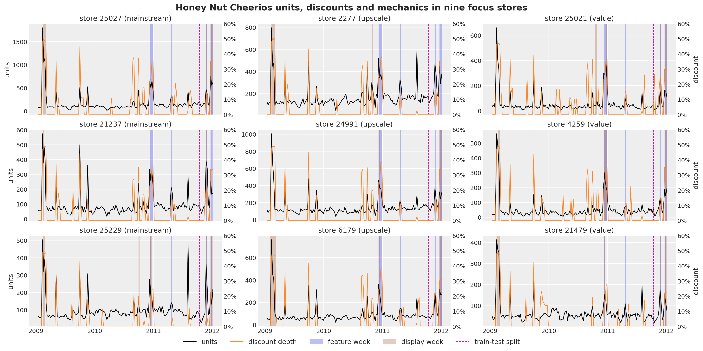</p>
</figure>


The promotion weeks stand out in every store: units jump to three to ten times their usual level in the feature and display weeks, and the shelf-tag cuts between them move the units far less. The largest spikes come with the deepest cuts, but a cut without a feature or a display rarely produces a spike. This is the pattern the model has to reproduce: a multiplicative uplift for the mechanics, a price response on top of it, and a level that does not absorb the spikes.


# Model specification

Step 2 of the strategy: the model, its identifying assumption, and the checks that justify each of its terms.


## Estimand and identifying assumption

The quantity we want to estimate is the expected weekly units of the focal product under a discount d and a mechanics m, with the other inputs at their factual values. This is a promotional elasticity: the response to a temporary cut below the base price, not the response to a change in the base price itself, which the level of each series absorbs. A regular-price elasticity would need a different design, and this notebook cannot answer regular-price questions. [Bijmolt, van Heerde and Pieters (2005)](https://doi.org/10.1509/jmkr.42.2.141.62296) document that promotional elasticities exceed regular-price ones.

Prices were not randomized. The retailer and the manufacturers set the promotion calendar through trade deals, and the same deal sets the cut, the feature and the display together. The causal graph in the next cell draws the identifying assumption: conditional on the mechanics flags, the sibling flags, the competitor prices and the seasonal and level terms, the depth of the cut is as good as random with respect to the unobserved demand shocks. The second cluster shows what would break it: a demand shock (a coupon drop, a competitor's promotion in another retailer) that moves both the deal calendar and the units. We cannot test the assumption with these data; the holdout below validates the forecasting engine under the realized calendar, not the counterfactual ones.


``` python
dag = gr.Digraph()
dag.attr(rankdir="LR")
with dag.subgraph(name="cluster_assumption") as cluster:
    cluster.attr(label="Identifying assumption", color="gray")
    cluster.node("U", label="trade-deal calendar\n(unobserved)", color="lightgray", style="filled")
    cluster.node("d", label="discount depth\n(lever)", color="#2a2eec80", style="filled")
    cluster.node("F", label="feature\n(lever)", color="#2a2eec80", style="filled")
    cluster.node("D", label="display\n(lever)", color="#2a2eec80", style="filled")
    cluster.node(
        "Z",
        label="season, level, competitor prices,\nsibling flags\n(conditioned)",
        shape="box",
        color="#fa7c1780",
        style="filled",
    )
    cluster.node("Y", label="units\n(outcome)", color="#328c0680", style="filled")

    for lever in ("d", "F", "D"):
        cluster.edge("U", lever)
        cluster.edge(lever, "Y")
    cluster.edge("Z", "Y")
    cluster.edge("Z", "U")
with dag.subgraph(name="cluster_violation") as cluster:
    cluster.attr(label="What would break it", color="gray")
    cluster.node(
        "V", label="demand shock or coupons\n(unobserved)", color="lightgray", style="filled"
    )
    cluster.node(
        "U2", label="trade-deal calendar\n(unobserved)", color="lightgray", style="filled"
    )
    cluster.node("d2", label="discount depth\n(lever)", color="#2a2eec80", style="filled")
    cluster.node("Y2", label="units\n(outcome)", color="#328c0680", style="filled")
    cluster.edge("V", "U2")
    cluster.edge("U2", "d2")
    cluster.edge("d2", "Y2")
    cluster.edge("V", "Y2", color="red")
dag
```


<figure class="figure">
<p></p>
</figure>


The upper graph is the assumption: the trade-deal calendar sets the three levers, and once we condition on the boxed variables, the levers are the only open path into the units. The lower graph is the violation: an unobserved demand shock that moves both the calendar and the units opens the red path, and the elasticity would absorb it.


## What identifies the price effect: the naive elasticity and the flags

The mechanics table showed that cuts and mechanics arrive together. Here we measure what that does to a price coefficient with three regressions of log units on the log price ratio, per product and pooled over the six:

\begin{align\*} \text{naive:} \quad & \log y\_{t,i} = a_i + \varepsilon\\ x\_{t,i} + c(t) + e\_{t,i} \\ \text{with flags:} \quad & \log y\_{t,i} = a_i + \varepsilon\\ x\_{t,i} + b^\top z^{\text{flags}}\_{t,i} + c(t) + e\_{t,i} \\ \text{with depth slopes:} \quad & \log y\_{t,i} = a_i + \varepsilon\\ x\_{t,i} + b^\top z\_{t,i} + c(t) + e\_{t,i} \end{align\*}

with z^{\text{flags}} = (F, D, FD, F^{\text{sib}}, D^{\text{sib}}) and z the full mechanics vector with the depth slopes. The naive \varepsilon is the elasticity a price-only regression reports; the third is the one the Bayesian model carries. The next cell fits the three specifications on the training weeks and shows the price coefficient of each with its standard error.


``` python
FLAG_TERMS = ["feature", "display", "feature_display", "sib_feature", "sib_display"]
DEPTH_TERMS = ["feature_lam", "display_lam"]
MECHANICS_TERMS = [*FLAG_TERMS, *DEPTH_TERMS]


def cross_terms_of(product: str) -> list[str]:
    """List the price columns of the other five products."""
    return [f"price {other}" for other in product_order if other != product]


def own_elasticity_row(frame: pl.DataFrame, label: str) -> dict[str, float | str]:
    """Fit the own price coefficient under the three specifications for one product or the pool."""
    naive = within_ols(frame, ["x", *seasonal_terms])
    flags = within_ols(frame, ["x", *FLAG_TERMS, *seasonal_terms])
    slopes = within_ols(frame, ["x", *MECHANICS_TERMS, *seasonal_terms])
    return {
        "product": label,
        "naive": float(naive["coef"][0]),
        "naive_se": float(naive["se"][0]),
        "with_flags": float(flags["coef"][0]),
        "with_flags_se": float(flags["se"][0]),
        "with_depth_slopes": float(slopes["coef"][0]),
        "with_depth_slopes_se": float(slopes["se"][0]),
    }


own_elasticity_ols = pl.DataFrame(
    [
        own_elasticity_row(train_long.filter(pl.col("product").eq(pl.lit(p))), p)
        for p in product_order
    ]
    + [own_elasticity_row(train_long, "pooled")]
)
own_elasticity_ols.with_columns(pl.col(pl.Float64).round(2))
```


| product | naive | naive_se | with_flags | with_flags_se | with_depth_slopes | with_depth_slopes_se |
|----|----|----|----|----|----|----|
| "hnc" | -2.6 | 0.06 | -1.33 | 0.07 | -1.08 | 0.1 |
| "cheerios 12oz" | -0.67 | 0.05 | -0.32 | 0.04 | -0.31 | 0.04 |
| "cheerios 18oz" | -2.75 | 0.05 | -1.96 | 0.1 | -1.51 | 0.16 |
| "mini wheats" | -2.62 | 0.08 | -1.56 | 0.11 | -1.63 | 0.13 |
| "pl honey nut oats" | -1.84 | 0.16 | -1.45 | 0.17 | -1.47 | 0.18 |
| "pl frosted wheat" | -1.13 | 0.08 | -0.85 | 0.08 | -0.89 | 0.09 |
| "pooled" | -1.86 | 0.03 | -0.95 | 0.03 | -0.67 | 0.03 |


For the focal product the naive elasticity is -2.60 (standard error 0.06); with the flags it is -1.33, and with the depth slopes -1.08. Pooled over the six products the gap is -1.86 against -0.95: the flags absorb about half of the naive price effect, because the largest cuts come with a feature or a display and the naive regression credits their uplift to the price.

The next cell fits the focal product's full regression: the depth-slope specification plus the five other prices, \sum\_{k \ne \text{H}} \gamma_k\\ x\_{k,t,s}. Its coefficients are the point-estimate planner of the decision section, so we show every non-seasonal one.


``` python
hnc_long = train_long.filter(pl.col("product").eq(pl.lit(FOCAL)))
CROSS_TERMS = cross_terms_of(FOCAL)
hnc_full_ols = within_ols(hnc_long, ["x", *MECHANICS_TERMS, *CROSS_TERMS, *seasonal_terms])
hnc_full_ols.filter(pl.col("term").is_in(seasonal_terms).not_()).with_columns(
    pl.col(pl.Float64).round(2)
)
```


| term                      | coef  | se   |
|---------------------------|-------|------|
| "x"                       | -0.96 | 0.1  |
| "feature"                 | 0.69  | 0.05 |
| "display"                 | 0.36  | 0.06 |
| "feature_display"         | -0.05 | 0.07 |
| "sib_feature"             | -0.09 | 0.02 |
| "sib_display"             | -0.03 | 0.02 |
| "feature_lam"             | 0.36  | 0.14 |
| "display_lam"             | 0.13  | 0.14 |
| "price cheerios 12oz"     | -0.23 | 0.04 |
| "price cheerios 18oz"     | -0.3  | 0.05 |
| "price mini wheats"       | -0.13 | 0.08 |
| "price pl honey nut oats" | 0.12  | 0.14 |
| "price pl frosted wheat"  | 0.17  | 0.09 |


On the log scale the focal product has a feature effect of +0.69 and a display effect of +0.36 (multipliers of 1.99 and 1.44, compared with the posterior in the results section), a feature-depth slope of +0.36 (standard error 0.14) and a display-depth slope of +0.13 (standard error 0.14). The five other prices enter with coefficients between -0.30 and +0.17. These are the effects the model has to carry: mechanics uplifts, depth slopes under mechanics, and a cross-price matrix.

Cross-price terms need one regression per product, each with the other five prices. In the following heatmap we show them as a matrix: rows are the product whose units respond, columns the product whose price moves, and a positive cell means the two products are substitutes (a cut on the column product takes units from the row product). The diagonal holds the own elasticity of each product.


``` python
cross_rows = []

for product in product_order:
    fit = within_ols(
        train_long.filter(pl.col("product").eq(pl.lit(product))),
        ["x", *FLAG_TERMS, *cross_terms_of(product), *seasonal_terms],
    )
    coefs = dict(zip(fit["term"].to_list(), fit["coef"].to_list(), strict=True))
    row: dict[str, float | str] = {"units of": product}

    for other in product_order:
        row[f"price of {other}"] = coefs["x"] if other == product else coefs[f"price {other}"]
    cross_rows.append(row)
cross_ols = pl.DataFrame(cross_rows)
cross_values = cross_ols.drop("units of").to_numpy()

fig, ax = plt.subplots(figsize=(9, 7), layout="constrained")
sns.heatmap(
    cross_values,
    annot=True,
    fmt="+.2f",
    cmap="RdBu_r",
    vmin=-1.0,
    vmax=1.0,
    xticklabels=product_order,
    yticklabels=product_order,
    cbar_kws={"label": "least-squares coefficient"},
    ax=ax,
)
ax.tick_params(axis="x", rotation=30)
ax.set(
    xlabel="price of",
    ylabel="units of",
    title="Least-squares cross-price terms (diagonal: own elasticity)",
);
```


<figure class="figure">
<p>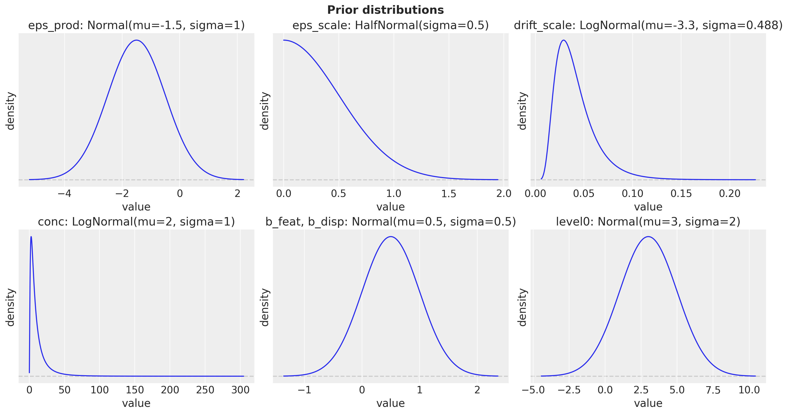</p>
</figure>


The two national-brand-to-twin cells are the largest positive ones: the focal product's price on the private-label honey nut oats, +0.65, and Mini Wheats' price on the private-label frosted wheat, +0.50. When Honey Nut Cheerios is cheaper, its twin sells less. Several cells are negative, which the results section examines with the posterior.

One more check concerns the functional form. The model below uses a log-linear price term, \varepsilon\\ x\_{t,i}. The next cell replaces it by one indicator per discount bin,

 \log y\_{t,i} = a_i + \sum\_{b=1}^{4} \beta_b\\ \mathbb{1}\\d\_{t,i} \in B_b\\ + b^\top z^{\text{flags}}\_{t,i} + c(t) + e\_{t,i}, 

with the bins B_b at (2\\, 10\\\], (10\\, 20\\\], (20\\, 30\\\] and above 30\\, so \beta_b is the log uplift of a cut in bin b against no cut. In the following plot we compare the binned estimates with the log-linear curve \varepsilon \log(1 - d) of the with-flags specification.


``` python
def depth_bins(labels: list[str], edges: list[float]) -> list[pl.Expr]:
    """Build one 0/1 column per discount bin (lo, hi], in the order of ``labels``."""
    return [
        pl.col("discount")
        .gt(pl.lit(lo))
        .and_(pl.col("discount").le(pl.lit(hi)))
        .cast(pl.Float64)
        .alias(label)
        for label, lo, hi in zip(labels, edges[:-1], edges[1:], strict=True)
    ]


bin_edges = [0.02, 0.10, 0.20, 0.30, 1.0]
bin_labels = ["cut (2%, 10%]", "cut (10%, 20%]", "cut (20%, 30%]", "cut > 30%"]
bin_mids = np.array([0.06, 0.15, 0.25, 0.38])
binned = hnc_long.with_columns(depth_bins(bin_labels, bin_edges))
binned_ols = within_ols(binned, [*bin_labels, *FLAG_TERMS, *seasonal_terms]).filter(
    pl.col("term").is_in(bin_labels)
)
hnc_slope = float(own_elasticity_ols.filter(pl.col("product").eq(pl.lit(FOCAL)))["with_flags"][0])
depth_line = np.linspace(0.0, 0.45, 100)

fig, ax = plt.subplots(figsize=(9, 5), layout="constrained")
ax.plot(
    depth_line,
    hnc_slope * np.log1p(-depth_line),
    color="C1",
    label=f"log-linear, elasticity {hnc_slope:.2f} (with flags)",
)
ax.errorbar(
    bin_mids,
    binned_ols["coef"].to_numpy(),
    yerr=binned_ols["se"].to_numpy(),
    fmt="o",
    color="C0",
    capsize=4,
    label="binned estimate (one standard error)",
)

for depth, coef in zip(bin_mids, binned_ols["coef"].to_numpy(), strict=True):
    ax.annotate(f"{coef:+.2f}", (depth, coef), textcoords="offset points", xytext=(8, -12))
ax.xaxis.set_major_formatter(mtick.PercentFormatter(xmax=1, decimals=0))
ax.legend(loc="upper left")
ax.set(
    xlabel="discount depth (bin center)",
    ylabel="log uplift against no cut",
    title=f"Binned against log-linear price response of {FOCAL}",
);
```


<figure class="figure">
<p></p>
</figure>


The binned estimates rise with depth, from +0.08 for cuts up to 10\\ to +0.67 above 30\\, while the log-linear line predicts 0.08, 0.22, 0.38 and 0.63 at the bin centers. On its own, a log-linear term overstates the response to moderate cuts. The model keeps the log-linear form, and its depth slopes under mechanics let the response of a featured cut differ from that of a shelf-tag cut, which is where the moderate cuts sit.


## Which weeks identify the elasticity

The own elasticity of a product is identified by the weeks in which its price moved without a feature or a display, the `tpr_only` weeks, plus the variation of the cut inside feature and display weeks. A product with few such weeks gets its elasticity mostly from the prior and from the partial pooling across stores, so we should know the counts before we read the posterior. In the following plot we count, per product over the training panel, the store-weeks with a shelf-tag cut, a feature and a display, and the spread of the shelf-tag weeks across the 18 series of each product.


``` python
train_panel_df = panel_df.filter(pl.col("week_end_date").is_in(all_weeks[:t_train].to_list()))
identification = (
    train_panel_df.group_by("product", maintain_order=True)
    .agg(
        tpr_only=pl.col("tpr_only").sum(),
        feature=pl.col("feature").sum(),
        display=pl.col("display").sum(),
    )
    .pipe(sort_by_order, "product", product_order)
)
tpr_spread = (
    train_panel_df.group_by("series", "product")
    .agg(tpr_weeks=pl.col("tpr_only").sum())
    .group_by("product")
    .agg(
        tpr_min=pl.col("tpr_weeks").min(),
        tpr_median=pl.col("tpr_weeks").median(),
        tpr_max=pl.col("tpr_weeks").max(),
    )
    .pipe(sort_by_order, "product", product_order)
)
identifying_weeks = dict(
    zip(identification["product"].to_list(), identification["tpr_only"].to_list(), strict=True)
)

fig, axes = plt.subplots(ncols=2, figsize=(15, 5), layout="constrained")
sns.barplot(
    data=as_pandas(
        identification.unpivot(
            index="product", variable_name="mechanics", value_name="store_weeks"
        )
    ),
    x="product",
    y="store_weeks",
    hue="mechanics",
    order=product_order,
    ax=axes[0],
)

for container in axes[0].containers:
    axes[0].bar_label(container, fontsize=10)
axes[0].tick_params(axis="x", rotation=15)
axes[0].set(xlabel="", ylabel="store-weeks", title="Identifying store-weeks by product")
median = tpr_spread["tpr_median"].to_numpy()
axes[1].errorbar(
    np.arange(n_products),
    median,
    yerr=[median - tpr_spread["tpr_min"].to_numpy(), tpr_spread["tpr_max"].to_numpy() - median],
    fmt="o",
    color="C0",
    capsize=5,
    label="median (bar: min to max)",
)
axes[1].set_xticks(np.arange(n_products), product_order, rotation=15)
axes[1].legend(loc="upper right")
axes[1].set(ylabel="tpr-only weeks per series", title="Shelf-tag-only weeks per series")
fig.suptitle("What identifies the own elasticity", fontsize=16, fontweight="bold");
```


<figure class="figure">
<p>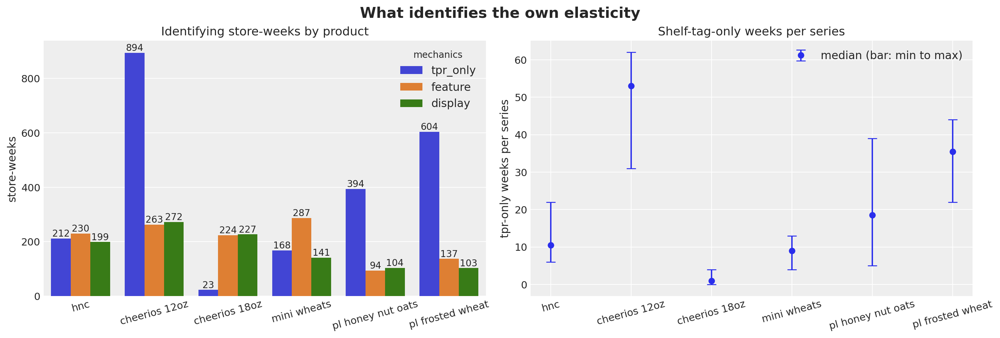</p>
</figure>


The focal product has 212 shelf-tag-only store-weeks in the training panel, between 6 and 22 per store. Cheerios 18 oz has 23, at most 4 per store, so its own elasticity will come from the depth variation inside its feature and display weeks and from the prior.

The counterfactual promotions below vary the depth of the cut from 0 to 40\\ under each mechanics. A depth the retailer never ran under a mechanics is an extrapolation, and the figures should say so. In the following plot we show the distribution of the focal product's cut depth under each mechanics over all 77 stores, and count the observed store-weeks within \pm 2.5 points of every grid depth; cells with fewer than 20 store-weeks are framed in red and shaded as thin support in the later figures.


``` python
DEPTH_GRID = np.round(np.arange(0.0, 0.401, 0.05), 2)
MECHANICS: dict[str, tuple[float, float]] = {
    "tpr-only": (0.0, 0.0),
    "display": (0.0, 1.0),
    "feature": (1.0, 0.0),
    "feature + display": (1.0, 1.0),
}
THIN_SUPPORT = 20
hnc_all_stores = cereal_df.filter(pl.col("product").eq(pl.lit(FOCAL))).with_columns(
    depth=cut_depth()
)
support_counts: dict[str, np.ndarray] = {}
support_rows = []

for mechanics_name in MECHANICS:
    depth = hnc_all_stores.filter(pl.col("mechanics").eq(pl.lit(mechanics_name)))[
        "depth"
    ].to_numpy()
    support_counts[mechanics_name] = np.array(
        [int(np.sum(np.abs(depth - d) <= 0.025)) for d in DEPTH_GRID]
    )
    support_rows.append(
        {
            "mechanics": mechanics_name,
            "share_without_cut": float(np.mean(depth <= 0.02)),
            "p50": float(np.quantile(depth, 0.50)),
            "p95": float(np.quantile(depth, 0.95)),
        }
    )
support_table = pl.DataFrame(support_rows)
count_matrix = np.stack([support_counts[mechanics_name] for mechanics_name in MECHANICS])

fig, axes = plt.subplots(ncols=2, figsize=(16, 6), layout="constrained")
sns.boxplot(
    data=as_pandas(
        hnc_all_stores.filter(pl.col("mechanics").ne(pl.lit("none"))).select("mechanics", "depth")
    ),
    x="mechanics",
    y="depth",
    order=list(MECHANICS),
    color="C0",
    ax=axes[0],
)

axes[0].set_xticks(
    np.arange(len(MECHANICS)),
    [
        f"{row['mechanics']}\nmedian {row['p50']:.0%}, no cut {row['share_without_cut']:.0%}"
        for row in support_table.iter_rows(named=True)
    ],
)
axes[0].yaxis.set_major_formatter(mtick.PercentFormatter(xmax=1, decimals=0))
axes[0].set(xlabel="", ylabel="cut depth", title=f"Cut depth of {FOCAL} by mechanics (77 stores)")
sns.heatmap(
    count_matrix,
    annot=True,
    fmt="d",
    cmap="Blues",
    xticklabels=[f"{d:.0%}" for d in DEPTH_GRID],
    yticklabels=list(MECHANICS),
    cbar_kws={"label": "store-weeks"},
    ax=axes[1],
)

for i, mechanics_name in enumerate(MECHANICS):
    for j, count in enumerate(support_counts[mechanics_name]):
        if count < THIN_SUPPORT:
            axes[1].add_patch(Rectangle((j, i), 1, 1, fill=False, edgecolor="C3", linewidth=2))
axes[1].set(
    xlabel="grid depth",
    ylabel="",
    title=f"Store-weeks within 2.5 points of each grid depth (red: fewer than {THIN_SUPPORT})",
)
fig.suptitle("Support of the counterfactual depth grid", fontsize=16, fontweight="bold");
```


<figure class="figure">
<p>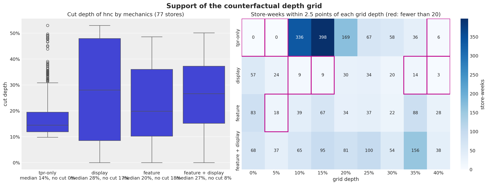</p>
</figure>


The focal product's cut depth has a median of 14\\ under a shelf tag, 20\\ under a feature and 27\\ under feature with display; 17\\ of the display weeks and 18\\ of the feature weeks carry no cut. The thin cells are a display at 10\\, 15\\, 35\\ and 40\\, a feature at 5\\, and a shelf-tag cut at 5\\ or 40\\.

Finally, the cross-price terms are identified only if the six prices do not move in lockstep within a store, and the sibling-mechanics effects only if a sibling is not always featured when the focal product is. In the following heatmap we show the within-store correlations of the six log price ratios over the training weeks.


``` python
x_store_week = (
    panel_ds["x"]
    .to_numpy()[:t_train]
    .reshape(t_train, n_stores, n_products)
    .reshape(-1, n_products)
)
fig, ax = plt.subplots(figsize=(8, 6), layout="constrained")
sns.heatmap(
    np.corrcoef(x_store_week.T),
    annot=True,
    fmt=".2f",
    cmap="RdBu_r",
    vmin=-1.0,
    vmax=1.0,
    xticklabels=product_order,
    yticklabels=product_order,
    ax=ax,
)
ax.tick_params(axis="x", rotation=30)
ax.set(title="Within-store correlation of the log price ratios (training weeks)");
```


<figure class="figure">
<p></p>
</figure>


The correlations stay below 0.30, so the six prices do not move together. The next cell computes the share of the focal product's feature weeks in which a sibling is also featured, against the same share in its non-feature weeks.


``` python
feature_store_week = (
    panel_ds["feature"].to_numpy()[:t_train].reshape(t_train, n_stores, n_products)
)
hnc_featured = feature_store_week[:, :, FOCAL_INDEX] == 1
sibling_featured = np.delete(feature_store_week, FOCAL_INDEX, axis=2).max(axis=2) == 1
pl.DataFrame(
    {
        f"{FOCAL} is": ["featured", "not featured"],
        "P(sibling featured)": [
            round(float(sibling_featured[hnc_featured].mean()), 2),
            round(float(sibling_featured[~hnc_featured].mean()), 2),
        ],
    }
)
```


| hnc is         | P(sibling featured) |
|----------------|---------------------|
| "featured"     | 0.27                |
| "not featured" | 0.37                |


A sibling is featured in 27\\ of the store-weeks in which the focal product is featured, against 37\\ otherwise. Both the cross terms and the sibling effects are identified.


## The demand equation

The exploratory checks gave the list of effects the model must carry: a level per series that does not absorb the promotion spikes, annual seasonality, an own price elasticity per series, a cross-price matrix, mechanics uplifts with depth slopes, sibling-mechanics effects, and overdispersed counts. The model keeps the notation of the exploratory regressions and replaces the fixed effect and the trend by a random-walk level per series, the single elasticity by one per series, partially pooled around a product mean, and the single cross vector by a matrix \gamma\_{k,p}, the response of product p's units to product k's price, zero on the diagonal. For series i with product p = p(i) and store s = s(i), the log of the conditional mean is the sum of five terms:

\begin{align\*} \log \mu\_{t,i} &= \ell\_{t,i} && \text{level} \\ &\quad + f(t)^\top \beta_p && \text{seasonality} \\ &\quad + \varepsilon_i\\ x\_{t,i} && \text{own price} \\ &\quad + \sum\_{k \ne p} \gamma\_{k,p}\\ x\_{k,t,s} && \text{cross prices} \\ &\quad + b_p^\top z\_{t,i} && \text{mechanics} \end{align\*}

The level is a random walk on the log scale, with an initial level \ell\_{0,i} and weekly innovations \delta\_{u,i}, and the units are negative binomial with a concentration \phi_p per product (the mean and concentration parameterization):

 \ell\_{t,i} = \ell\_{0,i} + \sum\_{u \le t} \delta\_{u,i}, \qquad y\_{t,i} \sim \text{NegativeBinomial}(\mu\_{t,i}, \phi_p). 

The priors, whose reasons the next section gives, are

\begin{align\*} \ell\_{0,i} &\sim \text{Normal}(3, 2), & \delta\_{u,i} &\sim \text{Normal}(0, \sigma_i), \\ \sigma_i &\sim \text{LogNormal}(-3.3, 0.49), & \beta_p &\sim \text{Normal}(0, 0.2), \\ \varepsilon_i &\sim \text{Normal}(\varepsilon\_{p(i)}, \sigma\_\varepsilon), & \varepsilon_p &\sim \text{Normal}(-1.5, 1), \\ \sigma\_\varepsilon &\sim \text{HalfNormal}(0.5), & \sigma\_\gamma &\sim \text{HalfNormal}(0.5), \\ \gamma\_{k,p} &\sim \text{Normal}(0, \sigma\_\gamma), & \phi_p &\sim \text{LogNormal}(2, 1), \\ b^{\text{feat}}\_p, b^{\text{disp}}\_p &\sim \text{Normal}(0.5, 0.5), & \text{other } b_p &\sim \text{Normal}(0, 0.5). \end{align\*}

Two quantities of this equation drive the decisions. Under a mechanics m = (F_m, D_m), a cut of depth d multiplies the units by (1 - d)^{\varepsilon_m}, with the mechanics-specific elasticity

 \varepsilon_m = \varepsilon - b^{\text{feat},\lambda} F_m - b^{\text{disp},\lambda} D_m, 

(a positive slope makes the response steeper), and the mechanics themselves multiply the units by e^{b_m} with

 b_m = b^{\text{feat}} F_m + b^{\text{disp}} D_m + b^{\text{fd}} F_m D_m. 

Every decision threshold below uses \varepsilon_m, never the bare \varepsilon. The sibling-mechanics effects are averages over "any sibling featured or displayed", so under a policy in which only the focal product is featured the mechanics part of the cannibalization is attenuated toward the average sibling. Remark: with a Poisson likelihood the same code runs with `dist.Poisson`; with continuous sales the link would be a Normal on the log scale.


## Model components in code

The next cell writes the model. Each of the five terms of \log \mu is a function that samples its own sites and returns its contribution, the pattern of the NumPyro [Hilbert space Gaussian process example](https://num.pyro.ai/en/stable/examples/hsgp.html); the factory `make_cereal_model` adds the five terms and returns the plain `(covariates, data=None)` callable that the package drivers expect. On the forecast horizon the model also registers the conditional mean \mu, which the decision layer needs.

One design choice needs an explanation before the code. The level innovations, the store-level elasticities and the cross terms are hierarchical, and NumPyro's [`LocScaleReparam`](https://num.pyro.ai/en/stable/reparam.html) lets us choose between their centered (1) and non-centered (0) parameterization with a value in \[0, 1\], the idiom of the [hierarchical forecasting example](hierarchical_forecasting_1.md). We sample that value as a site. A reparameterization does not change the posterior, so NUTS cannot learn it: its posterior would be its prior. Variational inference can, because the ELBO depends on the parameterization, so the model fit section learns the three values with a short SVI pass and hands them to NUTS as constants, the recipe of [Gorinova, Moore and Hoffman (2020)](https://arxiv.org/abs/1906.03028).


``` python
@dataclass(frozen=True)
class CerealPriors:
    """Prior hyperparameters of the cereal demand model (all on the log scale)."""

    eps_loc: float
    eps_sd: float
    eps_store_sd: float
    drift_mu: float
    drift_sigma: float
    conc_mu: float
    conc_sigma: float
    mech_loc: float
    mech_sd: float
    aux_sd: float
    cross_sd: float
    seasonal_sd: float
    level_loc: float
    level_sd: float


CENTERING_SITES = ["centered_drift", "centered_eps", "centered_gamma"]


def local_level(
    h: Horizon,
    series_plate: numpyro.plate,
    centered_drift: Float[Array, ""],
    priors: CerealPriors,
) -> Float[Array, " duration n_series"]:
    """Build the random-walk level per series: the initial level plus the summed innovations."""
    with series_plate:
        level0 = cast(
            "Array", numpyro.sample("level0", dist.Normal(priors.level_loc, priors.level_sd))
        )
        drift_scale = cast(
            "Array",
            numpyro.sample("drift_scale", dist.LogNormal(priors.drift_mu, priors.drift_sigma)),
        )
        # innovations opens its own time plate at dim=-2 and registers the horizon
        # innovations as a separate site, so the forecast continues the walk. The
        # centering value is a sampled site that SVI learns and NUTS receives as a constant.
        drift = innovations(
            h,
            "drift",
            lambda: dist.Normal(0.0, drift_scale),
            reparam=LocScaleReparam(centered=centered_drift),
        )
    return level0 + jnp.cumsum(drift, axis=-2)


def annual_seasonality(
    fourier: Float[Array, " duration n_fourier"],
    product_plate: numpyro.plate,
    fourier_plate: numpyro.plate,
    series_to_product: Int[Array, " n_series"],
    priors: CerealPriors,
) -> Float[Array, " duration n_series"]:
    """Sample the annual Fourier seasonality with one coefficient vector per product."""
    with fourier_plate, product_plate:
        beta_s = cast("Array", numpyro.sample("beta_s", dist.Normal(0.0, priors.seasonal_sd)))
    return (fourier @ beta_s)[:, series_to_product]


def own_price_effect(
    x: Float[Array, " duration n_series"],
    product_plate: numpyro.plate,
    series_plate: numpyro.plate,
    series_to_product: Int[Array, " n_series"],
    centered_eps: Float[Array, ""],
    priors: CerealPriors,
) -> Float[Array, " duration n_series"]:
    """Sample the own promotional elasticity per series, partially pooled around its product mean."""
    with product_plate:
        eps_prod = cast(
            "Array", numpyro.sample("eps_prod", dist.Normal(priors.eps_loc, priors.eps_sd))
        )
    eps_scale = cast("Array", numpyro.sample("eps_scale", dist.HalfNormal(priors.eps_store_sd)))
    with series_plate, handlers.reparam(config={"eps": LocScaleReparam(centered=centered_eps)}):
        eps = cast(
            "Array", numpyro.sample("eps", dist.Normal(eps_prod[series_to_product], eps_scale))
        )
    return eps * x


def cross_price_effect(
    prices: Float[Array, " n_products duration n_series"],
    pair_plate: numpyro.plate,
    series_to_product: Int[Array, " n_series"],
    pair_rows: Int[Array, " n_pairs"],
    pair_cols: Int[Array, " n_pairs"],
    centered_gamma: Float[Array, ""],
    priors: CerealPriors,
    n_products: int,
) -> Float[Array, " duration n_series"]:
    """Sample the 30 off-diagonal cross elasticities, shrunk toward zero, and apply them to the prices."""
    cross_scale = cast("Array", numpyro.sample("cross_scale", dist.HalfNormal(priors.cross_sd)))
    with (
        pair_plate,
        handlers.reparam(config={"gamma_offdiag": LocScaleReparam(centered=centered_gamma)}),
    ):
        gamma_offdiag = cast(
            "Array", numpyro.sample("gamma_offdiag", dist.Normal(0.0, cross_scale))
        )
    gamma = cast(
        "Array",
        numpyro.deterministic(
            "gamma",
            jnp.zeros((n_products, n_products)).at[pair_rows, pair_cols].set(gamma_offdiag),
        ),
    )
    # cross[t, n] = sum_k gamma[k, p(n)] * prices[k, t, n]: for series n (product p(n) sold at
    # store s(n)), take the log price ratio of every product k at the same store and weight it
    # by the cross elasticity of p(n) with respect to k; the own cell k == p(n) is zero in
    # gamma and is handled by own_price_effect.
    return jnp.einsum("ktn,kn->tn", prices, gamma[:, series_to_product])


def mechanics_effect(
    feature: Float[Array, " duration n_series"],
    display: Float[Array, " duration n_series"],
    lam: Float[Array, " duration n_series"],
    sib_feature: Float[Array, " duration n_series"],
    sib_display: Float[Array, " duration n_series"],
    product_plate: numpyro.plate,
    series_to_product: Int[Array, " n_series"],
    priors: CerealPriors,
) -> Float[Array, " duration n_series"]:
    """Sample the mechanics uplifts, their interaction, the depth slopes and the sibling effects."""
    with product_plate:
        b_feat = cast(
            "Array", numpyro.sample("b_feat", dist.Normal(priors.mech_loc, priors.mech_sd))
        )
        b_disp = cast(
            "Array", numpyro.sample("b_disp", dist.Normal(priors.mech_loc, priors.mech_sd))
        )
        b_fd = cast("Array", numpyro.sample("b_fd", dist.Normal(0.0, priors.aux_sd)))
        b_feat_depth = cast(
            "Array", numpyro.sample("b_feat_depth", dist.Normal(0.0, priors.aux_sd))
        )
        b_disp_depth = cast(
            "Array", numpyro.sample("b_disp_depth", dist.Normal(0.0, priors.aux_sd))
        )
        b_sib_feat = cast("Array", numpyro.sample("b_sib_feat", dist.Normal(0.0, priors.aux_sd)))
        b_sib_disp = cast("Array", numpyro.sample("b_sib_disp", dist.Normal(0.0, priors.aux_sd)))
    p = series_to_product
    uplift = b_feat[p] * feature + b_disp[p] * display
    interaction = b_fd[p] * feature * display
    depth_slopes = b_feat_depth[p] * feature * lam + b_disp_depth[p] * display * lam
    sibling = b_sib_feat[p] * sib_feature + b_sib_disp[p] * sib_display
    return uplift + interaction + depth_slopes + sibling


def dispersion(
    product_plate: numpyro.plate, series_to_product: Int[Array, " n_series"], priors: CerealPriors
) -> Float[Array, " n_series"]:
    """Sample the negative binomial concentration per product and gather it to the series axis."""
    with product_plate:
        conc = cast(
            "Array", numpyro.sample("conc", dist.LogNormal(priors.conc_mu, priors.conc_sigma))
        )
    return conc[series_to_product]


def offdiagonal_pairs(
    n_products: int,
) -> tuple[Int[np.ndarray, " n_pairs"], Int[np.ndarray, " n_pairs"]]:
    """Return the row and column indices of the off-diagonal cells of the cross-price matrix."""
    rows, cols = np.where(~np.eye(n_products, dtype=bool))
    return rows, cols


def make_cereal_model(
    series_to_product: Int[Array, " n_series"],
    fourier_full: Float[Array, " duration_full n_fourier"],
    priors: CerealPriors,
    n_products: int,
    n_series: int,
) -> ForecastModel:
    """Build the cereal demand model as the plain ``(covariates, data=None)`` callable.

    Parameters
    ----------
    series_to_product
        Product index of every series, shape ``(n_series,)``.
    fourier_full
        Annual Fourier basis over the full duration, computed outside any trace.
    priors
        Prior hyperparameters.
    n_products
        Number of products (the cross matrix is ``n_products`` square).
    n_series
        Number of store-product series (the trailing observation axis).

    Returns
    -------
    ForecastModel
        The model function, callable as ``model(covariates)`` for prior sampling and
        ``model(covariates, data)`` for training and forecasting.
    """
    rows_np, cols_np = offdiagonal_pairs(n_products)
    pair_rows = jnp.asarray(rows_np, dtype=jnp.int32)
    pair_cols = jnp.asarray(cols_np, dtype=jnp.int32)
    n_pairs = int(rows_np.size)
    n_fourier = int(fourier_full.shape[-1])

    def cereal_model(
        covariates: Float[Array, " inputs duration n_series"],
        data: Int[Array, " t_obs n_series"] | None = None,
    ) -> None:
        """Sample the joint model (the drivers call this for training and forecasting)."""
        h = Horizon.from_data(covariates, data)
        duration = covariates.shape[-2]
        x = covariates[0]
        feature = covariates[1]
        display = covariates[2]
        sib_feature = covariates[3]
        sib_display = covariates[4]
        prices = covariates[PRICE_BLOCK:]
        lam = -x

        product_plate = numpyro.plate("product", n_products, dim=-1)
        fourier_plate = numpyro.plate("fourier", n_fourier, dim=-2)
        pair_plate = numpyro.plate("pair", n_pairs, dim=-1)
        series_plate = numpyro.plate("series", n_series, dim=-1)
        # One centering value per reparameterized site, in [0, 1]: 0 is non-centered, 1 centered.
        centered_drift = cast("Array", numpyro.sample("centered_drift", dist.Uniform(0.0, 1.0)))
        centered_eps = cast("Array", numpyro.sample("centered_eps", dist.Uniform(0.0, 1.0)))
        centered_gamma = cast("Array", numpyro.sample("centered_gamma", dist.Uniform(0.0, 1.0)))

        level = local_level(h, series_plate, centered_drift, priors)
        seasonality = annual_seasonality(
            fourier_full[:duration], product_plate, fourier_plate, series_to_product, priors
        )
        own_price = own_price_effect(
            x, product_plate, series_plate, series_to_product, centered_eps, priors
        )
        cross_price = cross_price_effect(
            prices,
            pair_plate,
            series_to_product,
            pair_rows,
            pair_cols,
            centered_gamma,
            priors,
            n_products,
        )
        mechanics = mechanics_effect(
            feature,
            display,
            lam,
            sib_feature,
            sib_display,
            product_plate,
            series_to_product,
            priors,
        )
        eta = level + seasonality + own_price + cross_price + mechanics
        conc_series = dispersion(product_plate, series_to_product, priors)
        if h.future > 0:
            # The conditional mean over the horizon, for the decision layer; registered
            # only in forecast mode so the training posterior carries no extra array.
            numpyro.deterministic("mu_future", jnp.exp(eta)[h.t_obs :])
        predict(h, lambda e: dist.NegativeBinomial2(jnp.exp(e), conc_series), eta)

    return cereal_model


fourier_full = jnp.asarray(fourier_features(N_WEEKS, 52.18, N_MODES))
pair_rows_np, pair_cols_np = offdiagonal_pairs(n_products)
pair_labels = [
    f"{product_order[k]} -> {product_order[p]}"
    for k, p in zip(pair_rows_np, pair_cols_np, strict=True)
]
fourier_names = [f"sin{k}" for k in range(1, N_MODES + 1)] + [
    f"cos{k}" for k in range(1, N_MODES + 1)
]
```


# Priors and prior predictive checks

Still step 2: the priors, chosen before we look at the fit, and the check that they put the units in a plausible range. Each prior of the block above has a reason:

- The product elasticity prior \text{Normal}(-1.5, 1) is centered where the meta-analysis of [Bijmolt, van Heerde and Pieters (2005)](https://doi.org/10.1509/jmkr.42.2.141.62296) puts price elasticities (an average of about -2.6 across studies, with promotional elasticities above regular-price ones in magnitude), and it leaves the positive tail open so the data can reject the sign. The store deviations around the product mean have a \text{HalfNormal}(0.5) scale, deviations of up to about one unit.
- The weekly innovation scale of the level comes from `preliz.maxent`: we ask for a log-normal with 94\\ of its mass between weekly innovations of 1\\ and 8\\, because a wider prior lets the level absorb one-week promotion spikes (the results section checks the mechanics effects against the least-squares ones for this reason).
- The concentration prior \text{LogNormal}(2, 1) implies, at 80 units a week, a coefficient of variation near the within-store spread of the focal product's weeks.
- The feature and display effects have a \text{Normal}(0.5, 0.5) prior, a median multiplier of 1.65 against the least-squares multipliers above, with negative values allowed. The interaction, the depth slopes and the sibling effects are centered at zero.
- The cross terms share a \text{HalfNormal}(0.5) scale that shrinks the 30 cells toward zero. The seasonal coefficients have a \text{Normal}(0, 0.2) prior and the initial level a \text{Normal}(3, 2) prior on the log scale.
- The three centering values have a \text{Uniform}(0, 1) prior, which the SVI pass of the model fit section turns into a choice of parameterization.

The next cell builds the prior object and shows, for every prior, its median, its 94\\ HDI and the quantity it implies.


``` python
with warnings.catch_warnings():
    warnings.simplefilter("ignore", RuntimeWarning)
    drift_scale_prior = pz.maxent(pz.LogNormal(), lower=0.01, upper=0.08, mass=0.94, plot=False)

priors = CerealPriors(
    eps_loc=-1.5,
    eps_sd=1.0,
    eps_store_sd=0.5,
    drift_mu=float(drift_scale_prior.mu),
    drift_sigma=float(drift_scale_prior.sigma),
    conc_mu=2.0,
    conc_sigma=1.0,
    mech_loc=0.5,
    mech_sd=0.5,
    aux_sd=0.5,
    cross_sd=0.5,
    seasonal_sd=0.2,
    level_loc=3.0,
    level_sd=2.0,
)
prior_distributions = {
    "eps_prod": pz.Normal(priors.eps_loc, priors.eps_sd),
    "eps_scale": pz.HalfNormal(priors.eps_store_sd),
    "drift_scale": pz.LogNormal(priors.drift_mu, priors.drift_sigma),
    "conc": pz.LogNormal(priors.conc_mu, priors.conc_sigma),
    "b_feat, b_disp": pz.Normal(priors.mech_loc, priors.mech_sd),
    "b_fd, depth slopes, sibling effects": pz.Normal(0.0, priors.aux_sd),
    "cross_scale": pz.HalfNormal(priors.cross_sd),
    "beta_s": pz.Normal(0.0, priors.seasonal_sd),
    "level0": pz.Normal(priors.level_loc, priors.level_sd),
}
prior_rows = []

for site, distribution in prior_distributions.items():
    lower, upper = distribution.hdi(mass=0.94, fmt=".6f")
    median = float(distribution.median())
    if site == "drift_scale":
        implied = f"level drift over 13 weeks about {np.sqrt(HORIZON) * median:.0%} (median)"
    elif site == "conc":
        implied = f"CV at 80 units about {np.sqrt(1 / 80 + 1 / median):.2f} (median)"
    elif site == "b_feat, b_disp":
        implied = (
            f"multiplier {np.exp(lower):.2f} to {np.exp(upper):.2f}, median {np.exp(median):.2f}"
        )
    elif site == "level0":
        implied = f"{np.exp(lower):.1f} to {np.exp(upper):.0f} units, median {np.exp(median):.0f}"
    else:
        implied = ""
    prior_rows.append(
        {
            "site": site,
            "prior": str(distribution),
            "median": round(median, 3),
            "hdi94_lower": round(float(lower), 3),
            "hdi94_upper": round(float(upper), 3),
            "implied": implied,
        }
    )
prior_table = pl.DataFrame(prior_rows)
prior_table
```


| site | prior | median | hdi94_lower | hdi94_upper | implied |
|----|----|----|----|----|----|
| "eps_prod" | "Normal(mu=-1.5, sigma=1)" | -1.5 | -3.381 | 0.381 | "" |
| "eps_scale" | "HalfNormal(sigma=0.5)" | 0.337 | 0.0 | 0.94 | "" |
| "drift_scale" | "LogNormal(mu=-3.3, sigma=0.488)" | 0.037 | 0.011 | 0.08 | "level drift over 13 weeks about 13% (median)" |
| "conc" | "LogNormal(mu=2, sigma=1)" | 7.389 | 0.211 | 35.035 | "CV at 80 units about 0.38 (median)" |
| "b_feat, b_disp" | "Normal(mu=0.5, sigma=0.5)" | 0.5 | -0.44 | 1.44 | "multiplier 0.64 to 4.22, median 1.65" |
| "b_fd, depth slopes, sibling effects" | "Normal(mu=0, sigma=0.5)" | 0.0 | -0.94 | 0.94 | "" |
| "cross_scale" | "HalfNormal(sigma=0.5)" | 0.337 | 0.0 | 0.94 | "" |
| "beta_s" | "Normal(mu=0, sigma=0.2)" | 0.0 | -0.376 | 0.376 | "" |
| "level0" | "Normal(mu=3, sigma=2)" | 3.0 | -0.762 | 6.762 | "0.5 to 864 units, median 20" |


`preliz.maxent` returns \text{LogNormal}(-3.3, 0.488) for the innovation scale, a median weekly innovation of 3.7\\. In the following plot we show the density of the six main priors.


``` python
fig, axes = plt.subplots(nrows=2, ncols=3, figsize=(15, 8), layout="constrained")
panels = ["eps_prod", "eps_scale", "drift_scale", "conc", "b_feat, b_disp", "level0"]

for ax, site in zip(axes.ravel(), panels, strict=True):
    prior_distributions[site].plot_pdf(ax=ax, legend=None, color="C0")
    ax.set(title=f"{site}: {prior_distributions[site]}", xlabel="value", ylabel="density")
fig.suptitle("Prior distributions", fontsize=16, fontweight="bold");
```


<figure class="figure">
<p>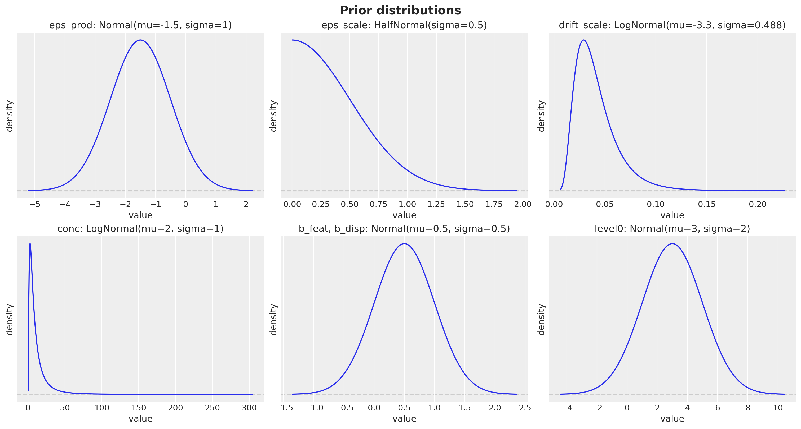</p>
</figure>


The next cell builds the model with these priors and renders its graph, which shows the plates and the sites the components sample.


``` python
model = make_cereal_model(series_to_product, fourier_full, priors, n_products, n_series)
numpyro.render_model(model, model_args=(covariates_train, y_train), render_distributions=True)
```


<figure class="figure">
<p>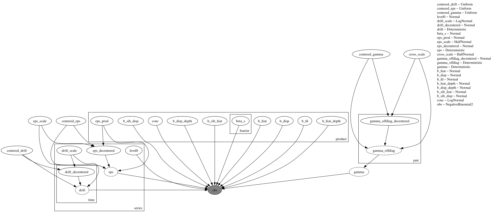</p>
</figure>


In the following plot we draw 500 datasets from the prior predictive and show their 50\\ and 94\\ HDI bands on the nine focus series, against the observed units, to check that the priors put the units in a plausible range without pinning them.


``` python
def hdi_label(prob: float, prefix: str = "") -> str:
    r"""Build the legend label of an HDI band, e.g. ``$94\%$ HDI``."""
    percent = f"{prob:.0%}".replace("%", r"\%")
    return f"{prefix}${percent}$ HDI"


hdi_probs = (0.5, 0.94)
hdi_alphas = [0.6, 0.3]

rng_key, key_prior = random.split(rng_key)
prior_sites = ["obs", "eps_prod", "b_feat", "b_disp", "b_fd", "b_feat_depth", "b_disp_depth"]
prior_draws = Predictive(model, num_samples=500, return_sites=prior_sites)(
    key_prior, covariates_train
)
prior_obs = np.asarray(prior_draws["obs"], dtype=np.float32)

pc = az.plot_lm(
    predictions_to_datatree(
        prior_obs[:, :, [series_ids.index(label) for label in focus_labels]],
        dates_num[:t_train],
        focus_labels,
        group="prior_predictive",
    ),
    y="obs",
    x="t",
    plot_dim="time",
    group="prior_predictive",
    ci_kind="hdi",
    ci_prob=hdi_probs,
    smooth=False,
    col_wrap=3,
    visuals={
        "ci_band": {"color": "C0"},
        "observed_scatter": False,
        "pe_line": False,
        "xlabel": False,
        "ylabel": False,
    },
    aes={"alpha": ["prob"]},
    alpha=hdi_alphas,
    figure_kwargs={"figsize": (18, 9)},
)
truth_da = (
    panel_ds["units"]
    .isel(time=slice(None, t_train))
    .sel(series=focus_labels)
    .assign_coords(time=dates_num[:t_train])
    .rename("t")
)
x_da = xr.DataArray(dates_num[:t_train], dims=["time"], coords={"time": dates_num[:t_train]})
pc.map(
    az.visuals.line_xy, "truth", data=truth_da, x=x_da, ignore_aes=pc.aes_set, color="black", lw=1
)

for label, store in zip(focus_labels, focus_stores, strict=True):
    ax = pc.get_target("t", {"series": label})
    ax.set_title(f"store {store} ({store_segment[store]})")
    ax.set_yscale("log")
    locator = mdates.AutoDateLocator()
    ax.xaxis.set_major_locator(locator)
    ax.xaxis.set_major_formatter(mdates.ConciseDateFormatter(locator))
bands = pc.viz["ci_band"]["t"].sel(series=focus_labels[-1])
band_handles = []

for prob in (0.94, 0.5):
    band = bands.sel(prob=prob).item()
    band.set_label(hdi_label(prob))
    band_handles.append(band)
truth_line = pc.viz["truth"]["t"].sel(series=focus_labels[-1]).item()
truth_line.set_label("observed units")
fig = pc.viz["figure"].item()
fig.legend(handles=[*band_handles, truth_line], loc="outside lower center", ncols=3)
fig.supylabel("units (log scale)")
fig.suptitle(
    "Prior predictive check on the training window", fontsize=16, fontweight="bold", y=1.02
);
```


<figure class="figure">
<p>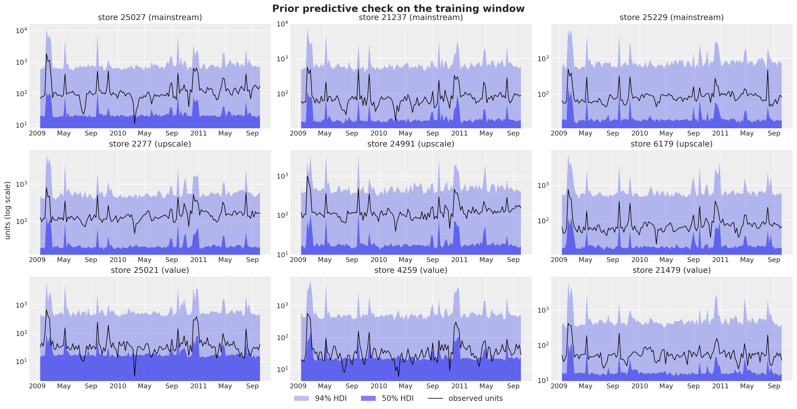</p>
</figure>


The prior predictive bands cover the observed units of every focus series with room to spare. One more prior check concerns the quantity the decisions turn on. In the following plot we draw, from the prior, the multiplier of the focal product's units at a 35\\ cut under feature with display, e^{b_m} (1 - d)^{\varepsilon_m}, and show its distribution on a log scale with its median and 94\\ HDI.


``` python
depth_check = 0.35
eps_prior = np.asarray(prior_draws["eps_prod"])[:, FOCAL_INDEX]
uplift_prior = np.exp(
    np.asarray(prior_draws["b_feat"])[:, FOCAL_INDEX]
    + np.asarray(prior_draws["b_disp"])[:, FOCAL_INDEX]
    + np.asarray(prior_draws["b_fd"])[:, FOCAL_INDEX]
)
eps_m_prior = (
    eps_prior
    - np.asarray(prior_draws["b_feat_depth"])[:, FOCAL_INDEX]
    - np.asarray(prior_draws["b_disp_depth"])[:, FOCAL_INDEX]
)
multiplier_prior = uplift_prior * (1.0 - depth_check) ** eps_m_prior
lower_m, upper_m = np.asarray(az.hdi(multiplier_prior, prob=0.94))

fig, ax = plt.subplots(figsize=(9, 4.5), layout="constrained")
ax.hist(multiplier_prior, bins=np.logspace(-1.5, 2.5, 60).tolist(), color="C0", alpha=0.8)
ax.axvline(
    float(np.median(multiplier_prior)),
    color="C3",
    linewidth=2,
    label=f"median {np.median(multiplier_prior):.1f}x",
)
ax.axvline(
    lower_m, color="C3", linestyle="--", label=f"$94\\%$ HDI {lower_m:.1f}x to {upper_m:.1f}x"
)
ax.axvline(upper_m, color="C3", linestyle="--")
ax.set_xscale("log")
ax.legend(loc="upper right")
ax.set(
    xlabel="prior multiplier of the units (log scale)",
    ylabel="prior draws",
    title=f"Prior multiplier of {FOCAL} at a {depth_check:.0%} cut with feature + display",
);
```


<figure class="figure">
<p></p>
</figure>


The prior implied multiplier has a median of 4.5 with a 94\\ HDI from 0.3 to 27.5: wide, as a prior should be, and centered on a plausible value.


# Model fit

The inference: a short SVI pass to choose the parameterization, then NUTS.


## Choosing the parameterization with SVI

As explained in the model section, the three centering values decide how the sampler sees the hierarchy, and NUTS cannot learn them. A mean-field variational approximation can: the ELBO of an `AutoNormal` guide depends on the parameterization, because a diagonal Gaussian fits one geometry better than the other. So we run a short SVI pass first, read the fitted centering values from the guide, and hand them to NUTS through `handlers.condition`, which fixes the three sites at those values. The guide's draws are used for nothing else. The next three cells run the pass, plot its loss as the convergence check, and show the learned values. How to read them: near 0 the non-centered form fits a mean-field Gaussian best, near 1 the centered form.


``` python
%%time

guide = AutoNormal(model, init_loc_fn=init_to_median)
svi = SVI(model, guide, Adam(step_size=0.01), Trace_ELBO())
rng_key, key_svi = random.split(rng_key)
svi_result = svi.run(key_svi, 5_000, covariates_train, y_train, progress_bar=False)
svi_losses = np.asarray(jax.block_until_ready(svi_result.losses))
```


    CPU times: user 26.5 s, sys: 13.4 s, total: 40 s
    Wall time: 13.1 s


In the following plot we show the loss of the pass, the negative ELBO, with the mean of its last 500 steps as the flatness check.


``` python
fig, ax = plt.subplots(figsize=(10, 4), layout="constrained")
ax.plot(svi_losses, color="C0", label="negative ELBO")
ax.axhline(
    svi_losses[-500:].mean(),
    color="C3",
    linestyle="--",
    label=f"mean of the last 500 steps: {svi_losses[-500:].mean():,.0f}",
)
ax.set_yscale("log")
ax.legend(loc="upper right")
ax.set(title="SVI pass that learns the centering values", xlabel="step", ylabel="negative ELBO");
```


<figure class="figure">
<p></p>
</figure>


The next cell reads the learned centering values and their 90\\ intervals from the guide, and conditions the model on them for NUTS.


``` python
centering_median = guide.median(svi_result.params)
centering_quantiles = guide.quantiles(svi_result.params, [0.05, 0.95])
centering_table = pl.DataFrame(
    {
        "site": CENTERING_SITES,
        "learned centering": [round(float(centering_median[name]), 2) for name in CENTERING_SITES],
        "q05": [round(float(centering_quantiles[name][0]), 2) for name in CENTERING_SITES],
        "q95": [round(float(centering_quantiles[name][1]), 2) for name in CENTERING_SITES],
    }
)
learned_centering: dict[str, ArrayLike] = {
    name: jnp.asarray(centering_median[name], dtype=jnp.float32) for name in CENTERING_SITES
}
# NUTS samples the model with the three centering sites fixed at the learned values.
nuts_model = handlers.condition(model, data=learned_centering)
centering_table
```


| site             | learned centering | q05  | q95  |
|------------------|-------------------|------|------|
| "centered_drift" | 0.34              | 0.33 | 0.34 |
| "centered_eps"   | 0.68              | 0.65 | 0.7  |
| "centered_gamma" | 0.4               | 0.36 | 0.45 |


The pass takes about 12 seconds of wall time for 5{,}000 Adam steps, and the negative ELBO is flat over the second half of the run. The learned values are 0.34 for the level innovations, 0.68 for the store elasticities and 0.40 for the cross terms, with 90\\ intervals of the guide from 0.33 to 0.34, from 0.65 to 0.70 and from 0.36 to 0.45: the innovations and the cross terms prefer the non-centered form, the store elasticities the centered one.


## Sampling with NUTS

We sample the posterior with NUTS: four chains of 1{,}000 warmup and 1{,}000 draws each, in parallel on four host devices, on the model conditioned on the learned centering values. Two settings matter. The initialization is `init_to_median`, because NumPyro's default uniform initialization in the unconstrained space can put the cumulative level of a series far outside the range where the negative binomial mean is finite. And we ask NUTS for the number of leapfrog steps of every iteration, which gives the tree depth: a sampler stuck at the depth cap of 10 is the sign of a badly conditioned posterior. The next cell fits the model and the one after it checks the divergences and the tree depths.


``` python
%%time

rng_key, key_fit = random.split(rng_key)
mcmc = MCMC(
    NUTS(nuts_model, target_accept_prob=0.9, init_strategy=init_to_median()),
    num_warmup=1_000,
    num_samples=1_000,
    num_chains=N_CHAINS,
    progress_bar=False,
)
mcmc.run(key_fit, covariates_train, y_train, extra_fields=("diverging", "num_steps"))
# The chains run asynchronously on the host devices; block on the draws so the wall time is real.
posterior = jax.block_until_ready(mcmc.get_samples())
assert not any(name in posterior for name in CENTERING_SITES), "the centering sites must be fixed"
n_draws = int(posterior["eps_prod"].shape[0])
```


    CPU times: user 1h 7s, sys: 14min 46s, total: 1h 14min 54s
    Wall time: 9min 2s


The next cell checks the sampler: the number of divergences and the tree depths of the iterations.


``` python
num_steps = np.asarray(mcmc.get_extra_fields()["num_steps"])
tree_depth = np.ceil(np.log2(num_steps + 1)).astype(int)
n_divergences = int(np.asarray(mcmc.get_extra_fields()["diverging"]).sum())
pl.DataFrame(
    {
        "posterior draws": [n_draws],
        "divergences": [n_divergences],
        "share at the depth-10 cap": [round(float(np.mean(num_steps == 1_023)), 3)],
        "min tree depth": [int(tree_depth.min())],
        "max tree depth": [int(tree_depth.max())],
    }
)
```


| posterior draws | divergences | share at the depth-10 cap | min tree depth | max tree depth |
|----|----|----|----|----|
| 4000 | 0 | 0.0 | 8 | 8 |


The fit takes about 9 minutes of wall time, with no divergences and every iteration at tree depth 8, so the depth cap is never reached.


## Convergence diagnostics

The next cell exports the posterior, the in-sample predictive and the holdout forecast into one ArviZ tree with named coordinates, so that the ArviZ diagnostics and plots below work with product and series labels. We then check convergence with \hat R and the bulk effective sample size, first in the summary of the product-level parameters and the two hyperparameters, then reduced to the worst values over every site, and with the trace plots of the six hyperparameters. The centering values are constants of the NUTS run, so they do not appear.


``` python
coords = {
    "series": series_ids,
    "obs_dim": series_ids,
    "product": product_order,
    "competitor": product_order,
    "pair": pair_labels,
    "fourier": fourier_names,
    "input": input_names,
}
product_sites = [
    "eps_prod",
    "conc",
    "b_feat",
    "b_disp",
    "b_fd",
    "b_feat_depth",
    "b_disp_depth",
    "b_sib_feat",
    "b_sib_disp",
]
posterior_dims = {
    "level0": ["series"],
    "drift_scale": ["series"],
    "eps": ["series"],
    "eps_decentered": ["series"],
    "drift": ["time", "series"],
    "drift_decentered": ["time", "series"],
    **{site: ["product"] for site in product_sites},
    "beta_s": ["fourier", "product"],
    "gamma": ["competitor", "product"],
    "gamma_offdiag": ["pair"],
    "gamma_offdiag_decentered": ["pair"],
}
rng_key, key_tree = random.split(rng_key)
tree = to_datatree(
    key_tree,
    nuts_model,
    posterior,
    y_train,
    covariates,
    num_chains=N_CHAINS,
    time_coord=list(dates),
    covariate_dims=["input", "time", "series"],
    coords=coords,
    posterior_dims=posterior_dims,
)
tree
```


![]() <style>/* CSS stylesheet for displaying xarray objects in notebooks */

:root {
  --xr-font-color0: var(
    --jp-content-font-color0,
    var(--pst-color-text-base rgba(0, 0, 0, 1))
  );
  --xr-font-color2: var(
    --jp-content-font-color2,
    var(--pst-color-text-base, rgba(0, 0, 0, 0.54))
  );
  --xr-font-color3: var(
    --jp-content-font-color3,
    var(--pst-color-text-base, rgba(0, 0, 0, 0.38))
  );
  --xr-border-color: var(
    --jp-border-color2,
    hsl(from var(--pst-color-on-background, white) h s calc(l - 10))
  );
  --xr-disabled-color: var(
    --jp-layout-color3,
    hsl(from var(--pst-color-on-background, white) h s calc(l - 40))
  );
  --xr-background-color: var(
    --jp-layout-color0,
    var(--pst-color-on-background, white)
  );
  --xr-background-color-row-even: var(
    --jp-layout-color1,
    hsl(from var(--pst-color-on-background, white) h s calc(l - 5))
  );
  --xr-background-color-row-odd: var(
    --jp-layout-color2,
    hsl(from var(--pst-color-on-background, white) h s calc(l - 15))
  );
}

html[theme="dark"],
html[data-theme="dark"],
body[data-theme="dark"],
body.vscode-dark {
  --xr-font-color0: var(
    --jp-content-font-color0,
    var(--pst-color-text-base, rgba(255, 255, 255, 1))
  );
  --xr-font-color2: var(
    --jp-content-font-color2,
    var(--pst-color-text-base, rgba(255, 255, 255, 0.54))
  );
  --xr-font-color3: var(
    --jp-content-font-color3,
    var(--pst-color-text-base, rgba(255, 255, 255, 0.38))
  );
  --xr-border-color: var(
    --jp-border-color2,
    hsl(from var(--pst-color-on-background, #111111) h s calc(l + 10))
  );
  --xr-disabled-color: var(
    --jp-layout-color3,
    hsl(from var(--pst-color-on-background, #111111) h s calc(l + 40))
  );
  --xr-background-color: var(
    --jp-layout-color0,
    var(--pst-color-on-background, #111111)
  );
  --xr-background-color-row-even: var(
    --jp-layout-color1,
    hsl(from var(--pst-color-on-background, #111111) h s calc(l + 5))
  );
  --xr-background-color-row-odd: var(
    --jp-layout-color2,
    hsl(from var(--pst-color-on-background, #111111) h s calc(l + 15))
  );
}

.xr-wrap {
  display: block !important;
  min-width: 300px;
  max-width: 700px;
  line-height: 1.6;
  padding-bottom: 4px;
}

.xr-text-repr-fallback {
  /* fallback to plain text repr when CSS is not injected (untrusted notebook) */
  display: none;
}

.xr-header {
  padding-top: 6px;
  padding-bottom: 6px;
}

.xr-header {
  border-bottom: solid 1px var(--xr-border-color);
  margin-bottom: 4px;
}

.xr-header > div,
.xr-header > ul {
  display: inline;
  margin-top: 0;
  margin-bottom: 0;
}

.xr-obj-type,
.xr-obj-name {
  margin-left: 2px;
  margin-right: 10px;
}

.xr-obj-type,
.xr-group-box-contents > label {
  color: var(--xr-font-color2);
  display: block;
}

.xr-sections {
  padding-left: 0 !important;
  display: grid;
  grid-template-columns: 150px auto auto 1fr 0 20px 0 20px;
  margin-block-start: 0;
  margin-block-end: 0;
}

.xr-section-item {
  display: contents;
}

.xr-section-item > input,
.xr-group-box-contents > input,
.xr-array-wrap > input {
  display: block;
  opacity: 0;
  height: 0;
  margin: 0;
}

.xr-section-item > input + label,
.xr-var-item > input + label {
  color: var(--xr-disabled-color);
}

.xr-section-item > input:enabled + label,
.xr-var-item > input:enabled + label,
.xr-array-wrap > input:enabled + label,
.xr-group-box-contents > input:enabled + label {
  cursor: pointer;
  color: var(--xr-font-color2);
}

.xr-section-item > input:focus-visible + label,
.xr-var-item > input:focus-visible + label,
.xr-array-wrap > input:focus-visible + label,
.xr-group-box-contents > input:focus-visible + label {
  outline: auto;
}

.xr-section-item > input:enabled + label:hover,
.xr-var-item > input:enabled + label:hover,
.xr-array-wrap > input:enabled + label:hover,
.xr-group-box-contents > input:enabled + label:hover {
  color: var(--xr-font-color0);
}

.xr-section-summary {
  grid-column: 1;
  color: var(--xr-font-color2);
  font-weight: 500;
  white-space: nowrap;
}

.xr-section-summary > em {
  font-weight: normal;
}

.xr-span-grid {
  grid-column-end: -1;
}

.xr-section-summary > span {
  display: inline-block;
  padding-left: 0.3em;
}

.xr-group-box-contents > input:checked + label > span {
  display: inline-block;
  padding-left: 0.6em;
}

.xr-section-summary-in:disabled + label {
  color: var(--xr-font-color2);
}

.xr-section-summary-in + label:before {
  display: inline-block;
  content: "►";
  font-size: 11px;
  width: 15px;
  text-align: center;
}

.xr-section-summary-in:disabled + label:before {
  color: var(--xr-disabled-color);
}

.xr-section-summary-in:checked + label:before {
  content: "▼";
}

.xr-section-summary-in:checked + label > span {
  display: none;
}

.xr-section-summary,
.xr-section-inline-details,
.xr-group-box-contents > label {
  padding-top: 4px;
}

.xr-section-inline-details {
  grid-column: 2 / -1;
}

.xr-section-details {
  grid-column: 1 / -1;
  margin-top: 4px;
  margin-bottom: 5px;
}

.xr-section-summary-in ~ .xr-section-details {
  display: none;
}

.xr-section-summary-in:checked ~ .xr-section-details {
  display: contents;
}

.xr-children {
  display: inline-grid;
  grid-template-columns: 100%;
  grid-column: 1 / -1;
  padding-top: 4px;
}

.xr-group-box {
  display: inline-grid;
  grid-template-columns: 0px 30px auto;
}

.xr-group-box-vline {
  grid-column-start: 1;
  border-right: 0.2em solid;
  border-color: var(--xr-border-color);
  width: 0px;
}

.xr-group-box-hline {
  grid-column-start: 2;
  grid-row-start: 1;
  height: 1em;
  width: 26px;
  border-bottom: 0.2em solid;
  border-color: var(--xr-border-color);
}

.xr-group-box-contents {
  grid-column-start: 3;
  padding-bottom: 4px;
}

.xr-group-box-contents > label::before {
  content: "📂";
  padding-right: 0.3em;
}

.xr-group-box-contents > input:checked + label::before {
  content: "📁";
}

.xr-group-box-contents > input:checked + label {
  padding-bottom: 0px;
}

.xr-group-box-contents > input:checked ~ .xr-sections {
  display: none;
}

.xr-group-box-contents > input + label > span {
  display: none;
}

.xr-group-box-ellipsis {
  font-size: 1.4em;
  font-weight: 900;
  color: var(--xr-font-color2);
  letter-spacing: 0.15em;
  cursor: default;
}

.xr-array-wrap {
  grid-column: 1 / -1;
  display: grid;
  grid-template-columns: 20px auto;
}

.xr-array-wrap > label {
  grid-column: 1;
  vertical-align: top;
}

.xr-preview {
  color: var(--xr-font-color3);
}

.xr-array-preview,
.xr-array-data {
  padding: 0 5px !important;
  grid-column: 2;
}

.xr-array-data,
.xr-array-in:checked ~ .xr-array-preview {
  display: none;
}

.xr-array-in:checked ~ .xr-array-data,
.xr-array-preview {
  display: inline-block;
}

.xr-dim-list {
  display: inline-block !important;
  list-style: none;
  padding: 0 !important;
  margin: 0;
}

.xr-dim-list li {
  display: inline-block;
  padding: 0;
  margin: 0;
}

.xr-dim-list:before {
  content: "(";
}

.xr-dim-list:after {
  content: ")";
}

.xr-dim-list li:not(:last-child):after {
  content: ",";
  padding-right: 5px;
}

.xr-has-index {
  font-weight: bold;
}

.xr-var-list,
.xr-var-item {
  display: contents;
}

.xr-var-item > div,
.xr-var-item label,
.xr-var-item > .xr-var-name span {
  background-color: var(--xr-background-color-row-even);
  border-color: var(--xr-background-color-row-odd);
  margin-bottom: 0;
  padding-top: 2px;
}

.xr-var-item > .xr-var-name:hover span {
  padding-right: 5px;
}

.xr-var-list > li:nth-child(odd) > div,
.xr-var-list > li:nth-child(odd) > label,
.xr-var-list > li:nth-child(odd) > .xr-var-name span {
  background-color: var(--xr-background-color-row-odd);
  border-color: var(--xr-background-color-row-even);
}

.xr-var-name {
  grid-column: 1;
}

.xr-var-dims {
  grid-column: 2;
}

.xr-var-dtype {
  grid-column: 3;
  text-align: right;
  color: var(--xr-font-color2);
}

.xr-var-preview {
  grid-column: 4;
}

.xr-index-preview {
  grid-column: 2 / 5;
  color: var(--xr-font-color2);
}

.xr-var-name,
.xr-var-dims,
.xr-var-dtype,
.xr-preview,
.xr-attrs dt {
  white-space: nowrap;
  overflow: hidden;
  text-overflow: ellipsis;
  padding-right: 10px;
}

.xr-var-name:hover,
.xr-var-dims:hover,
.xr-var-dtype:hover,
.xr-attrs dt:hover {
  overflow: visible;
  width: auto;
  z-index: 1;
}

.xr-var-attrs,
.xr-var-data,
.xr-index-data {
  display: none;
  border-top: 2px dotted var(--xr-background-color);
  padding-bottom: 20px !important;
  padding-top: 10px !important;
}

.xr-var-attrs-in + label,
.xr-var-data-in + label,
.xr-index-data-in + label {
  padding: 0 1px;
}

.xr-var-attrs-in:checked ~ .xr-var-attrs,
.xr-var-data-in:checked ~ .xr-var-data,
.xr-index-data-in:checked ~ .xr-index-data {
  display: block;
}

.xr-var-data > table {
  float: right;
}

.xr-var-data > pre,
.xr-index-data > pre,
.xr-var-data > table > tbody > tr {
  background-color: transparent !important;
}

.xr-var-name span,
.xr-var-data,
.xr-index-name div,
.xr-index-data,
.xr-attrs {
  padding-left: 25px !important;
}

.xr-attrs,
.xr-var-attrs,
.xr-var-data,
.xr-index-data {
  grid-column: 1 / -1;
}

dl.xr-attrs {
  padding: 0;
  margin: 0;
  display: grid;
  grid-template-columns: 125px auto;
}

.xr-attrs dt,
.xr-attrs dd {
  padding: 0;
  margin: 0;
  float: left;
  padding-right: 10px;
  width: auto;
}

.xr-attrs dt {
  font-weight: normal;
  grid-column: 1;
}

.xr-attrs dt:hover span {
  display: inline-block;
  background: var(--xr-background-color);
  padding-right: 10px;
}

.xr-attrs dd {
  grid-column: 2;
  white-space: pre-wrap;
  word-break: break-all;
}

.xr-icon-database,
.xr-icon-file-text2,
.xr-no-icon {
  display: inline-block;
  vertical-align: middle;
  width: 1em;
  height: 1.5em !important;
  stroke-width: 0;
  stroke: currentColor;
  fill: currentColor;
}

.xr-var-attrs-in:checked + label > .xr-icon-file-text2,
.xr-var-data-in:checked + label > .xr-icon-database,
.xr-index-data-in:checked + label > .xr-icon-database {
  color: var(--xr-font-color0);
  filter: drop-shadow(1px 1px 5px var(--xr-font-color2));
  stroke-width: 0.8px;
}
</style>

``` xr-text-repr-fallback
<xarray.DataTree>
Group: /
│   Attributes:
│       inference_library:  numpyro
│       creation_library:   numpyro_forecast
│       sample_dims:        ['chain', 'draw']
├── Group: /posterior
│       Dimensions:                   (chain: 4, draw: 1000, product: 6, fourier: 4,
│                                      time: 143, series: 108, competitor: 6, pair: 30)
│       Coordinates:
│         * chain                     (chain) int64 32B 0 1 2 3
│         * draw                      (draw) int64 8kB 0 1 2 3 4 ... 995 996 997 998 999
│         * product                   (product) <U17 408B 'hnc' ... 'pl frosted wheat'
│         * fourier                   (fourier) <U4 64B 'sin1' 'sin2' 'cos1' 'cos2'
│         * time                      (time) datetime64[s] 1kB 2009-01-14 ... 2011-10-05
│         * series                    (series) <U24 10kB '25027::hnc' ... '6431::pl f...
│         * competitor                (competitor) <U17 408B 'hnc' ... 'pl frosted wh...
│         * pair                      (pair) <U37 4kB 'hnc -> cheerios 12oz' ... 'pl ...
│       Data variables: (12/21)
│           b_disp                    (chain, draw, product) float32 96kB 0.3477 ... ...
│           b_disp_depth              (chain, draw, product) float32 96kB 0.02322 ......
│           b_fd                      (chain, draw, product) float32 96kB -0.008784 ....
│           b_feat                    (chain, draw, product) float32 96kB 0.7151 ... ...
│           b_feat_depth              (chain, draw, product) float32 96kB 0.0999 ... ...
│           b_sib_disp                (chain, draw, product) float32 96kB -0.03096 .....
│           ...                        ...
│           eps_prod                  (chain, draw, product) float32 96kB -1.288 ... ...
│           eps_scale                 (chain, draw) float32 16kB 0.3592 ... 0.3343
│           gamma                     (chain, draw, competitor, product) float32 576kB ...
│           gamma_offdiag             (chain, draw, pair) float32 480kB 0.08433 ... 0...
│           gamma_offdiag_decentered  (chain, draw, pair) float32 480kB 0.1905 ... 0....
│           level0                    (chain, draw, series) float32 2MB 4.518 ... 2.661
│       Attributes:
│           created_at:                 2026-09-11T18:35:34.495590+00:00
│           creation_library:           ArviZ
│           creation_library_version:   1.2.0
│           creation_library_language:  Python
│           sample_dims:                ['chain', 'draw']
├── Group: /posterior_predictive
│       Dimensions:  (chain: 4, draw: 1000, time: 143, obs_dim: 108)
│       Coordinates:
│         * chain    (chain) int64 32B 0 1 2 3
│         * draw     (draw) int64 8kB 0 1 2 3 4 5 6 7 ... 993 994 995 996 997 998 999
│         * time     (time) datetime64[s] 1kB 2009-01-14 2009-01-21 ... 2011-10-05
│         * obs_dim  (obs_dim) <U24 10kB '25027::hnc' ... '6431::pl frosted wheat'
│       Data variables:
│           obs      (chain, draw, time, obs_dim) int32 247MB 78 143 58 44 ... 17 5 23
│       Attributes:
│           created_at:                 2026-09-11T18:35:46.121965+00:00
│           creation_library:           ArviZ
│           creation_library_version:   1.2.0
│           creation_library_language:  Python
│           sample_dims:                ['chain', 'draw']
├── Group: /observed_data
│       Dimensions:  (time: 143, obs_dim: 108)
│       Coordinates:
│         * time     (time) datetime64[s] 1kB 2009-01-14 2009-01-21 ... 2011-10-05
│         * obs_dim  (obs_dim) <U24 10kB '25027::hnc' ... '6431::pl frosted wheat'
│       Data variables:
│           obs      (time, obs_dim) int32 62kB 70 181 69 46 50 100 ... 19 20 18 14 18
│       Attributes:
│           created_at:                 2026-09-11T18:35:46.123254+00:00
│           creation_library:           ArviZ
│           creation_library_version:   1.2.0
│           creation_library_language:  Python
│           sample_dims:                []
├── Group: /constant_data
│       Dimensions:     (input: 11, time: 143, series: 108)
│       Coordinates:
│         * input       (input) <U23 1kB 'x' 'feature' ... 'price pl frosted wheat'
│         * time        (time) datetime64[s] 1kB 2009-01-14 2009-01-21 ... 2011-10-05
│         * series      (series) <U24 10kB '25027::hnc' ... '6431::pl frosted wheat'
│       Data variables:
│           covariates  (input, time, series) float32 680kB 0.0 -0.2239 0.0 ... 0.0 0.0
│       Attributes:
│           created_at:                 2026-09-11T18:35:46.124106+00:00
│           creation_library:           ArviZ
│           creation_library_version:   1.2.0
│           creation_library_language:  Python
│           sample_dims:                []
├── Group: /predictions
│       Dimensions:  (chain: 4, draw: 1000, time: 13, obs_dim: 108)
│       Coordinates:
│         * chain    (chain) int64 32B 0 1 2 3
│         * draw     (draw) int64 8kB 0 1 2 3 4 5 6 7 ... 993 994 995 996 997 998 999
│         * time     (time) datetime64[s] 104B 2011-10-12 2011-10-19 ... 2012-01-04
│         * obs_dim  (obs_dim) <U24 10kB '25027::hnc' ... '6431::pl frosted wheat'
│       Data variables:
│           obs      (chain, draw, time, obs_dim) int32 22MB 127 63 79 67 ... 15 11 6 26
│       Attributes:
│           created_at:                 2026-09-11T18:35:48.731920+00:00
│           creation_library:           ArviZ
│           creation_library_version:   1.2.0
│           creation_library_language:  Python
│           sample_dims:                ['chain', 'draw']
└── Group: /predictions_constant_data
        Dimensions:     (input: 11, time: 13, series: 108)
        Coordinates:
          * input       (input) <U23 1kB 'x' 'feature' ... 'price pl frosted wheat'
          * time        (time) datetime64[s] 104B 2011-10-12 2011-10-19 ... 2012-01-04
          * series      (series) <U24 10kB '25027::hnc' ... '6431::pl frosted wheat'
        Data variables:
            covariates  (input, time, series) float32 62kB 0.0 0.0 0.0 ... 0.0 0.0 0.0
        Attributes:
            created_at:                 2026-09-11T18:35:48.732533+00:00
            creation_library:           ArviZ
            creation_library_version:   1.2.0
            creation_library_language:  Python
            sample_dims:                []
```


xarray.DataTree


/posterior(34)

Dimensions:


- chain: 4
- draw: 1000
- product: 6
- fourier: 4
- time: 143
- series: 108
- competitor: 6
- pair: 30


Coordinates: (8)


chain


(chain)


int64


0 1 2 3


    array([0, 1, 2, 3])


draw


(draw)


int64


0 1 2 3 4 5 ... 995 996 997 998 999


    array([  0,   1,   2, ..., 997, 998, 999], shape=(1000,))


product


(product)


\<U17


'hnc' ... 'pl frosted wheat'


    array(['hnc', 'cheerios 12oz', 'cheerios 18oz', 'mini wheats','pl honey nut oats', 'pl frosted wheat'], dtype='<U17')


fourier


(fourier)


\<U4


'sin1' 'sin2' 'cos1' 'cos2'


    array(['sin1', 'sin2', 'cos1', 'cos2'], dtype='<U4')


time


(time)


datetime64\[s\]


2009-01-14 ... 2011-10-05


    array(['2009-01-14T00:00:00', '2009-01-21T00:00:00', '2009-01-28T00:00:00','2009-02-04T00:00:00', '2009-02-11T00:00:00', '2009-02-18T00:00:00','2009-02-25T00:00:00', '2009-03-04T00:00:00', '2009-03-11T00:00:00','2009-03-18T00:00:00', '2009-03-25T00:00:00', '2009-04-01T00:00:00','2009-04-08T00:00:00', '2009-04-15T00:00:00', '2009-04-22T00:00:00','2009-04-29T00:00:00', '2009-05-06T00:00:00', '2009-05-13T00:00:00','2009-05-20T00:00:00', '2009-05-27T00:00:00', '2009-06-03T00:00:00','2009-06-10T00:00:00', '2009-06-17T00:00:00', '2009-06-24T00:00:00','2009-07-01T00:00:00', '2009-07-08T00:00:00', '2009-07-15T00:00:00','2009-07-22T00:00:00', '2009-07-29T00:00:00', '2009-08-05T00:00:00','2009-08-12T00:00:00', '2009-08-19T00:00:00', '2009-08-26T00:00:00','2009-09-02T00:00:00', '2009-09-09T00:00:00', '2009-09-16T00:00:00','2009-09-23T00:00:00', '2009-09-30T00:00:00', '2009-10-07T00:00:00','2009-10-14T00:00:00', '2009-10-21T00:00:00', '2009-10-28T00:00:00','2009-11-04T00:00:00', '2009-11-11T00:00:00', '2009-11-18T00:00:00','2009-11-25T00:00:00', '2009-12-02T00:00:00', '2009-12-09T00:00:00','2009-12-16T00:00:00', '2009-12-23T00:00:00', '2009-12-30T00:00:00','2010-01-06T00:00:00', '2010-01-13T00:00:00', '2010-01-20T00:00:00','2010-01-27T00:00:00', '2010-02-03T00:00:00', '2010-02-10T00:00:00','2010-02-17T00:00:00', '2010-02-24T00:00:00', '2010-03-03T00:00:00','2010-03-10T00:00:00', '2010-03-17T00:00:00', '2010-03-24T00:00:00','2010-03-31T00:00:00', '2010-04-07T00:00:00', '2010-04-14T00:00:00','2010-04-21T00:00:00', '2010-04-28T00:00:00', '2010-05-05T00:00:00','2010-05-12T00:00:00', '2010-05-19T00:00:00', '2010-05-26T00:00:00','2010-06-02T00:00:00', '2010-06-09T00:00:00', '2010-06-16T00:00:00','2010-06-23T00:00:00', '2010-06-30T00:00:00', '2010-07-07T00:00:00','2010-07-14T00:00:00', '2010-07-21T00:00:00', '2010-07-28T00:00:00','2010-08-04T00:00:00', '2010-08-11T00:00:00', '2010-08-18T00:00:00','2010-08-25T00:00:00', '2010-09-01T00:00:00', '2010-09-08T00:00:00','2010-09-15T00:00:00', '2010-09-22T00:00:00', '2010-09-29T00:00:00','2010-10-06T00:00:00', '2010-10-13T00:00:00', '2010-10-20T00:00:00','2010-10-27T00:00:00', '2010-11-03T00:00:00', '2010-11-10T00:00:00','2010-11-17T00:00:00', '2010-11-24T00:00:00', '2010-12-01T00:00:00','2010-12-08T00:00:00', '2010-12-15T00:00:00', '2010-12-22T00:00:00','2010-12-29T00:00:00', '2011-01-05T00:00:00', '2011-01-12T00:00:00','2011-01-19T00:00:00', '2011-01-26T00:00:00', '2011-02-02T00:00:00','2011-02-09T00:00:00', '2011-02-16T00:00:00', '2011-02-23T00:00:00','2011-03-02T00:00:00', '2011-03-09T00:00:00', '2011-03-16T00:00:00','2011-03-23T00:00:00', '2011-03-30T00:00:00', '2011-04-06T00:00:00','2011-04-13T00:00:00', '2011-04-20T00:00:00', '2011-04-27T00:00:00','2011-05-04T00:00:00', '2011-05-11T00:00:00', '2011-05-18T00:00:00','2011-05-25T00:00:00', '2011-06-01T00:00:00', '2011-06-08T00:00:00','2011-06-15T00:00:00', '2011-06-22T00:00:00', '2011-06-29T00:00:00','2011-07-06T00:00:00', '2011-07-13T00:00:00', '2011-07-20T00:00:00','2011-07-27T00:00:00', '2011-08-03T00:00:00', '2011-08-10T00:00:00','2011-08-17T00:00:00', '2011-08-24T00:00:00', '2011-08-31T00:00:00','2011-09-07T00:00:00', '2011-09-14T00:00:00', '2011-09-21T00:00:00','2011-09-28T00:00:00', '2011-10-05T00:00:00'], dtype='datetime64[s]')


series


(series)


\<U24


'25027::hnc' ... '6431::pl frost...


    array(['25027::hnc', '25027::cheerios 12oz', '25027::cheerios 18oz','25027::mini wheats', '25027::pl honey nut oats','25027::pl frosted wheat', '21237::hnc', '21237::cheerios 12oz','21237::cheerios 18oz', '21237::mini wheats','21237::pl honey nut oats', '21237::pl frosted wheat', '25229::hnc','25229::cheerios 12oz', '25229::cheerios 18oz', '25229::mini wheats','25229::pl honey nut oats', '25229::pl frosted wheat', '19265::hnc','19265::cheerios 12oz', '19265::cheerios 18oz', '19265::mini wheats','19265::pl honey nut oats', '19265::pl frosted wheat', '9825::hnc','9825::cheerios 12oz', '9825::cheerios 18oz', '9825::mini wheats','9825::pl honey nut oats', '9825::pl frosted wheat', '613::hnc','613::cheerios 12oz', '613::cheerios 18oz', '613::mini wheats','613::pl honey nut oats', '613::pl frosted wheat', '2277::hnc','2277::cheerios 12oz', '2277::cheerios 18oz', '2277::mini wheats','2277::pl honey nut oats', '2277::pl frosted wheat', '24991::hnc','24991::cheerios 12oz', '24991::cheerios 18oz', '24991::mini wheats','24991::pl honey nut oats', '24991::pl frosted wheat', '6179::hnc','6179::cheerios 12oz', '6179::cheerios 18oz', '6179::mini wheats','6179::pl honey nut oats', '6179::pl frosted wheat', '2513::hnc','2513::cheerios 12oz', '2513::cheerios 18oz', '2513::mini wheats','2513::pl honey nut oats', '2513::pl frosted wheat', '2281::hnc','2281::cheerios 12oz', '2281::cheerios 18oz', '2281::mini wheats','2281::pl honey nut oats', '2281::pl frosted wheat', '11993::hnc','11993::cheerios 12oz', '11993::cheerios 18oz', '11993::mini wheats','11993::pl honey nut oats', '11993::pl frosted wheat', '25021::hnc','25021::cheerios 12oz', '25021::cheerios 18oz', '25021::mini wheats','25021::pl honey nut oats', '25021::pl frosted wheat', '4259::hnc','4259::cheerios 12oz', '4259::cheerios 18oz', '4259::mini wheats','4259::pl honey nut oats', '4259::pl frosted wheat', '21479::hnc','21479::cheerios 12oz', '21479::cheerios 18oz', '21479::mini wheats','21479::pl honey nut oats', '21479::pl frosted wheat', '23349::hnc','23349::cheerios 12oz', '23349::cheerios 18oz', '23349::mini wheats','23349::pl honey nut oats', '23349::pl frosted wheat', '19523::hnc','19523::cheerios 12oz', '19523::cheerios 18oz', '19523::mini wheats','19523::pl honey nut oats', '19523::pl frosted wheat', '6431::hnc','6431::cheerios 12oz', '6431::cheerios 18oz', '6431::mini wheats','6431::pl honey nut oats', '6431::pl frosted wheat'], dtype='<U24')


competitor


(competitor)


\<U17


'hnc' ... 'pl frosted wheat'


    array(['hnc', 'cheerios 12oz', 'cheerios 18oz', 'mini wheats','pl honey nut oats', 'pl frosted wheat'], dtype='<U17')


pair


(pair)


\<U37


'hnc -\> cheerios 12oz' ... 'pl f...


    array(['hnc -> cheerios 12oz', 'hnc -> cheerios 18oz', 'hnc -> mini wheats','hnc -> pl honey nut oats', 'hnc -> pl frosted wheat','cheerios 12oz -> hnc', 'cheerios 12oz -> cheerios 18oz','cheerios 12oz -> mini wheats', 'cheerios 12oz -> pl honey nut oats','cheerios 12oz -> pl frosted wheat', 'cheerios 18oz -> hnc','cheerios 18oz -> cheerios 12oz', 'cheerios 18oz -> mini wheats','cheerios 18oz -> pl honey nut oats','cheerios 18oz -> pl frosted wheat', 'mini wheats -> hnc','mini wheats -> cheerios 12oz', 'mini wheats -> cheerios 18oz','mini wheats -> pl honey nut oats', 'mini wheats -> pl frosted wheat','pl honey nut oats -> hnc', 'pl honey nut oats -> cheerios 12oz','pl honey nut oats -> cheerios 18oz','pl honey nut oats -> mini wheats','pl honey nut oats -> pl frosted wheat', 'pl frosted wheat -> hnc','pl frosted wheat -> cheerios 12oz','pl frosted wheat -> cheerios 18oz', 'pl frosted wheat -> mini wheats','pl frosted wheat -> pl honey nut oats'], dtype='<U37')


Data variables: (21)


b_disp


(chain, draw, product)


float32


0.3477 0.4935 ... 0.1949 0.1805


    array([[[0.34773085, 0.49348217, 0.27522337, 0.30727583, 0.25753045,0.17186013],[0.2625237 , 0.54450285, 0.26553735, 0.35188052, 0.25516424,0.09797946],[0.44486567, 0.35953763, 0.22663724, 0.3223083 , 0.2614633 ,0.06090789],...,[0.35233048, 0.5329018 , 0.35533115, 0.31053233, 0.2684323 ,0.20261817],[0.2993334 , 0.48728138, 0.27694258, 0.19875106, 0.25584832,0.13688876],[0.31084704, 0.5188536 , 0.28641823, 0.19654584, 0.2086519 ,0.12900114]],[[0.35191622, 0.46447873, 0.3397524 , 0.3378468 , 0.21968639,0.12661648],[0.3343152 , 0.43740377, 0.32911408, 0.34962678, 0.2374647 ,0.07937113],[0.25042447, 0.44507137, 0.19057451, 0.39917713, 0.28841463,0.23659474],...[0.34722885, 0.45346734, 0.30838877, 0.25864482, 0.28794175,0.14839414],[0.3485388 , 0.5028759 , 0.18151605, 0.26028255, 0.26929972,0.10134724],[0.31174004, 0.36825445, 0.24127106, 0.3713522 , 0.22236417,0.14935474]],[[0.3272174 , 0.5119976 , 0.19150054, 0.37480804, 0.23784977,0.18707772],[0.37398154, 0.43265113, 0.25265726, 0.26541394, 0.2608967 ,0.29711625],[0.37555555, 0.4298903 , 0.2237953 , 0.25993565, 0.27471286,0.28929985],...,[0.3672666 , 0.39965782, 0.34150228, 0.18843606, 0.23850068,0.20785463],[0.3539115 , 0.5046107 , 0.21104904, 0.22936773, 0.18352434,0.208991  ],[0.36116844, 0.46973595, 0.179784  , 0.23641565, 0.19491722,0.180473  ]]], shape=(4, 1000, 6), dtype=float32)


b_disp_depth


(chain, draw, product)


float32


0.02322 -0.02404 ... -0.827 0.311


    array([[[ 2.32249163e-02, -2.40369067e-02,  1.98521353e-02,5.69017231e-01, -1.17148352e+00,  6.98760897e-02],[ 9.84016284e-02,  1.02831334e-01, -1.92799345e-02,1.30117655e-01, -1.06029177e+00,  7.58533120e-01],[-1.98419005e-01,  2.50213534e-01,  2.16149509e-01,3.94648790e-01, -1.02057242e+00,  8.02103639e-01],...,[ 6.19826838e-02, -2.56464332e-01, -2.67371356e-01,3.14609632e-02, -1.35214937e+00,  2.86838442e-01],[ 1.58694059e-01, -2.08421513e-01, -1.08014885e-03,7.19189644e-01, -8.31043839e-01,  6.87438548e-01],[ 7.19054863e-02, -2.12933779e-01, -6.62823915e-02,5.72099090e-01, -4.99062806e-01,  9.94439185e-01]],[[ 3.15620750e-02, -1.33393289e-04, -1.11998096e-01,5.39396051e-03, -1.18735421e+00,  8.59890223e-01],[ 3.54047609e-03,  1.79688688e-02, -2.09825128e-01,1.57450095e-01, -1.18887484e+00,  9.73590195e-01],[ 1.93573311e-01, -8.79705176e-02,  2.34314203e-01,1.28638744e-01, -1.18564808e+00,  1.11295573e-01],...5.11635125e-01, -1.65161419e+00,  5.06985843e-01],[ 1.94389224e-01, -2.01864764e-01,  1.62917435e-01,3.33421707e-01, -1.18821824e+00,  5.77893913e-01],[-1.29082650e-02,  2.09139645e-01,  2.67838478e-01,1.87302269e-02, -1.06110334e+00,  5.61517954e-01]],[[-1.02424109e-02, -1.23456001e-01,  3.07402443e-02,2.63450742e-01, -1.08139205e+00,  2.76850402e-01],[-6.65291920e-02,  2.38863062e-02, -3.43666524e-02,3.05076867e-01, -1.11810899e+00, -2.77678937e-01],[-6.89797476e-02, -2.04746192e-03,  1.27036273e-02,2.98669100e-01, -1.01841533e+00, -3.36604238e-01],...,[-6.08202480e-02,  2.27936909e-01,  1.46912439e-02,1.04459691e+00, -6.75982833e-01,  7.73380324e-02],[ 8.82240981e-02,  2.62177065e-02,  1.93312734e-01,3.57237548e-01, -4.84646291e-01,  4.96310979e-01],[ 2.55995899e-01, -1.15654878e-02,  2.66615182e-01,4.19718474e-01, -8.27018261e-01,  3.11047018e-01]]],shape=(4, 1000, 6), dtype=float32)


b_fd


(chain, draw, product)


float32


-0.008784 0.002363 ... -0.03091


    array([[[-8.78449809e-03,  2.36297306e-03, -2.87444383e-01,-1.66922241e-01, -1.49339795e-01, -4.66392143e-03],[ 4.89720367e-02, -2.00545862e-01, -2.46991754e-01,5.64616658e-02, -5.80288097e-02,  3.67208533e-02],[-6.99481294e-02,  5.27680032e-02, -3.56992483e-01,-2.98428815e-02, -6.61896467e-02,  8.66410658e-02],...,[-9.52347815e-02, -7.00070113e-02, -2.42631644e-01,6.93727806e-02, -1.58779666e-01, -3.65172774e-02],[ 5.28283529e-02, -4.71871197e-02, -3.06243360e-01,3.08625679e-02, -1.29174426e-01, -6.34682402e-02],[ 4.47809920e-02, -6.51142597e-02, -2.98262626e-01,8.60592648e-02, -5.47785908e-02, -2.07895618e-02]],[[ 4.81171440e-03, -3.51405144e-02, -3.21809083e-01,9.95032638e-02,  1.43969555e-05, -2.85550971e-02],[ 1.37156937e-02, -1.25701711e-01, -2.32675344e-01,-1.63026936e-02, -1.59705225e-02, -2.18154513e-03],[-1.19896801e-02, -1.58898607e-02, -3.07959586e-01,2.32765544e-02, -6.58540204e-02, -9.52693634e-03],...3.80751281e-03,  9.61927325e-02, -4.79464345e-02],[-5.85765839e-02, -1.99867599e-02, -2.67241776e-01,6.54485300e-02, -1.00553289e-01, -9.01094172e-03],[ 3.39477547e-02, -6.80642501e-02, -3.94845486e-01,3.67844887e-02,  4.84925173e-02,  4.52702381e-02]],[[ 3.99338342e-02, -1.17206700e-01, -2.39752769e-01,-8.26116651e-02, -3.77067663e-02, -7.28122052e-03],[-3.29608954e-02, -3.14689465e-02, -2.07541063e-01,4.07780856e-02, -2.67746672e-02, -2.35469528e-02],[-2.30769869e-02, -2.94356346e-02, -2.20925808e-01,4.23972160e-02, -5.88797517e-02,  2.08533788e-03],...,[-6.46662936e-02, -6.82073087e-02, -3.77629340e-01,-2.68548653e-02, -9.09874588e-02,  6.38517691e-03],[-3.93177234e-02, -1.98227093e-01, -3.18296909e-01,1.37281135e-01,  4.22112690e-03, -6.84582740e-02],[-1.26321644e-01, -1.26526847e-01, -3.21130097e-01,7.89083391e-02, -1.13810487e-01, -3.09059359e-02]]],shape=(4, 1000, 6), dtype=float32)


b_feat


(chain, draw, product)


float32


0.7151 0.7137 ... 0.1202 0.2675


    array([[[ 0.7151221 ,  0.7137343 ,  0.1317032 ,  0.3178364 ,0.08741234,  0.23792529],[ 0.743926  ,  0.8562371 ,  0.04196428,  0.32580873,0.18432042,  0.27168545],[ 0.69285315,  0.7968281 ,  0.24110587,  0.32914487,0.0933965 ,  0.23317128],...,[ 0.808609  ,  0.7439931 ,  0.02372522,  0.270795  ,0.06668095,  0.264436  ],[ 0.75925225,  0.7712453 ,  0.20408075,  0.35226673,0.22138627,  0.2209309 ],[ 0.77365863,  0.74887615,  0.19823577,  0.29507878,0.22584717,  0.23096456]],[[ 0.76332265,  0.8347182 ,  0.16003436,  0.2517136 ,0.17544806,  0.25162312],[ 0.77695906,  0.9479003 ,  0.12937528,  0.23758638,0.12062447,  0.25643814],[ 0.8172305 ,  0.741234  ,  0.2213313 ,  0.25065568,0.16531768,  0.21466784],...[ 0.8295869 ,  0.95567346,  0.13320625,  0.32952386,0.1874835 ,  0.29515564],[ 0.71429944,  0.77107924,  0.1027338 ,  0.31284207,0.0739425 ,  0.32887703],[ 0.7455135 ,  0.86547494,  0.2387531 ,  0.30708253,0.05952037,  0.24949199]],[[ 0.750008  ,  0.82147497, -0.06254581,  0.31061745,0.13288319,  0.16048148],[ 0.7472911 ,  0.81017894,  0.09637073,  0.27187517,0.08611824,  0.17942007],[ 0.7391015 ,  0.7983215 ,  0.10381491,  0.2805573 ,0.09415423,  0.18896188],...,[ 0.74833184,  0.83015573,  0.1270181 ,  0.28580728,0.08794095,  0.26284522],[ 0.7656018 ,  0.92452246,  0.17643924,  0.3434376 ,0.11286605,  0.23579924],[ 0.80585897,  0.89166576,  0.21626833,  0.3700842 ,0.12015501,  0.2674809 ]]], shape=(4, 1000, 6), dtype=float32)


b_feat_depth


(chain, draw, product)


float32


0.0999 -0.3548 ... 0.1433 -0.2662


    array([[[ 0.0999026 , -0.35477138,  0.86724323, -0.30729204,0.6834336 ,  0.22437848],[-0.01628349, -0.6310424 ,  1.0322216 , -0.19667228,-0.29854932, -0.72518647],[ 0.1940888 , -0.67333525,  0.7652975 , -0.37228116,0.41791072, -0.16821653],...,[-0.02982026, -0.19673799,  1.0242486 , -0.24738212,1.0098329 , -0.5140713 ],[-0.10005362, -0.22212121,  0.81950897, -0.62826794,-0.97268736, -0.11698027],[-0.07703388, -0.31116155,  0.8119709 , -0.5551673 ,-0.94133633, -0.13173568]],[[ 0.0039452 , -0.7269775 ,  0.84963197, -0.41864377,-0.16670635, -0.632664  ],[-0.09658056, -0.74943405,  0.7801037 , -0.43185428,-0.02208161, -0.50463593],[-0.09836365, -0.32720083,  0.5810779 , -0.0387487 ,0.08141437, -0.2807671 ],...[-0.06297566, -0.82100815,  0.88886076, -0.291467  ,-0.3797751 , -0.3057093 ],[ 0.06502582, -0.38056648,  0.97918445, -0.5963408 ,0.3277951 , -0.5549656 ],[ 0.02460501, -0.6250317 ,  0.8747674 , -0.55157226,0.4539727 , -0.5581861 ]],[[ 0.0196545 , -0.53658444,  1.1932949 , -0.34764865,0.4104197 ,  0.04709142],[ 0.01697968, -0.579828  ,  0.9828313 , -0.3254767 ,0.04653297, -0.07726206],[ 0.02828871, -0.56425357,  0.9453242 , -0.27764216,0.08153106, -0.10162339],...,[ 0.29740787, -0.6073209 ,  1.0889513 , -0.4347241 ,0.16353446, -0.29152608],[ 0.14693753, -0.7230377 ,  0.91005886, -0.7366152 ,0.32027712, -0.12729001],[ 0.13208748, -0.69373935,  0.8032355 , -0.71937716,0.14329164, -0.26621267]]], shape=(4, 1000, 6), dtype=float32)


b_sib_disp


(chain, draw, product)


float32


-0.03096 0.01322 ... 0.004833


    array([[[-0.0309636 ,  0.01322135, -0.03239714, -0.03930049,-0.00922449,  0.00631264],[-0.04636809, -0.00662584, -0.00421131, -0.0069976 ,-0.00945483,  0.00103409],[-0.04151004,  0.02500739, -0.00969937, -0.02899298,-0.0096919 ,  0.01192528],...,[-0.06158618,  0.03103476, -0.02238797, -0.01372582,-0.00896902,  0.03049022],[-0.03725389,  0.00014996,  0.00492448, -0.05885986,-0.00057384,  0.001203  ],[-0.05409504, -0.0095815 , -0.01068058, -0.03730964,-0.00460262,  0.01569363]],[[-0.04988095,  0.0194368 , -0.02056171, -0.02964269,-0.00676529,  0.00688018],[-0.05092933,  0.012527  , -0.01357332, -0.04744589,0.01763901,  0.00805391],[-0.06575951,  0.02036137, -0.02985376, -0.00902105,-0.02317688,  0.01192087],...[-0.08304679, -0.0048918 , -0.02059678, -0.04106845,-0.01954834, -0.01597401],[-0.06477249,  0.00472625, -0.02744774, -0.00600706,-0.02577065,  0.04493903],[-0.01216304, -0.00703356, -0.00304899, -0.0238822 ,-0.03303111,  0.01495654]],[[-0.04071805,  0.03428514, -0.01755802, -0.04074093,-0.00678427,  0.01046118],[-0.04514971,  0.02411526, -0.04307651, -0.02534538,-0.01076505,  0.01057931],[-0.04105146,  0.01721285, -0.03546293, -0.0239278 ,-0.00901008,  0.01121578],...,[-0.06088866,  0.00815598, -0.014585  ,  0.01893259,-0.01340654,  0.01433587],[-0.05441734,  0.01500284, -0.01123865, -0.03932364,-0.02458021,  0.01367916],[-0.04276526, -0.00787716, -0.01288881, -0.05451667,-0.01529378,  0.00483333]]], shape=(4, 1000, 6), dtype=float32)


b_sib_feat


(chain, draw, product)


float32


-0.08433 -0.02845 ... 0.02145


    array([[[-0.08433063, -0.0284482 ,  0.04274554,  0.005521  ,0.03622019,  0.04884986],[-0.10579541, -0.01356952,  0.02180816,  0.0083167 ,0.02138045,  0.01789164],[-0.04044116, -0.00336589,  0.02300314,  0.02696413,0.02045349,  0.04291269],...,[-0.08466508, -0.05946289,  0.01237532, -0.007541  ,0.00350262,  0.01281844],[-0.05861944, -0.02085175,  0.03676228,  0.03797685,0.01540946,  0.02992223],[-0.05843172, -0.0034816 ,  0.02437066,  0.03149631,0.01093146,  0.03269221]],[[-0.07710695, -0.01055398,  0.02360445,  0.00733387,0.01704667,  0.02759122],[-0.07558067, -0.01311553,  0.03747788,  0.00902089,0.0154612 ,  0.04257926],[-0.06206767, -0.03617301,  0.04710956,  0.01488379,-0.00137768,  0.01254876],...[-0.07221036, -0.02914941,  0.03529193,  0.01584573,0.04481127,  0.0416186 ],[-0.08196817, -0.0129026 ,  0.04732455, -0.02135521,0.04544347, -0.00022674],[-0.08630968, -0.02952987,  0.04084062,  0.01903632,0.05451321,  0.04919461]],[[-0.08231159, -0.02355512,  0.014587  ,  0.01072903,0.0131334 ,  0.02207267],[-0.0963502 , -0.00147885,  0.02270516, -0.01213347,0.01184731,  0.03337033],[-0.09150308, -0.00482663,  0.0224378 , -0.01106088,0.01299965,  0.03300795],...,[-0.06613137, -0.01784697,  0.04258702, -0.00675582,0.01611023, -0.00371226],[-0.07542042, -0.01554498,  0.03153993,  0.01752376,0.04264799,  0.03815131],[-0.07608119, -0.03793428,  0.01687248,  0.03532804,0.03514708,  0.02145388]]], shape=(4, 1000, 6), dtype=float32)


beta_s


(chain, draw, fourier, product)


float32


-0.02327 -0.00899 ... -0.02128


    array([[[[-0.02327355, -0.00899028,  0.00531748,  0.06969055,-0.05699886,  0.0217758 ],[-0.02155428, -0.01100124, -0.0085806 ,  0.0252726 ,0.04587724, -0.0082421 ],[ 0.06366897, -0.03357733, -0.03735239, -0.02829555,0.01944827, -0.0311462 ],[ 0.01094252,  0.00014594, -0.01269627, -0.01517141,-0.00132015, -0.02610668]],[[ 0.01299191, -0.02921414,  0.00676897,  0.05812728,-0.04888506, -0.00678603],[-0.02937806, -0.01932838,  0.00231961,  0.03072127,0.03047667, -0.03047543],[ 0.06179924, -0.02798677, -0.00868797,  0.00018263,-0.00164294, -0.00865786],[ 0.03385099, -0.00966252, -0.00369835, -0.01022542,0.00224704, -0.01201987]],[[-0.00477836, -0.0113896 ,  0.00351008,  0.06007335,-0.0261186 ,  0.00534588],...-0.01571001, -0.02189036]],[[-0.00431893, -0.00869697,  0.01818275,  0.06439076,-0.04400523,  0.00941145],[-0.0241354 , -0.02453698,  0.01243214,  0.038252  ,0.02520644, -0.0259987 ],[ 0.04577768, -0.03564097, -0.02527993, -0.03415493,-0.03142354, -0.01397952],[ 0.02096237, -0.02046658,  0.00329636, -0.00193316,0.01336405, -0.0239624 ]],[[ 0.00059396, -0.02525511,  0.01321431,  0.07542618,-0.03932728,  0.01502357],[-0.04062399, -0.02187311,  0.00681292,  0.02517446,0.03682649, -0.02796429],[ 0.02470094, -0.04063462, -0.0255301 , -0.03006704,-0.01065903, -0.00834862],[ 0.02996682, -0.00957328,  0.0065268 , -0.01883728,0.00515228, -0.02127782]]]],shape=(4, 1000, 4, 6), dtype=float32)


conc


(chain, draw, product)


float32


17.11 19.88 21.64 ... 18.86 22.03


    array([[[17.111973, 19.87653 , 21.63785 , 20.501186, 22.455761,20.731274],[16.713694, 18.448324, 21.358133, 18.079329, 18.851786,21.068893],[16.906094, 19.798283, 20.650076, 19.263529, 20.898445,20.535166],...,[16.987343, 21.270626, 21.960802, 18.646967, 19.697119,21.401138],[17.438074, 17.980947, 22.587763, 19.049763, 19.160202,20.923927],[17.343443, 18.997154, 23.209114, 17.931942, 19.463129,19.875895]],[[17.989876, 19.606228, 21.788675, 20.368818, 17.925987,21.874079],[17.883371, 18.792397, 22.929808, 19.531439, 18.50174 ,19.98022 ],[17.427574, 20.622013, 23.502144, 19.262838, 20.336365,21.5304  ],...[16.813065, 19.941673, 20.709904, 19.367033, 20.367691,22.141619],[16.764643, 19.101023, 23.70506 , 18.647491, 19.056181,20.791193],[17.113964, 18.6984  , 22.69453 , 19.431828, 18.324709,20.656784]],[[17.61319 , 20.199091, 19.951479, 18.83766 , 20.325865,21.322939],[17.51705 , 18.337902, 21.021492, 18.057001, 19.077688,19.575321],[17.740505, 18.95276 , 20.938808, 17.820711, 19.148159,19.710089],...,[17.631227, 19.739664, 23.536415, 17.267687, 19.979256,19.885336],[18.299892, 18.76828 , 21.207733, 19.506216, 18.445562,21.963985],[18.271467, 19.439945, 21.124508, 19.104702, 18.856195,22.027462]]], shape=(4, 1000, 6), dtype=float32)


cross_scale


(chain, draw)


float32


0.2549 0.2366 ... 0.2368 0.2952


    array([[0.25490278, 0.2365621 , 0.33589816, ..., 0.3268719 , 0.24068323,0.24266797],[0.26066718, 0.25779802, 0.2397313 , ..., 0.2952732 , 0.28643894,0.22682758],[0.34867364, 0.34153146, 0.24428499, ..., 0.33762935, 0.23160152,0.3172265 ],[0.23641852, 0.20615005, 0.22295752, ..., 0.22797154, 0.23680381,0.29523918]], shape=(4, 1000), dtype=float32)


drift


(chain, draw, time, series)


float32


-0.1082 0.04098 ... 0.02101


    array([[[[-1.08175851e-01,  4.09834422e-02, -1.44285094e-02, ...,3.02618854e-02, -3.79346088e-02,  1.43352784e-02],[-6.44155368e-02, -4.62513305e-02, -1.91485733e-02, ...,1.17954249e-02,  3.39622088e-02, -1.59754697e-02],[-5.80295324e-02,  7.87477009e-03,  6.46603061e-03, ...,-1.07417926e-02, -5.30020483e-02, -3.11207268e-02],...,[-2.03639735e-02, -6.68407930e-03,  5.75129390e-02, ...,2.77667660e-02,  3.51150898e-04, -1.05579002e-02],[ 7.66748283e-03, -2.47509442e-02,  6.20626807e-02, ...,-1.11319669e-01,  6.47429144e-03,  1.15922689e-02],[-1.81419514e-02, -2.94369385e-02,  1.23205883e-02, ...,-6.31767213e-02,  9.44757015e-02, -4.06556018e-02]],[[ 1.39765874e-01, -4.56959270e-02, -4.74329776e-04, ...,1.25051707e-01, -6.05342463e-02, -9.80264414e-03],[ 1.64031386e-01,  7.53578171e-02,  4.40143747e-03, ...,2.03863606e-01, -4.99938652e-02,  1.15703102e-02],[ 8.08437467e-02, -3.65216359e-02,  9.00423620e-03, ...,2.16850936e-02,  5.86543567e-02,  2.65256409e-02],...1.41533678e-02, -1.71609223e-03,  2.22193785e-02],[-1.15310038e-02,  1.66833063e-03,  1.56539325e-02, ...,6.81919903e-02, -1.76159292e-02,  2.15329845e-02],[ 1.42415091e-01, -2.59531499e-03,  4.34109056e-03, ...,-2.14569811e-02,  6.74691722e-02, -2.33877115e-02]],[[-4.94561121e-02, -2.56911404e-02,  4.08871361e-04, ...,-9.33874622e-02, -4.92030382e-03, -2.85301041e-02],[ 1.17839072e-02,  7.94352405e-03, -8.26065987e-03, ...,-7.08304569e-02, -6.27663136e-02, -1.83901191e-02],[ 5.03855832e-02,  8.53170231e-02, -9.65826120e-03, ...,-3.46469320e-02,  5.55710793e-02,  6.06169086e-03],...,[-6.28508776e-02,  1.91881824e-02, -1.68581977e-02, ...,2.17156336e-02, -5.44626564e-02, -8.30829202e-04],[-4.16093655e-02, -1.09921433e-02,  6.43343432e-03, ...,1.08244762e-01, -1.02226146e-01,  2.34065447e-02],[-1.10988156e-03,  3.11675924e-03,  2.03150045e-02, ...,-6.88905343e-02, -3.70244961e-03,  2.10063402e-02]]]],shape=(4, 1000, 143, 108), dtype=float32)


drift_decentered


(chain, draw, time, series)


float32


-0.5375 0.4305 ... -0.02273 0.2576


    array([[[[-5.37536800e-01,  4.30539101e-01, -1.46256581e-01, ...,1.77322954e-01, -2.11050570e-01,  1.45801336e-01],[-3.20087343e-01, -4.85879302e-01, -1.94102153e-01, ...,6.91166297e-02,  1.88949972e-01, -1.62483409e-01],[-2.88354635e-01,  8.27260092e-02,  6.55438155e-02, ...,-6.29427508e-02, -2.94878811e-01, -3.16522866e-01],...,[-1.01190649e-01, -7.02175647e-02,  5.82987845e-01, ...,1.62702516e-01,  1.95364072e-03, -1.07382350e-01],[ 3.81004997e-02, -2.60013521e-01,  6.29106939e-01, ...,-6.52290225e-01,  3.60199548e-02,  1.17902718e-01],[-9.01491940e-02, -3.09240818e-01,  1.24889351e-01, ...,-3.70191187e-01,  5.25618970e-01, -4.13500249e-01]],[[ 6.95207775e-01, -3.54871988e-01, -7.20011722e-03, ...,5.61177373e-01, -3.81920815e-01, -1.13816410e-01],[ 8.15906525e-01,  5.85224569e-01,  6.68118820e-02, ...,9.14850771e-01, -3.15419763e-01,  1.34340405e-01],[ 4.02123898e-01, -2.83624947e-01,  1.36680335e-01, ...,9.73132178e-02,  3.70060295e-01,  3.07983577e-01],...7.68124089e-02, -9.94827319e-03,  2.98296869e-01],[-6.02348447e-02,  2.37550195e-02,  2.09581777e-01, ...,3.70087951e-01, -1.02120429e-01,  2.89081961e-01],[ 7.43937850e-01, -3.69541608e-02,  5.81204407e-02, ...,-1.16450191e-01,  3.91122192e-01, -3.13981831e-01]],[[-2.65045404e-01, -3.05512905e-01,  6.47285534e-03, ...,-5.12848735e-01, -3.02104577e-02, -3.49856704e-01],[ 6.31523654e-02,  9.44624841e-02, -1.30774766e-01, ...,-3.88974160e-01, -3.85382503e-01, -2.25512907e-01],[ 2.70026624e-01,  1.01456964e+00, -1.52900234e-01, ...,-1.90267891e-01,  3.41204077e-01,  7.43328258e-02],...,[-3.36830676e-01,  2.28181273e-01, -2.66882658e-01, ...,1.19254075e-01, -3.34398389e-01, -1.01882266e-02],[-2.22993076e-01, -1.30715936e-01,  1.01847894e-01, ...,5.94439447e-01, -6.27664208e-01,  2.87027925e-01],[-5.94808161e-03,  3.70637551e-02,  3.21607471e-01, ...,-3.78320843e-01, -2.27328837e-02,  2.57594883e-01]]]],shape=(4, 1000, 143, 108), dtype=float32)


drift_scale


(chain, draw, series)


float32


0.08937 0.02894 ... 0.06498 0.02292


    array([[[0.08936998, 0.02893687, 0.03053618, ..., 0.06971937,0.07538287, 0.03038179],[0.08923506, 0.04561356, 0.01662114, ..., 0.104201  ,0.06237293, 0.02488807],[0.0761375 , 0.02994678, 0.01973036, ..., 0.09189017,0.0674209 , 0.05324599],...,[0.05263714, 0.04323736, 0.01598206, ..., 0.0778279 ,0.07173176, 0.02231009],[0.0693915 , 0.03822262, 0.01927475, ..., 0.06996153,0.0645841 , 0.03376991],[0.07507027, 0.03968367, 0.02555845, ..., 0.06301957,0.053235  , 0.03632066]],[[0.09131023, 0.05291998, 0.0133187 , ..., 0.06181106,0.04614693, 0.03529729],[0.12746872, 0.0436077 , 0.01445009, ..., 0.06227323,0.06436716, 0.0386639 ],[0.07780315, 0.03365063, 0.01542659, ..., 0.10343041,0.0643082 , 0.040696  ],...[0.08203589, 0.02883728, 0.02099303, ..., 0.09047341,0.03516737, 0.03484376],[0.09029722, 0.03349033, 0.02501068, ..., 0.08060238,0.05003289, 0.05743846],[0.07662971, 0.04851342, 0.02339934, ..., 0.06750589,0.04707281, 0.04046467]],[[0.12707767, 0.02561425, 0.01258468, ..., 0.06445131,0.04729189, 0.04075431],[0.09479035, 0.0364896 , 0.02429358, ..., 0.05353825,0.04612224, 0.03430294],[0.10291709, 0.03220637, 0.02483296, ..., 0.05315718,0.04703628, 0.03658629],...,[0.0713324 , 0.03180489, 0.01486283, ..., 0.05297903,0.05294849, 0.03040637],[0.08288971, 0.01830269, 0.0200816 , ..., 0.07825454,0.07085584, 0.01999912],[0.07975373, 0.02400761, 0.01560166, ..., 0.07687472,0.06498017, 0.02292207]]], shape=(4, 1000, 108), dtype=float32)


eps


(chain, draw, series)


float32


-1.742 -0.2824 ... -1.631 -0.9159


    array([[[-1.7420031 , -0.28244057, -2.3732996 , ..., -2.2614534 ,-1.6162034 , -1.1344495 ],[-1.7707213 , -0.39141655, -2.1184592 , ..., -1.8751196 ,-1.5613338 , -0.85792834],[-1.2425282 , -0.3307533 , -2.2168183 , ..., -2.0863528 ,-1.4314005 , -0.88634306],...,[-1.412068  , -0.5223399 , -2.2502306 , ..., -2.3492172 ,-1.6709251 , -1.0804597 ],[-1.6070174 , -0.10009325, -2.3582137 , ..., -2.051985  ,-1.4848135 , -1.0389171 ],[-1.7548261 , -0.23773994, -2.2978427 , ..., -2.0437608 ,-1.5167228 , -1.1124578 ]],[[-1.5682148 , -0.30105683, -2.2687776 , ..., -2.3902576 ,-1.7154865 , -1.1005356 ],[-1.6346734 , -0.35809422, -2.3667676 , ..., -1.9757018 ,-1.7660683 , -0.9173127 ],[-1.3611677 , -0.29487637, -2.3176048 , ..., -1.9829378 ,-1.8762726 , -1.2284768 ],...[-1.5951643 , -0.38090545, -2.3097672 , ..., -2.4533532 ,-2.0011764 , -0.9138949 ],[-1.7236657 , -0.24272609, -2.1786928 , ..., -1.8851416 ,-1.7385974 , -1.5004128 ],[-1.5640692 , -0.3295715 , -2.0382912 , ..., -2.2018793 ,-1.9175938 , -1.4933335 ]],[[-1.482863  , -0.23989776, -2.2040339 , ..., -2.1515584 ,-1.740286  , -1.2935499 ],[-1.3845977 , -0.38648024, -2.21868   , ..., -2.2916296 ,-2.1655092 , -1.5293803 ],[-1.4602623 , -0.42040744, -2.198264  , ..., -2.1866066 ,-2.133858  , -1.5339963 ],...,[-1.3260516 , -0.33882153, -2.1774173 , ..., -1.497699  ,-1.6137538 , -1.0465037 ],[-1.5149121 , -0.31161463, -1.9429384 , ..., -2.6443486 ,-1.7615603 , -1.2839061 ],[-1.6229572 , -0.26094154, -1.9751029 , ..., -2.539675  ,-1.6306189 , -0.9159462 ]]], shape=(4, 1000, 108), dtype=float32)


eps_decentered


(chain, draw, series)


float32


-1.504 -0.1896 ... -0.9824 -0.6434


    array([[[-1.5038334 , -0.18959843, -1.870902  , ..., -1.6699456 ,-0.89818925, -1.0826359 ],[-1.711722  , -0.35998294, -1.6608553 , ..., -1.4699773 ,-0.7395567 , -0.21793807],[-0.9544876 , -0.10842407, -1.7660453 , ..., -1.6061037 ,-0.80241007, -0.63416874],...,[-1.1416034 , -0.3795939 , -1.7965765 , ..., -1.9853522 ,-0.99119383, -0.69058365],[-1.5201491 ,  0.12778668, -2.0125303 , ..., -1.2701981 ,-0.8041844 , -0.83828896],[-1.7608731 , -0.02379034, -1.8282828 , ..., -1.280175  ,-0.99425656, -0.95270026]],[[-1.4523479 , -0.18910386, -1.8579267 , ..., -1.861903  ,-0.90761125, -0.67513794],[-1.4041097 , -0.2791354 , -1.9585872 , ..., -1.1176617 ,-1.0659168 , -0.43402705],[-1.1577878 , -0.22677803, -1.8932762 , ..., -1.4979416 ,-1.2761624 , -0.8280398 ],...[-1.4752686 , -0.13521774, -1.9905056 , ..., -2.3019097 ,-1.2307863 , -0.5915684 ],[-1.6141864 , -0.1338307 , -1.6516584 , ..., -0.9703041 ,-1.1030512 , -1.2420344 ],[-1.3880247 , -0.30589765, -1.7382648 , ..., -1.5560664 ,-1.0203184 , -1.44052   ]],[[-1.3289254 ,  0.09203997, -1.7059753 , ..., -1.7288036 ,-1.1166594 , -1.0742272 ],[-1.089937  , -0.14412726, -1.7923506 , ..., -1.8423312 ,-1.6731546 , -1.3253713 ],[-1.1595618 , -0.18868859, -1.7788786 , ..., -1.6882371 ,-1.6138813 , -1.3536302 ],...,[-1.1113715 , -0.19761992, -1.9361062 , ..., -0.8479095 ,-0.77551013, -0.8301583 ],[-1.4994215 , -0.12676398, -1.343193  , ..., -2.1015916 ,-1.142488  , -1.1285975 ],[-1.7408266 , -0.09795657, -1.4709822 , ..., -1.9564664 ,-0.98236185, -0.64339936]]], shape=(4, 1000, 108), dtype=float32)


eps_prod


(chain, draw, product)


float32


-1.288 -0.2846 ... -1.793 -0.8846


    array([[[-1.2880492 , -0.28464475, -2.0035536 , -2.066803  ,-1.889879  , -0.6944243 ],[-1.1286182 , -0.27249268, -1.8345084 , -1.6239123 ,-1.9583012 , -1.3118337 ],[-1.0945754 , -0.4813051 , -1.8705361 , -1.8334821 ,-1.648467  , -0.8417053 ],...,[-1.1950876 , -0.49193478, -1.9309045 , -1.8876947 ,-1.8341727 , -1.1280383 ],[-1.0791659 , -0.338789  , -1.8499914 , -2.1969163 ,-1.7299821 , -0.8740237 ],[-1.0571649 , -0.40467653, -1.9655662 , -2.1693726 ,-1.5561237 , -0.8693326 ]],[[-1.1108882 , -0.31822336, -1.8917259 , -2.1047592 ,-2.0121408 , -1.1821793 ],[-1.2601433 , -0.3118488 , -1.9180666 , -2.2520578 ,-1.9289906 , -1.1524527 ],[-1.0714046 , -0.26156217, -1.9198728 , -1.7920713 ,-1.8687086 , -1.2327381 ],...[-1.1379303 , -0.52262956, -1.8160694 , -1.7120353 ,-2.1442206 , -0.9451264 ],[-1.0805596 , -0.28650552, -1.924363  , -2.3244584 ,-1.8445872 , -1.17497   ],[-1.1777759 , -0.23243257, -1.6176863 , -2.1248405 ,-2.243232  , -0.9893138 ]],[[-1.0950695 , -0.54326624, -1.9487014 , -1.8266525 ,-1.8133626 , -1.0566638 ],[-1.1562694 , -0.5620753 , -1.7842914 , -1.8563395 ,-1.8554994 , -1.0956109 ],[-1.2016953 , -0.56524205, -1.7587342 , -1.8720895 ,-1.8777323 , -1.0576452 ],...,[-1.0726303 , -0.37641564, -1.6294893 , -1.6942594 ,-1.9892346 , -0.9021224 ],[-0.91786057, -0.41761485, -1.9075719 , -2.2517323 ,-1.8243567 , -0.95697874],[-0.76428014, -0.36610952, -1.7958307 , -2.222245  ,-1.7928535 , -0.88463074]]], shape=(4, 1000, 6), dtype=float32)


eps_scale


(chain, draw)


float32


0.3592 0.2997 ... 0.303 0.3343


    array([[0.35915905, 0.2996763 , 0.32094872, ..., 0.26642644, 0.28746545,0.28613058],[0.26733977, 0.30250922, 0.28934965, ..., 0.28857368, 0.3022067 ,0.34934193],[0.28545892, 0.28918937, 0.2942686 , ..., 0.2617954 , 0.3751853 ,0.26846972],[0.27619544, 0.39883792, 0.40536034, ..., 0.2733711 , 0.30301097,0.3342739 ]], shape=(4, 1000), dtype=float32)


gamma


(chain, draw, competitor, product)


float32


0.0 0.08433 -0.01223 ... 0.4193 0.0


    array([[[[ 0.00000000e+00,  8.43340978e-02, -1.22257005e-02,-8.25686976e-02,  6.90210640e-01,  8.14733803e-02],[-2.32746020e-01,  0.00000000e+00,  1.71506077e-01,4.84352596e-02, -1.04773588e-01, -4.83996328e-03],[-3.21293354e-01,  1.75438449e-01,  0.00000000e+00,1.66236907e-02,  9.87387449e-02,  1.94904834e-01],[-1.06733814e-01, -1.33055344e-01,  1.67458445e-01,0.00000000e+00, -3.03514209e-02,  5.58878422e-01],[-2.66590446e-01, -8.93571377e-01, -1.14883423e-01,1.09505177e-01,  0.00000000e+00,  3.39504212e-01],[ 2.50506513e-02,  1.83121771e-01,  2.95640342e-03,1.15670845e-01,  4.24145669e-01,  0.00000000e+00]],[[ 0.00000000e+00,  9.61550698e-02,  8.42769444e-02,-2.79885903e-03,  6.31245315e-01,  8.44888315e-02],[-2.42307514e-01,  0.00000000e+00,  1.39133111e-01,4.84032519e-02, -4.20395434e-02, -2.48099398e-03],[-3.30128372e-01,  1.62813038e-01,  0.00000000e+00,1.38257816e-02, -1.66836753e-02,  8.00517499e-02],[-2.18900397e-01, -2.71227479e-01,  1.92523137e-01,...[-1.36788636e-01, -1.80012152e-01,  1.19844712e-01,0.00000000e+00, -9.53988731e-02,  4.59549189e-01],[-1.21680148e-01, -7.05267608e-01, -2.15691835e-01,1.00897834e-01,  0.00000000e+00,  2.01377630e-01],[ 1.29171163e-01,  2.67467499e-01, -1.60340011e-01,-1.93693284e-02,  3.26579213e-01,  0.00000000e+00]],[[ 0.00000000e+00,  9.35942680e-02,  5.21578547e-03,1.25543764e-02,  7.39839077e-01,  2.33281981e-02],[-2.50512600e-01,  0.00000000e+00,  1.99631184e-01,2.19557025e-02, -1.10960558e-01,  3.88205163e-02],[-3.19700867e-01,  2.82558769e-01,  0.00000000e+00,-5.27577475e-02,  6.86293766e-02,  1.47526413e-01],[-3.70417237e-02, -2.80142069e-01,  1.87900186e-01,0.00000000e+00, -2.26035211e-02,  5.58336079e-01],[-2.15648651e-01, -8.27937722e-01, -1.98833644e-01,9.62846279e-02,  0.00000000e+00,  3.04325104e-01],[ 7.23948032e-02,  2.94318765e-01, -1.73274502e-01,-5.28214611e-02,  4.19314563e-01,  0.00000000e+00]]]],shape=(4, 1000, 6, 6), dtype=float32)


gamma_offdiag


(chain, draw, pair)


float32


0.08433 -0.01223 ... 0.4193


    array([[[ 0.0843341 , -0.0122257 , -0.0825687 , ...,  0.0029564 ,0.11567084,  0.42414567],[ 0.09615507,  0.08427694, -0.00279886, ...,  0.05791614,0.12047134,  0.13979934],[ 0.12657806,  0.00498946, -0.02105884, ..., -0.19405963,-0.02839913,  0.477519  ],...,[ 0.10015678,  0.09153777, -0.04966248, ..., -0.01835181,0.10216334,  0.5101887 ],[ 0.05734249,  0.01637589, -0.03154701, ..., -0.10321794,0.082623  ,  0.4140768 ],[ 0.08047602,  0.01469255, -0.04667889, ..., -0.09089177,0.01359763,  0.48299596]],[[ 0.13982101,  0.1199585 , -0.04383456, ..., -0.09650274,-0.01372583,  0.24901044],[ 0.08484864,  0.08022655, -0.03638182, ..., -0.08608182,0.01160665,  0.34352553],[ 0.06574954, -0.0168495 , -0.1169484 , ..., -0.05338049,-0.02076181,  0.44734707],...[ 0.0510011 , -0.01037218, -0.02711543, ..., -0.01143738,0.04258095,  0.38525414],[ 0.08231343,  0.05083959, -0.09258241, ...,  0.01240404,0.14533746,  0.4291324 ],[ 0.10931899,  0.06397118, -0.04231771, ..., -0.1319182 ,0.05918169,  0.32396093]],[[ 0.20486821, -0.0705536 , -0.08827553, ...,  0.09312879,0.17991814,  0.33758205],[ 0.16859037, -0.06475567, -0.06217008, ...,  0.02309967,0.12022295,  0.46720648],[ 0.15796308, -0.0734525 , -0.0675997 , ...,  0.03321744,0.14958684,  0.4841712 ],...,[ 0.08921385,  0.06133788,  0.01476976, ..., -0.05351492,-0.06292044,  0.28435504],[ 0.08440416,  0.0430372 ,  0.00488844, ..., -0.16034001,-0.01936933,  0.3265792 ],[ 0.09359427,  0.00521579,  0.01255438, ..., -0.1732745 ,-0.05282146,  0.41931456]]], shape=(4, 1000, 30), dtype=float32)


gamma_offdiag_decentered


(chain, draw, pair)


float32


0.1905 -0.02762 ... -0.1093 0.8679


    array([[[ 0.1905432 , -0.02762256, -0.18655448, ...,  0.00667965,0.26134497,  0.95830834],[ 0.22714372,  0.19908445, -0.00661165, ...,  0.13681325,0.28458518,  0.33024305],[ 0.24259953,  0.0095628 , -0.04036138, ..., -0.3719347 ,-0.05442977,  0.915213  ],...,[ 0.19510408,  0.17831436, -0.09674184, ..., -0.03574908,0.19901283,  0.9938408 ],[ 0.13407022,  0.03828783, -0.07375882, ..., -0.24132982,0.19317758,  0.96813667],[ 0.18723862,  0.03418425, -0.10860492, ..., -0.2114723 ,0.03163677,  1.123757  ]],[[ 0.3117248 ,  0.26744223, -0.09772725, ..., -0.21514864,-0.03060114,  0.5551579 ],[ 0.19041897,  0.18004598, -0.08164879, ..., -0.19318649,0.02604787,  0.7709467 ],[ 0.15409012, -0.03948836, -0.27407938, ..., -0.12510212,-0.04865722,  1.0483992 ],...[ 0.09744953, -0.01981848, -0.05181038, ..., -0.0218538 ,0.08136087,  0.73611814],[ 0.196919  ,  0.1216239 , -0.22148556, ...,  0.02967427,0.34769183,  1.0266165 ],[ 0.21678966,  0.12686075, -0.08391993, ..., -0.261606  ,0.11736277,  0.6424445 ]],[[ 0.48412815, -0.16672662, -0.20860566, ...,  0.22007449,0.42516816,  0.7977469 ],[ 0.43231308, -0.16605173, -0.15942156, ...,  0.05923403,0.30828542,  1.1980487 ],[ 0.3865657 , -0.17975225, -0.16542932, ...,  0.08128939,0.36606744,  1.184859  ],...,[ 0.215447  ,  0.14812793,  0.03566824, ..., -0.12923585,-0.1519497 ,  0.6867032 ],[ 0.19926359,  0.10160337,  0.01154077, ..., -0.37853494,-0.04572763,  0.77099687],[ 0.19372904,  0.01079606,  0.02598607, ..., -0.3586577 ,-0.10933416,  0.8679314 ]]], shape=(4, 1000, 30), dtype=float32)


level0


(chain, draw, series)


float32


4.518 4.626 3.996 ... 2.612 2.661


    array([[[4.5180516, 4.62628  , 3.995769 , ..., 3.1070418, 2.6320837,2.685052 ],[4.359806 , 4.6035366, 3.978046 , ..., 2.7242084, 2.4581428,2.4958446],[4.436389 , 4.5201   , 3.995995 , ..., 2.909059 , 2.34307  ,2.7818153],...,[4.507735 , 4.4920244, 3.925479 , ..., 2.963272 , 2.478987 ,2.5205605],[4.1666265, 4.4040637, 4.1138906, ..., 3.2231486, 2.9509282,2.653569 ],[4.2595086, 4.371806 , 4.0795884, ..., 3.2416718, 2.7171912,2.593931 ]],[[4.606788 , 4.6275363, 3.9273677, ..., 2.9007118, 2.4670804,2.6077142],[4.3955836, 4.6134505, 3.9944785, ..., 2.948946 , 2.5283732,2.677697 ],[4.5322957, 4.6540155, 3.8546865, ..., 3.0330985, 3.0003448,2.6075103],...[4.536095 , 4.490358 , 3.9809256, ..., 2.9216287, 2.5022485,2.6287196],[4.540062 , 4.4725494, 4.003464 , ..., 3.350425 , 2.7995512,2.5684671],[4.5134597, 4.3169947, 4.1333985, ..., 3.115208 , 2.747724 ,2.5838542]],[[4.703705 , 4.548188 , 3.906828 , ..., 3.1276836, 2.5351691,2.341092 ],[4.8587947, 4.6516976, 3.8407292, ..., 3.2650483, 2.6094198,2.4425414],[4.8922486, 4.639363 , 3.8675158, ..., 3.3102336, 2.6463382,2.4949381],...,[4.517597 , 4.400041 , 3.911758 , ..., 3.1477156, 2.7993011,2.7459793],[4.742405 , 4.578667 , 3.957245 , ..., 3.2025938, 2.8271108,2.6122785],[4.527794 , 4.5298467, 3.9047437, ..., 3.3643873, 2.6119294,2.6611316]]], shape=(4, 1000, 108), dtype=float32)


Attributes: (5)


created_at :  
2026-09-11T18:35:34.495590+00:00

creation_library :  
ArviZ

creation_library_version :  
1.2.0

creation_library_language :  
Python

sample_dims :  
\['chain', 'draw'\]


/posterior_predictive(10)

Dimensions:


- chain: 4
- draw: 1000
- time: 143
- obs_dim: 108


Coordinates: (4)


chain


(chain)


int64


0 1 2 3


    array([0, 1, 2, 3])


draw


(draw)


int64


0 1 2 3 4 5 ... 995 996 997 998 999


    array([  0,   1,   2, ..., 997, 998, 999], shape=(1000,))


time


(time)


datetime64\[s\]


2009-01-14 ... 2011-10-05


    array(['2009-01-14T00:00:00', '2009-01-21T00:00:00', '2009-01-28T00:00:00','2009-02-04T00:00:00', '2009-02-11T00:00:00', '2009-02-18T00:00:00','2009-02-25T00:00:00', '2009-03-04T00:00:00', '2009-03-11T00:00:00','2009-03-18T00:00:00', '2009-03-25T00:00:00', '2009-04-01T00:00:00','2009-04-08T00:00:00', '2009-04-15T00:00:00', '2009-04-22T00:00:00','2009-04-29T00:00:00', '2009-05-06T00:00:00', '2009-05-13T00:00:00','2009-05-20T00:00:00', '2009-05-27T00:00:00', '2009-06-03T00:00:00','2009-06-10T00:00:00', '2009-06-17T00:00:00', '2009-06-24T00:00:00','2009-07-01T00:00:00', '2009-07-08T00:00:00', '2009-07-15T00:00:00','2009-07-22T00:00:00', '2009-07-29T00:00:00', '2009-08-05T00:00:00','2009-08-12T00:00:00', '2009-08-19T00:00:00', '2009-08-26T00:00:00','2009-09-02T00:00:00', '2009-09-09T00:00:00', '2009-09-16T00:00:00','2009-09-23T00:00:00', '2009-09-30T00:00:00', '2009-10-07T00:00:00','2009-10-14T00:00:00', '2009-10-21T00:00:00', '2009-10-28T00:00:00','2009-11-04T00:00:00', '2009-11-11T00:00:00', '2009-11-18T00:00:00','2009-11-25T00:00:00', '2009-12-02T00:00:00', '2009-12-09T00:00:00','2009-12-16T00:00:00', '2009-12-23T00:00:00', '2009-12-30T00:00:00','2010-01-06T00:00:00', '2010-01-13T00:00:00', '2010-01-20T00:00:00','2010-01-27T00:00:00', '2010-02-03T00:00:00', '2010-02-10T00:00:00','2010-02-17T00:00:00', '2010-02-24T00:00:00', '2010-03-03T00:00:00','2010-03-10T00:00:00', '2010-03-17T00:00:00', '2010-03-24T00:00:00','2010-03-31T00:00:00', '2010-04-07T00:00:00', '2010-04-14T00:00:00','2010-04-21T00:00:00', '2010-04-28T00:00:00', '2010-05-05T00:00:00','2010-05-12T00:00:00', '2010-05-19T00:00:00', '2010-05-26T00:00:00','2010-06-02T00:00:00', '2010-06-09T00:00:00', '2010-06-16T00:00:00','2010-06-23T00:00:00', '2010-06-30T00:00:00', '2010-07-07T00:00:00','2010-07-14T00:00:00', '2010-07-21T00:00:00', '2010-07-28T00:00:00','2010-08-04T00:00:00', '2010-08-11T00:00:00', '2010-08-18T00:00:00','2010-08-25T00:00:00', '2010-09-01T00:00:00', '2010-09-08T00:00:00','2010-09-15T00:00:00', '2010-09-22T00:00:00', '2010-09-29T00:00:00','2010-10-06T00:00:00', '2010-10-13T00:00:00', '2010-10-20T00:00:00','2010-10-27T00:00:00', '2010-11-03T00:00:00', '2010-11-10T00:00:00','2010-11-17T00:00:00', '2010-11-24T00:00:00', '2010-12-01T00:00:00','2010-12-08T00:00:00', '2010-12-15T00:00:00', '2010-12-22T00:00:00','2010-12-29T00:00:00', '2011-01-05T00:00:00', '2011-01-12T00:00:00','2011-01-19T00:00:00', '2011-01-26T00:00:00', '2011-02-02T00:00:00','2011-02-09T00:00:00', '2011-02-16T00:00:00', '2011-02-23T00:00:00','2011-03-02T00:00:00', '2011-03-09T00:00:00', '2011-03-16T00:00:00','2011-03-23T00:00:00', '2011-03-30T00:00:00', '2011-04-06T00:00:00','2011-04-13T00:00:00', '2011-04-20T00:00:00', '2011-04-27T00:00:00','2011-05-04T00:00:00', '2011-05-11T00:00:00', '2011-05-18T00:00:00','2011-05-25T00:00:00', '2011-06-01T00:00:00', '2011-06-08T00:00:00','2011-06-15T00:00:00', '2011-06-22T00:00:00', '2011-06-29T00:00:00','2011-07-06T00:00:00', '2011-07-13T00:00:00', '2011-07-20T00:00:00','2011-07-27T00:00:00', '2011-08-03T00:00:00', '2011-08-10T00:00:00','2011-08-17T00:00:00', '2011-08-24T00:00:00', '2011-08-31T00:00:00','2011-09-07T00:00:00', '2011-09-14T00:00:00', '2011-09-21T00:00:00','2011-09-28T00:00:00', '2011-10-05T00:00:00'], dtype='datetime64[s]')


obs_dim


(obs_dim)


\<U24


'25027::hnc' ... '6431::pl frost...


    array(['25027::hnc', '25027::cheerios 12oz', '25027::cheerios 18oz','25027::mini wheats', '25027::pl honey nut oats','25027::pl frosted wheat', '21237::hnc', '21237::cheerios 12oz','21237::cheerios 18oz', '21237::mini wheats','21237::pl honey nut oats', '21237::pl frosted wheat', '25229::hnc','25229::cheerios 12oz', '25229::cheerios 18oz', '25229::mini wheats','25229::pl honey nut oats', '25229::pl frosted wheat', '19265::hnc','19265::cheerios 12oz', '19265::cheerios 18oz', '19265::mini wheats','19265::pl honey nut oats', '19265::pl frosted wheat', '9825::hnc','9825::cheerios 12oz', '9825::cheerios 18oz', '9825::mini wheats','9825::pl honey nut oats', '9825::pl frosted wheat', '613::hnc','613::cheerios 12oz', '613::cheerios 18oz', '613::mini wheats','613::pl honey nut oats', '613::pl frosted wheat', '2277::hnc','2277::cheerios 12oz', '2277::cheerios 18oz', '2277::mini wheats','2277::pl honey nut oats', '2277::pl frosted wheat', '24991::hnc','24991::cheerios 12oz', '24991::cheerios 18oz', '24991::mini wheats','24991::pl honey nut oats', '24991::pl frosted wheat', '6179::hnc','6179::cheerios 12oz', '6179::cheerios 18oz', '6179::mini wheats','6179::pl honey nut oats', '6179::pl frosted wheat', '2513::hnc','2513::cheerios 12oz', '2513::cheerios 18oz', '2513::mini wheats','2513::pl honey nut oats', '2513::pl frosted wheat', '2281::hnc','2281::cheerios 12oz', '2281::cheerios 18oz', '2281::mini wheats','2281::pl honey nut oats', '2281::pl frosted wheat', '11993::hnc','11993::cheerios 12oz', '11993::cheerios 18oz', '11993::mini wheats','11993::pl honey nut oats', '11993::pl frosted wheat', '25021::hnc','25021::cheerios 12oz', '25021::cheerios 18oz', '25021::mini wheats','25021::pl honey nut oats', '25021::pl frosted wheat', '4259::hnc','4259::cheerios 12oz', '4259::cheerios 18oz', '4259::mini wheats','4259::pl honey nut oats', '4259::pl frosted wheat', '21479::hnc','21479::cheerios 12oz', '21479::cheerios 18oz', '21479::mini wheats','21479::pl honey nut oats', '21479::pl frosted wheat', '23349::hnc','23349::cheerios 12oz', '23349::cheerios 18oz', '23349::mini wheats','23349::pl honey nut oats', '23349::pl frosted wheat', '19523::hnc','19523::cheerios 12oz', '19523::cheerios 18oz', '19523::mini wheats','19523::pl honey nut oats', '19523::pl frosted wheat', '6431::hnc','6431::cheerios 12oz', '6431::cheerios 18oz', '6431::mini wheats','6431::pl honey nut oats', '6431::pl frosted wheat'], dtype='<U24')


Data variables: (1)


obs


(chain, draw, time, obs_dim)


int32


78 143 58 44 58 ... 15 10 17 5 23


    array([[[[ 78, 143,  58, ...,  20,  12,  10],[ 63, 109,  41, ...,  43,  19,  17],[ 87,  79,  36, ...,  20,  15,  11],...,[106, 110,  59, ...,  16,  14,  28],[115, 102,  45, ...,  18,  22,  13],[115, 160,  93, ...,  25,  20,  12]],[[ 63, 213,  76, ...,  17,   5,  19],[160, 123,  58, ...,  21,  12,  16],[ 76, 127,  29, ...,  20,  12,  14],...,[104, 101, 108, ...,  21,  13,  40],[111,  77,  75, ...,  25,  10,  31],[151,  67,  56, ...,  15,   9,  30]],[[ 56, 192,  60, ...,  15,  11,  22],[137,  94,  43, ...,  27,  11,  12],[ 51, 124,  59, ...,  27,   6,  19],...,...[170, 121,  53, ...,  19,   3,  21],[160,  57,  75, ...,  17,   6,  18],[156, 118,  85, ...,   7,   5,  16]],[[ 61, 180,  57, ...,  28,  20,  18],[ 79, 108,  47, ...,  22,  13,  21],[105,  65,  71, ...,  11,  16,  22],...,[132, 143,  73, ...,  13,  13,  23],[151, 120,  65, ...,   8,  14,  22],[127,  76,  81, ...,   5,  11,  20]],[[135, 223,  58, ...,  19,  18,  15],[ 54, 104,  65, ...,  17,   7,   9],[ 65,  92,  58, ...,  23,  12,  12],...,[170, 110,  49, ...,  21,  12,  41],[145, 159,  94, ...,  30,   8,  37],[177, 145,  58, ...,  17,   5,  23]]]],shape=(4, 1000, 143, 108), dtype=int32)


Attributes: (5)


created_at :  
2026-09-11T18:35:46.121965+00:00

creation_library :  
ArviZ

creation_library_version :  
1.2.0

creation_library_language :  
Python

sample_dims :  
\['chain', 'draw'\]


/observed_data(8)

Dimensions:


- time: 143
- obs_dim: 108


Coordinates: (2)


time


(time)


datetime64\[s\]


2009-01-14 ... 2011-10-05


    array(['2009-01-14T00:00:00', '2009-01-21T00:00:00', '2009-01-28T00:00:00','2009-02-04T00:00:00', '2009-02-11T00:00:00', '2009-02-18T00:00:00','2009-02-25T00:00:00', '2009-03-04T00:00:00', '2009-03-11T00:00:00','2009-03-18T00:00:00', '2009-03-25T00:00:00', '2009-04-01T00:00:00','2009-04-08T00:00:00', '2009-04-15T00:00:00', '2009-04-22T00:00:00','2009-04-29T00:00:00', '2009-05-06T00:00:00', '2009-05-13T00:00:00','2009-05-20T00:00:00', '2009-05-27T00:00:00', '2009-06-03T00:00:00','2009-06-10T00:00:00', '2009-06-17T00:00:00', '2009-06-24T00:00:00','2009-07-01T00:00:00', '2009-07-08T00:00:00', '2009-07-15T00:00:00','2009-07-22T00:00:00', '2009-07-29T00:00:00', '2009-08-05T00:00:00','2009-08-12T00:00:00', '2009-08-19T00:00:00', '2009-08-26T00:00:00','2009-09-02T00:00:00', '2009-09-09T00:00:00', '2009-09-16T00:00:00','2009-09-23T00:00:00', '2009-09-30T00:00:00', '2009-10-07T00:00:00','2009-10-14T00:00:00', '2009-10-21T00:00:00', '2009-10-28T00:00:00','2009-11-04T00:00:00', '2009-11-11T00:00:00', '2009-11-18T00:00:00','2009-11-25T00:00:00', '2009-12-02T00:00:00', '2009-12-09T00:00:00','2009-12-16T00:00:00', '2009-12-23T00:00:00', '2009-12-30T00:00:00','2010-01-06T00:00:00', '2010-01-13T00:00:00', '2010-01-20T00:00:00','2010-01-27T00:00:00', '2010-02-03T00:00:00', '2010-02-10T00:00:00','2010-02-17T00:00:00', '2010-02-24T00:00:00', '2010-03-03T00:00:00','2010-03-10T00:00:00', '2010-03-17T00:00:00', '2010-03-24T00:00:00','2010-03-31T00:00:00', '2010-04-07T00:00:00', '2010-04-14T00:00:00','2010-04-21T00:00:00', '2010-04-28T00:00:00', '2010-05-05T00:00:00','2010-05-12T00:00:00', '2010-05-19T00:00:00', '2010-05-26T00:00:00','2010-06-02T00:00:00', '2010-06-09T00:00:00', '2010-06-16T00:00:00','2010-06-23T00:00:00', '2010-06-30T00:00:00', '2010-07-07T00:00:00','2010-07-14T00:00:00', '2010-07-21T00:00:00', '2010-07-28T00:00:00','2010-08-04T00:00:00', '2010-08-11T00:00:00', '2010-08-18T00:00:00','2010-08-25T00:00:00', '2010-09-01T00:00:00', '2010-09-08T00:00:00','2010-09-15T00:00:00', '2010-09-22T00:00:00', '2010-09-29T00:00:00','2010-10-06T00:00:00', '2010-10-13T00:00:00', '2010-10-20T00:00:00','2010-10-27T00:00:00', '2010-11-03T00:00:00', '2010-11-10T00:00:00','2010-11-17T00:00:00', '2010-11-24T00:00:00', '2010-12-01T00:00:00','2010-12-08T00:00:00', '2010-12-15T00:00:00', '2010-12-22T00:00:00','2010-12-29T00:00:00', '2011-01-05T00:00:00', '2011-01-12T00:00:00','2011-01-19T00:00:00', '2011-01-26T00:00:00', '2011-02-02T00:00:00','2011-02-09T00:00:00', '2011-02-16T00:00:00', '2011-02-23T00:00:00','2011-03-02T00:00:00', '2011-03-09T00:00:00', '2011-03-16T00:00:00','2011-03-23T00:00:00', '2011-03-30T00:00:00', '2011-04-06T00:00:00','2011-04-13T00:00:00', '2011-04-20T00:00:00', '2011-04-27T00:00:00','2011-05-04T00:00:00', '2011-05-11T00:00:00', '2011-05-18T00:00:00','2011-05-25T00:00:00', '2011-06-01T00:00:00', '2011-06-08T00:00:00','2011-06-15T00:00:00', '2011-06-22T00:00:00', '2011-06-29T00:00:00','2011-07-06T00:00:00', '2011-07-13T00:00:00', '2011-07-20T00:00:00','2011-07-27T00:00:00', '2011-08-03T00:00:00', '2011-08-10T00:00:00','2011-08-17T00:00:00', '2011-08-24T00:00:00', '2011-08-31T00:00:00','2011-09-07T00:00:00', '2011-09-14T00:00:00', '2011-09-21T00:00:00','2011-09-28T00:00:00', '2011-10-05T00:00:00'], dtype='datetime64[s]')


obs_dim


(obs_dim)


\<U24


'25027::hnc' ... '6431::pl frost...


    array(['25027::hnc', '25027::cheerios 12oz', '25027::cheerios 18oz','25027::mini wheats', '25027::pl honey nut oats','25027::pl frosted wheat', '21237::hnc', '21237::cheerios 12oz','21237::cheerios 18oz', '21237::mini wheats','21237::pl honey nut oats', '21237::pl frosted wheat', '25229::hnc','25229::cheerios 12oz', '25229::cheerios 18oz', '25229::mini wheats','25229::pl honey nut oats', '25229::pl frosted wheat', '19265::hnc','19265::cheerios 12oz', '19265::cheerios 18oz', '19265::mini wheats','19265::pl honey nut oats', '19265::pl frosted wheat', '9825::hnc','9825::cheerios 12oz', '9825::cheerios 18oz', '9825::mini wheats','9825::pl honey nut oats', '9825::pl frosted wheat', '613::hnc','613::cheerios 12oz', '613::cheerios 18oz', '613::mini wheats','613::pl honey nut oats', '613::pl frosted wheat', '2277::hnc','2277::cheerios 12oz', '2277::cheerios 18oz', '2277::mini wheats','2277::pl honey nut oats', '2277::pl frosted wheat', '24991::hnc','24991::cheerios 12oz', '24991::cheerios 18oz', '24991::mini wheats','24991::pl honey nut oats', '24991::pl frosted wheat', '6179::hnc','6179::cheerios 12oz', '6179::cheerios 18oz', '6179::mini wheats','6179::pl honey nut oats', '6179::pl frosted wheat', '2513::hnc','2513::cheerios 12oz', '2513::cheerios 18oz', '2513::mini wheats','2513::pl honey nut oats', '2513::pl frosted wheat', '2281::hnc','2281::cheerios 12oz', '2281::cheerios 18oz', '2281::mini wheats','2281::pl honey nut oats', '2281::pl frosted wheat', '11993::hnc','11993::cheerios 12oz', '11993::cheerios 18oz', '11993::mini wheats','11993::pl honey nut oats', '11993::pl frosted wheat', '25021::hnc','25021::cheerios 12oz', '25021::cheerios 18oz', '25021::mini wheats','25021::pl honey nut oats', '25021::pl frosted wheat', '4259::hnc','4259::cheerios 12oz', '4259::cheerios 18oz', '4259::mini wheats','4259::pl honey nut oats', '4259::pl frosted wheat', '21479::hnc','21479::cheerios 12oz', '21479::cheerios 18oz', '21479::mini wheats','21479::pl honey nut oats', '21479::pl frosted wheat', '23349::hnc','23349::cheerios 12oz', '23349::cheerios 18oz', '23349::mini wheats','23349::pl honey nut oats', '23349::pl frosted wheat', '19523::hnc','19523::cheerios 12oz', '19523::cheerios 18oz', '19523::mini wheats','19523::pl honey nut oats', '19523::pl frosted wheat', '6431::hnc','6431::cheerios 12oz', '6431::cheerios 18oz', '6431::mini wheats','6431::pl honey nut oats', '6431::pl frosted wheat'], dtype='<U24')


Data variables: (1)


obs


(time, obs_dim)


int32


70 181 69 46 50 ... 19 20 18 14 18


    array([[ 70, 181,  69, ...,  17,   6,  19],[ 78,  79,  43, ...,  24,  10,  16],[ 80,  69,  51, ...,  31,  10,  17],...,[156,  97,  51, ...,  21,  12,  26],[138,  67,  49, ...,  19,   8,  28],[170, 136,  57, ...,  18,  14,  18]], shape=(143, 108), dtype=int32)


Attributes: (5)


created_at :  
2026-09-11T18:35:46.123254+00:00

creation_library :  
ArviZ

creation_library_version :  
1.2.0

creation_library_language :  
Python

sample_dims :  
\[\]


/constant_data(9)

Dimensions:


- input: 11
- time: 143
- series: 108


Coordinates: (3)


input


(input)


\<U23


'x' ... 'price pl frosted wheat'


    array(['x', 'feature', 'display', 'sib_feature', 'sib_display', 'price hnc','price cheerios 12oz', 'price cheerios 18oz', 'price mini wheats','price pl honey nut oats', 'price pl frosted wheat'], dtype='<U23')


time


(time)


datetime64\[s\]


2009-01-14 ... 2011-10-05


    array(['2009-01-14T00:00:00', '2009-01-21T00:00:00', '2009-01-28T00:00:00','2009-02-04T00:00:00', '2009-02-11T00:00:00', '2009-02-18T00:00:00','2009-02-25T00:00:00', '2009-03-04T00:00:00', '2009-03-11T00:00:00','2009-03-18T00:00:00', '2009-03-25T00:00:00', '2009-04-01T00:00:00','2009-04-08T00:00:00', '2009-04-15T00:00:00', '2009-04-22T00:00:00','2009-04-29T00:00:00', '2009-05-06T00:00:00', '2009-05-13T00:00:00','2009-05-20T00:00:00', '2009-05-27T00:00:00', '2009-06-03T00:00:00','2009-06-10T00:00:00', '2009-06-17T00:00:00', '2009-06-24T00:00:00','2009-07-01T00:00:00', '2009-07-08T00:00:00', '2009-07-15T00:00:00','2009-07-22T00:00:00', '2009-07-29T00:00:00', '2009-08-05T00:00:00','2009-08-12T00:00:00', '2009-08-19T00:00:00', '2009-08-26T00:00:00','2009-09-02T00:00:00', '2009-09-09T00:00:00', '2009-09-16T00:00:00','2009-09-23T00:00:00', '2009-09-30T00:00:00', '2009-10-07T00:00:00','2009-10-14T00:00:00', '2009-10-21T00:00:00', '2009-10-28T00:00:00','2009-11-04T00:00:00', '2009-11-11T00:00:00', '2009-11-18T00:00:00','2009-11-25T00:00:00', '2009-12-02T00:00:00', '2009-12-09T00:00:00','2009-12-16T00:00:00', '2009-12-23T00:00:00', '2009-12-30T00:00:00','2010-01-06T00:00:00', '2010-01-13T00:00:00', '2010-01-20T00:00:00','2010-01-27T00:00:00', '2010-02-03T00:00:00', '2010-02-10T00:00:00','2010-02-17T00:00:00', '2010-02-24T00:00:00', '2010-03-03T00:00:00','2010-03-10T00:00:00', '2010-03-17T00:00:00', '2010-03-24T00:00:00','2010-03-31T00:00:00', '2010-04-07T00:00:00', '2010-04-14T00:00:00','2010-04-21T00:00:00', '2010-04-28T00:00:00', '2010-05-05T00:00:00','2010-05-12T00:00:00', '2010-05-19T00:00:00', '2010-05-26T00:00:00','2010-06-02T00:00:00', '2010-06-09T00:00:00', '2010-06-16T00:00:00','2010-06-23T00:00:00', '2010-06-30T00:00:00', '2010-07-07T00:00:00','2010-07-14T00:00:00', '2010-07-21T00:00:00', '2010-07-28T00:00:00','2010-08-04T00:00:00', '2010-08-11T00:00:00', '2010-08-18T00:00:00','2010-08-25T00:00:00', '2010-09-01T00:00:00', '2010-09-08T00:00:00','2010-09-15T00:00:00', '2010-09-22T00:00:00', '2010-09-29T00:00:00','2010-10-06T00:00:00', '2010-10-13T00:00:00', '2010-10-20T00:00:00','2010-10-27T00:00:00', '2010-11-03T00:00:00', '2010-11-10T00:00:00','2010-11-17T00:00:00', '2010-11-24T00:00:00', '2010-12-01T00:00:00','2010-12-08T00:00:00', '2010-12-15T00:00:00', '2010-12-22T00:00:00','2010-12-29T00:00:00', '2011-01-05T00:00:00', '2011-01-12T00:00:00','2011-01-19T00:00:00', '2011-01-26T00:00:00', '2011-02-02T00:00:00','2011-02-09T00:00:00', '2011-02-16T00:00:00', '2011-02-23T00:00:00','2011-03-02T00:00:00', '2011-03-09T00:00:00', '2011-03-16T00:00:00','2011-03-23T00:00:00', '2011-03-30T00:00:00', '2011-04-06T00:00:00','2011-04-13T00:00:00', '2011-04-20T00:00:00', '2011-04-27T00:00:00','2011-05-04T00:00:00', '2011-05-11T00:00:00', '2011-05-18T00:00:00','2011-05-25T00:00:00', '2011-06-01T00:00:00', '2011-06-08T00:00:00','2011-06-15T00:00:00', '2011-06-22T00:00:00', '2011-06-29T00:00:00','2011-07-06T00:00:00', '2011-07-13T00:00:00', '2011-07-20T00:00:00','2011-07-27T00:00:00', '2011-08-03T00:00:00', '2011-08-10T00:00:00','2011-08-17T00:00:00', '2011-08-24T00:00:00', '2011-08-31T00:00:00','2011-09-07T00:00:00', '2011-09-14T00:00:00', '2011-09-21T00:00:00','2011-09-28T00:00:00', '2011-10-05T00:00:00'], dtype='datetime64[s]')


series


(series)


\<U24


'25027::hnc' ... '6431::pl frost...


    array(['25027::hnc', '25027::cheerios 12oz', '25027::cheerios 18oz','25027::mini wheats', '25027::pl honey nut oats','25027::pl frosted wheat', '21237::hnc', '21237::cheerios 12oz','21237::cheerios 18oz', '21237::mini wheats','21237::pl honey nut oats', '21237::pl frosted wheat', '25229::hnc','25229::cheerios 12oz', '25229::cheerios 18oz', '25229::mini wheats','25229::pl honey nut oats', '25229::pl frosted wheat', '19265::hnc','19265::cheerios 12oz', '19265::cheerios 18oz', '19265::mini wheats','19265::pl honey nut oats', '19265::pl frosted wheat', '9825::hnc','9825::cheerios 12oz', '9825::cheerios 18oz', '9825::mini wheats','9825::pl honey nut oats', '9825::pl frosted wheat', '613::hnc','613::cheerios 12oz', '613::cheerios 18oz', '613::mini wheats','613::pl honey nut oats', '613::pl frosted wheat', '2277::hnc','2277::cheerios 12oz', '2277::cheerios 18oz', '2277::mini wheats','2277::pl honey nut oats', '2277::pl frosted wheat', '24991::hnc','24991::cheerios 12oz', '24991::cheerios 18oz', '24991::mini wheats','24991::pl honey nut oats', '24991::pl frosted wheat', '6179::hnc','6179::cheerios 12oz', '6179::cheerios 18oz', '6179::mini wheats','6179::pl honey nut oats', '6179::pl frosted wheat', '2513::hnc','2513::cheerios 12oz', '2513::cheerios 18oz', '2513::mini wheats','2513::pl honey nut oats', '2513::pl frosted wheat', '2281::hnc','2281::cheerios 12oz', '2281::cheerios 18oz', '2281::mini wheats','2281::pl honey nut oats', '2281::pl frosted wheat', '11993::hnc','11993::cheerios 12oz', '11993::cheerios 18oz', '11993::mini wheats','11993::pl honey nut oats', '11993::pl frosted wheat', '25021::hnc','25021::cheerios 12oz', '25021::cheerios 18oz', '25021::mini wheats','25021::pl honey nut oats', '25021::pl frosted wheat', '4259::hnc','4259::cheerios 12oz', '4259::cheerios 18oz', '4259::mini wheats','4259::pl honey nut oats', '4259::pl frosted wheat', '21479::hnc','21479::cheerios 12oz', '21479::cheerios 18oz', '21479::mini wheats','21479::pl honey nut oats', '21479::pl frosted wheat', '23349::hnc','23349::cheerios 12oz', '23349::cheerios 18oz', '23349::mini wheats','23349::pl honey nut oats', '23349::pl frosted wheat', '19523::hnc','19523::cheerios 12oz', '19523::cheerios 18oz', '19523::mini wheats','19523::pl honey nut oats', '19523::pl frosted wheat', '6431::hnc','6431::cheerios 12oz', '6431::cheerios 18oz', '6431::mini wheats','6431::pl honey nut oats', '6431::pl frosted wheat'], dtype='<U24')


Data variables: (1)


covariates


(input, time, series)


float32


0.0 -0.2239 0.0 0.0 ... 0.0 0.0 0.0


    array([[[ 0.        , -0.22394004,  0.        , ...,  0.        ,0.        , -0.20731209],[ 0.        , -0.17344388,  0.        , ...,  0.        ,0.        , -0.16126814],[ 0.        ,  0.        ,  0.        , ...,  0.        ,0.        , -0.19689533],...,[ 0.        ,  0.        ,  0.        , ...,  0.        ,0.        ,  0.        ],[ 0.        ,  0.        ,  0.        , ...,  0.        ,0.        ,  0.        ],[ 0.        ,  0.        ,  0.        , ...,  0.        ,0.        ,  0.        ]],[[ 0.        ,  1.        ,  0.        , ...,  0.        ,0.        ,  0.        ],[ 0.        ,  0.        ,  0.        , ...,  0.        ,0.        ,  0.        ],[ 0.        ,  0.        ,  0.        , ...,  0.        ,0.        ,  0.        ],...[ 0.        ,  0.        ,  0.        , ...,  0.        ,0.        ,  0.        ],[ 0.        ,  0.        ,  0.        , ...,  0.        ,0.        ,  0.        ],[ 0.        ,  0.        ,  0.        , ...,  0.        ,0.        ,  0.        ]],[[ 0.        ,  0.        ,  0.        , ..., -0.20731209,-0.20731209, -0.20731209],[ 0.        ,  0.        ,  0.        , ..., -0.16126814,-0.16126814, -0.16126814],[ 0.        ,  0.        ,  0.        , ..., -0.19689533,-0.19689533, -0.19689533],...,[ 0.        ,  0.        ,  0.        , ...,  0.        ,0.        ,  0.        ],[ 0.        ,  0.        ,  0.        , ...,  0.        ,0.        ,  0.        ],[ 0.        ,  0.        ,  0.        , ...,  0.        ,0.        ,  0.        ]]], shape=(11, 143, 108), dtype=float32)


Attributes: (5)


created_at :  
2026-09-11T18:35:46.124106+00:00

creation_library :  
ArviZ

creation_library_version :  
1.2.0

creation_library_language :  
Python

sample_dims :  
\[\]


/predictions(10)

Dimensions:


- chain: 4
- draw: 1000
- time: 13
- obs_dim: 108


Coordinates: (4)


chain


(chain)


int64


0 1 2 3


    array([0, 1, 2, 3])


draw


(draw)


int64


0 1 2 3 4 5 ... 995 996 997 998 999


    array([  0,   1,   2, ..., 997, 998, 999], shape=(1000,))


time


(time)


datetime64\[s\]


2011-10-12 ... 2012-01-04


    array(['2011-10-12T00:00:00', '2011-10-19T00:00:00', '2011-10-26T00:00:00','2011-11-02T00:00:00', '2011-11-09T00:00:00', '2011-11-16T00:00:00','2011-11-23T00:00:00', '2011-11-30T00:00:00', '2011-12-07T00:00:00','2011-12-14T00:00:00', '2011-12-21T00:00:00', '2011-12-28T00:00:00','2012-01-04T00:00:00'], dtype='datetime64[s]')


obs_dim


(obs_dim)


\<U24


'25027::hnc' ... '6431::pl frost...


    array(['25027::hnc', '25027::cheerios 12oz', '25027::cheerios 18oz','25027::mini wheats', '25027::pl honey nut oats','25027::pl frosted wheat', '21237::hnc', '21237::cheerios 12oz','21237::cheerios 18oz', '21237::mini wheats','21237::pl honey nut oats', '21237::pl frosted wheat', '25229::hnc','25229::cheerios 12oz', '25229::cheerios 18oz', '25229::mini wheats','25229::pl honey nut oats', '25229::pl frosted wheat', '19265::hnc','19265::cheerios 12oz', '19265::cheerios 18oz', '19265::mini wheats','19265::pl honey nut oats', '19265::pl frosted wheat', '9825::hnc','9825::cheerios 12oz', '9825::cheerios 18oz', '9825::mini wheats','9825::pl honey nut oats', '9825::pl frosted wheat', '613::hnc','613::cheerios 12oz', '613::cheerios 18oz', '613::mini wheats','613::pl honey nut oats', '613::pl frosted wheat', '2277::hnc','2277::cheerios 12oz', '2277::cheerios 18oz', '2277::mini wheats','2277::pl honey nut oats', '2277::pl frosted wheat', '24991::hnc','24991::cheerios 12oz', '24991::cheerios 18oz', '24991::mini wheats','24991::pl honey nut oats', '24991::pl frosted wheat', '6179::hnc','6179::cheerios 12oz', '6179::cheerios 18oz', '6179::mini wheats','6179::pl honey nut oats', '6179::pl frosted wheat', '2513::hnc','2513::cheerios 12oz', '2513::cheerios 18oz', '2513::mini wheats','2513::pl honey nut oats', '2513::pl frosted wheat', '2281::hnc','2281::cheerios 12oz', '2281::cheerios 18oz', '2281::mini wheats','2281::pl honey nut oats', '2281::pl frosted wheat', '11993::hnc','11993::cheerios 12oz', '11993::cheerios 18oz', '11993::mini wheats','11993::pl honey nut oats', '11993::pl frosted wheat', '25021::hnc','25021::cheerios 12oz', '25021::cheerios 18oz', '25021::mini wheats','25021::pl honey nut oats', '25021::pl frosted wheat', '4259::hnc','4259::cheerios 12oz', '4259::cheerios 18oz', '4259::mini wheats','4259::pl honey nut oats', '4259::pl frosted wheat', '21479::hnc','21479::cheerios 12oz', '21479::cheerios 18oz', '21479::mini wheats','21479::pl honey nut oats', '21479::pl frosted wheat', '23349::hnc','23349::cheerios 12oz', '23349::cheerios 18oz', '23349::mini wheats','23349::pl honey nut oats', '23349::pl frosted wheat', '19523::hnc','19523::cheerios 12oz', '19523::cheerios 18oz', '19523::mini wheats','19523::pl honey nut oats', '19523::pl frosted wheat', '6431::hnc','6431::cheerios 12oz', '6431::cheerios 18oz', '6431::mini wheats','6431::pl honey nut oats', '6431::pl frosted wheat'], dtype='<U24')


Data variables: (1)


obs


(chain, draw, time, obs_dim)


int32


127 63 79 67 55 ... 12 15 11 6 26


    array([[[[ 127,   63,   79, ...,   25,   24,   18],[ 126,   59,   60, ...,   32,    9,   30],[ 122,  134,  106, ...,   12,   22,   18],...,[1272,  163,   65, ...,   15,   18,   38],[1275,  150,   63, ...,   23,   11,   20],[1267,   89,   59, ...,   21,   16,   11]],[[ 170,   42,   85, ...,   13,    7,   48],[ 201,  149,   69, ...,   21,   15,   23],[ 189,   73,   61, ...,   15,    7,   35],...,[ 978,   85,   45, ...,   26,    6,   28],[ 720,   92,   73, ...,   15,   15,   42],[1017,   78,   61, ...,   19,   20,   18]],[[ 149,  127,   53, ...,   22,   15,   18],[ 156,   63,   23, ...,   13,   14,   23],[  90,  122,   67, ...,   12,   25,   39],...,...[ 928,   67,   69, ...,   24,    9,   37],[ 803,   68,   92, ...,   23,    5,   18],[ 907,  114,   61, ...,   16,    4,   37]],[[ 164,  132,   56, ...,   10,   14,   26],[ 122,  101,   52, ...,    8,   25,   23],[ 134,   72,   75, ...,   13,   16,   20],...,[ 904,  102,   51, ...,   20,   16,   19],[1100,   84,   60, ...,   19,   22,   29],[ 797,  116,   46, ...,   14,   17,   12]],[[ 120,  157,   34, ...,   18,   11,   24],[ 157,  112,   50, ...,   27,   20,   28],[ 206,  100,   52, ...,   19,    9,   16],...,[1126,   72,   70, ...,   13,    4,   26],[1742,   76,   54, ...,   20,   10,   18],[1147,  138,   60, ...,   11,    6,   26]]]],shape=(4, 1000, 13, 108), dtype=int32)


Attributes: (5)


created_at :  
2026-09-11T18:35:48.731920+00:00

creation_library :  
ArviZ

creation_library_version :  
1.2.0

creation_library_language :  
Python

sample_dims :  
\['chain', 'draw'\]


/predictions_constant_data(9)

Dimensions:


- input: 11
- time: 13
- series: 108


Coordinates: (3)


input


(input)


\<U23


'x' ... 'price pl frosted wheat'


    array(['x', 'feature', 'display', 'sib_feature', 'sib_display', 'price hnc','price cheerios 12oz', 'price cheerios 18oz', 'price mini wheats','price pl honey nut oats', 'price pl frosted wheat'], dtype='<U23')


time


(time)


datetime64\[s\]


2011-10-12 ... 2012-01-04


    array(['2011-10-12T00:00:00', '2011-10-19T00:00:00', '2011-10-26T00:00:00','2011-11-02T00:00:00', '2011-11-09T00:00:00', '2011-11-16T00:00:00','2011-11-23T00:00:00', '2011-11-30T00:00:00', '2011-12-07T00:00:00','2011-12-14T00:00:00', '2011-12-21T00:00:00', '2011-12-28T00:00:00','2012-01-04T00:00:00'], dtype='datetime64[s]')


series


(series)


\<U24


'25027::hnc' ... '6431::pl frost...


    array(['25027::hnc', '25027::cheerios 12oz', '25027::cheerios 18oz','25027::mini wheats', '25027::pl honey nut oats','25027::pl frosted wheat', '21237::hnc', '21237::cheerios 12oz','21237::cheerios 18oz', '21237::mini wheats','21237::pl honey nut oats', '21237::pl frosted wheat', '25229::hnc','25229::cheerios 12oz', '25229::cheerios 18oz', '25229::mini wheats','25229::pl honey nut oats', '25229::pl frosted wheat', '19265::hnc','19265::cheerios 12oz', '19265::cheerios 18oz', '19265::mini wheats','19265::pl honey nut oats', '19265::pl frosted wheat', '9825::hnc','9825::cheerios 12oz', '9825::cheerios 18oz', '9825::mini wheats','9825::pl honey nut oats', '9825::pl frosted wheat', '613::hnc','613::cheerios 12oz', '613::cheerios 18oz', '613::mini wheats','613::pl honey nut oats', '613::pl frosted wheat', '2277::hnc','2277::cheerios 12oz', '2277::cheerios 18oz', '2277::mini wheats','2277::pl honey nut oats', '2277::pl frosted wheat', '24991::hnc','24991::cheerios 12oz', '24991::cheerios 18oz', '24991::mini wheats','24991::pl honey nut oats', '24991::pl frosted wheat', '6179::hnc','6179::cheerios 12oz', '6179::cheerios 18oz', '6179::mini wheats','6179::pl honey nut oats', '6179::pl frosted wheat', '2513::hnc','2513::cheerios 12oz', '2513::cheerios 18oz', '2513::mini wheats','2513::pl honey nut oats', '2513::pl frosted wheat', '2281::hnc','2281::cheerios 12oz', '2281::cheerios 18oz', '2281::mini wheats','2281::pl honey nut oats', '2281::pl frosted wheat', '11993::hnc','11993::cheerios 12oz', '11993::cheerios 18oz', '11993::mini wheats','11993::pl honey nut oats', '11993::pl frosted wheat', '25021::hnc','25021::cheerios 12oz', '25021::cheerios 18oz', '25021::mini wheats','25021::pl honey nut oats', '25021::pl frosted wheat', '4259::hnc','4259::cheerios 12oz', '4259::cheerios 18oz', '4259::mini wheats','4259::pl honey nut oats', '4259::pl frosted wheat', '21479::hnc','21479::cheerios 12oz', '21479::cheerios 18oz', '21479::mini wheats','21479::pl honey nut oats', '21479::pl frosted wheat', '23349::hnc','23349::cheerios 12oz', '23349::cheerios 18oz', '23349::mini wheats','23349::pl honey nut oats', '23349::pl frosted wheat', '19523::hnc','19523::cheerios 12oz', '19523::cheerios 18oz', '19523::mini wheats','19523::pl honey nut oats', '19523::pl frosted wheat', '6431::hnc','6431::cheerios 12oz', '6431::cheerios 18oz', '6431::mini wheats','6431::pl honey nut oats', '6431::pl frosted wheat'], dtype='<U24')


Data variables: (1)


covariates


(input, time, series)


float32


0.0 0.0 0.0 0.0 ... 0.0 0.0 0.0 0.0


    array([[[ 0.        ,  0.        ,  0.        , ...,  0.        ,0.        ,  0.        ],[ 0.        ,  0.        ,  0.        , ...,  0.        ,-0.01234584,  0.        ],[ 0.        ,  0.        ,  0.        , ...,  0.        ,-0.06331228,  0.        ],...,[-0.43354294,  0.        ,  0.        , ...,  0.        ,0.        ,  0.        ],[-0.43858072,  0.        ,  0.        , ...,  0.        ,0.        ,  0.        ],[-0.43858072,  0.        ,  0.        , ...,  0.        ,0.        ,  0.        ]],[[ 0.        ,  0.        ,  0.        , ...,  0.        ,0.        ,  0.        ],[ 0.        ,  0.        ,  0.        , ...,  0.        ,1.        ,  0.        ],[ 0.        ,  0.        ,  0.        , ...,  0.        ,0.        ,  0.        ],...[-0.18026182, -0.18026182, -0.18026182, ...,  0.        ,0.        ,  0.        ],[-0.15587038, -0.15587038, -0.15587038, ...,  0.        ,0.        ,  0.        ],[-0.17410795, -0.17410795, -0.17410795, ...,  0.        ,0.        ,  0.        ]],[[ 0.        ,  0.        ,  0.        , ...,  0.        ,0.        ,  0.        ],[ 0.        ,  0.        ,  0.        , ...,  0.        ,0.        ,  0.        ],[ 0.        ,  0.        ,  0.        , ...,  0.        ,0.        ,  0.        ],...,[ 0.        ,  0.        ,  0.        , ...,  0.        ,0.        ,  0.        ],[ 0.        ,  0.        ,  0.        , ...,  0.        ,0.        ,  0.        ],[ 0.        ,  0.        ,  0.        , ...,  0.        ,0.        ,  0.        ]]], shape=(11, 13, 108), dtype=float32)


Attributes: (5)


created_at :  
2026-09-11T18:35:48.732533+00:00

creation_library :  
ArviZ

creation_library_version :  
1.2.0

creation_library_language :  
Python

sample_dims :  
\[\]


Attributes: (3)


inference_library :  
numpyro

creation_library :  
numpyro_forecast

sample_dims :  
\['chain', 'draw'\]


The next cell summarizes the product-level sites and the two hyperparameters with their 94\\ HDIs, \hat R and effective sample sizes.


``` python
hyper_vars = [*product_sites, "eps_scale", "cross_scale"]
az.summary(tree, var_names=hyper_vars, ci_kind="hdi", ci_prob=0.94, round_to=2)
```


|  | mean | sd | hdi94_lb | hdi94_ub | ess_bulk | ess_tail | r_hat | mcse_mean | mcse_sd |
|----|----|----|----|----|----|----|----|----|----|
| eps_prod\[hnc\] | -1.08 | 0.11 | -1.29 | -0.87 | 2718.71 | 2784.20 | 1.00 | 0.00 | 0.00 |
| eps_prod\[cheerios 12oz\] | -0.38 | 0.08 | -0.54 | -0.22 | 2671.89 | 2826.96 | 1.00 | 0.00 | 0.00 |
| eps_prod\[cheerios 18oz\] | -1.91 | 0.15 | -2.20 | -1.62 | 1459.14 | 2064.08 | 1.00 | 0.00 | 0.00 |
| eps_prod\[mini wheats\] | -1.95 | 0.13 | -2.19 | -1.71 | 3263.31 | 3062.49 | 1.00 | 0.00 | 0.00 |
| eps_prod\[pl honey nut oats\] | -1.93 | 0.16 | -2.23 | -1.62 | 2894.82 | 2907.13 | 1.00 | 0.00 | 0.00 |
| eps_prod\[pl frosted wheat\] | -1.03 | 0.11 | -1.24 | -0.84 | 4489.07 | 3132.01 | 1.00 | 0.00 | 0.00 |
| conc\[hnc\] | 17.18 | 0.80 | 15.75 | 18.76 | 817.25 | 1741.67 | 1.00 | 0.03 | 0.02 |
| conc\[cheerios 12oz\] | 19.18 | 0.82 | 17.64 | 20.75 | 2322.06 | 2449.09 | 1.00 | 0.02 | 0.01 |
| conc\[cheerios 18oz\] | 21.95 | 1.04 | 20.11 | 23.93 | 4005.20 | 2820.62 | 1.00 | 0.02 | 0.01 |
| conc\[mini wheats\] | 18.85 | 0.87 | 17.24 | 20.56 | 3394.64 | 2744.31 | 1.00 | 0.02 | 0.01 |
| conc\[pl honey nut oats\] | 19.55 | 1.21 | 17.36 | 21.98 | 692.31 | 1221.56 | 1.00 | 0.05 | 0.03 |
| conc\[pl frosted wheat\] | 21.13 | 0.99 | 19.34 | 23.04 | 2977.00 | 2615.75 | 1.00 | 0.02 | 0.01 |
| b_feat\[hnc\] | 0.76 | 0.04 | 0.68 | 0.83 | 2647.97 | 2758.68 | 1.00 | 0.00 | 0.00 |
| b_feat\[cheerios 12oz\] | 0.80 | 0.06 | 0.69 | 0.92 | 1727.20 | 2170.91 | 1.00 | 0.00 | 0.00 |
| b_feat\[cheerios 18oz\] | 0.10 | 0.09 | -0.06 | 0.26 | 2035.13 | 2622.23 | 1.00 | 0.00 | 0.00 |
| b_feat\[mini wheats\] | 0.30 | 0.04 | 0.23 | 0.37 | 2795.76 | 3019.14 | 1.00 | 0.00 | 0.00 |
| b_feat\[pl honey nut oats\] | 0.12 | 0.06 | 0.02 | 0.23 | 3535.74 | 2919.40 | 1.00 | 0.00 | 0.00 |
| b_feat\[pl frosted wheat\] | 0.24 | 0.04 | 0.16 | 0.32 | 2972.56 | 2889.13 | 1.00 | 0.00 | 0.00 |
| b_disp\[hnc\] | 0.34 | 0.05 | 0.24 | 0.44 | 2274.89 | 2436.40 | 1.00 | 0.00 | 0.00 |
| b_disp\[cheerios 12oz\] | 0.47 | 0.05 | 0.37 | 0.57 | 2080.49 | 2460.30 | 1.00 | 0.00 | 0.00 |
| b_disp\[cheerios 18oz\] | 0.27 | 0.05 | 0.17 | 0.36 | 3550.84 | 3035.71 | 1.00 | 0.00 | 0.00 |
| b_disp\[mini wheats\] | 0.28 | 0.06 | 0.16 | 0.40 | 2411.20 | 2690.84 | 1.00 | 0.00 | 0.00 |
| b_disp\[pl honey nut oats\] | 0.27 | 0.05 | 0.17 | 0.37 | 3245.66 | 3055.17 | 1.00 | 0.00 | 0.00 |
| b_disp\[pl frosted wheat\] | 0.16 | 0.06 | 0.06 | 0.27 | 3000.17 | 2832.04 | 1.00 | 0.00 | 0.00 |
| b_fd\[hnc\] | -0.02 | 0.06 | -0.13 | 0.09 | 1870.31 | 2471.25 | 1.00 | 0.00 | 0.00 |
| b_fd\[cheerios 12oz\] | -0.06 | 0.06 | -0.17 | 0.04 | 3581.31 | 3140.03 | 1.00 | 0.00 | 0.00 |
| b_fd\[cheerios 18oz\] | -0.24 | 0.08 | -0.39 | -0.09 | 1338.45 | 1946.28 | 1.01 | 0.00 | 0.00 |
| b_fd\[mini wheats\] | 0.00 | 0.06 | -0.11 | 0.12 | 3147.68 | 2483.66 | 1.00 | 0.00 | 0.00 |
| b_fd\[pl honey nut oats\] | -0.06 | 0.08 | -0.21 | 0.08 | 4432.44 | 3291.90 | 1.00 | 0.00 | 0.00 |
| b_fd\[pl frosted wheat\] | -0.01 | 0.06 | -0.12 | 0.10 | 4877.23 | 3198.28 | 1.00 | 0.00 | 0.00 |
| b_feat_depth\[hnc\] | 0.04 | 0.11 | -0.17 | 0.24 | 2294.05 | 2822.49 | 1.00 | 0.00 | 0.00 |
| b_feat_depth\[cheerios 12oz\] | -0.46 | 0.21 | -0.85 | -0.05 | 1853.32 | 1977.94 | 1.00 | 0.00 | 0.00 |
| b_feat_depth\[cheerios 18oz\] | 0.88 | 0.17 | 0.56 | 1.22 | 1815.49 | 2226.52 | 1.00 | 0.00 | 0.00 |
| b_feat_depth\[mini wheats\] | -0.38 | 0.17 | -0.71 | -0.06 | 2054.55 | 2467.07 | 1.00 | 0.00 | 0.00 |
| b_feat_depth\[pl honey nut oats\] | 0.15 | 0.40 | -0.61 | 0.89 | 4024.51 | 3336.83 | 1.00 | 0.01 | 0.00 |
| b_feat_depth\[pl frosted wheat\] | -0.30 | 0.24 | -0.75 | 0.15 | 3067.39 | 2691.71 | 1.00 | 0.00 | 0.00 |
| b_disp_depth\[hnc\] | 0.04 | 0.12 | -0.18 | 0.26 | 2177.08 | 2766.03 | 1.00 | 0.00 | 0.00 |
| b_disp_depth\[cheerios 12oz\] | -0.03 | 0.19 | -0.37 | 0.32 | 1893.75 | 2370.47 | 1.00 | 0.00 | 0.00 |
| b_disp_depth\[cheerios 18oz\] | -0.04 | 0.16 | -0.35 | 0.25 | 1335.43 | 1987.53 | 1.01 | 0.00 | 0.00 |
| b_disp_depth\[mini wheats\] | 0.44 | 0.22 | 0.01 | 0.87 | 2707.71 | 2492.38 | 1.00 | 0.00 | 0.00 |
| b_disp_depth\[pl honey nut oats\] | -1.15 | 0.36 | -1.84 | -0.49 | 2856.62 | 2860.42 | 1.00 | 0.01 | 0.00 |
| b_disp_depth\[pl frosted wheat\] | 0.45 | 0.33 | -0.16 | 1.06 | 2741.77 | 2851.21 | 1.00 | 0.01 | 0.00 |
| b_sib_feat\[hnc\] | -0.07 | 0.02 | -0.10 | -0.04 | 3648.24 | 3238.84 | 1.00 | 0.00 | 0.00 |
| b_sib_feat\[cheerios 12oz\] | -0.02 | 0.01 | -0.05 | 0.01 | 3823.75 | 3206.30 | 1.00 | 0.00 | 0.00 |
| b_sib_feat\[cheerios 18oz\] | 0.03 | 0.01 | 0.01 | 0.06 | 4540.97 | 3254.90 | 1.00 | 0.00 | 0.00 |
| b_sib_feat\[mini wheats\] | 0.01 | 0.02 | -0.02 | 0.04 | 4096.18 | 3047.74 | 1.00 | 0.00 | 0.00 |
| b_sib_feat\[pl honey nut oats\] | 0.02 | 0.02 | -0.01 | 0.06 | 3449.57 | 2822.48 | 1.00 | 0.00 | 0.00 |
| b_sib_feat\[pl frosted wheat\] | 0.02 | 0.01 | -0.01 | 0.05 | 3892.46 | 3052.46 | 1.00 | 0.00 | 0.00 |
| b_sib_disp\[hnc\] | -0.05 | 0.02 | -0.08 | -0.02 | 4046.08 | 2732.20 | 1.00 | 0.00 | 0.00 |
| b_sib_disp\[cheerios 12oz\] | 0.01 | 0.02 | -0.02 | 0.04 | 3972.79 | 2987.55 | 1.00 | 0.00 | 0.00 |
| b_sib_disp\[cheerios 18oz\] | -0.02 | 0.01 | -0.05 | 0.01 | 4253.58 | 3296.77 | 1.00 | 0.00 | 0.00 |
| b_sib_disp\[mini wheats\] | -0.02 | 0.02 | -0.05 | 0.01 | 4483.31 | 3218.33 | 1.00 | 0.00 | 0.00 |
| b_sib_disp\[pl honey nut oats\] | -0.02 | 0.02 | -0.05 | 0.01 | 4163.31 | 3404.93 | 1.00 | 0.00 | 0.00 |
| b_sib_disp\[pl frosted wheat\] | 0.02 | 0.02 | -0.01 | 0.04 | 4546.31 | 3297.91 | 1.00 | 0.00 | 0.00 |
| eps_scale | 0.29 | 0.03 | 0.24 | 0.36 | 2839.33 | 2796.92 | 1.00 | 0.00 | 0.00 |
| cross_scale | 0.27 | 0.04 | 0.21 | 0.36 | 1403.87 | 2076.79 | 1.00 | 0.00 | 0.00 |


The summary shows the product-level sites. The next cell reduces the diagnostics of every sampled site, including the 30 cross terms, the 108 store-level elasticities and the level parameters, to their worst values.


``` python
all_sites = [*hyper_vars, "gamma_offdiag", "eps", "level0", "drift_scale", "beta_s"]
diagnostics = az.summary(tree, var_names=all_sites, kind="diagnostics")
r_hat = diagnostics["r_hat"].astype(float)
ess_bulk = diagnostics["ess_bulk"].astype(float)
pl.DataFrame(
    {
        "sites": [diagnostics.shape[0]],
        "divergences": [n_divergences],
        "max r_hat": [round(float(r_hat.max()), 3)],
        "site with max r_hat": [str(r_hat.idxmax())],
        "min ess_bulk": [int(ess_bulk.min())],
        "site with min ess_bulk": [str(ess_bulk.idxmin())],
    }
)
```


| sites | divergences | max r_hat | site with max r_hat | min ess_bulk | site with min ess_bulk |
|----|----|----|----|----|----|
| 434 | 0 | 1.02 | "drift_scale\[25021::pl frosted wheat\]" | 274 | "drift_scale\[4259::pl honey nut oats\]" |


In the following plot we show the trace plots of the six hyperparameters.


``` python
pc_trace = az.plot_trace_dist(
    tree,
    var_names=["eps_prod", "eps_scale", "b_feat", "b_disp", "conc", "cross_scale"],
    compact=True,
    figure_kwargs={"figsize": (12, 14)},
)
pc_trace.viz["figure"].item().suptitle("Trace plots", fontsize=18, fontweight="bold", y=1.02);
```


<figure class="figure">
<p></p>
</figure>


Among the product-level sites and hyperparameters of the summary, the maximum \hat R is 1.01 (the feature-display interaction of Cheerios 18 oz, the product with the fewest identifying weeks) and the smallest bulk effective sample size is 692 (the private-label twin's concentration). Over all 434 sampled sites the worst values are 1.02 and 274, both on the level innovation scale of a single series, the parameter with the least information per site. The trace plots show the six hyperparameters with overlapping chains and no drift. The sampler is fine, and we can read the posterior.


# Results

The posterior we take into the decisions, and the holdout check that the engine forecasts.


## Elasticities and promotion effects

We now read the effects that drive the decisions and check them against the least-squares estimates. The check matters for one specific failure: a model whose random-walk level absorbs the promotion spikes would show feature and display effects far below the least-squares ones. Every posterior interval below is a forest plot: the dot is the posterior median, the thick line the 50\\ HDI and the thin line the 94\\ HDI; a red cross is the least-squares estimate. The two helpers of the next cell wrap `az.plot_forest` for flat draws and add the reference markers.


``` python
def draws_dataset(
    name: str, draws: Float[np.ndarray, " sample k"], dim: str, labels: list[str]
) -> xr.Dataset:
    """Wrap flat chain-major posterior draws as a ``(chain, draw, dim)`` dataset for ArviZ."""
    chains = np.asarray(draws).reshape(N_CHAINS, -1, len(labels))
    return xr.Dataset({name: (("chain", "draw", dim), chains)}, coords={dim: labels})


def forest_plot(
    data: xr.Dataset | xr.DataTree,
    var_names: list[str],
    labels: list[str],
    reference: dict[str, dict[str, Float[np.ndarray, " k"]]] | None = None,
    coords: dict[str, list[str]] | None = None,
    figsize: tuple[float, float] = (10.0, 5.0),
    zero_line: bool = True,
) -> az.PlotCollection:
    r"""Draw posterior medians with $50\%$ and $94\%$ HDIs and optional reference markers.

    Parameters
    ----------
    data
        Dataset or tree with ``chain`` and ``draw`` dimensions.
    var_names
        Variables to plot, one block of rows each.
    labels
        Dimensions that label the rows (``"__variable__"`` for the variable name).
    reference
        Legend label to ``{variable: values}`` markers, one value per row of the variable.
    coords
        Coordinate subset, passed to ``az.plot_forest``.
    figsize
        Figure size.
    zero_line
        Draw a dotted line at zero.

    Returns
    -------
    az.PlotCollection
        The ArviZ plot collection; the forest axis is ``pc.viz["plot"].sel(column="forest")``.
    """
    tree_data = (
        data if isinstance(data, xr.DataTree) else xr.DataTree.from_dict({"posterior": data})
    )
    pc = az.plot_forest(
        tree_data,
        var_names=var_names,
        coords=coords,
        combined=True,
        ci_probs=[0.5, 0.94],
        point_estimate="median",
        labels=labels,
        figure_kwargs={"figsize": figsize},
    )
    ax = pc.viz["plot"].sel(column="forest").item()
    markers = ["x", "+", "*"]

    for marker, (label, values) in zip(markers, (reference or {}).items(), strict=False):
        for k, (name, points) in enumerate(values.items()):
            ax.plot(
                points,
                pc.aes["y"][name].values,
                marker,
                color="C3",
                markersize=9,
                markeredgewidth=1.5,
                label=label if k == 0 else None,
            )
    if zero_line:
        ax.axvline(0.0, color="gray", linestyle=":", linewidth=1)
    return pc


def hdi_row(draws: Float[np.ndarray, " sample"]) -> dict[str, float]:
    r"""Summarize one-dimensional draws by the posterior median and the $94\%$ HDI bounds."""
    lower, upper = np.asarray(az.hdi(np.asarray(draws), prob=0.94))
    return {
        "median": round(float(np.median(draws)), 2),
        "hdi94_lower": round(float(lower), 2),
        "hdi94_upper": round(float(upper), 2),
    }
```


In the following forest plot we show the posterior of each product's own elasticity next to the two least-squares estimates that control for the mechanics, with the number of identifying shelf-tag weeks in the row label.


``` python
eps_prod_draws = np.asarray(posterior["eps_prod"])
own_ols = own_elasticity_ols.filter(pl.col("product").ne(pl.lit("pooled")))
product_labels = [f"{p} ({identifying_weeks[p]} tpr-only store-weeks)" for p in product_order]
pc = forest_plot(
    draws_dataset("elasticity", eps_prod_draws, "product", product_labels),
    ["elasticity"],
    ["product"],
    reference={
        "least squares, with flags": {"elasticity": own_ols["with_flags"].to_numpy()},
        "least squares, with depth slopes": {
            "elasticity": own_ols["with_depth_slopes"].to_numpy()
        },
    },
    figsize=(12.0, 5.0),
)
ax = pc.viz["plot"].sel(column="forest").item()
ax.legend(loc="lower left")
ax.set(xlabel="elasticity (log units per log price ratio)")
pc.viz["figure"].item().suptitle(
    "Own promotional elasticity by product", fontsize=16, fontweight="bold"
);
```


<figure class="figure">
<p></p>
</figure>


The next cell shows the two products the prose quotes.


``` python
pl.DataFrame(
    [
        {"product": product, **hdi_row(eps_prod_draws[:, product_order.index(product)])}
        for product in [FOCAL, "cheerios 18oz"]
    ]
)
```


| product         | median | hdi94_lower | hdi94_upper |
|-----------------|--------|-------------|-------------|
| "hnc"           | -1.08  | -1.29       | -0.88       |
| "cheerios 18oz" | -1.91  | -2.2        | -1.63       |


The focal product's elasticity has a posterior median of -1.08 (94\\ HDI -1.29 to -0.88), on top of the least-squares estimate with depth slopes. Cheerios 18 oz, with 23 identifying store-weeks, still gets a median of -1.91 (HDI -2.20 to -1.63), because its cut depth varies inside its feature and display weeks.

In the following forest plot we show the feature and display multipliers e^{b^{\text{feat}}\_p} and e^{b^{\text{disp}}\_p} of every product next to the pooled least-squares multipliers (the same value for every product, since the pooled regression has one coefficient).


``` python
pooled_flags = within_ols(train_long, ["x", *FLAG_TERMS, *seasonal_terms])
ols_multipliers = dict(
    zip(pooled_flags["term"].to_list(), np.exp(pooled_flags["coef"].to_numpy()), strict=True)
)
multiplier_ds = xr.Dataset(
    {
        "feature": np.exp(tree["posterior"]["b_feat"]),
        "display": np.exp(tree["posterior"]["b_disp"]),
    }
)
pc = forest_plot(
    multiplier_ds,
    ["feature", "display"],
    ["__variable__", "product"],
    reference={
        "pooled least squares": {
            "feature": np.full(n_products, ols_multipliers["feature"]),
            "display": np.full(n_products, ols_multipliers["display"]),
        }
    },
    figsize=(12.0, 7.0),
    zero_line=False,
)
ax = pc.viz["plot"].sel(column="forest").item()
ax.axvline(1.0, color="gray", linestyle=":", linewidth=1)
ax.legend(loc="lower right")
ax.set(xlabel="multiplier of the units")
pc.viz["figure"].item().suptitle(
    "Feature and display multipliers by product", fontsize=16, fontweight="bold"
);
```


<figure class="figure">
<p>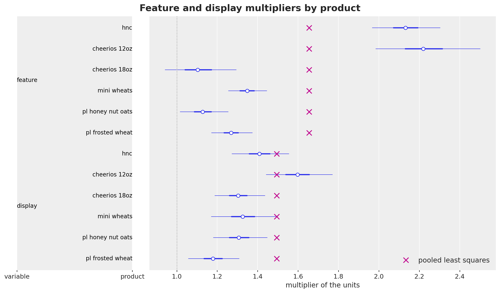</p>
</figure>


The next cell shows the focal product's two multipliers.


``` python
pl.DataFrame(
    [
        {"effect": name, **hdi_row(np.exp(np.asarray(posterior[site])[:, FOCAL_INDEX]))}
        for name, site in [("feature", "b_feat"), ("display", "b_disp")]
    ]
)
```


| effect    | median | hdi94_lower | hdi94_upper |
|-----------|--------|-------------|-------------|
| "feature" | 2.13   | 1.97        | 2.3         |
| "display" | 1.41   | 1.27        | 1.55        |


The feature multiplier of the focal product is 2.13 (HDI 1.97 to 2.30) and the display multiplier 1.41 (HDI 1.27 to 1.55), above and near the pooled least-squares multipliers of 1.65 and 1.49. The level is not absorbing the promotion spikes. In the following forest plot we show all seven mechanics coefficients of the focal product against its own full least-squares regression.


``` python
mechanics_sites = [
    "b_feat",
    "b_disp",
    "b_fd",
    "b_feat_depth",
    "b_disp_depth",
    "b_sib_feat",
    "b_sib_disp",
]
hnc_mechanics_draws = np.stack(
    [np.asarray(posterior[site])[:, FOCAL_INDEX] for site in mechanics_sites], axis=1
)
hnc_ols_terms = dict(
    zip(hnc_full_ols["term"].to_list(), hnc_full_ols["coef"].to_list(), strict=True)
)
mechanics_ols_terms = [
    "feature",
    "display",
    "feature_display",
    "feature_lam",
    "display_lam",
    "sib_feature",
    "sib_display",
]
pc = forest_plot(
    draws_dataset("effect", hnc_mechanics_draws, "term", mechanics_sites),
    ["effect"],
    ["term"],
    reference={
        "least squares (full regression)": {
            "effect": np.array([hnc_ols_terms[t] for t in mechanics_ols_terms])
        }
    },
    figsize=(11.0, 5.0),
)
ax = pc.viz["plot"].sel(column="forest").item()
ax.legend(loc="lower right")
ax.set(xlabel="effect on log units")
pc.viz["figure"].item().suptitle(
    f"Mechanics effects of the focal product ({FOCAL})", fontsize=16, fontweight="bold"
);
```


<figure class="figure">
<p></p>
</figure>


The depth slopes under feature and display of the focal product are centered near zero, so its mechanics-specific elasticities differ little from the plain one, and the sibling effects are small and negative: a featured or displayed sibling takes a few percent of the focal product's units.


## Do the cross elasticities make sense?

In the following heatmap we show the posterior mean of every cross elasticity \gamma\_{k,p} (rows: the product whose units respond; columns: the product whose price moves), annotated with the posterior probability that it is positive. Three things should hold if the estimates make sense. Products of one substitution group are substitutes, so the cells should be positive: a cut on the column product takes units from the row product. Switching is asymmetric, another generalization of [Blattberg, Briesch and Fox (1995)](https://doi.org/10.1287/mksc.14.3.G122): a national brand's promotion draws more from its private-label twin than the reverse. And cross elasticities should be smaller in magnitude than the own elasticities.


``` python
gamma_draws = np.asarray(posterior["gamma"])  # (sample, competitor, product)
gamma_mean = gamma_draws.mean(axis=0)
gamma_positive = (gamma_draws > 0).mean(axis=0)
annotations = np.array(
    [
        [
            "own" if k == p else f"{gamma_mean[k, p]:+.2f}\nP>0 {gamma_positive[k, p]:.2f}"
            for k in range(n_products)
        ]
        for p in range(n_products)
    ]
)
fig, ax = plt.subplots(figsize=(10, 8), layout="constrained")
sns.heatmap(
    gamma_mean.T,
    annot=annotations,
    fmt="",
    cmap="RdBu_r",
    vmin=-1.0,
    vmax=1.0,
    xticklabels=product_order,
    yticklabels=product_order,
    annot_kws={"fontsize": 10},
    cbar_kws={"label": "cross elasticity (posterior mean)"},
    ax=ax,
)
ax.tick_params(axis="x", rotation=30)
ax.set(xlabel="price of", ylabel="units of", title="Posterior mean cross-price elasticities");
```


<figure class="figure">
<p></p>
</figure>


The next cell lists the cells whose sign is credibly negative (posterior probability of a positive value below 0.10), and the cell after it compares, per product, the own elasticity with the largest cross term of its row.


``` python
pl.DataFrame(
    [
        {
            "price of": product_order[k],
            "units of": product_order[p],
            "posterior mean": round(float(gamma_mean[k, p]), 2),
            "P(gamma < 0)": round(float(1.0 - gamma_positive[k, p]), 2),
        }
        for k, p in zip(pair_rows_np, pair_cols_np, strict=True)
        if gamma_positive[k, p] < 0.10
    ]
).sort("posterior mean")
```


| price of            | units of            | posterior mean | P(gamma \< 0) |
|---------------------|---------------------|----------------|---------------|
| "pl honey nut oats" | "cheerios 12oz"     | -0.7           | 1.0           |
| "cheerios 18oz"     | "hnc"               | -0.31          | 1.0           |
| "cheerios 12oz"     | "hnc"               | -0.25          | 1.0           |
| "mini wheats"       | "cheerios 12oz"     | -0.2           | 1.0           |
| "pl honey nut oats" | "cheerios 18oz"     | -0.15          | 0.92          |
| "mini wheats"       | "hnc"               | -0.1           | 0.95          |
| "cheerios 12oz"     | "pl honey nut oats" | -0.06          | 0.91          |


The next cell compares, per product, the own elasticity with the largest cross term of its row.


``` python
own_medians = np.median(eps_prod_draws, axis=0)
pl.DataFrame(
    {
        "units of": product_order,
        "|own elasticity|": np.round(np.abs(own_medians), 2),
        "largest |cross elasticity| in the row": np.round(np.abs(gamma_mean).max(axis=0), 2),
        "own dominates": np.abs(own_medians) > np.abs(gamma_mean).max(axis=0),
    }
)
```


| units of | \|own elasticity\| | largest \|cross elasticity\| in the row | own dominates |
|----|----|----|----|
| "hnc" | 1.08 | 0.31 | true |
| "cheerios 12oz" | 0.38 | 0.7 | false |
| "cheerios 18oz" | 1.91 | 0.18 | true |
| "mini wheats" | 1.95 | 0.15 | true |
| "pl honey nut oats" | 1.93 | 0.69 | true |
| "pl frosted wheat" | 1.03 | 0.54 | true |


The two national-brand-to-twin cells are the largest and are certain: the focal product's price on the private-label honey nut oats, +0.69, and Mini Wheats' price on the private-label frosted wheat, +0.54, both with a posterior probability of 1.00 of being positive, while the reverse cells are -0.07 and +0.09. The asymmetry holds: a promotion of Honey Nut Cheerios takes units from its private-label twin, not the other way round. The two private-label products substitute for each other in both directions (+0.37 and +0.28), and so do the two Cheerios pack sizes (+0.22 and +0.15).

Seven cells have a posterior probability of a negative value above 0.90. The four large ones concentrate in the General Mills family (a cut on either Cheerios pack raises Honey Nut Cheerios units, -0.25 and -0.31) and in the Cheerios 12 oz row (-0.70 for the private-label twin's price and -0.20 for Mini Wheats); the other three are within 0.15 of zero. A negative cell would mean complements, which two cereals are not. The likely mechanism is co-promotion inside a brand family: a family feature recorded on one UPC lifts the others beyond their own flags, which the average sibling-flag terms only partly absorb. The magnitude check confirms where the problem sits: in every row but Cheerios 12 oz the own elasticity dominates every cross term, and Cheerios 12 oz has both the smallest own elasticity (0.38) and the anomalous -0.70 cell. The decisions use only the `hnc` column of the heatmap, the response of every sibling to the focal product's price, and every cell of that column is positive or near zero, so the cannibalization terms carry the right sign; the negative cells enter the decisions only through the no-promotion baseline of the siblings. We list this in the limitations.

In the following forest plot we show the store-level elasticities of the focal product against their within-store least-squares estimates, ordered by the number of identifying weeks of the store.


``` python
hnc_series_index = [n for n in range(n_series) if series_ids[n].endswith(f"::{FOCAL}")]
hnc_store_ids = [int(series_ids[n].split("::")[0]) for n in hnc_series_index]
eps_store_draws = np.asarray(posterior["eps"])[:, hnc_series_index]
store_ols = np.array(
    [
        float(
            within_ols(
                hnc_long.filter(pl.col("series").eq(pl.lit(f"{store}::{FOCAL}"))),
                ["x", *FLAG_TERMS, *seasonal_terms],
            )["coef"][0]
        )
        for store in hnc_store_ids
    ]
)
store_tpr_weeks = np.array(
    [
        int(
            train_panel_df.filter(pl.col("series").eq(pl.lit(f"{store}::{FOCAL}")))[
                "tpr_only"
            ].sum()
        )
        for store in hnc_store_ids
    ]
)
store_order = np.argsort(-store_tpr_weeks)
store_labels_ordered = [
    f"store {hnc_store_ids[j]} ({store_segment[hnc_store_ids[j]]}, {store_tpr_weeks[j]} tpr-only weeks)"
    for j in store_order
]
pc = forest_plot(
    draws_dataset("elasticity", eps_store_draws[:, store_order], "store", store_labels_ordered),
    ["elasticity"],
    ["store"],
    reference={"within-store least squares": {"elasticity": store_ols[store_order]}},
    figsize=(12.0, 8.0),
)
ax = pc.viz["plot"].sel(column="forest").item()
ax.axvline(
    float(np.median(eps_prod_draws[:, FOCAL_INDEX])),
    color="C0",
    linestyle="--",
    linewidth=1,
    label="product-level median",
)
ax.legend(loc="lower right")
ax.set(xlabel="elasticity")
pc.viz["figure"].item().suptitle(
    f"Store-level elasticity of {FOCAL}: least-squares sd {store_ols.std():.2f}, "
    f"posterior-median sd {np.median(eps_store_draws, axis=0).std():.2f}",
    fontsize=16,
    fontweight="bold",
);
```


<figure class="figure">
<p>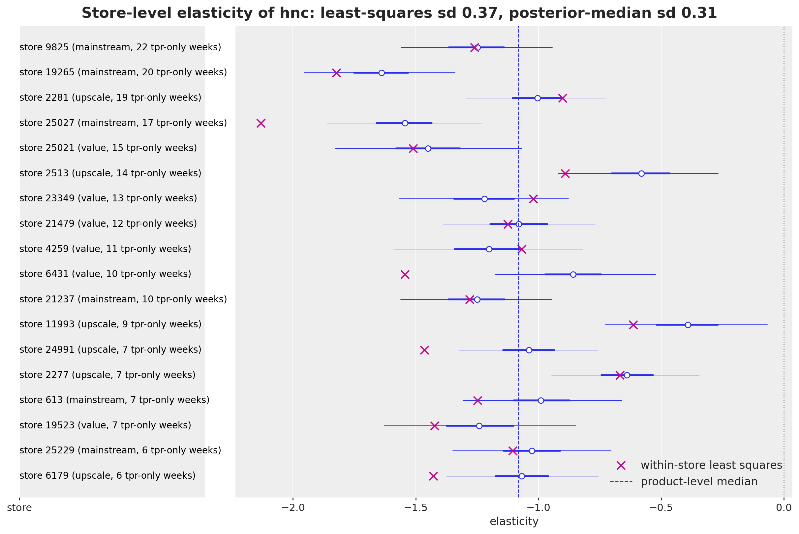</p>
</figure>


The store-level elasticities of the focal product have a least-squares spread of 0.37 across stores and a posterior-median spread of 0.31: the posterior medians shrink toward the product mean where the within-store estimates are noisy. This shrinkage is what the planner comparison of the decision section is about.

In the following plot we show the posterior-mean seasonal component of every product over the horizon quarter, because the timing question of the promotion reduces, under a multiplicative model, to the week in which the seasonal profile peaks.


``` python
beta_mean = np.asarray(posterior["beta_s"]).mean(axis=0)
seasonal_mean = np.asarray(fourier_full) @ beta_mean
hnc_seasonal_horizon = seasonal_mean[t_train:, FOCAL_INDEX]
peak_week = int(np.argmax(hnc_seasonal_horizon)) + 1

fig, ax = plt.subplots(figsize=(10, 5), layout="constrained")

for k, product in enumerate(product_order):
    ax.plot(
        horizon_weeks,
        np.exp(seasonal_mean[t_train:, k]),
        marker="o",
        linewidth=2.5 if product == FOCAL else 1.2,
        label=product,
    )
ax.axvline(
    peak_week,
    color="gray",
    linestyle="--",
    label=f"{FOCAL} peak: week {peak_week} ({holdout_weeks[peak_week - 1]})",
)
ax.axvspan(6.5, 8.5, color="gray", alpha=0.15, label="event weeks")
ax.set_xticks(horizon_weeks)
fig.legend(handles=ax.get_legend_handles_labels()[0], loc="outside lower center", ncols=4)
ax.set(
    xlabel="horizon week",
    ylabel="seasonal multiplier (posterior mean)",
    title="Annual seasonality over the horizon quarter",
);
```


<figure class="figure">
<p>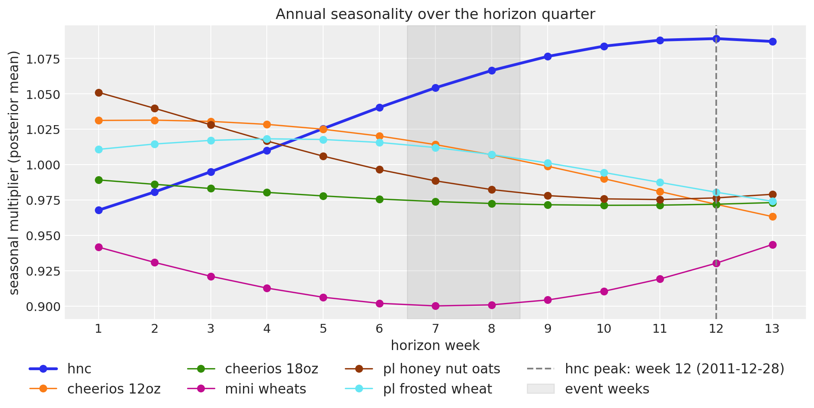</p>
</figure>


The posterior-mean seasonal component of the focal product peaks in horizon week 12, the week of December 28, four weeks after the Thanksgiving event.


## In-sample fit and holdout forecast

Before we use the model for decisions, we check that it forecasts. We draw the in-sample posterior predictive and the holdout forecast with the realized inputs and score them with the continuous ranked probability score (CRPS), the mean absolute error, and the coverage of the central 50\\ and 94\\ intervals (the only central intervals of this notebook; the figures draw HDI bands). The comparator is a seasonal naive forecast, the two-member ensemble of the units 52 and 104 weeks earlier. The next cell draws the predictives and scores them.


``` python
rng_key, key_in, key_fc = random.split(rng_key, 3)
pred_train = np.asarray(
    predict_in_sample(key_in, nuts_model, posterior, covariates_train, device="host"),
    dtype=np.float32,
)
pred_test = np.asarray(
    forecast(key_fc, nuts_model, posterior, y_train, covariates, device="host"), dtype=np.float32
)
y_np = np.asarray(y, dtype=np.float32)
naive_test = np.stack(
    [y_np[t_train - 52 : t_train - 52 + HORIZON], y_np[t_train - 104 : t_train - 104 + HORIZON]]
)


def score(
    pred: Float[np.ndarray, " sample time n_series"], truth: Float[np.ndarray, " time n_series"]
) -> dict[str, float]:
    """Score an ensemble against the truth with CRPS, MAE and central-interval coverage."""
    return {
        "crps": round(float(eval_crps(pred, truth)), 2),
        "mae": round(float(eval_mae(pred, truth)), 2),
        "coverage_50": round(float(eval_coverage(pred, truth, alpha=0.5)), 2),
        "coverage_94": round(float(eval_coverage(pred, truth, alpha=0.94)), 2),
    }


metrics_table = pl.DataFrame(
    [
        {"forecast": "model (train)", **score(pred_train, y_train_f)},
        {"forecast": "model (test)", **score(pred_test, y_test_f)},
        {"forecast": "seasonal naive (test)", **score(naive_test, y_test_f)},
    ]
)
metrics_table
```


| forecast                | crps  | mae   | coverage_50 | coverage_94 |
|-------------------------|-------|-------|-------------|-------------|
| "model (train)"         | 7.92  | 10.88 | 0.62        | 0.96        |
| "model (test)"          | 12.98 | 17.66 | 0.57        | 0.92        |
| "seasonal naive (test)" | 22.13 | 26.57 | 0.15        | 0.29        |


The holdout CRPS is 12.98 against 22.13 for the seasonal naive ensemble and the mean absolute error 17.66 against 26.57; the central 50\\ and 94\\ intervals cover 57\\ and 92\\ of the 1{,}404 holdout cells (in sample, 62\\ and 96\\). In the following plot we compare the model with the seasonal naive per product on CRPS and on MASE (whose scale is computed per product on its training block, because a pooled scale would be dominated by the high-volume products), and show the 94\\ coverage per product.


``` python
product_rows = []

for k, product in enumerate(product_order):
    idx = np.where(series_to_product_np == k)[0]
    mase = make_mase(y_train_f[:, idx], seasonality=52)

    for name, pred in [("model", pred_test), ("seasonal naive", naive_test)]:
        product_rows.append(
            {
                "product": product,
                "forecast": name,
                "crps": float(eval_crps(pred[:, :, idx], y_test_f[:, idx])),
                "mase": float(mase(jnp.asarray(pred[:, :, idx]), jnp.asarray(y_test_f[:, idx]))),
                "coverage_94": float(eval_coverage(pred[:, :, idx], y_test_f[:, idx], alpha=0.94)),
            }
        )
per_product_table = pl.DataFrame(product_rows)

fig, axes = plt.subplots(ncols=3, figsize=(18, 5), layout="constrained")

for ax, metric in zip(axes, ["crps", "mase", "coverage_94"], strict=True):
    frame = (
        per_product_table
        if metric != "coverage_94"
        else per_product_table.filter(pl.col("forecast").eq(pl.lit("model")))
    )
    sns.barplot(
        data=as_pandas(frame.select("product", "forecast", metric)),
        x="product",
        y=metric,
        hue="forecast",
        order=product_order,
        ax=ax,
    )

    for container in ax.containers:
        ax.bar_label(container, fmt="{:.2f}", fontsize=10)
    ax.tick_params(axis="x", rotation=15)
    ax.margins(y=0.15)
    ax.set(xlabel="", title=metric)
    if ax is not axes[0] and ax.get_legend() is not None:
        ax.get_legend().remove()
axes[2].axhline(0.94, color="gray", linestyle="--")
fig.suptitle("Holdout scores per product", fontsize=16, fontweight="bold");
```


<figure class="figure">
<p>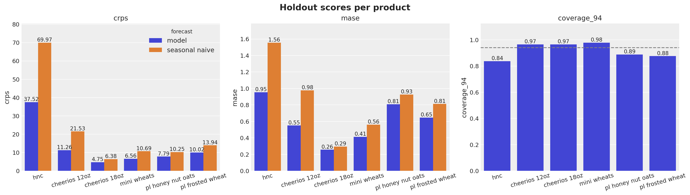</p>
</figure>


Per product the model's MASE is below the naive one and below one everywhere, with the focal product the hardest at 0.95 against 1.56 and a 94\\ coverage of 0.84 in its promotion-heavy quarter.

We read calibration the way [Gneiting and Katzfuss (2014)](https://doi.org/10.1146/annurev-statistics-062713-085831) frame it: sharpness subject to calibration. The check is the randomized probability integral transform (PIT) for counts of [Czado, Gneiting and Held (2009)](https://doi.org/10.1111/j.1541-0420.2009.01191.x). For a count y with predictive CDF G, u = G(y - 1) + v\\(G(y) - G(y - 1)) with v \sim \text{Uniform}(0, 1) is uniform for a calibrated forecast, U-shaped for an under-dispersed one and hump-shaped for an over-dispersed one. Two cautions: the holdout is the holiday quarter, with only two earlier Decembers in the training window; and the holdout cells of one series share a level path, so the effective sample size behind the histogram is below the number of cells. In the following plot we show the CRPS by horizon week against the naive forecast and the PIT histogram.


``` python
crps_week_model = np.array(
    [float(crps_empirical(pred_test[:, t, :], y_test_f[t, :]).mean()) for t in range(HORIZON)]
)
crps_week_naive = np.array(
    [float(crps_empirical(naive_test[:, t, :], y_test_f[t, :]).mean()) for t in range(HORIZON)]
)
cdf_at = (pred_test <= y_test_f[None]).mean(axis=0)
cdf_below = (pred_test <= y_test_f[None] - 1.0).mean(axis=0)
pit_rng = np.random.default_rng(seed=42)
pit = cdf_below + pit_rng.uniform(size=y_test_f.shape) * (cdf_at - cdf_below)
pit_counts, _ = np.histogram(pit, bins=10, range=(0.0, 1.0))

fig, axes = plt.subplots(ncols=2, figsize=(14, 5), layout="constrained")
axes[0].plot(range(1, HORIZON + 1), crps_week_model, "o-", color="C0", label="model")
axes[0].plot(range(1, HORIZON + 1), crps_week_naive, "s-", color="C1", label="seasonal naive")
axes[0].legend(loc="upper left")
axes[0].set(
    xlabel="horizon week",
    ylabel="CRPS (units)",
    title="Holdout CRPS by horizon week",
    xticks=range(1, HORIZON + 1),
)
pit_bars = axes[1].bar(
    np.arange(0.05, 1.0, 0.1),
    pit_counts / pit_counts.sum(),
    width=0.1,
    color="C0",
    edgecolor="white",
    label="randomized PIT",
)
axes[1].bar_label(pit_bars, fmt="{:.2f}", fontsize=10)
axes[1].axhline(0.1, color="gray", linestyle=":", label="uniform")
axes[1].legend(loc="upper right")
axes[1].set(
    xlabel="PIT value", ylabel="share of holdout cells", title="Randomized PIT histogram (holdout)"
)
fig.suptitle("Holdout accuracy and calibration", fontsize=16, fontweight="bold");
```


<figure class="figure">
<p>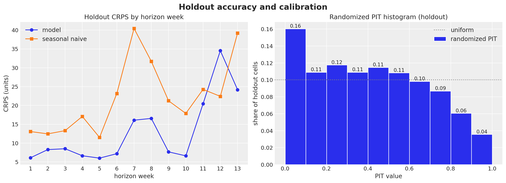</p>
</figure>


The model beats the naive forecast in every horizon week except week 12, the week of the deepest realized cut. The PIT histogram slopes downward, with 16\\ of the cells in the lowest decile and 4\\ in the highest: the holdout forecasts run high on average, so the calibration is good but not perfect. In the following plot we show the in-sample fit and the holdout forecast of the focal product and of its private-label twin in four stores.


``` python
def plot_forecast_panel(
    pred_test_draws: Float[np.ndarray, " sample horizon n_series"],
    labels: list[str],
    forecast_color: str,
    forecast_label: str,
    suptitle: str,
    col_wrap: int = 2,
) -> None:
    """Facet the in-sample predictive and the holdout forecast for the series in ``labels``."""
    idx = [series_ids.index(label) for label in labels]
    n_rows = int(np.ceil(len(labels) / col_wrap))
    pc = az.plot_lm(
        predictions_to_datatree(pred_train[:, :, idx], dates_num[:t_train], labels),
        y="obs",
        x="t",
        plot_dim="time",
        ci_kind="hdi",
        ci_prob=hdi_probs,
        smooth=False,
        col_wrap=col_wrap,
        visuals={
            "ci_band": {"color": "C0"},
            "observed_scatter": False,
            "pe_line": False,
            "xlabel": False,
            "ylabel": False,
        },
        aes={"alpha": ["prob"]},
        alpha=hdi_alphas,
        figure_kwargs={"figsize": (8 * col_wrap, 2.8 * n_rows)},
    )
    train_bands = pc.viz["ci_band"]["t"].sel(series=labels[-1])
    az.plot_lm(
        predictions_to_datatree(pred_test_draws[:, :, idx], dates_num[t_train:], labels),
        y="obs",
        x="t",
        plot_dim="time",
        plot_collection=pc,
        ci_kind="hdi",
        ci_prob=hdi_probs,
        smooth=False,
        visuals={
            "ci_band": {"color": forecast_color},
            "observed_scatter": False,
            "pe_line": False,
            "xlabel": False,
            "ylabel": False,
        },
    )
    truth_da = panel_ds["units"].sel(series=labels).assign_coords(time=dates_num).rename("t")
    x_da = xr.DataArray(dates_num, dims=["time"], coords={"time": dates_num})
    pc.map(
        az.visuals.line_xy,
        "truth",
        data=truth_da,
        x=x_da,
        ignore_aes=pc.aes_set,
        color="black",
        lw=1.2,
    )

    for label in labels:
        store, product = label.split("::")
        ax = pc.get_target("t", {"series": label})
        ax.set_title(f"store {store} ({store_segment[int(store)]}): {product}")
        split_line = ax.axvline(split_x, color="C3", linestyle="--", linewidth=1)
        promo_span = ax.fill_between(
            dates_num,
            0,
            1,
            where=(
                (panel_ds["feature"].sel(series=label) + panel_ds["display"].sel(series=label))
                > 0.5
            )
            .to_numpy()
            .tolist(),
            transform=ax.get_xaxis_transform(),
            color="C4",
            alpha=0.2,
            linewidth=0,
            step="mid",
        )
        locator = mdates.AutoDateLocator()
        ax.xaxis.set_major_locator(locator)
        ax.xaxis.set_major_formatter(mdates.ConciseDateFormatter(locator))
    test_bands = pc.viz["ci_band"]["t"].sel(series=labels[-1])
    band_handles = []

    for bands, prefix in ((train_bands, "in-sample "), (test_bands, f"{forecast_label} ")):
        for prob in (0.94, 0.5):
            band = bands.sel(prob=prob).item()
            band.set_label(hdi_label(prob, prefix=prefix))
            band_handles.append(band)
    truth_line = pc.viz["truth"]["t"].sel(series=labels[-1]).item()
    truth_line.set_label("observed units")
    split_line.set_label("train-test split")
    promo_span.set_label("feature or display week")
    fig = pc.viz["figure"].item()
    fig.legend(
        handles=[*band_handles, truth_line, split_line, promo_span],
        loc="outside lower center",
        ncols=4,
    )
    fig.supylabel("units")
    fig.suptitle(suptitle, fontsize=16, fontweight="bold", y=1.02)


TWIN = "pl honey nut oats"
twin_index = product_order.index(TWIN)
forecast_stores = [
    focus_by_segment["mainstream"][0],
    focus_by_segment["upscale"][0],
    focus_by_segment["value"][0],
    focus_by_segment["mainstream"][1],
]
plot_labels = [f"{store}::{product}" for store in forecast_stores for product in (FOCAL, TWIN)]
plot_forecast_panel(
    pred_test,
    plot_labels,
    forecast_color="C1",
    forecast_label="holdout forecast",
    suptitle=f"In-sample fit and holdout forecast (test CRPS "
    f"{metrics_table['crps'][1]:.2f} vs naive {metrics_table['crps'][2]:.2f})",
)
```


<figure class="figure">
<p></p>
</figure>


The forecast bands follow the promotion spikes of the holdout quarter in every store, and the twin's units drop in the weeks in which the focal product is promoted. The engine forecasts; we can use it for counterfactual promotions.


## Counterfactual promotions

This is step 3 of the strategy. A counterfactual promotion is a change of the horizon inputs, nothing else: the posterior draws stay fixed, the same PRNG key is reused, and the model is run again through NumPyro's `Predictive`. Nothing is refit. This is the covariate-swap pattern of the [fresh retail stockout example](fresh_retail_stockout.md) and the scenario covariates of the [availability TSB example](availability_tsb.md). The decision layer needs three things from every run: the sampled units, the conditional mean \mu over the horizon, and the future level innovations. The next cell wraps `Predictive` to return the three and asserts that it reproduces the [forecast](../../reference/predictive.forecast.md#numpyro_forecast.predictive.forecast) draws of the previous section under the same key, which validates the engine before we change any input.


``` python
def _scenario_draws(
    rng_key: Array,
    model: ForecastModel,
    posterior: dict[str, Array],
    data: Array,
    covariates: Array,
) -> dict[str, Array]:
    """Return the sampled horizon units, conditional means and future innovations of one covariate tensor."""
    predictive = Predictive(
        model,
        posterior_samples=posterior,
        return_sites=["forecast", "mu_future", "drift_future"],
        parallel=True,
    )
    return predictive(rng_key, covariates, data)


scenario_draws = jax.jit(_scenario_draws, static_argnums=(1,))

engine = scenario_draws(key_fc, nuts_model, posterior, y_train, covariates)
engine_gap = float(np.abs(np.asarray(engine["forecast"], dtype=np.float32) - pred_test).max())
assert engine_gap == 0.0, "the scenario wrapper must reproduce the forecast() draws"
```


A policy is a discount depth d and a mechanics m for the focal product in every panel store during one contiguous two-week event, horizon weeks 7 and 8, the realized Thanksgiving slot. Every other product stays at its base price with no promotion over the whole horizon. The calendar is not a lever here for two reasons shown earlier: the post-promotion dip is economically negligible, and under a multiplicative model the timing question reduces to the seasonal peak. The next cell builds the horizon inputs of a policy and shows the event row of one store under feature with display at a 15\\ cut, so the reader can see which channels change: the focal product's own price and flags, the cross-price channel of every series at the store, and the sibling flags of the five siblings.


``` python
EVENT_OFFSETS = [6, 7]  # horizon weeks 7 and 8, one-based
event_rows = [t_train + offset for offset in EVENT_OFFSETS]
BASELINE = ("tpr-only", 0.0)


def policy_covariates(depth: float, feature_flag: float, display_flag: float) -> Array:
    """Build the horizon covariates of one policy: base prices and no promotion outside the event.

    During the event weeks the focal product carries the cut and the mechanics, every series of
    the same store sees the focal product's price in its cross-price block, and the siblings carry
    the sibling flags. The training rows are left untouched.
    """
    tensor = np.asarray(covariates).copy()
    tensor[:, t_train:, :] = 0.0
    x_policy = float(np.log1p(-depth))

    for n in range(n_series):
        if int(series_to_product_np[n]) == FOCAL_INDEX:
            tensor[0, event_rows, n] = x_policy
            tensor[1, event_rows, n] = feature_flag
            tensor[2, event_rows, n] = display_flag
        else:
            tensor[3, event_rows, n] = feature_flag
            tensor[4, event_rows, n] = display_flag
        tensor[PRICE_BLOCK + FOCAL_INDEX, event_rows, n] = x_policy
    return jnp.asarray(tensor, dtype=jnp.float32)


policy_a = policy_covariates(0.15, *MECHANICS["feature + display"])
policy_b = policy_covariates(0.30, *MECHANICS["tpr-only"])
assert np.array_equal(np.asarray(policy_a)[:, :t_train], np.asarray(covariates)[:, :t_train])
first_store_series = list(range(n_products))
pl.DataFrame(
    {
        "input": input_names,
        **{
            product_order[j]: np.round(np.asarray(policy_a)[:, event_rows[0], j], 3)
            for j in first_store_series
        },
    }
)
```


| input | hnc | cheerios 12oz | cheerios 18oz | mini wheats | pl honey nut oats | pl frosted wheat |
|----|----|----|----|----|----|----|
| "x" | -0.163 | 0.0 | 0.0 | 0.0 | 0.0 | 0.0 |
| "feature" | 1.0 | 0.0 | 0.0 | 0.0 | 0.0 | 0.0 |
| "display" | 1.0 | 0.0 | 0.0 | 0.0 | 0.0 | 0.0 |
| "sib_feature" | 0.0 | 1.0 | 1.0 | 1.0 | 1.0 | 1.0 |
| "sib_display" | 0.0 | 1.0 | 1.0 | 1.0 | 1.0 | 1.0 |
| "price hnc" | -0.163 | -0.163 | -0.163 | -0.163 | -0.163 | -0.163 |
| "price cheerios 12oz" | 0.0 | 0.0 | 0.0 | 0.0 | 0.0 | 0.0 |
| "price cheerios 18oz" | 0.0 | 0.0 | 0.0 | 0.0 | 0.0 | 0.0 |
| "price mini wheats" | 0.0 | 0.0 | 0.0 | 0.0 | 0.0 | 0.0 |
| "price pl honey nut oats" | 0.0 | 0.0 | 0.0 | 0.0 | 0.0 | 0.0 |
| "price pl frosted wheat" | 0.0 | 0.0 | 0.0 | 0.0 | 0.0 | 0.0 |


The table is the event row of the first store: the focal product's own price and flags are set, its price appears in the `price hnc` channel of all six series, and the siblings carry the sibling flags. Two policies forecast under one key share the future level innovations and differ only where the inputs differ; the sampled units are coupled but not identical, which is what common random numbers mean here. The next cell verifies this on two policies and shows the four engine checks together.


``` python
rng_key, key_policy = random.split(rng_key)
out_a = scenario_draws(key_policy, nuts_model, posterior, y_train, policy_a)
out_b = scenario_draws(key_policy, nuts_model, posterior, y_train, policy_b)
non_event = [offset for offset in range(HORIZON) if offset not in EVENT_OFFSETS]
event_a = np.asarray(out_a["forecast"])[:, EVENT_OFFSETS][:, :, hnc_series_index].ravel()
event_b = np.asarray(out_b["forecast"])[:, EVENT_OFFSETS][:, :, hnc_series_index].ravel()
pl.DataFrame(
    {
        "check": [
            "max |scenario draws - forecast() draws| under the same key",
            "max |future innovations| difference across the two policies",
            "max |conditional mean| difference outside the event weeks",
            "correlation of the focal product's event draws across the two policies",
        ],
        "value": [
            engine_gap,
            float(np.abs(out_a["drift_future"] - out_b["drift_future"]).max()),
            float(
                np.abs(out_a["mu_future"][:, non_event] - out_b["mu_future"][:, non_event]).max()
            ),
            round(float(np.corrcoef(event_a, event_b)[0, 1]), 2),
        ],
    }
)
```


| check | value |
|----|----|
| "max \|scenario draws - forecast() draws\| under the same key" | 0.0 |
| "max \|future innovations\| difference across the two policies" | 0.0 |
| "max \|conditional mean\| difference outside the event weeks" | 0.0 |
| "correlation of the focal product's event draws across the two policies" | 0.99 |


The wrapper reproduces the [forecast](../../reference/predictive.forecast.md#numpyro_forecast.predictive.forecast) draws exactly, the future level innovations and the conditional means outside the event weeks are identical across the two policies, and the focal product's event draws have a correlation of 0.99 across them.

The grid of policies runs from no cut to a 40\\ cut in steps of five points for each of the four mechanics; for the shelf-tag-only mechanics the zero-depth cell is the no-promotion baseline itself. The grid is a response surface for the break-even and risk analyses, not a search space. Cells with fewer than 20 observed store-weeks within \pm 2.5 points of the depth are shaded in the figures as thin support. The next cell forecasts every policy and stores, per policy, the event units of every series, their conditional means, and the zone-level paths of the focal product and its twin.


``` python
%%time

policies: list[tuple[str, float]] = [
    (mechanics_name, float(depth)) for mechanics_name in MECHANICS for depth in DEPTH_GRID
]
event_units_mu: dict[tuple[str, float], np.ndarray] = {}
event_units_paths: dict[tuple[str, float], np.ndarray] = {}
hnc_event_paths: dict[tuple[str, float], np.ndarray] = {}
hnc_event_mu: dict[tuple[str, float], np.ndarray] = {}
zone_paths: dict[tuple[str, float], np.ndarray] = {}

for policy in policies:
    mechanics_name, depth = policy
    out = scenario_draws(
        key_policy,
        nuts_model,
        posterior,
        y_train,
        policy_covariates(depth, *MECHANICS[mechanics_name]),
    )
    mu_horizon = np.asarray(out["mu_future"], dtype=np.float32)
    y_horizon = np.asarray(out["forecast"], dtype=np.float32)
    event_units_mu[policy] = mu_horizon[:, EVENT_OFFSETS, :].sum(axis=1)
    event_units_paths[policy] = y_horizon[:, EVENT_OFFSETS, :].sum(axis=1)
    hnc_event_paths[policy] = y_horizon[:, EVENT_OFFSETS][:, :, hnc_series_index]
    hnc_event_mu[policy] = mu_horizon[:, EVENT_OFFSETS][:, :, hnc_series_index]
    zone_paths[policy] = np.stack(
        [y_horizon[:, :, series_to_product_np == k].sum(axis=2) for k in range(n_products)],
        axis=-1,
    )
```


    CPU times: user 4min 40s, sys: 5.01 s, total: 4min 45s
    Wall time: 28.5 s


The 36 policies take under 30 seconds on 4{,}000 draws each. In the following plot we show what the committed policy, feature with display at a 15\\ cut, does at the zone level (the sum over the 18 stores) against no promotion, for the focal product and its twin: the median path and the 94\\ HDI band of each, with the event weeks shaded.


``` python
PRODUCT_NAMES = {FOCAL: "Honey Nut Cheerios", TWIN: "private-label twin"}


def plot_zone_policies(
    policy_list: list[tuple[str, float]], products: list[str], figsize: tuple[float, float]
) -> None:
    r"""Plot zone-level weekly units, no promotion vs policy, one facet per product and policy."""
    labels = [
        f"{product}: {mechanics_name} at {depth:.0%}"
        for product in products
        for (mechanics_name, depth) in policy_list
    ]
    baseline_draws = np.stack(
        [
            zone_paths[BASELINE][:, :, product_order.index(product)]
            for product in products
            for _ in policy_list
        ],
        axis=-1,
    )
    policy_draws = np.stack(
        [
            zone_paths[policy][:, :, product_order.index(product)]
            for product in products
            for policy in policy_list
        ],
        axis=-1,
    )
    horizon_axis = np.arange(1, HORIZON + 1, dtype=float)
    pc = az.plot_lm(
        predictions_to_datatree(baseline_draws, horizon_axis, labels),
        y="obs",
        x="t",
        plot_dim="time",
        ci_kind="hdi",
        ci_prob=0.94,
        smooth=False,
        point_estimate="median",
        col_wrap=len(policy_list) if len(policy_list) > 1 else len(products),
        visuals={
            "ci_band": {"color": "C0", "alpha": 0.3},
            "pe_line": {"color": "C0", "width": 2.0},
            "observed_scatter": False,
            "xlabel": False,
            "ylabel": False,
        },
        figure_kwargs={"figsize": figsize},
    )
    baseline_band = pc.viz["ci_band"]["t"].sel(series=labels[-1]).item()
    baseline_line = pc.viz["pe_line"]["t"].sel(series=labels[-1]).item()
    az.plot_lm(
        predictions_to_datatree(policy_draws, horizon_axis, labels),
        y="obs",
        x="t",
        plot_dim="time",
        plot_collection=pc,
        ci_kind="hdi",
        ci_prob=0.94,
        smooth=False,
        point_estimate="median",
        visuals={
            "ci_band": {"color": "C1", "alpha": 0.3},
            "pe_line": {"color": "C1", "width": 2.0},
            "observed_scatter": False,
            "xlabel": False,
            "ylabel": False,
        },
    )
    policy_band = pc.viz["ci_band"]["t"].sel(series=labels[-1]).item()
    policy_line = pc.viz["pe_line"]["t"].sel(series=labels[-1]).item()

    for label, product in zip(labels, [p for p in products for _ in policy_list], strict=True):
        ax = pc.get_target("t", {"series": label})
        title = PRODUCT_NAMES[product] if len(policy_list) == 1 else label.split(": ")[1]
        ax.set_title(title)
        event_span = ax.axvspan(
            EVENT_OFFSETS[0] + 0.5, EVENT_OFFSETS[-1] + 1.5, color="gray", alpha=0.15
        )
        ax.set_xticks(range(1, HORIZON + 1, 2))
    if len(policy_list) > 1:
        for product in products:
            first = pc.get_target(
                "t", {"series": labels[products.index(product) * len(policy_list)]}
            )
            first.set_ylabel(PRODUCT_NAMES[product], fontsize=12)
    baseline_band.set_label(hdi_label(0.94, prefix="no promotion "))
    baseline_line.set_label("no promotion median")
    policy_band.set_label(hdi_label(0.94, prefix="policy "))
    policy_line.set_label("policy median")
    event_span.set_label("event weeks")
    fig = pc.viz["figure"].item()
    fig.legend(
        handles=[baseline_band, baseline_line, policy_band, policy_line, event_span],
        loc="outside lower center",
        ncols=5,
    )

    for label in labels[-len(policy_list) :]:
        pc.get_target("t", {"series": label}).set_xlabel("horizon week")
    if len(policy_list) == 1:
        fig.supylabel(f"units per week, {n_stores} stores")
    fig.suptitle(
        "Counterfactual promotion vs no promotion (posterior predictive)",
        fontsize=16,
        fontweight="bold",
        y=1.08 if len(policy_list) == 1 else 1.03,
    )
```


The next cell plots the committed policy against no promotion.


``` python
plot_zone_policies([("feature + display", 0.15)], [FOCAL, TWIN], figsize=(14.0, 4.5))
```


<figure class="figure">
<p>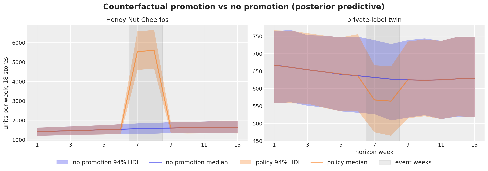</p>
</figure>


The feature-with-display event lifts the focal product's zone-level units to more than three times the no-promotion level in the event weeks, and lowers the private-label twin's units in the same weeks. In the following plot we compare three mechanics at the same 15\\ depth, one column per mechanics and one row per product.


``` python
plot_zone_policies(
    [("tpr-only", 0.15), ("feature", 0.15), ("feature + display", 0.15)],
    [FOCAL, TWIN],
    figsize=(16.0, 7.5),
)
```


<figure class="figure">
<p></p>
</figure>


A shelf-tag cut of the same depth moves the focal product far less than a feature, and the feature with display moves it most; the twin loses units under every mechanics. These are the units the decision section turns into money.


# Decision making and optimization

Steps 4 and 5 of the strategy: the economics, then one rule per business question. The model forecasts units. The decisions need money. This section states the economics once and turns the forecast units of every draw into an event profit; the break-even, risk, planner and order subsections then work on that profit. We keep the economics simple and explicit: a gross margin per product, a per-unit allowance from the manufacturer, and a slot cost per mechanics that we solve for rather than assume.


## The margin of a promoted unit

Take product j at store s. Let p\_{j,s} be its base price at the last training week. Base prices differ across stores, so every currency number below uses the store's own price. Let g_j be the gross margin on the base price: 0.28 for the national brands and 0.38 for the private label. The unit cost is the part of the base price that is not margin:

 c\_{j,s} = (1 - g_j)\\ p\_{j,s}. 

Now cut the price of the focal product \text{H} by a fraction d of its base price. The manufacturer refunds a share \alpha of the discount on every unit sold in a promotion week. We call this refund the allowance. Three flows set the margin of one promoted unit. The retailer sells the unit at the cut price. The retailer pays the unit cost. The retailer receives the allowance. The sum of the three flows is the promo-week unit margin:

\begin{align\*} m\_{\text{H},s}(d) &= p\_{\text{H},s}\\(1 - d) - c\_{\text{H},s} + \alpha\\ d\\ p\_{\text{H},s} \\ &= p\_{\text{H},s}\\ \big( g\_{\text{H}} - (1 - \alpha)\\ d \big). \end{align\*}

The second line is the rule to remember. Each point of depth costs the retailer (1 - \alpha) points of margin rate, and the manufacturer pays the rest. The siblings k \ne \text{H} stay at their base price during the event, so their margin is the base-price margin:

 m\_{k,s} = g_k\\ p\_{k,s}. 

A feature or a display also uses a slot. Its cost S_m per store-week is one number per mechanics, and under feature with display it covers both slots. We never assume a value for S_m; a later subsection solves for it. The next cell builds the economics table of the six products.


``` python
is_private_label = np.array(
    [series_ids[n].split("::")[1].startswith("pl") for n in range(n_series)]
)
gross_margin = np.where(is_private_label, 0.38, 0.28)
unit_cost = (1.0 - gross_margin) * base_price
is_focal = series_to_product_np == FOCAL_INDEX
store_onehot = np.eye(n_stores)[series_to_store_np]  # (n_series, n_stores)
N_EVENT_WEEKS = len(EVENT_OFFSETS)
economics_table = pl.DataFrame(
    {
        "product": product_order,
        "gross_margin": [0.38 if p.startswith("pl") else 0.28 for p in product_order],
        "base_price_median": [
            round(float(np.median(base_price[series_to_product_np == k])), 2)
            for k in range(n_products)
        ],
        "unit_cost_median": [
            round(float(np.median(unit_cost[series_to_product_np == k])), 2)
            for k in range(n_products)
        ],
    }
)
economics_table
```


| product             | gross_margin | base_price_median | unit_cost_median |
|---------------------|--------------|-------------------|------------------|
| "hnc"               | 0.28         | 3.02              | 2.17             |
| "cheerios 12oz"     | 0.28         | 3.05              | 2.2              |
| "cheerios 18oz"     | 0.28         | 4.79              | 3.45             |
| "mini wheats"       | 0.28         | 3.89              | 2.8              |
| "pl honey nut oats" | 0.38         | 1.9               | 1.17             |
| "pl frosted wheat"  | 0.38         | 2.41              | 1.49             |


The unit margin of a promoted unit is a straight line in the depth whose slope is -(1 - \alpha)\\ p\_{\text{H},s}. In the following plot we draw it at the median focal base price for three funding shares, with the margin at 0\\, 15\\ and 30\\ marked for the nominal share \alpha = 0.5.


``` python
G_FOCAL = float(gross_margin[is_focal][0])
p_focal_median = float(np.median(base_price[is_focal]))
depth_axis = np.linspace(0.0, 0.40, 81)

fig, ax = plt.subplots(figsize=(9, 5), layout="constrained")

for alpha_value, color in zip((0.0, 0.5, 1.0), ("C3", "C0", "C2"), strict=True):
    ax.plot(
        depth_axis,
        p_focal_median * (G_FOCAL - (1.0 - alpha_value) * depth_axis),
        color=color,
        linewidth=2,
        label=f"funding share {alpha_value:.1f}",
    )

for depth in (0.0, 0.15, 0.30):
    margin = p_focal_median * (G_FOCAL - 0.5 * depth)
    ax.plot(depth, margin, "o", color="C0")
    ax.annotate(f"{margin:.2f}", (depth, margin), textcoords="offset points", xytext=(8, 6))
ax.axhline(0.0, color="black", linewidth=1)
ax.xaxis.set_major_formatter(mtick.PercentFormatter(xmax=1, decimals=0))
ax.legend(loc="lower left")
ax.set(
    xlabel="discount depth",
    ylabel="promo-week unit margin (currency units)",
    title=f"Unit margin of {FOCAL} at the median base price {p_focal_median:.2f}",
);
```


<figure class="figure">
<p>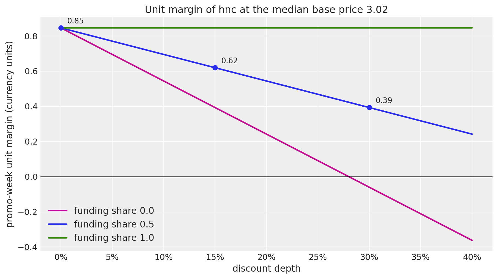</p>
</figure>


At the median focal base price of 3.02 the margin is 0.85 per unit at full price. A 15\\ cut at the nominal share \alpha = 0.5 brings it to 0.62. An unfunded 30\\ cut brings it below zero: the cut is deeper than the margin rate, so every unit sells below cost.


## The event profit and the funding share

A policy a = (d, m) fixes a depth d and a mechanics m for the two event weeks. The quantity we want is the expected event profit of a policy under the posterior predictive, \text{E}\[\Pi(a)\]. This is the estimand of the decision layer. The rules of the next sections compare policies on it, on its lower tail, and on the order quantity.

We estimate it from posterior draws. Let r = 1, \dots, R index one draw of the parameters and of the future level path; we write \theta_r for both together. Let E = \\7, 8\\ be the set of event weeks. Let y\_{r,t,i}(a) be the sampled unit count of series i in week t under policy a in draw r; it includes the demand noise. Write i \in \text{H} for the 18 focal series, one per store, and i \notin \text{H} for the sibling series. Let \text{margin}\_{i,t}(a) be the unit margin of series i under the policy: m\_{\text{H},s(i)}(d) for a focal series and m\_{p(i),s(i)} for a sibling series. The event profit of draw r adds the margin dollars of every series over the event weeks and subtracts the slot cost, paid in each of the two event weeks in each of the 18 stores:

\begin{align\*} \Pi_r(a) &= \sum\_{t \in E} \sum\_{i} \text{margin}\_{i,t}(a)\\ y\_{r,t,i}(a) - S(a), \\ S(a) &= 2 \times 18 \times S_m. \end{align\*}

We set S = 0 in every break-even and risk computation. Let a_0 be the no-promotion baseline and \Delta\Pi_r(a) = \Pi_r(a) - \Pi_r(a_0) the incremental profit of a policy. An assumed slot cost shifts every histogram of \Delta\Pi by a constant, so \text{P}(\Delta\Pi \< S) can be read off the same figures.

The units do not depend on \alpha, because the model has no funding term. Only the margin does, and it is linear in \alpha. So the event profit of a draw is a straight line in the funding share:

 \Pi_r(a) = A_r(a) + \alpha\\ B_r(a), 

with

\begin{align\*} A_r(a) &= \sum\_{t \in E} \sum\_{i \in \text{H}} p\_{\text{H},s(i)}\\(g\_{\text{H}} - d)\\ y\_{r,t,i}(a) \\ &\quad + \sum\_{t \in E} \sum\_{i \notin \text{H}} m\_{p(i),s(i)}\\ y\_{r,t,i}(a) - S(a), \\ B_r(a) &= d \sum\_{t \in E} \sum\_{i \in \text{H}} p\_{\text{H},s(i)}\\ y\_{r,t,i}(a). \end{align\*}

A_r(a) is the event profit when the retailer funds the whole cut. B_r(a) is the discount dollars given away on the focal units sold: depth times base price times units. The allowance refunds the share \alpha of these dollars. B_r(a) is positive whenever d \> 0, so a higher funding share always raises profit. One set of draws therefore serves every funding share, and `profit_parts` in the next cell returns exactly these two parts.

Profit is linear in units. So, given the parameters and the level path of draw r, the expected profit \text{E}\[\Pi(a) \mid \theta_r\] is the same sum with the conditional means \mu\_{r,t,i}(a) in place of the sampled counts:

 \Pi^\mu_r(a) = \sum\_{t \in E} \sum\_{i} \text{margin}\_{i,t}(a)\\ \mu\_{r,t,i}(a) - S(a). 

The average of \Pi^\mu_r(a) over the draws estimates the estimand without any observation-noise error:

 \text{E}\[\Pi(a)\] = \text{E}\big\[\text{E}\[\Pi(a) \mid \theta\]\big\] \approx \frac{1}{R} \sum\_{r=1}^{R} \Pi^\mu_r(a). 

The bands of \Pi^\mu in the break-even subsection still carry the sampled level path. The sampled counts return in the risk and order subsections, where the demand noise matters. The next cell builds the two parts and summarizes the no-promotion event profit over the 18 stores.


``` python
def profit_parts(
    units: Float[np.ndarray, " sample n_series"], depth: float, brand_only: bool = False
) -> tuple[Float[np.ndarray, " sample"], Float[np.ndarray, " sample"]]:
    """Split the event profit into ``A + alpha * B`` per draw; ``brand_only`` drops the sibling margins."""
    margin_at_zero = np.where(
        is_focal,
        base_price * (gross_margin - depth),
        0.0 if brand_only else gross_margin * base_price,
    )
    part_a = units @ margin_at_zero
    part_b = depth * (units[:, is_focal] @ base_price[is_focal])
    return part_a, part_b


def profit_parts_by_store(
    units: Float[np.ndarray, " sample n_series"], depth: float, brand_only: bool = False
) -> tuple[Float[np.ndarray, " sample n_stores"], Float[np.ndarray, " sample n_stores"]]:
    """Split the event profit into ``A + alpha * B`` per store; ``brand_only`` drops the sibling margins."""
    margin_at_zero = np.where(
        is_focal,
        base_price * (gross_margin - depth),
        0.0 if brand_only else gross_margin * base_price,
    )
    part_a = (units * margin_at_zero) @ store_onehot
    part_b = depth * ((units * (is_focal * base_price)) @ store_onehot)
    return part_a, part_b


def event_profit(
    units: Float[np.ndarray, " sample n_series"],
    depth: float,
    alpha: float,
    brand_only: bool = False,
) -> Float[np.ndarray, " sample"]:
    """Compute the event profit per draw at a funding share ``alpha`` and zero slot cost."""
    part_a, part_b = profit_parts(units, depth, brand_only=brand_only)
    return part_a + alpha * part_b


baseline_mu = event_profit(event_units_mu[BASELINE], 0.0, 0.5)
baseline_paths = event_profit(event_units_paths[BASELINE], 0.0, 0.5)
pl.DataFrame(
    {
        "no-promotion event profit, mean": [round(float(baseline_mu.mean()))],
        "sd from parameters and level path": [round(float(baseline_mu.std()))],
        "sd including demand noise": [round(float(baseline_paths.std()))],
    }
)
```


| no-promotion event profit, mean | sd from parameters and level path | sd including demand noise |
|----|----|----|
| 10271 | 222 | 313 |


Over the 18 stores the no-promotion event profit has a mean of 10{,}271 currency units. The parameters and the level path give it a standard deviation of 222; with the demand noise it is 313.


## A single-product rule of thumb

The numerical shares below come from the full model. A one-product version explains the shape of the answer before we compute it. Let N_0 be the expected event units of the focal product in one store at base price and without mechanics. From the model section, a mechanics m multiplies the units by the uplift e^{b_m} and a cut of depth d by (1 - d)^{\varepsilon_m}, with \varepsilon_m \< 0 the mechanics-specific elasticity. Write m\_{\text{H}}(d) for the promo-week unit margin of the store. The profit of the focal product alone is margin per unit times units, minus the slot:

 \pi_m(d) = m\_{\text{H}}(d)\\ N_0\\ (1 - d)^{\varepsilon_m}\\ e^{b_m} - S_m. 

Its derivative in d has the sign of

 \big(-g\_{\text{H}}\\ \varepsilon_m - (1 - \alpha)\big) + (1 - \alpha)(1 + \varepsilon_m)\\ d. 

The first bracket is the trade-off at the first point of depth: the point raises units by -\varepsilon_m percent, each worth g\_{\text{H}} of margin rate, and it costs (1 - \alpha) points of margin rate. So a first point of depth pays if and only if \varepsilon_m \< -\varepsilon^\star(\alpha), with the threshold elasticity

 \varepsilon^\star(\alpha) = \frac{1 - \alpha}{g\_{\text{H}}}. 

The threshold plot below marks it at three shares: 3.57 when the retailer funds the whole cut, 1.79 at the nominal share, 0 when the manufacturer funds everything. Solve the same condition for \alpha instead, and you get the brand-only break-even share of a mechanics:

 \alpha^\star_m = 1 + g\_{\text{H}}\\ \varepsilon_m. 

The brand-only share reads as follows. At or below 0 the cut pays even if the retailer funds it alone. At or above 1 no funding share makes it pay. The figures report its intervals unclipped with this rule. Cannibalization raises the share, because the cut moves sibling units through the cross elasticities \gamma\_{\text{H},k}. Let \tilde N\_{j,s,m} be the expected event units of product j at store s at zero depth under mechanics m. The category break-even share adds a ratio to the brand-only one,

 \alpha^\star\_{\text{cat},m} = \alpha^\star_m + \frac{L_m}{R_m}, 

with

\begin{align\*} L_m &= \sum_s \sum\_{k \ne \text{H}} m\_{k,s}\\ \tilde N\_{k,s,m}\\ \gamma\_{\text{H},k}, \\ R_m &= \sum_s p\_{\text{H},s}\\ \tilde N\_{\text{H},s,m}. \end{align\*}

L_m is the sibling margin lost per unit of log price change and R_m the focal product's promo-week gross revenue at zero depth; the ratio is the extra share the manufacturer must fund to cover what the siblings lose. With \|\varepsilon_m\| \le 1 the second bracket of the derivative grows with d, so the best cell of a depth grid is a corner:

- Below the event-level share of the deepest cell, the shallowest cell is best.
- Above the tangent share \alpha^\star_m, the deepest cell is best.
- In the narrow band between them, compare the two corners directly.

With \|\varepsilon_m\| \> 1 an interior depth exists for a narrow band of funding shares. The notebook computes two numerical shares per draw from the stored conditional means, so that the cross terms and the sibling flags enter through the model. The secant share sets the profits of the two shallowest cells of a mechanics equal, a\_{\text{lo}} and a\_{\text{hi}} (zero and five points for a flagged mechanics, no promotion and ten points for a shelf tag alone):

 \alpha^{\text{sec}}\_{r,m} = \frac{A_r(a\_{\text{lo}}) - A_r(a\_{\text{hi}})}{B_r(a\_{\text{hi}}) - B_r(a\_{\text{lo}})}. 

Its brand-only version drops the sibling terms from A_r. The event-level share of a grid cell a is the funding share at which the cell breaks even against no promotion:

 \alpha^{\text{ev}}\_r(a) = -\frac{A_r(a) - A_r(a_0)}{B_r(a)}. 

A negative value means the event beats no promotion even if the retailer funds the whole cut; a value above one means no funding share makes it pay. Three variants, as remarks:

- A lump-sum allowance L instead of a per-unit one adds L to A_r and removes \alpha B_r, so the break-even question becomes a question about L.
- A perishable product replaces the holding cost of the order section by a write-off of the leftover.
- The \Pi^\mu argument only uses linearity in units, so it holds under a Poisson likelihood or any likelihood whose conditional mean the model registers.


## Who funds the discount: the break-even funding share

This is the second business question. The manufacturer's funding share is negotiated, so the useful output is not a profit at one share but the share at which the promotion stops paying, with its uncertainty. In the following forest plot we show, per mechanics, the posterior of the three break-even shares of the rule of thumb (the brand-only secant, the category secant with the cannibalization included, and the brand-only tangent \alpha^\star_m) and of the cannibalization itself, the difference between the category and the brand-only secant. The posterior median of the category share of feature with display becomes \tilde\alpha, the reference share of every later figure, drawn as the dashed line.


``` python
feature_depth_draws = np.asarray(posterior["b_feat_depth"])[:, FOCAL_INDEX]
display_depth_draws = np.asarray(posterior["b_disp_depth"])[:, FOCAL_INDEX]
eps_focal_draws = eps_prod_draws[:, FOCAL_INDEX]


def eps_m_draws(mechanics_name: str) -> Float[np.ndarray, " sample"]:
    """Return the zone-level mechanics-specific elasticity draws of the focal product."""
    feature_flag, display_flag = MECHANICS[mechanics_name]
    return (
        eps_focal_draws - feature_depth_draws * feature_flag - display_depth_draws * display_flag
    )


def marginal_secant(mechanics_name: str, brand_only: bool) -> Float[np.ndarray, " sample"]:
    """Solve, per draw, for the funding share at which the two shallowest cells of a mechanics tie."""
    if mechanics_name == "tpr-only":
        shallow, deeper = BASELINE, ("tpr-only", 0.10)
    else:
        shallow, deeper = (mechanics_name, 0.0), (mechanics_name, 0.05)
    a_shallow, b_shallow = profit_parts(event_units_mu[shallow], shallow[1], brand_only=brand_only)
    a_deeper, b_deeper = profit_parts(event_units_mu[deeper], deeper[1], brand_only=brand_only)
    return (a_shallow - a_deeper) / (b_deeper - b_shallow)


share_kinds = ["brand-only secant", "category secant", "brand-only tangent", "cannibalization"]
break_even_draws: dict[tuple[str, str], np.ndarray] = {}
alpha_star_cat: dict[str, np.ndarray] = {}

for mechanics_name in MECHANICS:
    brand = marginal_secant(mechanics_name, brand_only=True)
    category = marginal_secant(mechanics_name, brand_only=False)
    alpha_star_cat[mechanics_name] = category
    break_even_draws[(mechanics_name, "brand-only secant")] = brand
    break_even_draws[(mechanics_name, "category secant")] = category
    break_even_draws[(mechanics_name, "brand-only tangent")] = 1.0 + G_FOCAL * eps_m_draws(
        mechanics_name
    )
    break_even_draws[(mechanics_name, "cannibalization")] = category - brand
alpha_tilde = float(np.clip(np.median(alpha_star_cat["feature + display"]), 0.0, 1.0))
break_even_labels = [
    f"{m} | {kind} | median {np.median(break_even_draws[(m, kind)]):.2f}"
    for m in MECHANICS
    for kind in share_kinds
]
break_even_stack = np.stack(
    [break_even_draws[(m, kind)] for m in MECHANICS for kind in share_kinds], axis=1
)
pc = forest_plot(
    draws_dataset("share", break_even_stack, "row", break_even_labels),
    ["share"],
    ["row"],
    figsize=(12.0, 8.0),
)
ax = pc.viz["plot"].sel(column="forest").item()
ax.axvline(1.0, color="gray", linestyle=":", linewidth=1)
ax.axvline(
    alpha_tilde,
    color="C3",
    linestyle="--",
    linewidth=1.5,
    label=f"alpha tilde = {alpha_tilde:.2f} (median category share, feature + display)",
)
ax.set(xlabel="funding share")
fig = pc.viz["figure"].item()
fig.legend(handles=ax.get_legend_handles_labels()[0], loc="outside lower center")
fig.suptitle("Break-even funding share by mechanics", fontsize=16, fontweight="bold");
```


<figure class="figure">
<p></p>
</figure>


The brand-only shares are between 0.68 and 0.70 for the four mechanics with 94\\ HDIs about 0.1 wide, and the cannibalization rows add 0.03 under feature with display and 0.09 under a shelf-tag cut. The posterior median of the category break-even share of feature with display is 0.71, which becomes \tilde\alpha.

In the following plot we turn the same posterior into decision probabilities as a function of the funding share: on the left, the probability that the mechanics-specific elasticity is below the threshold \varepsilon^\star(\alpha) (the brand-only tangent), with the threshold marked at three shares; on the right, the probability that the category break-even share is below \alpha (the category secant). The vertical lines are the nominal share and \tilde\alpha.


``` python
alpha_axis = np.linspace(0.0, 1.0, 101)
fig, axes = plt.subplots(ncols=2, figsize=(15, 5.5), sharey=True, layout="constrained")

for mechanics_name in MECHANICS:
    eps_m = eps_m_draws(mechanics_name)
    axes[0].plot(
        alpha_axis,
        [float(np.mean(eps_m < -(1.0 - a) / G_FOCAL)) for a in alpha_axis],
        linewidth=2,
        label=mechanics_name,
    )
    axes[1].plot(
        alpha_axis,
        [float(np.mean(alpha_star_cat[mechanics_name] < a)) for a in alpha_axis],
        linewidth=2,
        label=mechanics_name,
    )

for alpha_value in (0.0, 0.5, 1.0):
    axes[0].annotate(
        f"$\\varepsilon^\\star$ = {(1.0 - alpha_value) / G_FOCAL:.2f}",
        (alpha_value, 1.04),
        ha="left" if alpha_value < 1.0 else "right",
        xytext=(6, 0),
        textcoords="offset points",
        fontsize=11,
    )

for ax in axes:
    ax.axvline(0.5, color="gray", linestyle=":", linewidth=1.5, label="nominal share 0.5")
    ax.axvline(alpha_tilde, color="black", linestyle="--", linewidth=1.5, label="alpha tilde")
    ax.set(xlabel="funding share", ylim=(0, 1.1))
axes[0].legend(loc="center left")
axes[0].set(
    ylabel="posterior probability", title="P(the cut pays): elasticity below the threshold"
)
axes[1].set(title="P(category break-even share below the funding share)")
fig.suptitle(
    "Does a deeper cut pay? Probability by funding share", fontsize=16, fontweight="bold"
);
```


<figure class="figure">
<p>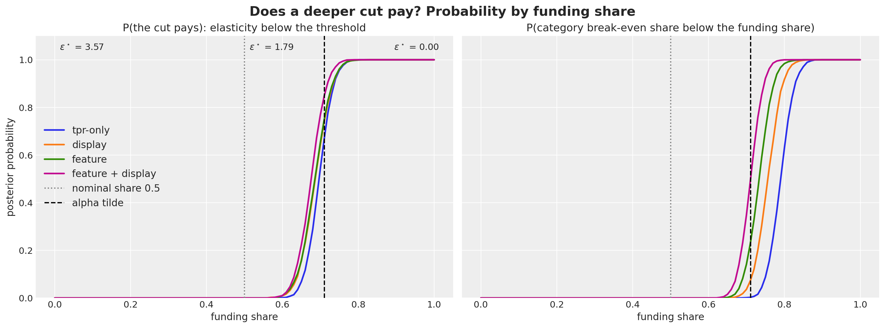</p>
</figure>


At the nominal share the threshold elasticity is 1.79 and the probability that a cut pays is zero under every mechanics. Both probabilities cross one half near \tilde\alpha (the category one exactly at \tilde\alpha for feature with display, by construction, since \tilde\alpha is the median of that distribution) and reach one by a share of 0.9.

In the following plot we show the expected event profit of the category against the depth of the focal product's cut, one row per mechanics and one column per funding share: the nominal 0.5, \tilde\alpha, and \tilde\alpha + 0.15. The bands are the 50\\ and 94\\ HDIs across draws of \Pi^\mu, so they carry the parameter and level-path uncertainty and not the demand noise; shaded depths have thin support.


``` python
def profit_curve(
    mechanics_name: str, alpha_value: float, kind: str = "mu"
) -> Float[np.ndarray, " sample n_depth"]:
    """Stack the event profit draws of one mechanics across the depth grid at a funding share."""
    source = event_units_mu if kind == "mu" else event_units_paths
    return np.stack(
        [
            event_profit(source[(mechanics_name, float(d))], float(d), alpha_value)
            for d in DEPTH_GRID
        ],
        axis=1,
    )


alpha_columns = [0.5, alpha_tilde, float(min(1.0, alpha_tilde + 0.15))]
curve_labels = [
    f"{mechanics_name} | alpha = {alpha_value:.2f}"
    for mechanics_name in MECHANICS
    for alpha_value in alpha_columns
]
curve_draws = np.stack(
    [
        profit_curve(mechanics_name, alpha_value)
        for mechanics_name in MECHANICS
        for alpha_value in alpha_columns
    ],
    axis=-1,
)
pc = az.plot_lm(
    predictions_to_datatree(curve_draws / 1_000.0, DEPTH_GRID.astype(float), curve_labels),
    y="obs",
    x="t",
    plot_dim="time",
    ci_kind="hdi",
    ci_prob=hdi_probs,
    smooth=False,
    point_estimate="mean",
    col_wrap=3,
    visuals={
        "ci_band": {"color": "C0"},
        "observed_scatter": False,
        "pe_line": {"color": "C0", "alpha": 1.0, "width": 1.5},
        "xlabel": False,
        "ylabel": False,
    },
    aes={"alpha": ["prob"]},
    alpha=hdi_alphas,
    figure_kwargs={"figsize": (15, 13)},
)

for label, mechanics_name in zip(
    curve_labels, [m for m in MECHANICS for _ in alpha_columns], strict=True
):
    ax = pc.get_target("t", {"series": label})
    ax.set_title(label)
    ax.axhline(float(baseline_mu.mean()) / 1_000.0, color="C3", linestyle="--", linewidth=1)

    for d, count in zip(DEPTH_GRID, support_counts[mechanics_name], strict=True):
        if count < THIN_SUPPORT:
            ax.axvspan(float(d) - 0.025, float(d) + 0.025, color="gray", alpha=0.15, linewidth=0)
    ax.xaxis.set_major_formatter(mtick.PercentFormatter(xmax=1, decimals=0))
bands = pc.viz["ci_band"]["t"].sel(series=curve_labels[-1])
curve_handles = [bands.sel(prob=prob).item() for prob in (0.94, 0.5)]

for handle, prob in zip(curve_handles, (0.94, 0.5), strict=True):
    handle.set_label(hdi_label(prob))
mean_line = pc.viz["pe_line"]["t"].sel(series=curve_labels[-1]).item()
mean_line.set_label("expected profit")
curve_handles += [
    mean_line,
    mlines.Line2D([], [], color="C3", linestyle="--", label="no promotion"),
    mlines.Line2D(
        [],
        [],
        color="gray",
        linewidth=8,
        alpha=0.3,
        label=f"thin support (fewer than {THIN_SUPPORT} store-weeks)",
    ),
]
fig = pc.viz["figure"].item()
fig.legend(handles=curve_handles, loc="outside lower center", ncols=5)

for label in curve_labels[-3:]:
    pc.get_target("t", {"series": label}).set_xlabel("discount depth of the focal product")
fig.supylabel("expected category event profit (thousand currency units)")
fig.suptitle(
    "Expected event profit vs depth by mechanics and funding share",
    fontsize=16,
    fontweight="bold",
    y=1.02,
);
```


<figure class="figure">
<p>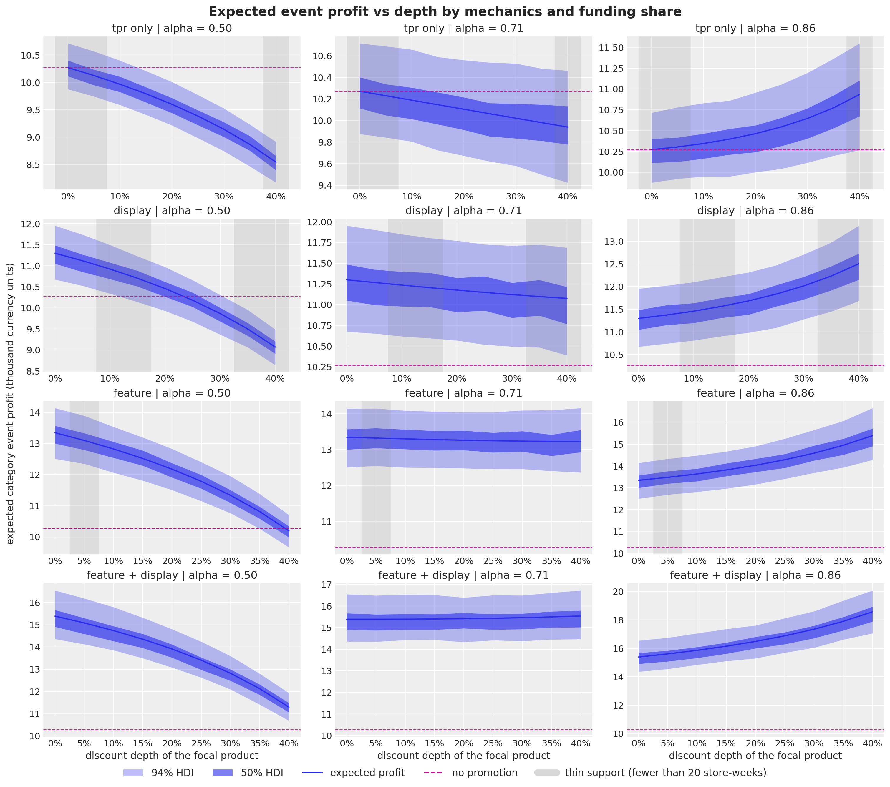</p>
</figure>


At the nominal share every curve falls with depth; at \tilde\alpha the curves are flat; at \tilde\alpha + 0.15 they rise. In the following plot we quantify the first two columns: per mechanics and share, the posterior probability that no promotion or the shallowest cell is the best choice, and the probability that the deepest cell is.


``` python
optimal_rows = []

for mechanics_name in MECHANICS:
    for alpha_value, alpha_name in ((0.5, "nominal share 0.5"), (alpha_tilde, "alpha tilde")):
        curve = profit_curve(mechanics_name, alpha_value)
        choice_set = np.concatenate([baseline_mu[:, None], curve], axis=1)
        best = choice_set.argmax(axis=1)
        optimal_rows.append(
            {
                "mechanics": mechanics_name,
                "funding share": alpha_name,
                "best cell": "no promotion or shallowest",
                "probability": float(np.isin(best, [0, 1]).mean()),
            }
        )
        optimal_rows.append(
            {
                "mechanics": mechanics_name,
                "funding share": alpha_name,
                "best cell": "deepest",
                "probability": float(np.mean(best == choice_set.shape[1] - 1)),
            }
        )
optimal_table = pl.DataFrame(optimal_rows)
grid = sns.catplot(
    data=as_pandas(optimal_table),
    x="mechanics",
    y="probability",
    hue="best cell",
    col="funding share",
    kind="bar",
    order=list(MECHANICS),
    height=4.5,
    aspect=1.5,
)
grid.set_titles("{col_name}")
grid.set_axis_labels("", "posterior probability")

for ax in grid.axes.flat:
    ax.tick_params(axis="x", rotation=15)
    ax.margins(y=0.15)
    for container in ax.containers:
        ax.bar_label(container, fmt="{:.2f}", fontsize=10)
grid.figure.suptitle(
    "Which depth is best? Probability of the two corners", fontsize=16, fontweight="bold", y=1.03
);
```


<figure class="figure">
<p></p>
</figure>


At the nominal share the probability that no promotion or the shallowest cell is optimal is 1.00 for all four mechanics. At \tilde\alpha the deepest cell is optimal in 64\\ of the draws for feature with display, so the depth decision is a corner at the nominal share and a toss-up near the break-even share.

The last figure of this subsection answers a different question: not whether a deeper cut pays against a shallower one, but whether an event pays against no promotion at all. In the following forest plot we show the event-level share \alpha^{\text{ev}} of a 5\\, a 15\\ and a 30\\ cut under each mechanics, with the posterior probability that the cell beats no promotion when the retailer funds the whole cut in the row label.


``` python
a_baseline, _ = profit_parts(event_units_mu[BASELINE], 0.0)
event_share_draws: dict[tuple[str, float], np.ndarray] = {}
event_share_labels = []
event_depths = (0.05, 0.15, 0.30)

for mechanics_name in MECHANICS:
    for d in event_depths:
        a_policy, b_policy = profit_parts(event_units_mu[(mechanics_name, d)], d)
        incremental_at_zero = a_policy - a_baseline
        event_share_draws[(mechanics_name, d)] = -incremental_at_zero / b_policy
        event_share_labels.append(
            f"{mechanics_name} at {d:.0%} | median {np.median(-incremental_at_zero / b_policy):+.2f} "
            f"| P(beats no promotion) {np.mean(incremental_at_zero > 0):.2f}"
        )
event_share_stack = np.stack(
    [event_share_draws[(m, d)] for m in MECHANICS for d in event_depths], axis=1
)
pc = forest_plot(
    draws_dataset("share", event_share_stack, "row", event_share_labels),
    ["share"],
    ["row"],
    figsize=(13.0, 6.5),
)
ax = pc.viz["plot"].sel(column="forest").item()
ax.axvline(1.0, color="gray", linestyle=":", linewidth=1)
ax.set(xlabel="event-level funding share (below 0: pays unfunded; above 1: never pays)")
pc.viz["figure"].item().suptitle(
    "Funding share at which an event breaks even against no promotion",
    fontsize=16,
    fontweight="bold",
);
```


<figure class="figure">
<p></p>
</figure>


A feature-with-display event at a 15\\ cut beats no promotion even if the retailer funds the whole cut (event-level share -0.32), and so does a feature alone (-0.12). The mechanics uplift carries both, not the cut: against the same mechanics at base price the cut itself needs the category secant of the break-even figure (0.71 at zone level), and the planner subsection shows the posterior adding it in no store at the nominal share. The same cut under a shelf tag needs a share of 0.79, and a 30\\ cut under feature with display needs 0.30.


## The break-even cost of a feature or display slot

A feature or a display uses a slot in the circular or on the floor, and the data contain no price for it. So we solve for the price: the break-even slot cost of a mechanics at a depth is the incremental gross event profit it adds over a shelf-tag-only cut of the same depth, divided by the number of store-weeks it occupies. At zero depth the comparison is against no promotion at all, a pure mechanics uplift. In the following forest plot we show these break-even slot costs at three depths and at the nominal and the break-even funding share.


``` python
slot_mechanics = ["display", "feature", "feature + display"]
slot_depths = (0.0, 0.15, 0.30)
slot_shares = (0.5, alpha_tilde)
slot_draws: dict[tuple[str, float, float], np.ndarray] = {}

for mechanics_name in slot_mechanics:
    for d in slot_depths:
        for alpha_value in slot_shares:
            with_mechanics = event_profit(event_units_mu[(mechanics_name, d)], d, alpha_value)
            reference = (
                baseline_mu
                if d == 0.0
                else event_profit(event_units_mu[("tpr-only", d)], d, alpha_value)
            )
            slot_draws[(mechanics_name, d, alpha_value)] = (with_mechanics - reference) / (
                N_EVENT_WEEKS * n_stores
            )
slot_labels = [
    f"{m} at {d:.0%} | alpha {a:.2f} | median {np.median(slot_draws[(m, d, a)]):.0f}"
    for m in slot_mechanics
    for d in slot_depths
    for a in slot_shares
]
slot_stack = np.stack(
    [slot_draws[(m, d, a)] for m in slot_mechanics for d in slot_depths for a in slot_shares],
    axis=1,
)
pc = forest_plot(
    draws_dataset("slot", slot_stack, "row", slot_labels), ["slot"], ["row"], figsize=(12.0, 8.0)
)
ax = pc.viz["plot"].sel(column="forest").item()
ax.set(xlabel="currency units per store-week")
pc.viz["figure"].item().suptitle(
    "Break-even slot cost (incremental gross profit over a shelf-tag cut of the same depth)",
    fontsize=16,
    fontweight="bold",
);
```


<figure class="figure">
<p>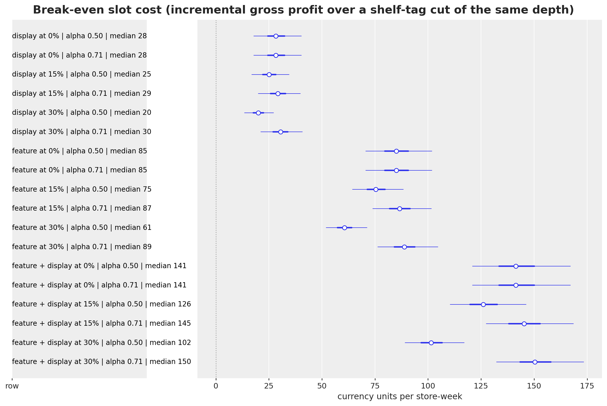</p>
</figure>


The next cell shows the three values the prose quotes: the slots at a 15\\ cut and the break-even share.


``` python
pl.DataFrame(
    [{"mechanics": m, **hdi_row(slot_draws[(m, 0.15, alpha_tilde)])} for m in slot_mechanics]
)
```


| mechanics           | median | hdi94_lower | hdi94_upper |
|---------------------|--------|-------------|-------------|
| "display"           | 29.15  | 19.67       | 39.38       |
| "feature"           | 86.66  | 73.47       | 101.12      |
| "feature + display" | 145.33 | 125.44      | 166.1       |


At a 15\\ cut and the break-even share, a display is worth 29 currency units per store-week over the same cut with a shelf tag alone (94\\ HDI 20 to 39), a feature 87 (73 to 101) and the pair 145 (125 to 166). At the nominal share the same values are lower, because the margin lost on the extra units counts against the slot.

In the following plot we assume a cost per slot and store-week, the same for a feature and for a display (the pair costs twice as much), and show the posterior probability that each option is the best choice over the whole grid as that cost rises, at both funding shares.


``` python
SLOT_LADDER = [0.0, 25.0, 50.0, 75.0, 100.0, 150.0]
slots_used = {"tpr-only": 0.0, "display": 1.0, "feature": 1.0, "feature + display": 2.0}
choice_options = ["no promotion", *MECHANICS]
choice_rows = []

for alpha_value in slot_shares:
    for slot_cost in SLOT_LADDER:
        stacks, names = [baseline_mu], ["no promotion"]

        for mechanics_name in MECHANICS:
            curve = (
                profit_curve(mechanics_name, alpha_value)
                - N_EVENT_WEEKS * n_stores * slots_used[mechanics_name] * slot_cost
            )
            stacks.append(curve)
            names.extend([mechanics_name] * len(DEPTH_GRID))
        choice_set = np.concatenate([stacks[0][:, None], *stacks[1:]], axis=1)
        best_names = np.asarray(names)[choice_set.argmax(axis=1)]

        for name in choice_options:
            choice_rows.append(
                {
                    "alpha": alpha_value,
                    "cost per slot": slot_cost,
                    "option": name,
                    "probability": float(np.mean(best_names == name)),
                }
            )
choice_table = pl.DataFrame(choice_rows)

fig, axes = plt.subplots(ncols=2, figsize=(15, 5.5), sharey=True, layout="constrained")

for ax, alpha_value in zip(axes, slot_shares, strict=True):
    for option in choice_options:
        subset = choice_table.filter(
            pl.col("alpha").eq(pl.lit(alpha_value)).and_(pl.col("option").eq(pl.lit(option)))
        )
        ax.plot(
            subset["cost per slot"].to_numpy(),
            subset["probability"].to_numpy(),
            marker="o",
            linewidth=2,
            label=option,
        )
    for slot_cost in SLOT_LADDER:
        at_cost = choice_table.filter(
            pl.col("alpha")
            .eq(pl.lit(alpha_value))
            .and_(pl.col("cost per slot").eq(pl.lit(slot_cost)))
        )
        best = at_cost.sort("probability", descending=True).row(0, named=True)
        ax.annotate(
            f"{best['probability']:.2f}",
            (slot_cost, best["probability"]),
            textcoords="offset points",
            xytext=(0, 8),
            ha="center",
            fontsize=10,
        )
    ax.set(xlabel="cost per slot and store-week", title=f"funding share {alpha_value:.2f}")
fig.legend(handles=axes[0].get_legend_handles_labels()[0], loc="outside lower center", ncols=5)
axes[0].set(ylabel="P(option is the best choice)")
fig.suptitle("Which mechanics is best as the slot cost rises", fontsize=16, fontweight="bold");
```


<figure class="figure">
<p></p>
</figure>


With slots at 25 per store-week, feature with display is the best choice with probability 1.00 at both shares. At 50 it keeps a probability of 0.73 at the nominal share and 0.89 at the break-even share, against a feature alone. At 75 the feature alone wins with probability 0.86 and 0.88; at 100 no promotion wins with probability 0.96 and 0.92. The mechanics decision therefore depends on a number the data do not contain, and the figure tells the category manager at which slot cost the answer changes.


## Store-by-store decisions

The zone-level shares above pool the 18 stores. The model has no cross-store terms, so the same break-even shares can be computed per store, and the per-store decisions are separable. This matters because the funding share is negotiated once, but the decision to add the cut can be taken store by store. In the following plot we show, per store, the probability that a cut pays under feature with display at the nominal and at the break-even funding share, with the stores ordered by their number of identifying weeks.


``` python
policy_shallow, policy_deeper = ("feature + display", 0.0), ("feature + display", 0.05)
a_shallow_s, b_shallow_s = profit_parts_by_store(event_units_mu[policy_shallow], 0.0)
a_deeper_s, b_deeper_s = profit_parts_by_store(event_units_mu[policy_deeper], 0.05)
store_share_cat = (a_shallow_s - a_deeper_s) / (b_deeper_s - b_shallow_s)
a_shallow_b, b_shallow_b = profit_parts_by_store(
    event_units_mu[policy_shallow], 0.0, brand_only=True
)
a_deeper_b, b_deeper_b = profit_parts_by_store(
    event_units_mu[policy_deeper], 0.05, brand_only=True
)
store_share_brand = (a_shallow_b - a_deeper_b) / (b_deeper_b - b_shallow_b)
eps_store_fd = eps_store_draws - feature_depth_draws[:, None] - display_depth_draws[:, None]
store_positions = np.arange(n_stores)

cut_pays = {
    alpha_value: np.mean(eps_store_fd[:, store_order] < -(1.0 - alpha_value) / G_FOCAL, axis=0)
    for alpha_value in slot_shares
}
fig, ax = plt.subplots(figsize=(11, 7), layout="constrained")

for alpha_value, marker, color in zip(slot_shares, ("o", "s"), ("C0", "C3"), strict=True):
    ax.plot(
        cut_pays[alpha_value],
        store_positions,
        marker,
        markersize=9,
        color=color,
        label=f"funding share {alpha_value:.2f}",
    )
ax.set_yticks(
    store_positions,
    [
        f"{label}: {cut_pays[0.5][j]:.2f} | {cut_pays[alpha_tilde][j]:.2f}"
        for j, label in enumerate(store_labels_ordered)
    ],
)
ax.invert_yaxis()
ax.axvline(0.5, color="gray", linestyle=":", linewidth=1)
fig.legend(handles=ax.get_legend_handles_labels()[0], loc="outside lower center", ncols=2)
ax.set(
    xlabel="P(the cut pays): elasticity below the threshold",
    xlim=(-0.05, 1.05),
    title="Probability that the cut pays, per store (feature + display)",
);
```


<figure class="figure">
<p>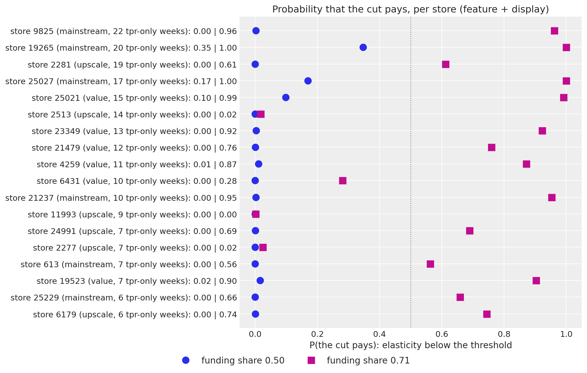</p>
</figure>


At the nominal share the probability that the cut pays is at most 0.35 in every store and at most 0.02 in fifteen of them. At the break-even share it ranges from 0.00 to 1.00: the upscale stores 2513, 11993 and 2277 are at 0.02 or less, the mainstream stores 19265 and 25027 at 1.00. In the following forest plot we show the per-store break-even shares themselves, brand-only and category, against the zone-level \tilde\alpha.


``` python
store_share_labels = [
    f"{label}: {np.median(store_share_brand[:, j]):.2f} | {np.median(store_share_cat[:, j]):.2f}"
    for j, label in zip(store_order, store_labels_ordered, strict=True)
]
store_share_ds = xr.merge(
    [
        draws_dataset(
            "brand-only", store_share_brand[:, store_order], "store", store_share_labels
        ),
        draws_dataset("category", store_share_cat[:, store_order], "store", store_share_labels),
    ]
)
pc = forest_plot(
    store_share_ds, ["brand-only", "category"], ["__variable__", "store"], figsize=(13.0, 13.0)
)
ax = pc.viz["plot"].sel(column="forest").item()
ax.axvline(1.0, color="gray", linestyle=":", linewidth=1)
ax.axvline(alpha_tilde, color="C3", linestyle="--", linewidth=1.5, label="zone-level alpha tilde")
ax.legend(loc="lower left")
ax.set(xlabel="funding share", xlim=(-0.5, 1.5))
pc.viz["figure"].item().suptitle(
    "Break-even funding share per store (feature + display)", fontsize=16, fontweight="bold"
);
```


<figure class="figure">
<p>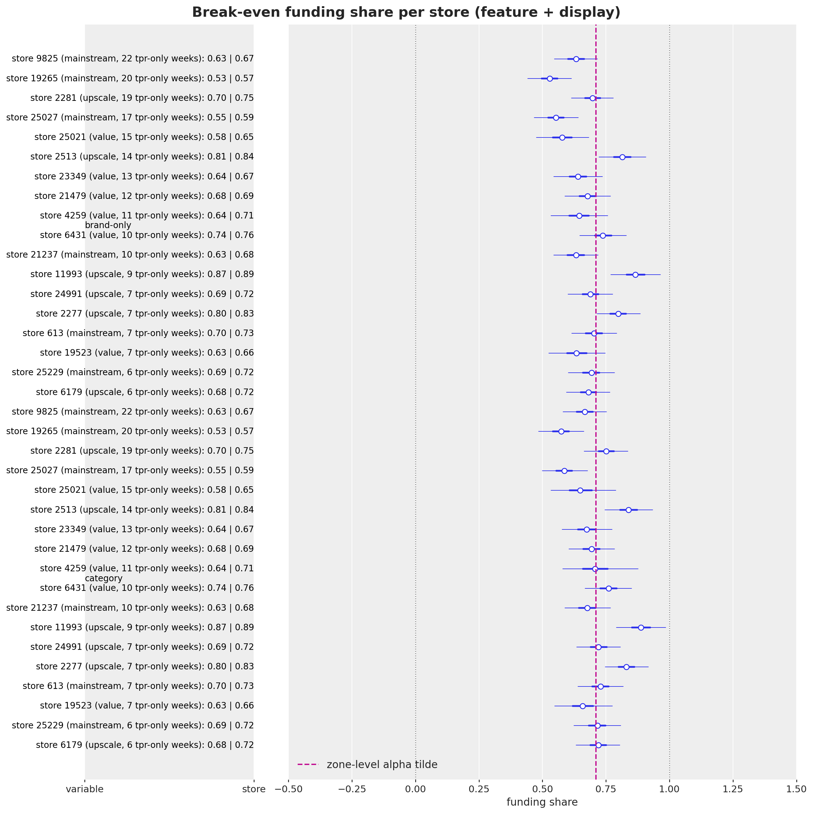</p>
</figure>


The store-level break-even shares (brand-only medians from 0.53 to 0.87, category medians from 0.57 to 0.89) line up by segment more than by the number of identifying weeks, and their 94\\ HDIs are about twice as wide as the zone-level one. Where the intervals are wide, the store's decision is uncertain, and it is the partial pooling of the store-level elasticities that keeps them from being prior-dominated.


## Go or no-go: the downside risk

Expected profit is not the whole decision: a category manager also wants to know how bad the promotion can turn out. The incremental profit of a policy against no promotion, \Delta\Pi_r(a) = \Pi_r(a) - \Pi_r(a_0), is computed here on the sampled event paths, so it carries the demand noise as well as the parameter and level-path uncertainty, draw by draw under common random numbers (the same posterior draw, the same level path, coupled demand draws). That coupling is an assumption the data cannot identify: the potential outcomes of the same week under two policies are never observed together. We summarize the downside with the conditional value at risk at the 10\\ level, \text{CVaR}\_{0.10}, the mean of the worst tenth of the draws ([Rockafellar and Uryasev, 2000](https://doi.org/10.21314/JOR.2000.038)), and its Monte Carlo error with a bootstrap over the draws and with the spread across the four chains. The next cell computes the expected increment, the probability of loss and the CVaR of every policy at \tilde\alpha, and shows the CVaR and its two standard errors for the three policies with the highest expected increment.


``` python
def incremental_paths(
    policy: tuple[str, float], alpha_value: float
) -> Float[np.ndarray, " sample"]:
    """Compute the incremental event profit of a policy over no promotion on the sampled paths."""
    return event_profit(event_units_paths[policy], policy[1], alpha_value) - event_profit(
        event_units_paths[BASELINE], 0.0, alpha_value
    )


def cvar(draws: Float[np.ndarray, " sample"], level: float = 0.10) -> float:
    """Average the lowest ``level`` share of the draws."""
    ordered = np.sort(draws)
    return float(ordered[: max(1, int(np.floor(level * ordered.size)))].mean())


def cvar_bootstrap_se(
    draws: Float[np.ndarray, " sample"], level: float = 0.10, n_boot: int = 2_000
) -> float:
    """Estimate the standard error of the CVaR with an iid bootstrap over the draws."""
    boot_rng = np.random.default_rng(seed=0)
    resampled = boot_rng.choice(draws, size=(n_boot, draws.size), replace=True)
    lowest = np.sort(resampled, axis=1)[:, : max(1, int(np.floor(level * draws.size)))]
    return float(lowest.mean(axis=1).std(ddof=1))


def cvar_chain_se(draws: Float[np.ndarray, " sample"], level: float = 0.10) -> float:
    """Estimate the standard error of the CVaR from the spread of the per-chain values."""
    # ``mcmc.get_samples()`` flattens the chains chain-major and ``Predictive`` keeps the
    # order, so consecutive blocks of the flat draws are the chains.
    per_chain = np.array([cvar(chain, level) for chain in draws.reshape(N_CHAINS, -1)])
    return float(per_chain.std(ddof=1) / np.sqrt(N_CHAINS))


risk_rows = []

for policy in policies:
    if policy == BASELINE:
        continue
    delta = incremental_paths(policy, alpha_tilde)
    risk_rows.append(
        {
            "mechanics": policy[0],
            "depth": policy[1],
            "expected_increment": float(delta.mean()),
            "P(loss)": float(np.mean(delta < 0)),
            "cvar_10": cvar(delta),
        }
    )
risk_table = pl.DataFrame(risk_rows).sort("expected_increment", descending=True)
top_policies = [
    (row["mechanics"], row["depth"]) for row in risk_table.head(3).iter_rows(named=True)
]
pl.DataFrame(
    [
        {
            "policy": f"{policy[0]} at {policy[1]:.0%}",
            "expected increment": round(float(incremental_paths(policy, alpha_tilde).mean())),
            "CVaR10": round(cvar(incremental_paths(policy, alpha_tilde))),
            "bootstrap se": round(cvar_bootstrap_se(incremental_paths(policy, alpha_tilde))),
            "between-chain se": round(cvar_chain_se(incremental_paths(policy, alpha_tilde))),
        }
        for policy in top_policies
    ]
)
```


| policy | expected increment | CVaR10 | bootstrap se | between-chain se |
|----|----|----|----|----|
| "feature + display at 40%" | 5265 | 4404 | 14 | 12 |
| "feature + display at 35%" | 5220 | 4404 | 13 | 10 |
| "feature + display at 30%" | 5184 | 4397 | 12 | 8 |


The three deepest feature-with-display cells have the highest expected increments, 5{,}265 for the deepest, and \text{CVaR}\_{0.10} values of 4{,}404, 4{,}404 and 4{,}397, with bootstrap standard errors of 12 to 14 and between-chain standard errors of 8 to 12, so the risk measure does not separate them either; the earlier figure gave the deepest cell a 64\\ chance of being the best cell.

The common random numbers are an assumption, so the next cell computes a sensitivity: the CVaR of the committed policy against a baseline whose level path and demand noise are redrawn under a different key while the parameters are shared.


``` python
committed = ("feature + display", 0.15)
rng_key, key_alt = random.split(rng_key)
out_alt = scenario_draws(
    key_alt, nuts_model, posterior, y_train, policy_covariates(0.0, *MECHANICS["tpr-only"])
)
baseline_alt_units = np.asarray(out_alt["forecast"], dtype=np.float32)[:, EVENT_OFFSETS, :].sum(
    axis=1
)
delta_common = incremental_paths(committed, alpha_tilde)
delta_alt = event_profit(event_units_paths[committed], committed[1], alpha_tilde) - event_profit(
    baseline_alt_units, 0.0, alpha_tilde
)
pl.DataFrame(
    {
        "baseline draws": ["common random numbers", "redrawn under another key"],
        "CVaR10": [round(cvar(delta_common)), round(cvar(delta_alt))],
        "P(loss)": [
            round(float(np.mean(delta_common < 0)), 2),
            round(float(np.mean(delta_alt < 0)), 2),
        ],
    }
)
```


| baseline draws              | CVaR10 | P(loss) |
|-----------------------------|--------|---------|
| "common random numbers"     | 4343   | 0.0     |
| "redrawn under another key" | 3960   | 0.0     |


The coupling matters for the downside number: the committed policy has a \text{CVaR}\_{0.10} of 4{,}343 under common random numbers and 3{,}960 with a redrawn baseline, a difference the data cannot arbitrate. In the following plot we add the slot cost to the committed policy and show the probability of loss and the CVaR along the slot-cost ladder, at both funding shares.


``` python
go_rows = []

for slot_cost in SLOT_LADDER:
    total_slot_cost = N_EVENT_WEEKS * n_stores * slots_used[committed[0]] * slot_cost

    for alpha_value in slot_shares:
        delta = incremental_paths(committed, alpha_value) - total_slot_cost
        go_rows.append(
            {
                "cost per slot": slot_cost,
                "alpha": alpha_value,
                "expected increment": float(delta.mean()),
                "P(loss)": float(np.mean(delta < 0)),
                "cvar_10": cvar(delta),
            }
        )
go_table = pl.DataFrame(go_rows)

fig, axes = plt.subplots(ncols=2, figsize=(15, 5.5), layout="constrained")

for alpha_value, color in zip(slot_shares, ("C0", "C3"), strict=True):
    subset = go_table.filter(pl.col("alpha").eq(pl.lit(alpha_value)))
    axes[0].plot(
        subset["cost per slot"].to_numpy(),
        subset["P(loss)"].to_numpy(),
        marker="o",
        linewidth=2,
        color=color,
        label=f"funding share {alpha_value:.2f}",
    )
    axes[1].plot(
        subset["cost per slot"].to_numpy(),
        subset["cvar_10"].to_numpy() / 1_000.0,
        marker="o",
        linewidth=2,
        color=color,
        label=f"funding share {alpha_value:.2f}",
    )

for point in go_table.iter_rows(named=True):
    axes[0].annotate(
        f"{point['P(loss)']:.2f}",
        (point["cost per slot"], point["P(loss)"]),
        textcoords="offset points",
        xytext=(0, 8),
        ha="center",
        fontsize=10,
    )
axes[1].axhline(0.0, color="black", linewidth=1)
axes[0].legend(loc="upper left")
axes[0].set(xlabel="cost per slot and store-week", ylabel="P(loss)", ylim=(-0.05, 1.1))
axes[1].set(xlabel="cost per slot and store-week", ylabel="CVaR10 of the increment (thousand)")
fig.suptitle(
    f"Go or no-go for {committed[0]} at {committed[1]:.0%} as the slot cost rises",
    fontsize=16,
    fontweight="bold",
);
```


<figure class="figure">
<p>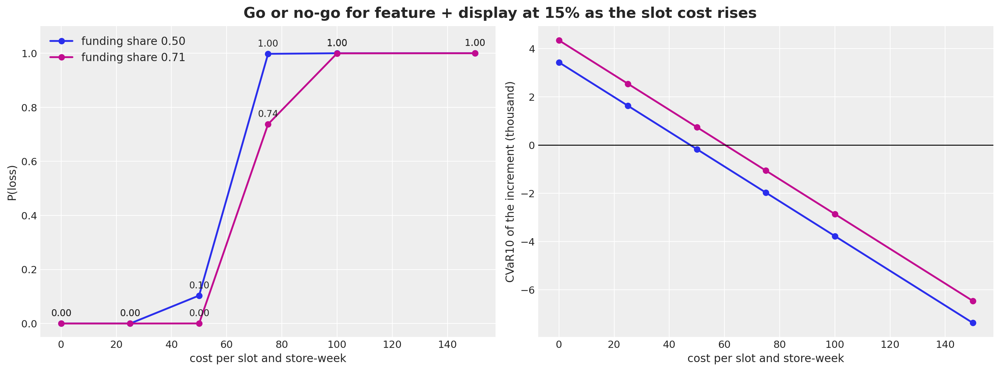</p>
</figure>


With slots at 25 per store-week the committed event still has a probability of loss of 0.00 at both shares; at 50 the probability is 0.10 at the nominal share and 0.00 at the break-even share; at 75 it is 1.00 and 0.74. The go turns into a no-go between 50 and 75 per slot and store-week. In the following plot we show the histograms of the incremental profit of the top three policies, and the expected increment against the CVaR of every policy of the grid.


``` python
fig, axes = plt.subplots(ncols=2, figsize=(15, 6), layout="constrained")

for policy, color in zip(top_policies, ("C0", "C1", "C2"), strict=True):
    delta = incremental_paths(policy, alpha_tilde) / 1_000.0
    axes[0].hist(delta, bins=60, color=color, alpha=0.5, label=f"{policy[0]} at {policy[1]:.0%}")
    axes[0].axvline(cvar(delta), color=color, linestyle="--", linewidth=1)
axes[0].axvline(0.0, color="black", linewidth=1, label="no promotion")
axes[0].margins(y=0.3)
axes[0].legend(loc="upper left")
axes[0].set(
    xlabel="incremental event profit (thousand currency units)",
    ylabel="draws",
    title="Incremental profit of the top three policies (dashed: CVaR10)",
)
colors = dict(zip(MECHANICS, ("C0", "C1", "C2", "C3"), strict=True))

for row in risk_table.iter_rows(named=True):
    axes[1].scatter(
        row["expected_increment"] / 1_000.0,
        row["cvar_10"] / 1_000.0,
        color=colors[row["mechanics"]],
        s=30 + 200 * row["depth"],
        alpha=0.8,
    )
feasible = risk_table.filter(pl.col("cvar_10").ge(pl.lit(0)))
best_unconstrained = risk_table.row(0, named=True)
best_feasible = feasible.sort("expected_increment", descending=True).row(0, named=True)
axes[1].axhline(0.0, color="black", linewidth=1)
axes[1].axhspan(
    0.0,
    max(0.1, float(risk_table["cvar_10"].to_numpy().max()) / 1_000.0 * 1.2),
    color="C2",
    alpha=0.08,
    label="CVaR10 >= 0",
)
axes[1].scatter(
    best_unconstrained["expected_increment"] / 1_000.0,
    best_unconstrained["cvar_10"] / 1_000.0,
    marker="*",
    s=300,
    color="black",
    label=(
        f"highest expected increment: {best_unconstrained['mechanics']} "
        f"at {best_unconstrained['depth']:.0%}"
    ),
)
axes[1].scatter(
    best_feasible["expected_increment"] / 1_000.0,
    best_feasible["cvar_10"] / 1_000.0,
    marker="D",
    s=120,
    facecolor="none",
    edgecolor="black",
    linewidth=2,
    label=f"best with CVaR10 >= 0: {best_feasible['mechanics']} at {best_feasible['depth']:.0%}",
)
axes[1].legend(
    handles=[
        *axes[1].get_legend_handles_labels()[0],
        *[
            mlines.Line2D([], [], color=c, marker="o", linewidth=0, label=m)
            for m, c in colors.items()
        ],
    ],
    loc="upper left",
)
axes[1].set(
    xlabel="expected incremental profit (thousand)",
    ylabel="CVaR10 of the increment (thousand)",
    title="Expected increment vs downside per policy (dot size: depth)",
)
fig.suptitle(
    f"Risk of the promotion at a funding share of {alpha_tilde:.2f}",
    fontsize=16,
    fontweight="bold",
);
```


<figure class="figure">
<p>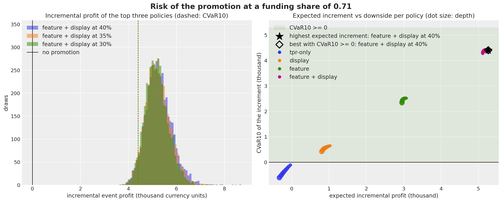</p>
</figure>


The histograms of the three deepest feature-with-display cells overlap almost completely, and the scatter shows the shelf-tag cuts as the only policies with a negative downside: every policy with a feature or a display has a positive \text{CVaR}\_{0.10}, so at a zero slot cost the go/no-go is a go for all of them at the break-even share.


## Point-estimate planners against the posterior

The strategy promised a comparison of each answer with what a point forecast would give. For the depth decision, the comparison is trivial: profit is linear in units, so a planner that replaces the random units by their expectation ranks every policy exactly as the posterior does, and the value of the stochastic solution for the pricing lever alone is zero, by construction. The comparison that matters is with planners that use point estimates of the parameters:

| planner | inputs | what it ignores | comparison shown |
|----|----|----|----|
| expected value | posterior expected units | the spread of the units | nothing to show: identical ranking |
| posterior-mean plug-in | parameters at their posterior means | Jensen's gap between \text{E}\[(1-d)^{\varepsilon}\] and (1-d)^{\text{E}\[\varepsilon\]} | the ratio of the two, per depth |
| store least-squares plug-in | within-store least-squares elasticity, pooled least-squares mechanics multipliers | shrinkage across stores, the selection effect of choosing on noisy estimates | store-by-store decisions and the postdecision disappointment |
| posterior | the partially pooled posterior | nothing the model does not | store-by-store decisions |

The next cell shows the Jensen gap, which is small whenever the elasticity posterior is tight.


``` python
eps_fd_zone = eps_m_draws("feature + display")
jensen_rows = []

for d in DEPTH_GRID[1:]:
    expectation_of_power = float(np.mean((1.0 - d) ** eps_fd_zone))
    power_of_expectation = float((1.0 - d) ** np.mean(eps_fd_zone))
    jensen_rows.append(
        {
            "depth": float(d),
            "E[(1-d)^eps]": round(expectation_of_power, 3),
            "(1-d)^E[eps]": round(power_of_expectation, 3),
            "ratio": round(expectation_of_power / power_of_expectation, 3),
        }
    )
pl.DataFrame(jensen_rows)
```


| depth | E\[(1-d)^eps\] | (1-d)^E\[eps\] | ratio |
|-------|----------------|----------------|-------|
| 0.05  | 1.061          | 1.061          | 1.0   |
| 0.1   | 1.13           | 1.13           | 1.0   |
| 0.15  | 1.207          | 1.207          | 1.0   |
| 0.2   | 1.295          | 1.295          | 1.0   |
| 0.25  | 1.396          | 1.395          | 1.001 |
| 0.3   | 1.513          | 1.512          | 1.001 |
| 0.35  | 1.649          | 1.647          | 1.001 |
| 0.4   | 1.81           | 1.807          | 1.002 |


The Jensen ratio is at most 1.002 across the grid, so the posterior-mean plug-in and the posterior planner agree.

The store least-squares planner is the one that differs from the posterior. It faces two store-level decisions about the committed event, feature with display at 15\\: whether to run the event at all against no promotion, and whether to add the cut against the same mechanics at base price. It decides each with the store's own within-store elasticity (the specification with flags, plus the focal product's least-squares depth slopes), the focal product's least-squares mechanics multipliers and the least-squares cross terms, applied to the same reference units and margins as the posterior planner. Both plans are evaluated under the posterior, which is the evaluation measure: the posterior planner is optimal under it by construction, so the gap measures what the point estimates cost. The disappointment of [Smith and Winkler (2006)](https://doi.org/10.1287/mnsc.1050.0451) is the gap between the gain the least-squares planner predicts for the stores it chooses and the gain the posterior expects for them. The next cell shows the two decisions at both shares.


``` python
ls_effects = dict(zip(hnc_full_ols["term"].to_list(), hnc_full_ols["coef"].to_list(), strict=True))
cross_on_focal = {
    row["units of"]: float(row[f"price of {FOCAL}"]) for row in cross_ols.iter_rows(named=True)
}
ls_eps_store = {
    store: float(store_ols[j] - ls_effects["feature_lam"] - ls_effects["display_lam"])
    for j, store in enumerate(hnc_store_ids)
}
committed_depth = committed[1]


def least_squares_units(
    reference_units: Float[np.ndarray, " n_series"], add_mechanics: bool
) -> Float[np.ndarray, " n_series"]:
    """Predict the event units of the committed policy with the store least-squares planner."""
    units = np.empty(n_series)

    for n in range(n_series):
        store, product = series_ids[n].split("::")
        if product == FOCAL:
            uplift = (
                np.exp(
                    ls_effects["feature"] + ls_effects["display"] + ls_effects["feature_display"]
                )
                if add_mechanics
                else 1.0
            )
            units[n] = (
                reference_units[n] * (1.0 - committed_depth) ** ls_eps_store[int(store)] * uplift
            )
        else:
            uplift = (
                np.exp(ls_effects["sib_feature"] + ls_effects["sib_display"])
                if add_mechanics
                else 1.0
            )
            units[n] = (
                reference_units[n] * (1.0 - committed_depth) ** cross_on_focal[product] * uplift
            )
    return units


a_committed_s, b_committed_s = profit_parts_by_store(event_units_mu[committed], committed_depth)
planner_rows = []
planner_scatter: dict[float, tuple[np.ndarray, np.ndarray]] = {}

for decision_label, reference_policy, add_mechanics in [
    ("run the event vs no promotion", BASELINE, True),
    ("add the cut vs the mechanics at base price", (committed[0], 0.0), False),
]:
    reference_units_mean = event_units_mu[reference_policy].mean(axis=0)
    ls_units = least_squares_units(reference_units_mean, add_mechanics)
    a_reference_s, _ = profit_parts_by_store(event_units_mu[reference_policy], 0.0)
    a_ls, b_ls = profit_parts_by_store(ls_units[None, :], committed_depth)
    a_ls_reference, _ = profit_parts_by_store(reference_units_mean[None, :], 0.0)

    for alpha_value in slot_shares:
        posterior_gain = (a_committed_s + alpha_value * b_committed_s - a_reference_s).mean(
            axis=0
        )  # (n_stores,)
        predicted_gain = (a_ls + alpha_value * b_ls - a_ls_reference)[0]
        choose_ls, choose_bayes = predicted_gain > 0, posterior_gain > 0
        planner_rows.append(
            {
                "decision": decision_label,
                "alpha": round(alpha_value, 2),
                "stores: least squares": int(choose_ls.sum()),
                "stores: posterior": int(choose_bayes.sum()),
                "stores: disagree": int((choose_ls != choose_bayes).sum()),
                "value of the least-squares plan": round(
                    float((choose_ls * posterior_gain).sum())
                ),
                "value of the posterior plan": round(float((choose_bayes * posterior_gain).sum())),
                "least-squares disappointment": round(
                    float((choose_ls * (predicted_gain - posterior_gain)).sum())
                ),
            }
        )
        if not add_mechanics:
            planner_scatter[alpha_value] = (predicted_gain, posterior_gain)
pl.DataFrame(planner_rows)
```


| decision | alpha | stores: least squares | stores: posterior | stores: disagree | value of the least-squares plan | value of the posterior plan | least-squares disappointment |
|----|----|----|----|----|----|----|----|
| "run the event vs no promotion" | 0.5 | 18 | 18 | 0 | 4080 | 4080 | -717 |
| "run the event vs no promotion" | 0.71 | 18 | 18 | 0 | 5130 | 5130 | -695 |
| "add the cut vs the mechanics at base price" | 0.5 | 3 | 0 | 3 | -110 | 0 | 222 |
| "add the cut vs the mechanics at base price" | 0.71 | 18 | 9 | 9 | 11 | 162 | 864 |


For the decision to run the event, both planners choose all 18 stores at both shares; the least-squares planner's disappointment is negative (-717 and -695), because its own mechanics multipliers under-predict the uplift the posterior expects. For the decision to add the cut at the nominal share, the posterior planner adds it in no store and the least-squares planner in 3; that plan is worth -110 under the posterior, a disappointment of 222. At the break-even share the least-squares planner adds the cut in all 18 stores and the posterior planner in 9. The least-squares plan is worth 11 under the posterior against 162 for the posterior plan, and the disappointment is 864. In the following plot we show, per store, the gain of the cut predicted by the least-squares planner against the gain the posterior expects, at both shares.


``` python
fig, axes = plt.subplots(ncols=2, figsize=(15, 6.5), layout="constrained")

for ax, alpha_value in zip(axes, slot_shares, strict=True):
    predicted_gain, posterior_gain = planner_scatter[alpha_value]
    ax.scatter(predicted_gain, posterior_gain, color="C0", s=60, label="store")
    limit = max(np.abs(predicted_gain).max(), np.abs(posterior_gain).max()) * 1.1
    ax.plot([-limit, limit], [-limit, limit], color="gray", linestyle=":", label="identity")
    ax.axhline(0.0, color="black", linewidth=1)
    ax.axvline(0.0, color="black", linewidth=1)
    ax.set(
        xlabel="gain of the cut predicted by the store least-squares planner",
        ylabel="gain of the cut evaluated under the posterior",
        title=f"funding share {alpha_value:.2f}",
    )
axes[0].legend(loc="upper left")
fig.suptitle(
    f"Store least-squares planner vs posterior: add the {committed[1]:.0%} cut to {committed[0]}",
    fontsize=16,
    fontweight="bold",
);
```


<figure class="figure">
<p>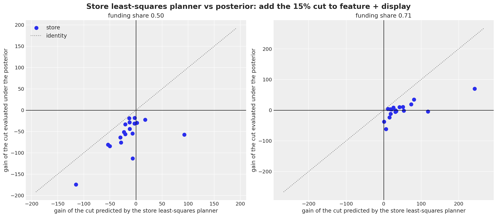</p>
</figure>


At the break-even share nearly every store is on or below the identity line, and the store with the largest predicted gain keeps a small part of it. This is the postdecision disappointment in a picture: the stores with the most extreme least-squares elasticities are the ones the planner picks, and they are the ones whose estimates the posterior shrinks the most.


## How much to order: the newsvendor problem

This is the third business question. The order belongs to the replenishment planner, who takes the promotion as committed: feature with display at a 15\\ cut, the grid cell nearest the realized Thanksgiving event, under the nominal funding share of 0.5. The question is a newsvendor problem: one order per store for the two event weeks, an underage cost for every unit short and an overage cost for every unit left over. What the posterior adds is the joint distribution of the two event weeks, which a per-week forecast does not have.


### Event demand, costs and the critical fractile

Every quantity here is per store; the totals sum the 18 stores. Let y\_{r,t,\text{H}} be the sampled units of the focal product in one store in event week t under the committed policy, in draw r. One order covers both event weeks with no mid-event replenishment, so the demand the order faces is the two-week sum of the same sampled path, which keeps the correlation between the weeks:

 W_r = \sum\_{t \in E} y\_{r,t,\text{H}}. 

A unit short loses the margin it would have earned. The underage cost is the promo-week unit margin at the committed depth and the nominal share, because the allowance is earned only on units sold:

 c_u = m\_{\text{H},s}(0.15) = p\_{\text{H},s}\\ \big(g\_{\text{H}} - 0.5 \times 0.15\big). 

The true underage cost is a little lower, since part of the stockout demand is recovered at the private-label margin, so the fractile below is an upper bound and the order leans high. A unit left over is carried and sold later at the regular margin, because cereal is shelf-stable, so only the holding cost is lost. The overage cost is a holding share \eta of the unit cost, and a realistic \eta is small:

 c_o = \eta\\ c\_{\text{H},s}. 

The critical fractile is the service level that balances the two costs. Both costs scale with the base price, so it is the same in every store:

 \kappa = \frac{c_u}{c_u + c_o}. 

The newsvendor profit of an order Q against a demand W earns c_u on every unit sold and pays c_o on every unit left over, with (x)^+ = \max(x, 0):

 \text{prof}(Q; W) = c_u\\ \min(W, Q) - c_o\\ (Q - W)^+. 


### Three order rules

- The paths rule takes the \kappa-quantile of the joint event demand, the newsvendor optimum: Q^\star = \min\\Q : \text{P}(W \le Q) \ge \kappa\\.
- The marginal rule adds up per-week safety stocks, with q\_\kappa the per-week \kappa-quantile, and ignores the correlation between the weeks: Q\_{\text{marg}} = \sum\_{t \in E} q\_\kappa(y\_{t,\text{H}}).
- The mean rule orders the expected demand, which is what a point forecast delivers: Q\_{\text{mean}} = \text{E}\[W\].


### What the joint predictive is worth

The vocabulary follows [Birge and Louveaux (2011)](https://doi.org/10.1007/978-1-4614-0237-4), whose news vendor example of chapter 1 fixes it. Here \theta stands for the parameters and the level path of one draw, and every expectation is over the posterior predictive of W:

\begin{align\*} \text{RP} &= \max_Q \text{E}\[\text{prof}(Q; W)\], \\ \text{EEV} &= \text{E}\[\text{prof}(Q\_{\text{mean}}; W)\], \\ \text{VSS} &= \text{RP} - \text{EEV} \ge 0, \\ \text{WS} &= \text{E}\[c_u\\ W\], \\ \text{EVPI}\_W &= \text{WS} - \text{RP}, \\ \text{EVPI}\_\theta &= \text{E}\_\theta\big\[\max_Q \text{E}\[\text{prof}(Q; W) \mid \theta\]\big\] - \text{RP}. \end{align\*}

- \text{RP} is the recourse value, the expected profit of the optimal order Q^\star.
- \text{EEV} is the expected result of the mean order, and \text{VSS}, the value of the stochastic solution, is what the joint predictive earns over it.
- \text{WS} is the wait-and-see value, the profit of ordering after seeing the demand, so \text{EVPI}\_W is the value of perfect information about the demand: a loose ceiling, because it includes the irreducible demand noise, which no model removes.
- \text{EVPI}\_\theta is the tighter ceiling, the value of knowing the parameters and the level path, computed with inner negative binomial draws per posterior draw.

Two caveats:

- The inner order q\_\theta is chosen and evaluated on the same inner draws, so the value is optimistic in sample, in the direction of overstating \text{EVPI}\_\theta. RP is recomputed on the same inner draws so that the outer and inner samples match, and a held-out version keeps the same q\_\theta but evaluates it, with RP, on fresh inner draws; the gap between the two is the optimism.
- RP, VSS and both ceilings are maxima on the evaluation draws, so we also compute a split-half VSS: the rule is chosen on one half of the draws and evaluated on the other.

The next cell computes the event demand and the costs, defines the newsvendor profit and the three order rules, and shows the values at a holding share of 0.1.


``` python
ALPHA_ORDER = 0.5
paths_committed = hnc_event_paths[committed]  # (draws, event weeks, stores)
event_demand = paths_committed.sum(axis=1)  # (draws, stores)
base_focal = base_price[hnc_series_index]
cost_focal = unit_cost[hnc_series_index]
c_u = base_focal * (G_FOCAL - (1.0 - ALPHA_ORDER) * committed_depth)
between_week_corr = np.array(
    [
        np.corrcoef(paths_committed[:, 0, j], paths_committed[:, 1, j])[0, 1]
        for j in range(n_stores)
    ]
)


def integer_quantile(
    draws: Float[np.ndarray, " sample k"], kappa: float
) -> Float[np.ndarray, " k"]:
    """Return the smallest integer order with ``P(W <= Q) >= kappa`` under the empirical draws."""
    return np.quantile(draws, kappa, axis=0, method="inverted_cdf")


def newsvendor_profit(
    order: Float[np.ndarray, " ... k"],
    demand: Float[np.ndarray, " ... k"],
    underage: Float[np.ndarray, " k"],
    overage: Float[np.ndarray, " k"],
) -> Float[np.ndarray, " ... k"]:
    """Compute the newsvendor profit of an order against demand draws (broadcast over leading axes)."""
    return underage * np.minimum(demand, order) - overage * np.maximum(order - demand, 0.0)


def order_rules(eta: float) -> dict[str, float | np.ndarray]:
    """Evaluate the three order rules at a holding share ``eta``.

    Returns the orders, RP, EEV, VSS (full and split-half), the marginal-rule loss,
    the wait-and-see ceiling, the fill rate and the expected leftover.
    """
    c_o = eta * cost_focal
    kappa = float((c_u / (c_u + c_o))[0])
    q_paths = integer_quantile(event_demand, kappa)
    q_marginal = integer_quantile(paths_committed[:, 0, :], kappa) + integer_quantile(
        paths_committed[:, 1, :], kappa
    )
    q_mean = np.rint(event_demand.mean(axis=0))
    rp = float(newsvendor_profit(q_paths, event_demand, c_u, c_o).mean(axis=0).sum())
    eev = float(newsvendor_profit(q_mean, event_demand, c_u, c_o).mean(axis=0).sum())
    marginal_value = float(
        newsvendor_profit(q_marginal, event_demand, c_u, c_o).mean(axis=0).sum()
    )
    ws = float((c_u * event_demand).mean(axis=0).sum())
    half = event_demand.shape[0] // 2
    q_half = integer_quantile(event_demand[:half], kappa)
    q_mean_half = np.rint(event_demand[:half].mean(axis=0))
    vss_split = float(
        newsvendor_profit(q_half, event_demand[half:], c_u, c_o).mean(axis=0).sum()
        - newsvendor_profit(q_mean_half, event_demand[half:], c_u, c_o).mean(axis=0).sum()
    )
    return {
        "eta": eta,
        "kappa": kappa,
        "q_paths": q_paths,
        "q_marginal": q_marginal,
        "q_mean": q_mean,
        "RP": rp,
        "EEV": eev,
        "VSS": rp - eev,
        "VSS_split_half": vss_split,
        "marginal_rule_loss": rp - marginal_value,
        "EVPI_W": ws - rp,
        "fill_rate": float(
            np.minimum(event_demand, q_paths).mean(axis=0).sum() / event_demand.mean(axis=0).sum()
        ),
        "expected_leftover": float(np.maximum(q_paths - event_demand, 0.0).mean(axis=0).sum()),
    }


nominal_eta = 0.1
nominal = order_rules(nominal_eta)
pl.DataFrame(
    {
        "quantity": [
            "underage cost per unit, min",
            "underage cost per unit, max",
            "between-week correlation of event demand, median store",
            "critical fractile kappa",
            "RP (recourse value)",
            "EEV (mean order)",
            "VSS",
            "VSS / RP",
            "VSS, split-half",
            "marginal-rule loss",
            "EVPI_W",
            "EVPI_W / RP",
            "fill rate of the paths order",
            "expected leftover units of the paths order",
            "stores with Q_marginal >= Q_paths",
        ],
        "value": [
            round(float(c_u.min()), 3),
            round(float(c_u.max()), 3),
            round(float(np.median(between_week_corr)), 2),
            round(float(nominal["kappa"]), 3),
            round(float(nominal["RP"])),
            round(float(nominal["EEV"])),
            round(float(nominal["VSS"])),
            round(float(nominal["VSS"]) / float(nominal["RP"]), 3),
            round(float(nominal["VSS_split_half"])),
            round(float(nominal["marginal_rule_loss"])),
            round(float(nominal["EVPI_W"])),
            round(float(nominal["EVPI_W"]) / float(nominal["RP"]), 3),
            round(float(nominal["fill_rate"]), 3),
            round(float(nominal["expected_leftover"])),
            int(np.sum(np.asarray(nominal["q_marginal"]) >= np.asarray(nominal["q_paths"]))),
        ],
    }
)
```


| quantity                                                 | value  |
|----------------------------------------------------------|--------|
| "underage cost per unit, min"                            | 0.535  |
| "underage cost per unit, max"                            | 0.629  |
| "between-week correlation of event demand, median store" | 0.26   |
| "critical fractile kappa"                                | 0.74   |
| "RP (recourse value)"                                    | 5939.0 |
| "EEV (mean order)"                                       | 5826.0 |
| "VSS"                                                    | 112.0  |
| "VSS / RP"                                               | 0.019  |
| "VSS, split-half"                                        | 115.0  |
| "marginal-rule loss"                                     | 5.0    |
| "EVPI_W"                                                 | 864.0  |
| "EVPI_W / RP"                                            | 0.146  |
| "fill rate of the paths order"                           | 0.942  |
| "expected leftover units of the paths order"             | 2206.0 |
| "stores with Q_marginal \>= Q_paths"                     | 18.0   |


With a holding share of 0.1 the critical fractile is 0.74, the underage cost is 0.54 to 0.63 per unit across stores, and the two event weeks of a store have a correlation of 0.26 across draws in the median store. The recourse value is 5{,}939; the mean order loses 112 against it, a value of the stochastic solution of 1.9\\ of RP (115 on the split-half check); the marginal rule loses only 5. The paths rule has a fill rate of 0.94 and an expected leftover of 2{,}206 units over the 18 stores. In the following plot we show the three orders of every store against its expected event demand.


``` python
expected_demand = event_demand.mean(axis=0)
demand_order = np.argsort(expected_demand)
fig, ax = plt.subplots(figsize=(12, 5.5), layout="constrained")
ax.axhline(0.0, color="gray", linewidth=1.5, label="expected event demand")

for name, marker, color in [
    ("q_paths", "o", "C0"),
    ("q_marginal", "s", "C1"),
    ("q_mean", "^", "C3"),
]:
    ax.plot(
        np.arange(n_stores),
        (np.asarray(nominal[name]) - expected_demand)[demand_order],
        marker,
        markersize=9,
        color=color,
        label=name.replace("q_", "Q "),
    )
ax.set_xticks(
    np.arange(n_stores),
    [f"{hnc_store_ids[j]}\n({expected_demand[j]:.0f})" for j in demand_order],
    fontsize=10,
)
ax.legend(loc="upper left")
ax.set(
    xlabel="store (expected event demand in units below the id)",
    ylabel="order minus expected demand (units)",
    title=f"Safety stock per store at a holding share of {nominal_eta} (kappa {nominal['kappa']:.2f})",
);
```


<figure class="figure">
<p>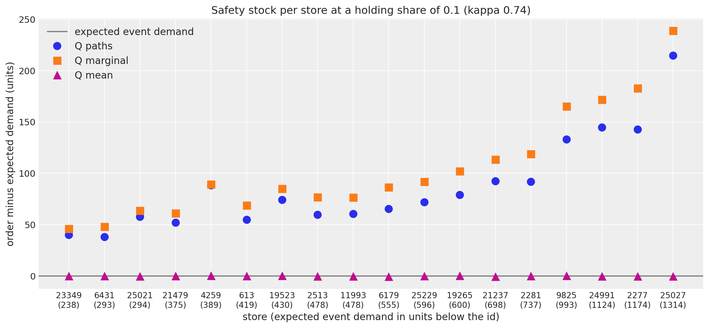</p>
</figure>


The marginal rule's per-week quantiles add up to an order above the joint quantile in every store, and over-ordering is cheap at a fractile of 0.74, which is why it loses little; the mean order sits below both. The next cell computes \text{EVPI}\_\theta with inner negative binomial draws per posterior draw, in sample and held out, with the draws broadcast through xarray so each dimension is named.


``` python
def negative_binomial_draws(
    rng: np.random.Generator, mu: xr.DataArray, conc: xr.DataArray, n_inner: int
) -> xr.DataArray:
    """Draw ``n_inner`` negative binomial counts per cell of ``mu`` (mean ``mu``, concentration ``conc``)."""
    success = (conc / (conc + mu)).broadcast_like(mu).expand_dims(inner=n_inner, axis=1)
    counts = rng.negative_binomial(
        conc.broadcast_like(success).values, success.values, size=success.shape
    )
    return xr.DataArray(counts.astype(np.float32), dims=success.dims, coords=success.coords)


conc_focal = np.asarray(posterior["conc"])[:, FOCAL_INDEX]
mu_committed = xr.DataArray(
    hnc_event_mu[committed], dims=("sample", "week", "store"), coords={"store": hnc_store_ids}
)
conc_committed = xr.DataArray(conc_focal, dims=("sample",))
inner_rng = np.random.default_rng(seed=7)
inner_demand = xr.concat(
    [
        negative_binomial_draws(inner_rng, mu_committed, conc_committed, 100).sum("week")
        for _ in range(3)
    ],
    dim="inner",
).values  # (draws, inner, stores)
held_out_demand = (
    negative_binomial_draws(inner_rng, mu_committed, conc_committed, 100).sum("week").values
)  # (draws, held out, stores)
n_inner = inner_demand.shape[1]
n_held_out = held_out_demand.shape[1]


def theta_information_value(eta: float, held_out: bool = False) -> float:
    """Estimate the value of perfect information about the parameters and level path, as a share of RP.

    The inner order is chosen on the inner draws. With ``held_out`` it and RP are evaluated
    on the held-out draws instead, so the two values bracket the in-sample optimism of the
    inner argmax at a fixed choose-sample size.
    """
    c_o = eta * cost_focal
    kappa = float((c_u / (c_u + c_o))[0])
    evaluated_on = held_out_demand if held_out else inner_demand
    q_theta = np.quantile(inner_demand, kappa, axis=1, method="inverted_cdf")  # (draws, stores)
    profit_theta = newsvendor_profit(q_theta[:, None, :], evaluated_on, c_u, c_o).mean(
        axis=1
    )  # (draws, stores)
    q_paths = integer_quantile(event_demand, kappa)
    rp_inner = (
        newsvendor_profit(q_paths[None, :], evaluated_on.reshape(-1, n_stores), c_u, c_o)
        .mean(axis=0)
        .sum()
    )
    return float((profit_theta.mean(axis=0).sum() - rp_inner) / rp_inner)


evpi_theta_in_sample = theta_information_value(nominal_eta)
evpi_theta_held_out = theta_information_value(nominal_eta, held_out=True)
pl.DataFrame(
    {
        f"EVPI_theta / RP, in sample ({n_inner} inner draws)": [round(evpi_theta_in_sample, 4)],
        f"held out ({n_held_out} draws)": [round(evpi_theta_held_out, 4)],
        "in-sample optimism": [round(evpi_theta_in_sample - evpi_theta_held_out, 4)],
    }
)
```


| EVPI_theta / RP, in sample (300 inner draws) | held out (100 draws) | in-sample optimism |
|----|----|----|
| 0.0552 | 0.0547 | 0.0005 |


Perfect information about the demand itself would be worth 14.6\\ of RP; about the parameters and the level path 5.5\\ from 300 inner draws, and 5.5\\ again on 100 held-out draws, so the in-sample optimism of the inner argmax is 0.05\\ of RP.

Finally, the holding share \eta is an assumption, so the next cell sweeps it and plots the value of the stochastic solution, the marginal-rule loss and the two information ceilings against the critical fractile \kappa that each holding share implies, with the holding share under each marker and the probability that demand falls below its mean (the fractile at which the mean order is optimal) as the dashed line.


``` python
sweep_rows = []

for eta in (0.02, 0.05, 0.1, 0.2, 0.4, 0.8):
    rules = order_rules(eta)
    sweep_rows.append(
        {
            "eta": eta,
            "kappa": rules["kappa"],
            "VSS / RP": rules["VSS"] / rules["RP"],
            "VSS split-half / RP": rules["VSS_split_half"] / rules["RP"],
            "marginal-rule loss / RP": rules["marginal_rule_loss"] / rules["RP"],
            "EVPI_W / RP": rules["EVPI_W"] / rules["RP"],
            "EVPI_theta / RP": theta_information_value(eta),
        }
    )
sweep_table = pl.DataFrame(sweep_rows)
kappa_zero = float(np.median((event_demand <= event_demand.mean(axis=0)).mean(axis=0)))
kappa_axis = sweep_table["kappa"].to_numpy()

fig, ax = plt.subplots(figsize=(11, 6), layout="constrained")
ax.plot(
    kappa_axis,
    sweep_table["VSS / RP"].to_numpy(),
    "o-",
    color="C0",
    label="value of the stochastic solution (VSS)",
)
ax.plot(
    kappa_axis,
    sweep_table["VSS split-half / RP"].to_numpy(),
    "o--",
    color="C0",
    alpha=0.6,
    label="VSS, split-half",
)
ax.plot(
    kappa_axis,
    sweep_table["marginal-rule loss / RP"].to_numpy(),
    "s-",
    color="C1",
    label="loss of the marginal-quantile rule",
)
ax.plot(
    kappa_axis,
    sweep_table["EVPI_theta / RP"].to_numpy(),
    "^-",
    color="C2",
    label="perfect information about parameters and level",
)
ax.plot(
    kappa_axis,
    sweep_table["EVPI_W / RP"].to_numpy(),
    "v-",
    color="C3",
    label="perfect information about demand",
)
ax.axvline(
    kappa_zero,
    color="gray",
    linestyle="--",
    label=f"P(W <= E[W]) = {kappa_zero:.2f}, median store",
)


for kappa, vss in zip(kappa_axis, sweep_table["VSS / RP"].to_numpy(), strict=True):
    ax.annotate(
        f"{vss:.1%}",
        (kappa, vss),
        textcoords="offset points",
        xytext=(0, 9),
        ha="center",
        fontsize=10,
    )
ax.set_xticks(
    kappa_axis,
    [
        f"{kappa:.2f}\n$\\eta$ = {eta}"
        for kappa, eta in zip(kappa_axis, sweep_table["eta"].to_numpy(), strict=True)
    ],
)
ax.yaxis.set_major_formatter(mtick.PercentFormatter(xmax=1, decimals=0))
fig.legend(handles=ax.get_legend_handles_labels()[0], loc="outside lower center", ncols=2)
ax.set(
    xlabel="critical fractile kappa (holding share eta under each value)",
    ylabel="share of the recourse value RP",
    title="What the joint predictive is worth for the promotion order",
);
```


<figure class="figure">
<p>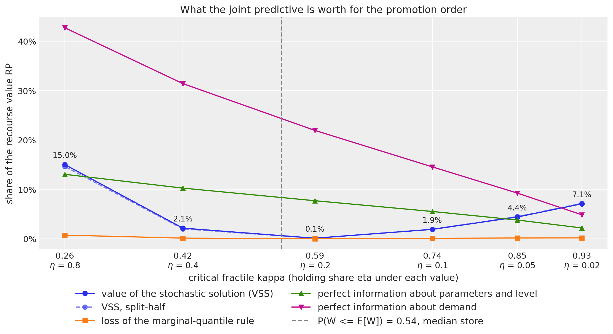</p>
</figure>


The value of the stochastic solution is smallest, 0.1\\ of RP, at a holding share of 0.2, where the critical fractile of 0.59 is nearest the probability that demand falls below its mean, 0.54 in the median store. It grows to 7.1\\ at a fractile of 0.93 and to 15.0\\ at 0.26. The marginal-rule loss stays below 1\\ of RP everywhere.


# Conclusions

We set out to answer three questions for the Thanksgiving promotion of Honey Nut Cheerios. The answers, from the figures above:

1.  **Which promotion?** Feature with display, at the shallowest cut the manufacturer will fund. At the nominal funding share of 0.5 the posterior puts probability 1.00 on a falling profit curve for every mechanics, so the depth decision is a corner; near the break-even share the profit curves are flat and the three deepest cells have downside values within their standard errors of each other. Feature with display is the best mechanics with probability 1.00 while a slot costs 25 per store-week, and no promotion wins at 100.
2.  **Who pays?** The category break-even funding share of feature with display is 0.71, with a 94\\ HDI about 0.1 wide at zone level and about twice that per store. A feature-with-display event at a 15\\ cut beats no promotion even if the retailer funds the whole cut, because the mechanics uplift pays for it; the go turns into a no-go between 50 and 75 per slot and store-week.
3.  **How much to order?** The newsvendor order from the joint demand paths. Its value over the mean order is 1.9\\ of the recourse value at the nominal holding share, smallest (0.1\\) where the critical fractile meets the probability that demand falls below its mean, and up to 15\\ at low fractiles. The marginal-quantile rule over-orders in every store but loses below 1\\ everywhere, because the two event weeks are only weakly correlated (0.26).

Where the posterior changed the answer relative to a point estimate: the store least-squares planner, which is not pooled, adds the cut in 3 stores at the nominal share where the posterior adds it in none, and in all 18 at the break-even share where the posterior adds it in 9, with a postdecision disappointment of 222 and 864; the break-even share comes with an interval instead of a single number; the go/no-go has a downside; and the order uses the joint distribution of the event weeks.


# Limitations

- No experiment. Every elasticity rests on the selection-on-observables assumption drawn in the causal graph; the holdout validates the forecasting engine under the realized calendar, not the counterfactual ones.
- Seven cross elasticities are credibly negative; the four large ones sit inside the General Mills family or in the Cheerios 12 oz row, whose own elasticity is smaller than the effect of its twin's price. We read them as co-promotion recorded on one UPC, not as complementarity; the decisions use only the focal product's column, which has the expected sign, but the no-promotion baseline of the siblings carries them.
- The panel keeps only stores with complete series, a pragmatic choice; a masked likelihood would use the 23 near-complete stores as well.
- The joint no-promotion baseline over a holiday quarter is never observed; its units rest on the log-additivity of the model.
- Common random numbers are a coupling assumption; the different-key baseline is a sensitivity, not a bound.
- The centering values are chosen by a mean-field guide, a heuristic for the sampler's geometry, not part of the posterior; another guide could pick other values without changing any posterior quantity.
- Shelf capacity censors the sales in the strongest promotion weeks, which biases the feature-with-display uplift and the order quantities downward; the [censored demand example](censored_demand.md) shows the likelihood that would address it.
- The elasticity is promotional, not regular-price; base-price changes are absorbed by the level.
- The economics are assumptions: gross margins, a per-unit allowance, base prices frozen at the last training week (the brand-only break-even share is price-free; the category version depends on price ratios only), a holding-cost overage.
- The holdout is the holiday quarter with two earlier Decembers to learn from, and the holdout forecasts run high on average: the PIT histogram slopes downward, with 16\\ of the cells in the lowest decile.
- Post, Quaker, the products of other sub-categories and other retailers are omitted competitors.
- The manufacturer's side of the deal is outside the model. General Mills also owns two of the siblings, so part of the cannibalization is internal to it.
- The sibling-mechanics effects are averages over any featured sibling.
- Part of the stockout demand of the focal product spills to the private-label twin.


# Next steps

- Make the calendar a lever: add a post-promotion term and let the seasonal profile choose the event weeks.
- Replace the average sibling-mechanics effects by per-pair terms, so a family feature on one Cheerios UPC can lift the others explicitly, and give the mechanics effects a store level.
- Add the censored likelihood of the [censored demand example](censored_demand.md) for the weeks at shelf capacity.
- Run a rolling backtest with [backtest](../../reference/evaluate.backtest.md#numpyro_forecast.evaluate.backtest) over several promotion quarters.
- Use `visits` and `hhs` to separate traffic from basket effects.
- Pool the orders at the distribution center and compare with the per-store orders.
- Promote the decision helpers (profit contraction, CVaR, newsvendor rules, VSS) into a package module, and let [forecast](../../reference/predictive.forecast.md#numpyro_forecast.predictive.forecast) return extra sites such as the conditional mean.
- Mask the isolated missing weeks in the likelihood instead of dropping the store, with the price imputed at the base price, which would make the 23 near-complete stores usable.


# References

- dunnhumby. [*Source files: Breakfast at the Frat*](https://www.dunnhumby.com/source-files/).
- Ghaedrahmati, E. (2025). [*Breakfast at the Frat: A Time Series Analysis*](https://doi.org/10.6084/m9.figshare.30121060). figshare copy of the dunnhumby workbook.
- Blattberg, R. C., Briesch, R., Fox, E. J. (1995). [*How Promotions Work*](https://doi.org/10.1287/mksc.14.3.G122). Marketing Science, 14(3 supplement), G122-G132.
- van Heerde, H. J., Leeflang, P. S. H., Wittink, D. R. (2000). [*The Estimation of Pre- and Postpromotion Dips with Store-Level Scanner Data*](https://doi.org/10.1509/jmkr.37.3.383.18782). Journal of Marketing Research, 37(3), 383-395.
- Bijmolt, T. H. A., van Heerde, H. J., Pieters, R. G. M. (2005). [*New Empirical Generalizations on the Determinants of Price Elasticity*](https://doi.org/10.1509/jmkr.42.2.141.62296). Journal of Marketing Research, 42(2), 141-156.
- NumPyro documentation. [*Example: Hilbert space approximation for Gaussian processes*](https://num.pyro.ai/en/stable/examples/hsgp.html) and [*Reparameterization*](https://num.pyro.ai/en/stable/reparam.html).
- Gorinova, M. I., Moore, D., Hoffman, M. D. (2020). [*Automatic Reparameterisation of Probabilistic Programs*](https://arxiv.org/abs/1906.03028). Proceedings of the 37th International Conference on Machine Learning.
- Gneiting, T., Katzfuss, M. (2014). [*Probabilistic Forecasting*](https://doi.org/10.1146/annurev-statistics-062713-085831). Annual Review of Statistics and Its Application, 1, 125-151.
- Czado, C., Gneiting, T., Held, L. (2009). [*Predictive Model Assessment for Count Data*](https://doi.org/10.1111/j.1541-0420.2009.01191.x). Biometrics, 65(4), 1254-1261.
- Rockafellar, R. T., Uryasev, S. (2000). [*Optimization of conditional value-at-risk*](https://doi.org/10.21314/JOR.2000.038). Journal of Risk, 2(3), 21-41.
- Smith, J. E., Winkler, R. L. (2006). [*The Optimizer's Curse: Skepticism and Postdecision Surprise in Decision Analysis*](https://doi.org/10.1287/mnsc.1050.0451). Management Science, 52(3), 311-322.
- Birge, J. R., Louveaux, F. (2011). [*Introduction to Stochastic Programming*](https://doi.org/10.1007/978-1-4614-0237-4). Springer.
- Related examples: [hierarchical forecasting 1](hierarchical_forecasting_1.md) (the sampled centering idiom), [fresh retail stockout](fresh_retail_stockout.md) (the model factory and the covariate-swap counterfactual), [availability TSB](availability_tsb.md) (scenario covariates), [censored demand](censored_demand.md) (the NUTS template and the censored likelihood).

[Source: From forecasts to promotion decisions](_src/promotion_pricing_decisions-preview.html#6653fab9)
