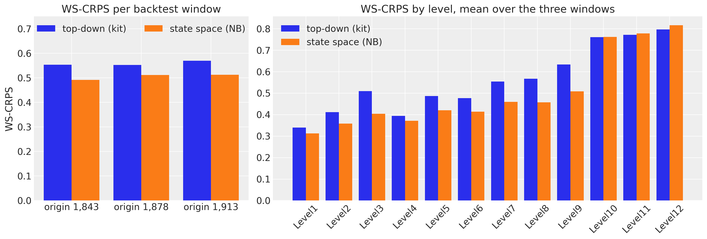
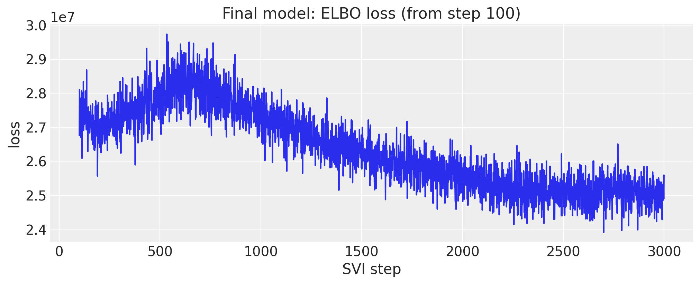
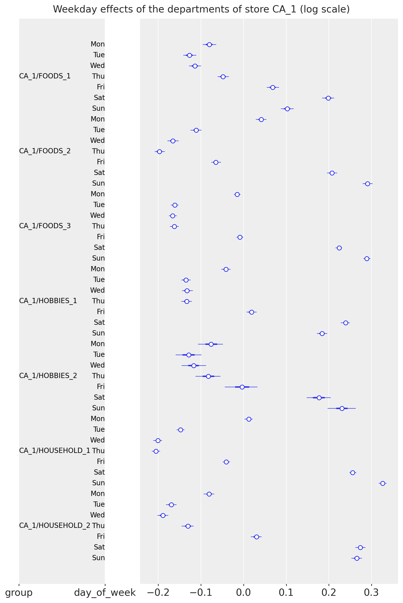
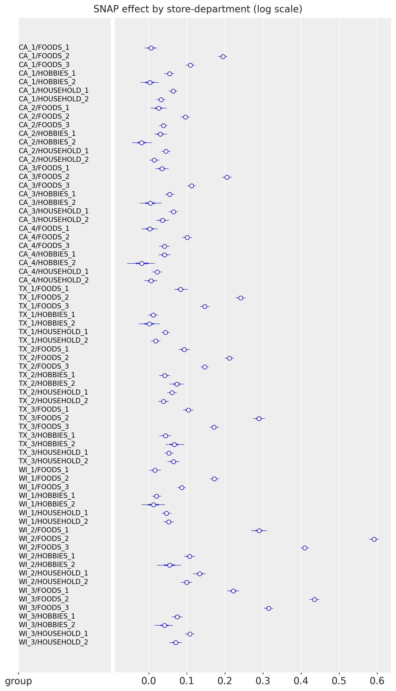
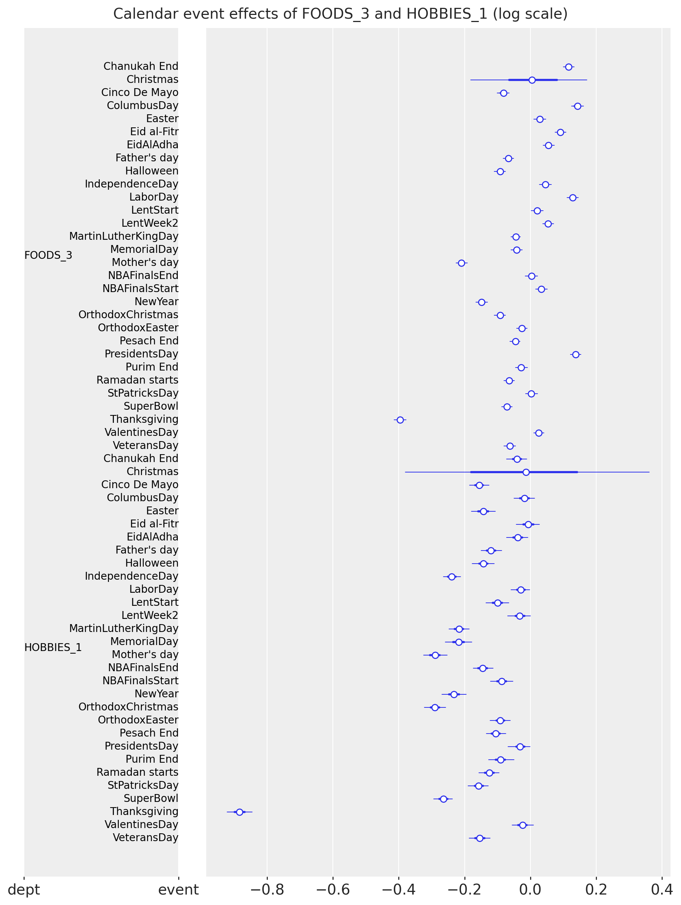
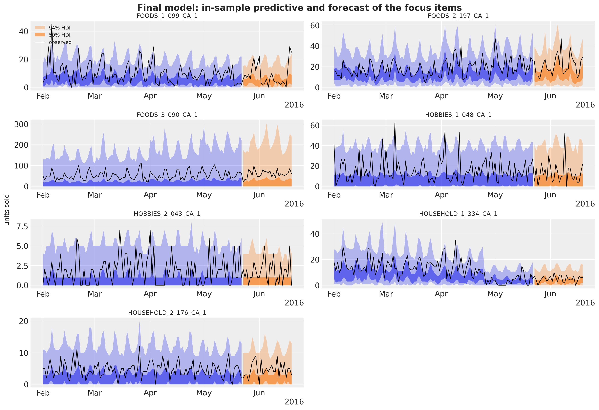
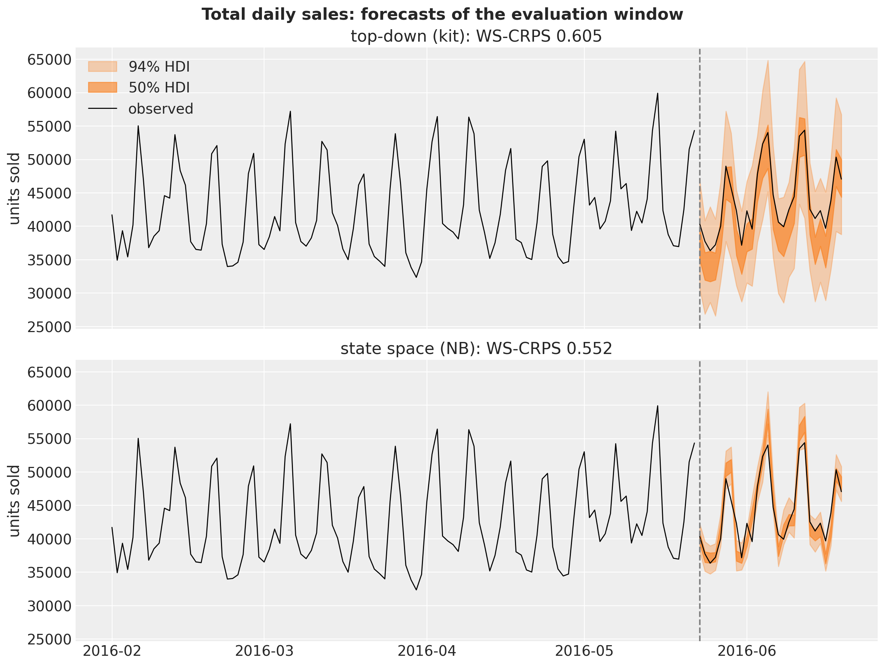
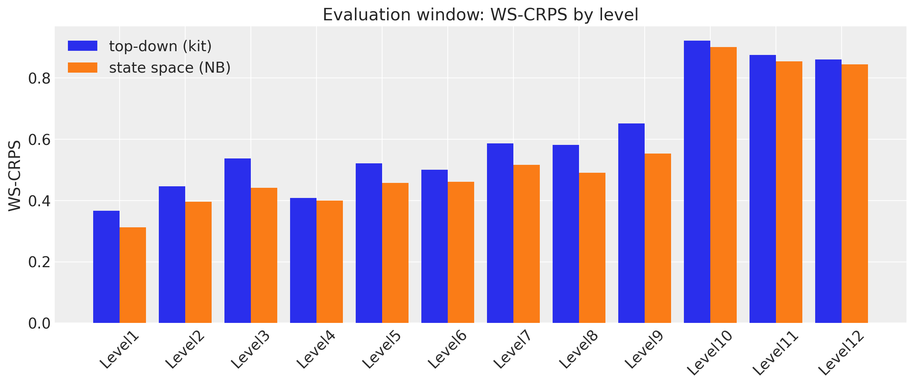
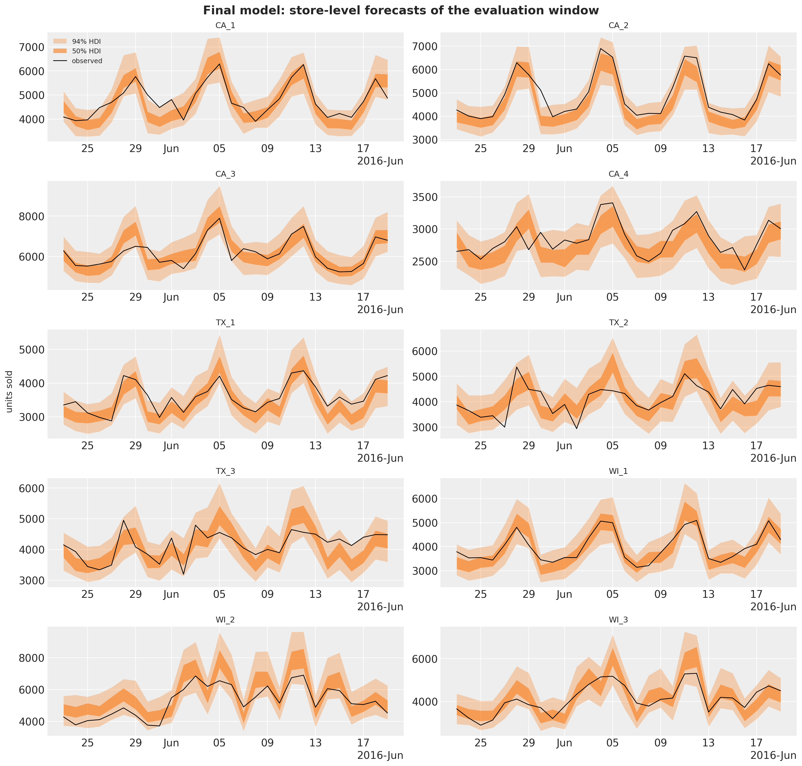

# M5 forecasting II: a hierarchical count state space model


M5 forecasting II: a hierarchical count state space model with `numpyro_forecast`

This notebook continues the [M5 baselines notebook](m5_forecasting.md), the port of the three [Pyro M5 Starter Kit](https://github.com/pyro-ppl/Pyro-M5-Starter-Kit) models to `numpyro_forecast`, and asks what a real hierarchical model adds on the same task: the 30,490 daily unit-sales series of the M5 competition (3,049 items in 10 Walmart stores of 3 states), a 28-day horizon, and the weighted scaled CRPS over the 42,840 series of the 12-level hierarchy. On the evaluation window the kit's top-down model scored a WS-CRPS of 0.569, the middle-out model 0.634 and the bottom-up model 0.728, so the top-down model is the one to beat.

The candidate is a single **hierarchical count state space model** of every item in every store, fitted with minibatch SVI: a negative binomial likelihood with item-level dispersion, an item intercept centered on the series' level at the forecast origin, an end-anchored random walk of the item level over 28-day blocks, daily store shocks that sum to zero within every week, zero-sum weekday effects per store-department with zero-sum item deviations, SNAP and calendar-event effects and yearly seasonality, all partially pooled across the hierarchy. It is compared with the top-down baseline in the same harness on the three backtest windows of the baselines notebook and on the evaluation window, at every level, with the calibration of the bands alongside the score.

This is the second of the two M5 notebooks; the data loader, the hierarchy, the scoring functions and the baseline are described in the first one and only summarized here.


# Prepare notebook


``` python
import warnings
from functools import partial
from time import perf_counter

import arviz as az
import jax
import jax.numpy as jnp
import matplotlib.dates as mdates
import matplotlib.pyplot as plt
import numpy as np
import numpyro
import numpyro.distributions as dist
import optax
import polars as pl
import scipy.sparse as sp
import xarray as xr
from jax import random
from numpyro.infer import SVI, Predictive, Trace_ELBO, init_to_median
from numpyro.infer.autoguide import AutoNormal
from numpyro.infer.svi import SVIRunResult
from numpyro.optim import optax_to_numpyro

from numpyro_forecast import (
    Horizon,
    backtest,
    draw_posterior,
    evaluate_forecast,
    forecast,
    predict,
    predict_in_sample,
    predictions_to_datatree,
    results_to_dataframe,
)
from numpyro_forecast.datasets import load_m5
from numpyro_forecast.features import fourier_features
from numpyro_forecast.metrics import crps_empirical
from numpyro_forecast.typing import Array, ForecastFn, ForecastModel, Metric

az.style.use("arviz-darkgrid")
plt.rcParams["figure.figsize"] = [12, 6]
plt.rcParams["figure.dpi"] = 100
plt.rcParams["figure.facecolor"] = "white"
numpyro.set_host_device_count(n=4)
rng_key = random.PRNGKey(seed=42)

pl.Config.set_fmt_str_lengths(100)
pl.Config.set_tbl_hide_dataframe_shape(True)
pl.Config.set_tbl_hide_column_data_types(True)
pl.Config.set_tbl_rows(20)
pl.Config.set_tbl_cols(12)
pl.Config.set_tbl_width_chars(160)

# `predict` observes a (time, series) array under the series plate; the time axis is not a
# plate, so numpyro cannot check it and warns at every trace.
warnings.filterwarnings("ignore", message="Missing a plate statement for batch dimension -2")
# The second `plot_lm` call of an overlay reuses the alpha of the first one.
warnings.filterwarnings("ignore", message="When multiple credible intervals are plotted")

%load_ext autoreload
%autoreload 2
%load_ext jaxtyping
%jaxtyping.typechecker beartype.beartype
%config InlineBackend.figure_format = "retina"
```


# Read data

[load_m5()](../../reference/datasets.load_m5.md#numpyro_forecast.datasets.load_m5) downloads the [Nixtla mirror](https://github.com/Nixtla/m5-forecasts) of the competition files once and reads them: the daily sales over the training period (`d_1` to `d_1941`) followed by the 28 evaluation days (`d_1942` to `d_1969`), the weekly shelf price of every series repeated over its days (`NaN` when the item was not on the shelf), the series identifiers, the calendar and the official evaluation weights. The calendar carries two event columns; the second one is rare, but one of its five days (Father's Day 2016) falls inside the evaluation window, so both are indexed.


``` python
m5 = load_m5()

KEYS = ["item_id", "dept_id", "cat_id", "store_id", "state_id"]
N_DAYS_TRAIN = 1_941
HORIZON = 28
N_DAYS = N_DAYS_TRAIN + HORIZON
sales = m5.sales
price = m5.price
keys_df = m5.keys
n_series = sales.shape[1]


def is_christmas() -> pl.Expr:
    """Flag December 25, the one day a year every Walmart store is closed."""
    return pl.col("date").dt.month().eq(pl.lit(12)).and_(pl.col("date").dt.day().eq(pl.lit(25)))


def day_of_week_index() -> pl.Expr:
    """Index the weekday from 0 (Monday) to 6 (Sunday)."""
    return pl.col("date").dt.weekday().sub(pl.lit(1))


def event_index(column: str, names: list[str]) -> pl.Expr:
    """Index an event column by its position in ``names``, 0 when there is no event."""
    return pl.col(column).replace_strict(names, list(range(1, len(names) + 1)), default=0)


event_names = sorted(
    set(m5.calendar["event_name_1"].drop_nulls().to_list())
    | set(m5.calendar["event_name_2"].drop_nulls().to_list())
)
calendar_df = (
    m5.calendar.lazy()
    .with_row_index("t")
    .with_columns(
        christmas=is_christmas().cast(pl.Float32),
        dow=day_of_week_index(),
        event_1=event_index("event_name_1", event_names),
        event_2=event_index("event_name_2", event_names),
    )
    .select("t", "date", "dow", "christmas", "event_1", "event_2", "snap_CA", "snap_TX", "snap_WI")
    .collect(engine="streaming")
)
print(f"{n_series} series over {N_DAYS} days, {len(event_names)} event names")
calendar_df.filter(pl.col("event_2").gt(0))
```


    30490 series over 1969 days, 30 event names


| t    | date       | dow | christmas | event_1 | event_2 | snap_CA | snap_TX | snap_WI |
|------|------------|-----|-----------|---------|---------|---------|---------|---------|
| 85   | 2011-04-24 | 6   | 0.0       | 21      | 5       | 0       | 0       | 0       |
| 827  | 2013-05-05 | 6   | 0.0       | 21      | 3       | 1       | 1       | 1       |
| 1177 | 2014-04-20 | 6   | 0.0       | 5       | 21      | 0       | 0       | 0       |
| 1233 | 2014-06-15 | 6   | 0.0       | 17      | 8       | 0       | 1       | 1       |
| 1968 | 2016-06-19 | 6   | 0.0       | 17      | 8       | 0       | 0       | 0       |


## The hierarchy

The competition scores 42,840 series: the 30,490 items in stores (level 12) and their sums over the 11 coarser groupings. A label and a dense group id per level turn into a sparse `(30,490, 42,840)` summation matrix, so any array of bottom-level values (data or forecast draws) is aggregated to every level with one sparse product. The store, department and store-department ids of every series index the pooled parameters of the model.


``` python
LEVELS: dict[str, list[str]] = {
    "Level1": [],
    "Level2": ["state_id"],
    "Level3": ["store_id"],
    "Level4": ["cat_id"],
    "Level5": ["dept_id"],
    "Level6": ["state_id", "cat_id"],
    "Level7": ["state_id", "dept_id"],
    "Level8": ["store_id", "cat_id"],
    "Level9": ["store_id", "dept_id"],
    "Level10": ["item_id"],
    "Level11": ["state_id", "item_id"],
    "Level12": ["item_id", "store_id"],
}


def level_label(columns: list[str]) -> pl.Expr:
    """Label of the aggregate a series belongs to at one level, ``Agg_Level_1/Agg_Level_2``."""
    parts = [pl.col(column) for column in columns] or [pl.lit("Total")]
    if len(parts) == 1:
        parts.append(pl.lit("X"))
    return pl.concat_str(parts, separator="/")


def group_id(label: str) -> pl.Expr:
    """Dense 0-based id of the aggregate named by ``label``, in sorted label order."""
    return pl.col(label).rank("dense").cast(pl.Int64).sub(pl.lit(1))


def add_level_ids(keys: pl.DataFrame) -> pl.DataFrame:
    """Add one label and one group id column per M5 level."""
    return keys.with_columns(
        **{f"{level}_label": level_label(columns) for level, columns in LEVELS.items()}
    ).with_columns(**{level: group_id(f"{level}_label") for level in LEVELS})


def aggregation_matrix(
    hierarchy: pl.DataFrame,
) -> tuple[sp.csr_matrix, list[str], dict[str, slice]]:
    """Sparse ``(n_series, n_aggregates)`` sum matrix over the 12 levels, with labels and slices."""
    rows, cols, labels, slices = [], [], [], {}
    offset = 0
    for level in LEVELS:
        rows.append(np.arange(hierarchy.height))
        cols.append(offset + hierarchy[level].to_numpy())
        level_labels = (
            hierarchy.select(f"{level}_label", level)
            .unique()
            .sort(level)[f"{level}_label"]
            .to_list()
        )
        labels += [f"{level}/{label}" for label in level_labels]
        slices[level] = slice(offset, offset + len(level_labels))
        offset += len(level_labels)
    values = np.ones(hierarchy.height * len(LEVELS), dtype=np.float32)
    matrix = sp.csr_matrix(
        (values, (np.concatenate(rows), np.concatenate(cols))), shape=(hierarchy.height, offset)
    )
    return matrix, labels, slices


hierarchy_df = keys_df.pipe(add_level_ids)
agg_matrix, agg_labels, level_slices = aggregation_matrix(hierarchy_df)
sales_agg = sales @ agg_matrix
store_ids = [
    label.removeprefix("Level3/").removesuffix("/X")
    for label in agg_labels[level_slices["Level3"]]
]
dept_ids = [
    label.removeprefix("Level5/").removesuffix("/X")
    for label in agg_labels[level_slices["Level5"]]
]
group_ids = [label.removeprefix("Level9/") for label in agg_labels[level_slices["Level9"]]]
state_index = hierarchy_df["Level2"].to_numpy()
store_index = jnp.asarray(hierarchy_df["Level3"].to_numpy(), dtype=jnp.int32)
dept_index = jnp.asarray(hierarchy_df["Level5"].to_numpy(), dtype=jnp.int32)
group_index = jnp.asarray(hierarchy_df["Level9"].to_numpy(), dtype=jnp.int32)
N_STORES, N_DEPTS, N_GROUPS = len(store_ids), len(dept_ids), len(group_ids)
print(
    f"aggregation matrix {agg_matrix.shape}: {N_STORES} stores, {N_DEPTS} departments, {N_GROUPS} store-departments"
)
```


    aggregation matrix (30490, 42840): 10 stores, 7 departments, 70 store-departments


# Scoring at every level

The score is the one of the baselines notebook. For a series s at level \ell, c_s is the mean CRPS of its 28-day forecast, w_s its share of the dollar sales of the level over the 28 days before the forecast origin and \sigma_s its scale, the mean absolute lag-one difference of the training series after its first nonzero value:

 \text{WS-CRPS} = \frac{1}{12} \sum\_{\ell=1}^{12} \sum\_{s \in \ell} w_s \frac{c_s}{\sigma_s}. 

The functions plug into [backtest()](../../reference/evaluate.backtest.md#numpyro_forecast.evaluate.backtest): a `transform` sums the bottom-level draws and the truth to the 42,840 series and `per_window_metrics` returns one weighted scaled CRPS per level for the window's origin. Besides the mean over the 12 levels we report the means over levels 1 to 9 (the aggregates) and 10 to 12 (the items), because the two halves reward different things: calibrated common uncertainty at the top, a sharp level per item at the bottom. Four coverage metrics (the share of series-days inside the central 94\\ interval of the draws at levels 1, 3, 9 and 12) come along, because a CRPS alone does not say whether a model is sharp or just narrow. The competition's pinball loss (WSPL) is reported on the evaluation window.


``` python
christmas = calendar_df["christmas"].to_numpy()[:N_DAYS]
saled = (~np.isnan(price)).astype(np.float32) * (1.0 - christmas[:, None])
price_filled = np.nan_to_num(price, nan=0.0)


def m5_weights(t1: int) -> np.ndarray:
    """Dollar-sales share of every aggregate over the 28 days before ``t1``, normalized per level."""
    dollars = (sales[t1 - 28 : t1] * price_filled[t1 - 28 : t1]).sum(0) @ agg_matrix
    weights = np.empty_like(dollars)
    for level_slice in level_slices.values():
        weights[level_slice] = dollars[level_slice] / dollars[level_slice].sum()
    return weights


def m5_scales(y: np.ndarray) -> np.ndarray:
    """Mean absolute lag-1 difference of every column of ``y`` over its active period.

    The active period starts at the first nonzero value; the jump from zero on that day is
    excluded, the sum of absolute differences is clamped at one and divided by the number of
    active days minus one (the kit's ``get_metric_scale("pl", ...)``).
    """
    duration, n_columns = y.shape
    active = np.maximum((np.cumsum(y, axis=0) != 0).sum(0), 2)
    start_value = y[duration - active, np.arange(n_columns)]
    lag1_norm = np.abs(np.diff(y, axis=0, prepend=0.0)).sum(0) - np.abs(start_value)
    return np.maximum(lag1_norm, 1.0) / (active - 1)


def aggregate_transform(
    pred: np.ndarray | Array, truth: np.ndarray | Array
) -> tuple[np.ndarray, np.ndarray]:
    """Sum bottom-level draws and truth to the 42,840 aggregates of the 12 M5 levels."""
    n = pred.shape[-1]
    pred_levels = np.asarray(pred, dtype=np.float32).reshape(-1, n) @ agg_matrix
    truth_levels = np.asarray(truth, dtype=np.float32) @ agg_matrix
    return pred_levels.reshape(*pred.shape[:-1], -1), truth_levels


def ws_crps_level(
    pred: Array, truth: Array, *, level_slice: slice, weights: np.ndarray, scales: np.ndarray
) -> Array:
    """Weighted scaled CRPS of one level: weight times mean CRPS over the horizon, over scale."""
    crps = crps_empirical(pred[..., level_slice], truth[..., level_slice]).mean(axis=0)
    return jnp.sum(jnp.asarray(weights) * crps / jnp.asarray(scales))


def coverage_level(pred: Array, truth: Array, *, level_slice: slice, prob: float = 0.94) -> Array:
    r"""Share of the series-days of one level inside the central $94\%$ interval of the draws."""
    tail = (1.0 - prob) / 2.0
    lower, upper = np.quantile(np.asarray(pred[..., level_slice]), [tail, 1.0 - tail], axis=0)
    actual = np.asarray(truth[..., level_slice])
    return jnp.asarray(np.mean((actual >= lower) & (actual <= upper)))


COVERAGE_LEVELS = ["Level1", "Level3", "Level9", "Level12"]


def m5_metrics(t0: int, t1: int, t2: int) -> dict:
    r"""Build the 12 weighted scaled CRPS metrics of a window whose training data ends at ``t1``.

    Four $94\%$ coverage metrics (levels 1, 3, 9 and 12) come along to read the calibration.
    """
    weights = m5_weights(t1)
    scales = m5_scales(sales_agg[:t1])
    metrics: dict[str, Metric] = {
        f"ws_crps_{level}": partial(
            ws_crps_level,
            level_slice=level_slice,
            weights=weights[level_slice],
            scales=scales[level_slice],
        )
        for level, level_slice in level_slices.items()
    }
    for level in COVERAGE_LEVELS:
        metrics[f"coverage_{level}"] = partial(coverage_level, level_slice=level_slices[level])
    return metrics


M5_QUANTILES = np.array(
    [0.005, 0.025, 0.165, 0.25, 0.5, 0.75, 0.835, 0.975, 0.995], dtype=np.float32
)


def ws_pinball(
    pred_levels: np.ndarray, truth_levels: np.ndarray, weights: np.ndarray, scales: np.ndarray
) -> float:
    """M5 WSPL: pinball loss at the nine competition quantiles, weighted, scaled, mean over levels."""
    quantiles = np.quantile(pred_levels, M5_QUANTILES, axis=0)
    error = quantiles - truth_levels[None]
    u = M5_QUANTILES[:, None, None]
    per_series = (np.where(error <= 0, -u, 1 - u) * error).mean(axis=(0, 1))
    level_scores = [
        np.sum(weights[level_slice] * per_series[level_slice] / scales[level_slice])
        for level_slice in level_slices.values()
    ]
    return float(np.mean(level_scores))


LEVEL_COLUMNS = [f"metric_ws_crps_{level}" for level in LEVELS]
TOP_LEVELS = LEVEL_COLUMNS[:9]
ITEM_LEVELS = LEVEL_COLUMNS[9:]
COVERAGE_COLUMNS = [f"metric_coverage_{level}" for level in COVERAGE_LEVELS]


def summarize_backtest(results: list, name: str) -> pl.DataFrame:
    """One row per window with the mean WS-CRPS over all levels, levels 1 to 9 and levels 10 to 12."""
    return (
        pl.from_pandas(results_to_dataframe(results))
        .with_columns(
            model=pl.lit(name),
            ws_crps=pl.mean_horizontal(LEVEL_COLUMNS),
            ws_crps_1_9=pl.mean_horizontal(TOP_LEVELS),
            ws_crps_10_12=pl.mean_horizontal(ITEM_LEVELS),
        )
        .select(
            "model",
            "t1",
            "t2",
            "walltime",
            "ws_crps",
            "ws_crps_1_9",
            "ws_crps_10_12",
            *LEVEL_COLUMNS,
            *COVERAGE_COLUMNS,
        )
    )
```


# Features

The model sees three per-series channels stacked with time at axis -2: the day index (through which the calendar tables are looked up inside the model), the `saled` flag (price listed and not Christmas, which gates the mean as in the kit) and the log of the shelf price relative to the item's mean listed price over the first 1,843 days (the first backtest origin, so the reference never uses later data). The price channel is carried for the reader who wants to add an elasticity; the model below does not use it, for a reason given with the ablation. Sixty nonzero sales on days without a listed price or on a closed Christmas are set to zero in the training counts, since the model puts the mean at its floor on those days. The calendar tables (weekday, SNAP by state, the two event indices and four yearly Fourier harmonics) live outside the tensor.


``` python
REFERENCE_DAYS = N_DAYS_TRAIN - HORIZON - 2 * 35  # 1,843: the first backtest origin
BLOCK = 28
N_BLOCKS = 13  # one year of 28-day blocks before the origin

listed_days = saled[:REFERENCE_DAYS].sum(0)
reference_price = np.nansum(price[:REFERENCE_DAYS], axis=0) / np.maximum(listed_days, 1.0)
log_price_ratio = np.nan_to_num(
    np.log(price / np.where(listed_days > 0, reference_price, 1.0)), nan=0.0
).astype(np.float32)
covariates_np = np.empty((3, N_DAYS, n_series), dtype=np.float32)
covariates_np[0] = np.arange(N_DAYS, dtype=np.float32)[:, None]
covariates_np[1] = saled
covariates_np[2] = log_price_ratio
covariates = jnp.asarray(covariates_np)
del covariates_np
y_counts = jnp.asarray(np.rint(sales * saled).astype(np.int32))  # nothing sells on a closed day

dow_table = jnp.asarray(calendar_df["dow"].to_numpy()[:N_DAYS], dtype=jnp.int32)
snap_table = jnp.asarray(
    calendar_df.select("snap_CA", "snap_TX", "snap_WI").to_numpy()[:N_DAYS], dtype=jnp.float32
)
event_tables = (
    jnp.asarray(calendar_df["event_1"].to_numpy()[:N_DAYS], dtype=jnp.int32),
    jnp.asarray(calendar_df["event_2"].to_numpy()[:N_DAYS], dtype=jnp.int32),
)
N_EVENTS = len(event_names) + 1
N_HARMONICS = 4
fourier_table = jnp.asarray(fourier_features(N_DAYS, 365.25, N_HARMONICS), dtype=jnp.float32)
state_of_store = jnp.asarray(
    [state_index[np.argmax(np.asarray(store_index) == s)] for s in range(N_STORES)],
    dtype=jnp.int32,
)
n_zeroed = int((sales * (1 - saled) > 0).sum())
print(
    f"covariates {covariates.shape}, {covariates.nbytes / 1e9:.2f} GB; "
    f"{n_zeroed} nonzero sales on unlisted or closed days set to 0"
)
```


    covariates (3, 1969, 30490), 0.72 GB; 60 nonzero sales on unlisted or closed days set to 0


# The model

For item i in store r(i), department d(i) and store-department j(i) (70 groups), on day t with weekday w(t), 28-day block b(t) (counted so that the horizon is one whole block), calendar events e_1(t) and e_2(t) and yearly Fourier terms \mathbf{f}\_t:

 \begin{align\*} y\_{i,t} &\sim \text{NegativeBinomial2}\big(\text{saled}\_{i,t}\\ e^{\eta\_{i,t}},\\ \phi_i\big), \qquad \log \phi_i \sim \text{Normal}(\log \phi\_{j(i)}, \tau\_{d(i)}), \\ \eta\_{i,t} &= \log m_i + \alpha_i + u\_{i,b(t)} + \epsilon\_{r(i),t} + s\_{j(i),w(t)} + \tilde s\_{i,w(t)} + \beta\_{j(i)}\\\text{snap}\_{r(i),t} + \mathbf{w}\_{d(i)}^\top \mathbf{f}\_t + \gamma\_{d(i),e_1(t)} + \gamma\_{d(i),e_2(t)}. \end{align\*} 

- **Level at the origin.** m_i is the item's mean sales over its listed days of the last 28 training days (falling back to the last year, then to a floor) and \alpha_i \sim \text{Normal}(0, \sigma^{\alpha}\_{d(i)}) a partially pooled deviation from it. With the walk anchored at zero on the last training block, \log m_i + \alpha_i is the log level at the forecast origin: the share heuristic of the kit becomes the prior center of a Bayesian item level.
- **Item block walk** u\_{i,b}: a random walk over the last 13 blocks of 28 days, end-anchored (zero on the last block, earlier blocks minus the innovations that follow them) with a department-level innovation scale; the horizon block adds one fresh innovation. This is the local level of a state space model, at the resolution a single item series can support.
- **Weekly store shocks** \epsilon\_{r,t}: daily shocks shared by every item of a store that sum to zero within each week (`ZeroSumNormal` over the seven days, weeks counted back from the origin). A zero-sum week cannot absorb a level change, so the shocks carry only the common day-to-day variation of a store; their fresh future weeks give correlated uncertainty to the aggregates.
- **Weekday**: `ZeroSumNormal` effects s\_{j,\cdot} per store-department and zero-sum item deviations \tilde s\_{i,\cdot} = \sigma^{s}\_{d(i)} z_i with z_i \sim \text{ZeroSumNormal}(1) (the distribution does not take a per-item scale).
- **Calendar**: SNAP per store-department, one effect per department and event name with a shared shrinkage scale, four yearly harmonics with department-level weights.
- **Likelihood**: negative binomial with an item-level dispersion pooled to the store-department. The log mean is clipped at \log 2{,}000; no series sells more than 763 units on a day.

The model is one function of `(covariates, data)` on [Horizon.from_data](../../reference/models.Horizon.md#numpyro_forecast.models.Horizon.from_data) and [predict()](../../reference/models.predict.md#numpyro_forecast.models.predict). The item-level sites sit inside the `series` plate, which the guide subsamples with `create_plates` (1,500 series per step); `numpyro.subsample` picks the matching columns of the data, the covariates, the index arrays and the origin levels, and the observed log density is scaled by 30{,}490 / 1{,}500. The block and week sites use explicit plates at `dim=-2` instead of [innovations()](../../reference/models.innovations.md#numpyro_forecast.models.innovations), because `AutoNormal` keeps one size per plate name and the daily `time` plate is already taken by [predict()](../../reference/models.predict.md#numpyro_forecast.models.predict). With `forecast_only=True` the same function evaluates the item terms over the horizon rows only and exposes the horizon mean and dispersion as deterministic sites: that is how the notebook draws the 30,490-series forecast, because the `NegativeBinomial2` sampler behind [forecast()](../../reference/predictive.forecast.md#numpyro_forecast.predictive.forecast) (a Gamma and a Poisson draw in JAX) costs minutes per window on this CPU where NumPy needs seconds. [forecast()](../../reference/predictive.forecast.md#numpyro_forecast.predictive.forecast) itself is used on the seven focus items for the plots.


## Why these components

The model was built up one component at a time during development, with the same code, on a selection window whose forecast origin is day 1,878 (250 draws, a second SVI seed of one variant moved the score by 0.002). The table is the ablation that chose the components; it is not re-run in this notebook.

| model (origin day 1,878) | WS-CRPS | levels 1 to 9 | levels 10 to 12 |
|----|----|----|----|
| top-down (kit) | 0.553 | 0.481 | 0.767 |
| Poisson, intercepts centered on the origin level | 0.893 | 0.865 | 0.975 |
| \+ item dispersion (negative binomial) | 0.846 | 0.812 | 0.950 |
| \+ item block walk | 0.537 | 0.457 | 0.778 |
| \+ yearly seasonality, events, item weekday deviations | 0.513 | 0.427 | 0.773 |
| \+ department price elasticity | 0.513 | 0.426 | 0.773 |
| \+ weekly store shocks, no price (**this notebook**) | 0.514 | 0.427 | 0.774 |
| \+ end-anchored store and store-department block walks instead of the shocks | 0.521 | 0.435 | 0.777 |

Three readings. Without a level process, a two-year intercept is the wrong level for most items and the model loses to the baseline by a wide margin: the block walk is the component that makes the item model work. Yearly seasonality, events and item weekday deviations buy the next 0.024, almost all at the aggregate levels. The price elasticity changes nothing (a per-item elasticity was tried first and is unidentified for the many items whose price never moves), and shared block walks at the store and store-department level cost 0.007: what a store's level does over 13 blocks is already in its items. The weekly shocks do not move the CRPS, but they change the calibration: on the selection window the 94\\ coverage at level 1 went from 0.54 to 0.68, at level 3 from 0.70 to 0.95 and at level 9 from 0.81 to 0.90, with the items unchanged. They are kept because a hierarchical forecast that is right on average but wrong about its own uncertainty at the store level is not a state space model, and the backtest below reports the coverage so the reader can judge.


``` python
SUBSAMPLE_SIZE = 1_500
HISTORY_DAYS = 730  # the model trains on the last two years before the forecast origin
MAX_LOG_MEAN = float(np.log(2_000.0))  # no series sells more than 763 units on a day


def block_index(h: Horizon) -> Array:
    """Index of the 28-day block of every day, counted so that the horizon is block ``N_BLOCKS``.

    The last training block ends at the forecast origin; days more than ``N_BLOCKS`` blocks
    before the origin share block 0.
    """
    t = jnp.arange(h.duration)
    return jnp.clip((t - h.t_obs) // BLOCK + N_BLOCKS, 0, N_BLOCKS)


def block_walk(name: str, scale: Array, h: Horizon) -> Array:
    """Random walk over 28-day blocks that is zero on the last training block.

    Earlier blocks are minus the innovations that follow them, so the intercepts carry the
    level at the origin; when forecasting, one more innovation moves the horizon block. The
    site is sampled under a ``block`` plate at ``dim=-2`` and inherits the enclosing
    (subsampled) series plate.
    """
    with numpyro.plate(f"{name}_blocks", N_BLOCKS - 1, dim=-2):
        drift = numpyro.sample(name, dist.Normal(0.0, scale))
    walk = jnp.concatenate(
        [-jnp.flip(jnp.cumsum(jnp.flip(drift, 0), 0), 0), jnp.zeros_like(drift[:1])]
    )
    if h.future > 0:
        with numpyro.plate(f"{name}_future_blocks", 1, dim=-2):
            future = numpyro.sample(f"{name}_future", dist.Normal(0.0, scale))
        walk = jnp.concatenate([walk, future], axis=0)
    return walk


def weekly_shocks(name: str, scale: Array, h: Horizon, size: int) -> Array:
    """Daily shocks that sum to zero within every week, one week per row.

    A zero-sum week cannot absorb a level change, so the shocks carry only the common
    day-to-day variation of the series that share them; the horizon gets fresh weeks.
    """
    n_weeks = -(-h.t_obs // 7)
    with numpyro.plate(f"{name}_weeks", n_weeks, dim=-2):
        shock = numpyro.sample(name, dist.ZeroSumNormal(1.0, event_shape=(7,)))
    if h.future > 0:
        with numpyro.plate(f"{name}_future_weeks", (h.future + 6) // 7, dim=-2):
            future = numpyro.sample(f"{name}_future", dist.ZeroSumNormal(1.0, event_shape=(7,)))
        shock = jnp.concatenate([shock, future], axis=0)
    days = jnp.transpose(scale[:, None] * shock, (0, 2, 1)).reshape(-1, size)
    return days[n_weeks * 7 - h.t_obs :][: h.duration]  # weeks end at the origin


def make_model(
    level_at_origin: Array,
    *,
    store_index: Array = store_index,
    group_index: Array = group_index,
    dept_index: Array = dept_index,
    forecast_only: bool = False,
) -> ForecastModel:
    """Build the hierarchical negative binomial state space model of the M5 series.

    ``level_at_origin`` is the log of every series' mean sales over the last 28 listed
    training days: the prior center of the item intercepts, which the end-anchored walk
    makes the level at the forecast origin. With ``forecast_only=True`` the item-level terms
    are evaluated over the horizon rows only and exposed as the deterministic sites
    ``mean_future`` and ``concentration`` instead of the likelihood, which is how the
    notebook draws the 30,490-series forecast.
    """
    n_series = store_index.shape[0]

    def model(covariates: Array, data: Array | None = None) -> None:
        h = Horizon.from_data(covariates, data)
        t_index = covariates[0, :, 0].astype(jnp.int32)
        rows = slice(h.t_obs, None) if forecast_only else slice(None)
        dow = dow_table[t_index][rows]
        with numpyro.plate("dept", N_DEPTS):
            sigma_alpha = numpyro.sample("sigma_alpha", dist.HalfNormal(0.5))
            tau_phi = numpyro.sample("tau_phi", dist.HalfNormal(1.0))
            sigma_walk = numpyro.sample("sigma_walk", dist.HalfNormal(0.3))
            sigma_item_dow = numpyro.sample("sigma_item_dow", dist.HalfNormal(0.2))
            w_fourier = numpyro.sample(
                "w_fourier", dist.Normal(0.0, 0.3).expand([2 * N_HARMONICS]).to_event(1)
            )
            sigma_event = numpyro.sample("sigma_event", dist.HalfNormal(0.3))
            gamma_event = numpyro.sample(
                "gamma_event",
                dist.Normal(0.0, sigma_event[:, None]).expand([N_DEPTS, N_EVENTS]).to_event(1),
            )
        with numpyro.plate("store", N_STORES):
            store_shock_scale = numpyro.sample("store_shock_scale", dist.HalfNormal(0.05))
            store_shock = weekly_shocks("store_shock", store_shock_scale, h, N_STORES)
        with numpyro.plate("group", N_GROUPS):
            log_phi_group = numpyro.sample("log_phi_group", dist.Normal(0.0, 1.0))
            seasonal_group = numpyro.sample(
                "seasonal_group", dist.ZeroSumNormal(0.3, event_shape=(7,))
            )
            snap_group = numpyro.sample("snap_group", dist.Normal(0.0, 0.3))
        block = block_index(h)[rows]
        with numpyro.plate("series", n_series):
            batch = numpyro.subsample(covariates, event_dim=0)
            y = None if data is None else numpyro.subsample(data, event_dim=0)
            store = numpyro.subsample(store_index, event_dim=0)
            group = numpyro.subsample(group_index, event_dim=0)
            dept = numpyro.subsample(dept_index, event_dim=0)
            offset = numpyro.subsample(level_at_origin, event_dim=0)
            alpha = offset + numpyro.sample("alpha", dist.Normal(0.0, sigma_alpha[dept]))
            log_phi = numpyro.sample("log_phi", dist.Normal(log_phi_group[group], tau_phi[dept]))
            item_dow = sigma_item_dow[dept][:, None] * numpyro.sample(
                "item_dow", dist.ZeroSumNormal(1.0, event_shape=(7,))
            )
            eta = alpha + block_walk("item_walk", sigma_walk[dept], h)[block]
            eta = eta + store_shock[rows][:, store]
            eta = eta + seasonal_group[group][:, dow].T + item_dow[:, dow].T
            eta = eta + snap_group[group] * snap_table[t_index][rows][:, state_of_store[store]]
            eta = eta + fourier_table[t_index][rows] @ w_fourier[dept].T
            for event_table in event_tables:
                eta = eta + gamma_event[dept][:, event_table[t_index][rows]].T
            mean = batch[1][rows] * jnp.exp(jnp.clip(eta, -12.0, MAX_LOG_MEAN)) + 1e-6
            concentration = jnp.exp(log_phi)
            if forecast_only:
                numpyro.deterministic("mean_future", mean)
                numpyro.deterministic("concentration", concentration)
            else:
                predict(
                    Horizon.from_data(batch, y),
                    lambda m: dist.NegativeBinomial2(m, concentration),
                    mean,
                )

    return model


def create_series_plates(covariates: Array, data: Array | None = None) -> numpyro.plate:
    """Subsample the series plate in the guide; the model replays the same indices."""
    return numpyro.plate("series", n_series, subsample_size=SUBSAMPLE_SIZE)
```


# Fitting and forecasting

`AutoNormal` with the median initialization (the uniform default overflows the exponential of a sum of ten log-scale terms), a one-cycle Adam schedule peaking at 0.03 with clipped gradients, 3,000 steps over the last two years of training data. Two years, rather than the five of the baselines, halve the cost of a step and let every series be visited about 150 times; a walk anchored at the origin has no use for older history, and the yearly terms see two cycles.

The [backtest](../../reference/evaluate.backtest.md#numpyro_forecast.evaluate.backtest) closure receives the raw bottom-level sales of the window, builds the training counts and the origin levels, fits, and returns bottom-level draws: 50 posterior draws at a time, run through the forecast-only model, sampled with NumPy, then discarded. The draws are summed up the hierarchy by the scoring `transform`. The model instance of the evaluation window is built here as well: its intercept centers are the levels of the last 28 training days.


``` python
NUM_STEPS = 3_000
PEAK_LR = 0.03


def recent_level(train_counts: Array, train_saled: Array, days: int = BLOCK) -> Array:
    """Log of the mean sales of every series over its listed days of the last ``days`` days.

    Series with no listed day in that window fall back to the last 13 blocks (a year); series
    with no listed day at all get the floor.
    """
    listed_recent = train_saled[-days:].sum(0)
    mean_recent = train_counts[-days:].sum(0) / jnp.maximum(listed_recent, 1.0)
    listed_year = train_saled[-N_BLOCKS * BLOCK :].sum(0)
    mean_year = train_counts[-N_BLOCKS * BLOCK :].sum(0) / jnp.maximum(listed_year, 1.0)
    mean = jnp.where(listed_recent > 0, mean_recent, jnp.where(listed_year > 0, mean_year, 0.0))
    return jnp.log(mean + 0.05)


def fit_model(
    rng_key: Array,
    model: ForecastModel,
    train_covariates: Array,
    train_counts: Array,
    *,
    num_steps: int = NUM_STEPS,
) -> tuple[AutoNormal, SVIRunResult, float]:
    """Fit the model with subsampled SVI; return the guide, the result and the wall time."""
    guide = AutoNormal(model, init_loc_fn=init_to_median, create_plates=create_series_plates)
    schedule = optax.linear_onecycle_schedule(
        transition_steps=num_steps,
        peak_value=PEAK_LR,
        pct_start=0.2,
        pct_final=0.8,
        div_factor=10,
        final_div_factor=10,
    )
    optimizer = optax_to_numpyro(
        optax.chain(optax.clip_by_global_norm(10.0), optax.adam(schedule))
    )
    svi = SVI(model, guide, optimizer, Trace_ELBO())
    start = perf_counter()
    result = svi.run(rng_key, num_steps, train_covariates, train_counts, progress_bar=False)
    jax.block_until_ready(result.losses)
    return guide, result, perf_counter() - start


def forecast_bottom_level(
    rng_key: Array,
    guide: AutoNormal,
    params: dict,
    train_counts: Array,
    full_covariates: Array,
    num_samples: int,
    *,
    chunk: int = 50,
) -> np.ndarray:
    """Draw ``num_samples`` bottom-level forecasts of every series, ``chunk`` posterior draws at a time.

    Each chunk draws the posterior, runs the forecast-only model for the horizon mean and
    dispersion of every series, and samples the negative binomial counts with NumPy.
    """
    model_fc = make_model(
        recent_level(train_counts, full_covariates[1][: train_counts.shape[0]]),
        forecast_only=True,
    )
    n_days = full_covariates.shape[1] - train_counts.shape[0]
    draws = np.empty((num_samples, n_days, train_counts.shape[1]), dtype=np.float32)
    generator = np.random.default_rng(int(rng_key[1]))
    for start in range(0, num_samples, chunk):
        key_post, key_pred = random.split(random.fold_in(rng_key, start))
        posterior = draw_posterior(key_post, guide, params, min(chunk, num_samples - start))
        pred = Predictive(model_fc, posterior, return_sites=["mean_future", "concentration"])(
            key_pred, full_covariates, train_counts
        )
        mean = np.asarray(pred["mean_future"], dtype=np.float64)
        concentration = np.asarray(pred["concentration"], dtype=np.float64)[:, None, :]
        draws[start : start + mean.shape[0]] = generator.negative_binomial(
            concentration, concentration / (concentration + mean)
        )
    return draws


def forecast_fn_item(
    rng_key: Array,
    model: ForecastModel,
    train_data: Array,
    train_covariates: Array,
    full_covariates: Array,
    num_samples: int,
    *,
    batch_size: int | None = None,
) -> np.ndarray:
    """`backtest` closure of the item model: build the counts and the levels, fit, forecast.

    ``model`` is not used: the intercept centers are the window's last-28-day levels, so
    the model instance is rebuilt from the training window.
    """
    key_fit, key_fc = random.split(rng_key)
    t1 = train_data.shape[0]
    train_covariates = train_covariates[:, -HISTORY_DAYS:]
    train_counts = jnp.rint(train_data[-HISTORY_DAYS:] * train_covariates[1]).astype(jnp.int32)
    model = make_model(recent_level(train_counts, train_covariates[1]))
    guide, result, _ = fit_model(key_fit, model, train_covariates, train_counts)
    return forecast_bottom_level(
        key_fc,
        guide,
        result.params,
        train_counts,
        full_covariates[:, t1 - HISTORY_DAYS :],
        num_samples,
    )


sales_train = jnp.asarray(sales[:N_DAYS_TRAIN])
covariates_final = covariates[:, N_DAYS_TRAIN - HISTORY_DAYS :]
counts_final = jnp.rint(sales_train[-HISTORY_DAYS:] * covariates_final[1, :HISTORY_DAYS]).astype(
    jnp.int32
)
level_final = recent_level(counts_final, covariates_final[1, :HISTORY_DAYS])
final_model = make_model(level_final)
```


# The baseline in the same harness

The kit's top-down model (a StudentT regression on the log of the total with a trend, weekday and day-of-month effects, split to the items with their last-28-day shares and Poisson noise) is re-run in this notebook with the same windows and the same number of draws, so the comparison is exact; the other two baselines are quoted from the baselines notebook.


``` python
day_of_month = calendar_df["date"].dt.day().to_numpy()[:N_DAYS]
covariates_top = jnp.asarray(
    np.column_stack(
        [
            np.arange(N_DAYS, dtype=np.float32) / 365.0,
            calendar_df["dow"].to_numpy()[:N_DAYS].astype(np.float32),
            np.stack([(day_of_month == day).astype(np.float32) for day in range(1, 32)], axis=-1),
        ]
    )
)


def top_down_model(covariates: Array, data: Array | None = None) -> None:
    """Kit model 1: trend, weekday and day-of-month effects on the log of the total sales."""
    h = Horizon.from_data(covariates, data)
    time = covariates[:, 0]
    dow = covariates[:, 1].astype(jnp.int32)
    feature = covariates[:, 2:]
    bias = numpyro.sample("bias", dist.Normal(0.0, 10.0))
    trend = numpyro.sample("trend", dist.LogNormal(-2.0, 1.0))
    weight = numpyro.sample(
        "weight", dist.Normal(0.0, 1.0).expand([feature.shape[-1]]).to_event(1)
    )
    with numpyro.plate("day_of_week", 7):
        seasonal = numpyro.sample("seasonal", dist.Normal(0.0, 5.0))
    prediction = bias + trend * time + seasonal[dow] + feature @ weight
    dof = numpyro.sample("dof", dist.Uniform(1.0, 10.0))
    noise_scale = numpyro.sample("noise_scale", dist.LogNormal(-2.0, 1.0))
    predict(h, dist.StudentT(dof, 0.0, noise_scale), prediction[:, None])


def forecast_fn_top_down(
    rng_key: Array,
    model: ForecastModel,
    train_data: Array,
    train_covariates: Array,
    full_covariates: Array,
    num_samples: int,
    *,
    batch_size: int | None = None,
) -> np.ndarray:
    """Fit the kit's top-down model and split its forecast to the items with Poisson noise."""
    key_fit, key_post, key_fc = random.split(rng_key, 3)
    y = jnp.log(train_data.sum(-1, keepdims=True))
    guide = AutoNormal(model)
    schedule = optax.exponential_decay(0.1, transition_steps=1_001, decay_rate=0.1)
    optimizer = optax_to_numpyro(
        optax.chain(optax.clip_by_global_norm(10.0), optax.adam(schedule))
    )
    svi = SVI(model, guide, optimizer, Trace_ELBO())
    result = svi.run(key_fit, 1_001, train_covariates, y, progress_bar=False)
    posterior = draw_posterior(key_post, guide, result.params, num_samples)
    total = np.exp(np.asarray(forecast(key_fc, model, posterior, y, full_covariates)))
    last_28 = np.asarray(train_data[-28:]).sum(0)
    shares = (last_28 / last_28.sum()).astype(np.float32)
    generator = np.random.default_rng(int(train_data.shape[0]))
    draws = np.empty((num_samples, total.shape[1], shares.size), dtype=np.float32)
    for start in range(0, num_samples, 50):
        draws[start : start + 50] = generator.poisson(total[start : start + 50] * shares)
    return draws
```


# Backtest against the baseline

Both models are backtested on the three windows of the baselines notebook (forecast origins on days 1,843, 1,878 and 1,913, 28 days each, 250 draws) with [backtest()](../../reference/evaluate.backtest.md#numpyro_forecast.evaluate.backtest): it slices the windows, times the closures, sums the draws up the hierarchy and scores every level. The table shows the mean over the levels, the two halves and the 94\\ coverage at levels 1, 3, 9 and 12.


``` python
NUM_SAMPLES_WINDOW = 250
BACKTEST_ORIGINS = [REFERENCE_DAYS + 35 * k for k in range(3)]  # 1,843, 1,878 and 1,913


def run_backtest(
    rng_key: Array,
    name: str,
    model: ForecastModel,
    covariates_model: Array,
    forecast_fn: ForecastFn,
) -> pl.DataFrame:
    """Backtest a model on the kit's three windows (forecast origins 1,843, 1,878 and 1,913)."""
    results = backtest(
        rng_key,
        lambda: model,
        sales_train,
        covariates_model[..., :N_DAYS_TRAIN, :],
        forecast_fn=forecast_fn,
        test_window=HORIZON,
        stride=35,
        min_train_window=REFERENCE_DAYS,
        num_samples=NUM_SAMPLES_WINDOW,
        transform=aggregate_transform,
        per_window_metrics=m5_metrics,
    )
    return summarize_backtest(results, name)


rng_key, key_top, key_item = random.split(rng_key, 3)
backtest_df = pl.concat(
    [
        run_backtest(
            key_top, "top-down (kit)", top_down_model, covariates_top, forecast_fn_top_down
        ),
        run_backtest(key_item, "state space (NB)", final_model, covariates, forecast_fn_item),
    ]
).sort("t1", "model")
backtest_df.select(
    "model", "t1", "t2", "walltime", "ws_crps", "ws_crps_1_9", "ws_crps_10_12", *COVERAGE_COLUMNS
).rename({column: column.removeprefix("metric_") for column in COVERAGE_COLUMNS}).with_columns(
    pl.col(pl.Float64).round(3)
).with_columns(pl.col("walltime").round(0))
```


| model | t1 | t2 | walltime | ws_crps | ws_crps_1_9 | ws_crps_10_12 | coverage_Level1 | coverage_Level3 | coverage_Level9 | coverage_Level12 |
|----|----|----|----|----|----|----|----|----|----|----|
| "state space (NB)" | 1843 | 1871 | 143.0 | 0.491 | 0.383 | 0.816 | 0.786 | 0.957 | 0.904 | 0.979 |
| "top-down (kit)" | 1843 | 1871 | 9.0 | 0.553 | 0.468 | 0.807 | 1.0 | 0.957 | 0.801 | 0.935 |
| "state space (NB)" | 1878 | 1906 | 132.0 | 0.511 | 0.424 | 0.775 | 0.679 | 0.954 | 0.889 | 0.979 |
| "top-down (kit)" | 1878 | 1906 | 8.0 | 0.553 | 0.481 | 0.767 | 1.0 | 0.957 | 0.81 | 0.937 |
| "state space (NB)" | 1913 | 1941 | 131.0 | 0.512 | 0.428 | 0.764 | 0.679 | 0.936 | 0.874 | 0.975 |
| "top-down (kit)" | 1913 | 1941 | 8.0 | 0.57 | 0.508 | 0.754 | 1.0 | 0.957 | 0.785 | 0.933 |


``` python
backtest_mean = (
    backtest_df.group_by("model", maintain_order=True)
    .agg(pl.col("ws_crps", "ws_crps_1_9", "ws_crps_10_12", *LEVEL_COLUMNS).mean())
    .sort("model", descending=True)
)
fig, axes = plt.subplots(
    nrows=1, ncols=2, figsize=(15, 5), width_ratios=[1, 2], layout="constrained"
)
width = 0.4
x = np.arange(len(BACKTEST_ORIGINS))
for k, name in enumerate(backtest_mean["model"]):
    rows = backtest_df.filter(pl.col("model").eq(pl.lit(name))).sort("t1")
    axes[0].bar(x + (k - 0.5) * width, rows["ws_crps"].to_numpy(), width, label=name)
axes[0].set_xticks(x, [f"origin {origin:,}" for origin in BACKTEST_ORIGINS])
axes[0].set(title="WS-CRPS per backtest window", ylabel="WS-CRPS", ylim=(0.0, 0.75))
axes[0].legend(loc="upper center", ncols=2)
x = np.arange(len(LEVELS))
for k, name in enumerate(backtest_mean["model"]):
    row = backtest_mean.filter(pl.col("model").eq(pl.lit(name)))
    axes[1].bar(
        x + (k - 0.5) * width,
        row.select(LEVEL_COLUMNS).to_numpy()[0],
        width,
        label=name,
    )
axes[1].set_xticks(x, list(LEVELS), rotation=45)
axes[1].set(title="WS-CRPS by level, mean over the three windows")
axes[1].legend();
```


<figure class="figure">
<p></p>
</figure>


# The final fit

The model is now fitted once on the last two years before the evaluation window. The loss rises during the warm-up of the one-cycle schedule (the peak learning rate is reached at step 600) and then falls for the rest of the run; it is still going down slowly at step 3,000, so a longer run would buy a little more, at a cost that the timing section puts in context.


``` python
rng_key, key_fit = random.split(rng_key)
guide_final, svi_final, time_final = fit_model(
    key_fit, final_model, covariates_final[:, :HISTORY_DAYS], counts_final
)
print(
    f"final model: {NUM_STEPS} steps in {time_final:.0f} s, final loss {float(svi_final.losses[-1]):.4g}"
)
fig, ax = plt.subplots(figsize=(10, 4))
ax.plot(np.arange(100, NUM_STEPS), np.asarray(svi_final.losses[100:]), color="C0")
ax.set(title="Final model: ELBO loss (from step 100)", xlabel="SVI step", ylabel="loss");
```


    final model: 3000 steps in 112 s, final loss 2.559e+07


<figure class="figure">
<p></p>
</figure>


## Posterior of the shared parameters

The population scales tell how much each component moves. The intercept deviations \sigma^{\alpha} are 0.10 to 0.23 on the log scale by department (the prior center, the last-28-day level, is close for most items), the item dispersion spreads \tau are 0.58 to 0.84 (large: item-level dispersion matters), the block-walk innovation scales are 0.13 to 0.22 per 28-day block (larger for the FOODS departments than for HOBBIES and HOUSEHOLD), the item weekday deviations are 0.03 to 0.08, and the store shock scales are 0.06 to 0.11, highest for the Wisconsin stores and TX_2. The posterior standard deviations are tiny: with 30,490 series behind each population parameter and a mean-field guide, these are effectively point estimates.

The weekday effects of the departments of store CA_1 show the weekend peak of every department (Saturday and Sunday +0.1 to +0.3 on the log scale, Tuesday to Thursday -0.05 to -0.2), with the shape varying by department. The SNAP effect is strongest for the FOODS departments of the Wisconsin and Texas stores (up to +0.6 for WI_2/FOODS_2, that is \times 1.8 on SNAP days) and close to zero for HOBBIES and HOUSEHOLD, as expected of a food-stamp program. The calendar events read as expected too: Thanksgiving is -0.4 for FOODS_3 and -0.85 for HOBBIES_1 (the stores close early), Mother's Day and New Year are negative, Labor Day, Presidents' Day and Columbus Day are positive for FOODS_3. Christmas is the one event with a wide posterior: the stores are closed, `saled` is zero and the effect only sees its prior.


``` python
rng_key, key_post = random.split(rng_key)
posterior_final = draw_posterior(key_post, guide_final, svi_final.params, 500)
DOW_LABELS = ["Mon", "Tue", "Wed", "Thu", "Fri", "Sat", "Sun"]
SHARED_DIMS = {
    "sigma_alpha": ["dept"],
    "tau_phi": ["dept"],
    "sigma_walk": ["dept"],
    "sigma_item_dow": ["dept"],
    "sigma_event": ["dept"],
    "w_fourier": ["dept", "harmonic"],
    "gamma_event": ["dept", "event"],
    "store_shock_scale": ["store"],
    "log_phi_group": ["group"],
    "seasonal_group": ["group", "day_of_week"],
    "snap_group": ["group"],
}
tree_final = az.from_dict(
    {"posterior": {name: np.asarray(posterior_final[name])[None] for name in SHARED_DIMS}},
    coords={
        "dept": dept_ids,
        "group": group_ids,
        "store": store_ids,
        "day_of_week": DOW_LABELS,
        "event": ["none", *event_names],
        "harmonic": [f"{f}{k}" for f in ("sin", "cos") for k in range(1, N_HARMONICS + 1)],
    },
    dims=SHARED_DIMS,
)
az.summary(
    tree_final,
    var_names=["sigma_alpha", "tau_phi", "sigma_walk", "sigma_item_dow", "store_shock_scale"],
)
```


|  | mean | sd | eti89_lb | eti89_ub | ess_bulk | ess_tail | r_hat | mcse_mean | mcse_sd |
|----|----|----|----|----|----|----|----|----|----|
| sigma_alpha\[FOODS_1\] | 0.1816 | 0.0025 | 0.18 | 0.19 | 380 | 496 | nan | 0.00013 | 8.2e-05 |
| sigma_alpha\[FOODS_2\] | 0.0957 | 0.00139 | 0.094 | 0.098 | 514 | 464 | nan | 6.1e-05 | 4.3e-05 |
| sigma_alpha\[FOODS_3\] | 0.2257 | 0.0022 | 0.22 | 0.23 | 448 | 449 | nan | 0.0001 | 7.6e-05 |
| sigma_alpha\[HOBBIES_1\] | 0.1175 | 0.00121 | 0.12 | 0.12 | 485 | 482 | nan | 5.5e-05 | 3.5e-05 |
| sigma_alpha\[HOBBIES_2\] | 0.1438 | 0.0026 | 0.14 | 0.15 | 518 | 447 | nan | 0.00011 | 7.5e-05 |
| sigma_alpha\[HOUSEHOLD_1\] | 0.1588 | 0.00139 | 0.16 | 0.16 | 440 | 484 | nan | 6.6e-05 | 4.2e-05 |
| sigma_alpha\[HOUSEHOLD_2\] | 0.1265 | 0.00132 | 0.12 | 0.13 | 451 | 466 | nan | 6.2e-05 | 3.6e-05 |
| tau_phi\[FOODS_1\] | 0.6388 | 0.0089 | 0.62 | 0.65 | 533 | 372 | nan | 0.00038 | 0.00028 |
| tau_phi\[FOODS_2\] | 0.6599 | 0.0079 | 0.65 | 0.67 | 594 | 557 | nan | 0.00032 | 0.00026 |
| tau_phi\[FOODS_3\] | 0.7261 | 0.0067 | 0.72 | 0.74 | 366 | 433 | nan | 0.00035 | 0.00021 |
| tau_phi\[HOBBIES_1\] | 0.8377 | 0.0095 | 0.82 | 0.85 | 492 | 523 | nan | 0.00043 | 0.00029 |
| tau_phi\[HOBBIES_2\] | 0.656 | 0.0132 | 0.64 | 0.68 | 497 | 417 | nan | 0.0006 | 0.00043 |
| tau_phi\[HOUSEHOLD_1\] | 0.6644 | 0.0065 | 0.65 | 0.67 | 499 | 447 | nan | 0.00029 | 0.00021 |
| tau_phi\[HOUSEHOLD_2\] | 0.5764 | 0.0059 | 0.57 | 0.59 | 510 | 326 | nan | 0.00026 | 0.00018 |
| sigma_walk\[FOODS_1\] | 0.17067 | 0.00102 | 0.17 | 0.17 | 585 | 519 | nan | 4.2e-05 | 3.1e-05 |
| sigma_walk\[FOODS_2\] | 0.2061 | 0.00128 | 0.2 | 0.21 | 431 | 465 | nan | 6.2e-05 | 3.8e-05 |
| sigma_walk\[FOODS_3\] | 0.2179 | 0.00097 | 0.22 | 0.22 | 503 | 487 | nan | 4.3e-05 | 2.9e-05 |
| sigma_walk\[HOBBIES_1\] | 0.1325 | 0.00088 | 0.13 | 0.13 | 520 | 503 | nan | 3.8e-05 | 2.7e-05 |
| sigma_walk\[HOBBIES_2\] | 0.1435 | 0.00106 | 0.14 | 0.15 | 452 | 418 | nan | 5e-05 | 3.6e-05 |
| sigma_walk\[HOUSEHOLD_1\] | 0.1756 | 0.00121 | 0.17 | 0.18 | 471 | 482 | nan | 5.5e-05 | 4.1e-05 |
| sigma_walk\[HOUSEHOLD_2\] | 0.13683 | 0.00081 | 0.14 | 0.14 | 471 | 449 | nan | 3.7e-05 | 2.4e-05 |
| sigma_item_dow\[FOODS_1\] | 0.0752 | 0.00132 | 0.073 | 0.077 | 469 | 504 | nan | 6.1e-05 | 4.6e-05 |
| sigma_item_dow\[FOODS_2\] | 0.05268 | 0.00092 | 0.051 | 0.054 | 509 | 483 | nan | 4.1e-05 | 3e-05 |
| sigma_item_dow\[FOODS_3\] | 0.05803 | 0.00066 | 0.057 | 0.059 | 442 | 354 | nan | 3.1e-05 | 2.3e-05 |
| sigma_item_dow\[HOBBIES_1\] | 0.07595 | 0.00109 | 0.074 | 0.078 | 492 | 456 | nan | 4.9e-05 | 4.6e-05 |
| sigma_item_dow\[HOBBIES_2\] | 0.0533 | 0.0022 | 0.05 | 0.057 | 496 | 453 | nan | 0.0001 | 7.3e-05 |
| sigma_item_dow\[HOUSEHOLD_1\] | 0.02836 | 0.00056 | 0.027 | 0.029 | 440 | 466 | nan | 2.6e-05 | 1.8e-05 |
| sigma_item_dow\[HOUSEHOLD_2\] | 0.03861 | 0.00093 | 0.037 | 0.04 | 542 | 483 | nan | 4e-05 | 3.3e-05 |
| store_shock_scale\[CA_1\] | 0.07304 | 0.00092 | 0.072 | 0.075 | 475 | 415 | nan | 4.2e-05 | 3.1e-05 |
| store_shock_scale\[CA_2\] | 0.0831 | 0.00108 | 0.081 | 0.085 | 419 | 438 | nan | 5.3e-05 | 3.4e-05 |
| store_shock_scale\[CA_3\] | 0.06364 | 0.0009 | 0.062 | 0.065 | 449 | 407 | nan | 4.3e-05 | 2.8e-05 |
| store_shock_scale\[CA_4\] | 0.0646 | 0.0012 | 0.063 | 0.066 | 390 | 389 | nan | 6e-05 | 3.6e-05 |
| store_shock_scale\[TX_1\] | 0.0697 | 0.00116 | 0.068 | 0.072 | 403 | 526 | nan | 5.8e-05 | 3.4e-05 |
| store_shock_scale\[TX_2\] | 0.1074 | 0.00121 | 0.11 | 0.11 | 508 | 492 | nan | 5.4e-05 | 3.5e-05 |
| store_shock_scale\[TX_3\] | 0.0795 | 0.00104 | 0.078 | 0.081 | 395 | 408 | nan | 5.3e-05 | 3.2e-05 |
| store_shock_scale\[WI_1\] | 0.1038 | 0.00107 | 0.1 | 0.11 | 406 | 408 | nan | 5.3e-05 | 3.6e-05 |
| store_shock_scale\[WI_2\] | 0.1077 | 0.001 | 0.11 | 0.11 | 351 | 463 | nan | 5.2e-05 | 3.2e-05 |
| store_shock_scale\[WI_3\] | 0.09965 | 0.00101 | 0.098 | 0.1 | 504 | 493 | nan | 4.5e-05 | 3e-05 |


``` python
ca1_groups = [label for label in group_ids if label.startswith("CA_1/")]
pc = az.plot_forest(
    tree_final,
    var_names=["seasonal_group"],
    coords={"group": ca1_groups},
    combined=True,
    labels=["group", "day_of_week"],
    figure_kwargs={"figsize": (8, 12)},
)
pc.viz["figure"].item().suptitle(
    "Weekday effects of the departments of store CA_1 (log scale)", fontsize=14
);
```


<figure class="figure">
<p></p>
</figure>


``` python
pc = az.plot_forest(
    tree_final,
    var_names=["snap_group"],
    combined=True,
    labels=["group"],
    figure_kwargs={"figsize": (8, 14)},
)
pc.viz["figure"].item().suptitle("SNAP effect by store-department (log scale)", fontsize=14);
```


<figure class="figure">
<p></p>
</figure>


``` python
pc = az.plot_forest(
    tree_final,
    var_names=["gamma_event"],
    coords={"dept": ["FOODS_3", "HOBBIES_1"], "event": event_names},
    combined=True,
    labels=["dept", "event"],
    figure_kwargs={"figsize": (9, 12)},
)
pc.viz["figure"].item().suptitle(
    "Calendar event effects of FOODS_3 and HOBBIES_1 (log scale)", fontsize=14
);
```


<figure class="figure">
<p></p>
</figure>


## Focus items

Seven items of store CA_1, the best seller of each department over the last training year. The prior predictive check of the last 16 training weeks shows what the priors allow before seeing the data: bands that reach 10 to 20 times the observed level, wide but not absurd for a count model whose intercept is centered on the recent level. The in-sample predictive and the forecast come from [predict_in_sample()](../../reference/predictive.predict_in_sample.md#numpyro_forecast.predictive.predict_in_sample) and [forecast()](../../reference/predictive.forecast.md#numpyro_forecast.predictive.forecast) on a seven-series instance of the model that reads the item-level draws of these series; the wide upper tails of FOODS_3_090 are the negative binomial dispersion of a bursty series, and HOUSEHOLD_1_334 shows the block walk at work: its level dropped in May and the forecast follows the last block, not the two-year mean.


``` python
HDI_PROBS = (0.94, 0.5)
HDI_ALPHAS = (0.3, 0.6)
dates = calendar_df["date"].to_numpy()[:N_DAYS]
date_num = np.asarray(mdates.date2num(dates.astype("datetime64[s]").astype(object)))
split_date = date_num[N_DAYS_TRAIN]
plot_start = N_DAYS_TRAIN - 16 * 7
last_year_sales = sales[N_DAYS_TRAIN - 365 : N_DAYS_TRAIN].sum(0)
focus_df = (
    hierarchy_df.with_row_index("n")
    .with_columns(last_year=pl.Series(last_year_sales))
    .filter(pl.col("store_id").eq(pl.lit("CA_1")))
    .sort("last_year", descending=True)
    .group_by("dept_id", maintain_order=True)
    .head(1)
    .sort("dept_id")
)
focus_index = focus_df["n"].to_numpy()
focus_labels = focus_df["id"].to_list()
ITEM_SITES = {"alpha": -1, "log_phi": -1, "item_walk": -1, "item_dow": -2}


def subset_posterior(posterior: dict, index: np.ndarray) -> dict:
    """Keep the draws of the series in ``index`` for the item-level sites, everything else as is."""
    out = {}
    for name, value in posterior.items():
        if name in ITEM_SITES:
            axis = ITEM_SITES[name] % value.ndim
            out[name] = jnp.take(value, jnp.asarray(index), axis=axis)
        else:
            out[name] = value
    return out


def hdi_label(prob: float) -> str:
    r"""Legend label of an HDI band, for example ``$94\%$ HDI``."""
    return rf"${prob:.0%}$ HDI".replace("%", r"\%")


def plot_series_panel(
    train_draws: np.ndarray | Array | None,
    test_draws: np.ndarray | Array,
    truth: np.ndarray,
    labels: list[str],
    x_train: np.ndarray,
    x_test: np.ndarray,
    *,
    ylabel: str,
    suptitle: str,
    col_wrap: int = 2,
    figsize: tuple[float, float] = (15.0, 10.0),
    group: str = "posterior_predictive",
) -> None:
    """Facet the predictive bands of a few series over a window, with the observed series."""
    visuals = {
        "ci_band": {"color": "C0"},
        "observed_scatter": False,
        "pe_line": False,
        "xlabel": False,
        "ylabel": False,
    }
    first_draws, first_x = (test_draws, x_test) if train_draws is None else (train_draws, x_train)
    pc = az.plot_lm(
        predictions_to_datatree(
            np.asarray(first_draws, dtype=np.float32), first_x, labels, group=group
        ),
        y="obs",
        x="t",
        plot_dim="time",
        group=group,
        ci_kind="hdi",
        ci_prob=HDI_PROBS,
        smooth=False,
        col_wrap=col_wrap,
        visuals=visuals if train_draws is not None else {**visuals, "ci_band": {"color": "C1"}},
        aes={"alpha": ["prob"]},
        alpha=HDI_ALPHAS,
        figure_kwargs={"figsize": figsize},
    )
    if train_draws is not None:
        az.plot_lm(
            predictions_to_datatree(
                np.asarray(test_draws, dtype=np.float32), x_test, labels, group=group
            ),
            y="obs",
            x="t",
            plot_dim="time",
            group=group,
            plot_collection=pc,
            ci_kind="hdi",
            ci_prob=HDI_PROBS,
            smooth=False,
            visuals={**visuals, "ci_band": {"color": "C1"}},
        )
    x_all = np.concatenate([x_train, x_test]) if train_draws is not None else x_test
    truth_da = xr.DataArray(
        np.asarray(truth)[-len(x_all) :],
        dims=["time", "series"],
        coords={"time": x_all, "series": labels},
    ).rename("t")
    x_da = xr.DataArray(x_all, dims=["time"], coords={"time": x_all})
    pc.map(
        az.visuals.line_xy,
        "truth",
        data=truth_da,
        x=x_da,
        ignore_aes=pc.aes_set,
        color="black",
        lw=1,
    )
    for label in labels:
        ax = pc.get_target("t", {"series": label})
        ax.set_title(label, fontsize=11)
        locator = mdates.AutoDateLocator()
        ax.xaxis.set_major_locator(locator)
        ax.xaxis.set_major_formatter(mdates.ConciseDateFormatter(locator))
    ax0 = pc.get_target("t", {"series": labels[0]})
    handles = []
    for prob in HDI_PROBS:
        band = pc.viz["ci_band"]["t"].sel(series=labels[0], prob=prob).item()
        band.set_label(hdi_label(prob))
        handles.append(band)
    truth_line = pc.viz["truth"]["t"].sel(series=labels[0]).item()
    truth_line.set_label("observed")
    ax0.legend(handles=[*handles, truth_line], loc="upper left", fontsize=9)
    fig = pc.viz["figure"].item()
    fig.supylabel(ylabel)
    fig.suptitle(suptitle, fontsize=16, fontweight="bold", y=1.02)


focus_model = make_model(
    level_final[focus_index],
    store_index=store_index[focus_index],
    group_index=group_index[focus_index],
    dept_index=dept_index[focus_index],
)
posterior_focus = subset_posterior(posterior_final, focus_index)
covariates_focus = covariates_final[:, :, focus_index]
rng_key, key_prior, key_fc = random.split(rng_key, 3)
prior_focus = Predictive(focus_model, num_samples=500, return_sites=["obs"])(
    key_prior, covariates_focus[:, :HISTORY_DAYS]
)["obs"]
fc_focus = forecast(
    key_fc, focus_model, posterior_focus, counts_final[:, focus_index], covariates_focus
)
plot_series_panel(
    None,
    prior_focus[:, -16 * 7 :],
    sales[plot_start:N_DAYS_TRAIN, focus_index],
    focus_labels,
    date_num[plot_start:N_DAYS_TRAIN],
    date_num[plot_start:N_DAYS_TRAIN],
    ylabel="units sold",
    suptitle="Prior predictive check of the focus items (last 16 training weeks)",
    group="prior_predictive",
)
```


<figure class="figure">
<p></p>
</figure>


``` python
rng_key, key_pp = random.split(rng_key)
pp_focus = predict_in_sample(
    key_pp, focus_model, posterior_focus, covariates_focus[:, :HISTORY_DAYS]
)
plot_series_panel(
    np.asarray(pp_focus)[:, -16 * 7 :],
    fc_focus,
    sales[plot_start:N_DAYS, focus_index],
    focus_labels,
    date_num[plot_start:N_DAYS_TRAIN],
    date_num[N_DAYS_TRAIN:N_DAYS],
    ylabel="units sold",
    suptitle="Final model: in-sample predictive and forecast of the focus items",
)
del prior_focus, pp_focus
```


<figure class="figure">
<p></p>
</figure>


# The evaluation window

The final model forecasts the 28 evaluation days (`d_1942` to `d_1969`) with 500 draws and is scored against the top-down baseline, re-run here with 500 draws as well. The middle-out and bottom-up baselines scored 0.634 and 0.728 on this window in the baselines notebook.


``` python
rng_key, key_fc = random.split(rng_key)
start = perf_counter()
bottom_final = forecast_bottom_level(
    key_fc, guide_final, svi_final.params, counts_final, covariates_final, 500
)
time_fc_final = perf_counter() - start
print(f"bottom-level forecast {bottom_final.shape} in {time_fc_final:.0f} s")
truth_holdout = sales[N_DAYS_TRAIN:N_DAYS]
holdout_metrics = m5_metrics(0, N_DAYS_TRAIN, N_DAYS)
weights_holdout = m5_weights(N_DAYS_TRAIN)
scales_holdout = m5_scales(sales_agg[:N_DAYS_TRAIN])
pred_levels, truth_levels = aggregate_transform(bottom_final, truth_holdout)
scores_final = evaluate_forecast(pred_levels, truth_levels, metrics=holdout_metrics)
wspl_final = ws_pinball(pred_levels, truth_levels, weights_holdout, scales_holdout)
level1_final = pred_levels[..., 0]
level3_final = pred_levels[..., level_slices["Level3"]]
del bottom_final, pred_levels

rng_key, key_top = random.split(rng_key)
start = perf_counter()
bottom_top = forecast_fn_top_down(
    key_top, top_down_model, sales_train, covariates_top[:N_DAYS_TRAIN], covariates_top, 500
)
time_top_fc = perf_counter() - start
pred_levels, _ = aggregate_transform(bottom_top, truth_holdout)
scores_top = evaluate_forecast(pred_levels, truth_levels, metrics=holdout_metrics)
wspl_top = ws_pinball(pred_levels, truth_levels, weights_holdout, scales_holdout)
level1_top = pred_levels[..., 0]
del bottom_top, pred_levels


def ws_crps_mean(scores: dict) -> float:
    """Mean of the 12 level scores of an ``evaluate_forecast`` result."""
    return float(np.mean([scores[f"ws_crps_{level}"] for level in LEVELS]))


holdout_table = pl.DataFrame(
    {
        "metric": [*LEVELS, "mean", "WSPL", *[f"coverage {level}" for level in COVERAGE_LEVELS]],
        "top-down (kit)": [
            *[scores_top[f"ws_crps_{level}"] for level in LEVELS],
            ws_crps_mean(scores_top),
            wspl_top,
            *[scores_top[f"coverage_{level}"] for level in COVERAGE_LEVELS],
        ],
        "state space (NB)": [
            *[scores_final[f"ws_crps_{level}"] for level in LEVELS],
            ws_crps_mean(scores_final),
            wspl_final,
            *[scores_final[f"coverage_{level}"] for level in COVERAGE_LEVELS],
        ],
    }
).with_columns(pl.col(pl.Float64).round(3))
holdout_table
```


    bottom-level forecast (500, 28, 30490) in 39 s


| metric             | top-down (kit) | state space (NB) |
|--------------------|----------------|------------------|
| "Level1"           | 0.367          | 0.312            |
| "Level2"           | 0.447          | 0.396            |
| "Level3"           | 0.537          | 0.441            |
| "Level4"           | 0.408          | 0.4              |
| "Level5"           | 0.522          | 0.458            |
| "Level6"           | 0.5            | 0.461            |
| "Level7"           | 0.587          | 0.516            |
| "Level8"           | 0.581          | 0.491            |
| "Level9"           | 0.652          | 0.553            |
| "Level10"          | 0.922          | 0.901            |
| "Level11"          | 0.875          | 0.854            |
| "Level12"          | 0.861          | 0.844            |
| "mean"             | 0.605          | 0.552            |
| "WSPL"             | 0.208          | 0.189            |
| "coverage Level1"  | 1.0            | 0.714            |
| "coverage Level3"  | 0.946          | 0.961            |
| "coverage Level9"  | 0.803          | 0.886            |
| "coverage Level12" | 0.937          | 0.98             |


## Reading the comparison

A caveat first: the top-down baseline scores 0.605 here and 0.569 in the baselines notebook. The kit's model fits one 1,941-day series with a StudentT likelihood in 1,001 SVI steps, and its noise scale and degrees of freedom vary with the SVI seed; the backtest windows above (0.553, 0.553 and 0.570) agree with the baselines notebook (0.557, 0.553 and 0.581) within that noise. The evaluation window happens to draw a worse seed for the baseline, so the fairest summary is the mean over the three backtest windows: 0.505 against 0.559, about 10\\ better, and 0.552 against 0.605 on the evaluation window.

Where the gain comes from is the same on every window: the aggregate levels. On the evaluation window the state space model wins at every level, by 0.04 to 0.10 at levels 1 to 3 and 5 to 9, by 0.01 at the category level 4 and by 0.02 at the item levels; on the backtest windows the item levels are a draw (0.785 against 0.776 on average, the top-down model's Poisson split of a well-fitted total is hard to beat for a single item) and the aggregates are 0.07 better. The WSPL of the competition follows: 0.189 against 0.208 (the winner of the uncertainty competition scored 0.154).

The calibration is the other half of the story, and the coverage columns tell it. The top-down model's total is right on average but its 94\\ band at level 1 covers every day of every window: it is too wide, which the CRPS pays for. The state space model's level-1 band covers 68 to 79 percent of the days: too narrow, because the only common uncertainty of the 30,490 items is the weekly store shocks and one block innovation, and a mean-field guide understates the posterior uncertainty of the origin level. At the store level (3) both are at 0.95, at the store-department level (9) the state space model is at 0.87 to 0.90 where the baseline is at 0.80, and at the item level (12) the negative binomial is a little wide at 0.98. The total-sales figure shows both: the state space forecast tracks the weekly cycle of the total day by day, at a fraction of the baseline's width, and misses a handful of days by a small margin its band does not cover. The store panel shows a model that is calibrated where the shocks live.


``` python
fig, axes = plt.subplots(
    nrows=2, ncols=1, figsize=(12, 9), sharex=True, sharey=True, layout="constrained"
)
x_hist = date_num[plot_start:N_DAYS_TRAIN]
x_test = date_num[N_DAYS_TRAIN:N_DAYS]
y_total = sales_agg[:, 0]
for ax, (name, draws, ws) in zip(
    axes,
    [("top-down (kit)", level1_top, scores_top), ("state space (NB)", level1_final, scores_final)],
    strict=True,
):
    for prob, alpha in zip(HDI_PROBS, HDI_ALPHAS, strict=True):
        hdi = az.hdi(draws.T, prob=prob)
        ax.fill_between(
            x_test, hdi[:, 0], hdi[:, 1], color="C1", alpha=alpha, label=hdi_label(prob)
        )
    ax.plot(x_hist, y_total[plot_start:N_DAYS_TRAIN], color="black", lw=1, label="observed")
    ax.plot(x_test, y_total[N_DAYS_TRAIN:N_DAYS], color="black", lw=1)
    ax.axvline(split_date, color="gray", ls="--")
    ax.set(title=f"{name}: WS-CRPS {ws_crps_mean(ws):.3f}", ylabel="units sold")
axes[0].legend(loc="upper left")
axes[-1].xaxis_date()
fig.suptitle(
    "Total daily sales: forecasts of the evaluation window", fontsize=16, fontweight="bold"
);
```


<figure class="figure">
<p></p>
</figure>


``` python
fig, ax = plt.subplots(figsize=(12, 5))
x = np.arange(len(LEVELS))
width = 0.4
ax.bar(
    x - width / 2,
    holdout_table["top-down (kit)"][: len(LEVELS)].to_numpy(),
    width,
    label="top-down (kit)",
)
ax.bar(
    x + width / 2,
    holdout_table["state space (NB)"][: len(LEVELS)].to_numpy(),
    width,
    label="state space (NB)",
)
ax.set_xticks(x, list(LEVELS), rotation=45)
ax.set(title="Evaluation window: WS-CRPS by level", ylabel="WS-CRPS")
ax.legend();
```


<figure class="figure">
<p></p>
</figure>


``` python
plot_series_panel(
    None,
    level3_final,
    sales_agg[N_DAYS_TRAIN:N_DAYS, level_slices["Level3"]],
    store_ids,
    date_num[plot_start:N_DAYS_TRAIN],
    date_num[N_DAYS_TRAIN:N_DAYS],
    ylabel="units sold",
    suptitle="Final model: store-level forecasts of the evaluation window",
    figsize=(15.0, 14.0),
)
```


<figure class="figure">
<p></p>
</figure>


# Cost

The state space model costs about two minutes per window on a 14-core M4 Pro CPU: 110 seconds for 3,000 SVI steps over 1,500-series minibatches of two years of daily data (the number a full-batch model of 30,490 series would not reach) and 25 to 40 seconds to draw 250 to 500 bottom-level forecasts, against about ten seconds for the top-down model. The whole notebook runs in about 12 minutes.


``` python
timing_table = (
    backtest_df.group_by("model", maintain_order=True)
    .agg(pl.col("walltime").mean().alias("backtest window, fit and forecast (s)"))
    .join(
        pl.DataFrame(
            {
                "model": ["top-down (kit)", "state space (NB)"],
                "evaluation window, fit and forecast (s)": [
                    time_top_fc,
                    time_final + time_fc_final,
                ],
            }
        ),
        on="model",
    )
    .sort("model", descending=True)
    .with_columns(pl.col(pl.Float64).round(0))
)
timing_table
```


| model | backtest window, fit and forecast (s) | evaluation window, fit and forecast (s) |
|----|----|----|
| "top-down (kit)" | 8.0 | 14.0 |
| "state space (NB)" | 136.0 | 151.0 |


# Discussion

The result is a single hierarchical model of all 30,490 M5 series that beats the best starter-kit baseline by about 10\\ in WS-CRPS on every window, improves the competition's pinball loss from 0.208 to 0.189 and, unlike the baseline, carries calibrated uncertainty at the store and store-department levels. It does so with plain NumPyro and the `numpyro_forecast` building blocks: [Horizon.from_data](../../reference/models.Horizon.md#numpyro_forecast.models.Horizon.from_data) and [predict()](../../reference/models.predict.md#numpyro_forecast.models.predict) for the train-and-forecast bookkeeping, explicit block and week plates for the state space components, `AutoNormal` with `create_plates` and `numpyro.subsample` for the minibatching, [backtest()](../../reference/evaluate.backtest.md#numpyro_forecast.evaluate.backtest) with a `transform` and `per_window_metrics` for the hierarchy-wide score, and [forecast()](../../reference/predictive.forecast.md#numpyro_forecast.predictive.forecast), [predict_in_sample()](../../reference/predictive.predict_in_sample.md#numpyro_forecast.predictive.predict_in_sample) and [predictions_to_datatree()](../../reference/convert.predictions_to_datatree.md#numpyro_forecast.convert.predictions_to_datatree) for the plots.

What the ablation and the backtest say about modeling this kind of data:

- **The level process is the model.** Centering the intercepts on the last-28-day level and letting an end-anchored block walk explain the past is what makes 30,490 independent item models competitive; every other component is a refinement. The block resolution matters: daily item walks and daily shared walks were tried during development and lost to the baseline, because a mean-field SVI fit lets a daily latent absorb noise as level and then projects it over the horizon.
- **Common shocks are for calibration, not for the score.** The weekly store shocks leave the CRPS unchanged and move the store-level 94\\ coverage from 0.70 to 0.95. A score that mixes twelve levels does not reward them much; a user of store-level forecasts does.
- **Level 1 is still too narrow.** The total of the M5 data has day-to-day variation that is neither an item's nor a store's; a state-level or total-level shock (or a non-mean-field guide over the origin levels) is the next component to try, and the coverage metric is the way to judge it.
- **The item levels are where the baseline holds.** A share of a well-fitted total with Poisson noise is a strong item forecast for the competition's weights, which put 23\\ of the level-12 weight on the 7,772 series that sold on fewer than one day in five of the last training year; a hurdle or zero-inflated likelihood for those series is the other open item.

Two fairness notes. The model uses the `saled` flag over the horizon, that is, it knows which items are listed during the evaluation days, as the kit models do through their shares; and the calendar (weekdays, SNAP days, events) is known in advance, so nothing else leaks. The reference price is computed on the first 1,843 days, before any backtest origin, and the price channel is not used by the model anyway.


# References

- [Pyro M5 Starter Kit](https://github.com/pyro-ppl/Pyro-M5-Starter-Kit): the three baseline models and the WS-CRPS harness ported in the [M5 baselines notebook](m5_forecasting.md).
- [Makridakis, Spiliotis and Assimakopoulos (2022), *The M5 uncertainty competition: results, findings and conclusions*](https://doi.org/10.1016/j.ijforecast.2021.10.009), for the WSPL metric and the competition results.
- [NumPyro: stochastic variational inference with subsampling](https://num.pyro.ai/en/stable/svi.html), the `subsample` and `create_plates` mechanics used here.

[Source: M5 forecasting II: a hierarchical count state space model with `numpyro_forecast`](_src/m5_hierarchical_state_space-preview.html#98dd9f9e)
