# Electricity demand forecasting with `numpyro_forecast`


This notebook ports the blog post [**Electricity Demand Forecast: Dynamic Time-Series Model**](https://juanitorduz.github.io/electricity_forecast/) to the [`numpyro_forecast`](https://github.com/juanitorduz/numpyro_forecast) package. The TensorFlow Probability case study [Structural Time Series Modeling Case Studies: Atmospheric CO2 and Electricity Demand](https://www.tensorflow.org/probability/examples/Structural_Time_Series_Modeling_Case_Studies_Atmospheric_CO2_and_Electricity_Demand) forecasts this electricity demand series with their structural time series module [`tfp.sts`](https://www.tensorflow.org/probability/api_docs/python/tfp/sts), modeling the temperature effect as a *linear* regression. Here we extend that example: we keep temperature as a covariate but model its effect as a *varying coefficient* through a (Hilbert Space approximation) Gaussian process, which captures the non-linear relationship between temperature and demand. We are not using the Gaussian process to extrapolate over time, but to capture the non-linear covariate effect, as in [Time-Varying Regression Coefficients via Hilbert Space Gaussian Process Approximation](https://juanitorduz.github.io/bikes_gp/).

Instead of hand-writing the NumPyro model and a bespoke predictive loop, we express it as a [ForecastingModel](../../../reference/forecaster.ForecastingModel.md#numpyro_forecast.forecaster.ForecastingModel), fit it with [Forecaster](../../../reference/forecaster.Forecaster.md#numpyro_forecast.forecaster.Forecaster), and score train and test with [evaluate_forecast](../../../reference/evaluate.evaluate_forecast.md#numpyro_forecast.evaluate.evaluate_forecast). Throughout the package, time lives at axis `-2` and the observation dimension at `-1`, and the forecast horizon is inferred from the covariates being longer than the data.


# Prepare notebook


    In [1]:


``` python
%load_ext autoreload
%autoreload 2
%load_ext jaxtyping
%jaxtyping.typechecker beartype.beartype
%config InlineBackend.figure_format = "retina"

from typing import cast

import arviz as az
import jax.numpy as jnp
import matplotlib.dates as mdates
import matplotlib.pyplot as plt
import numpy as np
import numpyro
import numpyro.distributions as dist
import pandas as pd
import preliz as pz
from jax import random
from numpyro.contrib.hsgp.approximation import hsgp_matern
from numpyro.infer import Predictive, init_to_feasible
from numpyro.infer.autoguide import AutoNormal
from numpyro.optim import Adam

from numpyro_forecast import Forecaster, ForecastingModel, evaluate_forecast
from numpyro_forecast.datasets import load_victoria_electricity
from numpyro_forecast.typing import Array
from numpyro_forecast.util import periodic_repeat

az.style.use("arviz-darkgrid")
plt.rcParams["figure.figsize"] = [12, 7]
plt.rcParams["figure.dpi"] = 100
plt.rcParams["figure.facecolor"] = "white"

numpyro.set_host_device_count(n=4)

rng_key = random.PRNGKey(seed=42)
```


    /Users/juanitorduz/Documents/numpyro_forecast/.venv/lib/python3.14/site-packages/preliz/ppls/pymc_io.py:16: UserWarning: PyMC not installed. PyMC related functions will not work.
      warnings.warn("PyMC not installed. PyMC related functions will not work.")
    /Users/juanitorduz/Documents/numpyro_forecast/.venv/lib/python3.14/site-packages/preliz/ppls/agnostic.py:34: UserWarning: PyMC not installed. PyMC related functions will not work.
      warnings.warn("PyMC not installed. PyMC related functions will not work.")


# Load data

We load the data through the package helper [load_victoria_electricity](../../../reference/datasets.load_victoria_electricity.md#numpyro_forecast.datasets.load_victoria_electricity), which returns the demand series (shape `(time, 1)`, the package convention) and the aligned temperature series. We reference the original comment from the TensorFlow Probability example:

> *"Victoria electricity demand dataset, as presented at https://otexts.com/fpp2/scatterplots.html and downloaded from https://github.com/robjhyndman/fpp2-package/blob/master/data/elecdaily.rda . This series contains the first eight weeks (starting Jan 1). The original dataset was half-hourly data; here we've downsampled to hourly data by taking every other timestep."*


    In [2]:


``` python
demand, temperature = load_victoria_electricity()
duration = demand.shape[0]

demand_values = np.asarray(demand[:, 0])
temperature_values = np.asarray(temperature)

demand_dates = np.array("2014-01-01", dtype="datetime64[h]") + np.arange(duration)
demand_loc = mdates.WeekdayLocator(byweekday=mdates.WE)
demand_fmt = mdates.DateFormatter("%a %b %d")

print("demand shape:", demand.shape)
print("temperature shape:", temperature.shape)
```


    demand shape: (1344, 1)
    temperature shape: (1344,)


Let's visualize the data:


    In [3]:


``` python
fig, ax = plt.subplots(nrows=2, ncols=1, sharex=True, sharey=False, layout="constrained")
ax[0].plot(demand_dates, demand_values, c="C0")
ax[0].set(
    title="Electricity Demand in Victoria, Australia (2014)",
    ylabel="Hourly Demand (GW)",
)
ax[1].plot(demand_dates, temperature_values, c="C1")
ax[1].set(title="Temperature", ylabel="Temperature (°C)")
ax[1].xaxis.set_major_locator(demand_loc)
ax[1].xaxis.set_major_formatter(demand_fmt)
```


<figure class="figure">
<p></p>
</figure>


We clearly see an overall positive correlation between temperature and electricity demand. This can be particularly seen when we plot both demand and temperature in the same (twin) axis.


    In [4]:


``` python
fig, ax = plt.subplots()
ax_twinx = ax.twinx()
ax.plot(demand_dates, demand_values, c="C0", label="Demand")
ax.set(
    title="Electricity Demand in Victoria, Australia (2014)",
    ylabel="Hourly Demand (GW)",
)
ax_twinx.plot(demand_dates, temperature_values, c="C1", label="Temperature")
ax_twinx.set(ylabel="Temperature (°C)")
ax.xaxis.set_major_locator(demand_loc)
ax.xaxis.set_major_formatter(demand_fmt)
ax_twinx.grid(None)
ax.legend(loc="upper left")
ax_twinx.legend(loc="upper right")
corr = np.corrcoef(temperature_values, demand_values)[0, 1]
fig.suptitle(
    f"Correlation between Temperature and Demand {corr:.3f}",
    fontsize=18,
    fontweight="bold",
);
```


<figure class="figure">
<p>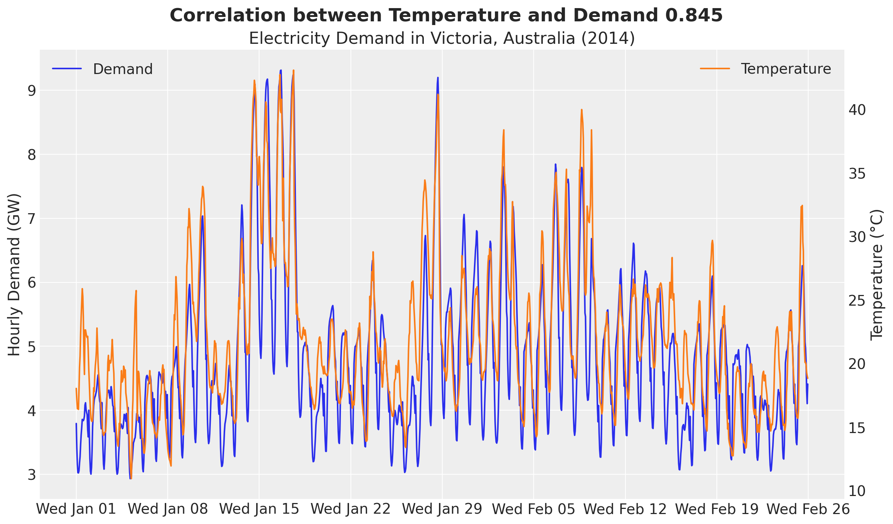</p>
</figure>


Besides forecasting, we would also like to understand the relationship between temperature and electricity demand. A good first starting point is to generate a scatter plot of temperature and demand.


    In [5]:


``` python
fig, ax = plt.subplots()
ax.scatter(temperature_values, demand_values)
ax.set(title="Demand vs Temperature", xlabel="Temperature (°C)", ylabel="Demand (GW)");
```


<figure class="figure">
<p>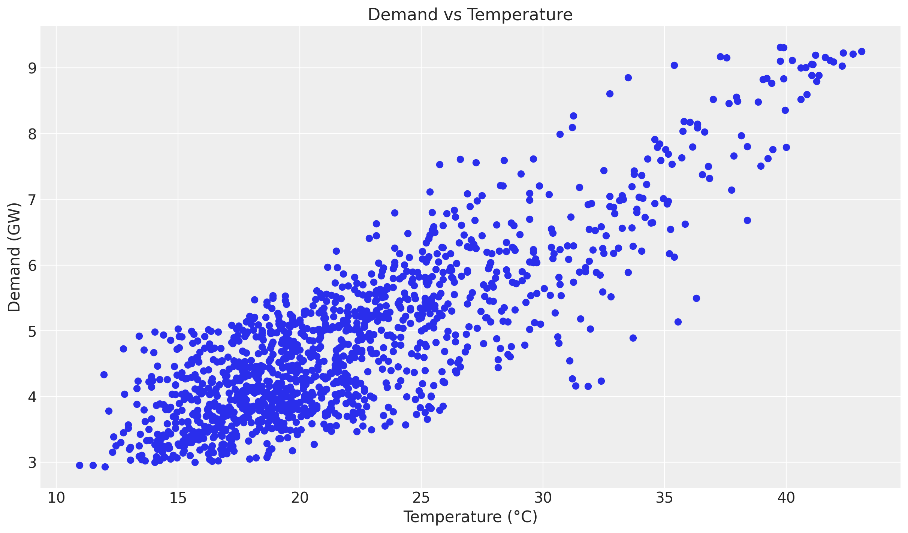</p>
</figure>


Even though we see a positive relationship between temperature and demand, the relationship is not linear. We can see this by plotting the ratio of demand to temperature.


    In [6]:


``` python
fig, ax = plt.subplots()
ax.scatter(temperature_values, demand_values / temperature_values, c=demand_values, cmap="viridis")
cbar = fig.colorbar(ax.collections[0], ax=ax)
cbar.set_label("Demand (GW)")
ax.set(
    title="Demand / Temperature vs Temperature",
    xlabel="Temperature (°C)",
    ylabel="Demand / Temperature",
);
```


<figure class="figure">
<p>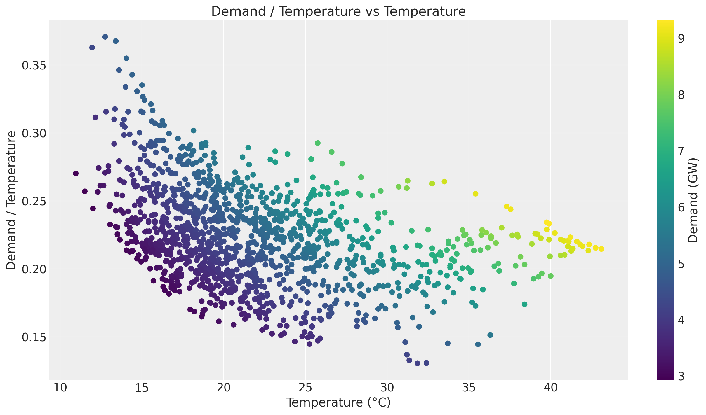</p>
</figure>


Of course there are strong seasonal effects hidden in these plots. Therefore we want to use a model that can capture the temperature effect while controlling for other factors.


# Training and test data

We split the data as in the original example, holding out the last two weeks. In addition, we build the exogenous inputs the model needs and pack them into a single `covariates` array with time at axis `-2`: the temperature and a `day_of_week` index. The forecast horizon is inferred later from `covariates` being longer than the training data.


    In [7]:


``` python
num_forecast_steps = 24 * 7 * 2  # two weeks
t_train = duration - num_forecast_steps

data_train = demand[:t_train]
data_test = demand[t_train:]

dates_train = demand_dates[:t_train]
dates_test = demand_dates[t_train:]

day_of_week = np.array([d.weekday() for d in demand_dates.astype("datetime64[D]").astype(object)])

covariates = jnp.stack([temperature, jnp.asarray(day_of_week, dtype=jnp.float32)], axis=-1)
covariates_train = covariates[:t_train]

print("data_train shape:", data_train.shape)
print("data_test shape:", data_test.shape)
print("covariates shape:", covariates.shape)
```


    data_train shape: (1008, 1)
    data_test shape: (336, 1)
    covariates shape: (1344, 2)


We can now visualize the training and test split of the demand.


    In [8]:


``` python
fig, ax = plt.subplots()
ax.plot(dates_train, np.asarray(data_train[:, 0]), label="Training Data")
ax.plot(dates_test, np.asarray(data_test[:, 0]), label="Test Data")
ax.axvline(x=dates_train[-1], color="black", linestyle="--", label="Training-Test Split")
ax.set(title="Demand Data", ylabel="Demand (GW)")
ax.legend()
ax.xaxis.set_major_locator(demand_loc)
ax.xaxis.set_major_formatter(demand_fmt)
```


<figure class="figure">
<p>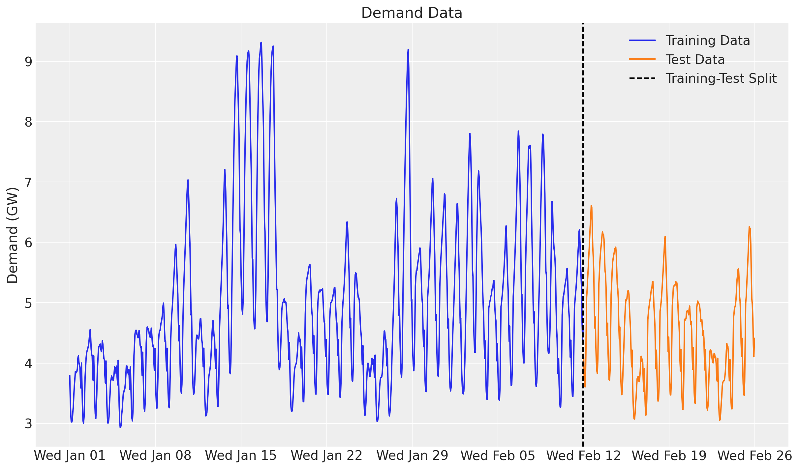</p>
</figure>


# Model specification

Here is the modeling strategy, re-expressed as a `numpyro_forecast` [ForecastingModel](../../../reference/forecaster.ForecastingModel.md#numpyro_forecast.forecaster.ForecastingModel):

- A linear-in-features model predicts demand from temperature and two seasonal effects, hour of day and day of week, both modeled with Zero-Sum Normal distributions.
- A Matérn 5/2 kernel models the temperature effect on demand through the Hilbert Space Gaussian Process (HSGP) approximation from NumPyro (see [here](https://num.pyro.ai/en/stable/contrib.html#hilbert-space-gaussian-processes-approximation)).
- The noise scale varies with the temperature.
- A Student-t distribution models the residual error.

A [ForecastingModel](../../../reference/forecaster.ForecastingModel.md#numpyro_forecast.forecaster.ForecastingModel) reads its exogenous inputs from `covariates` and must call `self.predict` exactly once with a zero-centered noise distribution and the deterministic mean. Because there is no random-walk latent here (the temperature and calendar are known over the whole horizon), the model is purely covariate-driven and `self.predict` handles both the in-sample fit and the forecast suffix, including the per-timestep noise scale.


## GP prior parameters

One key component of specifying Gaussian processes is to set the length scale and amplitude parameters. We use an optimization strategy (`preliz`) to set these parameters by assuming they both come from an Inverse-Gamma distribution while specifying the support.


    In [9]:


``` python
# For the amplitude, we set the values inspired on the range of the demand / temperature
# ratio above.
amplitude_params, ax = pz.maxent(pz.InverseGamma(), lower=0.1, upper=0.5)
```


<figure class="figure">
<p>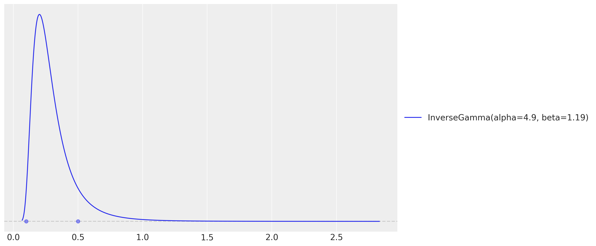</p>
</figure>


    In [10]:


``` python
# As we want to use the GP to model the temperature effect, we need to set the length
# scale parameter. We expect these effects to be seen at the order of units or tens of
# units, so we expect the length scale to be between 3 and 10.
length_scale_params, ax = pz.maxent(pz.InverseGamma(), lower=3, upper=10)
```


<figure class="figure">
<p></p>
</figure>


These two `maxent` calls return the Inverse-Gamma parameters we plug into the model below (the hour-of-day effect is tiled over the horizon with the package helper [periodic_repeat](../../../reference/util.periodic_repeat.md#numpyro_forecast.util.periodic_repeat)).


    In [11]:


``` python
class ElectricityForecaster(ForecastingModel):
    """HSGP temperature effect plus hour/day seasonality with a Student-t likelihood."""

    def __init__(self, ell: float = 55.0, m: int = 25) -> None:
        super().__init__()
        self.ell = ell
        self.m = m

    def model(self, zero_data: Array | None, covariates: Array) -> None:
        """Define the electricity-demand forecasting model."""
        duration = covariates.shape[-2]
        temperature = covariates[..., 0]
        day_of_week = covariates[..., 1].astype("int32")

        # Intercept.
        intercept = numpyro.sample("intercept", dist.Normal(loc=0.0, scale=2.0))

        # GP parameters (amplitude and length-scale priors are the preliz maxent fits).
        alpha = numpyro.sample("alpha", dist.InverseGamma(concentration=6.66, rate=1.57))
        length_scale = numpyro.sample(
            "length_scale", dist.InverseGamma(concentration=11.0, rate=62.2)
        )
        scale_factor = numpyro.sample("scale", dist.HalfNormal(scale=0.5))
        # Degrees of freedom for the Student-t likelihood.
        nu = numpyro.sample("nu", dist.Gamma(concentration=8.0, rate=3.0))

        # Non-linear temperature effect as a Matérn 5/2 HSGP. ``hsgp_matern`` is
        # annotated for float hyperparameters, so we cast the sampled scalars.
        beta_temperature = hsgp_matern(
            x=temperature,
            nu=5 / 2,
            alpha=cast("float", alpha),
            length=cast("float", length_scale),
            ell=self.ell,
            m=self.m,
        )
        numpyro.deterministic("beta_temperature", beta_temperature)

        # Hour-of-day effect, tiled over the horizon with periodic_repeat.
        scale_hour_of_day = numpyro.sample("scale_hour_of_day", dist.HalfNormal(scale=0.5))
        hour_of_day_effect = numpyro.sample(
            "hour_of_day_effect",
            dist.ZeroSumNormal(scale=scale_hour_of_day, event_shape=(24,)),
        )
        hour_of_day_effect = periodic_repeat(hour_of_day_effect, duration, axis=-1)

        # Day-of-week effect, indexed by the calendar covariate.
        scale_day_of_week = numpyro.sample("scale_day_of_week", dist.HalfNormal(scale=0.5))
        day_of_week_effect = numpyro.sample(
            "day_of_week_effect",
            dist.ZeroSumNormal(scale=scale_day_of_week, event_shape=(7,)),
        )

        # Expected demand and a temperature-dependent Student-t noise scale.
        mu = (
            beta_temperature * temperature
            + intercept
            + hour_of_day_effect
            + jnp.take(day_of_week_effect, day_of_week)
        )
        scale = scale_factor * jnp.sqrt(temperature)

        self.predict(dist.StudentT(df=nu, loc=0.0, scale=scale[..., None]), mu[..., None])


model = ElectricityForecaster()
```


A [ForecastingModel](../../../reference/forecaster.ForecastingModel.md#numpyro_forecast.forecaster.ForecastingModel) instance is itself the NumPyro model callable `(covariates, data=None)`, so we can render its structure directly.


    In [12]:


``` python
numpyro.render_model(
    model,
    model_args=(covariates_train, data_train),
    render_distributions=True,
    render_params=True,
)
```


<figure class="figure">
<p>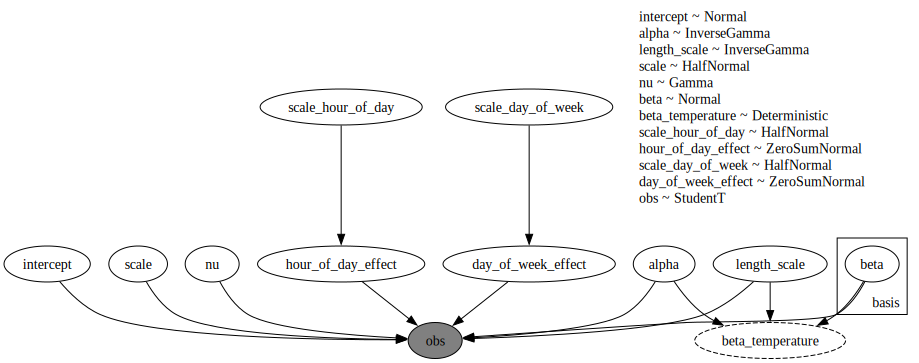</p>
</figure>


# Prior predictive checks

Before we fit the model, let's visualize the prior predictive distribution. A [ForecastingModel](../../../reference/forecaster.ForecastingModel.md#numpyro_forecast.forecaster.ForecastingModel) instance is a plain NumPyro model callable, so we can hand it to `Predictive` directly. We draw the bands with ArviZ's `plot_lm`, which computes the \\50\\\\ and \\94\\\\ HDI internally; since the time axis is a `datetime64` array we pass it as matplotlib date numbers (`mdates.date2num`) and restore the date formatter on the returned axis.


    In [13]:


``` python
prior_predictive = Predictive(model, num_samples=2_000, return_sites=["obs"])
rng_key, rng_subkey = random.split(rng_key)
prior_obs = prior_predictive(rng_subkey, covariates_train)["obs"][..., 0]

xnum_train = mdates.date2num(dates_train)

idata_prior = az.from_dict(
    {
        "prior_predictive": {"obs": np.asarray(prior_obs)[None]},
        "observed_data": {"obs": np.asarray(data_train[:, 0])},
        "constant_data": {"date": xnum_train},
    },
    coords={"time": xnum_train},
    dims={"obs": ["time"], "date": ["time"]},
)
pc = az.plot_lm(
    idata_prior,
    y="obs",
    x="date",
    group="prior_predictive",
    ci_kind="hdi",
    ci_prob=(0.5, 0.94),
    smooth=False,
    visuals={"ci_band": {"color": "C0"}, "observed_scatter": False, "pe_line": False},
    figure_kwargs={"figsize": (12, 7)},
)
ax = pc.viz["figure"].item().axes[0]
band_50, band_94 = ax.collections  # in ci_prob order: (0.5, 0.94)
band_50.set_label(r"$50\%$ HDI")
band_94.set_label(r"$94\%$ HDI")
(train_line,) = ax.plot(
    xnum_train, np.asarray(data_train[:, 0]), c="black", lw=1, label="Training Data"
)
ax.xaxis.set_major_locator(demand_loc)
ax.xaxis.set_major_formatter(demand_fmt)
ax.legend(handles=[band_94, band_50, train_line])
ax.set(title="Prior Predictive Checks", ylabel="Demand (GW)", xlabel="Time");
```


<figure class="figure">
<p>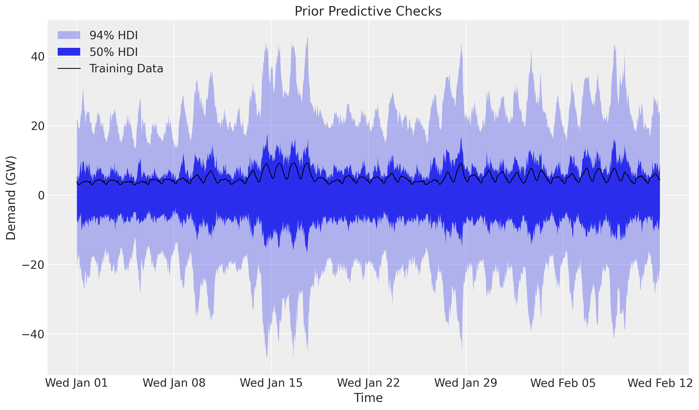</p>
</figure>


The prior predictive distribution is not too far from the training data but is not very restrictive either.


# Inference with SVI

We fit the model with stochastic variational inference through the [Forecaster](../../../reference/forecaster.Forecaster.md#numpyro_forecast.forecaster.Forecaster) class, which wraps the SVI fit and exposes the fitted `guide`, `params` and the ELBO `losses`. The posterior is multimodal: the multiplicative `beta_temperature * temperature` term trades off against the overall level, so a plain `AutoNormal` can settle on a monotonic temperature effect. We pass a custom guide initialized at a feasible point (`init_to_feasible`), which reliably recovers the heating-and-cooling (U-shaped) effect; [Forecaster](../../../reference/forecaster.Forecaster.md#numpyro_forecast.forecaster.Forecaster) accepts any guide through its `guide` argument.


    In [14]:


``` python
rng_key, rng_subkey = random.split(rng_key)
guide = AutoNormal(model, init_loc_fn=init_to_feasible)
forecaster = Forecaster(
    rng_subkey,
    model,
    data_train,
    covariates_train,
    guide=guide,
    optim=Adam(step_size=0.005),
    num_steps=50_000,
)

fig, ax = plt.subplots(figsize=(9, 6))
ax.plot(forecaster.losses)
ax.set_yscale("log")
ax.set_title("ELBO loss", fontsize=18, fontweight="bold");
```


<figure class="figure">
<p>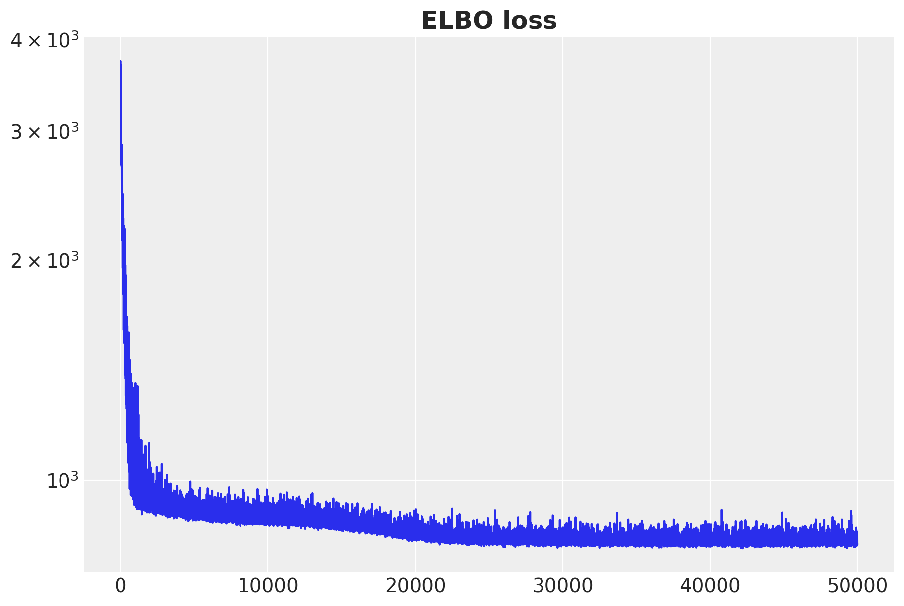</p>
</figure>


The ELBO loss is decreasing as expected.


# Posterior predictive checks

We now generate in-sample posterior predictive samples (drawing posterior latents from the fitted guide and pushing them through the model) and forecast the held-out two weeks by calling the forecaster with the full-horizon covariates. We keep the deterministic `beta_temperature` site to inspect the temperature effect later.


    In [15]:


``` python
num_posterior_samples = 5_000

rng_key, rng_subkey = random.split(rng_key)
posterior_samples = forecaster.guide.sample_posterior(
    rng_subkey, forecaster.params, sample_shape=(num_posterior_samples,)
)

rng_key, rng_subkey = random.split(rng_key)
train_posterior = Predictive(
    model, posterior_samples=posterior_samples, return_sites=["obs", "beta_temperature"]
)(rng_subkey, covariates_train)

rng_key, rng_subkey = random.split(rng_key)
forecast = forecaster(rng_subkey, data_train, covariates, num_samples=num_posterior_samples)
```


## Forecast evaluation

We score the train and test forecasts with [evaluate_forecast](../../../reference/evaluate.evaluate_forecast.md#numpyro_forecast.evaluate.evaluate_forecast), which reports several metrics at once: CRPS (the [Continuous Ranked Probability Score](https://en.wikipedia.org/wiki/Scoring_rule#Continuous_ranked_probability_score)), mean absolute error, root mean squared error, and the empirical coverage of the central 90% prediction interval.


    In [16]:


``` python
train_metrics = evaluate_forecast(train_posterior["obs"], data_train)
test_metrics = evaluate_forecast(forecast, data_test)

metrics_table = pd.DataFrame({"train": train_metrics, "test": test_metrics})
metrics_table
```


|          | train    | test     |
|----------|----------|----------|
| mae      | 0.374878 | 0.259288 |
| rmse     | 0.510099 | 0.325937 |
| crps     | 0.272944 | 0.187844 |
| coverage | 0.918651 | 0.991071 |


The held-out scores land in the same ballpark as the in-sample ones (here even a touch sharper), and the central 90% interval is well calibrated in-sample (coverage near `0.9`) and conservative out-of-sample, so the model generalizes to the held-out two weeks rather than overfitting. We can now compare the posterior predictive distribution with the training and test data.


    In [17]:


``` python
train_obs = train_posterior["obs"][..., 0]
forecast_obs = forecast[..., 0]

xnum_test = mdates.date2num(dates_test)

idata_train = az.from_dict(
    {
        "posterior_predictive": {"obs": np.asarray(train_obs)[None]},
        "observed_data": {"obs": np.asarray(data_train[:, 0])},
        "constant_data": {"date": xnum_train},
    },
    coords={"time": xnum_train},
    dims={"obs": ["time"], "date": ["time"]},
)
idata_test = az.from_dict(
    {
        "posterior_predictive": {"obs": np.asarray(forecast_obs)[None]},
        "observed_data": {"obs": np.asarray(data_test[:, 0])},
        "constant_data": {"date": xnum_test},
    },
    coords={"time": xnum_test},
    dims={"obs": ["time"], "date": ["time"]},
)

pc = az.plot_lm(
    idata_train,
    y="obs",
    x="date",
    ci_kind="hdi",
    ci_prob=(0.5, 0.94),
    smooth=False,
    visuals={"ci_band": {"color": "C0"}, "observed_scatter": False, "pe_line": False},
    figure_kwargs={"figsize": (12, 7)},
)
az.plot_lm(
    idata_test,
    y="obs",
    x="date",
    plot_collection=pc,
    ci_kind="hdi",
    ci_prob=(0.5, 0.94),
    smooth=False,
    visuals={"ci_band": {"color": "C1"}, "observed_scatter": False, "pe_line": False},
)
ax = pc.viz["figure"].item().axes[0]
# ax.collections holds the bands in plotting order: train (0.5, 0.94) then test (0.5, 0.94).
band_train_50, band_train_94, band_test_50, band_test_94 = ax.collections
band_train_94.set_label(r"in-sample $94\%$ HDI")
band_train_50.set_label(r"in-sample $50\%$ HDI")
band_test_94.set_label(r"forecast $94\%$ HDI")
band_test_50.set_label(r"forecast $50\%$ HDI")
obs_dates = mdates.date2num(np.concatenate([dates_train, dates_test]))
obs_values = np.concatenate([np.asarray(data_train[:, 0]), np.asarray(data_test[:, 0])])
(obs_line,) = ax.plot(obs_dates, obs_values, c="black", lw=1, label="Observed Data")
split_line = ax.axvline(x=xnum_train[-1], color="gray", linestyle="--", label="Train/Test Split")
ax.xaxis.set_major_locator(demand_loc)
ax.xaxis.set_major_formatter(demand_fmt)
ax.legend(
    handles=[band_train_94, band_train_50, band_test_94, band_test_50, obs_line, split_line],
    loc="upper center",
    bbox_to_anchor=(0.5, -0.1),
    ncol=3,
)
ax.set(
    title=f"Train CRPS: {train_metrics['crps']:.3f}, Test CRPS: {test_metrics['crps']:.3f}",
    ylabel="Demand (GW)",
    xlabel="Time",
)
fig = pc.viz["figure"].item()
fig.suptitle("Posterior Predictive Checks", fontsize=18, fontweight="bold");
```


<figure class="figure">
<p>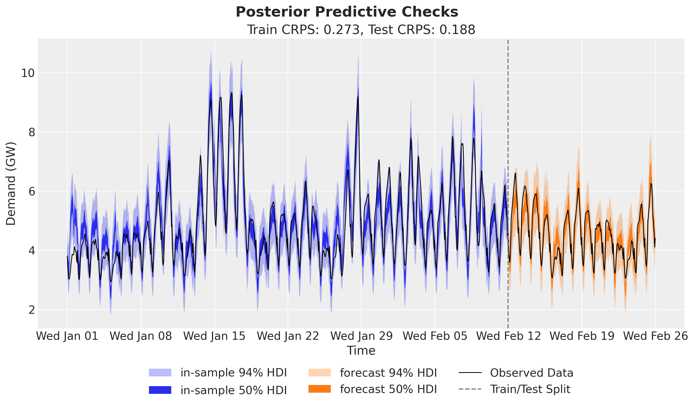</p>
</figure>


The predictions look very good, and clearly better than the basic linear model used in the TensorFlow Probability tutorial (which is fine, as they focus on the core API).


## Temperature effect on demand

Being happy about the forecast performance, we can dig deeper into the temperature effect. First we simply plot the predictions and the raw values against temperature, sorting by temperature so the HDI band reads cleanly.


    In [18]:


``` python
temperature_train = np.asarray(temperature[:t_train])
order = np.argsort(temperature_train)

idata_demand = az.from_dict(
    {
        "posterior_predictive": {"obs": np.asarray(train_obs[:, order])[None]},
        "observed_data": {"obs": np.asarray(data_train[order, 0])},
        "constant_data": {"temperature": temperature_train[order]},
    },
    dims={"obs": ["obs_dim"], "temperature": ["obs_dim"]},
)
pc = az.plot_lm(
    idata_demand,
    y="obs",
    x="temperature",
    ci_kind="hdi",
    ci_prob=(0.5, 0.94),
    smooth=False,
    visuals={"ci_band": {"color": "C0"}, "observed_scatter": False, "pe_line": False},
    figure_kwargs={"figsize": (12, 7)},
)
ax = pc.viz["figure"].item().axes[0]
band_50, band_94 = ax.collections
band_50.set_label(r"$50\%$ HDI")
band_94.set_label(r"$94\%$ HDI")
ax.scatter(temperature_train, np.asarray(data_train[:, 0]), c="black", s=10)
ax.legend(handles=[band_94, band_50])
ax.set(title="Demand vs Temperature", xlabel="Temperature (°C)", ylabel="Demand (GW)");
```


<figure class="figure">
<p>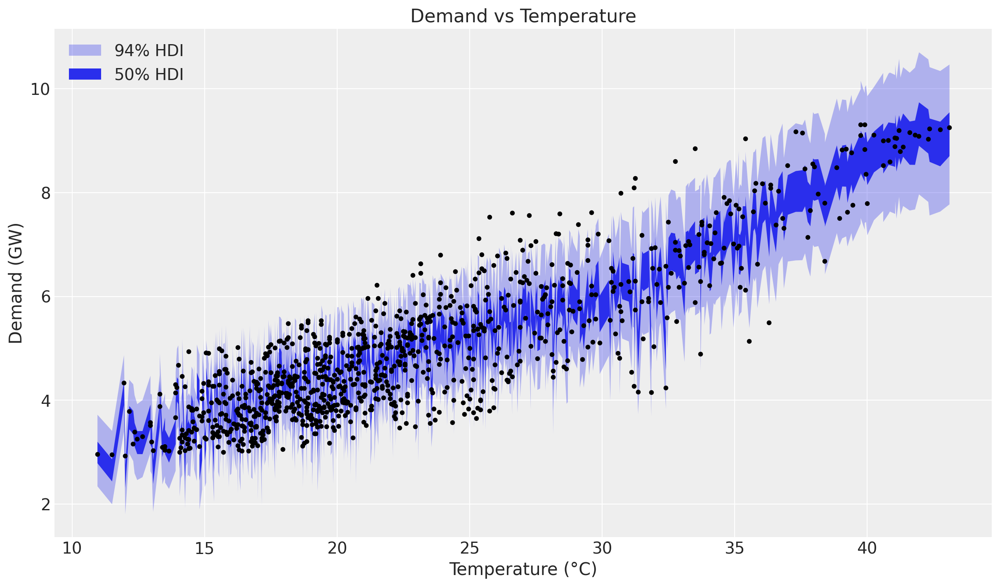</p>
</figure>


The non-linearity is clearly visible. Next we look at the latent relationship between temperature and demand: the posterior distribution of the Gaussian Process component `beta_temperature`.


    In [19]:


``` python
beta_temperature = train_posterior["beta_temperature"]

idata_beta = az.from_dict(
    {
        "posterior_predictive": {"obs": np.asarray(beta_temperature[:, order])[None]},
        "observed_data": {"obs": np.zeros_like(temperature_train[order])},
        "constant_data": {"temperature": temperature_train[order]},
    },
    dims={"obs": ["obs_dim"], "temperature": ["obs_dim"]},
)
pc = az.plot_lm(
    idata_beta,
    y="obs",
    x="temperature",
    ci_kind="hdi",
    ci_prob=(0.5, 0.94),
    smooth=False,
    visuals={"ci_band": {"color": "C1"}, "observed_scatter": False, "pe_line": False},
    figure_kwargs={"figsize": (12, 7)},
)
ax = pc.viz["figure"].item().axes[0]
band_50, band_94 = ax.collections
band_50.set_label(r"$50\%$ HDI")
band_94.set_label(r"$94\%$ HDI")
ax.legend(handles=[band_94, band_50])
ax.set(title="Temperature Effect on Demand", xlabel="Temperature (°C)", ylabel="Effect on Demand");
```


<figure class="figure">
<p>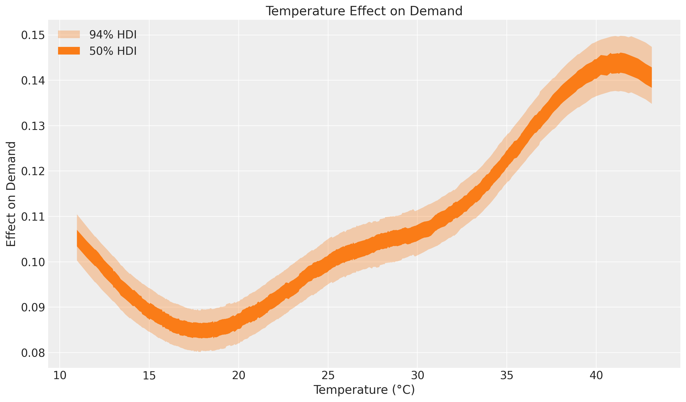</p>
</figure>


This effect plot coincides with the exploratory comment by Hyndman and Athanasopoulos at https://otexts.com/fpp2/scatterplots.html:

> *"It is clear that high demand occurs when temperatures are high due to the effect of air-conditioning. But there is also a heating effect, where demand increases for very low temperatures."*

Indeed, at the extremes of the common temperature range the temperature effect on demand increases. Heating and cooling usually happen outside the range \\15\\°C - 25\\°C\\.
