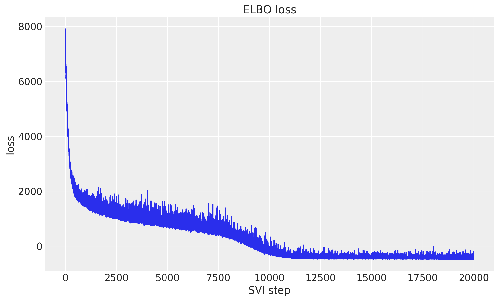
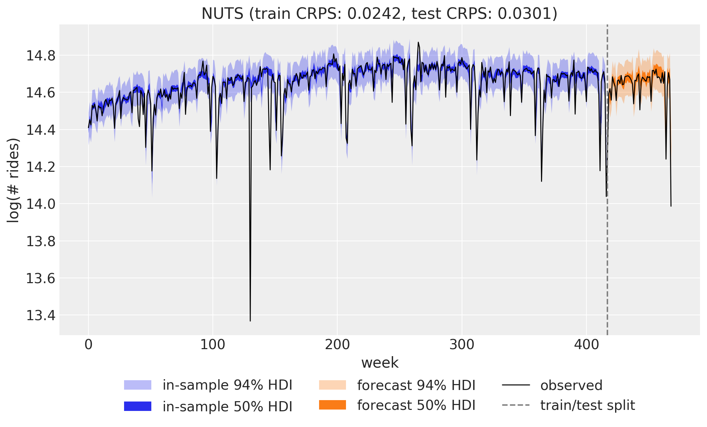
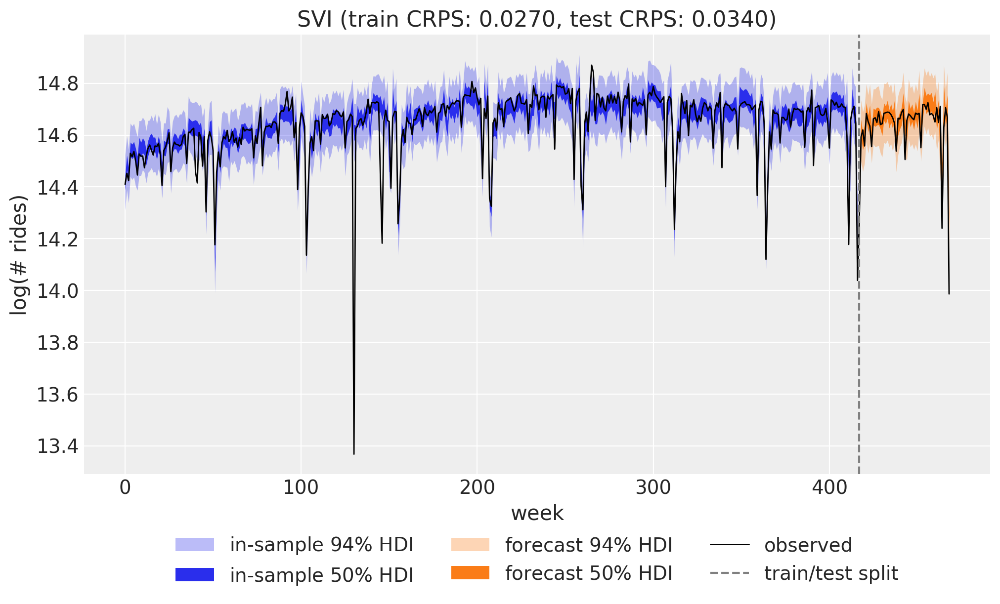
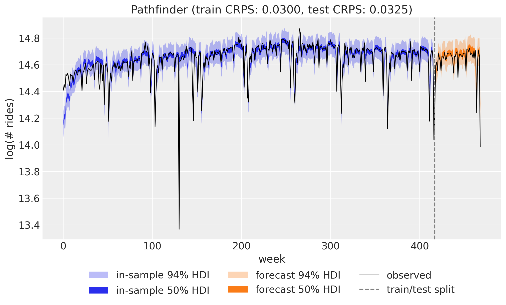
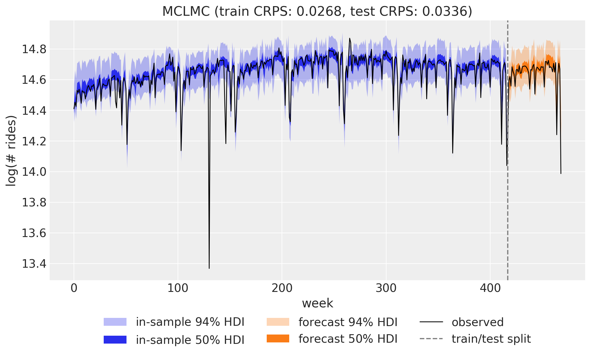

# Comparing inference methods: NUTS, SVI, Pathfinder, and MCLMC with `numpyro_forecast`


One advantage of writing a forecasting model once is that you can fit it with different inference engines without touching the model code. In this notebook we take the weekly BART ridership model from the [univariate forecasting example](forecasting_univariate.md) (a random-walk local level, Fourier seasonality, and a Student-T likelihood) and fit it four ways: with **NUTS** (Markov chain Monte Carlo), with **SVI** (stochastic variational inference, using a custom [optax](https://optax.readthedocs.io/en/latest/) optimizer), with **Pathfinder** (quasi-Newton variational inference from [BlackJAX](https://blackjax-devs.github.io/blackjax/)), and with **MCLMC** (microcanonical Langevin Monte Carlo, a BlackJAX sampler that plugs into the same MCMC entry point through a kernel adapter).

Every engine returns a small fit object, and a single [to_datatree](../../../reference/convert.to_datatree.md#numpyro_forecast.convert.to_datatree) call turns any of them into an ArviZ `DataTree` holding both the in-sample posterior predictive and the forecast over the test horizon, which powers the plots and the evaluation alike. We compare the four engines on the continuous ranked probability score (CRPS) over the training and test windows, and on wall-clock time.


# Prepare notebook


    In [1]:


``` python
from time import perf_counter

import arviz as az
import jax
import jax.numpy as jnp
import matplotlib.pyplot as plt
import numpy as np
import numpyro
import numpyro.distributions as dist
import optax
import pandas as pd
import xarray as xr
from jax import random
from numpyro.infer.reparam import LocScaleReparam

from numpyro_forecast import eval_crps, to_datatree
from numpyro_forecast.contrib.blackjax import BlackjaxMCLMCKernel, fit_pathfinder
from numpyro_forecast.datasets import load_bart_weekly
from numpyro_forecast.features import fourier_features
from numpyro_forecast.functional import (
    Horizon,
    fit_mcmc,
    fit_svi,
    forecasting_model,
    predict,
    time_series,
)
from numpyro_forecast.typing import Array

az.style.use("arviz-darkgrid")
plt.rcParams["figure.figsize"] = [10, 6]
plt.rcParams["figure.dpi"] = 100
plt.rcParams["figure.facecolor"] = "white"

numpyro.set_host_device_count(n=4)

rng_key = random.PRNGKey(seed=42)

%load_ext autoreload
%autoreload 2
%load_ext jaxtyping
%jaxtyping.typechecker beartype.beartype
%config InlineBackend.figure_format = "retina"
```


# Read data

We work with total weekly BART ridership on the log scale, exactly as in the univariate example. Throughout the package, time lives at axis `-2` and the observation dimension at axis `-1`, so the series has shape `(weeks, 1)`.


    In [2]:


``` python
data = load_bart_weekly()  # (weeks, 1), log scale
duration = data.shape[0]
print("data shape:", data.shape)
```


    data shape: (469, 1)


# Train-test split

We hold out the last `52` weeks (one full year) as the test set and train on the preceding `417` weeks, so the test window covers a complete seasonal cycle.


    In [3]:


``` python
T0 = 0
T2 = duration  # 469
T1 = T2 - 52  # 417: train / test split

y_train = data[T0:T1]
y_test = data[T1:T2]

time = np.arange(T2)
time_train = time[T0:T1]
time_test = time[T1:T2]
print("train:", y_train.shape, "test:", y_test.shape)

fig, ax = plt.subplots()
ax.plot(time_train, np.asarray(y_train[:, 0]), color="C0", label="train")
ax.plot(time_test, np.asarray(y_test[:, 0]), color="C1", label="test")
ax.axvline(T1, color="gray", ls="--", label="train/test split")
ax.legend()
ax.set(title="Train / test split", xlabel="week", ylabel="log(# rides)");
```


    train: (417, 1) test: (52, 1)


<figure class="figure">
<p></p>
</figure>


# Seasonal features

The annual cycle enters through a Fourier design matrix built with [fourier_features](../../../reference/features.fourier_features.md#numpyro_forecast.features.fourier_features): `26` harmonics (so `52` sine and cosine columns) at a period of `365.25 / 7` weeks.


    In [4]:


``` python
num_terms = 26
covariates = fourier_features(duration, period=365.25 / 7, num_terms=num_terms)
covariates_train = covariates[T0:T1]
print("covariates shape:", covariates.shape)
```


    covariates shape: (469, 52)


# Model specification

The model is the same *local level with seasonality* as in the [univariate forecasting example](forecasting_univariate.md): a global bias, a random-walk level, and a Fourier regression for the annual cycle, with a heavy-tailed Student-T likelihood to absorb outlier weeks. See that notebook for the full mathematical specification, the priors, and a rendering of the model graph. Here we only restate the code, written once as a plain function wrapped with [forecasting_model](../../../reference/functional.models.forecasting_model.md#numpyro_forecast.functional.models.forecasting_model), so all four inference engines below consume exactly the same object.


    In [5]:


``` python
@forecasting_model
def univariate_model(h: Horizon, covariates: Array) -> None:
    """Local level + Fourier regression with Student-T observations."""
    num_features = covariates.shape[-1]

    bias = numpyro.sample("bias", dist.Normal(0.0, 10.0))
    weight = numpyro.sample("weight", dist.Normal(0.0, 0.1).expand([num_features]).to_event(1))
    drift_scale = numpyro.sample("drift_scale", dist.LogNormal(-20.0, 5.0))
    nu = numpyro.sample("nu", dist.Gamma(10.0, 2.0))
    sigma = numpyro.sample("sigma", dist.LogNormal(-5.0, 5.0))
    centered = numpyro.sample("centered", dist.Uniform(0.0, 1.0))

    drift = time_series(
        h,
        "drift",
        lambda: dist.Normal(0.0, drift_scale),
        reparam=LocScaleReparam(centered=centered),
    )
    level = jnp.cumsum(drift, axis=-2)
    regression = (weight * covariates).sum(axis=-1, keepdims=True)
    prediction = level + bias + regression

    predict(h, dist.StudentT(df=nu, loc=0.0, scale=sigma), prediction)
```


# Inference

We now fit the same model four times, once per inference engine. Each `fit_*` function consumes the training data and covariates and returns a small frozen fit object ([MCMCFit](../../../reference/functional.mcmc.MCMCFit.md#numpyro_forecast.functional.mcmc.MCMCFit), [SVIFit](../../../reference/functional.svi.SVIFit.md#numpyro_forecast.functional.svi.SVIFit), [PathfinderFit](../../../reference/contrib.blackjax.PathfinderFit.md#numpyro_forecast.contrib.blackjax.PathfinderFit)) that plugs into the same downstream pipeline, so switching engines is a one-line change. In brief:

- **NUTS** (the No-U-Turn Sampler) is gradient-based Markov chain Monte Carlo. It draws asymptotically exact samples from the posterior, which makes it our reference here, at the highest computational cost of the four.
- **SVI** (stochastic variational inference) turns inference into optimization: it fits the parameters of an approximating guide distribution (here `AutoNormal`, a diagonal Gaussian) by maximizing the evidence lower bound (ELBO). It is much faster than MCMC, and its accuracy is bounded by how well the guide family can match the true posterior.
- **Pathfinder** is quasi-Newton variational inference. It runs L-BFGS toward the posterior mode and recycles the optimization path into a sequence of normal approximations, returning the one with the best ELBO. It is often used for fast approximate posteriors or to initialize MCMC.
- **MCLMC** (microcanonical Langevin Monte Carlo) is MCMC of a different flavor: it simulates energy-preserving isokinetic dynamics with stochastic momentum refreshment and skips the Metropolis accept/reject correction entirely. Every draw costs a fixed two gradient evaluations, far below the cost of a NUTS trajectory, in exchange for a small step-size-controlled bias in the stationary distribution.

The object-oriented wrappers [HMCForecaster](../../../reference/forecaster.HMCForecaster.md#numpyro_forecast.forecaster.HMCForecaster), [Forecaster](../../../reference/forecaster.Forecaster.md#numpyro_forecast.forecaster.Forecaster), and [PathfinderForecaster](../../../reference/forecaster.PathfinderForecaster.md#numpyro_forecast.forecaster.PathfinderForecaster) bundle these same fits with prediction methods, but here we stay with the functional API because the fit objects are exactly what the ArviZ export below consumes.


## NUTS

We run `4` chains in parallel with `2_000` warmup steps and `1_000` posterior draws each. The posterior includes one drift increment per training week (417 of them), so this is the most expensive fit in the notebook.


    In [6]:


``` python
rng_key, rng_subkey = random.split(rng_key)

start = perf_counter()
nuts_fit = fit_mcmc(
    rng_subkey,
    univariate_model,
    y_train,
    covariates_train,
    num_warmup=2_000,
    num_samples=1_000,
    num_chains=4,
    chain_method="parallel",
)
jax.block_until_ready(nuts_fit.samples)
nuts_seconds = perf_counter() - start
print(f"NUTS: 4 chains x 1_000 draws in {nuts_seconds:.1f}s")
```


    NUTS: 4 chains x 1_000 draws in 33.4s


## SVI

[fit_svi](../../../reference/functional.svi.fit_svi.md#numpyro_forecast.functional.svi.fit_svi) resolves its `optim` argument through [resolve_optimizer](../../../reference/functional.svi.resolve_optimizer.md#numpyro_forecast.functional.svi.resolve_optimizer), which accepts a plain learning rate, a NumPyro optimizer, or any optax `GradientTransformation`. We use that last option to build a custom optimizer from two pieces:

- A **one-cycle** learning-rate schedule (`optax.linear_onecycle_schedule`): a linear warmup to a peak followed by a long annealing phase. The warmup lets the optimizer pass through a much higher mid-run learning rate than a fixed setting could tolerate, and the final annealing polishes the optimum.
- **Reduce-on-plateau** (`optax.contrib.reduce_on_plateau`): an adaptive safeguard that scales the updates down by `factor=0.8` whenever the ELBO, averaged over `accumulation_size=100` steps, stops improving for `patience=20` consecutive windows. NumPyro forwards the per-step ELBO value to the optimizer chain, which is exactly the signal this transformation monitors.

The univariate example needs `50_000` steps at a fixed `Adam(0.005)`; cycling up to a peak of `0.01` reaches a slightly better ELBO in `20_000` steps, less than half the budget.


    In [7]:


``` python
num_steps = 20_000

scheduler = optax.linear_onecycle_schedule(
    transition_steps=num_steps,
    peak_value=0.01,
    pct_start=0.3,
    pct_final=0.85,
    div_factor=2,
    final_div_factor=3,
)

optimizer = optax.chain(
    optax.adam(learning_rate=scheduler),
    optax.contrib.reduce_on_plateau(
        factor=0.8,
        patience=20,
        accumulation_size=100,
    ),
)

fig, ax = plt.subplots()
ax.plot(np.asarray(jax.vmap(scheduler)(jnp.arange(num_steps))), color="C0")
ax.set(title="One-cycle learning rate schedule", xlabel="SVI step", ylabel="learning rate");
```


<figure class="figure">
<p></p>
</figure>


    In [8]:


``` python
rng_key, rng_subkey = random.split(rng_key)

start = perf_counter()
svi_fit = fit_svi(
    rng_subkey,
    univariate_model,
    y_train,
    covariates_train,
    optim=optimizer,
    num_steps=num_steps,
)
jax.block_until_ready(svi_fit.losses)
svi_seconds = perf_counter() - start
print(f"SVI: {num_steps:_} steps in {svi_seconds:.1f}s")

fig, ax = plt.subplots()
ax.plot(svi_fit.losses)
ax.set(title="ELBO loss", xlabel="SVI step", ylabel="loss");
```


    SVI: 20_000 steps in 3.8s


<figure class="figure">
<p></p>
</figure>


## Pathfinder

[fit_pathfinder](../../../reference/contrib.blackjax.fit_pathfinder.md#numpyro_forecast.contrib.blackjax.fit_pathfinder) lives in `numpyro_forecast.contrib.blackjax` and needs the optional BlackJAX backend (install it with `pip install "numpyro_forecast[blackjax]"`). A single L-BFGS run traces a path toward the posterior mode, each point on the path induces a normal approximation, and the fit keeps the one with the best ELBO estimate.

Two settings matter here. The first is `maxiter`, the L-BFGS iteration budget: the default (`30`) suits posteriors with a handful of parameters, but ours has one drift increment per training week and needs a few hundred iterations to approach the high-density region. The second is the number of paths: a single Pathfinder run is noisy, because the quality of the approximation depends on where its optimization path happens to wander, so standard practice (the *multi-path* variant in the paper) is to run a few independent paths and keep the one with the best ELBO. We run `4` paths of `500` iterations each; the paths are fully independent, so in a production setting they can run in parallel.


    In [9]:


``` python
rng_key, rng_subkey = random.split(rng_key)
num_paths = 4

start = perf_counter()
path_fits = [
    fit_pathfinder(path_key, univariate_model, y_train, covariates_train, maxiter=500)
    for path_key in random.split(rng_subkey, num_paths)
]
pathfinder_fit = max(path_fits, key=lambda fit: fit.elbo)
pathfinder_seconds = perf_counter() - start

print("per-path ELBO:", [round(fit.elbo, 1) for fit in path_fits])
print(f"Pathfinder: best ELBO {pathfinder_fit.elbo:.2f} in {pathfinder_seconds:.1f}s")
```


    per-path ELBO: [-1620.3, -2197.9, -1690.8, -1234.4]
    Pathfinder: best ELBO -1234.40 in 13.5s


## MCLMC

The [fit_mcmc](../../../reference/functional.mcmc.fit_mcmc.md#numpyro_forecast.functional.mcmc.fit_mcmc) entry point used for NUTS accepts any NumPyro-compatible kernel, and `numpyro_forecast.contrib.blackjax` provides adapters for BlackJAX samplers (the same optional dependency as Pathfinder above). [BlackjaxMCLMCKernel](../../../reference/contrib.blackjax.BlackjaxMCLMCKernel.md#numpyro_forecast.contrib.blackjax.BlackjaxMCLMCKernel) wraps microcanonical Langevin Monte Carlo: the kernel tunes the step size, the trajectory length \\L\\, and a diagonal preconditioner once inside its `init`, and every subsequent MCMC step is a single tuned MCLMC step. Because that tuning replaces warmup, we pass `num_warmup=0` (the adapter warns that warmup steps would be discarded work), and since the adapter runs chains sequentially we draw one long chain instead of four parallel ones.

The flip side of skipping the Metropolis correction is that nothing rejects a bad step: the draws carry a small discretization bias controlled by the tuned step size, and an unlucky tuning run degrades the samples silently instead of showing up as divergences the way it would in NUTS. In practice one validates MCLMC against a proper score like the CRPS below or against a short NUTS reference run. We use a generous tuning budget, which costs little because a tuning step is as cheap as a sampling step.


    In [10]:


``` python
rng_key, rng_subkey = random.split(rng_key)

start = perf_counter()
mclmc_fit = fit_mcmc(
    rng_subkey,
    univariate_model,
    y_train,
    covariates_train,
    kernel=BlackjaxMCLMCKernel,
    kernel_kwargs={"num_tuning_steps": 10_000},
    num_warmup=0,
    num_samples=10_000,
)
jax.block_until_ready(mclmc_fit.samples)
mclmc_seconds = perf_counter() - start
print(f"MCLMC: 1 chain x 10_000 draws in {mclmc_seconds:.1f}s")
```


    MCLMC: 1 chain x 10_000 draws in 4.4s


# Exporting fits to ArviZ

[to_datatree](../../../reference/convert.to_datatree.md#numpyro_forecast.convert.to_datatree) converts any of the four fit objects into an ArviZ-schema `xarray.DataTree` with `posterior`, `posterior_predictive`, `observed_data`, and `constant_data` groups. An MCMC fit keeps its real chain structure, so convergence diagnostics work out of the box, while the variational fits get a single pseudo chain and a `variational: True` attribute. Because we pass the full-length covariates (longer than the training data, the package-wide shape convention for a forecast horizon), the same call also draws the forecast over the held-out year and stores it in the `predictions` and `predictions_constant_data` groups, continuing the in-sample time coordinate. If you need finer control over the forecast draws, [add_forecast_groups](../../../reference/convert.add_forecast_groups.md#numpyro_forecast.convert.add_forecast_groups) attaches them step by step.

The export is one call, identical for the four engines. The only post-processing we add is cosmetic, for plotting: this series is univariate, so we drop the singleton observation dimension and expose the week index as a variable that `az.plot_lm` can use as the x axis.


    In [11]:


``` python
def build_tree(rng_key: Array, fit: object, num_samples: int = 2_000) -> xr.DataTree:
    """Export a fit to an ArviZ ``DataTree`` with in-sample and forecast groups."""
    tree = to_datatree(
        rng_key,
        fit,
        univariate_model,
        y_train,
        covariates,
        num_predictive_samples=num_samples,
        posterior_dims={"drift": ["time"]},
    )
    for group in ("posterior_predictive", "observed_data", "predictions"):
        tree[group] = tree[group].dataset.isel(obs_dim=0)
    tree["constant_data"] = tree["constant_data"].dataset.assign(
        week=("time", time_train.astype(float))
    )
    tree["predictions_constant_data"] = tree["predictions_constant_data"].dataset.assign(
        week=("time", time_test.astype(float))
    )
    return tree


rng_key, key_nuts, key_svi, key_pf, key_mclmc = random.split(rng_key, 5)
nuts_tree = build_tree(key_nuts, nuts_fit)
svi_tree = build_tree(key_svi, svi_fit)
pathfinder_tree = build_tree(key_pf, pathfinder_fit)
mclmc_tree = build_tree(key_mclmc, mclmc_fit)

nuts_tree
```


![](data:image/svg+xml;base64,PHN2ZyBzdHlsZT0icG9zaXRpb246IGFic29sdXRlOyB3aWR0aDogMDsgaGVpZ2h0OiAwOyBvdmVyZmxvdzogaGlkZGVuIj4KPGRlZnM+CjxzeW1ib2wgaWQ9Imljb24tZGF0YWJhc2UiIHZpZXdib3g9IjAgMCAzMiAzMiI+CjxwYXRoIGQ9Ik0xNiAwYy04LjgzNyAwLTE2IDIuMjM5LTE2IDV2NGMwIDIuNzYxIDcuMTYzIDUgMTYgNXMxNi0yLjIzOSAxNi01di00YzAtMi43NjEtNy4xNjMtNS0xNi01eiIgLz4KPHBhdGggZD0iTTE2IDE3Yy04LjgzNyAwLTE2LTIuMjM5LTE2LTV2NmMwIDIuNzYxIDcuMTYzIDUgMTYgNXMxNi0yLjIzOSAxNi01di02YzAgMi43NjEtNy4xNjMgNS0xNiA1eiIgLz4KPHBhdGggZD0iTTE2IDI2Yy04LjgzNyAwLTE2LTIuMjM5LTE2LTV2NmMwIDIuNzYxIDcuMTYzIDUgMTYgNXMxNi0yLjIzOSAxNi01di02YzAgMi43NjEtNy4xNjMgNS0xNiA1eiIgLz4KPC9zeW1ib2w+CjxzeW1ib2wgaWQ9Imljb24tZmlsZS10ZXh0MiIgdmlld2JveD0iMCAwIDMyIDMyIj4KPHBhdGggZD0iTTI4LjY4MSA3LjE1OWMtMC42OTQtMC45NDctMS42NjItMi4wNTMtMi43MjQtMy4xMTZzLTIuMTY5LTIuMDMwLTMuMTE2LTIuNzI0Yy0xLjYxMi0xLjE4Mi0yLjM5My0xLjMxOS0yLjg0MS0xLjMxOWgtMTUuNWMtMS4zNzggMC0yLjUgMS4xMjEtMi41IDIuNXYyN2MwIDEuMzc4IDEuMTIyIDIuNSAyLjUgMi41aDIzYzEuMzc4IDAgMi41LTEuMTIyIDIuNS0yLjV2LTE5LjVjMC0wLjQ0OC0wLjEzNy0xLjIzLTEuMzE5LTIuODQxek0yNC41NDMgNS40NTdjMC45NTkgMC45NTkgMS43MTIgMS44MjUgMi4yNjggMi41NDNoLTQuODExdi00LjgxMWMwLjcxOCAwLjU1NiAxLjU4NCAxLjMwOSAyLjU0MyAyLjI2OHpNMjggMjkuNWMwIDAuMjcxLTAuMjI5IDAuNS0wLjUgMC41aC0yM2MtMC4yNzEgMC0wLjUtMC4yMjktMC41LTAuNXYtMjdjMC0wLjI3MSAwLjIyOS0wLjUgMC41LTAuNSAwIDAgMTUuNDk5LTAgMTUuNSAwdjdjMCAwLjU1MiAwLjQ0OCAxIDEgMWg3djE5LjV6IiAvPgo8cGF0aCBkPSJNMjMgMjZoLTE0Yy0wLjU1MiAwLTEtMC40NDgtMS0xczAuNDQ4LTEgMS0xaDE0YzAuNTUyIDAgMSAwLjQ0OCAxIDFzLTAuNDQ4IDEtMSAxeiIgLz4KPHBhdGggZD0iTTIzIDIyaC0xNGMtMC41NTIgMC0xLTAuNDQ4LTEtMXMwLjQ0OC0xIDEtMWgxNGMwLjU1MiAwIDEgMC40NDggMSAxcy0wLjQ0OCAxLTEgMXoiIC8+CjxwYXRoIGQ9Ik0yMyAxOGgtMTRjLTAuNTUyIDAtMS0wLjQ0OC0xLTFzMC40NDgtMSAxLTFoMTRjMC41NTIgMCAxIDAuNDQ4IDEgMXMtMC40NDggMS0xIDF6IiAvPgo8L3N5bWJvbD4KPC9kZWZzPgo8L3N2Zz4=)

``` xr-text-repr-fallback
<xarray.DataTree>
Group: /
│   Attributes:
│       inference_library:  numpyro
│       creation_library:   numpyro_forecast
│       sample_dims:        ['chain', 'draw']
├── Group: /posterior
│       Dimensions:                 (chain: 4, draw: 1000, time: 417, drift_dim_0: 1,
│                                    drift_decentered_dim_0: 417,
│                                    drift_decentered_dim_1: 1, weight_dim_0: 52)
│       Coordinates:
│         * chain                   (chain) int64 32B 0 1 2 3
│         * draw                    (draw) int64 8kB 0 1 2 3 4 5 ... 995 996 997 998 999
│         * time                    (time) int64 3kB 0 1 2 3 4 5 ... 412 413 414 415 416
│         * drift_dim_0             (drift_dim_0) int64 8B 0
│         * drift_decentered_dim_0  (drift_decentered_dim_0) int64 3kB 0 1 2 ... 415 416
│         * drift_decentered_dim_1  (drift_decentered_dim_1) int64 8B 0
│         * weight_dim_0            (weight_dim_0) int64 416B 0 1 2 3 4 ... 48 49 50 51
│       Data variables:
│           bias                    (chain, draw) float32 16kB 14.52 14.52 ... 14.52
│           centered                (chain, draw) float32 16kB 0.21 0.2209 ... 0.05874
│           drift                   (chain, draw, time, drift_dim_0) float32 7MB -0.0...
│           drift_decentered        (chain, draw, drift_decentered_dim_0, drift_decentered_dim_1) float32 7MB ...
│           drift_scale             (chain, draw) float32 16kB 0.004509 ... 0.004024
│           nu                      (chain, draw) float32 16kB 1.814 1.679 ... 1.412
│           sigma                   (chain, draw) float32 16kB 0.01851 ... 0.01748
│           weight                  (chain, draw, weight_dim_0) float32 832kB -0.0008...
│       Attributes:
│           created_at:                 2026-07-07T17:23:46.949014+00:00
│           creation_library:           ArviZ
│           creation_library_version:   1.2.0
│           creation_library_language:  Python
│           sample_dims:                ['chain', 'draw']
├── Group: /posterior_predictive
│       Dimensions:  (chain: 4, draw: 1000, time: 417)
│       Coordinates:
│         * chain    (chain) int64 32B 0 1 2 3
│         * draw     (draw) int64 8kB 0 1 2 3 4 5 6 7 ... 993 994 995 996 997 998 999
│         * time     (time) int64 3kB 0 1 2 3 4 5 6 7 ... 410 411 412 413 414 415 416
│           obs_dim  int64 8B 0
│       Data variables:
│           obs      (chain, draw, time) float32 7MB 14.41 14.47 14.39 ... 14.73 14.46
│       Attributes:
│           created_at:                 2026-07-07T17:23:47.491131+00:00
│           creation_library:           ArviZ
│           creation_library_version:   1.2.0
│           creation_library_language:  Python
│           sample_dims:                ['chain', 'draw']
├── Group: /observed_data
│       Dimensions:  (time: 417)
│       Coordinates:
│         * time     (time) int64 3kB 0 1 2 3 4 5 6 7 ... 410 411 412 413 414 415 416
│           obs_dim  int64 8B 0
│       Data variables:
│           obs      (time) float32 2kB 14.41 14.45 14.42 14.53 ... 14.71 14.65 14.04
│       Attributes:
│           created_at:                 2026-07-07T17:23:47.491408+00:00
│           creation_library:           ArviZ
│           creation_library_version:   1.2.0
│           creation_library_language:  Python
│           sample_dims:                []
├── Group: /constant_data
│       Dimensions:        (time: 417, covariate_dim: 52)
│       Coordinates:
│         * time           (time) int64 3kB 0 1 2 3 4 5 6 ... 411 412 413 414 415 416
│         * covariate_dim  (covariate_dim) int64 416B 0 1 2 3 4 5 ... 46 47 48 49 50 51
│       Data variables:
│           covariates     (time, covariate_dim) float32 87kB 0.0 0.0 ... -0.2376
│           week           (time) float64 3kB 0.0 1.0 2.0 3.0 ... 414.0 415.0 416.0
│       Attributes:
│           created_at:                 2026-07-07T17:23:47.491592+00:00
│           creation_library:           ArviZ
│           creation_library_version:   1.2.0
│           creation_library_language:  Python
│           sample_dims:                []
├── Group: /predictions
│       Dimensions:  (chain: 4, draw: 1000, time: 52)
│       Coordinates:
│         * chain    (chain) int64 32B 0 1 2 3
│         * draw     (draw) int64 8kB 0 1 2 3 4 5 6 7 ... 993 994 995 996 997 998 999
│         * time     (time) int64 416B 417 418 419 420 421 422 ... 464 465 466 467 468
│           obs_dim  int64 8B 0
│       Data variables:
│           obs      (chain, draw, time) float32 832kB 14.4 14.68 14.59 ... 14.76 14.33
│       Attributes:
│           created_at:                 2026-07-07T17:23:47.921436+00:00
│           creation_library:           ArviZ
│           creation_library_version:   1.2.0
│           creation_library_language:  Python
│           sample_dims:                ['chain', 'draw']
└── Group: /predictions_constant_data
        Dimensions:        (time: 52, covariate_dim: 52)
        Coordinates:
          * time           (time) int64 416B 417 418 419 420 421 ... 464 465 466 467 468
          * covariate_dim  (covariate_dim) int64 416B 0 1 2 3 4 5 ... 46 47 48 49 50 51
        Data variables:
            covariates     (time, covariate_dim) float32 11kB -0.05158 -0.103 ... 0.3138
            week           (time) float64 416B 417.0 418.0 419.0 ... 466.0 467.0 468.0
        Attributes:
            created_at:                 2026-07-07T17:23:47.921814+00:00
            creation_library:           ArviZ
            creation_library_version:   1.2.0
            creation_library_language:  Python
            sample_dims:                []
```


xarray.DataTree


/posterior(20)

Dimensions:


- chain: 4
- draw: 1000
- time: 417
- drift_dim_0: 1
- drift_decentered_dim_0: 417
- drift_decentered_dim_1: 1
- weight_dim_0: 52


Coordinates: (7)


chain


(chain)


int64


0 1 2 3


    array([0, 1, 2, 3])


draw


(draw)


int64


0 1 2 3 4 5 ... 995 996 997 998 999


    array([  0,   1,   2, ..., 997, 998, 999], shape=(1000,))


time


(time)


int64


0 1 2 3 4 5 ... 412 413 414 415 416


    array([  0,   1,   2, ..., 414, 415, 416], shape=(417,))


drift_dim_0


(drift_dim_0)


int64


0


    array([0])


drift_decentered_dim_0


(drift_decentered_dim_0)


int64


0 1 2 3 4 5 ... 412 413 414 415 416


    array([  0,   1,   2, ..., 414, 415, 416], shape=(417,))


drift_decentered_dim_1


(drift_decentered_dim_1)


int64


0


    array([0])


weight_dim_0


(weight_dim_0)


int64


0 1 2 3 4 5 6 ... 46 47 48 49 50 51


    array([ 0,  1,  2,  3,  4,  5,  6,  7,  8,  9, 10, 11, 12, 13, 14, 15, 16, 17,18, 19, 20, 21, 22, 23, 24, 25, 26, 27, 28, 29, 30, 31, 32, 33, 34, 35,36, 37, 38, 39, 40, 41, 42, 43, 44, 45, 46, 47, 48, 49, 50, 51])


Data variables: (8)


bias


(chain, draw)


float32


14.52 14.52 14.51 ... 14.51 14.52


    array([[14.522481 , 14.516206 , 14.514039 , ..., 14.513148 , 14.514492 ,14.516209 ],[14.515827 , 14.512027 , 14.514464 , ..., 14.511285 , 14.507188 ,14.50552  ],[14.507033 , 14.510166 , 14.520203 , ..., 14.515881 , 14.5328865,14.526295 ],[14.533995 , 14.509272 , 14.528099 , ..., 14.507632 , 14.506163 ,14.5183   ]], shape=(4, 1000), dtype=float32)


centered


(chain, draw)


float32


0.21 0.2209 ... 0.05567 0.05874


    array([[0.21003361, 0.22085388, 0.2271787 , ..., 0.22615427, 0.2551529 ,0.2558581 ],[0.55831754, 0.5628229 , 0.56051594, ..., 0.5756107 , 0.59344935,0.58109415],[0.10261554, 0.10014123, 0.11246381, ..., 0.09815545, 0.08179978,0.07786189],[0.14265785, 0.1361561 , 0.15109843, ..., 0.06436866, 0.05566563,0.05873948]], shape=(4, 1000), dtype=float32)


drift


(chain, draw, time, drift_dim_0)


float32


-0.0004719 -0.008814 ... 0.00199


    array([[[[-4.7191503e-04],[-8.8141486e-03],[ 1.1262792e-03],...,[ 6.6058110e-03],[-1.6195347e-03],[ 2.7129615e-03]],[[-5.5998410e-03],[ 2.8057210e-03],[-3.6199840e-03],...,[-1.8117516e-03],[ 1.1030762e-03],[-1.4651088e-03]],[[ 8.3057331e-03],[-5.7661990e-03],[ 2.8746475e-03],...,......,[ 5.3966600e-03],[-1.8583816e-03],[-4.9090513e-04]],[[ 9.8142237e-04],[ 6.9381157e-03],[-2.4908779e-03],...,[ 3.7754790e-03],[-3.9746999e-04],[-1.5505246e-03]],[[ 1.9254598e-03],[ 9.9967849e-03],[ 1.3712652e-03],...,[ 7.2692153e-03],[ 2.6631609e-03],[ 1.9901968e-03]]]], shape=(4, 1000, 417, 1), dtype=float32)


drift_decentered


(chain, draw, drift_decentered_dim_0, drift_decentered_dim_1)


float32


-0.03366 -0.6286 ... 0.4786 0.3577


    array([[[[-3.36569585e-02],[-6.28624678e-01],[ 8.03261846e-02],...,[ 4.71126139e-01],[-1.15505144e-01],[ 1.93488300e-01]],[[-4.40934002e-01],[ 2.20923737e-01],[-2.85039186e-01],...,[-1.42658144e-01],[ 8.68567154e-02],[-1.15363330e-01]],[[ 5.96994817e-01],[-4.14459616e-01],[ 2.06622303e-01],...,......,[ 7.82936275e-01],[-2.69610167e-01],[-7.12195039e-02]],[[ 1.56037346e-01],[ 1.10309803e+00],[-3.96027178e-01],...,[ 6.00267231e-01],[-6.31941557e-02],[-2.46519476e-01]],[[ 3.46047759e-01],[ 1.79664350e+00],[ 2.46446714e-01],...,[ 1.30643892e+00],[ 4.78628963e-01],[ 3.57682437e-01]]]], shape=(4, 1000, 417, 1), dtype=float32)


drift_scale


(chain, draw)


float32


0.004509 0.003684 ... 0.004024


    array([[0.00450883, 0.00368394, 0.00395952, ..., 0.00406612, 0.00421368,0.00424653],[0.00374504, 0.00354223, 0.0035054 , ..., 0.00463218, 0.00436645,0.00407796],[0.00526219, 0.00366905, 0.0056815 , ..., 0.00468542, 0.00435658,0.00484708],[0.00404164, 0.00348289, 0.00550549, ..., 0.00489426, 0.00466513,0.00402439]], shape=(4, 1000), dtype=float32)


nu


(chain, draw)


float32


1.814 1.679 1.622 ... 1.508 1.412


    array([[1.8144903, 1.6786839, 1.6219894, ..., 1.3776789, 1.7842261,1.7732284],[1.538608 , 1.3083358, 1.2583706, ..., 1.8938682, 1.7675146,1.6930666],[1.6792247, 1.505515 , 1.55247  , ..., 1.6243336, 1.6402228,1.2207111],[1.4710853, 1.638815 , 1.7554641, ..., 1.5930064, 1.5078809,1.4119076]], shape=(4, 1000), dtype=float32)


sigma


(chain, draw)


float32


0.01851 0.02134 ... 0.01608 0.01748


    array([[0.01851365, 0.02133611, 0.01947213, ..., 0.01896174, 0.01632359,0.01660887],[0.01452532, 0.01620185, 0.01555853, ..., 0.01902678, 0.0184016 ,0.02013837],[0.01652195, 0.01820106, 0.01628724, ..., 0.01763467, 0.01647288,0.01281693],[0.01778644, 0.01734885, 0.02008387, ..., 0.01873297, 0.01608358,0.01747845]], shape=(4, 1000), dtype=float32)


weight


(chain, draw, weight_dim_0)


float32


-0.0008302 0.01077 ... 0.0009234


    array([[[-8.30156438e-04,  1.07745109e-02,  1.95368808e-02, ...,9.65911138e-04, -2.98802275e-03, -1.97734311e-03],[-7.87231419e-03,  1.74579900e-02,  1.98371671e-02, ...,-2.71096500e-03, -5.31509759e-05, -1.30610389e-03],[-7.92374462e-03,  1.49684399e-02,  2.41174195e-02, ...,-6.30659750e-04, -2.63175648e-03, -4.71534440e-03],...,[-4.26578429e-03,  1.25797130e-02,  2.03354508e-02, ...,1.19287777e-03, -7.59537914e-04, -2.71612615e-03],[-5.29386709e-03,  1.16910450e-02,  1.85237341e-02, ...,9.31503193e-04,  2.96715088e-03, -1.75589335e-03],[-6.20379159e-03,  1.23794666e-02,  1.81565918e-02, ...,3.82574392e-04,  2.44029984e-03, -1.27111922e-03]],[[-5.17440913e-03,  1.47846043e-02,  1.97768677e-02, ...,-1.23866613e-03, -1.52884959e-03, -9.16231598e-04],[-7.17631076e-03,  1.17994463e-02,  2.34315693e-02, ...,1.08392583e-03,  2.34933876e-04, -5.13355015e-03],[-4.40526707e-03,  1.04195913e-02,  2.19026394e-02, ...,1.28249358e-03,  5.96595819e-05, -5.26256533e-03],...-9.64930223e-04, -9.67929664e-04, -1.05488366e-02],[-4.08526836e-03,  1.26004247e-02,  1.96227189e-02, ...,2.09633145e-03,  2.43090349e-03, -1.60911574e-03],[-7.34431110e-03,  1.29718594e-02,  1.86977107e-02, ...,5.47438301e-03,  2.33346387e-03, -2.95862230e-03]],[[-3.58047383e-03,  1.45082455e-02,  2.20863447e-02, ...,2.70336261e-03,  1.63453293e-03, -5.47809526e-03],[-7.04652676e-03,  1.32254688e-02,  2.22650822e-02, ...,2.84634274e-03,  2.10783258e-03, -4.69218649e-04],[-6.33062376e-03,  1.06574288e-02,  1.51081095e-02, ...,1.00173370e-03,  3.36447818e-04, -6.18815748e-03],...,[-1.03942174e-02,  1.33729530e-02,  1.48229329e-02, ...,-3.54457763e-03,  2.23736372e-03, -3.24394729e-04],[-7.25265965e-03,  1.51683800e-02,  2.21160296e-02, ...,2.90921214e-03, -1.33089360e-03, -2.30474351e-03],[-1.37813436e-02,  1.23478593e-02,  1.79338455e-02, ...,-2.01504794e-03,  1.44246069e-03,  9.23394808e-04]]],shape=(4, 1000, 52), dtype=float32)


Attributes: (5)


created_at :  
2026-07-07T17:23:46.949014+00:00

creation_library :  
ArviZ

creation_library_version :  
1.2.0

creation_library_language :  
Python

sample_dims :  
\['chain', 'draw'\]


/posterior_predictive(10)

Dimensions:


- chain: 4
- draw: 1000
- time: 417


Coordinates: (4)


chain


(chain)


int64


0 1 2 3


    array([0, 1, 2, 3])


draw


(draw)


int64


0 1 2 3 4 5 ... 995 996 997 998 999


    array([  0,   1,   2, ..., 997, 998, 999], shape=(1000,))


time


(time)


int64


0 1 2 3 4 5 ... 412 413 414 415 416


    array([  0,   1,   2, ..., 414, 415, 416], shape=(417,))


obs_dim


()


int64


0


    array(0)


Data variables: (1)


obs


(chain, draw, time)


float32


14.41 14.47 14.39 ... 14.73 14.46


    array([[[14.411652 , 14.470936 , 14.391633 , ..., 14.687857 ,14.667808 , 14.246193 ],[14.397194 , 14.546286 , 14.403488 , ..., 14.691722 ,14.699818 , 14.286263 ],[14.224414 , 14.471595 , 14.425578 , ..., 14.680271 ,14.625213 , 14.178661 ],...,[14.468928 , 14.417134 , 14.744306 , ..., 14.76371  ,14.710725 , 14.256171 ],[14.454187 , 14.426347 , 14.392459 , ..., 14.701014 ,14.669942 , 14.250308 ],[14.412098 , 14.46978  , 14.4047785, ..., 14.712344 ,14.762244 , 14.313861 ]],[[14.424652 , 14.465321 , 14.409711 , ..., 14.772391 ,14.63916  , 14.204518 ],[14.399491 , 14.431274 , 14.434022 , ..., 14.608006 ,14.639394 , 14.191356 ],[14.360064 , 14.421009 , 14.432474 , ..., 14.670666 ,14.663255 , 14.235843 ],...[14.373249 , 14.467141 , 14.458065 , ..., 14.677641 ,14.676143 , 14.445247 ],[14.407848 , 14.42379  , 14.444138 , ..., 14.687157 ,14.644937 , 14.210125 ],[14.38756  , 14.449848 , 14.424659 , ..., 14.674687 ,14.636764 , 14.190083 ]],[[14.495774 , 14.468999 , 14.39929  , ..., 14.696772 ,14.645566 , 14.22835  ],[14.383603 , 14.422249 , 14.855485 , ..., 14.725409 ,14.64396  , 14.220314 ],[14.412919 , 14.484973 , 14.408372 , ..., 14.645215 ,14.627143 , 14.312974 ],...,[14.397883 , 14.435685 , 14.405485 , ..., 14.685305 ,14.674624 , 14.222561 ],[14.37366  , 14.409377 , 14.423521 , ..., 14.700932 ,14.636969 , 14.171132 ],[14.384667 , 14.453901 , 14.423718 , ..., 14.7060795,14.728555 , 14.459924 ]]], shape=(4, 1000, 417), dtype=float32)


Attributes: (5)


created_at :  
2026-07-07T17:23:47.491131+00:00

creation_library :  
ArviZ

creation_library_version :  
1.2.0

creation_library_language :  
Python

sample_dims :  
\['chain', 'draw'\]


/observed_data(8)

Dimensions:


- time: 417


Coordinates: (2)


time


(time)


int64


0 1 2 3 4 5 ... 412 413 414 415 416


    array([  0,   1,   2, ..., 414, 415, 416], shape=(417,))


obs_dim


()


int64


0


    array(0)


Data variables: (1)


obs


(time)


float32


14.41 14.45 14.42 ... 14.65 14.04


    array([14.409758 , 14.452444 , 14.424588 , 14.529594 , 14.516827 ,14.536647 , 14.499719 , 14.4457035, 14.527379 , 14.518174 ,14.519266 , 14.47356  , 14.518399 , 14.548611 , 14.561788 ,14.541207 , 14.522805 , 14.558051 , 14.555797 , 14.568521 ,14.525397 , 14.405628 , 14.540501 , 14.553799 , 14.578104 ,14.609343 , 14.459167 , 14.550219 , 14.573015 , 14.563639 ,14.562765 , 14.5578785, 14.563554 , 14.593687 , 14.603224 ,14.490224 , 14.611021 , 14.611185 , 14.620996 , 14.626418 ,14.458051 , 14.415224 , 14.610413 , 14.592795 , 14.480232 ,14.593957 , 14.303107 , 14.579532 , 14.612829 , 14.589255 ,14.540648 , 14.176248 , 14.456273 , 14.5345335, 14.47762  ,14.570745 , 14.594236 , 14.585067 , 14.618121 , 14.574687 ,14.586572 , 14.613272 , 14.572606 , 14.588731 , 14.553821 ,14.5904255, 14.563532 , 14.630408 , 14.615726 , 14.62211  ,14.620018 , 14.618416 , 14.624354 , 14.512324 , 14.596832 ,14.567822 , 14.646883 , 14.707247 , 14.48131  , 14.611531 ,14.633596 , 14.633275 , 14.637484 , 14.629257 , 14.650006 ,14.651122 , 14.643528 , 14.567774 , 14.684897 , 14.69442  ,14.6914215, 14.719228 , 14.768465 , 14.693457 , 14.704176 ,14.74647  , 14.589776 , 14.6485615, 14.389623 , 14.626623 ,...14.597787 , 14.71515  , 14.708497 , 14.736562 , 14.680824 ,14.651695 , 14.675075 , 14.653225 , 14.702647 , 14.725265 ,14.718654 , 14.693803 , 14.711188 , 14.700039 , 14.549411 ,14.695086 , 14.724124 , 14.708156 , 14.764582 , 14.474372 ,14.704191 , 14.723518 , 14.716631 , 14.713915 , 14.701516 ,14.693797 , 14.703767 , 14.690833 , 14.546381 , 14.709186 ,14.721344 , 14.725226 , 14.729357 , 14.716863 , 14.718071 ,14.714689 , 14.698227 , 14.706976 , 14.716086 , 14.366756 ,14.698102 , 14.730522 , 14.7270155, 14.644983 , 14.120207 ,14.40623  , 14.6119   , 14.546069 , 14.697077 , 14.683383 ,14.685147 , 14.677837 , 14.569544 , 14.668326 , 14.667568 ,14.6571865, 14.660634 , 14.7006445, 14.631047 , 14.679982 ,14.703481 , 14.698523 , 14.701732 , 14.696913 , 14.689038 ,14.693262 , 14.552782 , 14.688538 , 14.706831 , 14.689468 ,14.773753 , 14.48263  , 14.706127 , 14.70885  , 14.714022 ,14.68153  , 14.675425 , 14.6790285, 14.703018 , 14.654665 ,14.550027 , 14.735775 , 14.730156 , 14.714912 , 14.726917 ,14.707603 , 14.7097645, 14.720431 , 14.708797 , 14.707592 ,14.594886 , 14.177667 , 14.655781 , 14.69477  , 14.711192 ,14.645604 , 14.038745 ], dtype=float32)


Attributes: (5)


created_at :  
2026-07-07T17:23:47.491408+00:00

creation_library :  
ArviZ

creation_library_version :  
1.2.0

creation_library_language :  
Python

sample_dims :  
\[\]


/constant_data(9)

Dimensions:


- time: 417
- covariate_dim: 52


Coordinates: (2)


time


(time)


int64


0 1 2 3 4 5 ... 412 413 414 415 416


    array([  0,   1,   2, ..., 414, 415, 416], shape=(417,))


covariate_dim


(covariate_dim)


int64


0 1 2 3 4 5 6 ... 46 47 48 49 50 51


    array([ 0,  1,  2,  3,  4,  5,  6,  7,  8,  9, 10, 11, 12, 13, 14, 15, 16, 17,18, 19, 20, 21, 22, 23, 24, 25, 26, 27, 28, 29, 30, 31, 32, 33, 34, 35,36, 37, 38, 39, 40, 41, 42, 43, 44, 45, 46, 47, 48, 49, 50, 51])


Data variables: (2)


covariates


(time, covariate_dim)


float32


0.0 0.0 0.0 ... -0.4002 -0.2376


    array([[ 0.        ,  0.        ,  0.        , ...,  1.        ,1.        ,  1.        ],[ 0.12012617,  0.23851258,  0.35344467, ..., -0.968519  ,-0.9914097 , -0.9999422 ],[ 0.23851258,  0.46325794,  0.66126347, ...,  0.876058  ,0.9657865 ,  0.99976885],...,[-0.4012302 , -0.7350354 , -0.9453188 , ..., -0.8852392 ,-0.6241668 , -0.25839978],[-0.28829038, -0.5521009 , -0.7690279 , ...,  0.7415851 ,0.51668113,  0.24789807],[-0.17117523, -0.33729756, -0.49347657, ..., -0.55114007,-0.40021673, -0.23760432]], shape=(417, 52), dtype=float32)


week


(time)


float64


0.0 1.0 2.0 ... 414.0 415.0 416.0


    array([  0.,   1.,   2.,   3.,   4.,   5.,   6.,   7.,   8.,   9.,  10.,11.,  12.,  13.,  14.,  15.,  16.,  17.,  18.,  19.,  20.,  21.,22.,  23.,  24.,  25.,  26.,  27.,  28.,  29.,  30.,  31.,  32.,33.,  34.,  35.,  36.,  37.,  38.,  39.,  40.,  41.,  42.,  43.,44.,  45.,  46.,  47.,  48.,  49.,  50.,  51.,  52.,  53.,  54.,55.,  56.,  57.,  58.,  59.,  60.,  61.,  62.,  63.,  64.,  65.,66.,  67.,  68.,  69.,  70.,  71.,  72.,  73.,  74.,  75.,  76.,77.,  78.,  79.,  80.,  81.,  82.,  83.,  84.,  85.,  86.,  87.,88.,  89.,  90.,  91.,  92.,  93.,  94.,  95.,  96.,  97.,  98.,99., 100., 101., 102., 103., 104., 105., 106., 107., 108., 109.,110., 111., 112., 113., 114., 115., 116., 117., 118., 119., 120.,121., 122., 123., 124., 125., 126., 127., 128., 129., 130., 131.,132., 133., 134., 135., 136., 137., 138., 139., 140., 141., 142.,143., 144., 145., 146., 147., 148., 149., 150., 151., 152., 153.,154., 155., 156., 157., 158., 159., 160., 161., 162., 163., 164.,165., 166., 167., 168., 169., 170., 171., 172., 173., 174., 175.,176., 177., 178., 179., 180., 181., 182., 183., 184., 185., 186.,187., 188., 189., 190., 191., 192., 193., 194., 195., 196., 197.,198., 199., 200., 201., 202., 203., 204., 205., 206., 207., 208.,209., 210., 211., 212., 213., 214., 215., 216., 217., 218., 219.,220., 221., 222., 223., 224., 225., 226., 227., 228., 229., 230.,231., 232., 233., 234., 235., 236., 237., 238., 239., 240., 241.,242., 243., 244., 245., 246., 247., 248., 249., 250., 251., 252.,253., 254., 255., 256., 257., 258., 259., 260., 261., 262., 263.,264., 265., 266., 267., 268., 269., 270., 271., 272., 273., 274.,275., 276., 277., 278., 279., 280., 281., 282., 283., 284., 285.,286., 287., 288., 289., 290., 291., 292., 293., 294., 295., 296.,297., 298., 299., 300., 301., 302., 303., 304., 305., 306., 307.,308., 309., 310., 311., 312., 313., 314., 315., 316., 317., 318.,319., 320., 321., 322., 323., 324., 325., 326., 327., 328., 329.,330., 331., 332., 333., 334., 335., 336., 337., 338., 339., 340.,341., 342., 343., 344., 345., 346., 347., 348., 349., 350., 351.,352., 353., 354., 355., 356., 357., 358., 359., 360., 361., 362.,363., 364., 365., 366., 367., 368., 369., 370., 371., 372., 373.,374., 375., 376., 377., 378., 379., 380., 381., 382., 383., 384.,385., 386., 387., 388., 389., 390., 391., 392., 393., 394., 395.,396., 397., 398., 399., 400., 401., 402., 403., 404., 405., 406.,407., 408., 409., 410., 411., 412., 413., 414., 415., 416.])


Attributes: (5)


created_at :  
2026-07-07T17:23:47.491592+00:00

creation_library :  
ArviZ

creation_library_version :  
1.2.0

creation_library_language :  
Python

sample_dims :  
\[\]


/predictions(10)

Dimensions:


- chain: 4
- draw: 1000
- time: 52


Coordinates: (4)


chain


(chain)


int64


0 1 2 3


    array([0, 1, 2, 3])


draw


(draw)


int64


0 1 2 3 4 5 ... 995 996 997 998 999


    array([  0,   1,   2, ..., 997, 998, 999], shape=(1000,))


time


(time)


int64


417 418 419 420 ... 465 466 467 468


    array([417, 418, 419, 420, 421, 422, 423, 424, 425, 426, 427, 428, 429, 430,431, 432, 433, 434, 435, 436, 437, 438, 439, 440, 441, 442, 443, 444,445, 446, 447, 448, 449, 450, 451, 452, 453, 454, 455, 456, 457, 458,459, 460, 461, 462, 463, 464, 465, 466, 467, 468])


obs_dim


()


int64


0


    array(0)


Data variables: (1)


obs


(chain, draw, time)


float32


14.4 14.68 14.59 ... 14.76 14.33


    array([[[14.404541 , 14.684326 , 14.586023 , ..., 14.726605 ,14.768008 , 14.317131 ],[14.399733 , 14.608607 , 14.558119 , ..., 14.681485 ,14.700661 , 14.271566 ],[14.352789 , 14.615275 , 15.654887 , ..., 14.642197 ,14.667344 , 14.254313 ],...,[14.40801  , 14.57193  , 14.504312 , ..., 14.67177  ,14.776313 , 14.3025875],[14.539997 , 14.630361 , 14.529873 , ..., 14.727764 ,14.776796 , 14.397655 ],[14.393298 , 14.614813 , 14.527611 , ..., 14.634664 ,14.69327  , 14.294443 ]],[[14.390873 , 14.600885 , 14.562186 , ..., 14.756456 ,14.668642 , 14.275533 ],[14.390345 , 14.601615 , 14.464013 , ..., 14.702341 ,14.681741 , 14.261369 ],[14.418323 , 14.647699 , 14.567131 , ..., 14.7384815,14.720448 , 14.305132 ],...[14.390274 , 14.5758295, 14.582564 , ..., 14.736613 ,14.767113 , 14.325525 ],[14.40903  , 14.607397 , 14.505693 , ..., 14.729794 ,14.78019  , 14.36632  ],[14.385298 , 14.546139 , 14.5357685, ..., 14.657468 ,14.666775 , 14.247451 ]],[[14.425758 , 14.549017 , 14.581727 , ..., 14.71421  ,14.743434 , 14.324174 ],[14.347917 , 14.598647 , 14.535922 , ..., 14.745251 ,14.711557 , 14.289964 ],[14.38787  , 14.568298 , 14.552994 , ..., 14.733069 ,14.774046 , 14.311039 ],...,[14.424755 , 14.579584 , 14.511126 , ..., 14.644839 ,14.718974 , 14.262309 ],[14.385702 , 14.6237135, 14.543598 , ..., 14.677133 ,14.684757 , 14.269415 ],[14.405665 , 14.557496 , 14.562957 , ..., 14.716103 ,14.756944 , 14.333455 ]]], shape=(4, 1000, 52), dtype=float32)


Attributes: (5)


created_at :  
2026-07-07T17:23:47.921436+00:00

creation_library :  
ArviZ

creation_library_version :  
1.2.0

creation_library_language :  
Python

sample_dims :  
\['chain', 'draw'\]


/predictions_constant_data(9)

Dimensions:


- time: 52
- covariate_dim: 52


Coordinates: (2)


time


(time)


int64


417 418 419 420 ... 465 466 467 468


    array([417, 418, 419, 420, 421, 422, 423, 424, 425, 426, 427, 428, 429, 430,431, 432, 433, 434, 435, 436, 437, 438, 439, 440, 441, 442, 443, 444,445, 446, 447, 448, 449, 450, 451, 452, 453, 454, 455, 456, 457, 458,459, 460, 461, 462, 463, 464, 465, 466, 467, 468])


covariate_dim


(covariate_dim)


int64


0 1 2 3 4 5 6 ... 46 47 48 49 50 51


    array([ 0,  1,  2,  3,  4,  5,  6,  7,  8,  9, 10, 11, 12, 13, 14, 15, 16, 17,18, 19, 20, 21, 22, 23, 24, 25, 26, 27, 28, 29, 30, 31, 32, 33, 34, 35,36, 37, 38, 39, 40, 41, 42, 43, 44, 45, 46, 47, 48, 49, 50, 51])


Data variables: (2)


covariates


(time, covariate_dim)


float32


-0.05158 -0.103 ... 0.1256 0.3138


    array([[-0.05158474, -0.10303211, -0.15421268, ...,  0.3260781 ,0.27698866,  0.22704606],[ 0.06875662,  0.13718781,  0.20495847, ..., -0.08048676,-0.14888641, -0.21658021],[ 0.18810216,  0.36948887,  0.53767157, ..., -0.17017189,0.01822436,  0.20608942],...,[-0.42083025, -0.7635034 , -0.9643768 , ..., -0.5404368 ,-0.13612227,  0.29336202],[-0.3088138 , -0.58743954, -0.8086423 , ...,  0.3138603 ,0.00532949, -0.30372226],[-0.19232132, -0.37746212, -0.5485164 , ..., -0.06762641,0.12555493,  0.3138149 ]], shape=(52, 52), dtype=float32)


week


(time)


float64


417.0 418.0 419.0 ... 467.0 468.0


    array([417., 418., 419., 420., 421., 422., 423., 424., 425., 426., 427.,428., 429., 430., 431., 432., 433., 434., 435., 436., 437., 438.,439., 440., 441., 442., 443., 444., 445., 446., 447., 448., 449.,450., 451., 452., 453., 454., 455., 456., 457., 458., 459., 460.,461., 462., 463., 464., 465., 466., 467., 468.])


Attributes: (5)


created_at :  
2026-07-07T17:23:47.921814+00:00

creation_library :  
ArviZ

creation_library_version :  
1.2.0

creation_library_language :  
Python

sample_dims :  
\[\]


Attributes: (3)


inference_library :  
numpyro

creation_library :  
numpyro_forecast

sample_dims :  
\['chain', 'draw'\]


## NUTS diagnostics

Because the NUTS tree keeps its `4` chains, the standard MCMC diagnostics apply directly to it: `az.summary` reports posterior summaries, effective sample sizes, and \\\hat{R}\\ for the scalar parameters. Values of \\\hat{R}\\ close to `1` indicate that the chains mixed well.


    In [12]:


``` python
az.summary(nuts_tree, var_names=["bias", "drift_scale", "nu", "sigma", "centered"])
```


|  | mean | sd | eti89_lb | eti89_ub | ess_bulk | ess_tail | r_hat | mcse_mean | mcse_sd |
|----|----|----|----|----|----|----|----|----|----|
| bias | 14.5155 | 0.0107 | 14 | 15 | 478 | 886 | 1.01 | 0.00049 | 0.00036 |
| drift_scale | 0.00439 | 0.0007 | 0.0034 | 0.0056 | 357 | 726 | 1.01 | 3.7e-05 | 3.1e-05 |
| nu | 1.6 | 0.23 | 1.3 | 2 | 195 | 424 | 1.03 | 0.017 | 0.012 |
| sigma | 0.0175 | 0.0021 | 0.014 | 0.021 | 106 | 514 | 1.05 | 0.0002 | 0.00013 |
| centered | 0.3 | 0.21 | 0.058 | 0.66 | 5 | 9 | 2.10 | 0.098 | 0.048 |


The scalar parameters that shape the forecast (`bias`, `drift_scale`, `nu`, `sigma`) mix well. The exception is `centered`, and it is worth understanding why: this site only selects the drift's parameterization, so the joint density over the data is the same for every value of `centered` and its exact posterior equals its \\\text{Uniform}(0, 1)\\ prior. NUTS explores that flat direction slowly, which is exactly what the large \\\hat{R}\\ flags, but none of it leaks into the forecasts, which consume only the implied drift.


# CRPS on train and test

We score each engine with the **continuous ranked probability score** (CRPS), a proper scoring rule that compares a single observed value against the whole forecast distribution, rewarding forecasts that are both sharp and calibrated (lower is better). The in-sample score comes from the `posterior_predictive` group and the out-of-sample score from the `predictions` group, so the metrics are computed from the very same draws the plots below display.


    In [13]:


``` python
def compute_crps(tree: xr.DataTree) -> dict[str, float]:
    """Score the in-sample and forecast draws in ``tree`` against the observed data."""
    pred_train = jnp.asarray(tree["posterior_predictive"]["obs"].values).reshape(-1, T1 - T0)
    pred_test = jnp.asarray(tree["predictions"]["obs"].values).reshape(-1, T2 - T1)
    return {
        "train": float(eval_crps(pred_train, y_train[:, 0])),
        "test": float(eval_crps(pred_test, y_test[:, 0])),
    }


crps_results = {
    "NUTS": compute_crps(nuts_tree),
    "SVI": compute_crps(svi_tree),
    "Pathfinder": compute_crps(pathfinder_tree),
    "MCLMC": compute_crps(mclmc_tree),
}

comparison = pd.DataFrame(crps_results).T
comparison.columns = ["train CRPS", "test CRPS"]
comparison["walltime (s)"] = [nuts_seconds, svi_seconds, pathfinder_seconds, mclmc_seconds]
comparison.round(4)
```


|            | train CRPS | test CRPS | walltime (s) |
|------------|------------|-----------|--------------|
| NUTS       | 0.0242     | 0.0301    | 33.4441      |
| SVI        | 0.0270     | 0.0340    | 3.7874       |
| Pathfinder | 0.0300     | 0.0325    | 13.4627      |
| MCLMC      | 0.0268     | 0.0336    | 4.4493       |


# Forecast visualization

For each engine we overlay the in-sample posterior predictive (blue) and the forecast over the held-out year (orange), each with \\50\\\\ and \\94\\\\ HDI bands, on the observed series. The `DataTree` layout makes this a two-call `az.plot_lm` pattern: one call for the `posterior_predictive` group and one for the `predictions` group, sharing a single plot collection.


    In [14]:


``` python
def crps_title(name: str) -> str:
    """Format a plot title with the method's train and test CRPS."""
    scores = crps_results[name]
    return f"{name} (train CRPS: {scores['train']:.4f}, test CRPS: {scores['test']:.4f})"


def plot_forecast(tree: xr.DataTree, title: str) -> None:
    """Overlay the in-sample and forecast HDI bands on the observed series."""
    pc = az.plot_lm(
        tree,
        y="obs",
        x="week",
        group="posterior_predictive",
        ci_kind="hdi",
        ci_prob=(0.5, 0.94),
        smooth=False,
        visuals={"ci_band": {"color": "C0"}, "observed_scatter": False, "pe_line": False},
        figure_kwargs={"figsize": (10, 6)},
    )
    train_bands = pc.viz["ci_band"]["week"]
    band_train_94 = train_bands.sel(prob=0.94).item()
    band_train_50 = train_bands.sel(prob=0.5).item()
    az.plot_lm(
        tree,
        y="obs",
        x="week",
        group="predictions",
        plot_collection=pc,
        ci_kind="hdi",
        ci_prob=(0.5, 0.94),
        smooth=False,
        visuals={"ci_band": {"color": "C1"}, "observed_scatter": False, "pe_line": False},
    )
    test_bands = pc.viz["ci_band"]["week"]
    band_test_94 = test_bands.sel(prob=0.94).item()
    band_test_50 = test_bands.sel(prob=0.5).item()
    ax = pc.viz["figure"].item().axes[0]
    band_train_94.set_label(r"in-sample $94\%$ HDI")
    band_train_50.set_label(r"in-sample $50\%$ HDI")
    band_test_94.set_label(r"forecast $94\%$ HDI")
    band_test_50.set_label(r"forecast $50\%$ HDI")
    (obs_line,) = ax.plot(time, np.asarray(data[:, 0]), color="black", lw=1, label="observed")
    split_line = ax.axvline(T1, color="gray", ls="--", label="train/test split")
    ax.legend(
        handles=[band_train_94, band_train_50, band_test_94, band_test_50, obs_line, split_line],
        loc="upper center",
        bbox_to_anchor=(0.5, -0.1),
        ncol=3,
    )
    ax.set(title=title, ylabel="log(# rides)")


plot_forecast(nuts_tree, title=crps_title("NUTS"))
```


<figure class="figure">
<p></p>
</figure>


    In [15]:


``` python
plot_forecast(svi_tree, title=crps_title("SVI"))
```


<figure class="figure">
<p></p>
</figure>


    In [16]:


``` python
plot_forecast(pathfinder_tree, title=crps_title("Pathfinder"))
```


<figure class="figure">
<p></p>
</figure>


    In [17]:


``` python
plot_forecast(mclmc_tree, title=crps_title("MCLMC"))
```


<figure class="figure">
<p></p>
</figure>


# Trade-offs

The summary plot puts the four engines side by side.


    In [18]:


``` python
methods = list(crps_results)
train_scores = [crps_results[m]["train"] for m in methods]
test_scores = [crps_results[m]["test"] for m in methods]

x = np.arange(len(methods))
fig, ax = plt.subplots()
ax.bar(x - 0.2, train_scores, width=0.4, color="C0", label="train CRPS")
ax.bar(x + 0.2, test_scores, width=0.4, color="C1", label="test CRPS")
ax.set_xticks(x, methods)
ax.legend()
ax.set(title="CRPS by inference method", xlabel="inference method", ylabel="CRPS");
```


<figure class="figure">
<p></p>
</figure>


All four engines land in the same CRPS range, which is reassuring: the posterior of this model is well behaved enough that both normal approximations and unadjusted dynamics capture what matters for forecasting. Within that range the ordering follows the usual cost-accuracy ladder. NUTS samples the exact posterior and sets the reference score on both windows, at the highest wall-clock cost. MCLMC and SVI land essentially on top of each other, a short step behind the reference in a few seconds each; MCLMC gets its speed from spending two gradient evaluations per draw instead of a full NUTS trajectory, but the silent-failure mode discussed above means its scores deserve the validation that NUTS's divergence diagnostics would otherwise provide for free, while SVI earns its speed through optimizer tuning instead. Pathfinder is the loosest in-sample fit yet holds its own out of sample, needs no tuning beyond its iteration budget and path count, and its paths parallelize trivially, which makes it a great first pass or an initializer before committing to a longer fit. On a model this small the absolute time differences are modest; they grow quickly with model size, and that is when the cheap engines pay off.


# Next steps

A single train/test split is only one view of forecasting skill; the [univariate example](forecasting_univariate.md) shows how to score these same models with rolling-origin backtesting, including a fully vectorized variant. From here you can also swap guides (`guide=AutoMultivariateNormal` captures posterior correlations that `AutoNormal` ignores), swap kernels ([BlackjaxNUTSKernel](../../../reference/contrib.blackjax.BlackjaxNUTSKernel.md#numpyro_forecast.contrib.blackjax.BlackjaxNUTSKernel) runs BlackJAX's NUTS through the same adapter MCLMC used above, and [BlackjaxCustomKernel](../../../reference/contrib.blackjax.BlackjaxCustomKernel.md#numpyro_forecast.contrib.blackjax.BlackjaxCustomKernel) accepts any BlackJAX sampler through a small build function), or move to the object-oriented wrappers [Forecaster](../../../reference/forecaster.Forecaster.md#numpyro_forecast.forecaster.Forecaster), [HMCForecaster](../../../reference/forecaster.HMCForecaster.md#numpyro_forecast.forecaster.HMCForecaster), and [PathfinderForecaster](../../../reference/forecaster.PathfinderForecaster.md#numpyro_forecast.forecaster.PathfinderForecaster) when you do not need the fit objects themselves.


# References

- Orduz, J. [*Univariate time series forecasting with NumPyro*](https://juanitorduz.github.io/numpyro_forecasting-univariate/).
- Pyro. [*Forecasting I: Univariate, Heavy Tailed*](https://pyro.ai/examples/forecasting_i.html).
- Hoffman, M. D., & Gelman, A. (2014). [*The No-U-Turn Sampler: Adaptively setting path lengths in Hamiltonian Monte Carlo*](https://jmlr.org/papers/v15/hoffman14a.html). JMLR.
- Hoffman, M. D., Blei, D. M., Wang, C., & Paisley, J. (2013). [*Stochastic variational inference*](https://jmlr.org/papers/v14/hoffman13a.html). JMLR.
- Zhang, L., Carpenter, B., Gelman, A., & Vehtari, A. (2022). [*Pathfinder: Parallel quasi-Newton variational inference*](https://jmlr.org/papers/v23/21-0889.html). JMLR.
- Robnik, J., De Luca, G. B., Silverstein, E., & Seljak, U. (2023). [*Microcanonical Hamiltonian Monte Carlo*](https://jmlr.org/papers/v24/22-1450.html). JMLR.
- Robnik, J., & Seljak, U. (2024). [*Fluctuation without dissipation: Microcanonical Langevin Monte Carlo*](https://arxiv.org/abs/2303.18221).
- Smith, L. N., & Topin, N. (2019). [*Super-convergence: Very fast training of neural networks using large learning rates*](https://arxiv.org/abs/1708.07120).
