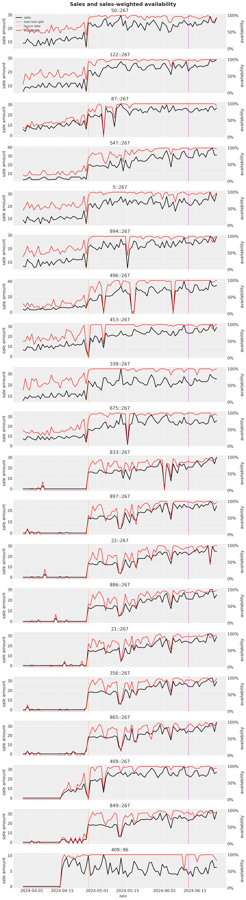
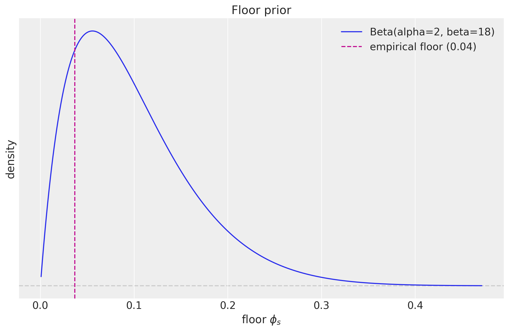
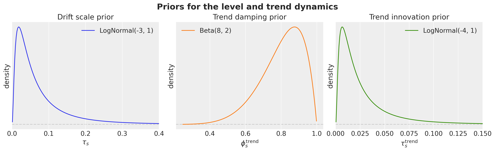
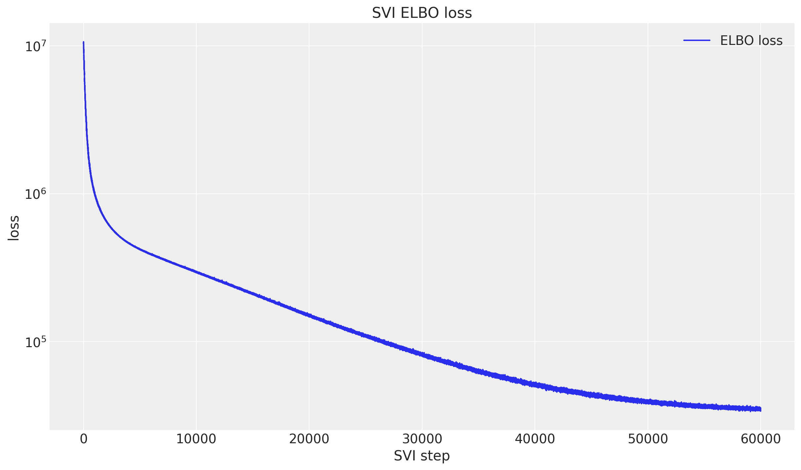
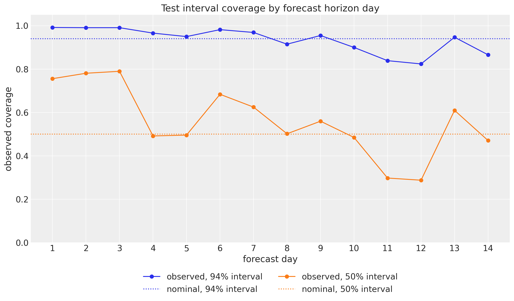
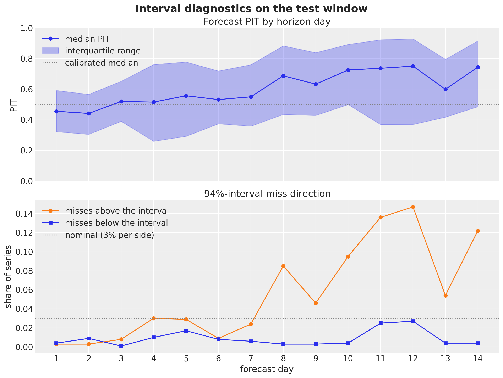
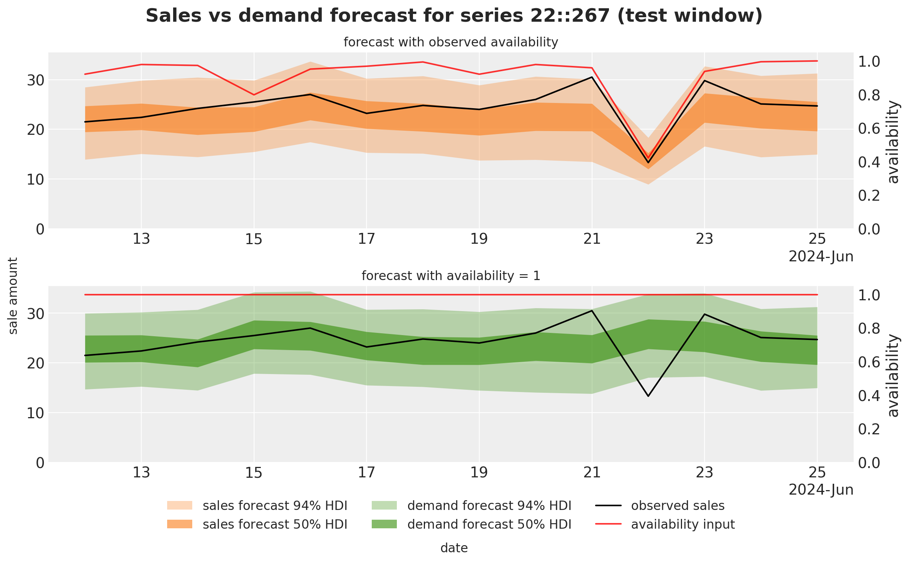
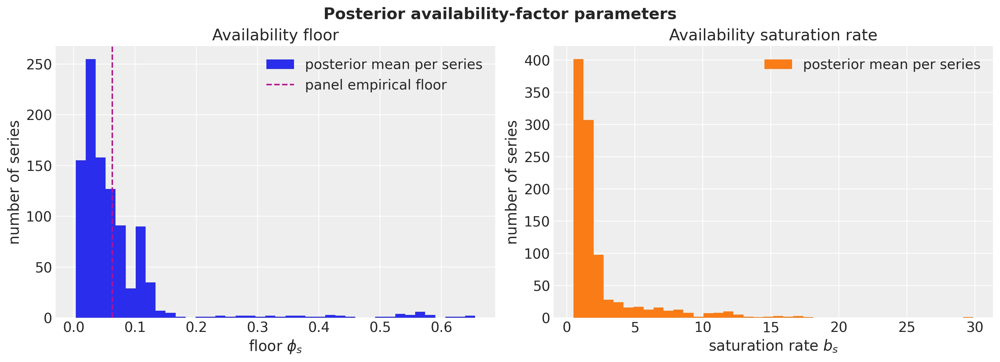
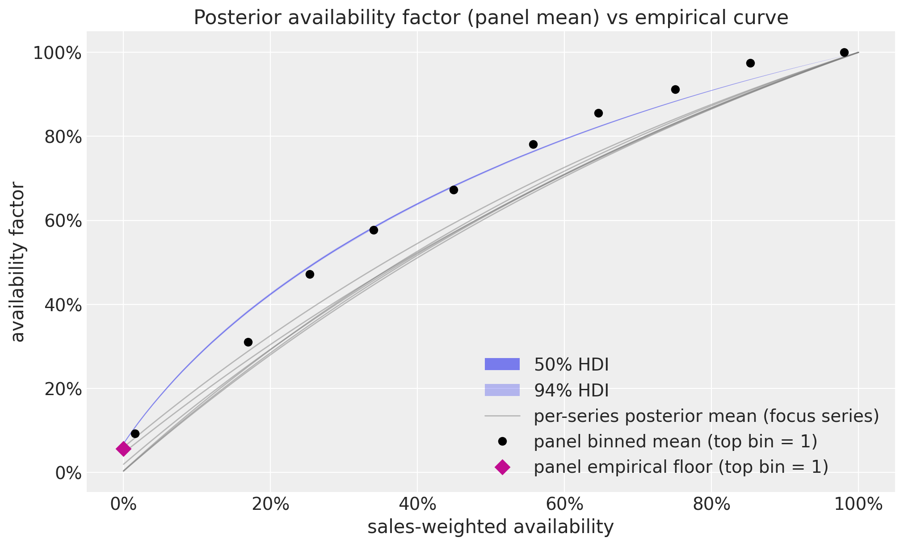
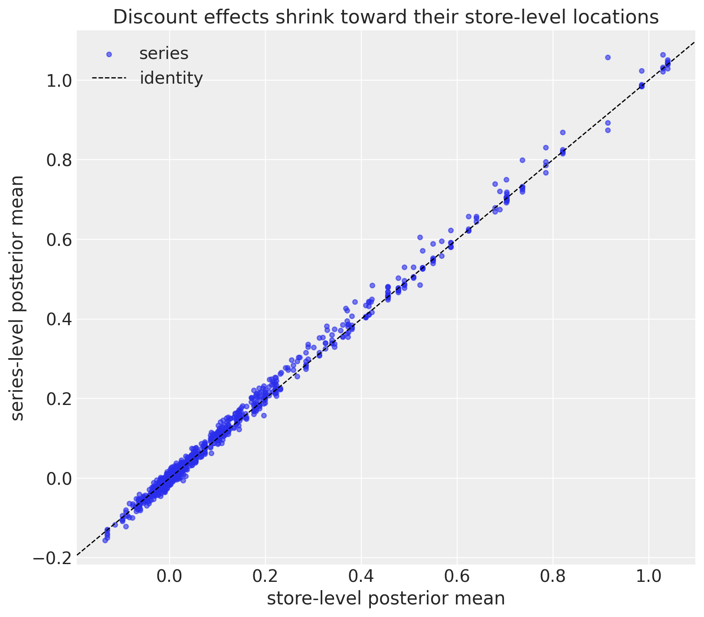

# Forecasting retail demand under stockouts


Forecasting retail demand under stockouts

The [FreshRetailNet-50K](https://huggingface.co/datasets/Dingdong-Inc/FreshRetailNet-50K) dataset ([Yang et al., 2025](https://arxiv.org/abs/2505.16319)) contains \\50{,}000\\ daily store-product demand series from fresh retail operations: \\90\\ days per series, with hourly sales, hourly stockout labels, and promotion, discount, and calendar covariates. The native stockout labels make it a great public benchmark for a classic operational problem: observed sales are a *censored* version of demand, because a store cannot sell what is not on the shelf.

We model this with a **multiplicative availability factor**: expected sales factor into a demand component and an availability component. A forecasting model describes what demand would be with the product fully in stock, and a multiplicative factor, a function of the day's recorded availability with parameters learned from the data, scales that demand down when it was not. In this example the two components are:

- **Forecasting model**: a state space model with a trend, weekly seasonality, and promotion effects.
- **Availability factor**: a saturating function of the day's stock availability.

The rationale is simple: when a product is out of stock, recorded sales say little about demand, and without an explicit correction the forecasting model would misread stockout days as low-demand days. The factorization also pays off at prediction time: because the demand component describes what would sell with the product fully in stock, setting availability to one over the forecast horizon turns the sales forecast into a *demand* forecast, which is the number a planner should order against.

There is a catch, though, and it is the heart of this example: **days whose stockout labels say the product was out of stock all day still record positive sales about \\15\\\\ of the time**. A pure multiplicative factor forces the mean to zero on those days and badly misfits them. The likely reason is that the stockout labels are reconstructed from imperfect inventory snapshots, so they carry noise, a common situation in practice. The model developed in this notebook absorbs the contradiction by learning a *floor* in the availability factor: even at zero recorded availability, a small share of demand can still be sold.

We proceed in four steps. First, an exploratory analysis of the full \\50{,}000\\-series dataset: we look closely at the stockout and availability labels, quantify the contradiction above, and trace it to label noise concentrated in hours that carry almost no demand, which motivates both a *sales-weighted* availability feature and the *learned floor* in the availability factor. Second, we fit a hierarchical state space model to the top \\1{,}000\\ series with SVI and a custom `optax` optimizer, wrapping the results in an ArviZ `DataTree`. Third, we evaluate the forecasts with CRPS and central-interval coverage on a simple train-test split against a seasonal-naive baseline. Fourth, we re-issue the forecast with availability pinned to one over the horizon: a counterfactual estimate of uncensored demand that is deliberately *not* meant to track the observed (censored) sales, and is exactly what a business should plan against, since nobody knows future availability at prediction time. We close by inspecting what the model learned: the fitted availability factor, the store hierarchy, and the promotion contributions.


# Prepare notebook


``` python
from collections.abc import Callable
from typing import Any, cast

import arviz as az
import jax
import jax.numpy as jnp
import matplotlib.dates as mdates
import matplotlib.lines as mlines
import matplotlib.pyplot as plt
import numpy as np
import numpyro
import numpyro.distributions as dist
import optax
import polars as pl
import preliz as pz
import xarray as xr
from huggingface_hub import hf_hub_download
from huggingface_hub import logging as hf_logging
from jax import random
from jaxtyping import Float, Int
from matplotlib import ticker as mtick
from numpyro import handlers
from numpyro.infer import Predictive
from numpyro.infer.reparam import LocScaleReparam
from sklearn.preprocessing import LabelEncoder

from numpyro_forecast import (
    Forecaster,
    ForecastingModel,
    eval_coverage,
    eval_crps,
    predictions_to_datatree,
    to_datatree,
)
from numpyro_forecast.features import periodic_repeat
from numpyro_forecast.functional import draw_posterior, fit_svi, forecast, predict_in_sample
from numpyro_forecast.metrics import crps_empirical
from numpyro_forecast.typing import Array

az.style.use("arviz-darkgrid")
plt.rcParams["figure.figsize"] = [12, 7]
plt.rcParams["figure.dpi"] = 100
plt.rcParams["figure.facecolor"] = "white"

# Render polars tables without truncating string cells, and drop the shape and
# dtype headers, which are noise in a rendered document.
pl.Config.set_fmt_str_lengths(100)
pl.Config.set_tbl_hide_dataframe_shape(True)
pl.Config.set_tbl_hide_column_data_types(True)

# The Hub intermittently sends an unauthenticated-request warning header on
# responses, which huggingface_hub logs to stderr; the example needs no token,
# so keep the rendered document clean.
hf_logging.set_verbosity_error()

numpyro.set_host_device_count(n=4)

rng_key = random.PRNGKey(seed=42)

%load_ext autoreload
%autoreload 2
%load_ext jaxtyping
%jaxtyping.typechecker beartype.beartype
%config InlineBackend.figure_format = "retina"
```


# Read data

We download the training split (a single parquet file, cached locally by `huggingface_hub`) and scan it lazily with polars, so the full-dataset aggregations below stream instead of materializing all \\4.5\\ million rows.


``` python
parquet_path: str = hf_hub_download(
    repo_id="Dingdong-Inc/FreshRetailNet-50K",
    filename="data/train.parquet",
    repo_type="dataset",
)
data_lf: pl.LazyFrame = pl.scan_parquet(parquet_path)

data_lf.collect_schema()
```


    Schema([('city_id', Int64),
            ('store_id', Int64),
            ('management_group_id', Int64),
            ('first_category_id', Int64),
            ('second_category_id', Int64),
            ('third_category_id', Int64),
            ('product_id', Int64),
            ('dt', String),
            ('sale_amount', Float64),
            ('hours_sale', List(Float64)),
            ('stock_hour6_22_cnt', Int32),
            ('hours_stock_status', List(Int64)),
            ('discount', Float64),
            ('holiday_flag', Int32),
            ('activity_flag', Int32),
            ('precpt', Float64),
            ('avg_temperature', Float64),
            ('avg_humidity', Float64),
            ('avg_wind_level', Float64)])


``` python
data_lf.select(
    pl.len().alias("rows"),
    pl.col("city_id").n_unique().alias("cities"),
    pl.col("store_id").n_unique().alias("stores"),
    pl.col("product_id").n_unique().alias("products"),
    pl.struct(["store_id", "product_id"]).n_unique().alias("series"),
    pl.col("dt").min().alias("start_date"),
    pl.col("dt").max().alias("end_date"),
).collect(engine="streaming")
```


| rows    | cities | stores | products | series | start_date   | end_date     |
|---------|--------|--------|----------|--------|--------------|--------------|
| 4500000 | 18     | 898    | 865      | 50000  | "2024-03-28" | "2024-06-25" |


Every one of the \\50{,}000\\ store-product series covers the same \\90\\ days. Three columns drive this notebook:

- `sale_amount` is the daily sales target, and `hours_sale` is its hourly decomposition (it sums to `sale_amount` up to float rounding).
- `hours_stock_status` is a \\24\\-vector of hourly stockout indicators (\\1\\ means out of stock in that hour).
- `stock_hour6_22_cnt` counts stockout hours within the \\6{:}00\\ to \\22{:}00\\ daytime window, so its maximum is \\16\\.

The next cell verifies these conventions directly instead of trusting the documentation.


``` python
data_lf.select(
    (pl.col("hours_sale").list.sum() - pl.col("sale_amount")).abs().max().alias("max_abs_diff"),
    pl.col("hours_stock_status").list.len().max().alias("hours_per_day"),
    pl.col("stock_hour6_22_cnt").max().alias("max_daytime_stockout_hours"),
).collect(engine="streaming")
```


| max_abs_diff | hours_per_day | max_daytime_stockout_hours |
|--------------|---------------|----------------------------|
| 1.4211e-14   | 24            | 16                         |


# Exploratory data analysis

The queries in this section are built from small named polars expression functions, chained with `pipe` for the frame-level steps, so each query reads top to bottom. The expressions defined along the way (stockout hours, scaled sales, the sales-weighted availability) are reused all the way into the modeling panel.


## How prevalent are stockouts?


``` python
def stockout_hours() -> pl.Expr:
    """Count the hours of the day flagged out of stock."""
    return pl.col("hours_stock_status").list.sum()


stockout_hours_df = (
    data_lf.group_by(stockout_hours().alias("stockout_hours"))
    .len()
    .sort("stockout_hours")
    .with_columns((pl.col("len") / pl.col("len").sum()).alias("share_of_days"))
    .collect(engine="streaming")
)

fig, ax = plt.subplots()
ax.bar(
    stockout_hours_df["stockout_hours"],
    stockout_hours_df["share_of_days"],
    color="C0",
    label="share of days",
)
ax.legend(loc="upper right")
ax.yaxis.set_major_formatter(mtick.PercentFormatter(xmax=1, decimals=0))
ax.set(
    xlabel="stockout hours per day",
    ylabel="share of days",
    title="Distribution of daily stockout hours",
);
```


<figure class="figure">
<p></p>
</figure>


The distribution is strongly bimodal: \\40\\\\ of the days have no stockout at all, most of the rest lose a handful of hours, and a visible spike of about \\3.8\\\\ of the days is flagged out of stock for all \\24\\ hours.


## The contradiction: sales on fully out-of-stock days

If the labels were exact, a day flagged out of stock for every hour could not sell anything. Let us check that under both stockout definitions (all \\24\\ hours flagged, and all \\16\\ daytime hours flagged).


``` python
max_daytime_hours = 16


def oos_all_day() -> pl.Expr:
    """Day flagged out of stock for all 24 hours."""
    return stockout_hours() == 24


def oos_daytime() -> pl.Expr:
    """Day flagged out of stock for all 16 daytime (6:00 to 22:00) hours."""
    return pl.col("stock_hour6_22_cnt") == max_daytime_hours


def scaled_sales() -> pl.Expr:
    """Daily sales scaled by the series' own mean, so 1 is an average day."""
    return pl.col("sale_amount") / pl.col("sale_amount").mean().over("store_id", "product_id")


def share_positive_sales_when(flag: pl.Expr) -> pl.Expr:
    """Share of days with positive sales among the days where ``flag`` holds."""
    return (pl.col("sale_amount") > 0).filter(flag).mean()


data_lf.select(
    oos_all_day().mean().alias("share_days_oos_all_day"),
    oos_daytime().mean().alias("share_days_oos_daytime"),
    share_positive_sales_when(oos_all_day()).alias("p_sales_oos_all_day"),
    share_positive_sales_when(oos_daytime()).alias("p_sales_oos_daytime"),
    scaled_sales()
    .filter(oos_all_day() & (pl.col("sale_amount") > 0))
    .mean()
    .alias("relative_sales_when_positive"),
).collect(engine="streaming")
```


| share_days_oos_all_day | share_days_oos_daytime | p_sales_oos_all_day | p_sales_oos_daytime | relative_sales_when_positive |
|----|----|----|----|----|
| 0.037937 | 0.040398 | 0.147589 | 0.185631 | 0.248096 |


About \\15\\\\ of the all-day stockout days (and \\19\\\\ of the daytime ones) still record positive sales, and when they do the amount is not negligible: about a quarter of the series' average daily sales. Plausible mechanisms are stockout labels reconstructed from inventory snapshots, a sell-out followed by a restock within the same hour, or back-room stock that never registered on the shelf system. Whatever the cause, the labels are noisy, and a model that pins the mean at zero whenever recorded availability is zero is misspecified.


## When do sales and stockouts happen within the day?

The hourly decomposition tells us how much each flagged hour actually matters for daily demand.


``` python
def total_sales_in_hour(hour: int) -> pl.Expr:
    """Total sales recorded in one hour of the day, over the full dataset."""
    return pl.col("hours_sale").list.get(hour).sum()


def stockout_rate_in_hour(hour: int) -> pl.Expr:
    """Share of days flagged out of stock in one hour of the day."""
    return pl.col("hours_stock_status").list.get(hour).mean()


hourly_row = (
    data_lf.select(
        *[total_sales_in_hour(h).alias(f"sales_{h}") for h in range(24)],
        *[stockout_rate_in_hour(h).alias(f"oos_{h}") for h in range(24)],
    )
    .collect(engine="streaming")
    .row(0)
)
sales_by_hour = np.asarray(hourly_row[:24], dtype=np.float64)
stockout_rate_by_hour = np.asarray(hourly_row[24:], dtype=np.float64)
hourly_weights = sales_by_hour / sales_by_hour.sum()

fig, ax = plt.subplots()
ax.bar(np.arange(24), hourly_weights, color="C0", alpha=0.8, label="share of daily sales")
ax_twin = ax.twinx()
ax_twin.plot(
    np.arange(24),
    stockout_rate_by_hour,
    color="C1",
    marker="o",
    markersize=8,
    linewidth=2,
    label="stockout rate",
)
ax_twin.grid(False)
ax_twin.set(ylabel="stockout rate", ylim=(0, 0.5))
handles, bar_labels = ax.get_legend_handles_labels()
handles_twin, labels_twin = ax_twin.get_legend_handles_labels()
ax.legend(handles + handles_twin, bar_labels + labels_twin, loc="upper left")
ax.yaxis.set_major_formatter(mtick.PercentFormatter(xmax=1, decimals=0))
ax_twin.yaxis.set_major_formatter(mtick.PercentFormatter(xmax=1, decimals=0))
ax.set(
    xlabel="hour of day",
    ylabel="share of daily sales",
    title="Hourly sales profile vs hourly stockout rate",
)
print(f"share of sales in the 6:00 to 22:00 window: {hourly_weights[6:22].sum():.1%}")
print(
    f"peak hourly stockout rate: {stockout_rate_by_hour.max():.1%} "
    f"(hour {int(stockout_rate_by_hour.argmax())})"
)
```


    share of sales in the 6:00 to 22:00 window: 95.2%
    peak hourly stockout rate: 41.9% (hour 22)


<figure class="figure">
<p></p>
</figure>


The two curves are almost mirror images: sales concentrate between \\7{:}00\\ and \\20{:}00\\ (\\95\\\\ of all sales fall in the \\6{:}00\\ to \\22{:}00\\ window), while the stockout rate peaks at \\42\\\\ late at night, exactly when nobody is buying. A raw \\24\\-hour stockout count therefore heavily over-penalizes availability. We can also measure the label noise directly: how much of the total sales volume is recorded in hours that are flagged out of stock?


``` python
def sales_in_flagged_hours() -> pl.Expr:
    """Sales volume recorded in the hours whose own stockout flag is set."""
    return pl.sum_horizontal(
        [
            (pl.col("hours_sale").list.get(h) * pl.col("hours_stock_status").list.get(h))
            for h in range(24)
        ]
    )


data_lf.select(
    (sales_in_flagged_hours().sum() / pl.col("hours_sale").list.sum().sum()).alias(
        "share_of_sales_in_flagged_stockout_hours"
    )
).collect(engine="streaming")
```


| share_of_sales_in_flagged_stockout_hours |
|------------------------------------------|
| 0.025131                                 |


\\2.5\\\\ of *all* sales happen in hours the labels declare out of stock. This is direct, hour-level evidence that the stockout signal has noise that no availability feature can remove, and it is why the model below learns a floor instead of trusting availability zero to mean demand zero.


## A sales-weighted availability feature

Instead of counting stockout hours uniformly, we weight each hour by its share of global sales, so that losing a night hour costs almost nothing and losing the morning peak costs a lot:

\\\begin{align\*} a\_{t,s} &= \sum\_{h=0}^{23} w_h \left(1 - \text{stockout}\_{t,s,h}\right), \\ w_h &= \frac{\text{total sales in hour } h}{\text{total sales}}. \end{align\*}\\

One note on hygiene: the weights \\w_h\\ are a global hour-of-day profile computed over the full dataset, test window included, whereas a deployed system would compute them on history only. We keep the dataset-wide profile for simplicity; the effect of \\14\\ extra days on a fixed \\24\\-number profile is negligible, and the availability feature itself is treated as a known future input in the retrospective evaluation set up below anyway.


``` python
def sales_weighted_availability(weights: Float[np.ndarray, " hours"]) -> pl.Expr:
    """In-stock share of the day, weighting each hour by its share of global sales."""
    return pl.sum_horizontal(
        [(1 - pl.col("hours_stock_status").list.get(h)) * float(weights[h]) for h in range(24)]
    ).alias("availability")


def zero_availability_summary(
    lf: pl.LazyFrame, zero_flag: pl.Expr, definition: str
) -> pl.LazyFrame:
    """Summarize the zero-availability days implied by one stockout definition."""
    return lf.select(
        pl.lit(definition).alias("definition"),
        zero_flag.mean().alias("share_days_zero_availability"),
        share_positive_sales_when(zero_flag).alias("p_positive_sales_given_zero"),
    )


availability_expr: pl.Expr = sales_weighted_availability(hourly_weights)

pl.concat(
    [
        data_lf.pipe(zero_availability_summary, oos_daytime(), "daytime hours all flagged"),
        data_lf.pipe(zero_availability_summary, oos_all_day(), "all 24 hours flagged"),
        data_lf.pipe(
            zero_availability_summary, availability_expr == 0, "sales-weighted availability = 0"
        ),
    ]
).collect(engine="streaming")
```


| definition | share_days_zero_availability | p_positive_sales_given_zero |
|----|----|----|
| "daytime hours all flagged" | 0.040398 | 0.185631 |
| "all 24 hours flagged" | 0.037937 | 0.147589 |
| "sales-weighted availability = 0" | 0.037937 | 0.147589 |


Two remarks on this table. First, because every hour carries a positive share of global sales, the weighted availability is exactly zero only when all \\24\\ hours are flagged: its zero set coincides with the all-day definition by construction, and it inherits that definition's lower \\15\\\\ contradiction rate. The daytime definition's hard zero is both noisier (\\19\\\\) and cruder, since it also zeroes out days that were merely stocked overnight; under the weighted feature those days keep a tiny positive \\a\_{t,s}\\ instead. Second, the feature's real contribution lies between the extremes: it grades partial days by how much *selling time* they lose, so a lost night hour costs almost nothing and a lost morning-peak hour costs a lot. The \\15\\\\ that remains at exact zero is irreducible label noise, and the model handles it with a learned floor rather than a data transformation.


## The empirical demand-availability curve

How do sales respond to partial availability? We scale each series by its own mean (so different volumes are comparable) and bin the scaled sales by weighted availability.


``` python
def availability_bin() -> pl.Expr:
    """Decile bin (0 to 9) of the sales-weighted availability."""
    return (pl.col("availability") * 10).floor().clip(0, 9).alias("availability_bin")


def mean_scaled_sales_by_availability_bin(lf: pl.LazyFrame) -> pl.LazyFrame:
    """Bin the days by availability and average the scaled sales within each bin."""
    return (
        lf.group_by(availability_bin())
        .agg(
            pl.col("availability").mean().alias("mean_availability"),
            pl.col("scaled_sales").mean().alias("mean_scaled_sales"),
            pl.len().alias("days"),
        )
        .sort("availability_bin")
    )


def mean_scaled_sales_at_zero_availability(lf: pl.LazyFrame) -> pl.LazyFrame:
    """Average the scaled sales over the days with zero sales-weighted availability."""
    return lf.filter(pl.col("availability") == 0).select(
        pl.col("scaled_sales").mean().alias("mean_scaled_sales"),
        pl.len().alias("days"),
    )


availability_sales_lf = data_lf.with_columns(
    availability_expr, scaled_sales().alias("scaled_sales")
)
factor_curve_df = availability_sales_lf.pipe(mean_scaled_sales_by_availability_bin).collect(
    engine="streaming"
)
empirical_floor_df = availability_sales_lf.pipe(mean_scaled_sales_at_zero_availability).collect(
    engine="streaming"
)
empirical_floor = float(empirical_floor_df["mean_scaled_sales"][0])

fig, ax = plt.subplots()
ax.plot(
    factor_curve_df["mean_availability"],
    factor_curve_df["mean_scaled_sales"],
    "o-",
    color="C0",
    label="binned mean",
)
ax.plot(0.0, empirical_floor, "D", color="C3", markersize=8, label="mean at availability = 0")
ax.axhline(1.0, color="gray", linestyle=":", linewidth=1, label="series average")
ax.legend(loc="lower right")
ax.set(
    xlabel="sales-weighted availability",
    ylabel="scaled sales (series mean = 1)",
    title="Scaled sales vs sales-weighted availability (full dataset)",
)
print(f"empirical floor at zero availability: {empirical_floor:.3f}")
```


    empirical floor at zero availability: 0.037


<figure class="figure">
<p></p>
</figure>


The curve is saturating, exactly the shape a multiplicative factor should have: steep gains at low availability, flattening out near full availability. Two details matter for the model. First, the value at zero availability is positive (about \\0.04\\), which is the empirical floor the factor must reproduce. Second, the bins just below full availability sit slightly *above* the fully-available bin. That is endogeneity, not magic: stockouts happen disproportionately on high-demand days (a sell-out is itself evidence of demand), so a naive read of this curve overstates what availability alone does. The model mitigates this by attributing day-to-day variation to the trend, weekly seasonality, and promotion covariates jointly with the factor.


## Promotion and calendar covariates

We encode the discount as `discount_magnitude = 1 - discount`, so zero means no discount and larger values mean deeper discounts (a positive coefficient then reads "more discount, more sales").


``` python
def raw_discount_magnitude() -> pl.Expr:
    """Depth of the discount read literally from the raw column: 1 - discount."""
    return 1 - pl.col("discount")


def mean_scaled_sales_when(flag: str, active: bool) -> pl.Expr:
    """Mean scaled sales over the days where a 0/1 flag column is (in)active."""
    prefix = "scaled" if active else "scaled_no"
    name = flag.removesuffix("_flag")
    return scaled_sales().filter(pl.col(flag) == int(active)).mean().alias(f"{prefix}_{name}")


data_lf.select(
    raw_discount_magnitude().mean().alias("mean_discount_magnitude"),
    (raw_discount_magnitude() > 0).mean().alias("share_days_discounted"),
    (pl.col("discount") == 0).mean().alias("share_days_discount_zero"),
    pl.col("activity_flag").mean().alias("share_days_activity"),
    pl.col("holiday_flag").mean().alias("share_days_holiday"),
    mean_scaled_sales_when("activity_flag", active=True),
    mean_scaled_sales_when("activity_flag", active=False),
    mean_scaled_sales_when("holiday_flag", active=True),
    mean_scaled_sales_when("holiday_flag", active=False),
).unpivot().collect(engine="streaming")
```


| variable                   | value    |
|----------------------------|----------|
| "mean_discount_magnitude"  | 0.088859 |
| "share_days_discounted"    | 0.515299 |
| "share_days_discount_zero" | 0.003564 |
| "share_days_activity"      | 0.378421 |
| "share_days_holiday"       | 0.344444 |
| "scaled_activity"          | 1.113655 |
| "scaled_no_activity"       | 0.930806 |
| "scaled_holiday"           | 1.147654 |
| "scaled_no_holiday"        | 0.922419 |


Discounts are common (about half of all days, with a mean magnitude near \\9\\\\), promotion activity lifts scaled sales by roughly \\20\\\\ on average, and holidays by roughly a quarter. All three are worth including as regression covariates, with effects pooled hierarchically by store. One anomaly to keep in mind: a small share of days (\\0.4\\\\ dataset-wide) records `discount = 0`, which read literally would be a \\100\\\\ discount and is far more plausibly an unpriced placeholder; it looks negligible here, but we will meet it again in the modeling panel, where it turns out to be concentrated in exactly the series we model.


# Build the modeling panel

We model the top \\1{,}000\\ series by total sales over the training window: ranking on the full window would let test-period spikes decide which series get modeled and scored, the same class of leak the scaling discussion below is careful to keep out of the fold. The last \\14\\ days are held out as a test set; the model trains on the first \\76\\ days and receives the *actual* covariates (availability, discount, promotion, holiday, launch indicator) over the forecast window, which is the standard retrospective evaluation setup.

Getting from the long dataframe to model-ready arrays is worth doing carefully, because every shape convention we set here is relied on by the model and by the ArviZ export. We proceed in five steps: pivot the long panel into dense `(time, series)` arrays, scale each series by its own training mean, build the integer store index that drives the hierarchical pooling, add the panel-wide launch indicator, and stack all exogenous inputs into a single tensor with named axes.

One data decision happens right in the panel build: the placeholder `discount = 0` days flagged in the EDA are encoded as *no discount* (and the handful of `discount > 1` artifacts are clipped). The feature itself stays in the model; the encoding fix is what makes its coefficient read as a genuine discount effect rather than a data-gap indicator, and the promotion plot further below shows why that matters for this panel.


``` python
n_series_panel = 1_000
t_train = 76
horizon = 14


def top_series_by_total_sales(lf: pl.LazyFrame, n: int) -> pl.LazyFrame:
    """Rank the series by total sales over the window and keep the top ``n``."""
    return (
        lf.group_by("store_id", "product_id")
        .agg(pl.col("sale_amount").sum().alias("total_sales"))
        .sort("total_sales", descending=True)
        .head(n)
    )


def keep_top_series(lf: pl.LazyFrame, top_series: pl.DataFrame) -> pl.LazyFrame:
    """Keep only the rows belonging to the selected store-product series."""
    return lf.join(
        top_series.lazy().select("store_id", "product_id"), on=["store_id", "product_id"]
    )


def series_unique_id() -> pl.Expr:
    """Store-product identifier ``store::product`` naming each series."""
    return pl.concat_str(["store_id", "product_id"], separator="::").alias("unique_id")


def cleaned_discount_magnitude() -> pl.Expr:
    """Discount depth with the placeholder days encoded as no discount.

    ``discount == 0`` records are unpriced placeholders (not free giveaways), so
    they map to zero magnitude; values above 1 are clipped artifacts.
    """
    return (
        pl.when(pl.col("discount") > 0)
        .then(raw_discount_magnitude().clip(0.0, 1.0))
        .otherwise(0.0)
        .alias("discount_magnitude")
    )


# Rank on the training window only: the modeled panel must be chosen before
# observing the test window, the same fold discipline the per-series scale
# gets in the scaling section below.
in_train_window = pl.col("dt").str.to_date() < (
    pl.col("dt").str.to_date().min() + pl.duration(days=t_train)
)
top_series_df = (
    data_lf.filter(in_train_window)
    .pipe(top_series_by_total_sales, n_series_panel)
    .collect(engine="streaming")
)

panel_df = (
    data_lf.pipe(keep_top_series, top_series_df)
    .with_columns(
        pl.col("dt").str.to_date(),
        series_unique_id(),
        availability_expr,
        cleaned_discount_magnitude(),
    )
    .select(
        "dt",
        "unique_id",
        "store_id",
        "sale_amount",
        "availability",
        "discount_magnitude",
        pl.col("activity_flag").cast(pl.Float64),
        pl.col("holiday_flag").cast(pl.Float64),
    )
    .collect(engine="streaming")
    .sort("unique_id", "dt")
)

series_ids: list[str] = panel_df["unique_id"].unique().sort().to_list()
n_series = len(series_ids)
dates_series = panel_df["dt"].unique().sort()
dates = dates_series.to_numpy()

panel_df.head()
```


| dt | unique_id | store_id | sale_amount | availability | discount_magnitude | activity_flag | holiday_flag |
|----|----|----|----|----|----|----|----|
| 2024-03-28 | "0::117" | 0 | 0.3 | 0.0 | 0.0 | 0.0 | 0.0 |
| 2024-03-29 | "0::117" | 0 | 5.0 | 0.968539 | 0.0 | 0.0 | 0.0 |
| 2024-03-30 | "0::117" | 0 | 6.6 | 1.0 | 0.0 | 0.0 | 1.0 |
| 2024-03-31 | "0::117" | 0 | 8.0 | 1.0 | 0.0 | 0.0 | 1.0 |
| 2024-04-01 | "0::117" | 0 | 0.5 | 0.122896 | 0.0 | 0.0 | 0.0 |


## From long panel to a named dataset

The package convention places time at axis \\-2\\ and the observation (series) axis last, so the data panel is a dense `(time, n_series)` matrix. `make_pivot` builds one such matrix per column, always selecting the columns in `series_ids` order: that single sorted list defines the series axis *everywhere* (data, covariates, store index, ArviZ coordinates), so column \\s\\ refers to the same store-product pair in every array that follows. The function also validates the result, one row per date, one column per series, and no missing entries, so a silent join or pivot problem fails loudly here instead of corrupting the fit later.

The pivots themselves go straight into an `xarray.Dataset` with named `time` and `series` coordinates, and that dataset is the source of truth for everything downstream: selections read by label (`panel_ds["sale_amount"].sel(series="22::267")`) instead of positional index bookkeeping, reductions name their axis (`.mean("time")`), and the plain `jax.numpy` arrays the model consumes are extracted from it at the model boundary.


``` python
def make_pivot(value: str) -> Float[np.ndarray, " duration n_series"]:
    """Build the dense (date x series) matrix of one panel column.

    Columns follow ``series_ids`` order so every pivot shares the same series axis.
    """
    pivot_df = panel_df.pivot(index="dt", on="unique_id", values=value).sort("dt")
    matrix = pivot_df.select(series_ids).to_numpy().astype(np.float64)
    if matrix.shape != (len(dates), n_series) or np.isnan(matrix).any():
        msg = f"Unexpected pivot for {value!r}: shape {matrix.shape}"
        raise ValueError(msg)
    return matrix


panel_ds: xr.Dataset = xr.Dataset(
    {
        name: (("time", "series"), make_pivot(name))
        for name in [
            "sale_amount",
            "availability",
            "discount_magnitude",
            "activity_flag",
            "holiday_flag",
        ]
    },
    coords={"time": dates, "series": series_ids},
)

panel_ds
```


![](data:image/svg+xml;base64,PHN2ZyBzdHlsZT0icG9zaXRpb246IGFic29sdXRlOyB3aWR0aDogMDsgaGVpZ2h0OiAwOyBvdmVyZmxvdzogaGlkZGVuIj4KPGRlZnM+CjxzeW1ib2wgaWQ9Imljb24tZGF0YWJhc2UiIHZpZXdib3g9IjAgMCAzMiAzMiI+CjxwYXRoIGQ9Ik0xNiAwYy04LjgzNyAwLTE2IDIuMjM5LTE2IDV2NGMwIDIuNzYxIDcuMTYzIDUgMTYgNXMxNi0yLjIzOSAxNi01di00YzAtMi43NjEtNy4xNjMtNS0xNi01eiIgLz4KPHBhdGggZD0iTTE2IDE3Yy04LjgzNyAwLTE2LTIuMjM5LTE2LTV2NmMwIDIuNzYxIDcuMTYzIDUgMTYgNXMxNi0yLjIzOSAxNi01di02YzAgMi43NjEtNy4xNjMgNS0xNiA1eiIgLz4KPHBhdGggZD0iTTE2IDI2Yy04LjgzNyAwLTE2LTIuMjM5LTE2LTV2NmMwIDIuNzYxIDcuMTYzIDUgMTYgNXMxNi0yLjIzOSAxNi01di02YzAgMi43NjEtNy4xNjMgNS0xNiA1eiIgLz4KPC9zeW1ib2w+CjxzeW1ib2wgaWQ9Imljb24tZmlsZS10ZXh0MiIgdmlld2JveD0iMCAwIDMyIDMyIj4KPHBhdGggZD0iTTI4LjY4MSA3LjE1OWMtMC42OTQtMC45NDctMS42NjItMi4wNTMtMi43MjQtMy4xMTZzLTIuMTY5LTIuMDMwLTMuMTE2LTIuNzI0Yy0xLjYxMi0xLjE4Mi0yLjM5My0xLjMxOS0yLjg0MS0xLjMxOWgtMTUuNWMtMS4zNzggMC0yLjUgMS4xMjEtMi41IDIuNXYyN2MwIDEuMzc4IDEuMTIyIDIuNSAyLjUgMi41aDIzYzEuMzc4IDAgMi41LTEuMTIyIDIuNS0yLjV2LTE5LjVjMC0wLjQ0OC0wLjEzNy0xLjIzLTEuMzE5LTIuODQxek0yNC41NDMgNS40NTdjMC45NTkgMC45NTkgMS43MTIgMS44MjUgMi4yNjggMi41NDNoLTQuODExdi00LjgxMWMwLjcxOCAwLjU1NiAxLjU4NCAxLjMwOSAyLjU0MyAyLjI2OHpNMjggMjkuNWMwIDAuMjcxLTAuMjI5IDAuNS0wLjUgMC41aC0yM2MtMC4yNzEgMC0wLjUtMC4yMjktMC41LTAuNXYtMjdjMC0wLjI3MSAwLjIyOS0wLjUgMC41LTAuNSAwIDAgMTUuNDk5LTAgMTUuNSAwdjdjMCAwLjU1MiAwLjQ0OCAxIDEgMWg3djE5LjV6IiAvPgo8cGF0aCBkPSJNMjMgMjZoLTE0Yy0wLjU1MiAwLTEtMC40NDgtMS0xczAuNDQ4LTEgMS0xaDE0YzAuNTUyIDAgMSAwLjQ0OCAxIDFzLTAuNDQ4IDEtMSAxeiIgLz4KPHBhdGggZD0iTTIzIDIyaC0xNGMtMC41NTIgMC0xLTAuNDQ4LTEtMXMwLjQ0OC0xIDEtMWgxNGMwLjU1MiAwIDEgMC40NDggMSAxcy0wLjQ0OCAxLTEgMXoiIC8+CjxwYXRoIGQ9Ik0yMyAxOGgtMTRjLTAuNTUyIDAtMS0wLjQ0OC0xLTFzMC40NDgtMSAxLTFoMTRjMC41NTIgMCAxIDAuNDQ4IDEgMXMtMC40NDggMS0xIDF6IiAvPgo8L3N5bWJvbD4KPC9kZWZzPgo8L3N2Zz4=)

``` xr-text-repr-fallback
<xarray.Dataset> Size: 4MB
Dimensions:             (time: 90, series: 1000)
Coordinates:
  * time                (time) datetime64[s] 720B 2024-03-28 ... 2024-06-25
  * series              (series) <U8 32kB '0::117' '0::691' ... '99::589' '9::4'
Data variables:
    sale_amount         (time, series) float64 720kB 0.3 3.5 5.1 ... 13.7 1.7
    availability        (time, series) float64 720kB 0.0 0.8421 ... 0.899 0.6361
    discount_magnitude  (time, series) float64 720kB 0.0 0.0 0.0 ... 0.0 0.059
    activity_flag       (time, series) float64 720kB 0.0 0.0 0.0 ... 0.0 0.0 0.0
    holiday_flag        (time, series) float64 720kB 0.0 0.0 0.0 ... 0.0 0.0 0.0
```


xarray.Dataset


Dimensions:


- time: 90
- series: 1000


Coordinates: (2)


time


(time)


datetime64\[s\]


2024-03-28 ... 2024-06-25


    array(['2024-03-28T00:00:00', '2024-03-29T00:00:00', '2024-03-30T00:00:00',
           '2024-03-31T00:00:00', '2024-04-01T00:00:00', '2024-04-02T00:00:00',
           '2024-04-03T00:00:00', '2024-04-04T00:00:00', '2024-04-05T00:00:00',
           '2024-04-06T00:00:00', '2024-04-07T00:00:00', '2024-04-08T00:00:00',
           '2024-04-09T00:00:00', '2024-04-10T00:00:00', '2024-04-11T00:00:00',
           '2024-04-12T00:00:00', '2024-04-13T00:00:00', '2024-04-14T00:00:00',
           '2024-04-15T00:00:00', '2024-04-16T00:00:00', '2024-04-17T00:00:00',
           '2024-04-18T00:00:00', '2024-04-19T00:00:00', '2024-04-20T00:00:00',
           '2024-04-21T00:00:00', '2024-04-22T00:00:00', '2024-04-23T00:00:00',
           '2024-04-24T00:00:00', '2024-04-25T00:00:00', '2024-04-26T00:00:00',
           '2024-04-27T00:00:00', '2024-04-28T00:00:00', '2024-04-29T00:00:00',
           '2024-04-30T00:00:00', '2024-05-01T00:00:00', '2024-05-02T00:00:00',
           '2024-05-03T00:00:00', '2024-05-04T00:00:00', '2024-05-05T00:00:00',
           '2024-05-06T00:00:00', '2024-05-07T00:00:00', '2024-05-08T00:00:00',
           '2024-05-09T00:00:00', '2024-05-10T00:00:00', '2024-05-11T00:00:00',
           '2024-05-12T00:00:00', '2024-05-13T00:00:00', '2024-05-14T00:00:00',
           '2024-05-15T00:00:00', '2024-05-16T00:00:00', '2024-05-17T00:00:00',
           '2024-05-18T00:00:00', '2024-05-19T00:00:00', '2024-05-20T00:00:00',
           '2024-05-21T00:00:00', '2024-05-22T00:00:00', '2024-05-23T00:00:00',
           '2024-05-24T00:00:00', '2024-05-25T00:00:00', '2024-05-26T00:00:00',
           '2024-05-27T00:00:00', '2024-05-28T00:00:00', '2024-05-29T00:00:00',
           '2024-05-30T00:00:00', '2024-05-31T00:00:00', '2024-06-01T00:00:00',
           '2024-06-02T00:00:00', '2024-06-03T00:00:00', '2024-06-04T00:00:00',
           '2024-06-05T00:00:00', '2024-06-06T00:00:00', '2024-06-07T00:00:00',
           '2024-06-08T00:00:00', '2024-06-09T00:00:00', '2024-06-10T00:00:00',
           '2024-06-11T00:00:00', '2024-06-12T00:00:00', '2024-06-13T00:00:00',
           '2024-06-14T00:00:00', '2024-06-15T00:00:00', '2024-06-16T00:00:00',
           '2024-06-17T00:00:00', '2024-06-18T00:00:00', '2024-06-19T00:00:00',
           '2024-06-20T00:00:00', '2024-06-21T00:00:00', '2024-06-22T00:00:00',
           '2024-06-23T00:00:00', '2024-06-24T00:00:00', '2024-06-25T00:00:00'],
          dtype='datetime64[s]')


series


(series)


\<U8


'0::117' '0::691' ... '9::4'


    array(['0::117', '0::691', '0::70', ..., '98::267', '99::589', '9::4'],
          shape=(1000,), dtype='<U8')


Data variables: (5)


sale_amount


(time, series)


float64


0.3 3.5 5.1 3.6 ... 32.7 13.7 1.7


    array([[ 0.3,  3.5,  5.1, ...,  3. ,  5.8,  1.5],
           [ 5. ,  4.9,  2.7, ...,  3. ,  5.9,  2.4],
           [ 6.6,  6.6,  6.6, ...,  3. ,  9.2,  6.8],
           ...,
           [ 6.2,  6.1,  5.1, ..., 33.2, 15. ,  4.2],
           [ 4.8,  6.4,  5. , ..., 24.1, 11.2,  2. ],
           [ 5.1,  6.2,  5.4, ..., 32.7, 13.7,  1.7]], shape=(90, 1000))


availability


(time, series)


float64


0.0 0.8421 0.9677 ... 0.899 0.6361


    array([[0.        , 0.84214031, 0.96773072, ..., 0.30402569, 0.72536543,
            0.30627405],
           [0.96853881, 0.95190416, 0.96853881, ..., 0.18424695, 0.58969883,
            0.40329786],
           [1.        , 0.96853881, 1.        , ..., 0.0914353 , 0.56669943,
            0.47482856],
           ...,
           [0.8736015 , 0.68842766, 0.55782077, ..., 0.91093046, 0.85230857,
            1.        ],
           [0.98133034, 0.98357871, 0.92597036, ..., 0.79323237, 0.89900624,
            0.73382722],
           [1.        , 1.        , 0.97870707, ..., 0.97870707, 0.89900624,
            0.6360862 ]], shape=(90, 1000))


discount_magnitude


(time, series)


float64


0.0 0.0 0.0 0.0 ... 0.0 0.0 0.059


    array([[0.   , 0.   , 0.   , ..., 0.   , 0.   , 0.118],
           [0.   , 0.   , 0.   , ..., 0.   , 0.   , 0.118],
           [0.   , 0.003, 0.   , ..., 0.   , 0.   , 0.118],
           ...,
           [0.   , 0.174, 0.   , ..., 0.   , 0.   , 0.084],
           [0.   , 0.172, 0.   , ..., 0.   , 0.   , 0.064],
           [0.   , 0.232, 0.   , ..., 0.   , 0.   , 0.059]], shape=(90, 1000))


activity_flag


(time, series)


float64


0.0 0.0 0.0 0.0 ... 0.0 0.0 0.0 0.0


    array([[0., 0., 0., ..., 0., 0., 1.],
           [0., 0., 0., ..., 0., 0., 1.],
           [0., 0., 0., ..., 0., 0., 1.],
           ...,
           [0., 1., 0., ..., 0., 0., 0.],
           [0., 1., 0., ..., 0., 0., 0.],
           [0., 1., 1., ..., 0., 0., 0.]], shape=(90, 1000))


holiday_flag


(time, series)


float64


0.0 0.0 0.0 0.0 ... 0.0 0.0 0.0 0.0


    array([[0., 0., 0., ..., 0., 0., 0.],
           [0., 0., 0., ..., 0., 0., 0.],
           [1., 1., 1., ..., 1., 1., 1.],
           ...,
           [1., 1., 1., ..., 1., 1., 1.],
           [0., 0., 0., ..., 0., 0., 0.],
           [0., 0., 0., ..., 0., 0., 0.]], shape=(90, 1000))


## Per-series scaling

The panel mixes products that sell a handful of units per day with products that sell dozens. A single set of priors cannot cover both on the raw scale: an initial-level prior like \\\text{Normal}(1, 0.5)\\ would be far too tight for one series and far too wide for another. Dividing each series by its own mean daily sales puts every series on a common unit scale, where \\1\\ means "an average day for this product", and one prior vocabulary works across the whole panel (\\\text{Normal}(1, 0.5)\\ is then exactly the prior the model places on the scaled initial level). Two details matter:

- The scale is computed on the **training window only**. Computing it on the full series would leak the held-out level into the model input; the effect is mild on this dataset but catastrophic whenever the test window carries a trend.
- The scale is also the inverse map for evaluation: the model's draws live on the scaled axis, and we multiply them by `scale` to score and plot in original sale units.


``` python
scale: xr.DataArray = panel_ds["sale_amount"].isel(time=slice(None, t_train)).mean("time")
y_scaled: xr.DataArray = panel_ds["sale_amount"] / scale
y_train: Float[Array, " t_train n_series"] = jnp.asarray(
    y_scaled.isel(time=slice(None, t_train)).to_numpy(), dtype=jnp.float32
)
y_train_original: Float[Array, " t_train n_series"] = jnp.asarray(
    panel_ds["sale_amount"].isel(time=slice(None, t_train)).to_numpy(), dtype=jnp.float32
)
y_test_original: Float[Array, " horizon n_series"] = jnp.asarray(
    panel_ds["sale_amount"].isel(time=slice(t_train, None)).to_numpy(), dtype=jnp.float32
)
scale_jax: Float[Array, " n_series"] = jnp.asarray(scale.to_numpy(), dtype=jnp.float32)

print(
    f"sale units per scaled unit: min {float(scale.min()):.2f} | "
    f"median {float(scale.median()):.2f} | max {float(scale.max()):.2f}"
)
```


    sale units per scaled unit: min 3.96 | median 4.95 | max 18.10


## The store index `series_to_store`

The covariate effects \\\beta\_{c,s}\\ are pooled by store: series from the same store share a store-level location and scale. To express that inside the model we need a lookup from the series axis to the store axis, and that is exactly what `series_to_store` is: an integer vector with one entry per series, `series_to_store[s] = m(s)`, aligned with the same sorted `series_ids` order as every pivot (both come from sorting by `unique_id`). We build it with scikit-learn's `LabelEncoder`, which consumes the polars column directly: `fit_transform` maps each store id to its position among the sorted unique ids, and the fitted `classes_` are exactly those sorted ids, so the same encoder yields both the integer index the model gathers with and the `store` coordinate labels the ArviZ export uses below. Inside the model, the advanced indexing `b_loc_store[:, series_to_store]` gathers the `(n_cov, n_stores)` store-level parameters into an `(n_cov, n_series)` array of per-series prior locations, a vectorized dictionary lookup. The jaxtyping annotation records the contract in the code: one integer per series.

The printout below carries a caveat worth keeping in mind: the panel spreads its \\1{,}000\\ series over \\525\\ stores with a median of *one* series per store. For a singleton store the store-level location is informed by a single series, so the hierarchy there acts as regularization toward the global hyperpriors rather than as cross-series pooling; the genuine pooling happens in the multi-series stores (up to eight series here). We revisit this when inspecting the fitted hierarchy.


``` python
series_store_df = panel_df.select("unique_id", "store_id").unique().sort("unique_id")
store_encoder = LabelEncoder()
series_to_store: Int[Array, " n_series"] = jnp.asarray(
    store_encoder.fit_transform(series_store_df["store_id"]), dtype=jnp.int32
)
store_ids: list[int] = store_encoder.classes_.tolist()
n_stores = len(store_ids)
# The store id of each series as a named lookup table, for label-based gathers on
# the store dimension of the posterior (used in the hierarchy plot below).
series_store_da = xr.DataArray(
    series_store_df["store_id"].to_numpy(), dims=["series"], coords={"series": series_ids}
)

series_per_store = np.bincount(np.asarray(series_to_store), minlength=n_stores)
print(f"panel: {n_series} series map to {n_stores} stores")
print(
    f"series per store: min {series_per_store.min()} | "
    f"median {np.median(series_per_store):.0f} | max {series_per_store.max()}"
)
print(f"train: {t_train} days | test: {horizon} days")
```


    panel: 1000 series map to 525 stores
    series per store: min 1 | median 1 | max 8
    train: 76 days | test: 14 days


## A launch indicator

The sales plots below share a striking pattern: most series jump to a new level in late April, when this panel's flagship product ramps up across the assortment. That jump is a one-off structural event, not demand dynamics, so we give the model an explicit launch indicator: without a dedicated regressor for the step, any feature that happens to flip around the launch can absorb it and come out with a nonsense coefficient, putting the promotion effects in a tug-of-war with the level. Alternatives that do not work here: relying on the cleaned discount encoding alone (it shrinks the launch-aligned placeholder step, but a shrunken step is still a step a coefficient can latch onto), and per-series change-point detection (a thousand extra change points for an event the data show is panel-wide and sharply dated).

We therefore fix one shared launch date, \\2024\\-\\04\\-\\27\\: the panel-mean daily sales step up by more than \\60\\\\ day over day on exactly that date, the largest jump in the window, and \\39\\\\ of the series place their largest week-over-week jump between \\2024\\-\\04\\-\\27\\ and \\2024\\-\\05\\-\\01\\ (the per-series jump dates scatter a few days into that cluster, so the panel-level step, not the per-series modal date, pins down the event's first day; the printout below has the numbers). The indicator is \\0\\ before the launch date and \\1\\ from that day onward, so over the forecast window it is constantly \\1\\: a known future covariate.


``` python
window = 7
# rolling labels each window by its last day, so the difference at day t compares
# the week ending at t with the week ending at t - 7; shifting the argmax back by
# window - 1 days labels each series' largest jump by the later week's first day.
rolling_mean = panel_ds["sale_amount"].isel(time=slice(None, t_train)).rolling(time=window).mean()
weekly_jump = rolling_mean - rolling_mean.shift(time=window)
jump_date = weekly_jump.idxmax("time") - np.timedelta64(window - 1, "D")

ramp_date = np.datetime64("2024-04-27")
ramp_x = float(mdates.date2num(ramp_date))
panel_ds["post_ramp"] = (
    (panel_ds["time"] >= ramp_date).astype(np.float64).broadcast_like(panel_ds["sale_amount"])
)

panel_mean_sales = panel_ds["sale_amount"].mean("series")

fig, ax = plt.subplots(figsize=(12, 5))
ax.plot(dates, panel_mean_sales, color="black", linewidth=2, label="panel-mean daily sales")
ax.axvline(ramp_x, color="C1", linestyle="--", linewidth=2, label="launch date (2024-04-27)")
ax.legend(loc="upper left")
ax.set(
    xlabel="date", ylabel="mean sale amount", title="Panel-mean daily sales and the launch date"
)
modal_dates, modal_counts = np.unique(jump_date.to_numpy(), return_counts=True)
share_modal = float((jump_date == ramp_date).mean())
share_cluster = float(
    ((jump_date >= ramp_date) & (jump_date <= np.datetime64("2024-05-01"))).mean()
)
step_ratio = float(
    panel_mean_sales.sel(time=ramp_date)
    / panel_mean_sales.sel(time=ramp_date - np.timedelta64(1, "D"))
)
print(
    f"modal largest-weekly-jump date: {modal_dates[modal_counts.argmax()].astype('datetime64[D]')}"
)
print(f"share of series with their largest weekly jump on 2024-04-27: {share_modal:.2f}")
print(f"share with it between 2024-04-27 and 2024-05-01: {share_cluster:.2f}")
print(f"panel-mean sales step on 2024-04-27: {step_ratio:.2f}x day over day")
```


    modal largest-weekly-jump date: 2024-04-30
    share of series with their largest weekly jump on 2024-04-27: 0.12
    share with it between 2024-04-27 and 2024-05-01: 0.39
    panel-mean sales step on 2024-04-27: 1.62x day over day


<figure class="figure">
<p></p>
</figure>


## The model inputs tensor

The model consumes five exogenous inputs per series and day: availability, the three promotion features, and the launch indicator. Rather than flattening them into a wide 2-D matrix (packing and unpacking by hand is exactly the kind of index bookkeeping that fails silently), we stack the five panel variables into a single 3-D `DataArray` with `to_dataarray`, whose leading `input` axis carries the variable names as coordinate labels. The `jax.numpy` tensor the model consumes is extracted at the boundary and keeps the same layout, with the stack order also named in the jaxtyping hint, `availability_discount_activity_holiday_ramp`, so it stays readable in every signature that touches the tensor. This layout is fully compatible with the package's shape convention, which only requires time at axis \\-2\\ with batch axes to the left. The train-forecast split stays a pure time slice, and the forecast horizon is still derived from shapes alone: training sees `covariates[:, :t_train, :]`, forecasting the full tensor. The model unpacks the inputs by plain indexing instead of a reshape. [to_datatree](../../reference/convert.to_datatree.md#numpyro_forecast.convert.to_datatree) stores covariates in `constant_data` as `(time, covariate_dim)` by default, but accepts this tensor as-is through its `covariate_dims` argument, which we use in the export section below.


``` python
covariate_names = ["discount_magnitude", "activity_flag", "holiday_flag", "post_ramp"]
n_covariates = len(covariate_names)
input_names = ["availability", *covariate_names]

covariates_da: xr.DataArray = panel_ds[input_names].to_dataarray(dim="input")
covariates: Float[Array, " availability_discount_activity_holiday_ramp duration n_series"] = (
    jnp.asarray(covariates_da.transpose("input", "time", "series").to_numpy(), dtype=jnp.float32)
)
covariates_train: Float[Array, " availability_discount_activity_holiday_ramp t_train n_series"] = (
    covariates[:, :t_train, :]
)

print(f"model inputs: {covariates.shape} | train: {covariates_train.shape}")
```


    model inputs: (5, 90, 1000) | train: (5, 76, 1000)


Before modeling, let us look at a few of the series we are about to fit: the three largest by volume and the three with the most zero-availability days.


``` python
series_to_plot = 10
n_focus = 3


def top_series(ranking: xr.DataArray, n: int) -> list[str]:
    """Labels of the ``n`` series with the largest value of a per-series ranking."""
    return ranking["series"].to_numpy()[np.argsort(-ranking.to_numpy())[:n]].tolist()


total_sales_per_series = panel_ds["sale_amount"].sum("time")
zero_availability_days = (panel_ds["availability"] == 0.0).sum("time")
top_volume_labels = top_series(total_sales_per_series, series_to_plot)
top_stockout_labels = top_series(zero_availability_days, series_to_plot)
plot_labels = list(dict.fromkeys([*top_volume_labels, *top_stockout_labels]))
# The EDA facets and the forecast plot show the full ~20-series set; the prior
# predictive check below uses a 6-series focus set (3 largest by volume,
# 3 heaviest stockouts) to stay readable.
focus_labels = list(dict.fromkeys([*top_volume_labels[:n_focus], *top_stockout_labels[:n_focus]]))
split_x = float(mdates.date2num(dates[t_train]))
# plot_lm concatenates x with the float predictions internally, so the faceted
# plots below use matplotlib date numbers plus a date formatter on each axis.
dates_num = np.asarray(mdates.date2num(dates))

fig, axes = plt.subplots(
    nrows=len(plot_labels),
    figsize=(12, 2.2 * len(plot_labels)),
    sharex=True,
    layout="constrained",
)
for ax, label in zip(axes, plot_labels, strict=True):
    (sales_line,) = ax.plot(
        dates, panel_ds["sale_amount"].sel(series=label), color="black", linewidth=2, label="sales"
    )
    split_line = ax.axvline(
        split_x, color="C3", linestyle="--", linewidth=1, label="train-test split"
    )
    ramp_line = ax.axvline(ramp_x, color="C1", linestyle=":", linewidth=1.5, label="launch date")
    ax.set(title=label, ylabel="sale amount")
    ax_twin = ax.twinx()
    (availability_line,) = ax_twin.plot(
        dates,
        panel_ds["availability"].sel(series=label),
        color="red",
        linewidth=1.5,
        label="availability",
    )
    ax_twin.grid(False)
    ax_twin.yaxis.set_major_formatter(mtick.PercentFormatter(xmax=1, decimals=0))
    ax_twin.set(ylabel="availability", ylim=(0, 1.05))
axes[0].legend(
    handles=[sales_line, split_line, ramp_line, availability_line], loc="upper left", fontsize=10
)
fig.supxlabel("date")
fig.suptitle("Sales and sales-weighted availability", fontsize=18, fontweight="bold");
```


<figure class="figure">
<p></p>
</figure>


The stockout-heavy series make the modeling problem vivid: sales collapse toward zero when availability drops, but not exactly to zero, and they snap back as soon as stock returns. The dotted launch line confirms the panel-wide event: series after series either starts selling or doubles its level right at \\2024\\-\\04\\-\\27\\. It is also no coincidence that nearly every series shown is the same product (`267`) in a different store: the volume and stockout rankings alike are dominated by the flagship product whose launch shapes this panel.

The same view for the promotion covariates completes the picture: the discount magnitude on the right axis, with promotion-activity and holiday days shaded in the background.


``` python
fig, axes = plt.subplots(
    nrows=len(plot_labels),
    figsize=(12, 2.2 * len(plot_labels)),
    sharex=True,
    layout="constrained",
)
discount_max = float(panel_ds["discount_magnitude"].max())
for ax, label in zip(axes, plot_labels, strict=True):
    (sales_line,) = ax.plot(
        dates, panel_ds["sale_amount"].sel(series=label), color="black", linewidth=2, label="sales"
    )
    split_line = ax.axvline(
        split_x, color="C3", linestyle="--", linewidth=1, label="train-test split"
    )
    activity_span = ax.fill_between(
        dates,
        0,
        1,
        where=(panel_ds["activity_flag"].sel(series=label) > 0.5).to_numpy(),
        transform=ax.get_xaxis_transform(),
        color="C0",
        alpha=0.25,
        linewidth=0,
        label="promotion activity day",
    )
    holiday_span = ax.fill_between(
        dates,
        0,
        1,
        where=(panel_ds["holiday_flag"].sel(series=label) > 0.5).to_numpy(),
        transform=ax.get_xaxis_transform(),
        color="C4",
        alpha=0.35,
        linewidth=0,
        label="holiday",
    )
    ax.set(title=label, ylabel="sale amount")
    ax_twin = ax.twinx()
    (discount_line,) = ax_twin.plot(
        dates,
        panel_ds["discount_magnitude"].sel(series=label),
        color="C1",
        alpha=0.8,
        linewidth=1,
        label="discount magnitude",
    )
    ax_twin.grid(False)
    ax_twin.yaxis.set_major_formatter(mtick.PercentFormatter(xmax=1, decimals=0))
    ax_twin.set(ylabel="discount", ylim=(0, 1.1 * discount_max))
axes[0].legend(
    handles=[sales_line, split_line, discount_line, activity_span, holiday_span],
    loc="upper center",
    bbox_to_anchor=(0.5, 1.45),
    ncol=5,
    fontsize=12,
)
fig.supxlabel("date")
fig.suptitle("Sales and promotion covariates", fontsize=18, fontweight="bold");
```


<figure class="figure">
<p></p>
</figure>


``` python
# The facet plot shows the top series only; these panel-wide shares back the
# feature-quality discussion below.
panel_covariate_shares = (
    data_lf.pipe(keep_top_series, top_series_df)
    .with_columns(cleaned_discount_magnitude())
    .group_by("store_id", "product_id")
    .agg(
        (pl.col("activity_flag") > 0).any().alias("any_activity"),
        (pl.col("discount_magnitude") > 0).any().alias("any_discount"),
        (pl.col("discount") == 0).mean().alias("placeholder_share"),
    )
    .select(
        pl.col("any_activity").mean(),
        pl.col("any_discount").mean(),
        pl.col("placeholder_share").mean(),
    )
    .collect(engine="streaming")
)
promo_share, discount_share, placeholder_share = panel_covariate_shares.row(0)
print(f"panel series with at least one active-promotion day: {promo_share:.1%}")
print(f"panel series with at least one real discount day: {discount_share:.1%}")
print(f"placeholder discount = 0 share of the panel's day-rows: {placeholder_share:.1%}")
```


    panel series with at least one active-promotion day: 46.8%
    panel series with at least one real discount day: 65.6%
    placeholder discount = 0 share of the panel's day-rows: 17.7%


Two patterns jump out. The holiday flag repeats weekly (weekends plus a solid block around the May Day week), and several series show local sales spikes on those shaded days; promotion activity and priced discounts, by contrast, are entirely absent from the twenty series shown, even though roughly half of the panel's series have active promotion days and about two thirds see at least one real discount: the flagship launch product that dominates both rankings is simply never promoted. The flat discount line is also the placeholder cleanup at work: for these series the raw `discount` column is zero on most days (the placeholder flagged in the EDA at \\0.4\\\\ dataset-wide covers about \\18\\\\ of this panel's days, concentrated in exactly the launch product), so the cleaned magnitude sits at an honest zero instead of reading as a \\100\\\\ discount. This heterogeneity in feature quality is one more argument for pooling the covariate effects by store rather than fitting one global discount effect: where the feature is quiet the coefficient is weakly identified and shrinks toward its store-level prior, and where the feature is informative it can act.


# Model specification

The model is a panel state space model on the scaled sales, with five components per series \\s\\:

- a random-walk local level for slow demand shifts,
- a damped AR(1) trend slope that carries the recent drift into the forecast window,
- a zero-sum weekly seasonal profile,
- promotion, calendar, and launch effects pooled hierarchically by store,
- a multiplicative availability factor with a learned floor, which also scales the observation noise.

\\ \begin{align\*} y\_{t,s} &\sim \text{Normal}\left(f\_{t,s} \\ \mu\_{t,s},\\ f\_{t,s} \left(\sigma_s + \lambda_s \\ \text{softplus}(\ell\_{t,s})\right) + \sigma_0\right) \\ \mu\_{t,s} &= \ell\_{t,s} + \gamma\_{d(t),s} + \sum\_{c=1}^{4} \beta\_{c,s} \\ x\_{c,t,s} \\ \ell\_{t,s} &= \ell\_{0,s} + \sum\_{u \le t} \left(\varepsilon\_{u,s} + \delta\_{u,s}\right), \qquad \varepsilon\_{u,s} \sim \text{Normal}(0, \tau_s) \\ \delta\_{u,s} &= \phi^{\text{trend}}\_s \\ \delta\_{u-1,s} + \eta\_{u,s}, \qquad \eta\_{u,s} \sim \text{Normal}\left(0, \tau^{\text{trend}}\_s\right), \quad \delta\_{0,s} = 0 \\ f\_{t,s} &= \phi_s + (1 - \phi_s) \\ \frac{1 - e^{-b_s a\_{t,s}}}{1 - e^{-b_s}} \\ \beta\_{c,s} &\sim \text{Normal}\left(\mu^{\text{store}}\_{c,\\m(s)},\\ \sigma^{\text{store}}\_{c,\\m(s)}\right) \end{align\*} \\

where \\d(t)\\ is the day of week, \\m(s)\\ the store of series \\s\\, \\a\_{t,s}\\ the sales-weighted availability, \\x\_{c,t,s}\\ the four regression features (discount magnitude, promotion activity, holiday, and the launch indicator), \\\lambda_s\\ the loading of the level-dependent noise component, and \\\sigma_0 = 0.02\\ a small constant basal noise; the last two are discussed with the noise scale below. The remaining priors, all on the scaled axis where \\1\\ is an average day for the series:

\\ \begin{align\*} \ell\_{0,s} &\sim \text{Normal}(1, 0.5), & \tau_s &\sim \text{LogNormal}(-3, 1) \\ \phi^{\text{trend}}\_s &\sim \text{Beta}(8, 2), & \tau^{\text{trend}}\_s &\sim \text{LogNormal}(-4, 1) \\ \gamma\_{\cdot,s} &\sim \text{ZeroSumNormal}(\sigma\_\gamma, 7), & \sigma\_\gamma &\sim \text{HalfNormal}(0.2) \\ \mu^{\text{store}}\_{c,m} &\sim \text{Normal}(0, 0.5), & \sigma^{\text{store}}\_{c,m} &\sim \text{HalfNormal}(0.3) \\ \phi_s &\sim \text{Beta}(2, 18), & b_s &\sim \text{LogNormal}(1, 0.5) \\ \sigma_s &\sim \text{HalfNormal}(0.5), & \lambda_s &\sim \text{HalfNormal}(0.2) \end{align\*} \\

The random-walk drift \\\varepsilon\\ and the coefficients \\\beta\\ use `LocScaleReparam` with learned centeredness parameters (each a global \\\text{Uniform}(0, 1)\\ latent), as in the other hierarchical examples. The sections below motivate the trend, dynamics, and availability-factor priors in detail.


## The damped trend

We give each series a damped AR(1) slope on top of the random-walk level because a \\14\\-day forecast needs momentum: this panel keeps drifting upward through the test window, and only a trend state can carry that drift past the last observed day. In the state-space scan the forecast is seeded by the final in-sample slope, which then decays geometrically at rate \\\phi^{\text{trend}}\_s \< 1\\ while its uncertainty keeps growing, so the forecast inherits the current momentum without betting on it indefinitely. The interval-diagnostics section below quantifies what this buys on the holdout.

Alternatives that do not work here:

- **A pure random-walk level with no slope**, meaning the forecast freezes at the last fitted level. On a drifting panel like this one the interval misses then concentrate *above* the bands and grow with the horizon while the forecast fan barely widens, exactly the miscalibration signature the interval diagnostics below are built to detect.
- **An undamped slope** (an integrated random walk), meaning the last local trend is extrapolated as a straight line indefinitely. Fresh-retail momentum is short-lived (a promotion tail, a post-launch settling), so the straight line overshoots at precisely the long horizons where intervals are most fragile; the damping relaxes the trend toward zero within the horizon instead.


## The availability factor

The factor \\f\_{t,s}\\ deserves a close look, because its three ingredients each fix a concrete failure mode:

- **The floor \\\phi_s \in (0, 1)\\.** At zero recorded availability the factor equals \\\phi_s\\, not zero, so the \\15\\\\ of flagged stockout days with positive sales are explained by a small expected sale instead of blowing up the likelihood. The prior \\\phi_s \sim \text{Beta}(2, 18)\\ (mean \\0.1\\) is informed by the empirical floor of about \\0.04\\ measured above, while staying wide enough for series with sloppier labels.
- **The saturating link \\1 - e^{-b_s a}\\.** This is the classic random-encounter (reach) curve: if purchase attempts arrive through the day as a Poisson process with intensity \\b_s\\, and a share \\a\\ of the (sales-weighted) selling time is in stock, the probability that at least one attempt lands while the product is on the shelf is exactly \\1 - e^{-b_s a}\\. It matches the concave shape of the empirical curve, and compared to alternatives such as \\\tanh\\ it is cheaper (one exponential), has a smooth monotone gradient in \\b_s\\, and gives \\b_s\\ a direct interpretation as purchase-opportunity intensity.
- **The normalization by \\1 - e^{-b_s}\\.** Without it, the factor at full availability is \\1 - e^{-b_s} \< 1\\, and the model can trade the factor's overall scale against the level \\\ell\_{t,s}\\ (multiply one, divide the other), leaving both non-identified. Anchoring \\f\_{t,s} = 1\\ at \\a = 1\\ removes that degeneracy: the level is the demand at full availability, \\\phi_s\\ is exactly the share of demand still sold on a fully flagged-out day, and \\b_s\\ only controls the curvature. Numerically we compute the ratio with `expm1`, which avoids the catastrophic cancellation in \\1 - e^{-b_s}\\ for small \\b_s\\, where the naive expression degrades toward \\0/0\\.


``` python
fig, ax = plt.subplots()
pz.Beta(2, 18).plot_pdf(color="C0", ax=ax)
ax.axvline(
    empirical_floor,
    color="C3",
    linestyle="--",
    label=f"empirical floor ({empirical_floor:.2f})",
)
ax.legend(loc="upper right")
ax.set(xlabel=r"floor $\phi_s$", ylabel="density", title="Floor prior");
```


<figure class="figure">
<p></p>
</figure>


``` python
def availability_factor(
    availability: Float[np.ndarray | Array, " ..."] | float,
    b_avail: Float[np.ndarray | Array, " ..."] | float,
    floor: Float[np.ndarray | Array, " ..."] | float,
) -> Float[np.ndarray | Array, " ..."]:
    """Floored, normalized saturating availability factor.

    The model-specification curve
    ``floor + (1 - floor) * expm1(-b_avail * availability) / expm1(-b_avail)``:
    ``floor`` at zero availability, exactly ``1`` at full availability, with the
    curvature set by ``b_avail``. Defined once, at first use, and shared by the
    illustrative curves here, the model, and the prior/posterior diagnostic
    cells below, so the plotted curves can never drift from what the model
    computes. Inputs broadcast together per NumPy rules. NumPy and scalar
    inputs are accepted (``xarray.apply_ufunc`` passes NumPy arrays in the
    posterior diagnostic below) and computed with ``jax.numpy``.

    Parameters
    ----------
    availability
        Sales-weighted availability in ``[0, 1]``.
    b_avail
        Saturation rate (the purchase-opportunity intensity).
    floor
        The factor at zero availability, in ``(0, 1)``.

    Returns
    -------
    Array
        The multiplicative availability factor.
    """
    saturation = jnp.expm1(-b_avail * availability) / jnp.expm1(-b_avail)
    return floor + (1.0 - floor) * saturation


a_grid = jnp.linspace(0, 1, 200)  # availability from 0 to 1
b_vals = [0.5, 1.5, 5.0, 12.0]  # some example b_s values

fig, ax = plt.subplots()
for b in b_vals:
    f = availability_factor(a_grid, b, 0.0)
    ax.plot(a_grid, f, label=f"$b_s={b}$")
fig.text(0.7, 0.42, r"$\frac{1 - e^{-b_s a_{t,s}}}{1 - e^{-b_s}}$", fontsize=36)
ax.legend(loc="lower right")
ax.set(
    title="Saturating availability factor vs $a_{t,s}$",
    xlabel="Availability $a_{t,s}$",
    ylabel="Availability factor",
);
```


<figure class="figure">
<p></p>
</figure>


## Priors for the level and trend dynamics

Three priors govern how much the level is allowed to move, and they are worth choosing deliberately. All live on the scaled axis, where \\1\\ is an average day for the series:

- \\\tau_s \sim \text{LogNormal}(-3, 1)\\, the random-walk drift scale: median \\\approx 0.05\\, so a typical series may shift its level by around \\5\\\\ of an average day per step, with the long right tail leaving room for jumpier series.
- \\\phi^{\text{trend}}\_s \sim \text{Beta}(8, 2)\\, the trend damping: mean \\0.8\\, so a slope shock loses about half its size in three days (\\0.8^3 \approx 0.51\\) and the extrapolated trend flattens within the \\14\\-day horizon instead of running away.
- \\\tau^{\text{trend}}\_s \sim \text{LogNormal}(-4, 1)\\, the slope innovation scale: median \\\approx 0.018\\, deliberately well below the drift and observation scales, so the slope only accumulates persistent day-over-day signals and cannot chase daily noise.


``` python
prior_panels = [
    (pz.LogNormal(-3, 1), "C0", "LogNormal(-3, 1)", "Drift scale prior", r"$\tau_s$", (0.0, 0.4)),
    (pz.Beta(8, 2), "C1", "Beta(8, 2)", "Trend damping prior", r"$\phi^{\mathrm{trend}}_s$", None),
    (
        pz.LogNormal(-4, 1),
        "C2",
        "LogNormal(-4, 1)",
        "Trend innovation prior",
        r"$\tau^{\mathrm{trend}}_s$",
        (0.0, 0.15),
    ),
]
fig, axes = plt.subplots(ncols=3, figsize=(15, 4.5), layout="constrained")
for ax, (prior, color, name, title, xlabel, xlim) in zip(axes, prior_panels, strict=True):
    prior.plot_pdf(color=color, legend=None, ax=ax)
    pdf_line = next(line for line in ax.lines if line.get_color() == color)
    pdf_line.set_label(name)
    ax.legend()
    ax.set(xlabel=xlabel, ylabel="density", title=title)
    if xlim is not None:
        ax.set_xlim(*xlim)
fig.suptitle("Priors for the level and trend dynamics", fontsize=18, fontweight="bold");
```


<figure class="figure">
<p></p>
</figure>


Finally, the noise scale is \\f\_{t,s} \left(\sigma_s + \lambda_s \\ \text{softplus}(\ell\_{t,s})\right) + \sigma_0\\. It has three parts: a per-series base scale \\\sigma_s\\, a level-dependent component \\\lambda_s \\ \text{softplus}(\ell\_{t,s})\\, sampled as `noise_loading` in the code (busier days are noisier in absolute terms, and its coverage payoff is quantified in the evaluation section), and the availability factor \\f\_{t,s}\\ shrinking the spread on stockout days, where sales are pinned near zero. The remaining piece is a small **constant** basal term \\\sigma_0 = 0.02\\ on the scaled axis, which keeps the scale bounded away from zero. Three design questions hide in this one constant:

- **Why not a learned basal term?** Many series sell exactly zero on their stockout days, where the mean is also pinned near zero. A Normal density at a perfectly fit point grows without bound as its scale shrinks, so the ELBO rewards collapsing the total noise scale at those observations; with a learned basal term the collapse runs away and the optimization hits `NaN` mid-run (the first non-finite ELBO appears around step \\6{,}000\\ on this panel). A constant cannot collapse.
- **Why not a tiny epsilon like \\10^{-6}\\?** The constant is not there to avoid division by zero; it must remove the *reward* for collapse. With \\\sigma_0 = 10^{-6}\\ the density at an exactly fit zero can still contribute \\\log\left(1 / (\sigma_0 \sqrt{2\pi})\right) \approx 12.9\\ per observation, and such a fit banks roughly a thousand nats of ELBO from these spikes while every predictive metric stays identical to the \\0.02\\ fit: the "improvement" is purely the degenerate optimum being exploited, and stability is then at the mercy of the learning-rate schedule (the learned-term variant diverged through exactly this mechanism).
- **Why \\0.02\\ specifically?** It sits at the data's resolution: one physical sale unit is between \\0.06\\ and \\0.25\\ on the per-series scaled axis, so a basal noise of \\0.02\\ is below measurement granularity and cannot distort any interval the data could support. Fits with \\\sigma_0 \in \\0.01, 0.02, 0.05\\\\ give the same CRPS and coverage to within noise.


``` python
class FreshRetailModel(ForecastingModel):
    """Damped-trend hierarchical panel model with a floored availability factor.

    Parameters
    ----------
    series_to_store
        Integer index mapping each series to its store, shape ``(n_series,)``.
    n_stores
        Number of distinct stores in the panel.
    n_series
        Number of store-product series (the trailing observation axis).
    n_cov
        Number of regression features (excluding availability).
    """

    def __init__(
        self,
        series_to_store: Int[Array, " n_series"],
        n_stores: int,
        n_series: int,
        n_cov: int,
    ) -> None:
        super().__init__()
        self.series_to_store = series_to_store
        self.n_stores = n_stores
        self.n_series = n_series
        self.n_cov = n_cov

    def model(
        self,
        zero_data: Float[Array, " duration n_series"] | None,
        covariates: Float[Array, " availability_discount_activity_holiday_ramp duration n_series"],
    ) -> None:
        """Sample the joint model (the package calls this for training and forecasting)."""
        duration = covariates.shape[-2]
        # The inputs tensor keeps time at axis -2 (the package-wide convention) with
        # the stacked inputs as a leading batch axis, named explicitly in the
        # signature: availability first, then the regression features, already
        # shaped so that `features * b[:, None, :]` broadcasts against the
        # (n_cov, n_series) coefficients. The `assert isinstance` lines are
        # jaxtyping's runtime shape guards: they share the dimension memo with the
        # signature (so `duration` and `n_series` are already bound by
        # `covariates`); plain annotated assignments would NOT be checked at runtime.
        availability = covariates[0]
        assert isinstance(availability, Float[Array, " duration n_series"])  # ty: ignore[invalid-argument-type]
        features = covariates[1:]
        assert isinstance(features, Float[Array, " n_cov duration n_series"])  # ty: ignore[invalid-argument-type]

        # Global hyperpriors. The seasonal scale must be a scalar because
        # ZeroSumNormal cannot broadcast a per-series scale over the plate.
        centered_drift = numpyro.sample("centered_drift", dist.Uniform(0.0, 1.0))
        centered_b = numpyro.sample("centered_b", dist.Uniform(0.0, 1.0))
        seasonal_scale = numpyro.sample("seasonal_scale", dist.HalfNormal(0.2))

        with numpyro.plate("store", self.n_stores, dim=-1):
            with numpyro.plate("covariate", self.n_cov, dim=-2):
                b_loc_store = cast("Array", numpyro.sample("b_loc_store", dist.Normal(0.0, 0.5)))
                b_scale_store = cast(
                    "Array", numpyro.sample("b_scale_store", dist.HalfNormal(0.3))
                )

        with numpyro.plate("series", self.n_series, dim=-1):
            drift_scale = numpyro.sample("drift_scale", dist.LogNormal(-3.0, 1.0))
            phi_trend = cast("Array", numpyro.sample("phi_trend", dist.Beta(8.0, 2.0)))
            tau_trend = cast("Array", numpyro.sample("tau_trend", dist.LogNormal(-4.0, 1.0)))
            init_level = cast("Array", numpyro.sample("init_level", dist.Normal(1.0, 0.5)))
            b_avail = cast("Array", numpyro.sample("b_avail", dist.LogNormal(1.0, 0.5)))
            floor = cast("Array", numpyro.sample("floor", dist.Beta(2.0, 18.0)))
            sigma = cast("Array", numpyro.sample("sigma", dist.HalfNormal(0.5)))
            noise_loading = cast("Array", numpyro.sample("noise_loading", dist.HalfNormal(0.2)))
            seasonal = cast(
                "Array",
                numpyro.sample("seasonal", dist.ZeroSumNormal(seasonal_scale, event_shape=(7,))),
            )
            with numpyro.plate("covariate", self.n_cov, dim=-2):
                with handlers.reparam(config={"b": LocScaleReparam(centered=centered_b)}):
                    b = cast(
                        "Array",
                        numpyro.sample(
                            "b",
                            dist.Normal(
                                b_loc_store[:, self.series_to_store],
                                b_scale_store[:, self.series_to_store],
                            ),
                        ),
                    )
            # time_series opens its own time plate at dim=-2, so the covariate
            # plate above must already be closed here.
            drift = self.time_series(
                "drift",
                lambda: dist.Normal(0.0, drift_scale),
                reparam=LocScaleReparam(centered=centered_drift),
            )

        # The damped AR(1) slope is a Markov latent: markov_time_series scans over
        # time (and must be called outside the series plate; the per-series
        # parameters enter through the closure), seeds the forecast scan with the
        # final in-sample slope, and returns the latent in the package layout
        # (duration, n_series).
        def slope_transition(
            carry: Array, _: Array | None
        ) -> tuple[dist.Distribution, Callable[[Array], Array]]:
            return dist.Normal(phi_trend * carry, tau_trend), lambda value: value

        slope = self.markov_time_series("slope", jnp.zeros(self.n_series), slope_transition)
        level = init_level + jnp.cumsum(drift, axis=-2) + jnp.cumsum(slope, axis=-2)
        seasonal_rep = periodic_repeat(seasonal.T, duration, axis=-2)
        covariates_contribution = (features * b[:, None, :]).sum(axis=0)
        factor = cast("Array", availability_factor(availability, b_avail, floor))
        mu = factor * (level + seasonal_rep + covariates_contribution)
        # The constant basal noise bounds the likelihood at exact-zero sales: a
        # learned basal term collapses there and NaNs the optimization, and a tiny
        # epsilon (e.g. 1e-6) leaves that degenerate optimum in play; 0.02 sits just
        # below one physical sale unit on the scaled axis (see the markdown above).
        sigma_t = factor * (sigma + noise_loading * jax.nn.softplus(level)) + 0.02
        self.predict_glm(lambda m: dist.Normal(m, sigma_t), mu)


model = FreshRetailModel(
    series_to_store=series_to_store,
    n_stores=n_stores,
    n_series=n_series,
    n_cov=n_covariates,
)
```


Let us visualize the model structure:


``` python
numpyro.render_model(
    model,
    model_args=(covariates_train, y_train),
    render_distributions=True,
)
```


<figure class="figure">
<p></p>
</figure>


# Prior predictive checks

First the factor itself: the priors on \\\phi_s\\ and \\b_s\\ should cover both gentle and sharp saturation, with the floor concentrated near the empirical value but not glued to it.

The plots in this and the following sections lean on the package helper [predictions_to_datatree](../../reference/convert.predictions_to_datatree.md#numpyro_forecast.convert.predictions_to_datatree): it packs raw prediction-draw arrays (possibly rescaled, clipped, or subset) into the DataTree layout that `az.plot_lm` needs for per-series faceting, with the independent variable broadcast per series in `constant_data`. It complements rather than duplicates [to_datatree](../../reference/convert.to_datatree.md#numpyro_forecast.convert.to_datatree), which is fit-centric (it draws its own predictive from a fit and stores covariates, not a faceting grid). On our side of that boundary, every predictive ensemble gets wrapped in a `DataArray` with named `time` and `series` coordinates (the small `draws_to_da` helper below), so subsetting for a plot is a label-based `.sel(series=...)` rather than a positional index expression.

Every banded plot shares two styling conventions, set once here. The `hdi_label` helper formats the legend entries from the probability itself (the `\%` escape is what mathtext requires), and each `az.plot_lm` call maps the band transparency explicitly onto the `prob` dimension via `aes={"alpha": ["prob"]}` with the `hdi_alphas` values below, so the narrower \\50\\\\ band sits more opaque on top of the lighter \\94\\\\ band in every figure.


``` python
def hdi_label(prob: float, prefix: str = "") -> str:
    r"""Legend label for an HDI band, e.g. ``$94\%$ HDI``."""
    percent = f"{prob:.0%}".replace("%", r"\%")
    return f"{prefix}${percent}$ HDI"


hdi_probs = (0.5, 0.94)
hdi_alphas = [0.6, 0.3]
```


``` python
availability_grid = np.linspace(0.0, 1.0, 101)
rng_key, key_floor, key_b = random.split(rng_key, 3)
floor_prior = dist.Beta(2.0, 18.0).sample(key_floor, (500,))
b_prior = dist.LogNormal(1.0, 0.5).sample(key_b, (500,))
grid_jax = jnp.asarray(availability_grid, dtype=jnp.float32)
factor_prior = availability_factor(grid_jax, b_prior[:, None], floor_prior[:, None])

pc = az.plot_lm(
    predictions_to_datatree(
        np.asarray(factor_prior)[:, :, None],
        availability_grid,
        ["prior factor"],
        group="prior_predictive",
    ),
    y="obs",
    x="t",
    plot_dim="time",
    group="prior_predictive",
    ci_kind="hdi",
    ci_prob=hdi_probs,
    smooth=True,
    visuals={
        "ci_band": {"color": "C0"},
        "observed_scatter": False,
        "pe_line": False,
        "xlabel": False,
        "ylabel": False,
    },
    aes={"alpha": ["prob"]},
    alpha=hdi_alphas,
    figure_kwargs={"figsize": (10, 6)},
)
ax = pc.get_target("t", {"series": "prior factor"})
ax.plot(0.0, empirical_floor, "D", color="C3", markersize=8, label="empirical floor")
bands = pc.viz["ci_band"]["t"].sel(series="prior factor")
for prob in (0.94, 0.5):
    bands.sel(prob=prob).item().set_label(hdi_label(prob))
ax.legend(loc="upper left")
ax.xaxis.set_major_formatter(mtick.PercentFormatter(xmax=1, decimals=0))
ax.yaxis.set_major_formatter(mtick.PercentFormatter(xmax=1, decimals=0))
ax.set(
    xlabel="sales-weighted availability",
    ylabel="availability factor",
    title="Prior availability factor curves",
);
```


<figure class="figure">
<p></p>
</figure>


Next the full prior predictive on the training window for our six focus series, with the scaled observations overlaid. We want wide but sane bands on the unit scale of the normalized data. The bands also dip below zero: a Normal likelihood on the scaled axis pays for its simplicity with prior (and posterior) mass on negative sales, a compromise we accept here and revisit in the next steps with a strictly positive observation model.


``` python
def draws_to_da(
    draws: Float[np.ndarray | Array, " sample time n_series"],
    time_values: np.ndarray,
) -> xr.DataArray:
    """Wrap prediction draws in a DataArray with named time and series coordinates."""
    return xr.DataArray(
        np.asarray(draws),
        dims=["sample", "time", "series"],
        coords={"time": time_values, "series": series_ids},
    )


rng_key, key_prior = random.split(rng_key)
prior_obs = Predictive(model, num_samples=500, return_sites=["obs"])(key_prior, covariates_train)[
    "obs"
]
prior_obs_da = draws_to_da(prior_obs, dates[:t_train])

pc = az.plot_lm(
    predictions_to_datatree(
        prior_obs_da.sel(series=focus_labels).to_numpy(),
        dates_num[:t_train],
        focus_labels,
        group="prior_predictive",
    ),
    y="obs",
    x="t",
    plot_dim="time",
    group="prior_predictive",
    ci_kind="hdi",
    ci_prob=hdi_probs,
    smooth=False,
    col_wrap=2,
    visuals={
        "ci_band": {"color": "C0"},
        "observed_scatter": False,
        "pe_line": False,
        "xlabel": False,
        "ylabel": False,
    },
    aes={"alpha": ["prob"]},
    alpha=hdi_alphas,
    figure_kwargs={"figsize": (15, 9)},
)
truth_da = (
    y_scaled.isel(time=slice(None, t_train))
    .sel(series=focus_labels)
    .assign_coords(time=dates_num[:t_train])
    .rename("t")
)
x_da = xr.DataArray(dates_num[:t_train], dims=["time"], coords={"time": dates_num[:t_train]})
pc.map(
    az.visuals.line_xy,
    "truth",
    data=truth_da,
    x=x_da,
    ignore_aes=pc.aes_set,
    color="black",
    lw=1,
)
for label in focus_labels:
    ax = pc.get_target("t", {"series": label})
    ax.set_title(label, fontsize=11)
    locator = mdates.AutoDateLocator()
    ax.xaxis.set_major_locator(locator)
    ax.xaxis.set_major_formatter(mdates.ConciseDateFormatter(locator))
ax0 = pc.get_target("t", {"series": focus_labels[-1]})
bands = pc.viz["ci_band"]["t"].sel(series=focus_labels[-1])
band_handles = []
for prob in (0.94, 0.5):
    band = bands.sel(prob=prob).item()
    band.set_label(hdi_label(prob))
    band_handles.append(band)
truth_line = pc.viz["truth"]["t"].sel(series=focus_labels[-1]).item()
truth_line.set_label("scaled training data")
ax0.legend(handles=[*band_handles, truth_line], loc="upper left", fontsize=9)
fig = pc.viz["figure"].item()
fig.supxlabel("date")
fig.supylabel("scaled sales")
fig.suptitle("Prior predictive check", fontsize=16, fontweight="bold", y=1.02);
```


<figure class="figure">
<p></p>
</figure>


# Inference with SVI

We fit with [fit_svi](../../reference/functional.svi.fit_svi.md#numpyro_forecast.functional.svi.fit_svi) and its default `AutoNormal` guide. Instead of a fixed learning rate we pass a custom `optax` optimizer, the one-cycle Adam schedule chained with `reduce_on_plateau`, which converges noticeably better on this panel (the same recipe as in the [inference methods comparison](inference_methods_comparison.md) example).

We set `progress_bar=False`, and not only because the scanned update loop compiles to a single `lax.scan` that finishes all \\60{,}000\\ steps in a few seconds on CPU. The step-by-step execution path behind the progress bar compiles to slightly different floating-point arithmetic, and on this panel that tiny perturbation is enough to steer the optimizer into a distinctly worse ELBO optimum (the evaluation section returns to this sensitivity). The scanned path is both the fast and the well-behaved one here.


``` python
%%time

num_steps = 60_000

scheduler = optax.linear_onecycle_schedule(
    transition_steps=num_steps,
    peak_value=0.001,
    pct_start=0.3,
    pct_final=0.85,
    div_factor=2,
    final_div_factor=3,
)

optimizer = optax.chain(
    optax.adam(learning_rate=scheduler),
    optax.contrib.reduce_on_plateau(
        factor=0.8,
        patience=20,
        accumulation_size=100,
    ),
)

rng_key, key_fit = random.split(rng_key)
svi_fit = fit_svi(
    key_fit,
    model,
    y_train,
    covariates_train,
    optim=optimizer,
    num_steps=num_steps,
    progress_bar=False,
)
```


    CPU times: user 17.1 s, sys: 726 ms, total: 17.8 s
    Wall time: 26.9 s


``` python
%%time

fig, ax = plt.subplots()
ax.plot(svi_fit.losses, color="C0", label="ELBO loss")
ax.legend(loc="upper right")
ax.set(yscale="log", xlabel="SVI step", ylabel="loss", title="SVI ELBO loss");
```


    CPU times: user 9min 37s, sys: 6min 34s, total: 16min 11s
    Wall time: 3min 44s


<figure class="figure">
<p></p>
</figure>


# Export to an ArviZ DataTree

A single [to_datatree](../../reference/convert.to_datatree.md#numpyro_forecast.convert.to_datatree) call wraps everything: it draws the posterior from the guide, runs the in-sample posterior predictive, and, because the covariates extend \\14\\ days past the training data, also generates the forecast and stores it in the `predictions` group. We label every dimension so downstream selections read naturally; in particular, `covariate_dims` tells the export the covariates are an `(input, time, series)` tensor, so `constant_data` keeps the layout the model consumes instead of a flattened matrix, with the five inputs named on the `input` coordinate. This export is also where memory peaks on an accelerator, twice over: drawing the posterior materializes every latent and deterministic site for all \\1{,}000\\ draws at once (on a wide panel this is the single largest allocation of the whole notebook), and the in-sample predictive and the forecast would each add another full `(sample, time, series)` array on top, which is exactly how this notebook ran out of memory on a GPU instance. `predictive_batch_size=250` instead runs both stages in chunks of \\250\\ draws, sampling the posterior and the predictive \\250\\ draws at a time and moving each chunk to host memory before the next one is drawn, so accelerator memory is bounded by one chunk. Chunking only changes the PRNG stream layout (draws are reproducible per `rng_key` and batch size); on this CPU run it is purely a demonstration.


``` python
first_weekday = int(dates_series.dt.weekday()[0])
day_names = ["Mon", "Tue", "Wed", "Thu", "Fri", "Sat", "Sun"]
dow_labels = [day_names[(first_weekday - 1 + offset) % 7] for offset in range(7)]

rng_key, key_tree = random.split(rng_key)
tree = to_datatree(
    key_tree,
    svi_fit,
    model,
    y_train,
    covariates,
    num_predictive_samples=1_000,
    predictive_batch_size=250,
    time_coord=list(dates),
    covariate_dims=["input", "time", "series"],
    coords={
        "series": series_ids,
        "obs_dim": series_ids,
        "store": store_ids,
        "covariate": covariate_names,
        "input": input_names,
        "day_of_week": dow_labels,
    },
    posterior_dims={
        "drift": ["time", "series"],
        "drift_decentered": ["time", "series"],
        "slope": ["time", "series"],
        "seasonal": ["series", "day_of_week"],
        "b": ["covariate", "series"],
        "b_decentered": ["covariate", "series"],
        "b_loc_store": ["covariate", "store"],
        "b_scale_store": ["covariate", "store"],
        "drift_scale": ["series"],
        "phi_trend": ["series"],
        "tau_trend": ["series"],
        "init_level": ["series"],
        "b_avail": ["series"],
        "floor": ["series"],
        "sigma": ["series"],
        "noise_loading": ["series"],
    },
)
tree
```


![](data:image/svg+xml;base64,PHN2ZyBzdHlsZT0icG9zaXRpb246IGFic29sdXRlOyB3aWR0aDogMDsgaGVpZ2h0OiAwOyBvdmVyZmxvdzogaGlkZGVuIj4KPGRlZnM+CjxzeW1ib2wgaWQ9Imljb24tZGF0YWJhc2UiIHZpZXdib3g9IjAgMCAzMiAzMiI+CjxwYXRoIGQ9Ik0xNiAwYy04LjgzNyAwLTE2IDIuMjM5LTE2IDV2NGMwIDIuNzYxIDcuMTYzIDUgMTYgNXMxNi0yLjIzOSAxNi01di00YzAtMi43NjEtNy4xNjMtNS0xNi01eiIgLz4KPHBhdGggZD0iTTE2IDE3Yy04LjgzNyAwLTE2LTIuMjM5LTE2LTV2NmMwIDIuNzYxIDcuMTYzIDUgMTYgNXMxNi0yLjIzOSAxNi01di02YzAgMi43NjEtNy4xNjMgNS0xNiA1eiIgLz4KPHBhdGggZD0iTTE2IDI2Yy04LjgzNyAwLTE2LTIuMjM5LTE2LTV2NmMwIDIuNzYxIDcuMTYzIDUgMTYgNXMxNi0yLjIzOSAxNi01di02YzAgMi43NjEtNy4xNjMgNS0xNiA1eiIgLz4KPC9zeW1ib2w+CjxzeW1ib2wgaWQ9Imljb24tZmlsZS10ZXh0MiIgdmlld2JveD0iMCAwIDMyIDMyIj4KPHBhdGggZD0iTTI4LjY4MSA3LjE1OWMtMC42OTQtMC45NDctMS42NjItMi4wNTMtMi43MjQtMy4xMTZzLTIuMTY5LTIuMDMwLTMuMTE2LTIuNzI0Yy0xLjYxMi0xLjE4Mi0yLjM5My0xLjMxOS0yLjg0MS0xLjMxOWgtMTUuNWMtMS4zNzggMC0yLjUgMS4xMjEtMi41IDIuNXYyN2MwIDEuMzc4IDEuMTIyIDIuNSAyLjUgMi41aDIzYzEuMzc4IDAgMi41LTEuMTIyIDIuNS0yLjV2LTE5LjVjMC0wLjQ0OC0wLjEzNy0xLjIzLTEuMzE5LTIuODQxek0yNC41NDMgNS40NTdjMC45NTkgMC45NTkgMS43MTIgMS44MjUgMi4yNjggMi41NDNoLTQuODExdi00LjgxMWMwLjcxOCAwLjU1NiAxLjU4NCAxLjMwOSAyLjU0MyAyLjI2OHpNMjggMjkuNWMwIDAuMjcxLTAuMjI5IDAuNS0wLjUgMC41aC0yM2MtMC4yNzEgMC0wLjUtMC4yMjktMC41LTAuNXYtMjdjMC0wLjI3MSAwLjIyOS0wLjUgMC41LTAuNSAwIDAgMTUuNDk5LTAgMTUuNSAwdjdjMCAwLjU1MiAwLjQ0OCAxIDEgMWg3djE5LjV6IiAvPgo8cGF0aCBkPSJNMjMgMjZoLTE0Yy0wLjU1MiAwLTEtMC40NDgtMS0xczAuNDQ4LTEgMS0xaDE0YzAuNTUyIDAgMSAwLjQ0OCAxIDFzLTAuNDQ4IDEtMSAxeiIgLz4KPHBhdGggZD0iTTIzIDIyaC0xNGMtMC41NTIgMC0xLTAuNDQ4LTEtMXMwLjQ0OC0xIDEtMWgxNGMwLjU1MiAwIDEgMC40NDggMSAxcy0wLjQ0OCAxLTEgMXoiIC8+CjxwYXRoIGQ9Ik0yMyAxOGgtMTRjLTAuNTUyIDAtMS0wLjQ0OC0xLTFzMC40NDgtMSAxLTFoMTRjMC41NTIgMCAxIDAuNDQ4IDEgMXMtMC40NDggMS0xIDF6IiAvPgo8L3N5bWJvbD4KPC9kZWZzPgo8L3N2Zz4=)

``` xr-text-repr-fallback
<xarray.DataTree>
Group: /
│   Attributes:
│       inference_library:  numpyro
│       creation_library:   numpyro_forecast
│       sample_dims:        ['chain', 'draw']
├── Group: /posterior
│       Dimensions:           (chain: 1, draw: 1000, covariate: 4, series: 1000,
│                              store: 525, time: 76, day_of_week: 7)
│       Coordinates:
│         * chain             (chain) int64 8B 0
│         * draw              (draw) int64 8kB 0 1 2 3 4 5 6 ... 994 995 996 997 998 999
│         * covariate         (covariate) <U18 288B 'discount_magnitude' ... 'post_ramp'
│         * series            (series) <U8 32kB '0::117' '0::691' ... '99::589' '9::4'
│         * store             (store) int64 4kB 0 1 2 3 4 5 ... 891 892 893 894 896 897
│         * time              (time) datetime64[s] 608B 2024-03-28 ... 2024-06-11
│         * day_of_week       (day_of_week) <U3 84B 'Thu' 'Fri' 'Sat' ... 'Tue' 'Wed'
│       Data variables: (12/19)
│           b                 (chain, draw, covariate, series) float32 16MB 0.4123 .....
│           b_avail           (chain, draw, series) float32 4MB 1.147 1.399 ... 8.751
│           b_decentered      (chain, draw, covariate, series) float32 16MB -0.3753 ....
│           b_loc_store       (chain, draw, covariate, store) float32 8MB 0.5415 ... ...
│           b_scale_store     (chain, draw, covariate, store) float32 8MB 0.1412 ... ...
│           centered_b        (chain, draw) float32 4kB 0.2812 0.2825 ... 0.277 0.2793
│           ...                ...
│           phi_trend         (chain, draw, series) float32 4MB 0.2981 0.4879 ... 0.4907
│           seasonal          (chain, draw, series, day_of_week) float32 28MB -0.0037...
│           seasonal_scale    (chain, draw) float32 4kB 0.0436 0.04268 ... 0.04345
│           sigma             (chain, draw, series) float32 4MB 0.2265 0.1815 ... 0.3283
│           slope             (chain, draw, time, series) float32 304MB -0.02028 ... ...
│           tau_trend         (chain, draw, series) float32 4MB 0.02434 ... 0.04088
│       Attributes:
│           created_at:                 2026-07-14T19:53:52.799291+00:00
│           creation_library:           ArviZ
│           creation_library_version:   1.2.0
│           creation_library_language:  Python
│           sample_dims:                ['chain', 'draw']
│           variational:                True
├── Group: /posterior_predictive
│       Dimensions:  (chain: 1, draw: 1000, time: 76, obs_dim: 1000)
│       Coordinates:
│         * chain    (chain) int64 8B 0
│         * draw     (draw) int64 8kB 0 1 2 3 4 5 6 7 ... 993 994 995 996 997 998 999
│         * time     (time) datetime64[s] 608B 2024-03-28 2024-03-29 ... 2024-06-11
│         * obs_dim  (obs_dim) <U8 32kB '0::117' '0::691' '0::70' ... '99::589' '9::4'
│       Data variables:
│           obs      (chain, draw, time, obs_dim) float32 304MB 0.01611 ... 0.4324
│       Attributes:
│           created_at:                 2026-07-14T19:53:53.860090+00:00
│           creation_library:           ArviZ
│           creation_library_version:   1.2.0
│           creation_library_language:  Python
│           sample_dims:                ['chain', 'draw']
├── Group: /observed_data
│       Dimensions:  (time: 76, obs_dim: 1000)
│       Coordinates:
│         * time     (time) datetime64[s] 608B 2024-03-28 2024-03-29 ... 2024-06-11
│         * obs_dim  (obs_dim) <U8 32kB '0::117' '0::691' '0::70' ... '99::589' '9::4'
│       Data variables:
│           obs      (time, obs_dim) float32 304kB 0.06142 0.8523 1.193 ... 1.541 0.3627
│       Attributes:
│           created_at:                 2026-07-14T19:53:53.860649+00:00
│           creation_library:           ArviZ
│           creation_library_version:   1.2.0
│           creation_library_language:  Python
│           sample_dims:                []
├── Group: /constant_data
│       Dimensions:     (input: 5, time: 76, series: 1000)
│       Coordinates:
│         * input       (input) <U18 360B 'availability' ... 'post_ramp'
│         * time        (time) datetime64[s] 608B 2024-03-28 2024-03-29 ... 2024-06-11
│         * series      (series) <U8 32kB '0::117' '0::691' '0::70' ... '99::589' '9::4'
│       Data variables:
│           covariates  (input, time, series) float32 2MB 0.0 0.8421 0.9677 ... 1.0 1.0
│       Attributes:
│           created_at:                 2026-07-14T19:53:53.861217+00:00
│           creation_library:           ArviZ
│           creation_library_version:   1.2.0
│           creation_library_language:  Python
│           sample_dims:                []
├── Group: /predictions
│       Dimensions:  (chain: 1, draw: 1000, time: 14, obs_dim: 1000)
│       Coordinates:
│         * chain    (chain) int64 8B 0
│         * draw     (draw) int64 8kB 0 1 2 3 4 5 6 7 ... 993 994 995 996 997 998 999
│         * time     (time) datetime64[s] 112B 2024-06-12 2024-06-13 ... 2024-06-25
│         * obs_dim  (obs_dim) <U8 32kB '0::117' '0::691' '0::70' ... '99::589' '9::4'
│       Data variables:
│           obs      (chain, draw, time, obs_dim) float32 56MB 0.9162 1.01 ... 0.2369
│       Attributes:
│           created_at:                 2026-07-14T19:53:55.029918+00:00
│           creation_library:           ArviZ
│           creation_library_version:   1.2.0
│           creation_library_language:  Python
│           sample_dims:                ['chain', 'draw']
└── Group: /predictions_constant_data
        Dimensions:     (input: 5, time: 14, series: 1000)
        Coordinates:
          * input       (input) <U18 360B 'availability' ... 'post_ramp'
          * time        (time) datetime64[s] 112B 2024-06-12 2024-06-13 ... 2024-06-25
          * series      (series) <U8 32kB '0::117' '0::691' '0::70' ... '99::589' '9::4'
        Data variables:
            covariates  (input, time, series) float32 280kB 0.7831 1.0 0.633 ... 1.0 1.0
        Attributes:
            created_at:                 2026-07-14T19:53:55.030517+00:00
            creation_library:           ArviZ
            creation_library_version:   1.2.0
            creation_library_language:  Python
            sample_dims:                []
```


xarray.DataTree


/posterior(32)

Dimensions:


- chain: 1
- draw: 1000
- covariate: 4
- series: 1000
- store: 525
- time: 76
- day_of_week: 7


Coordinates: (7)


chain


(chain)


int64


0


    array([0])


draw


(draw)


int64


0 1 2 3 4 5 ... 995 996 997 998 999


    array([  0,   1,   2, ..., 997, 998, 999], shape=(1000,))


covariate


(covariate)


\<U18


'discount_magnitude' ... 'post_r...


    array(['discount_magnitude', 'activity_flag', 'holiday_flag', 'post_ramp'],dtype='<U18')


series


(series)


\<U8


'0::117' '0::691' ... '9::4'


    array(['0::117', '0::691', '0::70', ..., '98::267', '99::589', '9::4'],shape=(1000,), dtype='<U8')


store


(store)


int64


0 1 2 3 4 5 ... 892 893 894 896 897


    array([  0,   1,   2, ..., 894, 896, 897], shape=(525,))


time


(time)


datetime64\[s\]


2024-03-28 ... 2024-06-11


    array(['2024-03-28T00:00:00', '2024-03-29T00:00:00', '2024-03-30T00:00:00','2024-03-31T00:00:00', '2024-04-01T00:00:00', '2024-04-02T00:00:00','2024-04-03T00:00:00', '2024-04-04T00:00:00', '2024-04-05T00:00:00','2024-04-06T00:00:00', '2024-04-07T00:00:00', '2024-04-08T00:00:00','2024-04-09T00:00:00', '2024-04-10T00:00:00', '2024-04-11T00:00:00','2024-04-12T00:00:00', '2024-04-13T00:00:00', '2024-04-14T00:00:00','2024-04-15T00:00:00', '2024-04-16T00:00:00', '2024-04-17T00:00:00','2024-04-18T00:00:00', '2024-04-19T00:00:00', '2024-04-20T00:00:00','2024-04-21T00:00:00', '2024-04-22T00:00:00', '2024-04-23T00:00:00','2024-04-24T00:00:00', '2024-04-25T00:00:00', '2024-04-26T00:00:00','2024-04-27T00:00:00', '2024-04-28T00:00:00', '2024-04-29T00:00:00','2024-04-30T00:00:00', '2024-05-01T00:00:00', '2024-05-02T00:00:00','2024-05-03T00:00:00', '2024-05-04T00:00:00', '2024-05-05T00:00:00','2024-05-06T00:00:00', '2024-05-07T00:00:00', '2024-05-08T00:00:00','2024-05-09T00:00:00', '2024-05-10T00:00:00', '2024-05-11T00:00:00','2024-05-12T00:00:00', '2024-05-13T00:00:00', '2024-05-14T00:00:00','2024-05-15T00:00:00', '2024-05-16T00:00:00', '2024-05-17T00:00:00','2024-05-18T00:00:00', '2024-05-19T00:00:00', '2024-05-20T00:00:00','2024-05-21T00:00:00', '2024-05-22T00:00:00', '2024-05-23T00:00:00','2024-05-24T00:00:00', '2024-05-25T00:00:00', '2024-05-26T00:00:00','2024-05-27T00:00:00', '2024-05-28T00:00:00', '2024-05-29T00:00:00','2024-05-30T00:00:00', '2024-05-31T00:00:00', '2024-06-01T00:00:00','2024-06-02T00:00:00', '2024-06-03T00:00:00', '2024-06-04T00:00:00','2024-06-05T00:00:00', '2024-06-06T00:00:00', '2024-06-07T00:00:00','2024-06-08T00:00:00', '2024-06-09T00:00:00', '2024-06-10T00:00:00','2024-06-11T00:00:00'], dtype='datetime64[s]')


day_of_week


(day_of_week)


\<U3


'Thu' 'Fri' 'Sat' ... 'Tue' 'Wed'


    array(['Thu', 'Fri', 'Sat', 'Sun', 'Mon', 'Tue', 'Wed'], dtype='<U3')


Data variables: (19)


b


(chain, draw, covariate, series)


float32


0.4123 0.7213 ... -0.06675 -0.1371


    array([[[[ 0.41226563,  0.72126603,  0.35076457, ...,  0.12568073,-0.06988156,  0.7300548 ],[-0.32551858, -0.10045228,  0.21663819, ...,  0.9656241 ,-0.7209975 ,  0.1053702 ],[ 0.33178547,  0.46099794,  0.36273944, ...,  0.18590322,0.38391185,  1.3886989 ],[-0.14127265, -0.12510358, -0.12238129, ...,  0.7641438 ,-0.11011642, -0.16388102]],[[ 0.51183695,  0.5444495 ,  0.6561338 , ...,  0.19485427,0.41327453,  0.07435939],[ 0.05759406,  0.02393734,  0.05016861, ..., -0.5981983 ,-0.65065026, -0.08537535],[ 0.36645207,  0.34614742,  0.32466504, ...,  0.30784377,0.37637588,  1.037166  ],[-0.1447771 , -0.15099634, -0.12778784, ...,  0.68724877,-0.16435914, -0.20471227]],[[ 0.44056255,  0.48758766,  0.39651173, ..., -0.21549   ,-0.3752526 ,  0.04626542],...-0.12346831, -0.16725439]],[[-0.14444083, -0.19285963,  0.02853248, ..., -0.261616  ,-0.4198955 ,  0.30421013],[ 0.5550105 , -0.21123016, -0.17973565, ..., -0.00590126,0.01793003, -0.2269841 ],[ 0.4081242 ,  0.48531577,  0.334636  , ...,  0.33572853,0.27759165,  1.0120492 ],[-0.22300655, -0.21636505, -0.17836307, ...,  0.708389  ,-0.11734714, -0.21896392]],[[ 0.5750308 ,  0.42168897,  0.41377625, ..., -0.53177035,-0.21575853,  0.25523055],[ 0.07438137, -0.1840071 , -0.00639669, ..., -0.7267522 ,0.86205393, -0.070512  ],[ 0.2834561 ,  0.37999412,  0.34169483, ...,  0.26502192,0.3477292 ,  0.9986865 ],[-0.22370626, -0.22237404, -0.23951837, ...,  0.735989  ,-0.06674578, -0.1370667 ]]]],shape=(1, 1000, 4, 1000), dtype=float32)


b_avail


(chain, draw, series)


float32


1.147 1.399 0.9141 ... 1.108 8.751


    array([[[ 1.1473942 ,  1.398631  ,  0.9140787 , ...,  1.0249116 ,0.88701373, 15.4593315 ],[ 0.9368922 ,  0.8565687 ,  1.1942967 , ...,  1.2584417 ,1.1059805 , 12.9407425 ],[ 1.341316  ,  1.5801939 ,  0.68892014, ...,  1.1109788 ,1.0023532 ,  9.141641  ],...,[ 1.2606232 ,  0.80250657,  0.66604275, ...,  1.1393906 ,1.617403  ,  9.836105  ],[ 0.9666363 ,  1.7276034 ,  0.57707304, ...,  0.8695856 ,1.4393327 , 14.519513  ],[ 1.4791136 ,  1.0358242 ,  0.8915894 , ...,  1.1239551 ,1.1076444 ,  8.750681  ]]], shape=(1, 1000, 1000), dtype=float32)


b_decentered


(chain, draw, covariate, series)


float32


-0.3753 0.8865 ... 0.05929 -0.3398


    array([[[[-0.3753474 ,  0.886501  , -0.626496  , ...,  0.59009594,-0.30855265,  0.41365594],[-0.6075402 ,  0.19415022,  1.3236325 , ..., -0.07191529,0.32607818,  0.52805   ],[-0.22554198,  0.5424735 , -0.04155728, ...,  0.24360853,0.06652882,  0.7724874 ],[-0.20915909,  0.07721683,  0.12543193, ...,  0.41820762,0.05330943,  0.0970884 ]],[[-0.08433209,  0.08074384,  0.6460587 , ..., -0.76114756,-0.08276174, -0.28004646],[-0.46582544, -0.5570186 , -0.48594472, ...,  0.83319855,-0.80257785, -0.43276384],[ 0.31384817,  0.10526355, -0.11541913, ...,  0.1554204 ,0.19667271,  0.83644754],[-0.23621708, -0.36034065,  0.10285453, ..., -0.03772104,-0.00449659, -0.07259321]],[[ 0.2515423 ,  0.4791559 ,  0.0383252 , ..., -0.5131057 ,-0.33392218, -0.09830451],...-0.176602  , -0.09232488]],[[-0.5036559 , -0.6896162 ,  0.16067623, ...,  0.27759248,-0.5172476 , -0.8429006 ],[ 0.9136939 , -0.59489685, -0.5328898 , ..., -0.36730057,0.40670723,  0.32037964],[-0.14282526,  0.60500276, -0.8547754 , ...,  0.19263057,-0.17328474,  0.8348142 ],[-0.22376204, -0.15924409,  0.20992132, ...,  0.2750174 ,-0.01166915, -0.55944276]],[[ 0.25041458,  0.03047122,  0.01912175, ..., -0.25775927,-0.38497463, -0.06371792],[ 0.84266084, -0.52575815,  0.41486225, ...,  0.2785965 ,-0.3745783 , -0.5994631 ],[-0.71554214,  0.00448492, -0.28116968, ...,  0.13834743,0.12253523,  0.14291927],[-0.3833838 , -0.3696486 , -0.54640716, ...,  0.08192548,0.05929479, -0.33984038]]]],shape=(1, 1000, 4, 1000), dtype=float32)


b_loc_store


(chain, draw, covariate, store)


float32


0.5415 0.7361 ... 0.4985 0.5952


    array([[[[ 0.54146785,  0.73612815,  0.05928852, ...,  0.8763568 ,-0.12520675, -0.27894685],[-0.1682402 ,  0.13325955, -0.1155859 , ..., -0.44502732,-0.68970853,  0.42363933],[ 0.3880926 ,  0.3899921 ,  0.437464  , ...,  0.10025205,0.28864187,  0.22100762],[-0.13155206, -0.05795353, -0.14514394, ...,  0.3293891 ,0.54414636,  0.5881589 ]],[[ 0.55973315,  0.8296459 , -0.37817138, ..., -0.31019118,-0.26399314,  0.12340754],[ 0.25622836,  0.15405515, -0.10266261, ...,  0.36642265,-0.00105648,  0.04684339],[ 0.3453978 ,  0.35318136,  0.5341482 , ...,  0.10393757,0.30962446,  0.12475231],[-0.13484992, -0.10325357, -0.2194672 , ...,  0.31517872,0.5307987 ,  0.525784  ]],[[ 0.41241276,  0.8139946 , -0.22365108, ..., -0.59541637,0.00447891,  0.27726486],...0.48168424,  0.6514214 ]],[[-0.01433694,  0.92709064,  0.8128938 , ..., -0.8274436 ,-0.5190852 ,  0.96243787],[ 0.10581387,  0.08927999, -0.43220967, ...,  0.1476374 ,0.70150054, -0.49319634],[ 0.43531147,  0.37830138,  0.47656822, ...,  0.11061606,0.3517209 ,  0.19852762],[-0.205841  , -0.04919759, -0.21907423, ...,  0.27856287,0.48629513,  0.5606151 ]],[[ 0.49729434,  0.6515678 ,  0.26913816, ..., -0.536441  ,-0.27862203,  0.0559381 ],[-0.0894502 ,  0.09235902, -0.17141011, ..., -0.1665055 ,-0.44738457,  0.4326088 ],[ 0.394155  ,  0.40533537,  0.440963  , ...,  0.08292886,0.29112148,  0.1211255 ],[-0.19171508, -0.07441095, -0.1580553 , ...,  0.3074841 ,0.49854305,  0.59523654]]]],shape=(1, 1000, 4, 525), dtype=float32)


b_scale_store


(chain, draw, covariate, store)


float32


0.1412 0.1997 ... 0.05355 0.1575


    array([[[[0.1412172 , 0.19968832, 0.30023134, ..., 0.11571605,0.32974517, 0.1230221 ],[0.17078911, 0.08631144, 0.10135576, ..., 0.17389023,0.12501246, 0.23548222],[0.08377066, 0.3004836 , 0.33136886, ..., 0.05788086,0.08212863, 0.15308216],[0.01833951, 0.00557726, 0.02333617, ..., 0.06776475,0.02032117, 0.33614135]],[[0.10433889, 0.08586736, 0.0911556 , ..., 0.11077933,0.24495521, 0.5768282 ],[0.24928565, 0.04960834, 0.14093833, ..., 0.26926923,0.05124107, 0.15424046],[0.03890913, 0.21857089, 0.29430735, ..., 0.04233553,0.05925819, 0.0423943 ],[0.01541973, 0.02394886, 0.00983288, ..., 0.06021397,0.17607397, 0.05754538]],[[0.11204372, 0.20023674, 0.22135073, ..., 0.2316153 ,0.17176512, 0.10735296],...0.05374973, 0.05887046]],[[0.15550283, 0.1597204 , 0.12920682, ..., 0.7368679 ,0.17858112, 0.11276222],[0.39183092, 0.03186551, 0.08314177, ..., 0.40906066,0.14443387, 0.07215359],[0.0432508 , 0.20762272, 0.3977745 , ..., 0.01862733,0.02902575, 0.0476019 ],[0.04308819, 0.0127538 , 0.06253891, ..., 0.04005868,0.09303991, 0.22949657]],[[0.6062185 , 0.15088382, 0.2535869 , ..., 0.15096694,0.26738426, 0.11147191],[0.09895536, 0.03101685, 0.12235549, ..., 0.07744555,0.10424001, 0.07052267],[0.06153104, 0.23660234, 0.4022701 , ..., 0.0087327 ,0.05973373, 0.19730845],[0.03926288, 0.0143646 , 0.0337282 , ..., 0.05598539,0.05354623, 0.15746763]]]],shape=(1, 1000, 4, 525), dtype=float32)


centered_b


(chain, draw)


float32


0.2812 0.2825 ... 0.277 0.2793


    array([[0.28121486, 0.28246573, 0.27955055, 0.28526863, 0.27795386,0.28271455, 0.2806666 , 0.27163726, 0.2867349 , 0.28583494,0.28245825, 0.28291258, 0.27996325, 0.28145036, 0.28453115,0.2847645 , 0.28045323, 0.27832213, 0.27439663, 0.2794692 ,0.2790764 , 0.2837549 , 0.27750352, 0.28295794, 0.28278738,0.2819656 , 0.2846004 , 0.2774641 , 0.2868095 , 0.27862614,0.28054464, 0.28167146, 0.28185466, 0.28133202, 0.28344068,0.27946404, 0.27974144, 0.28356585, 0.28259543, 0.28316855,0.28207046, 0.28418812, 0.28418374, 0.2792146 , 0.28140923,0.27680555, 0.28590575, 0.2781201 , 0.2802452 , 0.279436  ,0.28151846, 0.28202078, 0.2788869 , 0.28105834, 0.27804884,0.27626452, 0.28602827, 0.2836345 , 0.27749997, 0.28154474,0.28504482, 0.28253952, 0.2841943 , 0.28262362, 0.27929777,0.28237683, 0.27502254, 0.27608317, 0.28199193, 0.2799845 ,0.2826338 , 0.2802931 , 0.28008094, 0.28134117, 0.29000163,0.27667058, 0.2845275 , 0.28868875, 0.27856213, 0.27677658,0.2804746 , 0.2758402 , 0.27998918, 0.27745453, 0.28127083,0.28802824, 0.27636576, 0.28742677, 0.27860734, 0.28107426,0.2825243 , 0.28348696, 0.28607395, 0.28092772, 0.2838295 ,0.2883919 , 0.27951732, 0.2795426 , 0.2837524 , 0.2758942 ,...0.28302196, 0.2835739 , 0.2796049 , 0.2839142 , 0.28801885,0.2783201 , 0.28460887, 0.28415546, 0.28040063, 0.27906677,0.2793493 , 0.2744326 , 0.28030145, 0.2790865 , 0.2832424 ,0.28305027, 0.28315383, 0.28257012, 0.27430603, 0.27872592,0.27686012, 0.28674936, 0.28268346, 0.28246367, 0.27373058,0.27962637, 0.27753398, 0.28204992, 0.27685606, 0.28340462,0.2821054 , 0.2836706 , 0.28383794, 0.2795088 , 0.28067616,0.28175366, 0.2832911 , 0.27843687, 0.2846555 , 0.2786888 ,0.28547496, 0.28321227, 0.27886292, 0.2830627 , 0.28656814,0.27766845, 0.28287178, 0.27525124, 0.2794494 , 0.28213254,0.27767286, 0.2819943 , 0.28998363, 0.27691135, 0.28102073,0.28251895, 0.28361753, 0.27943298, 0.2784296 , 0.27920192,0.2803766 , 0.28673512, 0.27637324, 0.27906534, 0.28006735,0.27996242, 0.2857376 , 0.27989253, 0.27830458, 0.28530413,0.29171523, 0.28359836, 0.27893156, 0.28646743, 0.27525502,0.27928904, 0.2795319 , 0.28075343, 0.27983642, 0.2841056 ,0.28667766, 0.28127274, 0.28305098, 0.28203267, 0.28893036,0.28008002, 0.2755478 , 0.28057083, 0.28091347, 0.28342795,0.2854376 , 0.28350714, 0.28544557, 0.27695924, 0.27934074]],dtype=float32)


centered_drift


(chain, draw)


float32


0.1003 0.1007 ... 0.1007 0.1001


    array([[0.10025407, 0.10069367, 0.10059832, 0.10142387, 0.10056698,0.09919695, 0.10166287, 0.10031968, 0.10083491, 0.10122521,0.10094605, 0.10054114, 0.10022923, 0.10105678, 0.10012716,0.10058682, 0.10038354, 0.10075763, 0.10118139, 0.1002894 ,0.10095576, 0.10064419, 0.10047191, 0.10085761, 0.10015052,0.09969541, 0.10016596, 0.10041033, 0.10124791, 0.10056929,0.10058477, 0.10073417, 0.10063638, 0.09998077, 0.10052509,0.10101533, 0.10023731, 0.09996125, 0.10082551, 0.10046265,0.10028503, 0.09922171, 0.10082614, 0.10095754, 0.10137261,0.10109542, 0.10011161, 0.10138858, 0.10134313, 0.10051133,0.1006616 , 0.10014619, 0.10051711, 0.10026942, 0.1003782 ,0.10116244, 0.10075975, 0.09992887, 0.10036377, 0.10088613,0.10046999, 0.09996627, 0.10115773, 0.100646  , 0.09979893,0.10089219, 0.10087174, 0.10038298, 0.10025529, 0.09995205,0.10070575, 0.10043029, 0.10059123, 0.10107172, 0.10067801,0.10108782, 0.10062436, 0.10060326, 0.10075525, 0.10001585,0.09998238, 0.10000341, 0.10122631, 0.09987871, 0.10055415,0.1007342 , 0.10078043, 0.10062718, 0.09949802, 0.10089517,0.10016908, 0.10064118, 0.10062358, 0.10142997, 0.10067675,0.09984747, 0.10054343, 0.10032514, 0.1016084 , 0.10067973,...0.10054018, 0.10018825, 0.10138384, 0.1009155 , 0.10051329,0.10078256, 0.10004088, 0.10012165, 0.09984567, 0.10080776,0.10075953, 0.1006311 , 0.10048991, 0.10129749, 0.10141958,0.10035323, 0.10137501, 0.10088299, 0.10174678, 0.10073136,0.10004938, 0.10066783, 0.09983106, 0.10077403, 0.10042377,0.10046545, 0.10074916, 0.09975027, 0.10166276, 0.10031535,0.09983924, 0.10042948, 0.10110845, 0.10031419, 0.10075314,0.09993764, 0.10060024, 0.10068756, 0.1014888 , 0.09975962,0.10009956, 0.09992779, 0.09994738, 0.10025518, 0.10135629,0.10066156, 0.10206564, 0.10029407, 0.09988599, 0.10145554,0.10089546, 0.10074785, 0.09954084, 0.10003609, 0.10091829,0.10095325, 0.10066966, 0.09979521, 0.10098024, 0.09963333,0.10007749, 0.10106917, 0.10042762, 0.10026306, 0.1008972 ,0.1003582 , 0.10117903, 0.10070132, 0.10014696, 0.10154615,0.1005375 , 0.10150707, 0.10003877, 0.1011846 , 0.10101832,0.10077727, 0.10167704, 0.10149331, 0.10044229, 0.10117828,0.10089629, 0.09981099, 0.10042019, 0.10003304, 0.09959847,0.1002782 , 0.10177172, 0.10118631, 0.10152647, 0.1002623 ,0.10018591, 0.10054852, 0.10057633, 0.10073471, 0.10005548]],dtype=float32)


drift


(chain, draw, time, series)


float32


-0.01448 0.008754 ... 0.002744


    array([[[[-0.01448464,  0.00875433,  0.00706357, ..., -0.00184866,0.00214537, -0.00823278],[-0.0027101 ,  0.00507844,  0.00405397, ...,  0.00042191,-0.00284206, -0.00408605],[ 0.00049253, -0.00187988, -0.00165489, ..., -0.00707872,-0.00037289, -0.00818768],...,[-0.0035248 ,  0.00522366, -0.00733928, ...,  0.00115792,-0.00065561, -0.00978203],[-0.00150197,  0.0023987 , -0.00526533, ...,  0.0051656 ,0.00047685, -0.00726482],[ 0.02143093,  0.00381467, -0.00957893, ..., -0.00319559,-0.00579143,  0.00634589]],[[-0.00638607,  0.00579339,  0.00173938, ..., -0.00552749,0.00042236,  0.00314691],[-0.00622967, -0.00137935,  0.01594141, ..., -0.00177725,-0.00037984, -0.00016395],[ 0.021008  , -0.0017741 , -0.01445273, ..., -0.00129317,-0.00088767, -0.00811633],...0.00527176,  0.00087429],[ 0.00517613,  0.00271435,  0.02064301, ..., -0.00667333,0.00434408, -0.01547733],[-0.00628065, -0.00238782,  0.01450237, ...,  0.00328921,0.00321553, -0.00534131]],[[-0.01154113, -0.00695715,  0.01079001, ..., -0.00390923,-0.0067227 ,  0.0066612 ],[-0.02215692,  0.00174087, -0.00673682, ..., -0.00138545,0.0019457 ,  0.00286615],[-0.01073409,  0.00603386, -0.00447661, ...,  0.00210375,-0.00079721,  0.0179674 ],...,[-0.01786706, -0.00471664, -0.0066852 , ...,  0.00612536,0.00147653,  0.00064496],[-0.00325802,  0.01237551,  0.00228083, ...,  0.00297017,0.00049765, -0.00316807],[-0.01927676, -0.005761  ,  0.00472214, ..., -0.00586778,0.00110334,  0.00274353]]]],shape=(1, 1000, 76, 1000), dtype=float32)


drift_decentered


(chain, draw, time, series)


float32


-1.024 0.7578 ... 0.1823 0.1959


    array([[[[-1.0243453 ,  0.75776386,  0.8749773 , ..., -0.30708292,0.33698672, -0.5919591 ],[-0.19165649,  0.43958354,  0.50217295, ...,  0.07008338,-0.4464213 , -0.29379818],[ 0.03483135, -0.16271979, -0.20499404, ..., -1.1758566 ,-0.05857262, -0.5887165 ],...,[-0.24927218,  0.45215338, -0.9091295 , ...,  0.19234304,-0.10298085, -0.7033541 ],[-0.10621846,  0.2076287 , -0.65222555, ...,  0.8580651 ,0.07490121, -0.52236015],[ 1.5155829 ,  0.33019283, -1.1865593 , ..., -0.53082305,-0.9096971 ,  0.45628688]],[[-0.34395957,  0.60842603,  0.08443366, ..., -1.1974467 ,0.06082415,  0.2485669 ],[-0.33553565, -0.14486064,  0.773833  , ..., -0.38501528,-0.05470106, -0.01295015],[ 1.13151   , -0.18631698, -0.7015694 , ..., -0.2801461 ,-0.12783548, -0.64108956],...0.7406569 ,  0.03565151],[ 0.46025798,  0.42069328,  0.9343243 , ..., -0.48181975,0.61032283, -0.6311267 ],[-0.5584705 , -0.37008435,  0.6563924 , ...,  0.2374838 ,0.45176667, -0.21780516]],[[-0.5302664 , -0.70613676,  0.8522029 , ..., -0.73045003,-1.1109006 ,  0.4756883 ],[-1.0180169 ,  0.17669448, -0.5320791 , ..., -0.25887454,0.32151976,  0.20467709],[-0.49318624,  0.61242455, -0.35356575, ...,  0.39309067,-0.13173625,  1.283084  ],...,[-0.82091624, -0.47872967, -0.5280014 , ...,  1.1445382 ,0.24399094,  0.04605804],[-0.1496925 ,  1.2560904 ,  0.18014178, ...,  0.5549829 ,0.08223549, -0.22623776],[-0.8856859 , -0.5847307 ,  0.3729576 , ..., -1.0964103 ,0.1823228 ,  0.1959204 ]]]],shape=(1, 1000, 76, 1000), dtype=float32)


drift_scale


(chain, draw, series)


float32


0.008798 0.007028 ... 0.008712


    array([[[0.00879785, 0.00702788, 0.00471866, ..., 0.00340559,0.00362399, 0.00863709],[0.01188171, 0.00565466, 0.0133379 , ..., 0.00252781,0.00398043, 0.00776203],[0.01190424, 0.00721357, 0.01033266, ..., 0.00297473,0.00495687, 0.01395036],...,[0.00363183, 0.00448462, 0.00386524, ..., 0.00423884,0.0044927 , 0.01040132],[0.00680268, 0.0036673 , 0.01441461, ..., 0.00857563,0.00409034, 0.01618757],[0.01422154, 0.00589475, 0.00778957, ..., 0.00299197,0.00342971, 0.00871222]]], shape=(1, 1000, 1000), dtype=float32)


floor


(chain, draw, series)


float32


0.02664 0.03109 ... 0.02767 0.1064


    array([[[0.0266424 , 0.03108634, 0.06618681, ..., 0.0467246 ,0.07890824, 0.0419778 ],[0.08538419, 0.04122042, 0.01236167, ..., 0.04646141,0.07551717, 0.24028206],[0.03503328, 0.03539694, 0.06066443, ..., 0.07027581,0.12175947, 0.0786542 ],...,[0.02236365, 0.01807577, 0.01833765, ..., 0.0421842 ,0.1372259 , 0.14691405],[0.14269185, 0.07269541, 0.04339578, ..., 0.04214022,0.07272045, 0.03761553],[0.07746898, 0.03379811, 0.01866604, ..., 0.07168174,0.02766813, 0.10638417]]], shape=(1, 1000, 1000), dtype=float32)


init_level


(chain, draw, series)


float32


0.9854 1.005 ... 0.8752 0.4218


    array([[[0.98536694, 1.0053434 , 0.9247164 , ..., 0.69302034,0.78341264, 0.57411546],[1.0269506 , 0.96941173, 1.0367124 , ..., 0.6470395 ,0.8522826 , 0.39374238],[0.97563607, 0.99499243, 1.0162169 , ..., 0.6839723 ,0.86048454, 0.4597351 ],...,[0.9299531 , 1.0444753 , 1.0341955 , ..., 0.64257157,0.813695  , 0.4260295 ],[1.0531771 , 0.96759546, 1.0596347 , ..., 0.68630105,0.8680637 , 0.52520835],[1.0202831 , 1.028384  , 1.0066627 , ..., 0.63356847,0.87521845, 0.4217578 ]]], shape=(1, 1000, 1000), dtype=float32)


noise_loading


(chain, draw, series)


float32


0.04672 0.0238 ... 0.04195 0.07263


    array([[[0.04671506, 0.02380318, 0.04890353, ..., 0.07131306,0.02956585, 0.14307791],[0.02982765, 0.06613879, 0.0654153 , ..., 0.04175428,0.05072763, 0.11723386],[0.04033288, 0.04639925, 0.03950866, ..., 0.06028805,0.03655567, 0.08535231],...,[0.02494157, 0.02297344, 0.041206  , ..., 0.05994252,0.05469594, 0.1221699 ],[0.04401211, 0.02896864, 0.05910427, ..., 0.05313154,0.04812251, 0.0956625 ],[0.04815865, 0.03214104, 0.06534854, ..., 0.03915852,0.04195346, 0.07262985]]], shape=(1, 1000, 1000), dtype=float32)


phi_trend


(chain, draw, series)


float32


0.2981 0.4879 ... 0.3902 0.4907


    array([[[0.29813996, 0.48788366, 0.2857134 , ..., 0.4127799 ,0.43123397, 0.47179386],[0.44558844, 0.25940812, 0.4810973 , ..., 0.2860445 ,0.592095  , 0.39071754],[0.5465945 , 0.3136995 , 0.5805727 , ..., 0.26364326,0.540672  , 0.43246758],...,[0.3119716 , 0.24661908, 0.3267664 , ..., 0.37224397,0.53692317, 0.3284875 ],[0.4268532 , 0.39335015, 0.39894438, ..., 0.31790447,0.32133418, 0.48468265],[0.5237097 , 0.27094674, 0.18622869, ..., 0.3938376 ,0.39023215, 0.49069571]]], shape=(1, 1000, 1000), dtype=float32)


seasonal


(chain, draw, series, day_of_week)


float32


-0.003708 -0.02376 ... 0.008846


    array([[[[-0.00370806, -0.02375889, -0.00222187, ...,  0.03543464,-0.03082212, -0.02222353],[-0.02620614, -0.03418194,  0.06330833, ...,  0.03830045,0.06659286, -0.11620225],[-0.0037904 ,  0.03649919,  0.01280053, ..., -0.03885782,-0.00829321,  0.02884862],...,[ 0.06076237, -0.01289448,  0.03025209, ...,  0.02193859,-0.07437515, -0.02828346],[-0.01808404,  0.0347111 ,  0.02351637, ..., -0.04921489,-0.04439978,  0.02546888],[-0.0112855 , -0.01200695, -0.06807072, ...,  0.01965813,0.03531513,  0.01467133]],[[-0.0687041 ,  0.03112254, -0.04120285, ...,  0.0351829 ,0.09774977, -0.12054403],[-0.11155459,  0.01657473,  0.08469621, ..., -0.00881293,0.04711688, -0.06337002],[-0.10007306,  0.01877227, -0.05191411, ..., -0.00965541,0.08348281,  0.0147549 ],...0.03050081,  0.04285786],[-0.07509498, -0.03914259,  0.03333481, ...,  0.01573139,-0.03384736,  0.04663194],[-0.0293646 , -0.00698031,  0.05489081, ..., -0.02085948,0.0479982 , -0.00239991]],[[-0.03150922, -0.02809485, -0.015312  , ..., -0.00339496,0.02986726, -0.00644884],[-0.06565107, -0.02130098,  0.09658525, ..., -0.02455015,0.03957711, -0.02045913],[-0.03733691,  0.04394124,  0.03438158, ...,  0.0077647 ,-0.02974111, -0.01242979],...,[-0.07065581, -0.03357014,  0.04384346, ...,  0.0341642 ,0.03236066,  0.00297283],[ 0.01175634,  0.03759706,  0.03831373, ..., -0.07831579,-0.07014604, -0.00280096],[-0.01998356, -0.0252379 , -0.00567991, ..., -0.00265248,0.01709709,  0.00884613]]]],shape=(1, 1000, 1000, 7), dtype=float32)


seasonal_scale


(chain, draw)


float32


0.0436 0.04268 ... 0.04311 0.04345


    array([[0.04360041, 0.04267523, 0.04282594, 0.04346541, 0.04280847,0.04293489, 0.04307597, 0.04252107, 0.04299814, 0.04304449,0.04312131, 0.04358858, 0.04293735, 0.04313953, 0.04327641,0.04295392, 0.04296106, 0.04277815, 0.04319277, 0.04313494,0.0422874 , 0.04291435, 0.04349997, 0.04272317, 0.04307632,0.0427312 , 0.04308076, 0.04289877, 0.0435698 , 0.04304947,0.04349104, 0.0425616 , 0.04332806, 0.04289223, 0.04312775,0.04374245, 0.04380369, 0.04267553, 0.04331424, 0.04296938,0.04309397, 0.04330338, 0.04308064, 0.04249383, 0.04279914,0.04336101, 0.04307902, 0.04248341, 0.04254811, 0.04247113,0.04204707, 0.04287378, 0.0430188 , 0.04282891, 0.04312453,0.04289571, 0.04340621, 0.04315583, 0.04285689, 0.04336113,0.04292111, 0.04324508, 0.04230989, 0.04257441, 0.04311533,0.04227167, 0.04314779, 0.04319168, 0.0429768 , 0.04306098,0.04373611, 0.04348782, 0.04333602, 0.04324658, 0.04331117,0.04303193, 0.04279537, 0.0433759 , 0.04307643, 0.04304719,0.04311595, 0.04287216, 0.04298533, 0.04366845, 0.04317778,0.04334396, 0.04284329, 0.04349909, 0.04268824, 0.04233243,0.04337186, 0.04297868, 0.04344407, 0.04284089, 0.04302451,0.04342242, 0.04372678, 0.04265779, 0.04303775, 0.04348242,...0.04333866, 0.04346643, 0.04319931, 0.04324101, 0.04301256,0.04281   , 0.0428264 , 0.04329911, 0.04291514, 0.04295928,0.04275245, 0.04286922, 0.04251258, 0.04222284, 0.04235936,0.0431633 , 0.04285014, 0.04374255, 0.04272566, 0.04343235,0.04288333, 0.0432522 , 0.04267026, 0.04230747, 0.04313401,0.04250025, 0.04314867, 0.04330185, 0.04289812, 0.04322627,0.04286483, 0.04341894, 0.04281662, 0.04338155, 0.04308714,0.04303291, 0.04278624, 0.04312824, 0.04252199, 0.04244985,0.04316352, 0.04337483, 0.04306585, 0.04289376, 0.04287349,0.04324498, 0.04302752, 0.04377882, 0.0428678 , 0.04303113,0.0434619 , 0.04299254, 0.04231765, 0.04316526, 0.0424559 ,0.04307255, 0.04285142, 0.04317394, 0.04286104, 0.04249241,0.04384301, 0.0431687 , 0.04303027, 0.04275225, 0.04325258,0.04332731, 0.04343517, 0.04293981, 0.04307662, 0.04353221,0.0432875 , 0.04358095, 0.04301302, 0.0432409 , 0.0428168 ,0.04335184, 0.04303768, 0.0426305 , 0.0430416 , 0.04258544,0.04292703, 0.04287527, 0.04378028, 0.04324424, 0.04260422,0.04290779, 0.04380861, 0.04329412, 0.04331422, 0.04228579,0.04328131, 0.04170348, 0.04297515, 0.04311029, 0.04345349]],dtype=float32)


sigma


(chain, draw, series)


float32


0.2265 0.1815 ... 0.1499 0.3283


    array([[[0.22651519, 0.18150818, 0.22390644, ..., 0.11501031,0.11601768, 0.4209412 ],[0.2111708 , 0.17406203, 0.27422637, ..., 0.12941252,0.16450518, 0.36714408],[0.19725561, 0.19067976, 0.21703154, ..., 0.12601307,0.11610545, 0.39402112],...,[0.17199007, 0.19485202, 0.25727308, ..., 0.11762647,0.11656769, 0.34132385],[0.21931544, 0.1335554 , 0.27651152, ..., 0.139888  ,0.13763079, 0.3695139 ],[0.1956184 , 0.21210854, 0.22855107, ..., 0.15130374,0.14994974, 0.32825553]]], shape=(1, 1000, 1000), dtype=float32)


slope


(chain, draw, time, series)


float32


-0.02028 -0.006532 ... 0.08283


    array([[[[-0.02028234, -0.0065322 , -0.02491123, ..., -0.03067386,-0.01639202,  0.01318246],[ 0.01755293,  0.00099048, -0.00608841, ..., -0.02658547,0.01811148,  0.02450617],[ 0.01331692, -0.01462059, -0.02455509, ...,  0.02924035,0.00630398, -0.01340593],...,[-0.00789803,  0.01681145, -0.00909575, ...,  0.00957821,0.00645671, -0.05231807],[-0.00214585, -0.02429449, -0.00118798, ...,  0.02178018,-0.0296046 , -0.05955919],[-0.01692484, -0.01364225, -0.00588414, ...,  0.00473083,-0.00251159,  0.05476693]],[[ 0.02131428,  0.01469056, -0.00637782, ...,  0.01164067,-0.01889226, -0.00614458],[-0.03486631, -0.00016839, -0.02757603, ...,  0.0002137 ,-0.00022349, -0.01353746],[ 0.01135444, -0.01636399,  0.02602559, ..., -0.01602339,0.02493646, -0.05696993],...-0.00291489, -0.06423989],[-0.00657145,  0.00511092, -0.0202633 , ..., -0.02181113,-0.00606563,  0.00338425],[-0.01802973,  0.0332048 , -0.01012371, ...,  0.0351245 ,0.00344057, -0.041187  ]],[[-0.02432084,  0.00965636, -0.00979565, ...,  0.01193799,-0.01753534, -0.08471867],[ 0.02470083,  0.0123206 , -0.0235949 , ..., -0.01435402,0.00947402, -0.0212268 ],[-0.00794393, -0.02090218, -0.00916244, ..., -0.01011155,-0.03307952, -0.02106601],...,[ 0.02744413, -0.00401946, -0.00611089, ..., -0.02085862,0.00673393, -0.03024973],[-0.05435934,  0.00498099,  0.01041894, ..., -0.00338049,0.01181954, -0.04293086],[-0.02889619,  0.01635254, -0.00137215, ...,  0.00469858,-0.03549844,  0.08283372]]]],shape=(1, 1000, 76, 1000), dtype=float32)


tau_trend


(chain, draw, series)


float32


0.02434 0.01763 ... 0.0199 0.04088


    array([[[0.02433881, 0.01763267, 0.02153757, ..., 0.01983755,0.0210941 , 0.0389442 ],[0.02198419, 0.01696995, 0.02128619, ..., 0.0181274 ,0.01941035, 0.04414923],[0.02596129, 0.0203747 , 0.01890826, ..., 0.01727061,0.02093456, 0.05088438],...,[0.02333618, 0.02034515, 0.02157323, ..., 0.01861876,0.02262436, 0.04030477],[0.02034281, 0.01748818, 0.0184084 , ..., 0.01843346,0.01972478, 0.04071591],[0.02080367, 0.02178623, 0.0204444 , ..., 0.0181596 ,0.01989853, 0.04087653]]], shape=(1, 1000, 1000), dtype=float32)


Attributes: (6)


created_at :  
2026-07-14T19:53:52.799291+00:00

creation_library :  
ArviZ

creation_library_version :  
1.2.0

creation_library_language :  
Python

sample_dims :  
\['chain', 'draw'\]

variational :  
True


/posterior_predictive(10)

Dimensions:


- chain: 1
- draw: 1000
- time: 76
- obs_dim: 1000


Coordinates: (4)


chain


(chain)


int64


0


    array([0])


draw


(draw)


int64


0 1 2 3 4 5 ... 995 996 997 998 999


    array([  0,   1,   2, ..., 997, 998, 999], shape=(1000,))


time


(time)


datetime64\[s\]


2024-03-28 ... 2024-06-11


    array(['2024-03-28T00:00:00', '2024-03-29T00:00:00', '2024-03-30T00:00:00','2024-03-31T00:00:00', '2024-04-01T00:00:00', '2024-04-02T00:00:00','2024-04-03T00:00:00', '2024-04-04T00:00:00', '2024-04-05T00:00:00','2024-04-06T00:00:00', '2024-04-07T00:00:00', '2024-04-08T00:00:00','2024-04-09T00:00:00', '2024-04-10T00:00:00', '2024-04-11T00:00:00','2024-04-12T00:00:00', '2024-04-13T00:00:00', '2024-04-14T00:00:00','2024-04-15T00:00:00', '2024-04-16T00:00:00', '2024-04-17T00:00:00','2024-04-18T00:00:00', '2024-04-19T00:00:00', '2024-04-20T00:00:00','2024-04-21T00:00:00', '2024-04-22T00:00:00', '2024-04-23T00:00:00','2024-04-24T00:00:00', '2024-04-25T00:00:00', '2024-04-26T00:00:00','2024-04-27T00:00:00', '2024-04-28T00:00:00', '2024-04-29T00:00:00','2024-04-30T00:00:00', '2024-05-01T00:00:00', '2024-05-02T00:00:00','2024-05-03T00:00:00', '2024-05-04T00:00:00', '2024-05-05T00:00:00','2024-05-06T00:00:00', '2024-05-07T00:00:00', '2024-05-08T00:00:00','2024-05-09T00:00:00', '2024-05-10T00:00:00', '2024-05-11T00:00:00','2024-05-12T00:00:00', '2024-05-13T00:00:00', '2024-05-14T00:00:00','2024-05-15T00:00:00', '2024-05-16T00:00:00', '2024-05-17T00:00:00','2024-05-18T00:00:00', '2024-05-19T00:00:00', '2024-05-20T00:00:00','2024-05-21T00:00:00', '2024-05-22T00:00:00', '2024-05-23T00:00:00','2024-05-24T00:00:00', '2024-05-25T00:00:00', '2024-05-26T00:00:00','2024-05-27T00:00:00', '2024-05-28T00:00:00', '2024-05-29T00:00:00','2024-05-30T00:00:00', '2024-05-31T00:00:00', '2024-06-01T00:00:00','2024-06-02T00:00:00', '2024-06-03T00:00:00', '2024-06-04T00:00:00','2024-06-05T00:00:00', '2024-06-06T00:00:00', '2024-06-07T00:00:00','2024-06-08T00:00:00', '2024-06-09T00:00:00', '2024-06-10T00:00:00','2024-06-11T00:00:00'], dtype='datetime64[s]')


obs_dim


(obs_dim)


\<U8


'0::117' '0::691' ... '9::4'


    array(['0::117', '0::691', '0::70', ..., '98::267', '99::589', '9::4'],shape=(1000,), dtype='<U8')


Data variables: (1)


obs


(chain, draw, time, obs_dim)


float32


0.01611 0.7532 ... 1.207 0.4324


    array([[[[ 0.01610685,  0.7531596 ,  1.1681843 , ...,  0.35330093,0.6108243 , -0.10087323],[ 0.62951684,  0.5291265 ,  1.2252249 , ...,  0.1773334 ,0.7866138 ,  1.326659  ],[ 1.7961483 ,  1.3967158 ,  1.2488453 , ...,  0.11139952,0.9176975 ,  3.3708415 ],...,[ 1.4295737 ,  0.7699397 ,  1.2961965 , ...,  1.5428501 ,1.6032504 ,  1.1680841 ],[ 1.6351013 ,  1.0312287 ,  1.0310618 , ...,  1.527755  ,1.5172408 ,  1.0817881 ],[ 0.85458374,  1.1848471 ,  0.9561062 , ...,  1.738322  ,0.916341  ,  1.4972075 ]],[[ 0.04570786,  1.2042875 ,  0.94080323, ...,  0.18131086,0.5438745 ,  0.5591956 ],[ 0.5850307 ,  0.59747684,  1.2551382 , ...,  0.18839112,0.2219105 ,  0.31153038],[ 1.3015765 ,  1.6034373 ,  1.2943959 , ...,  0.16486853,0.8565458 ,  1.648474  ],...1.3934201 ,  1.0266995 ],[ 1.1822274 ,  1.0815053 ,  1.2398258 , ...,  1.3992691 ,1.8514202 ,  0.83753276],[ 0.58242595,  1.086564  ,  0.5187078 , ...,  1.5220882 ,1.090594  ,  0.33880728]],[[ 0.12407218,  0.78988385,  0.7936152 , ...,  0.45739976,0.6922196 ,  0.04324605],[ 1.045625  ,  0.9787168 ,  0.8046237 , ...,  0.05895355,0.5916289 ,  0.5514068 ],[ 1.2647051 ,  1.5109344 ,  1.1354898 , ...,  0.25254354,0.7246361 ,  1.2972125 ],...,[ 1.2400174 ,  0.88312495,  1.4552361 , ...,  1.3538029 ,1.8313622 ,  2.0108073 ],[ 0.96595144,  1.3083363 ,  1.0148962 , ...,  1.399377  ,1.2877004 ,  1.5515934 ],[ 0.47457677,  1.6257515 ,  1.2236512 , ...,  1.1898532 ,1.2070763 ,  0.43239737]]]],shape=(1, 1000, 76, 1000), dtype=float32)


Attributes: (5)


created_at :  
2026-07-14T19:53:53.860090+00:00

creation_library :  
ArviZ

creation_library_version :  
1.2.0

creation_library_language :  
Python

sample_dims :  
\['chain', 'draw'\]


/observed_data(8)

Dimensions:


- time: 76
- obs_dim: 1000


Coordinates: (2)


time


(time)


datetime64\[s\]


2024-03-28 ... 2024-06-11


    array(['2024-03-28T00:00:00', '2024-03-29T00:00:00', '2024-03-30T00:00:00','2024-03-31T00:00:00', '2024-04-01T00:00:00', '2024-04-02T00:00:00','2024-04-03T00:00:00', '2024-04-04T00:00:00', '2024-04-05T00:00:00','2024-04-06T00:00:00', '2024-04-07T00:00:00', '2024-04-08T00:00:00','2024-04-09T00:00:00', '2024-04-10T00:00:00', '2024-04-11T00:00:00','2024-04-12T00:00:00', '2024-04-13T00:00:00', '2024-04-14T00:00:00','2024-04-15T00:00:00', '2024-04-16T00:00:00', '2024-04-17T00:00:00','2024-04-18T00:00:00', '2024-04-19T00:00:00', '2024-04-20T00:00:00','2024-04-21T00:00:00', '2024-04-22T00:00:00', '2024-04-23T00:00:00','2024-04-24T00:00:00', '2024-04-25T00:00:00', '2024-04-26T00:00:00','2024-04-27T00:00:00', '2024-04-28T00:00:00', '2024-04-29T00:00:00','2024-04-30T00:00:00', '2024-05-01T00:00:00', '2024-05-02T00:00:00','2024-05-03T00:00:00', '2024-05-04T00:00:00', '2024-05-05T00:00:00','2024-05-06T00:00:00', '2024-05-07T00:00:00', '2024-05-08T00:00:00','2024-05-09T00:00:00', '2024-05-10T00:00:00', '2024-05-11T00:00:00','2024-05-12T00:00:00', '2024-05-13T00:00:00', '2024-05-14T00:00:00','2024-05-15T00:00:00', '2024-05-16T00:00:00', '2024-05-17T00:00:00','2024-05-18T00:00:00', '2024-05-19T00:00:00', '2024-05-20T00:00:00','2024-05-21T00:00:00', '2024-05-22T00:00:00', '2024-05-23T00:00:00','2024-05-24T00:00:00', '2024-05-25T00:00:00', '2024-05-26T00:00:00','2024-05-27T00:00:00', '2024-05-28T00:00:00', '2024-05-29T00:00:00','2024-05-30T00:00:00', '2024-05-31T00:00:00', '2024-06-01T00:00:00','2024-06-02T00:00:00', '2024-06-03T00:00:00', '2024-06-04T00:00:00','2024-06-05T00:00:00', '2024-06-06T00:00:00', '2024-06-07T00:00:00','2024-06-08T00:00:00', '2024-06-09T00:00:00', '2024-06-10T00:00:00','2024-06-11T00:00:00'], dtype='datetime64[s]')


obs_dim


(obs_dim)


\<U8


'0::117' '0::691' ... '9::4'


    array(['0::117', '0::691', '0::70', ..., '98::267', '99::589', '9::4'],shape=(1000,), dtype='<U8')


Data variables: (1)


obs


(time, obs_dim)


float32


0.06142 0.8523 ... 1.541 0.3627


    array([[0.06142242, 0.8522909 , 1.1933497 , ..., 0.20759356, 0.6039184 ,0.2863602 ],[1.0237069 , 1.1932073 , 0.6317734 , ..., 0.20759356, 0.6143307 ,0.45817634],[1.3512931 , 1.6071771 , 1.544335  , ..., 0.20759356, 0.95793945,1.2981663 ],...,[0.83943963, 0.38961872, 1.0529556 , ..., 1.6607485 , 1.541033  ,0.83998996],[0.8803879 , 1.290612  , 1.614532  , ..., 1.7299463 , 1.5826826 ,0.897262  ],[0.57327586, 1.0958027 , 1.3103448 , ..., 1.4462351 , 1.541033  ,0.36272293]], shape=(76, 1000), dtype=float32)


Attributes: (5)


created_at :  
2026-07-14T19:53:53.860649+00:00

creation_library :  
ArviZ

creation_library_version :  
1.2.0

creation_library_language :  
Python

sample_dims :  
\[\]


/constant_data(9)

Dimensions:


- input: 5
- time: 76
- series: 1000


Coordinates: (3)


input


(input)


\<U18


'availability' ... 'post_ramp'


    array(['availability', 'discount_magnitude', 'activity_flag', 'holiday_flag','post_ramp'], dtype='<U18')


time


(time)


datetime64\[s\]


2024-03-28 ... 2024-06-11


    array(['2024-03-28T00:00:00', '2024-03-29T00:00:00', '2024-03-30T00:00:00','2024-03-31T00:00:00', '2024-04-01T00:00:00', '2024-04-02T00:00:00','2024-04-03T00:00:00', '2024-04-04T00:00:00', '2024-04-05T00:00:00','2024-04-06T00:00:00', '2024-04-07T00:00:00', '2024-04-08T00:00:00','2024-04-09T00:00:00', '2024-04-10T00:00:00', '2024-04-11T00:00:00','2024-04-12T00:00:00', '2024-04-13T00:00:00', '2024-04-14T00:00:00','2024-04-15T00:00:00', '2024-04-16T00:00:00', '2024-04-17T00:00:00','2024-04-18T00:00:00', '2024-04-19T00:00:00', '2024-04-20T00:00:00','2024-04-21T00:00:00', '2024-04-22T00:00:00', '2024-04-23T00:00:00','2024-04-24T00:00:00', '2024-04-25T00:00:00', '2024-04-26T00:00:00','2024-04-27T00:00:00', '2024-04-28T00:00:00', '2024-04-29T00:00:00','2024-04-30T00:00:00', '2024-05-01T00:00:00', '2024-05-02T00:00:00','2024-05-03T00:00:00', '2024-05-04T00:00:00', '2024-05-05T00:00:00','2024-05-06T00:00:00', '2024-05-07T00:00:00', '2024-05-08T00:00:00','2024-05-09T00:00:00', '2024-05-10T00:00:00', '2024-05-11T00:00:00','2024-05-12T00:00:00', '2024-05-13T00:00:00', '2024-05-14T00:00:00','2024-05-15T00:00:00', '2024-05-16T00:00:00', '2024-05-17T00:00:00','2024-05-18T00:00:00', '2024-05-19T00:00:00', '2024-05-20T00:00:00','2024-05-21T00:00:00', '2024-05-22T00:00:00', '2024-05-23T00:00:00','2024-05-24T00:00:00', '2024-05-25T00:00:00', '2024-05-26T00:00:00','2024-05-27T00:00:00', '2024-05-28T00:00:00', '2024-05-29T00:00:00','2024-05-30T00:00:00', '2024-05-31T00:00:00', '2024-06-01T00:00:00','2024-06-02T00:00:00', '2024-06-03T00:00:00', '2024-06-04T00:00:00','2024-06-05T00:00:00', '2024-06-06T00:00:00', '2024-06-07T00:00:00','2024-06-08T00:00:00', '2024-06-09T00:00:00', '2024-06-10T00:00:00','2024-06-11T00:00:00'], dtype='datetime64[s]')


series


(series)


\<U8


'0::117' '0::691' ... '9::4'


    array(['0::117', '0::691', '0::70', ..., '98::267', '99::589', '9::4'],shape=(1000,), dtype='<U8')


Data variables: (1)


covariates


(input, time, series)


float32


0.0 0.8421 0.9677 ... 1.0 1.0 1.0


    array([[[0.        , 0.8421403 , 0.9677307 , ..., 0.30402568,0.72536546, 0.30627406],[0.9685388 , 0.9519042 , 0.9685388 , ..., 0.18424696,0.58969885, 0.40329787],[1.        , 0.9685388 , 1.        , ..., 0.0914353 ,0.56669945, 0.47482857],...,[0.94906104, 0.40329787, 1.        , ..., 0.7932324 ,0.8911261 , 1.        ],[0.85718024, 0.7174059 , 0.94957167, ..., 0.7932324 ,0.954318  , 1.        ],[0.79585564, 0.970851  , 1.        , ..., 0.85493183,0.9865872 , 0.798104  ]],[[0.        , 0.        , 0.        , ..., 0.        ,0.        , 0.118     ],[0.        , 0.        , 0.        , ..., 0.        ,0.        , 0.118     ],[0.        , 0.003     , 0.        , ..., 0.        ,0.        , 0.118     ],...[1.        , 1.        , 1.        , ..., 1.        ,1.        , 1.        ],[1.        , 1.        , 1.        , ..., 1.        ,1.        , 1.        ],[0.        , 0.        , 0.        , ..., 0.        ,0.        , 0.        ]],[[0.        , 0.        , 0.        , ..., 0.        ,0.        , 0.        ],[0.        , 0.        , 0.        , ..., 0.        ,0.        , 0.        ],[0.        , 0.        , 0.        , ..., 0.        ,0.        , 0.        ],...,[1.        , 1.        , 1.        , ..., 1.        ,1.        , 1.        ],[1.        , 1.        , 1.        , ..., 1.        ,1.        , 1.        ],[1.        , 1.        , 1.        , ..., 1.        ,1.        , 1.        ]]], shape=(5, 76, 1000), dtype=float32)


Attributes: (5)


created_at :  
2026-07-14T19:53:53.861217+00:00

creation_library :  
ArviZ

creation_library_version :  
1.2.0

creation_library_language :  
Python

sample_dims :  
\[\]


/predictions(10)

Dimensions:


- chain: 1
- draw: 1000
- time: 14
- obs_dim: 1000


Coordinates: (4)


chain


(chain)


int64


0


    array([0])


draw


(draw)


int64


0 1 2 3 4 5 ... 995 996 997 998 999


    array([  0,   1,   2, ..., 997, 998, 999], shape=(1000,))


time


(time)


datetime64\[s\]


2024-06-12 ... 2024-06-25


    array(['2024-06-12T00:00:00', '2024-06-13T00:00:00', '2024-06-14T00:00:00','2024-06-15T00:00:00', '2024-06-16T00:00:00', '2024-06-17T00:00:00','2024-06-18T00:00:00', '2024-06-19T00:00:00', '2024-06-20T00:00:00','2024-06-21T00:00:00', '2024-06-22T00:00:00', '2024-06-23T00:00:00','2024-06-24T00:00:00', '2024-06-25T00:00:00'], dtype='datetime64[s]')


obs_dim


(obs_dim)


\<U8


'0::117' '0::691' ... '9::4'


    array(['0::117', '0::691', '0::70', ..., '98::267', '99::589', '9::4'],shape=(1000,), dtype='<U8')


Data variables: (1)


obs


(chain, draw, time, obs_dim)


float32


0.9162 1.01 0.4831 ... 1.073 0.2369


    array([[[[ 0.9161593 ,  1.0096701 ,  0.4830706 , ...,  1.2300236 ,1.0831965 ,  0.45183033],[ 0.7857058 ,  0.73802114,  1.0827305 , ...,  1.6660882 ,1.048473  ,  0.20985317],[ 0.6115806 ,  0.9010085 ,  1.3138379 , ...,  1.4477773 ,1.0669453 ,  0.41752604],...,[ 1.8428099 ,  0.997595  ,  0.6361117 , ...,  2.295641  ,1.3703395 ,  1.0170083 ],[ 1.1607156 ,  1.1385459 ,  0.3919104 , ...,  1.6881299 ,1.2205819 ,  1.3567138 ],[ 1.4853685 ,  0.83848035,  0.43125904, ...,  2.118397  ,1.314097  ,  0.53741014]],[[ 0.4908387 ,  0.41471675,  1.1972362 , ...,  1.103813  ,1.2912983 ,  0.00764164],[ 0.0471755 , -0.00830761,  1.5534506 , ...,  1.2395    ,1.2219969 ,  0.55229896],[ 0.5425895 ,  0.8226622 ,  1.7542506 , ...,  0.9023546 ,1.3083004 , -0.06428368],...1.6577272 ,  0.44669387],[ 0.75504595,  1.4891734 ,  0.8071435 , ...,  1.4023808 ,1.7195469 ,  0.02421155],[ 0.47509784,  1.4455682 ,  0.54113907, ...,  1.7349963 ,1.5576448 ,  0.358511  ]],[[ 0.21272226,  1.3797951 ,  1.0987287 , ...,  1.3285362 ,1.0220749 ,  0.2973996 ],[ 0.5052406 ,  2.1206617 ,  0.99438435, ...,  1.3987415 ,0.8424514 ,  0.40969774],[ 0.38767374,  1.7412376 ,  1.9339089 , ...,  1.0193532 ,1.1765991 , -0.00854397],...,[ 0.98206043,  1.8424002 ,  1.614629  , ...,  1.6154193 ,1.3580304 ,  1.5188441 ],[ 0.70834965,  2.419025  ,  1.1805564 , ...,  1.4116237 ,1.1891191 ,  0.2579414 ],[ 0.6937413 ,  1.8439705 ,  1.7702477 , ...,  1.521559  ,1.072909  ,  0.23691258]]]],shape=(1, 1000, 14, 1000), dtype=float32)


Attributes: (5)


created_at :  
2026-07-14T19:53:55.029918+00:00

creation_library :  
ArviZ

creation_library_version :  
1.2.0

creation_library_language :  
Python

sample_dims :  
\['chain', 'draw'\]


/predictions_constant_data(9)

Dimensions:


- input: 5
- time: 14
- series: 1000


Coordinates: (3)


input


(input)


\<U18


'availability' ... 'post_ramp'


    array(['availability', 'discount_magnitude', 'activity_flag', 'holiday_flag','post_ramp'], dtype='<U18')


time


(time)


datetime64\[s\]


2024-06-12 ... 2024-06-25


    array(['2024-06-12T00:00:00', '2024-06-13T00:00:00', '2024-06-14T00:00:00','2024-06-15T00:00:00', '2024-06-16T00:00:00', '2024-06-17T00:00:00','2024-06-18T00:00:00', '2024-06-19T00:00:00', '2024-06-20T00:00:00','2024-06-21T00:00:00', '2024-06-22T00:00:00', '2024-06-23T00:00:00','2024-06-24T00:00:00', '2024-06-25T00:00:00'], dtype='datetime64[s]')


series


(series)


\<U8


'0::117' '0::691' ... '9::4'


    array(['0::117', '0::691', '0::70', ..., '98::267', '99::589', '9::4'],shape=(1000,), dtype='<U8')


Data variables: (1)


covariates


(input, time, series)


float32


0.7831 1.0 0.633 ... 1.0 1.0 1.0


    array([[[0.7830641 , 1.        , 0.6330469 , ..., 0.8421403 ,0.8601887 , 0.98133034],[0.9787071 , 1.        , 0.9787071 , ..., 0.7932324 ,0.92897886, 1.        ],[0.912419  , 1.        , 0.94239163, ..., 0.7125343 ,0.96694404, 0.8145253 ],...,[0.8736015 , 0.6884277 , 0.55782074, ..., 0.91093045,0.8523086 , 1.        ],[0.98133034, 0.9835787 , 0.9259704 , ..., 0.7932324 ,0.89900625, 0.73382723],[1.        , 1.        , 0.9787071 , ..., 0.9787071 ,0.89900625, 0.6360862 ]],[[0.        , 0.167     , 0.        , ..., 0.        ,0.        , 0.127     ],[0.        , 0.171     , 0.        , ..., 0.        ,0.        , 0.183     ],[0.        , 0.17      , 0.        , ..., 0.        ,0.        , 0.183     ],...[1.        , 1.        , 1.        , ..., 1.        ,1.        , 1.        ],[0.        , 0.        , 0.        , ..., 0.        ,0.        , 0.        ],[0.        , 0.        , 0.        , ..., 0.        ,0.        , 0.        ]],[[1.        , 1.        , 1.        , ..., 1.        ,1.        , 1.        ],[1.        , 1.        , 1.        , ..., 1.        ,1.        , 1.        ],[1.        , 1.        , 1.        , ..., 1.        ,1.        , 1.        ],...,[1.        , 1.        , 1.        , ..., 1.        ,1.        , 1.        ],[1.        , 1.        , 1.        , ..., 1.        ,1.        , 1.        ],[1.        , 1.        , 1.        , ..., 1.        ,1.        , 1.        ]]], shape=(5, 14, 1000), dtype=float32)


Attributes: (5)


created_at :  
2026-07-14T19:53:55.030517+00:00

creation_library :  
ArviZ

creation_library_version :  
1.2.0

creation_library_language :  
Python

sample_dims :  
\[\]


Attributes: (3)


inference_library :  
numpyro

creation_library :  
numpyro_forecast

sample_dims :  
\['chain', 'draw'\]


# Forecast evaluation: CRPS and coverage

We score on the original sales scale (rescaling the draws by each series' training mean and clipping negatives at zero, since sales are non-negative). CRPS is a proper scoring rule for probabilistic forecasts that generalizes the mean absolute error; coverage checks calibration by asking how often the central \\94\\\\ and \\50\\\\ intervals contain the truth. One terminology note to keep the sections consistent: the coverage metrics score *central* (equal-tailed) intervals bounded by fixed quantiles, while the forecast figures further below draw *HDI* bands; for a near-symmetric predictive the two nearly coincide, but on zero-clipped stockout days, where the predictive piles mass at zero, they can differ. As a reference point we use a seasonal-naive ensemble: the weekday-aligned \\14\\-day windows from the training data, stacked as an empirical forecast distribution.

We score with \\1{,}000\\ predictive draws obtained through the functional API ([draw_posterior](../../reference/functional.posterior.draw_posterior.md#numpyro_forecast.functional.posterior.draw_posterior), [predict_in_sample](../../reference/functional.prediction.predict_in_sample.md#numpyro_forecast.functional.prediction.predict_in_sample), [forecast](../../reference/functional.prediction.forecast.md#numpyro_forecast.functional.prediction.forecast)), the same draw count the DataTree export above uses. The count is set by the far tails: each \\3\\\\ tail of the central \\94\\\\ interval rests on about \\30\\ of the \\1{,}000\\ draws, which makes the tail quantiles the noisiest part of the whole evaluation. On this panel the estimate is nevertheless comfortable: rescoring with only the first \\500\\ draws moves both coverages by about a hundredth or less (printed below the table). The scoring path gets the same memory guard as the DataTree export: `batch_size=250` chunks both the posterior draw ([draw_posterior](../../reference/functional.posterior.draw_posterior.md#numpyro_forecast.functional.posterior.draw_posterior)) and the predictive sampling, and `device="host"` copies every chunk (and the stitched ensemble) to host memory as a NumPy array, which is what keeps the full predictive arrays off the accelerator when this notebook runs on a GPU. Unlike `device="cpu"`, the host offload needs no JAX CPU backend, so it also works when `numpyro.set_platform("cuda")` leaves only the cuda backend initialized.


``` python
def seasonal_naive_ensemble(
    y_history: Float[np.ndarray, " t_hist n_series"],
    horizon: int,
    period: int = 7,
) -> Float[np.ndarray, " n_windows horizon n_series"]:
    """Stack weekday-aligned historical windows as an empirical forecast ensemble.

    Window ``k`` starts ``k * period`` days before the end of the history and spans
    ``horizon`` days, so every window is weekday-aligned with the forecast window.
    Windows that would run past the end of the history are dropped (for
    ``horizon > period`` the most recent start is skipped).
    """
    t_hist = y_history.shape[0]
    windows = []
    k = 1
    while t_hist - k * period >= 0:
        start = t_hist - k * period
        if start + horizon <= t_hist:
            windows.append(y_history[start : start + horizon])
        k += 1
    return np.stack(windows)


def metrics_table(
    pred_train: Float[Array, " sample t_train n_series"],
    pred_test: Float[Array, " sample horizon n_series"],
    naive_test: Float[Array, " n_windows horizon n_series"],
    y_train_true: Float[Array, " t_train n_series"],
    y_test_true: Float[Array, " horizon n_series"],
) -> pl.DataFrame:
    """Build the CRPS and coverage summary for train, test, and the naive baseline.

    All inputs are on the original sales scale; coverage is not meaningful for the
    small naive ensemble, so its cells stay null.
    """
    return pl.DataFrame(
        {
            "split": ["model (train)", "model (test)", "seasonal naive (test)"],
            "crps": [
                float(eval_crps(pred_train, y_train_true)),
                float(eval_crps(pred_test, y_test_true)),
                float(eval_crps(naive_test, y_test_true)),
            ],
            "coverage_94": [
                float(eval_coverage(pred_train, y_train_true, alpha=0.94)),
                float(eval_coverage(pred_test, y_test_true, alpha=0.94)),
                None,
            ],
            "coverage_50": [
                float(eval_coverage(pred_train, y_train_true, alpha=0.5)),
                float(eval_coverage(pred_test, y_test_true, alpha=0.5)),
                None,
            ],
        }
    )


rng_key, key_score_post, key_score_in, key_score_fc = random.split(rng_key, 4)
posterior_draws = draw_posterior(key_score_post, svi_fit, 1_000, batch_size=250, device="host")
pp_scaled = predict_in_sample(
    key_score_in, model, posterior_draws, covariates_train, batch_size=250, device="host"
)
fc_scaled = forecast(
    key_score_fc, model, posterior_draws, y_train, covariates, batch_size=250, device="host"
)
pred_train = jnp.clip(pp_scaled * scale_jax[None, None, :], min=0.0)
pred_test = jnp.clip(fc_scaled * scale_jax[None, None, :], min=0.0)
naive_test = jnp.asarray(
    seasonal_naive_ensemble(
        panel_ds["sale_amount"].isel(time=slice(None, t_train)).to_numpy(), horizon=horizon
    ),
    dtype=jnp.float32,
)
# Named views of the scored ensembles for the diagnostics and plots below; the
# metric helpers keep consuming the raw arrays.
pred_train_da = draws_to_da(pred_train, dates[:t_train])
pred_test_da = draws_to_da(pred_test, dates[t_train:])
y_test_da = panel_ds["sale_amount"].isel(time=slice(t_train, None))

results_df = metrics_table(pred_train, pred_test, naive_test, y_train_original, y_test_original)
crps_test_model = float(results_df["crps"][1])
crps_test_naive = float(results_df["crps"][2])
results_df
```


| split                   | crps     | coverage_94 | coverage_50 |
|-------------------------|----------|-------------|-------------|
| "model (train)"         | 0.875982 | 0.9815      | 0.707632    |
| "model (test)"          | 1.215857 | 0.934786    | 0.559857    |
| "seasonal naive (test)" | 2.387181 | null        | null        |


``` python
for alpha, column in ((0.94, "coverage_94"), (0.5, "coverage_50")):
    coverage_500 = float(eval_coverage(pred_test[:500], y_test_original, alpha=alpha))
    delta = coverage_500 - float(results_df[column][1])
    print(
        f"test coverage at {alpha:.0%} from the first 500 draws: "
        f"{coverage_500:.3f} (moves by {delta:+.4f})"
    )
```


    test coverage at 94% from the first 500 draws: 0.925 (moves by -0.0094)
    test coverage at 50% from the first 500 draws: 0.552 (moves by -0.0082)


The model beats the seasonal-naive baseline on test CRPS by a wide margin. Calibration is more nuanced: on the holdout the \\50\\\\ interval covers \\56\\\\, a few points above nominal, while the \\94\\\\ interval covers \\93\\\\, a slight under-coverage; in-sample, both intervals *over*-cover (\\0.98\\ and \\0.71\\). The per-day diagnostics below show that these aggregates hide structure worth dissecting. Before that, two of the modeling choices above earn their place directly in these numbers:

- **The damped trend is what keeps the coverage from decaying with the horizon.** Without it (a pure random-walk level), the median forecast percentile of the truth drifts from about \\0.45\\ on day \\1\\ to \\0.84\\ by day \\14\\ while the forecast fan barely widens: the frozen level cannot extrapolate the panel's upward drift, so the interval misses pile up above the bands. With the slope, test CRPS and both coverages improve together, most visibly on the late-horizon days (the level-dependent noise term \\\lambda_s \\ \text{softplus}(\ell\_{t,s})\\ plays the same role for the in-sample spread).
- **The cleaned discount encoding and the launch indicator remove a spurious optimum.** Without them, the placeholder discount days hand the optimizer a second ELBO optimum in which a launch-aligned discount step absorbs each series' launch jump with coefficients an order of magnitude too large, and which basin a run lands in depends on nothing more than the compilation path of the update loop (the progress-bar path lands badly; the scanned path lands well). With them, no execution path produces runaway coefficients, and the store-hierarchy plot further below hugs the identity line. The optimization as such remains sensitive to the update-loop compilation on a panel this large, which is why the fit above pins the well-behaved `lax.scan` path with `progress_bar=False`.

One artifact to rule out before reading the coverage numbers at face value is the point mass at zero: the draws are clipped at zero and sales are exactly zero on stockout days, so whenever the interval's lower edge touches zero a zero-sales day is covered "for free", which could flatter the coverage without the forecast earning it. The panel makes this easy to check:


``` python
zero_mask = y_test_da == 0.0
quantiles = pred_test_da.quantile([0.03, 0.25, 0.75, 0.97], dim="sample")
inside50 = (y_test_da >= quantiles.sel(quantile=0.25)) & (
    y_test_da <= quantiles.sel(quantile=0.75)
)
inside94 = (y_test_da >= quantiles.sel(quantile=0.03)) & (
    y_test_da <= quantiles.sel(quantile=0.97)
)
print(f"test observations with zero sales: {float(zero_mask.mean()):.1%}")
print(
    f"50% coverage | zero-sales days: {float(inside50.where(zero_mask).mean()):.2f} | "
    f"positive days: {float(inside50.where(~zero_mask).mean()):.2f}"
)
print(
    f"94% coverage | zero-sales days: {float(inside94.where(zero_mask).mean()):.2f} | "
    f"positive days: {float(inside94.where(~zero_mask).mean()):.2f}"
)
```


    test observations with zero sales: 1.7%
    50% coverage | zero-sales days: 0.32 | positive days: 0.56
    94% coverage | zero-sales days: 0.87 | positive days: 0.94


The artifact is ruled out. Zero-sales days are rare in this test panel (\\1.7\\\\: these are the top sellers, and the test window sits after the launch with mostly high availability), and on them the intervals cover *less* than nominal, since the factor floor and the level often push the whole central band strictly above zero. The positive-sales days (\\0.56\\ and \\0.94\\) sit almost exactly at the panel-wide coverages, so the aggregate numbers reflect ordinary days, not zero-day bookkeeping. What the aggregates do hide is a drift over the horizon, which the per-day plots below make visible; the in-sample over-coverage already hints at one half of the story (daily sales fluctuations are heavier-tailed than a Normal, so the fitted noise scale widens the whole bell to accommodate the tail days, and in-sample the central band over-covers at \\0.71\\). The per-day breakdown shows where the CRPS margin comes from:


``` python
def crps_by_day(
    pred: Float[Array, " sample horizon n_series"],
    y_true: Float[Array, " horizon n_series"],
) -> xr.DataArray:
    """Mean CRPS per forecast day, averaged over the series of the test window."""
    per_day_series = xr.DataArray(
        np.asarray(crps_empirical(pred, y_true)),
        dims=["time", "series"],
        coords={"time": dates[t_train:], "series": series_ids},
    )
    return per_day_series.mean("series")


crps_by_day_model = crps_by_day(pred_test, y_test_original)
crps_by_day_naive = crps_by_day(naive_test, y_test_original)

fig, ax = plt.subplots()
ax.plot(np.arange(1, horizon + 1), crps_by_day_model, marker="o", color="C0", label="model")
ax.plot(
    np.arange(1, horizon + 1), crps_by_day_naive, marker="s", color="C1", label="seasonal naive"
)
ax.legend(loc="upper left")
ax.set(
    xlabel="forecast day",
    ylabel="mean CRPS",
    title="Test CRPS by forecast horizon day",
    xticks=np.arange(1, horizon + 1),
);
```


<figure class="figure">
<p></p>
</figure>


The coverage diagnostic below resolves the calibration story day by day: observed central-interval coverage per forecast day against the nominal levels. Both intervals start the horizon *above* their nominal line, the in-sample over-coverage carrying over into the first few days, and then drift down through it as the horizon grows. The aggregate \\50\\\\ coverage lands far closer to nominal than the per-day swings would suggest only because these two regimes partially cancel in the average, a coincidence the next diagnostic unpacks.


``` python
forecast_days = np.arange(1, horizon + 1)

fig, ax = plt.subplots()
for alpha, color, label in ((0.94, "C0", r"$94\%$ interval"), (0.5, "C1", r"$50\%$ interval")):
    coverage_by_day = np.array(
        [
            float(eval_coverage(pred_test[:, day, :], y_test_original[day], alpha=alpha))
            for day in range(horizon)
        ]
    )
    ax.plot(forecast_days, coverage_by_day, marker="o", color=color, label=f"observed, {label}")
    ax.axhline(alpha, color=color, linestyle=":", linewidth=1.5, label=f"nominal, {label}")
ax.legend(loc="upper center", bbox_to_anchor=(0.5, -0.1), ncol=2)
ax.set(
    xlabel="forecast day",
    ylabel="observed coverage",
    title="Test interval coverage by forecast horizon day",
    xticks=forecast_days,
    ylim=(0.0, 1.05),
);
```


<figure class="figure">
<p></p>
</figure>


## Interval diagnostics

Two sharper views of the same calibration question. The top panel tracks the PIT, the fraction of forecast draws below the observed value (ties, which the zero clipping makes common, count half), by horizon day: a value of \\0.5\\ means the truth sits at the forecast median, and a calibrated forecast keeps the interquartile band centered on \\0.5\\. The bottom panel splits the \\94\\\\-interval misses by direction against the nominal \\3\\\\ per side; this is where a trend miss shows up most directly, since a level that cannot extrapolate drift produces an above-side excess that grows with the horizon.


``` python
pit = (pred_test_da < y_test_da).mean("sample") + 0.5 * (pred_test_da == y_test_da).mean("sample")
above_share = (y_test_da > quantiles.sel(quantile=0.97)).mean("series")
below_share = (y_test_da < quantiles.sel(quantile=0.03)).mean("series")

fig, axes = plt.subplots(nrows=2, figsize=(12, 9), sharex=True, layout="constrained")
axes[0].plot(forecast_days, pit.median("series"), "o-", color="C0", label="median PIT")
axes[0].fill_between(
    forecast_days,
    pit.quantile(0.25, dim="series"),
    pit.quantile(0.75, dim="series"),
    color="C0",
    alpha=0.3,
    label="interquartile range",
)
axes[0].axhline(0.5, color="gray", linestyle=":", label="calibrated median")
axes[0].legend(loc="upper left")
axes[0].set(
    ylabel="PIT",
    title="Forecast PIT by horizon day",
    xticks=forecast_days,
    ylim=(0.0, 1.0),
)
axes[1].plot(forecast_days, above_share, "o-", color="C1", label="misses above the interval")
axes[1].plot(forecast_days, below_share, "s-", color="C0", label="misses below the interval")
axes[1].axhline(0.03, color="gray", linestyle=":", label=r"nominal ($3\%$ per side)")
axes[1].legend(loc="upper left")
axes[1].set(
    xlabel="forecast day",
    ylabel="share of series",
    title=r"$94\%$-interval miss direction",
    xticks=forecast_days,
)
fig.suptitle("Interval diagnostics on the test window", fontsize=18, fontweight="bold");
```


<figure class="figure">
<p></p>
</figure>


The two panels pin the story down. The median PIT starts just below \\0.5\\ and drifts upward through the horizon, and the miss directions are sharply asymmetric: below-side misses stay at or near the nominal \\3\\\\ on every day, while above-side misses first touch nominal around day \\5\\ and run well above it from day \\8\\ on, reaching the mid-teens in the second week. That asymmetry says the \\94\\\\ under-coverage is a *directional* miss, not a band that is uniformly too narrow: a merely narrow interval would leak on both sides (mean-field variational inference's tendency toward too-narrow posteriors can contribute to the level, but it cannot explain the one-sidedness). Without the damped trend these curves are far worse (median PIT \\0.84\\ and above-misses at \\0.24\\ by day \\14\\); with it much of the drift is gone, but the late days still run hot: the panel's momentum in the test window is at the upper end of what the damped slope extrapolates. The same drift explains the coverage cancellation noted above: early days over-cover with the heavy-tail-widened band, late days under-cover as the truth walks out the top, and the \\50\\\\ aggregate ends up only a few points from nominal by coincidence rather than by calibration, which is exactly why the directional diagnostics are worth plotting next to the averages. A post-hoc interval calibration would target that residual drift directly; we leave it on the next-steps list rather than pursue it in this notebook.


## Scaling belongs inside the fold

One methodological remark before leaving the evaluation. The per-series scale was computed once, from the training window of our single split, and that is sound because there is only one split. The moment this evaluation graduates to rolling-origin backtesting, that global step becomes a leak: each fold has a different training window, and a scale computed outside the fold loop (worse, on the full series) feeds the fold information about levels it has not seen yet, exactly the leakage the scaling section warned about. The normalization is part of the model pipeline, and in a backtest the pipeline must run once per fold.

The package's [backtest](../../reference/evaluate.backtest.md#numpyro_forecast.evaluate.backtest) helper leaves room for exactly this: its `forecaster_fn` is any callable `(rng_key, model, data, covariates, **options)` returning a fitted forecaster, and it slices the *raw* data per window before calling it. So the clean way to fold the scaling in is a [Forecaster](../../reference/forecaster.Forecaster.md#numpyro_forecast.forecaster.Forecaster) subclass that derives the scale from whatever training window it is handed, fits on the scaled data, and returns forecasts on the original scale. We define it here but do not run it (the single split above is already scored); the next steps point to it for the backtesting extension.


``` python
class ScaledForecaster(Forecaster):
    """SVI forecaster that owns the per-series mean scaling as a fit-time step.

    Computes the per-series scale from the training window it is handed, fits
    the model on the scaled data, and returns forecast draws rescaled to the
    original units (clipped at zero, since sales are non-negative). Because the
    scale is derived inside ``__init__`` from the training data alone, passing
    this class to ``backtest(..., forecaster_fn=ScaledForecaster)`` recomputes
    the normalization inside every fold, so no future level can leak into the
    model input.

    Parameters
    ----------
    rng_key
        PRNG key for inference.
    model
        The forecasting model to fit.
    data
        Raw (unscaled) training data with time at axis ``-2``.
    covariates
        Covariates with time at axis ``-2`` and the same duration as ``data``.
    **options
        Forwarded to :class:`numpyro_forecast.Forecaster` (``guide``, ``optim``,
        ``num_steps``, ...).
    """

    def __init__(
        self,
        rng_key: Array,
        model: ForecastingModel,
        data: Float[Array, " t_train n_series"],
        covariates: Float[Array, " n_inputs t_train n_series"],
        **options: Any,
    ) -> None:
        self.scale: Float[Array, " n_series"] = data.mean(axis=-2)
        super().__init__(rng_key, model, data / self.scale, covariates, **options)

    def __call__(
        self,
        rng_key: Array,
        data: Float[Array, " t_train n_series"],
        covariates: Float[Array, " n_inputs duration n_series"],
        num_samples: int,
        *,
        batch_size: int | None = None,
        parallel: bool = True,
        device: jax.Device | str | None = None,
    ) -> Float[Array, " sample horizon n_series"]:
        """Forecast on the original sales scale (draws rescaled and zero-clipped)."""
        pred = super().__call__(
            rng_key,
            data / self.scale,
            covariates,
            num_samples,
            batch_size=batch_size,
            parallel=parallel,
            device=device,
        )
        return jnp.clip(pred * self.scale, min=0.0)
```


# Forecast visualization

The in-sample posterior predictive (blue) and the \\14\\-day forecast (orange) for the same series we explored before modeling (the ten largest by volume and the ten with the most zero-availability days), with the \\50\\\\ and \\94\\\\ HDI bands, the observed sales in black, and the availability input in red on a secondary axis. Note how the bands collapse toward zero whenever availability drops, including in the forecast window: the factor propagates the known future availability into the predictive distribution. The next section removes exactly that ingredient to forecast demand instead of sales, and reuses the same panel layout, so the plotting code lives in a small helper that takes the test-window ensemble (and the forecast bands' color and legend label) as arguments.


``` python
def plot_forecast_panel(
    pred_test_draws: xr.DataArray,
    availability: xr.DataArray,
    forecast_color: str,
    forecast_label: str,
    suptitle: str,
) -> None:
    """Facet the in-sample predictive and a test-window ensemble for the EDA series.

    Draws the in-sample posterior predictive bands (blue), the test-window
    forecast bands, the observed sales, the train-test split, and the
    availability on a twin axis, one row per series in ``plot_labels``. The
    in-sample ensemble is the same for both callers, so the helper reads
    ``pred_train_da`` (and the panel scaffolding) from the enclosing scope and
    parametrizes only what changes between the two figures.

    Parameters
    ----------
    pred_test_draws
        Test-window predictive draws on the original sales scale, dims
        ``(sample, time, series)``.
    availability
        Availability drawn on the twin axis, dims ``(time, series)`` over the
        full window. Pass the availability input the test-window predictions
        actually consumed, so the figure represents the features behind the
        forecast.
    forecast_color
        Matplotlib color for the test-window HDI bands.
    forecast_label
        Legend prefix for the test-window bands.
    suptitle
        Figure title.
    """
    pc = az.plot_lm(
        predictions_to_datatree(
            pred_train_da.sel(series=plot_labels).to_numpy(), dates_num[:t_train], plot_labels
        ),
        y="obs",
        x="t",
        plot_dim="time",
        ci_kind="hdi",
        ci_prob=hdi_probs,
        smooth=False,
        col_wrap=1,
        visuals={
            "ci_band": {"color": "C0"},
            "observed_scatter": False,
            "pe_line": False,
            "xlabel": False,
            "ylabel": False,
        },
        aes={"alpha": ["prob"]},
        alpha=hdi_alphas,
        figure_kwargs={"figsize": (15, 2.5 * len(plot_labels))},
    )
    train_bands = pc.viz["ci_band"]["t"].sel(series=plot_labels[-1])
    az.plot_lm(
        predictions_to_datatree(
            pred_test_draws.sel(series=plot_labels).to_numpy(), dates_num[t_train:], plot_labels
        ),
        y="obs",
        x="t",
        plot_dim="time",
        plot_collection=pc,
        ci_kind="hdi",
        ci_prob=hdi_probs,
        smooth=False,
        visuals={
            "ci_band": {"color": forecast_color},
            "observed_scatter": False,
            "pe_line": False,
            "xlabel": False,
            "ylabel": False,
        },
    )

    truth_da = (
        panel_ds["sale_amount"].sel(series=plot_labels).assign_coords(time=dates_num).rename("t")
    )
    x_da = xr.DataArray(dates_num, dims=["time"], coords={"time": dates_num})
    pc.map(
        az.visuals.line_xy,
        "truth",
        data=truth_da,
        x=x_da,
        ignore_aes=pc.aes_set,
        color="black",
        lw=1.5,
    )

    for label in plot_labels:
        ax = pc.get_target("t", {"series": label})
        ax.set_title(label, fontsize=11)
        split_line = ax.axvline(split_x, color="C3", linestyle="--", linewidth=1)
        ax_twin = ax.twinx()
        (availability_line,) = ax_twin.plot(
            dates_num, availability.sel(series=label), color="red", linewidth=1.5
        )
        ax_twin.grid(False)
        ax_twin.set(ylim=(0, 1.05))
        locator = mdates.AutoDateLocator()
        ax.xaxis.set_major_locator(locator)
        ax.xaxis.set_major_formatter(mdates.ConciseDateFormatter(locator))

    test_bands = pc.viz["ci_band"]["t"].sel(series=plot_labels[-1])
    band_handles = []
    for bands, prefix in ((train_bands, "in-sample "), (test_bands, f"{forecast_label} ")):
        for prob in (0.94, 0.5):
            band = bands.sel(prob=prob).item()
            band.set_label(hdi_label(prob, prefix=prefix))
            band_handles.append(band)
    truth_line = pc.viz["truth"]["t"].sel(series=plot_labels[-1]).item()
    truth_line.set_label("observed sales")
    split_line.set_label("train-test split")
    availability_line.set_label("availability")

    fig = pc.viz["figure"].item()
    ax_last = pc.get_target("t", {"series": plot_labels[-1]})
    ax_last.legend(
        handles=[*band_handles, truth_line, split_line, availability_line],
        loc="upper center",
        bbox_to_anchor=(0.5, -0.25),
        ncols=4,
        fontsize=11,
    )
    fig.supxlabel("date")
    fig.supylabel("sale amount")
    fig.suptitle(suptitle, fontsize=18, fontweight="bold", y=1.02)


plot_forecast_panel(
    pred_test_da,
    panel_ds["availability"],
    forecast_color="C1",
    forecast_label="forecast",
    suptitle=(
        f"FreshRetailNet forecasts (test CRPS {crps_test_model:.2f} "
        f"vs seasonal naive {crps_test_naive:.2f})"
    ),
)
```


<figure class="figure">
<p></p>
</figure>


# From sales to demand: forecasting at full availability

The forecast above answers the question the *evaluation* needed: what will sales be, given the availability the test window actually recorded. That is the right conditioning for retrospective scoring, but it is not a forecast a business can act on, for two reasons. First, nobody knows future availability at prediction time; the retrospective setup borrows it from the recorded data. Second, and more fundamentally, a planner who orders against a stockout-censored sales forecast bakes yesterday's stockouts into tomorrow's order quantities: the model predicts low sales where availability dipped, the buyer orders little, and the stockout repeats itself. What replenishment needs is the quantity the factorization was built to expose: the *demand*, what would sell with the product fully on the shelf.

Because expected sales factor into demand times availability, that counterfactual is one covariate edit away: pin the availability input to one over the forecast horizon and rerun the same [forecast](../../reference/functional.prediction.forecast.md#numpyro_forecast.functional.prediction.forecast) call with the same posterior draws; the trend, seasonality, promotion, and launch inputs stay untouched. The factor's normalization makes the reading exact: \\f\_{t,s} = 1\\ at \\a\_{t,s} = 1\\, so the demand forecast coincides with the sales forecast on the days the shelf was in fact fully stocked, and rises above it exactly where availability dipped. We also reuse the *same* PRNG key as the sales forecast, so the two ensembles share their predictive noise draws (common random numbers) and their difference is purely the availability correction, not Monte Carlo noise.

One thing this forecast deliberately is *not*: a prediction of the observed test sales. Observed sales are censored by the very stockouts we are removing, so on stockout days the demand forecast *should* sit above the black line, and scoring it against observed sales (as the CRPS table did for the sales forecast) would penalize it for being right. The printouts quantify how much demand the sales forecast leaves on the table over the test window.


``` python
covariates_demand_da: xr.DataArray = covariates_da.copy(deep=True)
covariates_demand_da.loc[{"input": "availability", "time": slice(dates[t_train], None)}] = 1.0
covariates_demand: Float[
    Array, " availability_discount_activity_holiday_ramp duration n_series"
] = jnp.asarray(
    covariates_demand_da.transpose("input", "time", "series").to_numpy(), dtype=jnp.float32
)

fc_demand_scaled = forecast(
    key_score_fc, model, posterior_draws, y_train, covariates_demand, batch_size=250, device="host"
)
pred_test_demand = jnp.clip(fc_demand_scaled * scale_jax[None, None, :], min=0.0)
pred_test_demand_da = draws_to_da(pred_test_demand, dates[t_train:])

demand_total = pred_test_demand_da.mean("sample").sum("time")
sales_total = pred_test_da.mean("sample").sum("time")
series_uplift = demand_total / sales_total - 1
panel_uplift = float(demand_total.sum() / sales_total.sum() - 1)
print(f"expected demand above the sales forecast on the test window: {panel_uplift:+.1%}")
print(f"series with an uplift above 1%: {float((series_uplift > 0.01).mean()):.1%} of the panel")
print(
    f"largest per-series uplift: {float(series_uplift.max()):+.1%} "
    f"(series {series_uplift.idxmax().item()})"
)
```


    expected demand above the sales forecast on the test window: +8.5%
    series with an uplift above 1%: 81.4% of the panel
    largest per-series uplift: +169.1% (series 438::300)


The correction is meaningful in aggregate, about \\8.5\\\\ of the forecast test-window volume, and its anatomy follows the saturating factor: near full availability the factor is almost flat, so a day that loses a few sales-weighted hours contributes nothing visible, while a day that drops to low availability contributes a lot. Deep dips are scattered widely across the panel's two forecast weeks, so the uplift is broad (\\81\\\\ of the series gain more than \\1\\\\) but very uneven, running past \\+150\\\\ for the most stockout-prone series. The faceted view below shows this series by series, in the same layout as the forecast plot above but with the demand bands in green. One detail changes deliberately: the red availability line now shows the *input these predictions actually consumed*, the observed availability in-sample and a constant one over the forecast window, because a plot of a forecast should represent the features that produced it. To see where availability actually dipped in the test window, compare with the sales-forecast panel above; the single-series comparison further below makes that contrast explicit.


``` python
plot_forecast_panel(
    pred_test_demand_da,
    covariates_demand_da.sel(input="availability"),
    forecast_color="C2",
    forecast_label="demand forecast",
    suptitle="FreshRetailNet demand forecasts at full availability (planning view)",
)
```


<figure class="figure">
<p></p>
</figure>


On fully stocked days the green bands reproduce the orange ones exactly (shared noise draws, factor pinned at one), so nothing is lost by planning on the demand forecast. Where availability dropped in the test window the demand bands detach upward from the observed sales, and that gap is the model's estimate of the unmet demand behind the stockout.


## Zooming in: the two forecasts on a decaying-availability series

The panel view compresses fourteen days into a thin strip, so let us zoom into the series where the counterfactual matters most in this test window: `22::267`, whose recorded availability drops sharply late in the forecast window, down to \\0.42\\ on the worst day. The two rows below show the test window only, on a shared sales axis: the top row is the sales forecast conditioned on the observed availability, the bottom row the demand forecast at availability one, and the red line in each row is the availability input that row's forecast consumed.


``` python
comparison_id = "22::267"
comparison_labels = ["forecast with observed availability", "forecast with availability = 1"]
comparison_dim = xr.DataArray(comparison_labels, dims=["series"], name="series")
comparison_da = xr.concat(
    [
        pred_test_da.sel(series=comparison_id, drop=True),
        pred_test_demand_da.sel(series=comparison_id, drop=True),
    ],
    dim=comparison_dim,
)
availability_test_comp = (
    panel_ds["availability"].isel(time=slice(t_train, None)).sel(series=comparison_id, drop=True)
)
comparison_availability = xr.concat(
    [availability_test_comp, xr.ones_like(availability_test_comp)],
    dim=comparison_dim,
)

sales_mean_comp = pred_test_da.sel(series=comparison_id).mean("sample")
demand_mean_comp = pred_test_demand_da.sel(series=comparison_id).mean("sample")
uplift_comp = float(demand_mean_comp.sum() / sales_mean_comp.sum() - 1)
worst_day = (demand_mean_comp - sales_mean_comp).idxmax("time")
print(
    f"{comparison_id} | expected test-window sales {float(sales_mean_comp.sum()):.0f} units | "
    f"expected demand {float(demand_mean_comp.sum()):.0f} units ({uplift_comp:+.1%})"
)
print(
    f"largest daily gap on {worst_day.to_numpy().astype('datetime64[D]')} "
    f"(availability "
    f"{float(panel_ds['availability'].sel(series=comparison_id, time=worst_day)):.2f}): "
    f"expected sales {float(sales_mean_comp.sel(time=worst_day)):.1f} "
    f"vs demand {float(demand_mean_comp.sel(time=worst_day)):.1f}"
)

pc = az.plot_lm(
    predictions_to_datatree(
        comparison_da.transpose("sample", "time", "series").to_numpy(),
        dates_num[t_train:],
        comparison_labels,
    ),
    y="obs",
    x="t",
    plot_dim="time",
    ci_kind="hdi",
    ci_prob=hdi_probs,
    smooth=False,
    col_wrap=1,
    visuals={
        "ci_band": {"color": "C1"},
        "observed_scatter": False,
        "pe_line": False,
        "xlabel": False,
        "ylabel": False,
    },
    aes={"alpha": ["prob"]},
    alpha=hdi_alphas,
    figure_kwargs={"figsize": (12, 7)},
)
for prob in (0.94, 0.5):
    pc.viz["ci_band"]["t"].sel(series=comparison_labels[-1], prob=prob).item().set_color("C2")

truth_da = (
    y_test_da.sel(series=comparison_id, drop=True)
    .expand_dims(series=comparison_labels)
    .transpose("time", "series")
    .assign_coords(time=dates_num[t_train:])
    .rename("t")
)
x_da = xr.DataArray(dates_num[t_train:], dims=["time"], coords={"time": dates_num[t_train:]})
pc.map(
    az.visuals.line_xy,
    "truth",
    data=truth_da,
    x=x_da,
    ignore_aes=pc.aes_set,
    color="black",
    lw=1.5,
)

comparison_axes = [pc.get_target("t", {"series": label}) for label in comparison_labels]
shared_top = max(ax.get_ylim()[1] for ax in comparison_axes)
for ax, label in zip(comparison_axes, comparison_labels, strict=True):
    ax.set_title(label, fontsize=12)
    ax.set_ylim(0.0, shared_top)
    ax_twin = ax.twinx()
    (availability_line,) = ax_twin.plot(
        dates_num[t_train:],
        comparison_availability.sel(series=label),
        color="red",
        alpha=0.8,
        linewidth=1.5,
    )
    ax_twin.grid(False)
    ax_twin.set(ylim=(0, 1.05), ylabel="availability")
    locator = mdates.AutoDateLocator()
    ax.xaxis.set_major_locator(locator)
    ax.xaxis.set_major_formatter(mdates.ConciseDateFormatter(locator))

legend_handles = []
for label, prefix in zip(comparison_labels, ("sales forecast ", "demand forecast "), strict=True):
    for prob in (0.94, 0.5):
        band = pc.viz["ci_band"]["t"].sel(series=label, prob=prob).item()
        band.set_label(hdi_label(prob, prefix=prefix))
        legend_handles.append(band)
truth_line = pc.viz["truth"]["t"].sel(series=comparison_labels[-1]).item()
truth_line.set_label("observed sales")
availability_line.set_label("availability input")
legend_handles += [truth_line, availability_line]
comparison_axes[-1].legend(
    handles=legend_handles,
    loc="upper center",
    bbox_to_anchor=(0.5, -0.15),
    ncols=3,
    fontsize=12,
)
fig = pc.viz["figure"].item()
fig.supxlabel("date")
fig.supylabel("sale amount")
fig.suptitle(
    f"Sales vs demand forecast for series {comparison_id} (test window)",
    fontsize=18,
    fontweight="bold",
    y=1.05,
);
```


    22::267 | expected test-window sales 308 units | expected demand 330 units (+7.1%)
    largest daily gap on 2024-06-22 (availability 0.42): expected sales 13.7 vs demand 25.8


<figure class="figure">
<p></p>
</figure>


The comparison makes the counterfactual concrete, and the printout puts numbers on it. In the top row the orange bands are pulled down exactly where the availability input dips, most sharply on \\2024\\-\\06\\-\\22\\: the model expects the stockout to censor sales, and that censored view is precisely what makes the forecast scoreable against the observed black line. In the bottom row the green bands hold the underlying demand level through those same days, because the input that produced them says the shelf never empties; elsewhere the two rows nearly coincide, since availability sits close to one. On the worst day the expected demand (\\25.8\\ units) is nearly twice the expected sale (\\13.7\\ units), and over the full window the demand forecast carries \\7.1\\\\ more volume for this series. That gap is the demand a planner would silently forfeit by ordering to the censored forecast, and the stockout would then repeat itself by construction. This demand fan, not the sales forecast, is the input a replenishment decision should consume; the sales forecast's job was to be scoreable against what was actually observed.


# Inspecting the availability factor

The factor parameters are per series, so we can ask what the model actually learned about stockouts. First the floor \\\phi_s\\ and the saturation rate \\b_s\\ across the panel:


``` python
floor_mean = tree["posterior"]["floor"].mean(dim=("chain", "draw"))
b_avail_mean = tree["posterior"]["b_avail"].mean(dim=("chain", "draw"))

train_availability = panel_ds["availability"].isel(time=slice(None, t_train))
train_scaled_sales = y_scaled.isel(time=slice(None, t_train))
panel_floor = float(train_scaled_sales.where(train_availability == 0.0).mean())

fig, axes = plt.subplots(ncols=2, figsize=(14, 5), layout="constrained")
axes[0].hist(floor_mean.to_numpy(), bins=40, color="C0", label="posterior mean per series")
axes[0].axvline(panel_floor, color="C3", linestyle="--", label="panel empirical floor")
axes[0].legend(loc="upper right")
axes[0].set(xlabel=r"floor $\phi_s$", ylabel="number of series", title="Availability floor")
axes[1].hist(b_avail_mean.to_numpy(), bins=40, color="C1", label="posterior mean per series")
axes[1].legend(loc="upper right")
axes[1].set(
    xlabel=r"saturation rate $b_s$",
    ylabel="number of series",
    title="Availability saturation rate",
)
fig.suptitle("Posterior availability-factor parameters", fontsize=16, fontweight="bold");
```


<figure class="figure">
<p></p>
</figure>


And the implied factor curve, averaged over series, against the panel's own empirical curve, with the per-series posterior-mean curves of the six focus series in gray for scale. To compare the two shapes on equal footing, the binned means are rescaled so that the top availability bin equals one: the factor is anchored at \\f(1) = 1\\, while raw scaled sales on fully available days average above one on this launch-driven panel (post-launch days have both high availability and a high level).


``` python
posterior_factor = (
    tree["posterior"]
    .dataset[["floor", "b_avail"]]
    .stack(sample=("chain", "draw"))
    .isel(sample=slice(None, 250))
)
a_grid_da = xr.DataArray(availability_grid, dims=["a_grid"])
factor_draws = xr.apply_ufunc(
    availability_factor, a_grid_da, posterior_factor["b_avail"], posterior_factor["floor"]
)
factor_panel_curves = factor_draws.mean("series")

availability_bin_da = (
    (train_availability * 10).astype(np.int64).clip(0, 9).rename("availability_bin")
)
panel_bin_availability = train_availability.groupby(availability_bin_da).mean()
panel_bin_sales = train_scaled_sales.groupby(availability_bin_da).mean()
top_bin_sales = float(panel_bin_sales.isel(availability_bin=-1))

pc = az.plot_lm(
    predictions_to_datatree(
        factor_panel_curves.transpose("sample", "a_grid").to_numpy()[:, :, None],
        availability_grid,
        ["posterior factor"],
    ),
    y="obs",
    x="t",
    plot_dim="time",
    ci_kind="hdi",
    ci_prob=hdi_probs,
    smooth=False,
    visuals={
        "ci_band": {"color": "C0"},
        "observed_scatter": False,
        "pe_line": False,
        "xlabel": False,
        "ylabel": False,
    },
    aes={"alpha": ["prob"]},
    alpha=hdi_alphas,
    figure_kwargs={"figsize": (10, 6)},
)
ax = pc.get_target("t", {"series": "posterior factor"})
factor_series_means = factor_draws.mean("sample")
for i, label in enumerate(focus_labels):
    ax.plot(
        availability_grid,
        factor_series_means.sel(series=label),
        color="gray",
        alpha=0.5,
        linewidth=1,
        label="per-series posterior mean (focus series)" if i == 0 else None,
    )
ax.plot(
    panel_bin_availability,
    panel_bin_sales / top_bin_sales,
    "o",
    color="black",
    label="panel binned mean (top bin = 1)",
)
ax.plot(
    0.0,
    panel_floor / top_bin_sales,
    "D",
    color="C3",
    markersize=8,
    label="panel empirical floor (top bin = 1)",
)
bands = pc.viz["ci_band"]["t"].sel(series="posterior factor")
for prob in (0.94, 0.5):
    bands.sel(prob=prob).item().set_label(hdi_label(prob))
ax.legend(loc="lower right")
ax.xaxis.set_major_formatter(mtick.PercentFormatter(xmax=1, decimals=0))
ax.yaxis.set_major_formatter(mtick.PercentFormatter(xmax=1, decimals=0))
ax.set(
    xlabel="sales-weighted availability",
    ylabel="availability factor",
    title="Posterior availability factor (panel mean) vs empirical curve",
);
```


<figure class="figure">
<p></p>
</figure>


The posterior factor reproduces the saturating shape and the positive floor. The \\50\\\\ and \\94\\\\ HDI bands are so thin they read as a single line, and that is not a plotting artifact but a consequence of what is being plotted: the bands quantify the posterior uncertainty of the *panel-mean* curve, the average of a thousand per-series factor curves. The genuine heterogeneity across series (visible in the gray per-series posterior means, whose floors and curvatures differ substantially) is averaged away by construction, and what remains is the uncertainty about the average itself, which shrinks roughly like \\1/\sqrt{n\_{\text{series}}}\\ on top of per-series parameters that \\76\\ days of data already pin down well. A per-series version of this plot would show much wider bands; the panel mean is deliberately the sharpest view. The curve sits below the rescaled empirical points over most of the range, and that gap is the endogeneity correction at work: high-demand days both sell more and sell out more often, so part of the raw curve's height belongs to the trend, seasonality, and promotions, and the model attributes it there instead of to availability itself.


# Inspecting the store hierarchy

The covariate effects are pooled by store. Plotting each series' discount effect against its store-level location shows the partial pooling: series means line up along the identity line, shrunk toward their store's location, more strongly where the store scale \\\sigma^{\text{store}}\\ is small. Read the tightness with the store-size caveat from the panel build in mind: with a median of one series per store, many points sit near the line simply because the store location is informed by that single series, and the genuine cross-series pooling acts in the multi-series stores, where the vertical spread around the line is the shrinkage at work. The plot also shows why the cleaned discount encoding and the launch indicator matter: without them, a cluster of series escapes to coefficients an order of magnitude above their store locations (the spurious launch-step optimum described in the evaluation section); with them, the scatter hugs the identity line.


``` python
b_series_mean = cast(
    "xr.DataArray",
    tree["posterior"]["b"].sel(covariate="discount_magnitude").mean(dim=("chain", "draw")),
)
b_store_loc_mean = cast(
    "xr.DataArray",
    tree["posterior"]["b_loc_store"]
    .sel(covariate="discount_magnitude")
    .mean(dim=("chain", "draw")),
)
# A vectorized label-based gather: for each series, look up its store's location
# on the posterior's store dimension via the series -> store id lookup table.
b_store_loc_per_series = b_store_loc_mean.sel(store=series_store_da)

fig, ax = plt.subplots(figsize=(8, 7))
ax.scatter(
    b_store_loc_per_series.to_numpy(),
    b_series_mean.to_numpy(),
    color="C0",
    alpha=0.6,
    s=14,
    label="series",
)
ax.axline((0.0, 0.0), slope=1.0, color="black", linestyle="--", linewidth=1, label="identity")
ax.legend(loc="upper left")
ax.set(
    xlabel="store-level posterior mean",
    ylabel="series-level posterior mean",
    title="Discount effects shrink toward their store-level locations",
);
```


<figure class="figure">
<p></p>
</figure>


# Promotion contributions

g day (whose active-day mean is NaN) instead of blanking that feature's row.


``` python
b_post_mean = cast("xr.DataArray", tree["posterior"]["b"].mean(dim=("chain", "draw")))
features_train = cast(
    "xr.DataArray",
    tree["constant_data"]["covariates"]
    .sel(input=covariate_names)
    .isel(time=slice(None, t_train))
    .rename(input="covariate"),
)
active_mean_x = features_train.where(features_train > 0).mean("time")
contributions = b_post_mean * active_mean_x

pc = az.plot_forest(
    contributions.to_dataset(name="contribution"),  # ty: ignore[invalid-argument-type]
    sample_dims=["series"],
    ci_kind="hdi",
    ci_probs=hdi_probs,
    point_estimate="median",
    labels=["covariate"],
    stats={
        "trunk": {"skipna": True},
        "twig": {"skipna": True},
        "point_estimate": {"skipna": True},
    },
    figure_kwargs={"figsize": (10, 6)},
)
ax = pc.viz["plot"].sel(column="forest").item()
ax.axvline(0.0, color="gray", linestyle=":", linewidth=1)
ax.legend(
    handles=[
        mlines.Line2D([], [], color="C0", linewidth=3, label=hdi_label(0.5)),
        mlines.Line2D([], [], color="C0", linewidth=1, label=hdi_label(0.94)),
        mlines.Line2D(
            [], [], color="C0", marker="o", markerfacecolor="white", linewidth=0, label="median"
        ),
    ],
    loc="lower right",
)
ax.set(xlabel="contribution on active days (scaled units)")
fig = pc.viz["figure"].item()
fig.suptitle(
    "Posterior contributions as a fraction of an average day's sales",
    fontsize=14,
    fontweight="bold",
);
```


<figure class="figure">
<p></p>
</figure>


The holiday effect is the one large, consistent promotion signal: about a quarter of an average day's sales on holiday days, in line with the EDA lift. The cleaned discount effect is small and mostly non-negative (its active days are the genuinely priced promotions, which for this panel are sparse), and the activity effect is wide and centered near zero, informative only for the minority of series that actually run campaigns. The launch indicator deserves a careful read: its posterior contribution ends up small and slightly negative, because in-sample the random-walk level absorbs most of the launch step (under these priors a few large drift innovations are the cheaper explanation), leaving the indicator as a modest correction for series whose ramp missed the shared date. Its value is preventive rather than predictive: it takes the launch-shaped signal off the table for the *promotion* features, which is exactly the spurious optimum described in the evaluation section. Store-level pooling keeps the weakly informed series (the flagship product whose cleaned discount feature is almost always zero, for example) tied to their store's typical effect instead of letting them drift on noise.


# Next steps

- Calibrate the forecast intervals post hoc: estimate quantile-specific scaling on a held-out calibration window before the test period (a conformal-style correction), lifting the late-horizon upper tail flagged by the interval diagnostics and reining in the early-day over-coverage.
- Model the launch mechanism explicitly (an assortment-event effect shared across series within a store) instead of a fixed panel-wide indicator.
- Replace the mean-level factor with a censored likelihood: treat sales as latent demand right-censored by the available stock, which uses the same availability feature but models the mechanism instead of its average effect.
- Move to a strictly positive observation model (for example a negative binomial on rounded units), so the zero-sales days need no clipping and the heavier tail addresses the in-sample central-band over-coverage measured above.
- Add the weather covariates (precipitation, temperature) that this notebook left out.
- Evaluate with rolling-origin backtesting via the package's [backtest](../../reference/evaluate.backtest.md#numpyro_forecast.evaluate.backtest) helper instead of a single split, passing the `ScaledForecaster` defined above as `forecaster_fn` so the per-series scaling is recomputed inside every fold.


# References

- Yang, T., et al. (2025). [*FreshRetailNet-50K: A Stockout-Annotated Censored Demand Dataset for Latent Demand Recovery and Forecasting in Fresh Retail*](https://arxiv.org/abs/2505.16319). Dataset on [Hugging Face](https://huggingface.co/datasets/Dingdong-Inc/FreshRetailNet-50K).
- Orduz, J. [*Hierarchical forecasting with NumPyro (part I)*](https://juanitorduz.github.io/numpyro_hierarchical_forecasting_1/).
- Pyro. [*Forecasting III: Hierarchical Models*](https://pyro.ai/examples/forecasting_iii.html).
- Related examples: [hierarchical forecasting I](hierarchical_forecasting_1.md), [inference methods comparison](inference_methods_comparison.md).

[Source: Forecasting retail demand under stockouts](_src/fresh_retail_stockout-preview.html#b443f0a5)
