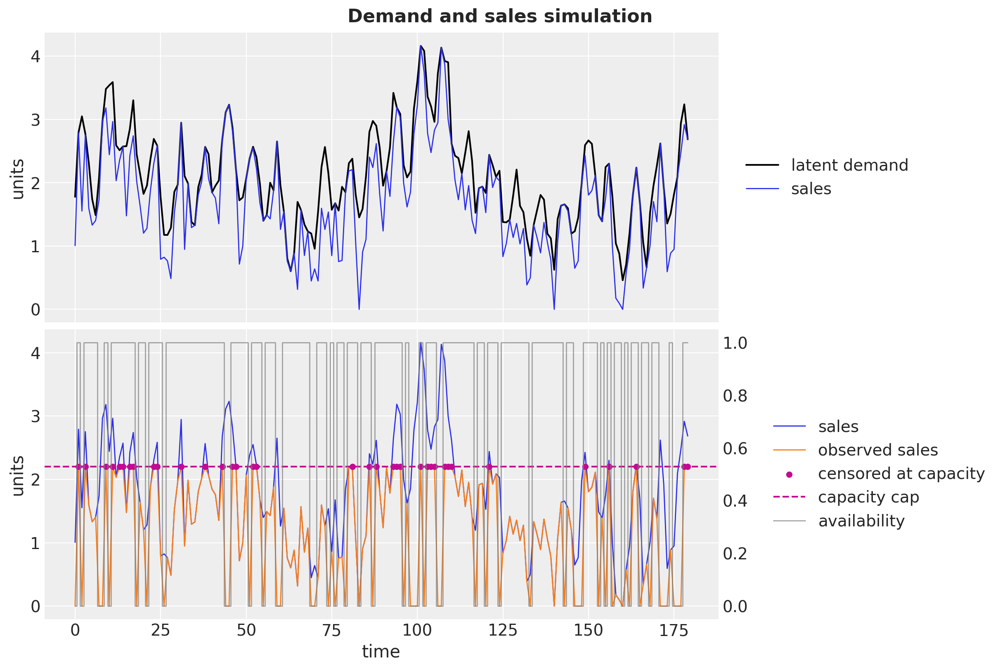
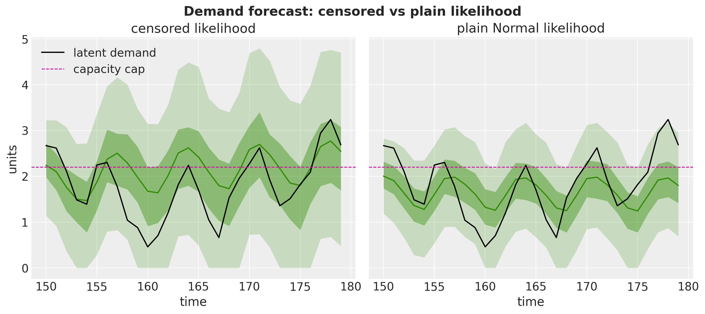

# Demand Forecasting with Censored Likelihood


Demand Forecasting with Censored Likelihood with `numpyro_forecast`

This notebook ports the blog post [**Demand Forecasting with Censored Likelihood**](https://juanitorduz.github.io/demand/) to the [`numpyro_forecast`](https://github.com/juanitorduz/numpyro_forecast) package. The subject is a fact of retail life: recorded sales understate demand in two distinct ways. When the product is out of stock, a day of genuine demand is recorded as zero sales. And when demand exceeds what the shelf (or the supply) can carry, the register stops counting at the capacity cap, so the recorded number is a *lower bound* on what customers actually wanted. A model trained naively on such a series learns to forecast *sales*, but replenishment and capacity planning need a forecast of *demand*: order against sales and you bake yesterday's stockouts into tomorrow's assortment, systematically under-serving your best days.

We simulate a demand series from an AR(2) process with weekly seasonality, corrupt it into observed sales through random stockouts and a hard capacity cap, and then fit an AR(2) model with Fourier seasonality **whose likelihood knows about the censoring**: below the cap an observation contributes the usual \text{Normal} density, and at the cap it contributes the *survival mass* P(\text{demand} \geq \text{cap}), the probability that latent demand was at least as large as the recorded bound. Days with the product off the shelf are masked out of the likelihood entirely. Because the data are simulated, the true demand is known and the claim "the censored likelihood recovers demand" can be checked against ground truth rather than asserted.

This example completes a trio of availability mechanisms in this documentation. The [availability TSB example](https://juanitorduz.github.io/numpyro_forecast/examples/availability_tsb.html) freezes its recursion updates when the product is off the shelf, and the [fresh retail stockout example](https://juanitorduz.github.io/numpyro_forecast/examples/fresh_retail_stockout.html) scales the mean by a saturating availability factor; its next-steps list asks for precisely the model built here. The closing section compares the three mechanisms side by side.


# Prepare notebook


``` python
from dataclasses import dataclass
from functools import partial
from typing import NamedTuple, cast

import arviz as az
import jax
import jax.numpy as jnp
import matplotlib.pyplot as plt
import numpy as np
import numpyro
import numpyro.distributions as dist
import pandas as pd
import xarray as xr
from jax import random
from jaxtyping import Float
from matplotlib.artist import Artist
from matplotlib.axes import Axes

from numpyro_forecast import (
    eval_coverage,
    eval_crps,
    eval_mae,
    eval_rmse,
    evaluate_forecast,
    forecasting_model,
    predictions_to_datatree,
    to_datatree,
)
from numpyro_forecast.features import fourier_features
from numpyro_forecast.functional import Horizon, fit_mcmc
from numpyro_forecast.typing import Array

az.style.use("arviz-darkgrid")
plt.rcParams["figure.figsize"] = [10, 6]
plt.rcParams["figure.dpi"] = 100
plt.rcParams["figure.facecolor"] = "white"

numpyro.set_host_device_count(n=4)

rng_key = random.PRNGKey(seed=42)


%load_ext autoreload
%autoreload 2
%load_ext jaxtyping
%jaxtyping.typechecker beartype.beartype
%config InlineBackend.figure_format = "retina"
```


# Generate data

We reproduce the blog post's data generating process. Latent demand follows an AR(2) recursion with a weekly sinusoid, clipped at zero:

d_t = \max\left(0, \\ \phi_1 \\ d\_{t-1} + \phi_2 \\ d\_{t-2} + \gamma \sin\left(\frac{2\pi t}{7}\right) + c + \varepsilon^d_t\right), \qquad \varepsilon^d_t \sim \text{Normal}(0, \sigma_d).

Sales are demand minus a friction term and noise, never exceeding demand and never negative:

s_t = \max\left(0, \\ \min\left(d_t + \varepsilon^s_t - \delta, \\ d_t\right)\right), \qquad \varepsilon^s_t \sim \text{Normal}(0, \sigma_s).

Observed sales gate the sales through an availability coin flip and cap them at the shelf capacity:

a_t \sim \text{Bernoulli}(0.8), \qquad y_t = \min\left(a_t \\ s_t, \\ y\_{\max}\right), \qquad y\_{\max} = 2.2.

It pays to keep the four quantities straight, because the whole example is about the gaps between them:

- **Latent demand** d_t is what customers want on day t. It is never observed directly, and it is the number planning cares about.
- **Sales** s_t are what would sell with the product fully available: demand minus real-world friction (a customer walks away, a basket is abandoned), which is why s_t \leq d_t always.
- **Observed sales** y_t are the only column a transaction database records: sales zeroed out on stockout days and truncated at the capacity cap.
- **Availability** a_t says whether the product was on the shelf at all. Retail systems typically know this (or can reconstruct it from inventory snapshots), which is what makes the model below feasible in practice.

From the observed series we also derive the **censoring indicator** c_t = \mathbb{1}\\y_t = y\_{\max}\\: on those days the register hit the cap, so the recorded value is a lower bound on sales rather than a measurement of them.


``` python
@dataclass(frozen=True)
class DemandParams:
    """Parameters of the demand and sales data generating process.

    Attributes
    ----------
    n_periods
        Number of days to simulate.
    phi_1, phi_2
        AR(2) coefficients of the latent demand recursion.
    seasonal_amplitude
        Amplitude of the weekly sinusoid in the demand recursion.
    seasonal_period
        Seasonal period in days.
    intercept
        Constant term of the demand recursion.
    demand_init
        Initial demand level seeding both lags of the recursion.
    demand_noise, sales_noise
        Standard deviations of the demand and sales noise terms.
    demand_sales_delta
        Friction subtracted from demand when generating sales.
    availability_rate
        Probability that the product is on the shelf on a given day.
    max_capacity
        Hard cap on recorded daily sales.
    """

    n_periods: int = 180
    phi_1: float = 0.6
    phi_2: float = 0.3
    seasonal_amplitude: float = 0.6
    seasonal_period: int = 7
    intercept: float = 0.2
    demand_init: float = 2.0
    demand_noise: float = 0.3
    sales_noise: float = 0.5
    demand_sales_delta: float = 0.25
    availability_rate: float = 0.8
    max_capacity: float = 2.2


class DemandData(NamedTuple):
    """Simulated series of the demand and sales process.

    Attributes
    ----------
    demand
        Latent demand series.
    sales
        Sales under full availability.
    sales_obs
        Observed sales: availability-gated and capacity-capped.
    is_available
        Availability indicator (1 if the product was on the shelf).
    """

    demand: Float[Array, " t"]
    sales: Float[Array, " t"]
    sales_obs: Float[Array, " t"]
    is_available: Float[Array, " t"]


def generate_demand_sales(rng_key: Array, params: DemandParams) -> DemandData:
    """Simulate latent demand, sales, and observed sales.

    Parameters
    ----------
    rng_key
        PRNG key for the noise terms and the availability draws.
    params
        Parameters of the data generating process.

    Returns
    -------
    DemandData
        The four simulated series, each of length ``params.n_periods``.
    """
    key_demand, key_sales, key_avail = random.split(rng_key, 3)
    noise_demand = params.demand_noise * random.normal(key_demand, (params.n_periods,))
    noise_sales = params.sales_noise * random.normal(key_sales, (params.n_periods,))
    is_available = random.bernoulli(
        key_avail, params.availability_rate, (params.n_periods,)
    ).astype(jnp.float32)
    t_grid = jnp.arange(params.n_periods, dtype=jnp.float32)

    def dgp_step(carry, xs):
        demand_prev_1, demand_prev_2 = carry
        t, eps_demand, eps_sales = xs
        seasonal = params.seasonal_amplitude * jnp.sin(2 * jnp.pi * t / params.seasonal_period)
        demand_t = jnp.clip(
            params.phi_1 * demand_prev_1
            + params.phi_2 * demand_prev_2
            + seasonal
            + params.intercept
            + eps_demand,
            min=0.0,
        )
        sales_t = jnp.clip(
            jnp.minimum(demand_t + eps_sales - params.demand_sales_delta, demand_t),
            min=0.0,
        )
        return (demand_t, demand_prev_1), (demand_t, sales_t)

    init = (jnp.asarray(params.demand_init), jnp.asarray(params.demand_init))
    _, (demand, sales) = jax.lax.scan(dgp_step, init, (t_grid, noise_demand, noise_sales))
    sales_obs = jnp.minimum(is_available * sales, params.max_capacity)
    return DemandData(demand=demand, sales=sales, sales_obs=sales_obs, is_available=is_available)


params = DemandParams()
rng_key, rng_subkey = random.split(rng_key)
demand, sales, sales_obs, is_available = generate_demand_sales(rng_subkey, params)

censored = (sales_obs == params.max_capacity).astype(jnp.float32)
time = np.arange(params.n_periods)

n_stockout = int((1 - is_available).sum())
n_censored = int(censored.sum())
print(f"periods: {params.n_periods}")
print(f"stockout days: {n_stockout} ({n_stockout / params.n_periods:.0%})")
print(f"capacity-censored days: {n_censored} ({n_censored / params.n_periods:.0%})")
```


    periods: 180
    stockout days: 49 (27%)
    capacity-censored days: 36 (20%)


The plot splits the story into its two steps. The top panel is the market: latent demand (black) with sales (blue) hugging it from below by the friction term. The bottom panel is the database: observed sales (orange) collapse to zero wherever the gray availability line (right axis) drops off the shelf, and flatline at the dashed capacity cap wherever sales would have exceeded it, with the censored days marked.


``` python
fig, (ax_top, ax_bot) = plt.subplots(
    nrows=2, ncols=1, sharex=True, sharey=True, figsize=(12, 8), layout="constrained"
)
ax_top.plot(time, np.asarray(demand), color="black", lw=1.5, label="latent demand")
ax_top.plot(time, np.asarray(sales), color="C0", lw=1, label="sales")
ax_top.legend(loc="center left", bbox_to_anchor=(1.02, 0.5))
ax_top.set(ylabel="units")

ax_bot.plot(time, np.asarray(sales), color="C0", lw=1, label="sales")
ax_bot.plot(time, np.asarray(sales_obs), color="C1", lw=1, label="observed sales")
ax_bot.scatter(
    time[np.asarray(censored) == 1],
    np.asarray(sales_obs)[np.asarray(censored) == 1],
    color="C3",
    s=20,
    zorder=5,
    label="censored at capacity",
)
cap_line = ax_bot.axhline(params.max_capacity, color="C3", ls="--", lw=1.5, label="capacity cap")
ax_twin = ax_bot.twinx()
ax_twin.plot(
    time,
    np.asarray(is_available),
    color="gray",
    lw=1,
    alpha=0.7,
    drawstyle="steps-mid",
    label="availability",
)
ax_twin.grid(False)
bot_handles, bot_labels = ax_bot.get_legend_handles_labels()
twin_handles, twin_labels = ax_twin.get_legend_handles_labels()
ax_bot.legend(
    bot_handles + twin_handles,
    bot_labels + twin_labels,
    loc="center left",
    bbox_to_anchor=(1.06, 0.5),
)
ax_bot.set(xlabel="time", ylabel="units")
fig.suptitle("Demand and sales simulation", fontsize=16, fontweight="bold");
```


<figure class="figure">
<p></p>
</figure>


# Train-test split and covariates

We hold out the last 30 days as the test window. Throughout the package, time lives at axis `-2` and the observation dimension at axis `-1`, so the training data has shape `(150, 1)`.

The covariates carry everything the model needs over the **full** duration, in a `(180, 7)` tensor. The package infers the forecast horizon from the shapes: covariates longer than the data by 30 rows means a 30-step forecast.

- Column `0` is the observed sales history the AR recursion filters. Only the first [t_obs](../../reference/forecaster.ForecastingModel.md#numpyro_forecast.forecaster.ForecastingModel.t_obs) rows are ever read, so the future rows are zeroed out and no information leaks.
- Column `1` is the availability mask and column `2` the censoring indicator. Their trailing 30 rows encode the **forecast scenario**: availability pinned to one and censoring to zero, meaning the forecast describes *uncensored demand*, the number a planner should order against. This is the same covariates-as-scenario device the availability TSB and fresh retail examples use.
- Columns `3:7` are weekly Fourier features (two harmonics, sines then cosines) from the package's [`fourier_features`](https://juanitorduz.github.io/numpyro_forecast/reference/features.fourier_features.html) helper, the only columns the model reads over the horizon.


``` python
forecast_horizon = 30
n_train = params.n_periods - forecast_horizon

train_data = sales_obs[:n_train][:, None]
demand_test = demand[n_train:][:, None]
sales_obs_test = sales_obs[n_train:][:, None]
t_test = time[n_train:]

n_order = 2
fourier = fourier_features(params.n_periods, float(params.seasonal_period), n_order)

in_train = jnp.arange(params.n_periods) < n_train
covariates = jnp.concatenate(
    [
        jnp.where(in_train, sales_obs, 0.0)[:, None],  # history; future rows never read
        jnp.where(in_train, is_available, 1.0)[:, None],  # scenario: fully available
        jnp.where(in_train, censored, 0.0)[:, None],  # scenario: uncensored
        fourier,
    ],
    axis=-1,
)
covariates_train = covariates[:n_train]
print(f"train data shape: {train_data.shape}, full covariates shape: {covariates.shape}")
```


    train data shape: (150, 1), full covariates shape: (180, 7)


# Model specification

The mean recursion is an AR(2) with Fourier seasonality, run on *filtered* lags \tilde{y}\_t defined below:

\hat{y}\_t = \mu + \phi_1 \\ \tilde{y}\_{t-1} + \phi_2 \\ \tilde{y}\_{t-2} + s_t, \qquad s_t = \mathbf{f}\_t^\top \boldsymbol{\beta},

with priors

\begin{align\*} \mu & \sim \text{Normal}(1, 1), \\ \phi_1, \phi_2 & \sim \text{Normal}(0, 1), \\ \boldsymbol{\beta} & \sim \text{Normal}(0, 1), \\ \sigma & \sim \text{HalfNormal}(1). \end{align\*}

The likelihood is where the censoring lives. An uncensored day contributes the usual density; a censored day only tells us that latent sales were *at least* the cap, so it contributes the survival mass above the recorded value:

p(y_t \mid \hat{y}\_t, \sigma) = \text{Normal}(y_t \mid \hat{y}\_t, \sigma)^{1 - c_t} \left\[1 - \Phi\left(\frac{y_t - \hat{y}\_t}{\sigma}\right)\right\]^{c_t},

where \Phi is the standard \text{Normal} CDF, and the whole term is masked out on stockout days (a_t = 0), which carry no demand information. NumPyro ships this construction (from version `0.20.0`) as [`RightCensoredDistribution`](https://num.pyro.ai/en/stable/distributions.html#censored-distributions): its `log_prob` is exactly the expression above (with a numerical-stability clip on the CDF), and its `sample` draws from the *uncensored* base distribution, which is precisely what we want posterior predictive draws to describe. The whole likelihood is then a single vectorized `"obs"` site.

**Filtering through the gaps.** Masking the likelihood is only half the treatment of a corrupted day, because an autoregression also consumes every day as a *lagged value*. A recorded stockout zero fed into the carry masquerades as a demand crash: it drags the next day's prediction down, attenuates the AR coefficients (post-gap days look like violent rebounds no moderate \phi can explain), and inflates \sigma to absorb the damage. The recursion therefore carries a filtered series instead of the raw observations:

\tilde{y}\_t = a_t \left\[(1 - c_t) \\ y_t + c_t \max\left(y_t, \hat{y}\_t\right)\right\] + (1 - a_t) \\ \hat{y}\_t.

Clean on-shelf days pass the observation through; capped days floor the lag at the model's own prediction, since the truth is at least the cap; off-shelf days carry the prediction itself, the model's best estimate of the demand nobody could express. This is the same one-step-ahead logic a state space filter applies to missing observations, done with a plug-in mean instead of a full state distribution.

The model body follows the ARMA example's two-scan pattern:

1.  **In sample.** A deterministic `jax.lax.scan` runs the filtered recursion over the observed history, emitting the one-step-ahead means \hat{y}\_t (exposed as the deterministic site `"pred_mean"`), and the `"obs"` site conditions the data on them through the censored likelihood. The AR(2) needs two lags, so the first two steps run on placeholder lags and are masked out of the likelihood.
2.  **Out of sample.** When `h.future > 0` we draw the horizon innovations at a separate `"eps_future"` site, roll the recursion forward from the final filtered lags, feeding each *sampled* observation back into the carry (clipped at zero, since demand is nonnegative), and expose the trajectory as the deterministic `"forecast"` site the package reads. Since `"eps_future"` does not exist during training, `Predictive` draws it from the prior at forecast time and the uncertainty compounds over the horizon exactly as the generative process says it should. No censoring applies over the horizon: the forecast is of latent demand-scale sales, unconstrained by the cap.


``` python
def ar2_seasonal(h: Horizon, covariates: Array) -> None:
    """Censored AR(2) model with weekly Fourier seasonality.

    Parameters
    ----------
    h
        The train/forecast horizon for the current model call.
    covariates
        Seven-input tensor ``(duration, 7)`` spanning the full horizon: column
        ``0`` is the observed sales history (only the first ``h.t_obs`` rows
        are read), column ``1`` the availability mask, column ``2`` the
        censoring indicator, and columns ``3:7`` the weekly Fourier features
        (the only columns read over the forecast horizon).
    """
    y = covariates[..., : h.t_obs, 0]  # observed history only; never reads beyond t_obs
    available = covariates[..., : h.t_obs, 1:2]
    censored = covariates[..., : h.t_obs, 2:3]
    fourier = covariates[..., 3:]

    # cast() only narrows numpyro's union return type for the type checker.
    mu = cast(Array, numpyro.sample("mu", dist.Normal(loc=1, scale=1)))
    phi_1 = cast(Array, numpyro.sample("phi_1", dist.Normal(loc=0, scale=1)))
    phi_2 = cast(Array, numpyro.sample("phi_2", dist.Normal(loc=0, scale=1)))
    sigma = cast(Array, numpyro.sample("sigma", dist.HalfNormal(scale=1)))
    with numpyro.plate("fourier_modes", fourier.shape[-1]):
        beta_seasonal = cast(Array, numpyro.sample("beta_seasonal", dist.Normal(loc=0, scale=1)))
    seasonal = fourier @ beta_seasonal

    def transition_fn(carry, xs):
        y_t, seasonal_t, available_t, censored_t = xs
        lag_1, lag_2 = carry
        pred = mu + phi_1 * lag_1 + phi_2 * lag_2 + seasonal_t
        # The filtered lag: pass clean observations through, floor capped days at the
        # prediction, and substitute the prediction on stockout days.
        on_shelf = jnp.where(censored_t == 1, jnp.maximum(y_t, pred), y_t)
        y_filtered = jnp.where(available_t == 1, on_shelf, pred)
        return (y_filtered, lag_1), pred

    init_carry = (y[0], y[0])  # placeholder lags; the first two steps are masked below
    (lag_1_last, lag_2_last), preds = jax.lax.scan(
        transition_fn,
        init_carry,
        (y, seasonal[: h.t_obs], available[..., 0], censored[..., 0]),
    )
    pred_mean = preds[:, None]
    numpyro.deterministic("pred_mean", pred_mean)

    valid = (jnp.arange(h.t_obs)[:, None] >= 2) & (available == 1)
    numpyro.sample(
        "obs",
        dist.RightCensoredDistribution(
            dist.Normal(loc=pred_mean, scale=sigma), censored=censored
        ).mask(valid),
        obs=h.data,
    )

    if h.future > 0:
        eps_future = cast(
            Array,
            numpyro.sample(
                "eps_future", dist.Normal(loc=0, scale=sigma).expand([h.future]).to_event(1)
            ),
        )

        def forecast_fn(carry, xs):
            seasonal_t, eps_t = xs
            lag_1, lag_2 = carry
            y_next = jnp.clip(mu + phi_1 * lag_1 + phi_2 * lag_2 + seasonal_t + eps_t, min=0.0)
            return (y_next, lag_1), y_next

        _, y_future = jax.lax.scan(
            forecast_fn, (lag_1_last, lag_2_last), (seasonal[h.t_obs :], eps_future)
        )
        numpyro.deterministic("forecast", y_future[:, None])


model = forecasting_model(ar2_seasonal)
```


# Inference with NUTS

We fit the model on the training window with the No-U-Turn Sampler through the functional [`fit_mcmc`](https://juanitorduz.github.io/numpyro_forecast/reference/functional.mcmc.fit_mcmc.html), running 4 chains of 1{,}000 warmup and 1{,}000 sampling steps each with `target_accept_prob=0.9` (the survival term gives the likelihood a slightly harder geometry near the cap). A modest budget is plenty because the posterior is tiny: the in-sample filter is deterministic, so the only latents are the eight parameters (\mu, \phi_1, \phi_2, \sigma, and four Fourier coefficients).

We then export the fit into an ArviZ-schema `xarray.DataTree` with [`to_datatree`](https://juanitorduz.github.io/numpyro_forecast/reference/convert.to_datatree.html). Because we pass the *extended* covariates, the tree automatically carries `predictions` groups with the out-of-sample draws of the `"forecast"` site, and the trailing scenario rows of the covariates land verbatim in `predictions_constant_data`, so the tree records that this forecast is a full-availability, uncensored scenario.


``` python
rng_key, rng_subkey = random.split(rng_key)
fit = fit_mcmc(
    rng_subkey,
    model,
    train_data,
    covariates_train,
    num_warmup=1_000,
    num_samples=1_000,
    num_chains=4,
    kernel_kwargs={"target_accept_prob": 0.9},
)

rng_key, rng_subkey = random.split(rng_key)
tree = to_datatree(
    rng_subkey,
    fit,
    model,
    train_data,
    covariates,
    posterior_dims={"pred_mean": ["time", "obs_dim"]},
)
tree
```


![](data:image/svg+xml;base64,PHN2ZyBzdHlsZT0icG9zaXRpb246IGFic29sdXRlOyB3aWR0aDogMDsgaGVpZ2h0OiAwOyBvdmVyZmxvdzogaGlkZGVuIj4KPGRlZnM+CjxzeW1ib2wgaWQ9Imljb24tZGF0YWJhc2UiIHZpZXdib3g9IjAgMCAzMiAzMiI+CjxwYXRoIGQ9Ik0xNiAwYy04LjgzNyAwLTE2IDIuMjM5LTE2IDV2NGMwIDIuNzYxIDcuMTYzIDUgMTYgNXMxNi0yLjIzOSAxNi01di00YzAtMi43NjEtNy4xNjMtNS0xNi01eiIgLz4KPHBhdGggZD0iTTE2IDE3Yy04LjgzNyAwLTE2LTIuMjM5LTE2LTV2NmMwIDIuNzYxIDcuMTYzIDUgMTYgNXMxNi0yLjIzOSAxNi01di02YzAgMi43NjEtNy4xNjMgNS0xNiA1eiIgLz4KPHBhdGggZD0iTTE2IDI2Yy04LjgzNyAwLTE2LTIuMjM5LTE2LTV2NmMwIDIuNzYxIDcuMTYzIDUgMTYgNXMxNi0yLjIzOSAxNi01di02YzAgMi43NjEtNy4xNjMgNS0xNiA1eiIgLz4KPC9zeW1ib2w+CjxzeW1ib2wgaWQ9Imljb24tZmlsZS10ZXh0MiIgdmlld2JveD0iMCAwIDMyIDMyIj4KPHBhdGggZD0iTTI4LjY4MSA3LjE1OWMtMC42OTQtMC45NDctMS42NjItMi4wNTMtMi43MjQtMy4xMTZzLTIuMTY5LTIuMDMwLTMuMTE2LTIuNzI0Yy0xLjYxMi0xLjE4Mi0yLjM5My0xLjMxOS0yLjg0MS0xLjMxOWgtMTUuNWMtMS4zNzggMC0yLjUgMS4xMjEtMi41IDIuNXYyN2MwIDEuMzc4IDEuMTIyIDIuNSAyLjUgMi41aDIzYzEuMzc4IDAgMi41LTEuMTIyIDIuNS0yLjV2LTE5LjVjMC0wLjQ0OC0wLjEzNy0xLjIzLTEuMzE5LTIuODQxek0yNC41NDMgNS40NTdjMC45NTkgMC45NTkgMS43MTIgMS44MjUgMi4yNjggMi41NDNoLTQuODExdi00LjgxMWMwLjcxOCAwLjU1NiAxLjU4NCAxLjMwOSAyLjU0MyAyLjI2OHpNMjggMjkuNWMwIDAuMjcxLTAuMjI5IDAuNS0wLjUgMC41aC0yM2MtMC4yNzEgMC0wLjUtMC4yMjktMC41LTAuNXYtMjdjMC0wLjI3MSAwLjIyOS0wLjUgMC41LTAuNSAwIDAgMTUuNDk5LTAgMTUuNSAwdjdjMCAwLjU1MiAwLjQ0OCAxIDEgMWg3djE5LjV6IiAvPgo8cGF0aCBkPSJNMjMgMjZoLTE0Yy0wLjU1MiAwLTEtMC40NDgtMS0xczAuNDQ4LTEgMS0xaDE0YzAuNTUyIDAgMSAwLjQ0OCAxIDFzLTAuNDQ4IDEtMSAxeiIgLz4KPHBhdGggZD0iTTIzIDIyaC0xNGMtMC41NTIgMC0xLTAuNDQ4LTEtMXMwLjQ0OC0xIDEtMWgxNGMwLjU1MiAwIDEgMC40NDggMSAxcy0wLjQ0OCAxLTEgMXoiIC8+CjxwYXRoIGQ9Ik0yMyAxOGgtMTRjLTAuNTUyIDAtMS0wLjQ0OC0xLTFzMC40NDgtMSAxLTFoMTRjMC41NTIgMCAxIDAuNDQ4IDEgMXMtMC40NDggMS0xIDF6IiAvPgo8L3N5bWJvbD4KPC9kZWZzPgo8L3N2Zz4=) <style>/* CSS stylesheet for displaying xarray objects in notebooks */

:root {
  --xr-font-color0: var(
    --jp-content-font-color0,
    var(--pst-color-text-base rgba(0, 0, 0, 1))
  );
  --xr-font-color2: var(
    --jp-content-font-color2,
    var(--pst-color-text-base, rgba(0, 0, 0, 0.54))
  );
  --xr-font-color3: var(
    --jp-content-font-color3,
    var(--pst-color-text-base, rgba(0, 0, 0, 0.38))
  );
  --xr-border-color: var(
    --jp-border-color2,
    hsl(from var(--pst-color-on-background, white) h s calc(l - 10))
  );
  --xr-disabled-color: var(
    --jp-layout-color3,
    hsl(from var(--pst-color-on-background, white) h s calc(l - 40))
  );
  --xr-background-color: var(
    --jp-layout-color0,
    var(--pst-color-on-background, white)
  );
  --xr-background-color-row-even: var(
    --jp-layout-color1,
    hsl(from var(--pst-color-on-background, white) h s calc(l - 5))
  );
  --xr-background-color-row-odd: var(
    --jp-layout-color2,
    hsl(from var(--pst-color-on-background, white) h s calc(l - 15))
  );
}

html[theme="dark"],
html[data-theme="dark"],
body[data-theme="dark"],
body.vscode-dark {
  --xr-font-color0: var(
    --jp-content-font-color0,
    var(--pst-color-text-base, rgba(255, 255, 255, 1))
  );
  --xr-font-color2: var(
    --jp-content-font-color2,
    var(--pst-color-text-base, rgba(255, 255, 255, 0.54))
  );
  --xr-font-color3: var(
    --jp-content-font-color3,
    var(--pst-color-text-base, rgba(255, 255, 255, 0.38))
  );
  --xr-border-color: var(
    --jp-border-color2,
    hsl(from var(--pst-color-on-background, #111111) h s calc(l + 10))
  );
  --xr-disabled-color: var(
    --jp-layout-color3,
    hsl(from var(--pst-color-on-background, #111111) h s calc(l + 40))
  );
  --xr-background-color: var(
    --jp-layout-color0,
    var(--pst-color-on-background, #111111)
  );
  --xr-background-color-row-even: var(
    --jp-layout-color1,
    hsl(from var(--pst-color-on-background, #111111) h s calc(l + 5))
  );
  --xr-background-color-row-odd: var(
    --jp-layout-color2,
    hsl(from var(--pst-color-on-background, #111111) h s calc(l + 15))
  );
}

.xr-wrap {
  display: block !important;
  min-width: 300px;
  max-width: 700px;
  line-height: 1.6;
  padding-bottom: 4px;
}

.xr-text-repr-fallback {
  /* fallback to plain text repr when CSS is not injected (untrusted notebook) */
  display: none;
}

.xr-header {
  padding-top: 6px;
  padding-bottom: 6px;
}

.xr-header {
  border-bottom: solid 1px var(--xr-border-color);
  margin-bottom: 4px;
}

.xr-header > div,
.xr-header > ul {
  display: inline;
  margin-top: 0;
  margin-bottom: 0;
}

.xr-obj-type,
.xr-obj-name {
  margin-left: 2px;
  margin-right: 10px;
}

.xr-obj-type,
.xr-group-box-contents > label {
  color: var(--xr-font-color2);
  display: block;
}

.xr-sections {
  padding-left: 0 !important;
  display: grid;
  grid-template-columns: 150px auto auto 1fr 0 20px 0 20px;
  margin-block-start: 0;
  margin-block-end: 0;
}

.xr-section-item {
  display: contents;
}

.xr-section-item > input,
.xr-group-box-contents > input,
.xr-array-wrap > input {
  display: block;
  opacity: 0;
  height: 0;
  margin: 0;
}

.xr-section-item > input + label,
.xr-var-item > input + label {
  color: var(--xr-disabled-color);
}

.xr-section-item > input:enabled + label,
.xr-var-item > input:enabled + label,
.xr-array-wrap > input:enabled + label,
.xr-group-box-contents > input:enabled + label {
  cursor: pointer;
  color: var(--xr-font-color2);
}

.xr-section-item > input:focus-visible + label,
.xr-var-item > input:focus-visible + label,
.xr-array-wrap > input:focus-visible + label,
.xr-group-box-contents > input:focus-visible + label {
  outline: auto;
}

.xr-section-item > input:enabled + label:hover,
.xr-var-item > input:enabled + label:hover,
.xr-array-wrap > input:enabled + label:hover,
.xr-group-box-contents > input:enabled + label:hover {
  color: var(--xr-font-color0);
}

.xr-section-summary {
  grid-column: 1;
  color: var(--xr-font-color2);
  font-weight: 500;
  white-space: nowrap;
}

.xr-section-summary > em {
  font-weight: normal;
}

.xr-span-grid {
  grid-column-end: -1;
}

.xr-section-summary > span {
  display: inline-block;
  padding-left: 0.3em;
}

.xr-group-box-contents > input:checked + label > span {
  display: inline-block;
  padding-left: 0.6em;
}

.xr-section-summary-in:disabled + label {
  color: var(--xr-font-color2);
}

.xr-section-summary-in + label:before {
  display: inline-block;
  content: "►";
  font-size: 11px;
  width: 15px;
  text-align: center;
}

.xr-section-summary-in:disabled + label:before {
  color: var(--xr-disabled-color);
}

.xr-section-summary-in:checked + label:before {
  content: "▼";
}

.xr-section-summary-in:checked + label > span {
  display: none;
}

.xr-section-summary,
.xr-section-inline-details,
.xr-group-box-contents > label {
  padding-top: 4px;
}

.xr-section-inline-details {
  grid-column: 2 / -1;
}

.xr-section-details {
  grid-column: 1 / -1;
  margin-top: 4px;
  margin-bottom: 5px;
}

.xr-section-summary-in ~ .xr-section-details {
  display: none;
}

.xr-section-summary-in:checked ~ .xr-section-details {
  display: contents;
}

.xr-children {
  display: inline-grid;
  grid-template-columns: 100%;
  grid-column: 1 / -1;
  padding-top: 4px;
}

.xr-group-box {
  display: inline-grid;
  grid-template-columns: 0px 30px auto;
}

.xr-group-box-vline {
  grid-column-start: 1;
  border-right: 0.2em solid;
  border-color: var(--xr-border-color);
  width: 0px;
}

.xr-group-box-hline {
  grid-column-start: 2;
  grid-row-start: 1;
  height: 1em;
  width: 26px;
  border-bottom: 0.2em solid;
  border-color: var(--xr-border-color);
}

.xr-group-box-contents {
  grid-column-start: 3;
  padding-bottom: 4px;
}

.xr-group-box-contents > label::before {
  content: "📂";
  padding-right: 0.3em;
}

.xr-group-box-contents > input:checked + label::before {
  content: "📁";
}

.xr-group-box-contents > input:checked + label {
  padding-bottom: 0px;
}

.xr-group-box-contents > input:checked ~ .xr-sections {
  display: none;
}

.xr-group-box-contents > input + label > span {
  display: none;
}

.xr-group-box-ellipsis {
  font-size: 1.4em;
  font-weight: 900;
  color: var(--xr-font-color2);
  letter-spacing: 0.15em;
  cursor: default;
}

.xr-array-wrap {
  grid-column: 1 / -1;
  display: grid;
  grid-template-columns: 20px auto;
}

.xr-array-wrap > label {
  grid-column: 1;
  vertical-align: top;
}

.xr-preview {
  color: var(--xr-font-color3);
}

.xr-array-preview,
.xr-array-data {
  padding: 0 5px !important;
  grid-column: 2;
}

.xr-array-data,
.xr-array-in:checked ~ .xr-array-preview {
  display: none;
}

.xr-array-in:checked ~ .xr-array-data,
.xr-array-preview {
  display: inline-block;
}

.xr-dim-list {
  display: inline-block !important;
  list-style: none;
  padding: 0 !important;
  margin: 0;
}

.xr-dim-list li {
  display: inline-block;
  padding: 0;
  margin: 0;
}

.xr-dim-list:before {
  content: "(";
}

.xr-dim-list:after {
  content: ")";
}

.xr-dim-list li:not(:last-child):after {
  content: ",";
  padding-right: 5px;
}

.xr-has-index {
  font-weight: bold;
}

.xr-var-list,
.xr-var-item {
  display: contents;
}

.xr-var-item > div,
.xr-var-item label,
.xr-var-item > .xr-var-name span {
  background-color: var(--xr-background-color-row-even);
  border-color: var(--xr-background-color-row-odd);
  margin-bottom: 0;
  padding-top: 2px;
}

.xr-var-item > .xr-var-name:hover span {
  padding-right: 5px;
}

.xr-var-list > li:nth-child(odd) > div,
.xr-var-list > li:nth-child(odd) > label,
.xr-var-list > li:nth-child(odd) > .xr-var-name span {
  background-color: var(--xr-background-color-row-odd);
  border-color: var(--xr-background-color-row-even);
}

.xr-var-name {
  grid-column: 1;
}

.xr-var-dims {
  grid-column: 2;
}

.xr-var-dtype {
  grid-column: 3;
  text-align: right;
  color: var(--xr-font-color2);
}

.xr-var-preview {
  grid-column: 4;
}

.xr-index-preview {
  grid-column: 2 / 5;
  color: var(--xr-font-color2);
}

.xr-var-name,
.xr-var-dims,
.xr-var-dtype,
.xr-preview,
.xr-attrs dt {
  white-space: nowrap;
  overflow: hidden;
  text-overflow: ellipsis;
  padding-right: 10px;
}

.xr-var-name:hover,
.xr-var-dims:hover,
.xr-var-dtype:hover,
.xr-attrs dt:hover {
  overflow: visible;
  width: auto;
  z-index: 1;
}

.xr-var-attrs,
.xr-var-data,
.xr-index-data {
  display: none;
  border-top: 2px dotted var(--xr-background-color);
  padding-bottom: 20px !important;
  padding-top: 10px !important;
}

.xr-var-attrs-in + label,
.xr-var-data-in + label,
.xr-index-data-in + label {
  padding: 0 1px;
}

.xr-var-attrs-in:checked ~ .xr-var-attrs,
.xr-var-data-in:checked ~ .xr-var-data,
.xr-index-data-in:checked ~ .xr-index-data {
  display: block;
}

.xr-var-data > table {
  float: right;
}

.xr-var-data > pre,
.xr-index-data > pre,
.xr-var-data > table > tbody > tr {
  background-color: transparent !important;
}

.xr-var-name span,
.xr-var-data,
.xr-index-name div,
.xr-index-data,
.xr-attrs {
  padding-left: 25px !important;
}

.xr-attrs,
.xr-var-attrs,
.xr-var-data,
.xr-index-data {
  grid-column: 1 / -1;
}

dl.xr-attrs {
  padding: 0;
  margin: 0;
  display: grid;
  grid-template-columns: 125px auto;
}

.xr-attrs dt,
.xr-attrs dd {
  padding: 0;
  margin: 0;
  float: left;
  padding-right: 10px;
  width: auto;
}

.xr-attrs dt {
  font-weight: normal;
  grid-column: 1;
}

.xr-attrs dt:hover span {
  display: inline-block;
  background: var(--xr-background-color);
  padding-right: 10px;
}

.xr-attrs dd {
  grid-column: 2;
  white-space: pre-wrap;
  word-break: break-all;
}

.xr-icon-database,
.xr-icon-file-text2,
.xr-no-icon {
  display: inline-block;
  vertical-align: middle;
  width: 1em;
  height: 1.5em !important;
  stroke-width: 0;
  stroke: currentColor;
  fill: currentColor;
}

.xr-var-attrs-in:checked + label > .xr-icon-file-text2,
.xr-var-data-in:checked + label > .xr-icon-database,
.xr-index-data-in:checked + label > .xr-icon-database {
  color: var(--xr-font-color0);
  filter: drop-shadow(1px 1px 5px var(--xr-font-color2));
  stroke-width: 0.8px;
}
</style>

``` xr-text-repr-fallback
<xarray.DataTree>
Group: /
│   Attributes:
│       inference_library:  numpyro
│       creation_library:   numpyro_forecast
│       sample_dims:        ['chain', 'draw']
├── Group: /posterior
│       Dimensions:              (chain: 4, draw: 1000, beta_seasonal_dim_0: 4,
│                                 time: 150, obs_dim: 1)
│       Coordinates:
│         * chain                (chain) int64 32B 0 1 2 3
│         * draw                 (draw) int64 8kB 0 1 2 3 4 5 ... 995 996 997 998 999
│         * beta_seasonal_dim_0  (beta_seasonal_dim_0) int64 32B 0 1 2 3
│         * time                 (time) int64 1kB 0 1 2 3 4 5 ... 145 146 147 148 149
│         * obs_dim              (obs_dim) int64 8B 0
│       Data variables:
│           beta_seasonal        (chain, draw, beta_seasonal_dim_0) float32 64kB 0.59...
│           mu                   (chain, draw) float32 16kB 0.3006 0.2091 ... 0.3327
│           phi_1                (chain, draw) float32 16kB 0.4675 0.482 ... 0.5572
│           phi_2                (chain, draw) float32 16kB 0.4219 0.4464 ... 0.2961
│           pred_mean            (chain, draw, time, obs_dim) float32 2MB 0.05285 ......
│           sigma                (chain, draw) float32 16kB 0.5679 0.5054 ... 0.6245
│       Attributes:
│           created_at:                 2026-07-28T10:50:31.059255+00:00
│           creation_library:           ArviZ
│           creation_library_version:   1.2.0
│           creation_library_language:  Python
│           sample_dims:                ['chain', 'draw']
├── Group: /posterior_predictive
│       Dimensions:  (chain: 4, draw: 1000, time: 150, obs_dim: 1)
│       Coordinates:
│         * chain    (chain) int64 32B 0 1 2 3
│         * draw     (draw) int64 8kB 0 1 2 3 4 5 6 7 ... 993 994 995 996 997 998 999
│         * time     (time) int64 1kB 0 1 2 3 4 5 6 7 ... 143 144 145 146 147 148 149
│         * obs_dim  (obs_dim) int64 8B 0
│       Data variables:
│           obs      (chain, draw, time, obs_dim) float32 2MB 0.7659 -0.08214 ... 3.37
│       Attributes:
│           created_at:                 2026-07-28T10:50:31.198091+00:00
│           creation_library:           ArviZ
│           creation_library_version:   1.2.0
│           creation_library_language:  Python
│           sample_dims:                ['chain', 'draw']
├── Group: /observed_data
│       Dimensions:  (time: 150, obs_dim: 1)
│       Coordinates:
│         * time     (time) int64 1kB 0 1 2 3 4 5 6 7 ... 143 144 145 146 147 148 149
│         * obs_dim  (obs_dim) int64 8B 0
│       Data variables:
│           obs      (time, obs_dim) float32 600B 0.0 2.2 0.0 2.2 ... 0.0 0.0 0.0 2.2
│       Attributes:
│           created_at:                 2026-07-28T10:50:31.198318+00:00
│           creation_library:           ArviZ
│           creation_library_version:   1.2.0
│           creation_library_language:  Python
│           sample_dims:                []
├── Group: /constant_data
│       Dimensions:        (time: 150, covariate_dim: 7)
│       Coordinates:
│         * time           (time) int64 1kB 0 1 2 3 4 5 6 ... 144 145 146 147 148 149
│         * covariate_dim  (covariate_dim) int64 56B 0 1 2 3 4 5 6
│       Data variables:
│           covariates     (time, covariate_dim) float32 4kB 0.0 0.0 ... -0.2225 -0.901
│       Attributes:
│           created_at:                 2026-07-28T10:50:31.198475+00:00
│           creation_library:           ArviZ
│           creation_library_version:   1.2.0
│           creation_library_language:  Python
│           sample_dims:                []
├── Group: /predictions
│       Dimensions:  (chain: 4, draw: 1000, time: 30, obs_dim: 1)
│       Coordinates:
│         * chain    (chain) int64 32B 0 1 2 3
│         * draw     (draw) int64 8kB 0 1 2 3 4 5 6 7 ... 993 994 995 996 997 998 999
│         * time     (time) int64 240B 150 151 152 153 154 155 ... 175 176 177 178 179
│         * obs_dim  (obs_dim) int64 8B 0
│       Data variables:
│           obs      (chain, draw, time, obs_dim) float32 480kB 2.087 1.853 ... 4.176
│       Attributes:
│           created_at:                 2026-07-28T10:50:31.371570+00:00
│           creation_library:           ArviZ
│           creation_library_version:   1.2.0
│           creation_library_language:  Python
│           sample_dims:                ['chain', 'draw']
└── Group: /predictions_constant_data
        Dimensions:        (time: 30, covariate_dim: 7)
        Coordinates:
          * time           (time) int64 240B 150 151 152 153 154 ... 175 176 177 178 179
          * covariate_dim  (covariate_dim) int64 56B 0 1 2 3 4 5 6
        Data variables:
            covariates     (time, covariate_dim) float32 840B 0.0 1.0 ... -0.901 0.6235
        Attributes:
            created_at:                 2026-07-28T10:50:31.371778+00:00
            creation_library:           ArviZ
            creation_library_version:   1.2.0
            creation_library_language:  Python
            sample_dims:                []
```


xarray.DataTree


/posterior(16)

Dimensions:


- chain: 4
- draw: 1000
- beta_seasonal_dim_0: 4
- time: 150
- obs_dim: 1


Coordinates: (5)


chain


(chain)


int64


0 1 2 3


    array([0, 1, 2, 3])


draw


(draw)


int64


0 1 2 3 4 5 ... 995 996 997 998 999


    array([  0,   1,   2, ..., 997, 998, 999], shape=(1000,))


beta_seasonal_dim_0


(beta_seasonal_dim_0)


int64


0 1 2 3


    array([0, 1, 2, 3])


time


(time)


int64


0 1 2 3 4 5 ... 145 146 147 148 149


    array([  0,   1,   2,   3,   4,   5,   6,   7,   8,   9,  10,  11,  12,  13,14,  15,  16,  17,  18,  19,  20,  21,  22,  23,  24,  25,  26,  27,28,  29,  30,  31,  32,  33,  34,  35,  36,  37,  38,  39,  40,  41,42,  43,  44,  45,  46,  47,  48,  49,  50,  51,  52,  53,  54,  55,56,  57,  58,  59,  60,  61,  62,  63,  64,  65,  66,  67,  68,  69,70,  71,  72,  73,  74,  75,  76,  77,  78,  79,  80,  81,  82,  83,84,  85,  86,  87,  88,  89,  90,  91,  92,  93,  94,  95,  96,  97,98,  99, 100, 101, 102, 103, 104, 105, 106, 107, 108, 109, 110, 111,112, 113, 114, 115, 116, 117, 118, 119, 120, 121, 122, 123, 124, 125,126, 127, 128, 129, 130, 131, 132, 133, 134, 135, 136, 137, 138, 139,140, 141, 142, 143, 144, 145, 146, 147, 148, 149])


obs_dim


(obs_dim)


int64


0


    array([0])


Data variables: (6)


beta_seasonal


(chain, draw, beta_seasonal_dim_0)


float32


0.5954 -0.08593 ... -0.2538 0.0284


    array([[[ 0.5953925 , -0.08593097, -0.18799172, -0.05976595],[ 0.48670045,  0.04957552, -0.1204094 , -0.12671165],[ 0.5301356 , -0.03642713, -0.06920218, -0.03709848],...,[ 0.6880221 ,  0.13709089, -0.06750897, -0.03371767],[ 0.38725886, -0.13713983, -0.22318618, -0.11579753],[ 0.6242787 , -0.11117154, -0.07565106, -0.01880834]],[[ 0.5713842 ,  0.02325631, -0.15833594, -0.13901676],[ 0.42596847,  0.04423946, -0.14028615, -0.08008251],[ 0.5225729 ,  0.00562341, -0.05942311, -0.05916819],...,[ 0.46272197,  0.01815279, -0.25018883, -0.14777596],[ 0.44779503, -0.06801153, -0.10254595,  0.03295806],[ 0.41639358, -0.03968314, -0.11773226,  0.06239383]],[[ 0.46394956,  0.03944561, -0.19636895, -0.196639  ],[ 0.454715  ,  0.13240136, -0.22291021, -0.14201201],[ 0.4429966 , -0.02767556, -0.17534949, -0.08761624],...,[ 0.49169463, -0.12741314, -0.15076761, -0.09680636],[ 0.5245294 ,  0.06198181, -0.19808403, -0.03549089],[ 0.4747971 , -0.0995423 , -0.14744987,  0.02933752]],[[ 0.5236091 ,  0.05889977, -0.16280515, -0.1455135 ],[ 0.4079202 , -0.06997041, -0.12394881, -0.05365823],[ 0.4847571 ,  0.05935502, -0.17133234, -0.16198121],...,[ 0.5150327 , -0.01960661, -0.01693058, -0.09466459],[ 0.42311382, -0.09169638, -0.20486626, -0.16911794],[ 0.5369552 ,  0.02069436, -0.2537836 ,  0.02839641]]],shape=(4, 1000, 4), dtype=float32)


mu


(chain, draw)


float32


0.3006 0.2091 ... 0.2828 0.3327


    array([[0.3006096 , 0.2090898 , 0.02186372, ..., 0.15608266, 0.44173697,0.16508806],[0.40112543, 0.24275784, 0.26381153, ..., 0.42839473, 0.23053078,0.3043994 ],[0.33860546, 0.39234415, 0.40355313, ..., 0.2747149 , 0.19965401,0.48253617],[0.16428494, 0.48296413, 0.1588712 , ..., 0.18181883, 0.28279105,0.33271554]], shape=(4, 1000), dtype=float32)


phi_1


(chain, draw)


float32


0.4675 0.482 ... 0.4677 0.5572


    array([[0.46747765, 0.48196927, 0.508888  , ..., 0.5565487 , 0.34123728,0.6101818 ],[0.58003443, 0.57395697, 0.65580946, ..., 0.62241614, 0.4360808 ,0.4357085 ],[0.43494934, 0.42573777, 0.5200702 , ..., 0.3730772 , 0.5039385 ,0.4062611 ],[0.48611426, 0.42598978, 0.61784244, ..., 0.5184483 , 0.4677266 ,0.55719197]], shape=(4, 1000), dtype=float32)


phi_2


(chain, draw)


float32


0.4219 0.4464 ... 0.3895 0.2961


    array([[0.42189446, 0.4464437 , 0.51142246, ..., 0.41101784, 0.45946363,0.3364486 ],[0.21723811, 0.31279802, 0.2382643 , ..., 0.19236901, 0.4577368 ,0.41994286],[0.38116506, 0.4029537 , 0.26923925, ..., 0.5189637 , 0.40986916,0.37505838],[0.4639181 , 0.3581898 , 0.31992003, ..., 0.40264228, 0.3894744 ,0.29608905]], shape=(4, 1000), dtype=float32)


pred_mean


(chain, draw, time, obs_dim)


float32


0.05285 0.6031 ... 1.383 1.926


    array([[[[ 0.05285192],[ 0.6031251 ],[ 2.0647867 ],...,[ 1.03818   ],[ 1.4976699 ],[ 2.1521688 ]],[[-0.03803125],[ 0.5727322 ],[ 1.846388  ],...,[ 0.9789303 ],[ 1.510352  ],[ 1.9680133 ]],[[-0.08443695],[ 0.32296598],[ 1.679707  ],...,......,[ 1.0978537 ],[ 1.5692044 ],[ 2.0370953 ]],[[-0.09119317],[ 0.39144424],[ 1.9265201 ],...,[ 0.8959888 ],[ 1.2873731 ],[ 1.8841436 ]],[[ 0.10732834],[ 0.66795176],[ 2.135718  ],...,[ 0.9371571 ],[ 1.3831389 ],[ 1.9262738 ]]]], shape=(4, 1000, 150, 1), dtype=float32)


sigma


(chain, draw)


float32


0.5679 0.5054 ... 0.4521 0.6245


    array([[0.56791306, 0.50539345, 0.4650985 , ..., 0.5646924 , 0.49414065,0.63473886],[0.57168365, 0.51315683, 0.50706214, ..., 0.5165351 , 0.54383236,0.54376507],[0.47485065, 0.5193229 , 0.50680524, ..., 0.5325688 , 0.4849056 ,0.6100923 ],[0.5465902 , 0.5510835 , 0.47141635, ..., 0.53600085, 0.4520951 ,0.62448996]], shape=(4, 1000), dtype=float32)


Attributes: (5)


created_at :  
2026-07-28T10:50:31.059255+00:00

creation_library :  
ArviZ

creation_library_version :  
1.2.0

creation_library_language :  
Python

sample_dims :  
\['chain', 'draw'\]


/posterior_predictive(10)

Dimensions:


- chain: 4
- draw: 1000
- time: 150
- obs_dim: 1


Coordinates: (4)


chain


(chain)


int64


0 1 2 3


    array([0, 1, 2, 3])


draw


(draw)


int64


0 1 2 3 4 5 ... 995 996 997 998 999


    array([  0,   1,   2, ..., 997, 998, 999], shape=(1000,))


time


(time)


int64


0 1 2 3 4 5 ... 145 146 147 148 149


    array([  0,   1,   2,   3,   4,   5,   6,   7,   8,   9,  10,  11,  12,  13,14,  15,  16,  17,  18,  19,  20,  21,  22,  23,  24,  25,  26,  27,28,  29,  30,  31,  32,  33,  34,  35,  36,  37,  38,  39,  40,  41,42,  43,  44,  45,  46,  47,  48,  49,  50,  51,  52,  53,  54,  55,56,  57,  58,  59,  60,  61,  62,  63,  64,  65,  66,  67,  68,  69,70,  71,  72,  73,  74,  75,  76,  77,  78,  79,  80,  81,  82,  83,84,  85,  86,  87,  88,  89,  90,  91,  92,  93,  94,  95,  96,  97,98,  99, 100, 101, 102, 103, 104, 105, 106, 107, 108, 109, 110, 111,112, 113, 114, 115, 116, 117, 118, 119, 120, 121, 122, 123, 124, 125,126, 127, 128, 129, 130, 131, 132, 133, 134, 135, 136, 137, 138, 139,140, 141, 142, 143, 144, 145, 146, 147, 148, 149])


obs_dim


(obs_dim)


int64


0


    array([0])


Data variables: (1)


obs


(chain, draw, time, obs_dim)


float32


0.7659 -0.08214 ... 1.175 3.37


    array([[[[ 0.76588124],[-0.08213942],[ 0.8852958 ],...,[ 0.95300466],[ 0.43325794],[ 2.519212  ]],[[-0.9397868 ],[ 0.3150252 ],[ 2.3181238 ],...,[ 1.2842846 ],[ 1.0835569 ],[ 2.0715396 ]],[[-0.53324115],[ 0.19267619],[ 1.2461126 ],...,......,[ 1.7411855 ],[ 1.7523389 ],[ 2.1545591 ]],[[ 0.15245035],[ 0.91226345],[ 1.5832067 ],...,[ 0.3581293 ],[ 0.98714876],[ 2.8439636 ]],[[ 0.18103045],[ 1.0797963 ],[ 2.0874183 ],...,[ 1.7104496 ],[ 1.1751677 ],[ 3.3697658 ]]]], shape=(4, 1000, 150, 1), dtype=float32)


Attributes: (5)


created_at :  
2026-07-28T10:50:31.198091+00:00

creation_library :  
ArviZ

creation_library_version :  
1.2.0

creation_library_language :  
Python

sample_dims :  
\['chain', 'draw'\]


/observed_data(8)

Dimensions:


- time: 150
- obs_dim: 1


Coordinates: (2)


time


(time)


int64


0 1 2 3 4 5 ... 145 146 147 148 149


    array([  0,   1,   2,   3,   4,   5,   6,   7,   8,   9,  10,  11,  12,  13,14,  15,  16,  17,  18,  19,  20,  21,  22,  23,  24,  25,  26,  27,28,  29,  30,  31,  32,  33,  34,  35,  36,  37,  38,  39,  40,  41,42,  43,  44,  45,  46,  47,  48,  49,  50,  51,  52,  53,  54,  55,56,  57,  58,  59,  60,  61,  62,  63,  64,  65,  66,  67,  68,  69,70,  71,  72,  73,  74,  75,  76,  77,  78,  79,  80,  81,  82,  83,84,  85,  86,  87,  88,  89,  90,  91,  92,  93,  94,  95,  96,  97,98,  99, 100, 101, 102, 103, 104, 105, 106, 107, 108, 109, 110, 111,112, 113, 114, 115, 116, 117, 118, 119, 120, 121, 122, 123, 124, 125,126, 127, 128, 129, 130, 131, 132, 133, 134, 135, 136, 137, 138, 139,140, 141, 142, 143, 144, 145, 146, 147, 148, 149])


obs_dim


(obs_dim)


int64


0


    array([0])


Data variables: (1)


obs


(time, obs_dim)


float32


0.0 2.2 0.0 2.2 ... 0.0 0.0 0.0 2.2


    array([[0.        ],[2.2       ],[0.        ],[2.2       ],[1.5981454 ],[1.330448  ],[1.4032364 ],[0.        ],[0.        ],[2.2       ],[0.        ],[2.2       ],[2.0323782 ],[2.2       ],[2.2       ],[1.4770805 ],[2.2       ],[2.2       ],[0.        ],[1.6346474 ],...[1.0327187 ],[1.2768031 ],[0.38543403],[0.        ],[1.3336072 ],[1.1269362 ],[0.89154816],[1.3728547 ],[1.0591812 ],[0.7849984 ],[0.        ],[1.0683882 ],[1.6382626 ],[0.        ],[1.5513194 ],[1.1958487 ],[0.        ],[0.        ],[0.        ],[2.2       ]], dtype=float32)


Attributes: (5)


created_at :  
2026-07-28T10:50:31.198318+00:00

creation_library :  
ArviZ

creation_library_version :  
1.2.0

creation_library_language :  
Python

sample_dims :  
\[\]


/constant_data(8)

Dimensions:


- time: 150
- covariate_dim: 7


Coordinates: (2)


time


(time)


int64


0 1 2 3 4 5 ... 145 146 147 148 149


    array([  0,   1,   2,   3,   4,   5,   6,   7,   8,   9,  10,  11,  12,  13,14,  15,  16,  17,  18,  19,  20,  21,  22,  23,  24,  25,  26,  27,28,  29,  30,  31,  32,  33,  34,  35,  36,  37,  38,  39,  40,  41,42,  43,  44,  45,  46,  47,  48,  49,  50,  51,  52,  53,  54,  55,56,  57,  58,  59,  60,  61,  62,  63,  64,  65,  66,  67,  68,  69,70,  71,  72,  73,  74,  75,  76,  77,  78,  79,  80,  81,  82,  83,84,  85,  86,  87,  88,  89,  90,  91,  92,  93,  94,  95,  96,  97,98,  99, 100, 101, 102, 103, 104, 105, 106, 107, 108, 109, 110, 111,112, 113, 114, 115, 116, 117, 118, 119, 120, 121, 122, 123, 124, 125,126, 127, 128, 129, 130, 131, 132, 133, 134, 135, 136, 137, 138, 139,140, 141, 142, 143, 144, 145, 146, 147, 148, 149])


covariate_dim


(covariate_dim)


int64


0 1 2 3 4 5 6


    array([0, 1, 2, 3, 4, 5, 6])


Data variables: (1)


covariates


(time, covariate_dim)


float32


0.0 0.0 0.0 ... -0.2225 -0.901


    array([[ 0.0000000e+00,  0.0000000e+00,  0.0000000e+00, ...,0.0000000e+00,  1.0000000e+00,  1.0000000e+00],[ 2.2000000e+00,  1.0000000e+00,  1.0000000e+00, ...,9.7492790e-01,  6.2348974e-01, -2.2252107e-01],[ 0.0000000e+00,  0.0000000e+00,  0.0000000e+00, ...,-4.3388399e-01, -2.2252107e-01, -9.0096873e-01],...,[ 0.0000000e+00,  0.0000000e+00,  0.0000000e+00, ...,1.5926582e-05,  1.0000000e+00,  1.0000000e+00],[ 0.0000000e+00,  0.0000000e+00,  0.0000000e+00, ...,9.7492421e-01,  6.2348330e-01, -2.2253717e-01],[ 2.2000000e+00,  1.0000000e+00,  1.0000000e+00, ...,-4.3389940e-01, -2.2252941e-01, -9.0096134e-01]],shape=(150, 7), dtype=float32)


Attributes: (5)


created_at :  
2026-07-28T10:50:31.198475+00:00

creation_library :  
ArviZ

creation_library_version :  
1.2.0

creation_library_language :  
Python

sample_dims :  
\[\]


/predictions(10)

Dimensions:


- chain: 4
- draw: 1000
- time: 30
- obs_dim: 1


Coordinates: (4)


chain


(chain)


int64


0 1 2 3


    array([0, 1, 2, 3])


draw


(draw)


int64


0 1 2 3 4 5 ... 995 996 997 998 999


    array([  0,   1,   2, ..., 997, 998, 999], shape=(1000,))


time


(time)


int64


150 151 152 153 ... 176 177 178 179


    array([150, 151, 152, 153, 154, 155, 156, 157, 158, 159, 160, 161, 162, 163,164, 165, 166, 167, 168, 169, 170, 171, 172, 173, 174, 175, 176, 177,178, 179])


obs_dim


(obs_dim)


int64


0


    array([0])


Data variables: (1)


obs


(chain, draw, time, obs_dim)


float32


2.087 1.853 1.246 ... 4.21 4.176


    array([[[[2.0871358 ],[1.8529841 ],[1.2461884 ],...,[1.7612356 ],[2.0639472 ],[0.9609436 ]],[[3.0377617 ],[2.9982262 ],[2.4078894 ],...,[2.126032  ],[1.938407  ],[2.3099601 ]],[[1.9269966 ],[1.6996149 ],[1.068047  ],...,......,[1.7706331 ],[2.2781837 ],[1.5349066 ]],[[2.3369386 ],[1.8497515 ],[1.9407645 ],...,[2.4601305 ],[2.1313462 ],[2.0452642 ]],[[2.9998767 ],[2.3199697 ],[1.3107479 ],...,[3.7120757 ],[4.2103996 ],[4.175524  ]]]], shape=(4, 1000, 30, 1), dtype=float32)


Attributes: (5)


created_at :  
2026-07-28T10:50:31.371570+00:00

creation_library :  
ArviZ

creation_library_version :  
1.2.0

creation_library_language :  
Python

sample_dims :  
\['chain', 'draw'\]


/predictions_constant_data(8)

Dimensions:


- time: 30
- covariate_dim: 7


Coordinates: (2)


time


(time)


int64


150 151 152 153 ... 176 177 178 179


    array([150, 151, 152, 153, 154, 155, 156, 157, 158, 159, 160, 161, 162, 163,164, 165, 166, 167, 168, 169, 170, 171, 172, 173, 174, 175, 176, 177,178, 179])


covariate_dim


(covariate_dim)


int64


0 1 2 3 4 5 6


    array([0, 1, 2, 3, 4, 5, 6])


Data variables: (1)


covariates


(time, covariate_dim)


float32


0.0 1.0 0.0 ... -0.901 0.6235


    array([[ 0.0000000e+00,  1.0000000e+00,  0.0000000e+00,  4.3387559e-01,-7.8182018e-01, -9.0097278e-01,  6.2350398e-01],[ 0.0000000e+00,  1.0000000e+00,  0.0000000e+00, -4.3389225e-01,7.8184325e-01, -9.0096480e-01,  6.2347507e-01],[ 0.0000000e+00,  1.0000000e+00,  0.0000000e+00, -9.7493011e-01,4.3386611e-01, -2.2251140e-01, -9.0097737e-01],[ 0.0000000e+00,  1.0000000e+00,  0.0000000e+00, -7.8182513e-01,-9.7493243e-01,  6.2349772e-01, -2.2250113e-01],[ 0.0000000e+00,  1.0000000e+00,  0.0000000e+00,  1.0522323e-05,2.1044645e-05,  1.0000000e+00,  1.0000000e+00],[ 0.0000000e+00,  1.0000000e+00,  0.0000000e+00,  7.8183824e-01,9.7492307e-01,  6.2348127e-01, -2.2254217e-01],[ 0.0000000e+00,  1.0000000e+00,  0.0000000e+00,  9.7492540e-01,-4.3390402e-01, -2.2253190e-01, -9.0095907e-01],[ 0.0000000e+00,  1.0000000e+00,  0.0000000e+00,  4.3387327e-01,-7.8181696e-01, -9.0097392e-01,  6.2350798e-01],[ 0.0000000e+00,  1.0000000e+00,  0.0000000e+00, -4.3389454e-01,7.8184640e-01, -9.0096366e-01,  6.2347108e-01],[ 0.0000000e+00,  1.0000000e+00,  0.0000000e+00, -9.7493064e-01,4.3386149e-01, -2.2250889e-01, -9.0097958e-01],...[ 0.0000000e+00,  1.0000000e+00,  0.0000000e+00,  9.7492766e-01,-4.3388575e-01, -2.2252202e-01, -9.0096790e-01],[ 0.0000000e+00,  1.0000000e+00,  0.0000000e+00,  4.3388242e-01,-7.8182966e-01, -9.0096951e-01,  6.2349212e-01],[ 0.0000000e+00,  1.0000000e+00,  0.0000000e+00, -4.3388540e-01,7.8183377e-01, -9.0096807e-01,  6.2348694e-01],[ 0.0000000e+00,  1.0000000e+00,  0.0000000e+00, -9.7493184e-01,4.3385229e-01, -2.2250390e-01, -9.0098405e-01],[ 0.0000000e+00,  1.0000000e+00,  0.0000000e+00, -7.8182036e-01,-9.7493589e-01,  6.2350374e-01, -2.2248617e-01],[ 0.0000000e+00,  1.0000000e+00,  0.0000000e+00,  1.8199416e-05,3.6398833e-05,  1.0000000e+00,  1.0000000e+00],[ 0.0000000e+00,  1.0000000e+00,  0.0000000e+00,  7.8184307e-01,9.7491968e-01,  6.2347531e-01, -2.2255713e-01],[ 0.0000000e+00,  1.0000000e+00,  0.0000000e+00,  9.7492713e-01,-4.3389037e-01, -2.2252451e-01, -9.0096569e-01],[ 0.0000000e+00,  1.0000000e+00,  0.0000000e+00,  4.3388012e-01,-7.8182644e-01, -9.0097064e-01,  6.2349612e-01],[ 0.0000000e+00,  1.0000000e+00,  0.0000000e+00, -4.3388772e-01,7.8183699e-01, -9.0096694e-01,  6.2348294e-01]], dtype=float32)


Attributes: (5)


created_at :  
2026-07-28T10:50:31.371778+00:00

creation_library :  
ArviZ

creation_library_version :  
1.2.0

creation_library_language :  
Python

sample_dims :  
\[\]


Attributes: (3)


inference_library :  
numpyro

creation_library :  
numpyro_forecast

sample_dims :  
\['chain', 'draw'\]


# Diagnostics

`az.summary` on the parameters gives the convergence picture in one call: posterior means and standard deviations, the 94\\ HDIs, effective sample sizes, and \hat{R}.

A word on reading the parameter table: the data generating process used \phi_1 = 0.6, \phi_2 = 0.3, and intercept 0.2. Exact recovery is not on the table, because the model's recursion runs on (filtered) sales rather than demand and the process clips at zero, but the estimates land in the right neighborhood, and they do so *because of* the lag filter. Feed the recorded stockout zeros in as lagged values instead and the AR coefficients collapse toward zero while \sigma inflates: every post-stockout day then looks like a violent rebound from a demand crash that never happened, and shrinking \phi is the likelihood's only way to explain it. The forecast quality check that ultimately matters, recovering latent demand out of sample, comes further below.


``` python
scalar_vars = ["mu", "phi_1", "phi_2", "sigma", "beta_seasonal"]
az.summary(tree, var_names=scalar_vars, ci_kind="hdi", ci_prob=0.94)
```


|  | mean | sd | hdi94_lb | hdi94_ub | ess_bulk | ess_tail | r_hat | mcse_mean | mcse_sd |
|----|----|----|----|----|----|----|----|----|----|
| mu | 0.293 | 0.133 | 0.051 | 0.55 | 2405 | 2198 | 1.00 | 0.0027 | 0.0021 |
| phi_1 | 0.453 | 0.113 | 0.24 | 0.67 | 1760 | 2025 | 1.00 | 0.0027 | 0.0019 |
| phi_2 | 0.415 | 0.112 | 0.2 | 0.62 | 1953 | 2364 | 1.00 | 0.0025 | 0.0018 |
| sigma | 0.544 | 0.046 | 0.47 | 0.63 | 3016 | 2761 | 1.00 | 0.00084 | 0.00061 |
| beta_seasonal\[0\] | 0.508 | 0.082 | 0.36 | 0.67 | 2677 | 2585 | 1.00 | 0.0016 | 0.0012 |
| beta_seasonal\[1\] | -0.018 | 0.085 | -0.18 | 0.14 | 3478 | 2465 | 1.00 | 0.0014 | 0.001 |
| beta_seasonal\[2\] | -0.183 | 0.084 | -0.34 | -0.029 | 2399 | 2538 | 1.00 | 0.0017 | 0.0012 |
| beta_seasonal\[3\] | -0.076 | 0.087 | -0.24 | 0.089 | 3185 | 2475 | 1.00 | 0.0015 | 0.0011 |


``` python
pc_trace = az.plot_trace_dist(
    tree,
    var_names=scalar_vars,
    compact=True,
    figure_kwargs={"figsize": (12, 9)},
)
pc_trace.viz["figure"].item().suptitle(
    "Trace plots",
    fontsize=18,
    fontweight="bold",
    y=1.03,
);
```


<figure class="figure">
<p></p>
</figure>


# In-sample fit

The tree's `posterior_predictive` group holds the one-step-ahead predictive of the `"obs"` site over the training window (the first two steps run on placeholder lags and are dropped from the plot). Because `RightCensoredDistribution` samples from its *base* distribution, these draws describe latent demand-scale sales, so the two places where they deliberately disagree with the observed series are the whole point: on capacity days the bands ride **above** the dashed cap that pins the orange line down, and through the gray stockout gaps the predictive mean carries the filter's demand estimate instead of chasing the recorded zeros. The latent demand curve (black), which the model never saw, runs along the upper half of the bands (the predictive describes *sales*, which sit below demand by the friction term) and escapes them only at the strongest peaks. This cell also defines the small plotting helpers (`stacked_draws` and `plot_band_forecast`) shared with the remaining band plots.


``` python
def hdi_label(prob: float, prefix: str = "") -> str:
    r"""Legend label for an HDI band, e.g. ``$94\%$ HDI``."""
    percent = f"{prob:.0%}".replace("%", r"\%")
    return f"{prefix}${percent}$ HDI"


hdi_probs = (0.5, 0.94)
hdi_alphas = [0.4, 0.2]  # 50% band darker, 94% band lighter; both light enough to read overlays


def stacked_draws(group: xr.DataTree | xr.DataArray, var: str) -> np.ndarray:
    """Stack a tree variable's ``(chain, draw)`` dims into a leading sample axis.

    Parameters
    ----------
    group
        A tree group holding ``var`` with dims ``(chain, draw, time, obs_dim)``
        (typed as the union ``tree[...]`` returns; a group always arrives here).
    var
        Name of the variable to extract.

    Returns
    -------
    np.ndarray
        The draws with shape ``(sample, time, obs_dim)``.
    """
    return (
        group.dataset[var]
        .stack(sample=("chain", "draw"))
        .transpose("sample", "time", "obs_dim")
        .to_numpy()
    )


def plot_band_forecast(
    draws: np.ndarray,
    x: np.ndarray,
    color: str,
    label_prefix: str = "",
    observed: Array | np.ndarray | None = None,
    figsize: tuple[float, float] = (12.0, 6.0),
) -> tuple[Axes, list[Artist]]:
    r"""Plot the posterior mean line and the $50\%$/$94\%$ HDI bands of ``draws``.

    Wraps ``predictions_to_datatree`` and ``az.plot_lm`` with the notebook-wide
    band styling (inner band darker via ``hdi_alphas``) and labels the artists.
    Overlays (observed series, split lines, extra reference lines) and the
    legend are the caller's responsibility.

    Parameters
    ----------
    draws
        Predictive draws with shape ``(sample, time, 1)``.
    x
        Numeric x values of length ``time``.
    color
        Matplotlib color for the bands and the mean line.
    label_prefix
        Prefix for the legend labels, e.g. ``"forecast "``.
    observed
        Optional observed data stored alongside the draws.
    figsize
        Figure size passed to ``plot_lm``.

    Returns
    -------
    tuple[Axes, list[Artist]]
        The axes and the labeled band and mean-line handles for the legend.
    """
    idata = predictions_to_datatree(draws, x, ["y"], observed=observed)
    pc = az.plot_lm(
        idata,
        y="obs",
        x="t",
        plot_dim="time",
        ci_kind="hdi",
        ci_prob=hdi_probs,
        smooth=False,
        point_estimate="mean",
        visuals={
            "ci_band": {"color": color},
            "observed_scatter": False,
            "pe_line": {"color": color, "alpha": 1.0, "width": 1.5},
        },
        aes={"alpha": ["prob"]},
        alpha=hdi_alphas,
        figure_kwargs={"figsize": figsize},
    )
    bands = pc.viz["ci_band"]["t"]
    band_94, band_50 = bands.sel(prob=0.94).item(), bands.sel(prob=0.5).item()
    band_94.set_label(hdi_label(0.94, prefix=label_prefix))
    band_50.set_label(hdi_label(0.5, prefix=label_prefix))
    pe_line = pc.viz["pe_line"]["t"].item()
    pe_line.set_label(f"{label_prefix}posterior mean")
    ax = pc.viz["figure"].item().axes[0]
    return ax, [band_94, band_50, pe_line]


train_pp = stacked_draws(tree["posterior_predictive"], "obs")[:, 2:, :]

ax, handles = plot_band_forecast(
    train_pp,
    time[2:n_train].astype(float),
    "C2",
    observed=train_data[2:],
)
ax.fill_between(
    time[:n_train],
    0,
    1,
    where=(np.asarray(is_available[:n_train]) == 0).tolist(),
    transform=ax.get_xaxis_transform(),
    color="gray",
    alpha=0.2,
    step="mid",
)
(demand_line,) = ax.plot(
    time[:n_train], np.asarray(demand[:n_train]), color="black", lw=1.2, label="latent demand"
)
(obs_line,) = ax.plot(
    time[:n_train], np.asarray(sales_obs[:n_train]), color="C1", lw=1, label="observed sales"
)
cap_line = ax.axhline(params.max_capacity, color="C3", ls="--", lw=1, label="capacity cap")
ax.legend(
    handles=[*handles, demand_line, obs_line, cap_line],
    loc="upper center",
    bbox_to_anchor=(0.5, -0.1),
    ncol=3,
)
ax.set(title="One-step-ahead in-sample fit", xlabel="time", ylabel="units");
```


<figure class="figure">
<p></p>
</figure>


# Forecasting demand

The `predictions` group already holds the out-of-sample draws of the `"forecast"` site under the full-availability, uncensored scenario encoded in the trailing covariate rows. We plot them against the **latent demand**, the series the model never saw, and score the forecast with the CRPS against that ground truth.

This is the money plot of the example: on its seasonal peaks the demand runs above the capacity cap, into territory where not a single observation exists, and the forecast mean follows it across the line. A model of *sales* cannot do this, because sales above the cap were never once recorded; the survival terms in the likelihood are what taught the model that capped days were floors, not values.


``` python
forecast_pp = stacked_draws(tree["predictions"], "obs")
crps_demand = eval_crps(forecast_pp, demand_test)

t_zoom = time[90:]
ax, handles = plot_band_forecast(forecast_pp, t_test.astype(float), "C2", label_prefix="forecast ")
(demand_line,) = ax.plot(
    t_zoom, np.asarray(demand[90:]), color="black", lw=1.5, label="latent demand"
)
(sales_line,) = ax.plot(
    t_zoom, np.asarray(sales_obs[90:]), ":", color="C1", lw=1.5, label="observed sales"
)
cap_line = ax.axhline(params.max_capacity, color="C3", ls="--", lw=1, label="capacity cap")
split_line = ax.axvline(n_train, color="gray", ls="--", label="train/test split")
ax.legend(
    handles=[*handles, demand_line, sales_line, cap_line, split_line],
    loc="upper center",
    bbox_to_anchor=(0.5, -0.12),
    ncol=4,
)
ax.set(
    title=f"Censored-likelihood demand forecast (test CRPS vs latent demand: {crps_demand:.3f})",
    xlabel="time",
    ylabel="units",
);
```


<figure class="figure">
<p></p>
</figure>


# The naive comparison: ignoring the cap

How much of that is the censored likelihood, and how much just the AR(2) structure? With the censoring indicator at zero everywhere, `RightCensoredDistribution` *is* the plain \text{Normal}: every capped day is treated as an exact observation of 2.2. So the naive baseline is the same model fit on a covariates tensor whose censoring column is zeroed, one line of code. Stockout days remain masked and lag-filtered in both models; what changes is only how the capacity days enter, in the likelihood (exact value versus survival mass) and in the lag filter (trusted versus floored at the prediction).


``` python
covariates_naive = covariates.at[:, 2].set(0.0)

rng_key, rng_subkey = random.split(rng_key)
fit_naive = fit_mcmc(
    rng_subkey,
    model,
    train_data,
    covariates_naive[:n_train],
    num_warmup=1_000,
    num_samples=1_000,
    num_chains=4,
    kernel_kwargs={"target_accept_prob": 0.9},
)

rng_key, rng_subkey = random.split(rng_key)
tree_naive = to_datatree(
    rng_subkey,
    fit_naive,
    model,
    train_data,
    covariates_naive,
    posterior_dims={"pred_mean": ["time", "obs_dim"]},
)
az.summary(tree_naive, var_names=scalar_vars, ci_kind="hdi", ci_prob=0.94)
```


|  | mean | sd | hdi94_lb | hdi94_ub | ess_bulk | ess_tail | r_hat | mcse_mean | mcse_sd |
|----|----|----|----|----|----|----|----|----|----|
| mu | 0.449 | 0.13 | 0.21 | 0.7 | 2643 | 2716 | 1.00 | 0.0025 | 0.0017 |
| phi_1 | 0.407 | 0.096 | 0.23 | 0.59 | 2185 | 2314 | 1.00 | 0.0021 | 0.0015 |
| phi_2 | 0.316 | 0.099 | 0.13 | 0.5 | 2456 | 2743 | 1.00 | 0.002 | 0.0014 |
| sigma | 0.4342 | 0.0291 | 0.38 | 0.49 | 3474 | 2708 | 1.00 | 0.00049 | 0.00037 |
| beta_seasonal\[0\] | 0.344 | 0.06 | 0.23 | 0.45 | 3231 | 2970 | 1.00 | 0.0011 | 0.00075 |
| beta_seasonal\[1\] | 0.013 | 0.062 | -0.1 | 0.13 | 4590 | 2980 | 1.00 | 0.00091 | 0.00066 |
| beta_seasonal\[2\] | -0.157 | 0.063 | -0.28 | -0.041 | 3007 | 2729 | 1.00 | 0.0011 | 0.00082 |
| beta_seasonal\[3\] | -0.086 | 0.063 | -0.2 | 0.032 | 4451 | 3153 | 1.00 | 0.00094 | 0.00067 |


Side by side, the two forecasts tell the whole story. The censored model tracks the latent demand above the cap; the naive model, trained to believe demand *was* 2.2 on every capped day, pulls its level down toward the cap and undershoots the demand it is supposed to inform.


``` python
forecast_naive_pp = stacked_draws(tree_naive["predictions"], "obs")

series_names = ["censored likelihood", "plain Normal likelihood"]
both_draws = np.concatenate([forecast_pp, forecast_naive_pp], axis=-1)
idata_both = predictions_to_datatree(both_draws, t_test.astype(float), series_names)
pc = az.plot_lm(
    idata_both,
    y="obs",
    x="t",
    plot_dim="time",
    ci_kind="hdi",
    ci_prob=hdi_probs,
    smooth=False,
    point_estimate="mean",
    visuals={
        "ci_band": {"color": "C2"},
        "observed_scatter": False,
        "pe_line": {"color": "C2", "alpha": 1.0, "width": 1.5},
    },
    aes={"alpha": ["prob"]},
    alpha=hdi_alphas,
    figure_kwargs={"figsize": (12, 5), "sharex": True, "sharey": True},
)
axes = pc.viz["plot"]["t"]
for label in series_names:
    ax = axes.sel(series=label).item()
    ax.plot(t_test, np.asarray(demand[n_train:]), color="black", lw=1.5, label="latent demand")
    ax.axhline(params.max_capacity, color="C3", ls="--", lw=1, label="capacity cap")
    ax.set(title=label, xlabel="time", ylabel="")
axes.sel(series=series_names[0]).item().set(ylabel="units")
axes.sel(series=series_names[0]).item().legend(loc="upper left")
fig = pc.viz["figure"].item()
fig.suptitle(
    "Demand forecast: censored vs plain likelihood",
    fontsize=16,
    fontweight="bold",
    y=1.05,
);
```


<figure class="figure">
<p></p>
</figure>


# Evaluation

We score both models on the held-out 30 days with [`evaluate_forecast`](https://juanitorduz.github.io/numpyro_forecast/reference/evaluate.evaluate_forecast.html), against two different notions of truth: the **latent demand** (the business quantity, known here because we simulated it) and the **observed sales** (the only truth available in production data, itself gated and capped over the test window). Alongside the point metrics and the CRPS we track the empirical coverage of the central 50\\ and 94\\ intervals.


``` python
metrics = {
    "mae": eval_mae,
    "rmse": eval_rmse,
    "crps": eval_crps,
    "coverage_50": partial(eval_coverage, alpha=0.5),
    "coverage_94": partial(eval_coverage, alpha=0.94),
}

rows = {
    ("censored likelihood", "latent demand"): evaluate_forecast(
        forecast_pp, demand_test, metrics=metrics
    ),
    ("plain Normal likelihood", "latent demand"): evaluate_forecast(
        forecast_naive_pp, demand_test, metrics=metrics
    ),
    ("censored likelihood", "observed sales"): evaluate_forecast(
        forecast_pp, sales_obs_test, metrics=metrics
    ),
    ("plain Normal likelihood", "observed sales"): evaluate_forecast(
        forecast_naive_pp, sales_obs_test, metrics=metrics
    ),
}
results_df = pd.DataFrame(rows).T.round(3)
results_df.index.names = ["model", "truth"]
results_df
```


|  |  | mae | rmse | crps | coverage_50 | coverage_94 |
|----|----|----|----|----|----|----|
| model | truth |  |  |  |  |  |
| censored likelihood | latent demand | 0.488 | 0.635 | 0.370 | 0.600 | 1.000 |
| plain Normal likelihood | latent demand | 0.495 | 0.572 | 0.333 | 0.467 | 0.967 |
| censored likelihood | observed sales | 1.334 | 1.616 | 0.991 | 0.300 | 0.600 |
| plain Normal likelihood | observed sales | 0.996 | 1.204 | 0.774 | 0.267 | 0.467 |


Two readings, one per truth:

- **Against latent demand**, the aggregate point metrics are nearly a wash: the censored model edges ahead on MAE, the naive model on RMSE and CRPS. This is expected. On the two thirds of test days where demand sits below the cap the two likelihoods largely agree, and there the naive model's tighter, lower predictive scores well, offsetting its losses at the peaks. Calibration is where they separate: the censored model's central intervals cover at or above their nominal levels at both widths, while the naive model's 50\\ interval falls short, because treating capped days as exact observations drags its mean down *and* shrinks its fitted noise scale (compare the \sigma posteriors in the two summary tables).
- **Against observed sales**, the naive model scores better across the board, and that is not a defect but the fresh retail example's lesson restated: the test window's observed sales are themselves gated and capped, so a *correct* demand forecast is penalized for sitting above the caps and the stockout zeros. Scoring against recorded sales systematically favors models that repeat the corruption. In production, where latent demand is unavailable, this is an argument for evaluating on periods or stores with clean availability.

Neither aggregate row answers the operational question, "how much should we stock for the strong days?", so we re-score on exactly the days that drive that decision: the test days whose latent demand exceeds the cap, the days a planner would under-stock by trusting the naive model.


``` python
peak_days = np.asarray(demand_test[:, 0] > params.max_capacity)
print(f"test days with latent demand above the cap: {int(peak_days.sum())} of {forecast_horizon}")

peak_rows = {
    "censored likelihood": evaluate_forecast(
        forecast_pp[:, peak_days, :], demand_test[peak_days], metrics=metrics
    ),
    "plain Normal likelihood": evaluate_forecast(
        forecast_naive_pp[:, peak_days, :], demand_test[peak_days], metrics=metrics
    ),
}
peak_df = pd.DataFrame(peak_rows).T.round(3)
peak_df.index.name = "model"
peak_df
```


    test days with latent demand above the cap: 10 of 30


|                         | mae   | rmse  | crps  | coverage_50 | coverage_94 |
|-------------------------|-------|-------|-------|-------------|-------------|
| model                   |       |       |       |             |             |
| censored likelihood     | 0.318 | 0.341 | 0.274 | 0.8         | 1.0         |
| plain Normal likelihood | 0.687 | 0.744 | 0.458 | 0.3         | 0.9         |


On the peak days the ambiguity disappears: the censored model roughly halves the point errors and its central 50\\ interval covers most of the peak-day demand, while the naive model's forecast mean tops out below the cap it mistook for data (visible in the side-by-side plot above), so its errors there are structural, not noise. The censored model's advantage is exactly where the money is: the days when there was more demand than shelf.


# Three ways to model censoring

The fresh retail stockout example closes its next-steps list with:

> Replace the mean-level factor with a censored likelihood: treat sales as latent demand right-censored by the available stock, which uses the same availability feature but models the mechanism instead of its average effect.

This notebook is that item made concrete, on a synthetic process where the recovered demand can be checked against ground truth. The three examples form a progression of mechanisms for the same business problem:

| Example | Censoring pattern | Mechanism | Demand forecast |
|----|----|----|----|
| [Availability TSB](https://juanitorduz.github.io/numpyro_forecast/examples/availability_tsb.html) | Binary: off-shelf days record zero | Freeze the probability-recursion updates where the product is off the shelf | Feed a full-availability scenario input |
| [Fresh retail stockouts](https://juanitorduz.github.io/numpyro_forecast/examples/fresh_retail_stockout.html) | Fractional: noisy within-day availability | Multiplicative availability factor on the mean, with a learned floor | Pin availability to one over the horizon |
| This notebook | Hard capacity cap plus stockout mask | Censored likelihood: density below the cap, survival mass at it | The generative recursion, unconstrained by the cap |

The choice between them is driven by what the data records and how the censoring operates:

- **Gating the recursion** (TSB) is the right tool when availability is binary and the model is a recursive smoother: off-shelf periods simply carry no information, so the estimate should freeze rather than decay.
- **A multiplicative factor** shines when availability is *fractional* and *noisy* (a reconstructed share of the day on the shelf): it models the average effect of partial availability on the mean, and its learned floor absorbs label noise such as recorded sales on supposedly out-of-stock days.
- **A censored likelihood** is the sharpest instrument when the censoring point is *known* per observation (a shelf capacity, an inventory level, a purchase limit): it models the mechanism itself rather than its average effect, at the price of trusting the recorded censoring indicator. All three share the same practical payoff: because availability and censoring are model *inputs*, the forecast becomes a scenario tool, and forecasting demand is just choosing the right trailing covariate rows.

In practice the mechanisms compose: a retailer with hourly stockout labels *and* known shelf capacities could use the fresh retail example's availability feature for partial days and this notebook's survival terms for capped ones.


# References

- Orduz, J. [*Demand Forecasting with Censored Likelihood*](https://juanitorduz.github.io/demand/). The blog post this notebook ports.
- NumPyro documentation: [Censored distributions](https://num.pyro.ai/en/stable/distributions.html#censored-distributions) (`RightCensoredDistribution` and friends, available from NumPyro `0.20.0`).
- Tobin, J. (1958). [*Estimation of Relationships for Limited Dependent Variables*](https://doi.org/10.2307/1907382). Econometrica, 26(1), 24-36. The classic censored-regression (Tobit) model.
- The [ARMA example](https://juanitorduz.github.io/numpyro_forecast/examples/arma.html) in this documentation, which introduces the two-scan pattern for AR-on-observations models.
- The [availability TSB example](https://juanitorduz.github.io/numpyro_forecast/examples/availability_tsb.html) and the [fresh retail stockout example](https://juanitorduz.github.io/numpyro_forecast/examples/fresh_retail_stockout.html) in this documentation: the sibling availability mechanisms compared above.

[Source: Demand Forecasting with Censored Likelihood with `numpyro_forecast`](_src/censored_demand-preview.html#4426aec5)
